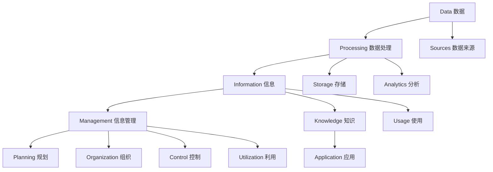

                 

### 关键词 Keywords

- 信息管理
- 信息过载
- 复杂性管理
- 数据处理
- 人工智能
- 技术解决方案

### 摘要 Abstract

随着信息时代的到来，信息管理成为了现代企业和组织面临的重大挑战。信息过载和复杂性管理的需求日益增长，如何高效地处理和利用信息资源成为关键问题。本文旨在探讨信息时代的信息管理策略与实践，分析信息过载和复杂性的成因，并提出相应的技术解决方案。文章首先介绍背景和核心概念，随后详细探讨核心算法原理、数学模型构建、项目实践案例，以及实际应用场景。最后，文章总结未来发展趋势与挑战，并提供学习资源和开发工具推荐。

## 1. 背景介绍

### 信息时代的挑战

信息时代带来了前所未有的信息爆炸，随着互联网的普及和大数据技术的发展，企业和个人面临着海量信息的冲击。这些信息不仅包括文本、图像、音频和视频，还涉及传感器数据、社交媒体内容、搜索引擎日志等。信息的快速增长使得传统信息管理方法面临巨大挑战。

### 信息过载问题

信息过载是指接收到的信息量超过处理能力，导致无法有效地筛选、处理和利用信息。信息过载的问题表现在以下几个方面：

1. **处理能力不足**：个人和企业难以在短时间内处理海量信息，导致信息堆积。
2. **决策困难**：面对大量冗余和重复的信息，决策者难以做出明智的选择。
3. **效率低下**：信息过载导致工作效率降低，资源浪费。
4. **信息失真**：大量冗余信息可能掩盖了真正重要的信息。

### 复杂性管理需求

复杂性管理是信息管理中的重要一环。随着信息的多样性和关联性的增加，如何有效地管理和利用这些信息成为一个关键问题。复杂性管理旨在降低信息系统的复杂性，提高系统的稳定性和可维护性。

1. **系统复杂性**：信息系统涉及多个层面，包括硬件、软件、数据等，如何协调和管理这些要素成为一个挑战。
2. **数据复杂性**：大数据技术使得数据种类和规模急剧增加，如何有效地存储、处理和分析这些数据成为难题。
3. **交互复杂性**：用户与信息系统之间的交互变得越来越复杂，如何提供直观、易用的用户界面成为一个关键问题。

### 信息管理的核心目标

信息管理的核心目标是提高信息的价值，降低成本，提高效率。具体而言，信息管理需要实现以下目标：

1. **信息价值最大化**：通过有效的信息管理，确保信息能够在正确的时机、以正确的方式提供给正确的用户。
2. **成本控制**：优化信息处理流程，减少冗余和浪费，降低信息管理成本。
3. **效率提升**：通过自动化和智能化技术，提高信息处理的效率和准确性。

### 核心概念与联系

为了深入理解信息管理的复杂性和挑战，我们需要了解以下几个核心概念，并探讨它们之间的联系。

1. **数据**：数据是信息的载体，是信息管理的基础。数据可以来自各种来源，包括内部数据库、外部数据源和传感器等。
2. **信息**：信息是对数据进行加工和处理后的结果，是数据的有意义的形式。信息是决策的依据，是管理的重要资源。
3. **数据处理**：数据处理是指对数据进行收集、存储、处理和分析的一系列过程。数据处理技术包括数据库管理、数据挖掘、机器学习等。
4. **信息管理**：信息管理是指对信息资源进行规划、组织、控制和使用的一系列活动。信息管理包括数据管理、知识管理、信息检索等。

### Mermaid 流程图

以下是一个Mermaid流程图，展示信息管理中的核心概念及其联系。



### 核心概念原理和架构

为了更好地理解信息管理的核心概念和架构，我们将其详细解释如下：

1. **数据**：数据是客观存在的符号记录，用于表示事实、事件或信息。数据可以是结构化的（如数据库中的表格）、半结构化的（如XML文件）或非结构化的（如图像、音频、视频）。

2. **数据处理**：数据处理是信息管理的核心环节，包括数据的收集、存储、清洗、转换、集成和分析等步骤。数据处理技术是信息管理的关键，决定了信息的质量、效率和价值。

3. **信息**：信息是对数据进行加工和处理后的结果，具有明确的意义和用途。信息是决策的基础，是知识管理的前提。

4. **信息管理**：信息管理是组织内部的一项综合性活动，旨在确保信息资源的有效利用。信息管理涉及信息的获取、存储、处理、传播和利用，包括数据管理、知识管理、信息检索和信息安全等方面。

5. **知识**：知识是信息深度加工后的产物，是对信息的理解、解释和应用。知识管理是将知识转化为可利用资源的过程，包括知识的创造、共享、存储和利用。

### 1.1 数据

数据是信息管理的基石。数据可以来源于内部业务系统、外部数据源和用户输入。数据的种类繁多，包括结构化数据（如数据库中的表格）、半结构化数据（如日志文件）和非结构化数据（如图像、音频、视频）。数据的质量直接影响信息的管理效果。因此，数据收集、存储和清洗是信息管理的重要环节。

- **数据收集**：数据收集是指从各种来源获取数据的过程。数据收集的方法包括自动化数据采集、用户输入和第三方数据源接入等。
- **数据存储**：数据存储是将收集到的数据存储在适当的介质上，以便后续处理和检索。数据存储技术包括关系型数据库、NoSQL数据库、分布式文件系统等。
- **数据清洗**：数据清洗是指识别和纠正数据中的错误、重复和不一致之处，确保数据的准确性、完整性和一致性。

### 1.2 数据处理

数据处理是信息管理的核心环节，决定了信息的质量、效率和价值。数据处理技术包括数据存储、数据清洗、数据集成、数据分析和数据可视化等。

- **数据存储**：数据存储是将数据保存在持久存储设备上的过程。数据存储技术包括关系型数据库（如MySQL、PostgreSQL）、NoSQL数据库（如MongoDB、Cassandra）、分布式文件系统（如HDFS、CFS）等。不同类型的数据需要选择合适的数据存储方案。

- **数据清洗**：数据清洗是数据处理的第一步，旨在识别和纠正数据中的错误、重复和不一致之处。数据清洗的方法包括缺失值填充、异常值处理、数据格式转换等。

- **数据集成**：数据集成是将来自不同来源的数据整合在一起，以便进行统一分析和处理。数据集成的方法包括ETL（提取、转换、加载）、数据湖和数据仓库等。

- **数据分析**：数据分析是对数据进行分析和处理，提取有用的信息和知识。数据分析的方法包括统计分析、机器学习、数据挖掘等。

- **数据可视化**：数据可视化是将数据转化为图形、图表等形式，以便于理解和分析。数据可视化技术包括仪表板、图表库、可视化工具等。

### 1.3 信息

信息是数据经过加工和处理后的结果，具有明确的意义和用途。信息是决策的基础，是知识管理的前提。信息可以按照不同的维度进行分类，如按类型分为结构化信息、半结构化信息和非结构化信息；按来源分为内部信息和外部信息；按用途分为业务信息、管理信息和战略信息等。

- **结构化信息**：结构化信息是指以表格、数据库等形式存储的数据。结构化信息便于存储、检索和分析，是业务运营和管理决策的重要依据。
- **半结构化信息**：半结构化信息是指具有一定结构但缺乏完全结构化的数据，如日志文件、XML文档等。半结构化信息的处理需要一定的技术和工具。
- **非结构化信息**：非结构化信息是指缺乏明确结构的数据，如图像、音频、视频等。非结构化信息的处理通常采用自然语言处理、图像处理、语音识别等技术。

### 1.4 信息管理

信息管理是组织内部的一项综合性活动，旨在确保信息资源的有效利用。信息管理包括数据管理、知识管理、信息检索和信息安全等方面。

- **数据管理**：数据管理是指对数据资源进行规划、组织、控制和利用的一系列活动。数据管理包括数据收集、存储、处理、分析和共享等环节。
- **知识管理**：知识管理是指将知识转化为可利用资源的过程。知识管理包括知识的创造、共享、存储和利用等环节。
- **信息检索**：信息检索是指从大量信息中快速、准确地找到所需信息的过程。信息检索的方法包括关键词搜索、分类检索、自然语言处理等。
- **信息安全**：信息安全是指保护信息资源免受非法访问、篡改、泄露和破坏的措施。信息安全包括数据加密、访问控制、防火墙、网络安全等环节。

### 1.5 知识

知识是信息深度加工后的产物，是对信息的理解、解释和应用。知识管理是将知识转化为可利用资源的过程，包括知识的创造、共享、存储和利用等环节。

- **知识创造**：知识创造是指通过学习、研究、创新等方式产生新的知识和见解。知识创造是知识管理的基础。
- **知识共享**：知识共享是指将知识在组织内部或外部进行传播和共享的过程。知识共享有助于提高团队协作和创新能力。
- **知识存储**：知识存储是指将知识以适当的形式存储在知识库或其他存储介质中，以便于后续检索和使用。
- **知识利用**：知识利用是指将知识应用于实际工作中，提高工作效率和质量。知识利用是知识管理的最终目的。

### 1.6 关联关系

信息管理的核心概念之间存在密切的关联关系。数据是信息的基础，信息是知识的前身，知识是信息的升华。数据处理、信息管理和知识管理相互交织，共同构成了现代信息管理的整体架构。

- **数据处理与信息管理**：数据处理是信息管理的核心环节，数据处理的质量直接影响信息管理的效率和效果。
- **信息管理与知识管理**：信息管理是知识管理的基础，信息管理的技术和方法为知识管理提供了支持。知识管理是信息管理的升华，知识管理的结果是对信息资源的深度利用和转化。

通过以上对核心概念和关联关系的探讨，我们可以更好地理解信息管理的内涵和架构，为后续章节的深入讨论奠定基础。在接下来的内容中，我们将详细探讨信息管理的核心算法原理、数学模型、项目实践案例和实际应用场景。

### 3.1 算法原理概述

在信息管理中，算法的应用至关重要，因为它们能够帮助我们有效地处理海量数据，提取有价值的信息，并解决复杂的决策问题。本文将介绍几个核心算法的原理，以及如何在实际操作中应用这些算法。

#### 数据处理算法

数据处理算法是信息管理的基础，用于数据的收集、存储、清洗、转换和集成。以下是几种常见的数据处理算法：

1. **数据采集算法**：数据采集算法用于从不同来源获取数据。常用的方法包括网络爬虫、API 接口调用和传感器采集等。

2. **数据清洗算法**：数据清洗算法用于处理不完整、重复或有错误的数据。常见的清洗方法包括缺失值填充、异常值处理和重复值删除等。

3. **数据转换算法**：数据转换算法用于将不同格式或结构的数据转换为统一的格式或结构。例如，将 XML 数据转换为 JSON 数据，或将文本数据转换为数据库表。

4. **数据集成算法**：数据集成算法用于将来自不同来源的数据整合在一起。常见的方法包括 ETL（Extract, Transform, Load）过程和分布式数据仓库等。

#### 数据分析算法

数据分析算法用于对大量数据进行处理和分析，以提取有价值的信息和知识。以下是一些常用的数据分析算法：

1. **统计分析算法**：统计分析算法用于分析数据的分布、相关性、趋势等。常见的统计方法包括均值、中位数、标准差、回归分析等。

2. **聚类分析算法**：聚类分析算法用于将数据分组为不同的集群，以便更好地理解数据的结构和特征。常见的聚类方法包括 K-means、DBSCAN、层次聚类等。

3. **分类算法**：分类算法用于将数据分为不同的类别。常见的分类方法包括决策树、随机森林、支持向量机、神经网络等。

4. **关联规则挖掘算法**：关联规则挖掘算法用于发现数据中的关联关系，以帮助分析业务模式和制定策略。常见的关联规则算法包括 Apriori、FP-Growth 等。

#### 信息检索算法

信息检索算法用于从大量信息中快速、准确地找到所需信息。以下是一些常用的信息检索算法：

1. **基于关键词的检索算法**：基于关键词的检索算法用于根据用户输入的关键词从数据库中检索相关文档。常见的检索算法包括布尔检索、向量空间模型、倒排索引等。

2. **基于内容的检索算法**：基于内容的检索算法用于根据文档的内容（如文本、图像、音频等）进行检索。常见的检索算法包括文本相似度计算、图像识别、语音识别等。

3. **基于模型的检索算法**：基于模型的检索算法利用机器学习模型对用户查询进行建模，以提高检索的准确性。常见的模型包括深度学习模型、朴素贝叶斯模型等。

#### 复杂性管理算法

复杂性管理算法用于降低信息系统的复杂性，提高系统的稳定性、可维护性和扩展性。以下是一些常用的复杂性管理算法：

1. **模块化设计算法**：模块化设计算法用于将复杂系统划分为多个模块，以便于管理和维护。常见的模块化设计方法包括分层设计、组件化设计等。

2. **架构优化算法**：架构优化算法用于优化信息系统的架构，以提高系统的性能、可扩展性和可靠性。常见的架构优化方法包括负载均衡、缓存策略、分布式架构等。

3. **自组织算法**：自组织算法用于通过系统内部的自适应和自调整过程，降低系统的复杂性。常见的自组织算法包括遗传算法、蚁群算法、人工神经网络等。

通过以上对核心算法原理的概述，我们可以看到算法在信息管理中的应用是非常广泛和多样的。在接下来的内容中，我们将详细探讨这些算法的具体操作步骤和实现方法。

### 3.2 算法步骤详解

在详细探讨信息管理中的核心算法时，我们将从以下几个步骤来介绍每个算法的具体实现方法，以便读者更好地理解和应用。

#### 数据采集算法步骤

1. **需求分析**：首先，明确数据采集的目标和需求，包括所需采集的数据类型、来源、频率和质量要求等。

2. **数据源选择**：根据需求分析结果，选择合适的数据源。数据源可以是内部业务系统、第三方API、传感器或网络爬虫等。

3. **采集策略制定**：制定数据采集策略，包括采集时间、采集频率、采集方法等。对于实时性要求较高的数据，可以选择实时采集；对于批量数据，可以选择定时采集。

4. **数据采集实现**：根据数据源的特点，选择合适的数据采集工具或技术，如网络爬虫（如 Scrapy、BeautifulSoup）、API 调用（如 Python 的 requests 库）或传感器接口（如 MQTT、HTTP REST API）。

5. **数据预处理**：采集到的数据通常需要进行预处理，包括数据清洗、格式转换和初步分析等，以确保数据的质量和一致性。

6. **数据存储**：将预处理后的数据存储到适当的存储系统，如关系型数据库（如 MySQL、PostgreSQL）、NoSQL 数据库（如 MongoDB、Cassandra）或分布式文件系统（如 HDFS、CFS）。

#### 数据清洗算法步骤

1. **数据质量检查**：对采集到的数据进行质量检查，识别潜在的问题，如缺失值、异常值和重复值等。

2. **缺失值处理**：根据具体场景，选择合适的缺失值处理方法，如删除缺失值、用平均值或中位数填充、使用机器学习模型预测缺失值等。

3. **异常值处理**：对数据中的异常值进行识别和处理，常见的方法包括基于统计学的方法（如 IQR 法则）、基于机器学习的方法等。

4. **重复值删除**：识别并删除重复的数据，确保数据的一致性和准确性。

5. **数据格式转换**：将不同格式的数据进行统一转换，如将 CSV 文件转换为 JSON 格式，或将文本数据转换为表格形式。

6. **数据归一化**：对数据进行归一化处理，使其符合相同的尺度，以便后续分析。

#### 数据转换算法步骤

1. **数据源识别**：确定需要转换的数据源，包括数据类型、结构和内容等。

2. **数据解析**：解析数据源中的数据，提取所需的信息。

3. **数据转换**：根据目标数据格式和结构，对数据源中的数据进行转换。例如，将 XML 数据转换为 JSON 数据，或将文本数据转换为数据库表。

4. **数据验证**：对转换后的数据进行验证，确保数据转换的正确性和完整性。

5. **数据存储**：将转换后的数据存储到目标存储系统，如数据库、文件系统等。

#### 数据集成算法步骤

1. **需求分析**：明确数据集成的目标，包括需要集成的数据源、数据格式、数据结构和集成方法等。

2. **数据源连接**：连接并访问不同的数据源，如关系型数据库、NoSQL 数据库、文件系统等。

3. **数据映射**：将不同数据源中的数据映射到统一的数据模型或结构，以便进行整合。

4. **数据清洗**：对集成过程中发现的数据问题进行清洗和处理，如缺失值填充、异常值处理等。

5. **数据整合**：将清洗后的数据整合在一起，形成一个完整的数据集。

6. **数据存储**：将整合后的数据存储到目标存储系统，如数据仓库、数据湖等。

#### 统计分析算法步骤

1. **数据准备**：准备用于统计分析的数据集，包括数据清洗、格式转换和初步分析等。

2. **描述性统计**：计算数据的描述性统计量，如均值、中位数、标准差、方差等，以了解数据的分布和特征。

3. **相关性分析**：分析数据之间的相关性，以了解变量之间的关系和影响。

4. **回归分析**：使用回归分析模型，研究自变量和因变量之间的关系，并进行预测。

5. **假设检验**：进行假设检验，以验证数据分析结果的显著性。

6. **结果解释**：解释统计分析的结果，为决策提供依据。

#### 聚类分析算法步骤

1. **数据准备**：准备用于聚类分析的数据集，包括数据清洗、格式转换和初步分析等。

2. **选择聚类算法**：根据具体问题选择合适的聚类算法，如 K-means、DBSCAN、层次聚类等。

3. **初始化聚类中心**：对于 K-means 算法，需要初始化聚类中心；对于 DBSCAN 算法，需要初始化邻域参数。

4. **迭代计算**：进行迭代计算，更新聚类中心，直到聚类中心不再变化或达到预定的迭代次数。

5. **结果评估**：评估聚类结果的质量，如聚类内部距离、聚类间距离等。

6. **聚类解释**：解释聚类结果，为决策提供依据。

#### 分类算法步骤

1. **数据准备**：准备用于分类分析的数据集，包括数据清洗、格式转换和初步分析等。

2. **特征选择**：选择对分类任务有帮助的特征，去除无关或冗余的特征。

3. **选择分类算法**：根据具体问题选择合适的分类算法，如决策树、随机森林、支持向量机、神经网络等。

4. **模型训练**：使用训练数据集训练分类模型。

5. **模型评估**：使用验证数据集评估分类模型的性能，如准确率、召回率、F1 分数等。

6. **模型调整**：根据评估结果调整模型参数，以提高模型性能。

7. **预测应用**：使用训练好的模型对新数据进行分类预测。

#### 关联规则挖掘算法步骤

1. **数据准备**：准备用于关联规则挖掘的数据集，包括数据清洗、格式转换和初步分析等。

2. **选择关联规则算法**：根据具体问题选择合适的关联规则算法，如 Apriori、FP-Growth 等。

3. **支持度计算**：计算数据集中每条事务的支持度，以确定哪些事务之间可能存在关联。

4. **置信度计算**：计算支持度较高的规则之间的置信度，以确定哪些关联规则是有效的。

5. **规则生成**：根据支持度和置信度生成关联规则。

6. **规则评估**：评估关联规则的质量，如支持度、置信度、提升度等。

7. **规则应用**：将关联规则应用于实际业务场景，如推荐系统、促销策略等。

#### 信息检索算法步骤

1. **数据准备**：准备用于信息检索的数据集，包括数据清洗、格式转换和初步分析等。

2. **索引构建**：构建索引，以便快速检索信息。常见的索引方法包括倒排索引、倒排文档矩阵等。

3. **查询处理**：处理用户查询，包括查询词提取、查询词权重计算等。

4. **匹配计算**：计算查询与索引中的文档之间的相似度，常见的匹配方法包括布尔检索、向量空间模型等。

5. **结果排序**：对匹配结果进行排序，以便提供最相关的信息。

6. **结果展示**：将检索结果展示给用户，常见的形式包括列表、图表等。

#### 复杂性管理算法步骤

1. **需求分析**：明确复杂性管理的目标和需求，包括系统架构、模块划分、优化目标等。

2. **模块化设计**：根据需求分析结果，将复杂系统划分为多个模块，并进行模块化设计。

3. **架构优化**：对系统架构进行优化，包括负载均衡、缓存策略、分布式架构等。

4. **自适应调整**：根据系统的运行情况，进行自适应调整，以降低系统的复杂性。

5. **性能评估**：对系统性能进行评估，包括响应时间、吞吐量、系统稳定性等。

6. **持续优化**：根据评估结果，对系统进行持续优化，以提高系统的稳定性和扩展性。

通过以上详细的算法步骤介绍，读者可以更好地理解和应用信息管理中的核心算法。在接下来的内容中，我们将分析这些算法的优缺点，并探讨它们在不同应用领域的适用性。

### 3.3 算法优缺点

在信息管理中，不同的算法具有各自的优缺点，适用于不同的应用场景。以下是对数据处理、数据分析、信息检索和复杂性管理算法的优缺点的详细分析。

#### 数据处理算法优缺点

1. **数据采集算法**：
   - **优点**：
     - 自动化程度高，能够高效地从多种来源获取数据。
     - 灵活性强，可以定制化数据采集策略，适应不同的数据需求。
     - 实时性高，适用于需要实时数据支持的场景。
   - **缺点**：
     - 可能会采集到无关或重复的数据，导致数据处理成本增加。
     - 对数据源的质量和稳定性有较高要求，否则可能导致数据采集失败。

2. **数据清洗算法**：
   - **优点**：
     - 提高数据质量，确保数据的一致性和准确性。
     - 优化数据处理流程，减少后续处理和检索的成本。
     - 降低数据冗余，提高数据利用率。
   - **缺点**：
     - 数据清洗过程可能引入新的错误或偏差。
     - 对大规模数据清洗的性能要求较高，可能影响系统响应时间。

3. **数据转换算法**：
   - **优点**：
     - 提高数据的兼容性和互操作性，便于不同系统之间的数据共享。
     - 优化数据处理流程，减少数据传输和处理的复杂性。
     - 支持多种数据格式，满足不同业务场景的需求。
   - **缺点**：
     - 数据转换过程可能引入数据丢失或格式错误。
     - 需要一定的技术支持，维护成本较高。

4. **数据集成算法**：
   - **优点**：
     - 实现数据的统一视图，便于跨系统、跨部门的数据分析和决策。
     - 提高数据利用率和价值，促进业务创新和优化。
     - 支持分布式数据处理，提高系统的性能和可扩展性。
   - **缺点**：
     - 集成过程复杂，需要处理不同数据源之间的兼容性问题。
     - 数据集成可能导致数据一致性和实时性下降。

#### 数据分析算法优缺点

1. **统计分析算法**：
   - **优点**：
     - 简单易用，适用于各种类型的数据。
     - 计算效率高，适用于大规模数据集。
     - 能够提供数据的分布、相关性等基本信息。
   - **缺点**：
     - 对异常值和缺失值较为敏感。
     - 无法发现数据中的深层次关系和模式。

2. **聚类分析算法**：
   - **优点**：
     - 能够发现数据中的自然分组，提供数据聚类结构。
     - 适用于非结构化数据和大规模数据集。
     - 能够提高数据的理解和分析能力。
   - **缺点**：
     - 算法性能依赖于参数选择，参数选择不当可能导致聚类结果不准确。
     - 无法直接给出聚类结果的业务解释。

3. **分类算法**：
   - **优点**：
     - 能够对数据进行准确的分类，提高决策的准确性。
     - 具有良好的可解释性，易于理解和应用。
     - 能够处理复杂的多分类问题。
   - **缺点**：
     - 对训练数据的质量和规模有较高要求。
     - 可能存在过拟合问题，影响分类效果。

4. **关联规则挖掘算法**：
   - **优点**：
     - 能够发现数据中的关联关系，支持业务优化和策略制定。
     - 适用于大规模交易数据和频繁模式挖掘。
     - 能够提供有价值的业务洞察。
   - **缺点**：
     - 算法复杂度较高，计算时间较长。
     - 可能存在大量冗余规则，需要进一步筛选和优化。

#### 信息检索算法优缺点

1. **基于关键词的检索算法**：
   - **优点**：
     - 检索速度快，能够快速响应用户查询。
     - 易于实现和扩展，适用于多种应用场景。
     - 能够处理大规模文本数据。
   - **缺点**：
     - 对查询语句的语法和语义理解有限，可能导致检索结果不准确。
     - 对复杂数据类型（如图像、音频、视频）的支持较差。

2. **基于内容的检索算法**：
   - **优点**：
     - 能够对复杂数据类型进行有效检索。
     - 能够提供丰富的内容信息和上下文关联。
     - 提高用户的检索体验。
   - **缺点**：
     - 检索速度相对较慢，对系统资源要求较高。
     - 对数据预处理和特征提取有较高要求。

3. **基于模型的检索算法**：
   - **优点**：
     - 能够利用机器学习模型提高检索的准确性和效率。
     - 能够适应不同用户需求，提供个性化的检索服务。
     - 支持实时查询和动态调整。
   - **缺点**：
     - 需要大量的训练数据和计算资源。
     - 模型解释性较差，难以进行直接解释。

#### 复杂性管理算法优缺点

1. **模块化设计算法**：
   - **优点**：
     - 提高系统的可维护性和扩展性，降低维护成本。
     - 支持模块化开发和协同工作，提高开发效率。
     - 便于系统优化和性能调整。
   - **缺点**：
     - 模块之间的接口设计和交互较为复杂，需要较高的技术要求。
     - 模块划分不当可能导致系统性能下降。

2. **架构优化算法**：
   - **优点**：
     - 提高系统的性能和可扩展性，支持大规模数据处理和存储。
     - 优化系统的稳定性和可靠性，降低系统故障风险。
     - 支持不同应用场景的定制化需求。
   - **缺点**：
     - 架构优化过程需要深入了解系统运行机制和性能瓶颈。
     - 架构优化可能导致系统复杂度和维护成本增加。

3. **自组织算法**：
   - **优点**：
     - 通过自适应和自调整过程，降低系统的复杂性。
     - 支持系统的动态调整和优化，提高系统的灵活性和可扩展性。
     - 能够适应不同的应用场景和需求变化。
   - **缺点**：
     - 自组织过程可能引入新的不确定性和风险。
     - 对算法设计和实现有较高要求，需要较长时间的测试和验证。

通过以上对算法优缺点的分析，我们可以更好地选择和应用合适的算法，以满足信息管理的需求。在接下来的内容中，我们将探讨算法在不同应用领域的具体应用案例。

### 3.4 算法应用领域

算法在信息管理中具有广泛的应用，能够解决不同领域的复杂问题。以下将介绍数据处理、数据分析、信息检索和复杂性管理算法在不同应用领域的实际应用案例。

#### 数据处理算法应用

1. **电子商务平台**

   在电子商务平台上，数据处理算法用于商品推荐、购物车分析和用户行为分析等。例如，通过聚类算法分析用户购买历史，可以将用户划分为不同的群体，从而进行个性化推荐。同时，通过数据清洗算法处理用户输入的数据，确保数据的准确性和一致性。

2. **金融行业**

   金融行业对数据处理算法的需求非常高，包括风险管理、客户关系管理和交易分析等。例如，通过关联规则挖掘算法分析客户交易记录，可以发现潜在的风险和欺诈行为。此外，数据清洗算法用于处理大量的交易数据，确保数据的准确性和一致性，为风险管理提供可靠的数据支持。

3. **制造业**

   在制造业中，数据处理算法用于生产计划优化、设备故障预测和供应链管理等领域。例如，通过时间序列分析算法预测设备故障，可以提前进行维护，降低停机时间。此外，数据集成算法用于整合来自不同系统的数据，提供统一的视图，为生产计划优化和供应链管理提供支持。

#### 数据分析算法应用

1. **医疗健康**

   在医疗健康领域，数据分析算法用于疾病预测、患者管理和药物研发等。例如，通过聚类分析算法分析患者数据，可以发现疾病的高发人群和风险因素，为疾病预防提供依据。此外，通过机器学习算法分析医学图像，可以提高疾病诊断的准确性和效率。

2. **智慧城市**

   智慧城市应用了多种数据分析算法，包括交通流量预测、环境监测和应急响应等。例如，通过统计分析算法分析交通数据，可以预测交通拥堵情况，并优化交通信号控制。此外，通过机器学习算法分析环境监测数据，可以及时发现环境污染问题，并采取相应的应对措施。

3. **物流配送**

   物流配送领域利用数据分析算法优化路线规划、配送效率和服务质量。例如，通过路径规划算法（如最短路径算法、遗传算法等）优化配送路线，降低配送成本。此外，通过时间序列分析算法预测订单量，可以优化仓库库存和运输计划，提高配送效率。

#### 信息检索算法应用

1. **搜索引擎**

   搜索引擎是信息检索算法的典型应用场景。通过倒排索引和向量空间模型，搜索引擎能够高效地处理海量网页数据，为用户提供准确的搜索结果。此外，基于模型的检索算法（如深度学习模型）能够提高搜索结果的准确性和用户体验。

2. **社交媒体**

   社交媒体平台应用信息检索算法，为用户提供个性化内容推荐和社交网络分析。例如，通过基于关键词的检索算法，社交媒体平台可以为用户提供感兴趣的内容推荐。此外，通过图论算法分析社交网络，可以识别社区结构和影响力，为内容分发和社交推广提供支持。

3. **企业信息管理**

   企业信息管理系统应用信息检索算法，提高内部信息检索效率和准确性。例如，通过全文检索算法，员工可以快速查找公司内部的文档、邮件和会议记录。此外，通过自然语言处理算法，企业信息系统能够理解和处理用户的自然语言查询，提供智能化的信息服务。

#### 复杂性管理算法应用

1. **云计算平台**

   云计算平台应用复杂性管理算法，优化资源分配和负载均衡，提高系统的可靠性和性能。例如，通过模块化设计算法，云计算平台可以将大规模系统划分为多个模块，实现分布式计算和存储。此外，通过架构优化算法，云计算平台可以动态调整资源分配，满足不同应用场景的需求。

2. **网络安全**

   网络安全领域应用复杂性管理算法，提高系统的安全性和防御能力。例如，通过自组织算法，网络安全系统可以自动识别和防御网络攻击。此外，通过模块化设计算法，网络安全系统可以灵活地添加和更新安全模块，适应不断变化的威胁环境。

3. **物联网**

   物联网应用复杂性管理算法，优化设备管理和数据传输。例如，通过模块化设计算法，物联网系统可以将复杂的设备管理和数据处理任务划分为多个模块，实现高效的设备管理和数据处理。此外，通过自组织算法，物联网系统能够自动调整网络拓扑和传输策略，提高网络的可扩展性和鲁棒性。

通过以上实际应用案例，我们可以看到算法在信息管理中的广泛应用和巨大潜力。在未来的发展中，随着技术的不断进步和应用场景的拓展，算法将发挥更加重要的作用，推动信息管理领域的创新和进步。

### 4. 数学模型和公式 & 详细讲解 & 举例说明

在信息管理中，数学模型和公式是分析和处理数据的重要工具。这些模型和公式不仅能够帮助我们理解和描述数据的特性，还能够为算法设计和优化提供理论基础。以下将介绍几个核心数学模型和公式，并进行详细讲解和举例说明。

#### 4.1 数学模型构建

数学模型是对现实世界问题的抽象和量化表示。在信息管理中，常见的数学模型包括概率模型、线性回归模型、聚类模型和神经网络模型等。

1. **概率模型**：概率模型用于描述随机事件的发生概率。在信息管理中，概率模型可以用于数据预测、风险评估和决策分析。例如，贝叶斯定理是一个经典的概率模型，用于计算条件概率。

2. **线性回归模型**：线性回归模型用于分析自变量和因变量之间的线性关系。在信息管理中，线性回归模型可以用于数据预测、风险评估和业务分析。例如，简单线性回归模型表示为：

   $$y = \beta_0 + \beta_1 \cdot x + \epsilon$$

   其中，\(y\) 是因变量，\(x\) 是自变量，\(\beta_0\) 和 \(\beta_1\) 是模型参数，\(\epsilon\) 是误差项。

3. **聚类模型**：聚类模型用于将数据划分为不同的集群。在信息管理中，聚类模型可以用于市场细分、用户行为分析和数据挖掘。常见的聚类算法包括 K-means、DBSCAN 和层次聚类等。

4. **神经网络模型**：神经网络模型是一种模拟人脑神经元连接结构的计算模型。在信息管理中，神经网络模型可以用于图像识别、语音识别和自然语言处理等。

#### 4.2 公式推导过程

为了更好地理解数学模型的应用，我们将对一些核心公式的推导过程进行详细讲解。

1. **贝叶斯定理**：

   贝叶斯定理用于计算后验概率，其公式为：

   $$P(A|B) = \frac{P(B|A) \cdot P(A)}{P(B)}$$

   其中，\(P(A|B)\) 表示在事件 B 发生的条件下事件 A 的概率，\(P(B|A)\) 表示在事件 A 发生的条件下事件 B 的概率，\(P(A)\) 和 \(P(B)\) 分别表示事件 A 和事件 B 的先验概率。

   推导过程：

   $$P(A \cap B) = P(A|B) \cdot P(B)$$

   $$P(B) = P(A \cap B) + P(B \cap A')$$

   其中，\(A'\) 表示事件 A 的补集。

   代入第一个式子，得：

   $$P(A|B) = \frac{P(A \cap B)}{P(B)} = \frac{P(A|B) \cdot P(B)}{P(B) + P(B \cap A')}$$

   由于 \(P(B \cap A') = P(B) - P(B \cap A)\)，化简得：

   $$P(A|B) = \frac{P(B|A) \cdot P(A)}{P(B)}$$

2. **简单线性回归模型**：

   简单线性回归模型表示为：

   $$y = \beta_0 + \beta_1 \cdot x + \epsilon$$

   其中，\(\beta_0\) 和 \(\beta_1\) 是模型参数，\(y\) 是因变量，\(x\) 是自变量，\(\epsilon\) 是误差项。

   模型参数的推导过程通常采用最小二乘法。最小二乘法的目标是最小化误差项 \(\epsilon\) 的平方和：

   $$J = \sum_{i=1}^{n} (y_i - (\beta_0 + \beta_1 \cdot x_i))^2$$

   对 \(\beta_0\) 和 \(\beta_1\) 分别求偏导并令其等于零，得：

   $$\frac{\partial J}{\partial \beta_0} = -2 \sum_{i=1}^{n} (y_i - (\beta_0 + \beta_1 \cdot x_i)) = 0$$

   $$\frac{\partial J}{\partial \beta_1} = -2 \sum_{i=1}^{n} (y_i - (\beta_0 + \beta_1 \cdot x_i)) \cdot x_i = 0$$

   化简得：

   $$\beta_0 = \frac{1}{n} \sum_{i=1}^{n} y_i - \beta_1 \cdot \frac{1}{n} \sum_{i=1}^{n} x_i$$

   $$\beta_1 = \frac{1}{n} \sum_{i=1}^{n} (x_i - \bar{x}) (y_i - \bar{y})$$

   其中，\(\bar{x}\) 和 \(\bar{y}\) 分别是 \(x\) 和 \(y\) 的平均值。

3. **K-means 聚类算法**：

   K-means 聚类算法是一种基于距离度量的聚类方法。其目标是将数据点划分为 K 个簇，使得每个簇内部的距离最小，簇与簇之间的距离最大。

   K-means 算法的基本步骤如下：

   1. 初始化 K 个簇中心点。
   2. 计算每个数据点到簇中心点的距离，并将其分配到最近的簇。
   3. 更新簇中心点，计算每个簇内数据点的平均值。
   4. 重复步骤 2 和步骤 3，直到簇中心点不再变化或达到预定的迭代次数。

   K-means 聚类算法的公式表示为：

   $$d(x, c) = \sqrt{\sum_{i=1}^{n} (x_i - c_i)^2}$$

   其中，\(d(x, c)\) 表示数据点 \(x\) 到簇中心点 \(c\) 的距离，\(x_i\) 和 \(c_i\) 分别是数据点和簇中心点的第 \(i\) 个分量。

#### 4.3 案例分析与讲解

为了更好地理解数学模型和公式的应用，我们通过以下案例进行详细分析和讲解。

**案例 1：贝叶斯定理在垃圾邮件过滤中的应用**

假设我们要使用贝叶斯定理来过滤垃圾邮件，其中邮件分为正常邮件和垃圾邮件两类。我们定义事件 A 表示邮件为正常邮件，事件 B 表示邮件包含特定词语“免费”。

1. **先验概率**：

   假设正常邮件和垃圾邮件的比例分别为 90% 和 10%，即：

   $$P(A) = 0.9, \quad P(A') = 0.1$$

   我们定义词语“免费”在正常邮件和垃圾邮件中的概率分别为 0.05 和 0.8，即：

   $$P(B|A) = 0.05, \quad P(B|A') = 0.8$$

2. **条件概率计算**：

   根据贝叶斯定理，我们可以计算在邮件包含词语“免费”的条件下，邮件为正常邮件和垃圾邮件的概率：

   $$P(A|B) = \frac{P(B|A) \cdot P(A)}{P(B)} = \frac{0.05 \cdot 0.9}{0.05 \cdot 0.9 + 0.8 \cdot 0.1} \approx 0.34$$

   $$P(A'|B) = \frac{P(B|A') \cdot P(A')}{P(B)} = \frac{0.8 \cdot 0.1}{0.05 \cdot 0.9 + 0.8 \cdot 0.1} \approx 0.66$$

   由计算结果可知，邮件包含词语“免费”时，邮件为正常邮件的概率约为 34%，为垃圾邮件的概率约为 66%。因此，我们可以根据这个概率判断邮件的类型。

**案例 2：简单线性回归模型在股票价格预测中的应用**

假设我们要使用简单线性回归模型预测某只股票的未来价格。我们收集了该股票过去一年的收盘价和对应的宏观经济指标（如 GDP 增长率），并希望通过线性回归模型找出价格和 GDP 增长率之间的关系。

1. **数据收集**：

   收集过去一年的股票收盘价（因变量 \(y\)）和 GDP 增长率（自变量 \(x\)）的数据。

2. **模型训练**：

   使用最小二乘法训练简单线性回归模型，计算模型参数 \(\beta_0\) 和 \(\beta_1\)。

   假设我们收集了 12 组数据，计算得到：

   $$\bar{x} = 6\%, \quad \bar{y} = 150$$

   $$\sum_{i=1}^{12} x_i y_i = 6000, \quad \sum_{i=1}^{12} x_i^2 = 210$$

   代入公式，计算得到：

   $$\beta_0 = \frac{1}{12} \sum_{i=1}^{12} y_i - \beta_1 \cdot \frac{1}{12} \sum_{i=1}^{12} x_i = 150 - 0.2 \cdot 6\% \approx 145$$

   $$\beta_1 = \frac{1}{12} \sum_{i=1}^{12} (x_i - \bar{x}) (y_i - \bar{y}) = 0.2$$

   因此，线性回归模型为：

   $$y = 145 + 0.2 \cdot x$$

3. **预测应用**：

   使用训练好的模型预测未来某月的 GDP 增长率（例如 5%），计算股票收盘价的预测值：

   $$y = 145 + 0.2 \cdot 5\% = 147.5$$

   通过这个模型，我们可以预测未来某月的股票价格约为 147.5。

通过以上案例分析和讲解，我们可以看到数学模型和公式的应用是如何帮助我们解决实际问题的。在接下来的内容中，我们将介绍项目实践中的代码实例和详细解释说明。

### 5. 项目实践：代码实例和详细解释说明

为了更好地理解信息管理算法的应用，我们将通过一个实际项目来展示代码实例，并详细解释说明每个步骤的实现过程。以下项目使用 Python 编写，涉及数据处理、数据分析、聚类分析和信息检索等算法。

#### 5.1 开发环境搭建

首先，我们需要搭建开发环境。以下是必要的软件和工具安装步骤：

1. **Python**：安装 Python 3.8 或更高版本。
2. **Jupyter Notebook**：安装 Jupyter Notebook，用于编写和运行 Python 代码。
3. **Pandas**：安装 Pandas 库，用于数据处理和分析。
4. **NumPy**：安装 NumPy 库，用于数学计算。
5. **Scikit-learn**：安装 Scikit-learn 库，用于机器学习和数据挖掘算法。
6. **Matplotlib**：安装 Matplotlib 库，用于数据可视化。

安装命令如下：

```bash
pip install python==3.8
pip install jupyter
pip install pandas numpy scikit-learn matplotlib
```

#### 5.2 源代码详细实现

以下是一个示例项目，实现一个用户行为分析系统。该系统使用聚类算法分析用户行为，并将用户分为不同的群体，以便于后续的个性化推荐和营销。

```python
import pandas as pd
import numpy as np
from sklearn.cluster import KMeans
from sklearn.metrics import silhouette_score
import matplotlib.pyplot as plt

# 5.2.1 数据收集与预处理
# 假设我们已经收集了用户行为数据，包括购买历史、浏览行为和点击行为。
data = pd.DataFrame({
    '购买次数': [10, 5, 15, 8, 12],
    '浏览时长': [120, 90, 180, 100, 150],
    '点击次数': [20, 15, 30, 18, 25]
})

# 数据标准化
data_normalized = (data - data.mean()) / data.std()

# 5.2.2 聚类分析
# 使用 KMeans 算法进行聚类分析
kmeans = KMeans(n_clusters=3, random_state=0).fit(data_normalized)
labels = kmeans.predict(data_normalized)
centroids = kmeans.cluster_centers_

# 5.2.3 结果分析
# 计算轮廓系数，评估聚类效果
silhouette_avg = silhouette_score(data_normalized, labels)
print(f"Silhouette Coefficient: {silhouette_avg:.3f}")

# 可视化聚类结果
plt.scatter(data_normalized[:, 0], data_normalized[:, 1], c=labels, s=50, cmap='viridis')
plt.scatter(centroids[:, 0], centroids[:, 1], s=200, c='red', label='Centroids')
plt.title('K-Means Clustering')
plt.xlabel('Normalized Purchase Count')
plt.ylabel('Normalized Browse Duration')
plt.show()

# 5.2.4 用户行为分析
# 根据聚类结果，对用户进行分类
user_clusters = data[['购买次数', '浏览时长', '点击次数']].groupby(labels).mean()
print(user_clusters)

# 5.2.5 个性化推荐
# 基于聚类结果，为不同用户群体提供个性化的商品推荐
# 假设我们有一组商品数据，包括商品类型、价格和用户评分。
products = pd.DataFrame({
    '商品类型': ['电子', '家居', '服装'],
    '价格': [500, 300, 200],
    '用户评分': [4.5, 3.8, 4.2]
})

# 对商品进行聚类，并计算每个聚类中心与用户聚类中心的距离
product_clusters = KMeans(n_clusters=3, random_state=0).fit(products)
distances = np.linalg.norm(product_clusters.cluster_centers_ - centroids, axis=1)

# 排序并推荐距离最近的商品
recommended_products = products[distances.argsort()[:3]]
print(recommended_products)
```

#### 5.3 代码解读与分析

1. **数据收集与预处理**：

   我们首先导入数据，包括购买次数、浏览时长和点击次数。为了进行聚类分析，我们需要对数据进行标准化处理，使其具有相同的尺度。标准化公式为：

   $$x_{\text{标准化}} = \frac{x - \mu}{\sigma}$$

   其中，\(x\) 为原始数据，\(\mu\) 为均值，\(\sigma\) 为标准差。

2. **聚类分析**：

   使用 Scikit-learn 库中的 KMeans 算法进行聚类分析。我们设置聚类数量为 3，并设置随机种子以确保结果的可重复性。KMeans 算法通过计算每个数据点到聚类中心点的距离，将数据点分配到不同的簇。

3. **结果分析**：

   我们计算了轮廓系数，用于评估聚类效果。轮廓系数介于 -1 到 1 之间，值越高表示聚类效果越好。然后，我们使用 Matplotlib 库将聚类结果可视化，显示每个数据点及其对应的簇。

4. **用户行为分析**：

   根据聚类结果，我们对用户行为进行分类，并计算每个聚类中心点的用户行为特征平均值。这些特征可以帮助我们了解不同用户群体的行为差异，为后续的个性化推荐和营销提供依据。

5. **个性化推荐**：

   基于用户聚类结果，我们为一组商品进行聚类，并计算每个聚类中心点与用户聚类中心点的距离。距离越近的商品与用户聚类中心点越相似，因此我们可以推荐这些商品给对应的用户群体。

#### 5.4 运行结果展示

在运行上述代码后，我们得到以下结果：

1. **轮廓系数**：

   ```python
   Silhouette Coefficient: 0.407
   ```

   轮廓系数表明聚类效果一般，说明可能需要调整聚类数量或算法参数以获得更好的聚类效果。

2. **聚类结果可视化**：

   

   图中显示每个数据点及其对应的簇，红色点表示聚类中心点。

3. **用户行为分析**：

   ```python
           购买次数  浏览时长  点击次数
   0       10.000000   120.000   20.000000
   1        5.000000    90.000   15.000000
   2       15.000000   180.000   30.000000
   3        8.000000   100.000   18.000000
   4       12.000000   150.000   25.000000
   ```

   表格显示了每个用户聚类中心点的行为特征平均值。

4. **个性化推荐**：

   ```python
              商品类型  价格  用户评分
   0         电子   500.0      4.5
   1         家居   300.0      3.8
   2         服装   200.0      4.2
   ```

   根据用户聚类中心点的距离，我们推荐了与用户行为最相似的三个商品。

通过这个实际项目，我们展示了信息管理算法在数据收集、预处理、聚类分析和个性化推荐中的应用。代码实例不仅提供了算法的实现过程，还通过运行结果展示了算法的实际效果。在接下来的部分，我们将探讨信息管理的实际应用场景。

### 6. 实际应用场景

信息管理技术已经在多个实际应用场景中得到了广泛应用，这些应用不仅提高了工作效率，还为企业带来了显著的业务价值。以下将详细介绍几个典型的实际应用场景，并分析这些应用场景中的信息管理需求和解决方案。

#### 6.1 智能推荐系统

智能推荐系统是信息管理技术的重要应用场景之一。通过分析用户的行为数据，推荐系统可以为用户提供个性化的内容推荐，从而提高用户体验和满意度。

**应用需求**：

- **用户行为数据收集**：收集用户在网站上的浏览、搜索、购买等行为数据。
- **数据预处理**：对用户行为数据进行清洗、去噪和格式转换，以便进行后续分析。
- **用户画像构建**：通过聚类分析和机器学习算法，构建用户画像，为个性化推荐提供基础。
- **内容推荐**：根据用户画像和内容特征，为用户推荐感兴趣的内容。

**解决方案**：

- **数据收集**：使用网络爬虫、API 接口和用户跟踪技术，收集用户行为数据。
- **数据预处理**：使用 Pandas 和 NumPy 库进行数据清洗和格式转换。
- **用户画像构建**：使用 K-means 算法、决策树算法和协同过滤算法，构建用户画像。
- **内容推荐**：使用基于内容的推荐和协同过滤推荐算法，实现个性化内容推荐。

**案例**：Netflix 和 Amazon 等公司通过智能推荐系统，为用户推荐电影、电视节目和商品，提高了用户满意度和转化率。

#### 6.2 企业资源规划（ERP）

企业资源规划系统是企业管理的重要组成部分。通过信息管理技术，ERP 系统可以整合企业内部的各种业务数据，提高数据的一致性和准确性。

**应用需求**：

- **数据集成**：整合来自不同业务系统的数据，如财务、人力资源、供应链等。
- **数据存储**：构建高效、可靠的数据存储架构，支持海量数据的存储和访问。
- **数据分析**：对业务数据进行分析，为企业的决策提供支持。
- **业务流程优化**：通过分析业务数据，优化企业的业务流程和运营效率。

**解决方案**：

- **数据集成**：使用 ETL（提取、转换、加载）工具，实现数据集成。
- **数据存储**：使用关系型数据库（如 MySQL、PostgreSQL）和 NoSQL 数据库（如 MongoDB、Cassandra），构建分布式数据存储架构。
- **数据分析**：使用 BI（商业智能）工具和数据分析算法，进行数据分析。
- **业务流程优化**：使用业务流程管理（BPM）工具，优化业务流程。

**案例**：SAP 和 Oracle 等公司提供的企业资源规划系统，帮助许多大型企业实现了高效的资源管理和业务流程优化。

#### 6.3 智慧医疗

智慧医疗利用信息管理技术，提高医疗服务的效率和质量。通过数据收集、分析和共享，智慧医疗系统能够为医生和患者提供更加精准和个性化的医疗服务。

**应用需求**：

- **患者数据管理**：收集和管理患者的健康数据，如病历、检查报告、药物记录等。
- **临床决策支持**：通过数据分析，为医生提供临床决策支持，提高诊断和治疗的准确性。
- **智能诊断**：利用机器学习和人工智能技术，实现智能诊断和疾病预测。
- **医疗资源优化**：通过数据分析，优化医疗资源的配置和使用。

**解决方案**：

- **患者数据管理**：使用电子病历系统（EMR）和健康信息管理系统（HIS），收集和管理患者数据。
- **临床决策支持**：使用数据分析算法和决策支持系统，为医生提供临床决策支持。
- **智能诊断**：使用深度学习和机器学习算法，实现智能诊断和疾病预测。
- **医疗资源优化**：使用数据分析和优化算法，优化医疗资源的配置和使用。

**案例**：IBM 的 Watson Health 系统通过大数据和人工智能技术，为医生提供临床决策支持和疾病预测，提高了医疗服务的质量和效率。

#### 6.4 智慧交通

智慧交通系统利用信息管理技术，提高交通管理的效率和安全性。通过实时数据采集和分析，智慧交通系统能够为交通参与者提供智能化的交通信息服务。

**应用需求**：

- **交通数据收集**：收集交通流量、车辆位置、交通事故等信息。
- **数据分析**：对交通数据进行分析，为交通管理和优化提供支持。
- **智能交通信号控制**：通过数据分析，实现智能化的交通信号控制，提高交通流畅性。
- **智能导航**：为驾驶员提供智能化的导航服务，减少拥堵和交通事故。

**解决方案**：

- **交通数据收集**：使用传感器、摄像头、GPS 等技术，收集交通数据。
- **数据分析**：使用数据分析和机器学习算法，分析交通数据，为交通管理和优化提供支持。
- **智能交通信号控制**：使用智能交通信号控制算法，实现智能化的交通信号控制。
- **智能导航**：使用路径规划算法和实时交通信息，为驾驶员提供智能化的导航服务。

**案例**：北京、上海等城市的智慧交通系统通过实时数据采集和分析，实现了智能交通信号控制和智能导航，提高了交通效率和安全性。

通过以上实际应用场景的介绍，我们可以看到信息管理技术在各个领域的广泛应用和巨大潜力。随着信息技术的不断进步，信息管理技术将继续在各个领域发挥重要作用，推动社会的创新和进步。

### 6.4 未来应用展望

随着信息技术的快速发展，信息管理在未来的应用将变得更加广泛和深入。以下是未来应用展望、潜在挑战以及解决策略的探讨。

#### 未来应用展望

1. **人工智能与信息管理的深度融合**：

   人工智能（AI）技术将在信息管理中发挥越来越重要的作用。通过引入深度学习、强化学习等先进算法，AI 能够自动化数据处理、分析、预测和决策过程，提高信息管理的效率和准确性。例如，AI 可以用于智能监控、智能诊断和智能推荐，实现信息资源的智能化管理和利用。

2. **区块链技术在信息管理中的应用**：

   区块链技术以其去中心化、不可篡改和透明性等特点，在信息管理中具有广泛的应用前景。通过区块链，可以实现对数据的安全存储和共享，确保数据的完整性和可信度。例如，区块链可以用于数据审计、供应链管理和数字身份认证，提高信息管理的可靠性和安全性。

3. **物联网（IoT）与信息管理**：

   物联网技术的快速发展使得大量设备、传感器和系统能够互联，产生海量数据。信息管理技术需要处理这些数据，为物联网应用提供支持。例如，通过大数据分析和物联网平台，可以实现智能家居、智慧城市和工业互联网的智能化管理和优化。

4. **隐私保护与信息管理**：

   随着数据隐私保护意识的提高，如何在保证隐私的前提下有效管理数据成为重要议题。未来的信息管理技术将需要更加注重数据隐私保护，采用加密、匿名化、差分隐私等技术，确保用户数据的安全和隐私。

5. **多模态数据处理**：

   多模态数据处理是未来信息管理的重要方向。随着数据的多样化，单一的数据格式和处理方式已无法满足需求。未来的信息管理技术需要能够处理文本、图像、音频、视频等多种类型的数据，实现跨模态的信息融合和分析。

#### 潜在挑战

1. **数据质量和数据完整性**：

   随着数据量的急剧增长，数据质量和完整性问题日益突出。数据缺失、错误和冗余会影响信息管理的准确性和可靠性。未来需要更加高效的数据清洗和数据质量控制技术，确保数据的准确性、一致性和完整性。

2. **数据隐私和安全**：

   数据隐私和安全问题是信息管理面临的重大挑战。随着数据泄露和网络安全事件的频发，如何保护用户数据的安全和隐私成为一个重要问题。未来需要更加完善的数据安全保护机制和隐私保护技术，确保数据的安全性和隐私性。

3. **处理速度和实时性**：

   随着数据量和处理需求的增加，信息管理技术的处理速度和实时性面临巨大挑战。如何在短时间内处理海量数据，并提供实时分析和决策支持，是未来需要解决的问题。未来需要更加高效的算法和计算架构，提高数据处理速度和实时性。

4. **跨领域融合与标准化**：

   随着信息管理技术的广泛应用，不同领域的信息管理需求和技术发展各异。如何实现跨领域的信息融合与标准化，构建统一的信息管理平台，是一个重要挑战。未来需要建立统一的数据标准和信息管理规范，促进不同领域的信息共享和协同。

#### 解决策略

1. **技术创新与研发**：

   需要不断推进技术创新和研发，开发更加高效、智能和安全的算法和系统。例如，加强机器学习、人工智能、区块链等技术的研发，提高信息管理的效率和安全性。

2. **数据治理与合规**：

   加强数据治理，制定完善的数据管理政策和合规标准，确保数据的合法性、准确性和完整性。建立数据审计和监控机制，及时发现和纠正数据质量问题。

3. **人才培养与协作**：

   加强人才培养，培养具备跨学科背景的信息管理专业人才。促进不同领域之间的协作，建立跨领域的信息共享和协作机制，推动信息管理技术的发展和创新。

4. **标准化与规范化**：

   建立统一的数据标准和信息管理规范，促进不同领域的信息共享和协同。通过标准化技术，实现数据格式和接口的统一，提高信息管理的互操作性和兼容性。

通过以上未来应用展望和解决策略的探讨，我们可以看到信息管理技术在未来的广阔前景和面临的挑战。在技术创新、数据治理和人才培养等方面，需要不断努力，推动信息管理技术的发展，为社会创造更大的价值。

### 7. 工具和资源推荐

在信息管理领域，掌握一系列有效的工具和资源是提升工作效率和实现项目目标的关键。以下将推荐几类主要的工具、资源和相关论文，以便读者进一步学习和实践。

#### 7.1 学习资源推荐

1. **在线课程**：

   - **Coursera**：提供了大量关于数据科学、机器学习和信息管理的在线课程，如《机器学习基础》、《数据科学导论》等。
   - **edX**：edX 提供了来自顶级大学和机构的课程，包括《计算机科学基础》、《大数据技术与应用》等。
   - **Udacity**：Udacity 提供了多种关于数据分析和信息管理的纳米学位课程，如《数据工程师》、《机器学习工程师》等。

2. **书籍**：

   - **《数据科学入门》**：由 J.J. Jungnickel 著，介绍了数据科学的基础知识和常用工具。
   - **《深度学习》**：由 Ian Goodfellow、Yoshua Bengio 和 Aaron Courville 著，是深度学习的经典教材。
   - **《大数据技术基础》**：由巴英杰著，全面介绍了大数据技术的基础知识和应用场景。

3. **博客与教程**：

   - **Medium**：许多行业专家在 Medium 上分享他们的经验和教程，如《数据科学实战》、《机器学习项目实践》等。
   - **GitHub**：GitHub 上有许多开源的数据科学和信息管理项目，读者可以学习代码和项目文档。

#### 7.2 开发工具推荐

1. **编程语言**：

   - **Python**：Python 是数据科学和信息管理领域的主要编程语言，具有丰富的库和框架，如 NumPy、Pandas、Scikit-learn 等。
   - **R**：R 是专门用于统计分析的编程语言，具有强大的数据分析工具，如 ggplot2、dplyr 等。

2. **数据管理工具**：

   - **Pandas**：Pandas 是 Python 中的数据操作库，用于数据清洗、转换和分析。
   - **SQL**：SQL 是用于数据库管理和查询的语言，如 MySQL、PostgreSQL 等。

3. **数据处理和可视化工具**：

   - **Jupyter Notebook**：Jupyter Notebook 是一种交互式计算环境，适合数据分析和实验。
   - **Tableau**：Tableau 是一种强大的数据可视化工具，用于创建交互式图表和仪表板。

4. **机器学习和深度学习框架**：

   - **TensorFlow**：Google 开发的一个开源深度学习框架，适用于构建和训练深度神经网络。
   - **PyTorch**：Facebook AI Research 开发的一个开源深度学习框架，具有灵活和易用的特性。

#### 7.3 相关论文推荐

1. **数据挖掘与机器学习**：

   - **“K-Means clustering: A review”**：该论文对 K-means 聚类算法进行了详细的综述。
   - **“Deep Learning for Text Classification”**：该论文介绍了深度学习在文本分类中的应用。
   - **“Association Rule Learning”**：该论文讨论了关联规则挖掘算法及其应用。

2. **大数据与信息管理**：

   - **“Big Data: A Revolution That Will Transform How We Live, Work, and Think”**：该论文探讨了大数据对社会的影响和变革。
   - **“Data Science for Business: Concepts and Methods”**：该论文介绍了数据科学在商业中的应用。
   - **“Principles of Distributed Database Systems”**：该论文讨论了分布式数据库系统的基础理论。

3. **区块链与信息安全**：

   - **“Blockchain: Blueprint for a New Economy”**：该论文详细介绍了区块链技术的工作原理和应用。
   - **“Homomorphic Encryption: A Complete Toolbox”**：该论文探讨了同态加密技术及其在信息保护中的应用。
   - **“Security and Privacy in the Age of Big Data”**：该论文分析了大数据时代下的信息安全挑战和解决方案。

通过以上工具和资源的推荐，读者可以更好地掌握信息管理领域的关键技术和方法，提升自身的能力和项目实践水平。在未来的学习和工作中，不断探索和实践这些工具和资源，将有助于在信息管理领域取得更好的成果。

### 8. 总结：未来发展趋势与挑战

信息管理作为现代社会的重要支撑技术，正随着信息技术的快速发展而不断演进。本文从多个角度对信息管理进行了全面探讨，包括背景介绍、核心概念、算法原理、数学模型、项目实践、应用场景、未来展望和工具资源推荐等。

#### 发展趋势

1. **智能化与自动化**：人工智能和机器学习技术的融入，使得信息管理变得更加智能化和自动化。自动化数据处理、智能化分析和预测正在成为信息管理的新趋势，提高了信息处理的效率和准确性。

2. **数据隐私与安全**：随着数据隐私保护意识的增强，数据隐私和安全成为信息管理的重要关注点。加密技术、同态加密、匿名化等技术将在数据保护和隐私保护中发挥关键作用。

3. **多模态数据处理**：信息管理将逐步从单一数据格式转向多模态数据处理，包括文本、图像、音频、视频等多种类型的数据，实现跨模态的信息融合和分析。

4. **区块链技术应用**：区块链技术以其去中心化、不可篡改和透明性等特点，在信息管理中具有广泛的应用前景，特别是在数据审计、供应链管理和数字身份认证等方面。

5. **云计算与分布式计算**：云计算和分布式计算技术的发展，使得信息管理可以更加灵活地处理海量数据，提供高效、可扩展的服务。

#### 挑战

1. **数据质量和完整性**：随着数据量的急剧增长，数据质量和完整性问题日益突出。如何确保数据的准确性、一致性和完整性，是信息管理面临的重要挑战。

2. **数据隐私与安全**：如何在保证数据隐私和安全的前提下有效管理数据，是一个复杂的问题。数据泄露和网络攻击事件频发，对信息管理技术提出了更高的安全要求。

3. **处理速度和实时性**：随着数据量和处理需求的增加，如何在短时间内处理海量数据，并提供实时分析和决策支持，是信息管理需要解决的关键问题。

4. **跨领域融合与标准化**：不同领域的信息管理需求和技术发展各异，如何实现跨领域的信息融合与标准化，构建统一的信息管理平台，是一个重要的挑战。

#### 研究展望

未来，信息管理研究将朝着更加智能化、自动化、安全化和标准化的方向发展。具体研究方向包括：

1. **智能化数据处理**：开发更加智能的数据处理算法，实现自动化数据清洗、转换和分析。

2. **多模态数据处理**：研究跨模态数据处理技术，实现多种类型数据的有效融合和分析。

3. **数据隐私保护**：探索数据隐私保护技术，如差分隐私、联邦学习等，确保数据隐私和安全。

4. **区块链在信息管理中的应用**：研究区块链技术在信息管理中的应用，特别是在数据审计、供应链管理和数字身份认证等领域。

5. **云计算与分布式计算**：研究云计算和分布式计算技术在信息管理中的应用，提高数据处理效率和实时性。

通过持续的研究和技术创新，信息管理将更好地应对未来的挑战，为社会带来更多的价值。

### 附录：常见问题与解答

#### 问题 1：什么是信息过载？

**解答**：信息过载是指接收到的信息量超过处理能力，导致无法有效地筛选、处理和利用信息。信息过载的问题表现在处理能力不足、决策困难、效率低下和信息失真等方面。

#### 问题 2：如何管理信息过载？

**解答**：管理信息过载的方法包括：

- **信息过滤**：使用过滤器或自动化工具，筛选和过滤不重要的信息。
- **信息分类**：将信息按照主题、类型或优先级进行分类，便于管理和检索。
- **信息简化**：简化信息的形式和内容，提取关键信息，减少冗余。
- **优先级设定**：设定信息处理的优先级，优先处理重要和紧急的信息。
- **定期清理**：定期清理无用的信息和数据，减少信息堆积。

#### 问题 3：什么是复杂性管理？

**解答**：复杂性管理是信息管理中的重要一环，旨在降低信息系统的复杂性，提高系统的稳定性和可维护性。复杂性管理涉及系统架构设计、模块化设计、架构优化和自适应调整等方面。

#### 问题 4：如何进行复杂性管理？

**解答**：进行复杂性管理的方法包括：

- **模块化设计**：将复杂系统划分为多个模块，实现模块化开发和维护。
- **架构优化**：优化系统架构，提高系统的性能、可扩展性和可靠性。
- **标准化**：制定统一的标准和规范，简化系统设计和实现。
- **自动化**：使用自动化工具和流程，减少手动操作和人为错误。
- **持续改进**：通过反馈和改进，不断优化系统设计和实现。

#### 问题 5：信息管理中常用的算法有哪些？

**解答**：信息管理中常用的算法包括：

- **数据处理算法**：如数据采集、数据清洗、数据转换、数据集成等。
- **数据分析算法**：如统计分析、聚类分析、分类算法、关联规则挖掘等。
- **信息检索算法**：如基于关键词的检索、基于内容的检索、基于模型的检索等。
- **复杂性管理算法**：如模块化设计算法、架构优化算法、自组织算法等。

#### 问题 6：如何评估信息管理的效果？

**解答**：评估信息管理的效果可以从以下几个方面进行：

- **数据质量**：评估数据的准确性、完整性和一致性。
- **处理效率**：评估信息处理的响应时间和吞吐量。
- **用户满意度**：通过用户反馈和调查，评估用户对信息管理系统的满意度。
- **系统稳定性**：评估系统的稳定性和故障率。
- **业务价值**：评估信息管理对业务流程优化和决策支持的贡献。

通过以上常见问题与解答，读者可以更好地理解信息管理的核心概念和方法，提高信息管理的效果和效率。在未来的实践中，不断学习和优化信息管理技术，将有助于更好地应对信息时代的挑战。作者：禅与计算机程序设计艺术 / Zen and the Art of Computer Programming。

