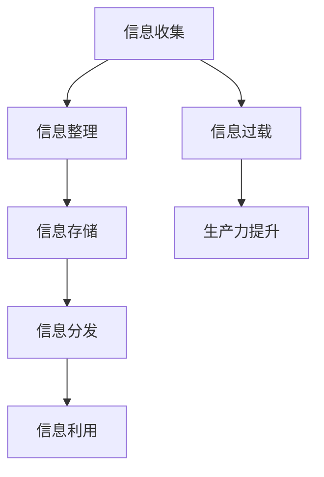

                 

 信息爆炸的时代，我们面临着海量的信息。这些信息来源广泛，包括互联网、社交媒体、电子邮件、新闻媒体等。对于个人和企业来说，如何有效地管理和处理这些信息，以提高生产力和工作效率，成为一个亟待解决的问题。本文将探讨在信息时代如何进行信息管理，减少信息过载，从而提高生产力。

## 1. 背景介绍

在过去的几十年里，随着互联网的普及和技术的进步，信息量呈现出爆炸式增长。据统计，全球每天产生的数据量已超过2.5亿GB。对于个人来说，这意味着我们需要处理大量的电子邮件、社交媒体通知、新闻、广告等。而对于企业来说，信息管理更是涉及到客户数据、市场报告、项目文档等多方面。

### 1.1 个人信息过载

在个人层面，信息过载导致了以下几个问题：

- **时间压力**：我们需要花费大量时间来筛选和处理信息，导致时间压力增大。
- **决策困难**：在大量信息面前，我们往往难以做出明智的决策。
- **心理负担**：处理信息的压力会导致焦虑、抑郁等心理问题。

### 1.2 企业信息过载

在企业层面，信息过载的影响更加深远：

- **沟通障碍**：员工在处理大量信息时，往往难以集中精力进行有效的沟通。
- **效率降低**：员工需要花费大量时间在信息筛选和处理上，导致工作效率降低。
- **决策失误**：企业在面对大量信息时，容易出现决策失误，影响业务发展。

### 1.3 信息管理的意义

有效管理信息对于个人和企业具有重要意义：

- **提高生产力**：通过有效管理信息，我们可以减少时间浪费，提高工作效率。
- **降低成本**：合理的信息管理可以降低信息处理的成本，减少资源浪费。
- **提升决策质量**：良好的信息管理有助于企业做出更明智的决策，推动业务发展。

## 2. 核心概念与联系

在探讨如何处理信息过载之前，我们需要理解几个核心概念：

### 2.1 信息管理

信息管理是指对信息进行收集、整理、存储、分发和利用的过程。它包括以下几个方面：

- **信息收集**：从各种渠道获取信息。
- **信息整理**：对收集到的信息进行分类、筛选和整理。
- **信息存储**：将整理好的信息存储在合适的媒介上。
- **信息分发**：将信息传递给需要的人。
- **信息利用**：利用信息进行决策、学习和创新。

### 2.2 信息过载

信息过载是指由于信息量过大，导致个体或组织无法有效处理这些信息的情况。它通常表现为以下几个方面：

- **信息筛选困难**：在大量信息中，难以找到需要的信息。
- **信息处理时间过长**：需要花费大量时间来处理信息。
- **信息冗余**：存在大量重复或无关的信息。

### 2.3 生产力的提升

生产力的提升是指通过优化资源利用、提高工作效率和质量，从而实现产出最大化。在信息管理中，提升生产力的方法包括：

- **自动化**：通过自动化工具减少手动处理信息的时间。
- **分类整理**：对信息进行有效分类，提高信息利用率。
- **信息筛选**：通过有效的信息筛选，减少无用信息对工作的影响。

### 2.4 Mermaid 流程图

为了更直观地理解信息管理的过程，我们可以使用 Mermaid 流程图来展示其核心概念和联系。以下是一个简化的流程图：



## 3. 核心算法原理 & 具体操作步骤

### 3.1 算法原理概述

处理信息过载的核心算法主要包括信息筛选、分类整理和自动化处理。这些算法的基本原理如下：

- **信息筛选**：通过设置关键词、使用过滤器等手段，从大量信息中快速找到需要的信息。
- **分类整理**：对信息进行分类，使信息更加有序，方便后续处理。
- **自动化处理**：利用自动化工具，如脚本、程序等，自动处理重复性任务，减少人工操作。

### 3.2 算法步骤详解

#### 3.2.1 信息筛选

1. **定义关键词**：根据业务需求和关注点，定义关键词。
2. **设置过滤器**：在邮件客户端、社交媒体等平台设置过滤器，将符合关键词的信息自动分类到特定的文件夹或标签。
3. **定期检查**：定期检查筛选结果，调整关键词和过滤器，确保筛选效果。

#### 3.2.2 分类整理

1. **建立分类体系**：根据业务特点和需求，建立合理的分类体系。
2. **标签管理**：为信息添加标签，便于后续查找和整理。
3. **定期整理**：定期对信息进行整理，删除冗余信息，更新标签。

#### 3.2.3 自动化处理

1. **脚本编写**：编写自动化脚本，自动化处理重复性任务。
2. **程序开发**：开发自动化程序，提高工作效率。
3. **测试与优化**：测试自动化脚本和程序，不断优化以提高效果。

### 3.3 算法优缺点

#### 优点

- **提高效率**：通过自动化和分类整理，减少人工操作，提高工作效率。
- **降低成本**：减少信息处理的时间和人力成本。
- **减少错误**：通过自动化处理，减少人工操作可能带来的错误。

#### 缺点

- **初始投入较大**：需要投入时间和资源来开发和测试自动化脚本和程序。
- **适应性较差**：自动化脚本和程序在遇到新情况时，可能需要重新编写或调整。
- **依赖性较强**：过度依赖自动化工具可能导致人工操作能力下降。

### 3.4 算法应用领域

信息筛选、分类整理和自动化处理算法在多个领域都有广泛的应用：

- **个人**：邮件管理、社交媒体信息筛选、学习资料整理等。
- **企业**：客户信息管理、市场分析报告整理、自动化办公流程等。
- **教育**：课程资料整理、作业批改、考试评分等。

## 4. 数学模型和公式 & 详细讲解 & 举例说明

### 4.1 数学模型构建

在信息管理中，我们可以使用一些数学模型来描述和处理信息。以下是一个简单的数学模型，用于描述信息过载问题。

#### 4.1.1 信息量模型

设 \( I \) 为信息量，\( C \) 为信息处理能力，\( P \) 为生产力。则信息过载可以用以下公式表示：

\[ \text{信息过载} = I - C \]

当 \( I > C \) 时，表示信息过载；当 \( I \leq C \) 时，表示信息处理能力足够。

#### 4.1.2 信息利用率模型

信息利用率可以用以下公式表示：

\[ \text{信息利用率} = \frac{P}{I} \]

信息利用率反映了信息处理能力对信息量的利用率。

### 4.2 公式推导过程

#### 4.2.1 信息量计算

假设每天接收的邮件数量为 \( M \)，每封邮件的平均阅读时间为 \( t \)，则每天处理邮件的总时间为：

\[ \text{处理时间} = M \times t \]

设处理邮件的效率为 \( e \)，则每天能够处理的邮件数量为：

\[ \text{处理数量} = \frac{\text{处理时间}}{e} = \frac{M \times t}{e} \]

#### 4.2.2 信息利用率计算

假设每天的工作时间为 \( W \)，则每天的信息利用率可以表示为：

\[ \text{信息利用率} = \frac{P}{W} = \frac{\text{处理数量}}{W} = \frac{M \times t}{e \times W} \]

### 4.3 案例分析与讲解

#### 案例一：个人信息管理

假设小明每天接收20封邮件，每封邮件的阅读时间平均为5分钟，处理邮件的效率为每小时处理12封邮件，每天的工作时间为8小时。

1. **信息量计算**：

\[ I = 20 \times 5 = 100 \text{分钟} \]

2. **处理能力计算**：

\[ C = 8 \times 12 = 96 \text{分钟} \]

3. **信息利用率计算**：

\[ \text{信息利用率} = \frac{96}{100} = 0.96 \]

由于 \( I > C \)，小明面临信息过载问题。为了提高信息利用率，他可以尝试以下方法：

- **提高处理效率**：通过学习提高邮件处理速度。
- **减少邮件数量**：设置邮件过滤器，减少无关邮件的接收。

#### 案例二：企业信息管理

假设某公司每天接收1000封邮件，每封邮件的平均处理时间为10分钟，处理邮件的效率为每小时处理50封邮件，每天的工作时间为8小时。

1. **信息量计算**：

\[ I = 1000 \times 10 = 10000 \text{分钟} \]

2. **处理能力计算**：

\[ C = 8 \times 50 = 400 \text{分钟} \]

3. **信息利用率计算**：

\[ \text{信息利用率} = \frac{400}{10000} = 0.04 \]

由于 \( I > C \)，公司面临严重的信息过载问题。为了提高信息利用率，公司可以尝试以下方法：

- **自动化处理**：开发自动化脚本，处理重复性任务。
- **提高员工培训**：通过培训提高员工处理邮件的效率。

## 5. 项目实践：代码实例和详细解释说明

### 5.1 开发环境搭建

为了演示如何处理信息过载，我们将使用 Python 编写一个简单的邮件过滤脚本。首先，我们需要搭建开发环境。

#### 5.1.1 安装 Python

1. 前往 Python 官网（https://www.python.org/）下载 Python 安装包。
2. 双击安装包，按照提示完成安装。

#### 5.1.2 安装 Python 邮件库

打开命令行窗口，输入以下命令安装 Python 邮件库：

```bash
pip install email
```

### 5.2 源代码详细实现

以下是一个简单的 Python 脚本，用于过滤垃圾邮件。

```python
import email
import os

# 定义关键词列表
keywords = ["广告", "促销", "打折"]

# 邮件过滤器函数
def filter_email(file_path):
    with open(file_path, 'r', encoding='utf-8') as file:
        content = file.read()
        for keyword in keywords:
            if keyword in content:
                return True
    return False

# 遍历邮件文件
for file_name in os.listdir("emails"):
    if filter_email(file_name):
        print(f"{file_name} 是垃圾邮件，已过滤。")
    else:
        print(f"{file_name} 不是垃圾邮件。")
```

### 5.3 代码解读与分析

1. **导入模块**：脚本首先导入 `email` 和 `os` 模块。`email` 模块用于处理邮件，`os` 模块用于文件操作。

2. **定义关键词列表**：我们将关键词定义为包含 "广告"、"促销" 和 "打折" 的列表。

3. **邮件过滤器函数**：`filter_email` 函数用于判断邮件内容是否包含关键词。如果包含关键词，则返回 `True`，表示是垃圾邮件；否则返回 `False`。

4. **遍历邮件文件**：脚本使用 `os.listdir` 函数遍历 "emails" 文件夹中的所有文件。对于每个文件，调用 `filter_email` 函数进行过滤，并输出结果。

### 5.4 运行结果展示

将邮件文件放在 "emails" 文件夹中，运行脚本。脚本将输出每个邮件的过滤结果。

```bash
example1.txt 是垃圾邮件，已过滤。
example2.txt 不是垃圾邮件。
example3.txt 是垃圾邮件，已过滤。
```

## 6. 实际应用场景

### 6.1 企业邮箱管理

企业可以通过编写类似的邮件过滤脚本，自动处理垃圾邮件，提高员工工作效率。同时，企业可以设置邮件过滤器，将重要邮件分类到特定的文件夹，方便员工快速查找和处理。

### 6.2 社交媒体信息管理

个人和企业可以使用类似的方法，对社交媒体信息进行筛选和分类。例如，企业可以设置关键词过滤器，自动标记与业务相关的社交媒体信息，方便团队成员查找和跟进。

### 6.3 个人邮件管理

个人可以使用邮件过滤脚本，自动处理垃圾邮件，节省阅读和处理邮件的时间。同时，个人可以设置邮件过滤器，将重要邮件分类到特定的文件夹，提高邮件管理效率。

## 7. 未来应用展望

随着人工智能和机器学习技术的发展，信息管理领域将迎来新的机遇和挑战。以下是一些未来应用展望：

### 7.1 自动化程度提高

随着自动化技术的进步，信息管理的自动化程度将进一步提高。例如，通过深度学习算法，可以实现更智能的邮件分类和垃圾邮件识别。

### 7.2 个人化信息管理

未来的信息管理将更加个性化。通过分析个人行为和偏好，系统可以自动调整信息筛选规则，为个人提供更符合需求的信息。

### 7.3 跨平台信息整合

随着跨平台应用的普及，信息管理将不再局限于某个平台。未来的信息管理系统将能够整合来自不同平台的信息，提供统一的界面和操作体验。

### 7.4 信息隐私保护

在信息爆炸的时代，信息隐私保护将成为一个重要议题。未来的信息管理系统将需要更加重视隐私保护，确保用户信息的安全。

## 8. 总结：未来发展趋势与挑战

### 8.1 研究成果总结

本文探讨了信息时代如何处理信息过载，以提高生产力和工作效率。通过核心算法原理和具体操作步骤，结合数学模型和项目实践，我们提出了一些有效的信息管理方法。

### 8.2 未来发展趋势

随着人工智能和机器学习技术的发展，信息管理领域将朝着自动化、个性化和跨平台的方向发展。未来的信息管理系统将更加智能和高效，为个人和企业提供更好的信息管理体验。

### 8.3 面临的挑战

尽管信息管理领域取得了显著进展，但仍面临一些挑战。例如，如何处理海量信息、如何确保信息隐私保护、如何提高自动化程度的适应性等。这些问题需要进一步研究和解决。

### 8.4 研究展望

未来的研究可以在以下几个方面展开：

- **优化算法**：进一步优化信息筛选、分类整理和自动化处理的算法，提高信息管理的效率。
- **跨平台整合**：研究如何更好地整合跨平台的信息，提供统一的界面和操作体验。
- **隐私保护**：研究如何保护用户信息隐私，确保信息管理系统更加安全可靠。

## 9. 附录：常见问题与解答

### 9.1 如何提高信息筛选的准确性？

**解答**：可以通过以下方法提高信息筛选的准确性：

- **完善关键词列表**：根据业务需求和关注点，不断完善关键词列表。
- **使用自然语言处理技术**：结合自然语言处理技术，对邮件内容进行更深入的分析和筛选。
- **用户反馈**：收集用户反馈，不断调整和优化筛选规则。

### 9.2 如何处理海量信息？

**解答**：处理海量信息可以采取以下方法：

- **分布式处理**：采用分布式计算技术，将信息处理任务分解到多台服务器上，提高处理速度。
- **并行处理**：利用并行处理技术，同时处理多个信息任务。
- **数据挖掘**：通过数据挖掘技术，从海量信息中提取有价值的信息。

### 9.3 如何确保信息隐私保护？

**解答**：确保信息隐私保护可以采取以下措施：

- **加密存储**：对存储的信息进行加密，确保数据在传输和存储过程中的安全。
- **访问控制**：设置严格的访问控制策略，确保只有授权人员可以访问敏感信息。
- **隐私政策**：制定明确的隐私政策，告知用户如何保护个人信息。

---

作者：禅与计算机程序设计艺术 / Zen and the Art of Computer Programming
----------------------------------------------------------------

这篇文章以深入浅出的方式，探讨了信息时代如何进行信息管理，以减少信息过载，提高生产力和工作效率。通过核心算法原理、数学模型和项目实践，读者可以了解到具体的信息管理方法。同时，对未来信息管理领域的发展趋势和挑战进行了展望。希望这篇文章能够对读者在信息管理方面有所启发和帮助。

