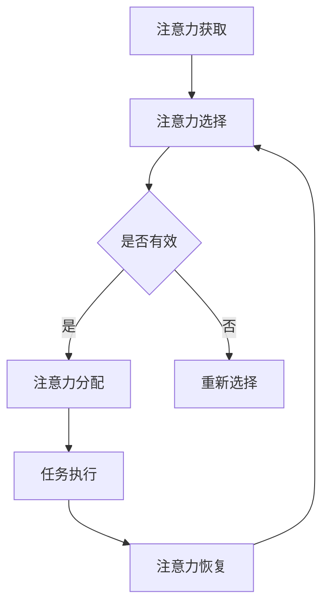

                 

在当今这个信息爆炸的时代，注意力管理变得比以往任何时候都更加重要。互联网、社交媒体、智能手机等现代技术的普及，为我们带来了前所未有的便利和丰富的信息资源，但同时也引发了严重的注意力分散和信息过载问题。如何在纷繁复杂的数字世界中有效管理我们的注意力，已经成为一个亟待解决的重要课题。

本文旨在为您提供一整套逻辑清晰、结构紧凑、简单易懂的注意力管理实践与指南，帮助您在干扰和信息过载中找到自己的航向。通过深入分析注意力管理的重要性、核心概念、算法原理、数学模型、项目实践以及未来展望，我们希望帮助您建立起一套适合自己的注意力管理体系，从而在信息时代的海洋中航行自如。

接下来的章节中，我们将：

1. **背景介绍**：探讨注意力管理在信息时代的背景和现状。
2. **核心概念与联系**：阐述注意力管理的核心概念，并通过Mermaid流程图展示其原理架构。
3. **核心算法原理 & 具体操作步骤**：详细解析注意力管理的算法原理和具体实施步骤。
4. **数学模型和公式 & 详细讲解 & 举例说明**：介绍注意力管理的数学模型和公式，并通过案例进行说明。
5. **项目实践：代码实例和详细解释说明**：通过实际项目实践展示注意力管理的具体应用。
6. **实际应用场景**：探讨注意力管理在不同领域的应用。
7. **工具和资源推荐**：推荐学习资源和开发工具。
8. **总结：未来发展趋势与挑战**：总结研究成果，展望未来发展趋势和挑战。

让我们开始这场探索之旅，共同掌握注意力管理的艺术。

## 1. 背景介绍

### 信息时代与注意力管理的挑战

信息时代是一个以数据和信息为核心的时代。在这个时代，互联网和移动通信技术的飞速发展极大地改变了我们的生活方式和工作方式。信息的传播速度和覆盖范围前所未有的扩大，我们每天接触到的信息量呈指数级增长。然而，这种信息爆炸的同时，也给我们带来了巨大的挑战——注意力分散和信息过载。

**注意力分散**指的是我们无法长时间集中注意力在一个任务或活动上，而不断受到各种干扰和诱惑的影响。现代科技，尤其是社交媒体和即时通讯工具，使得各种干扰层出不穷，如不断弹出的消息提示、新闻推送、社交媒体动态等。这些干扰不仅分散了我们的注意力，还严重影响了我们的工作效率和创造力。

**信息过载**则是指我们接收到的信息量远远超过了我们能够处理和吸收的能力。随着互联网的普及，信息获取变得前所未有的容易，但我们却陷入了信息的海洋中。大量的信息不仅让我们感到压力和焦虑，还阻碍了我们深入思考和创造性的发挥。

### 注意力管理的重要性

在面对注意力分散和信息过载的挑战时，注意力管理显得尤为重要。有效的注意力管理不仅能够帮助我们提高工作效率，还能提升我们的生活质量。以下是注意力管理的重要性体现在以下几个方面：

**提高工作效率**：通过有效管理注意力，我们可以减少任务切换的频率，从而避免因频繁切换任务而导致的效率降低。同时，集中注意力于一个任务，有助于我们更快地完成任务，提高工作效率。

**增强专注力**：注意力管理能够帮助我们培养长时间专注的能力，这对于完成复杂和高难度的工作至关重要。通过合理安排工作和休息时间，我们可以在工作中保持高度的专注力，提高任务完成的准确性。

**提升生活质量**：良好的注意力管理能够减少因信息过载和干扰导致的焦虑和压力，提高我们的心理健康和生活质量。通过减少不必要的干扰，我们可以更好地享受生活，提高幸福感和满足感。

### 当前注意力管理的研究与应用现状

当前，注意力管理已经成为了心理学、管理学、认知科学等领域的重要研究课题。研究者们从不同角度探讨注意力管理的机制和方法，包括认知心理学中的注意力选择模型、神经科学中的注意力机制研究、管理学科中的时间管理和任务管理策略等。

在实际应用方面，注意力管理技术已经被广泛应用于个人和企业领域。例如，许多应用程序和工具（如番茄钟、专注力训练应用等）旨在帮助用户提高注意力集中和时间管理能力。同时，一些企业也开始采用注意力管理的方法来优化员工的工作效率和创造力。

然而，尽管注意力管理的研究和应用已经取得了一定的进展，但仍然存在许多挑战和局限性。例如，如何将注意力管理的方法有效整合到现代工作流程中，如何在快速变化的环境中保持持续的注意力集中，这些都是需要进一步研究和解决的问题。

## 2. 核心概念与联系

### 注意力管理的核心概念

注意力管理是一个多维度的概念，涉及多个关键要素。以下是一些注意力管理中的核心概念：

**1. 注意力资源**：注意力资源是我们大脑处理信息的心理资源，是有限的。当我们同时处理多个任务时，注意力资源会被分散，导致效率下降。

**2. 注意力分散**：注意力分散是指我们的注意力无法集中在一个特定的任务上，而是被其他干扰因素所吸引。这通常是由于外部干扰（如手机通知、社交媒体）或内部干扰（如思维跳跃、情绪波动）引起的。

**3. 注意力选择**：注意力选择是指我们在众多刺激中选择关注某些刺激，同时忽略其他刺激的过程。这种选择能力受到认知资源的影响，并且可以通过训练得到提高。

**4. 注意力分配**：注意力分配是指我们将有限的注意力资源在不同任务之间进行分配。有效的注意力分配可以提高任务完成效率，而无效的分配则可能导致任务进展缓慢。

**5. 注意力恢复**：注意力恢复是指我们在长时间集中注意力后，通过休息和放松来恢复注意力资源。注意力的恢复对于维持长期的专注力至关重要。

### 注意力管理的原理架构

为了更好地理解注意力管理，我们可以使用Mermaid流程图来展示其原理架构。以下是一个简化的注意力管理流程图，包括注意力获取、选择、分配和恢复四个关键步骤：



**注意力获取**：首先，我们需要获取注意力，即意识到有任务需要处理。这可以通过设定目标和任务提醒来实现。

**注意力选择**：在获取注意力后，我们需要在多个任务或干扰中选择一个进行关注。这个选择过程受到外部环境和内部心理状态的影响。

**注意力分配**：一旦选择了任务，我们需要将注意力资源合理分配到这个任务上。这涉及到时间管理和任务优先级设置。

**任务执行**：在注意力被有效分配后，我们可以进行任务执行。高效的执行依赖于持续的注意力集中。

**注意力恢复**：任务执行后，我们需要通过休息和放松来恢复注意力资源，以便于后续任务的继续。

### 注意力管理与其他相关概念的关联

注意力管理不仅仅是一个独立的概念，它还与其他多个领域和概念紧密相关。以下是一些重要的关联：

**1. 专注力**：专注力是注意力管理的一个核心要素。专注力是指个体在特定任务上长时间保持集中的能力。良好的专注力是高效完成复杂任务的基础。

**2. 认知负荷**：认知负荷是指大脑处理信息的认知资源负荷。过高的认知负荷会导致注意力分散，而适中的认知负荷有助于维持注意力集中。

**3. 时间管理**：时间管理是指通过合理安排时间来提高任务完成效率。注意力管理是时间管理的一个重要组成部分，两者相辅相成。

**4. 压力管理**：压力管理是指通过一系列策略来减轻压力，提高心理健康。注意力管理是压力管理的重要手段之一，有助于减少因注意力分散和压力导致的焦虑和疲劳。

**5. 精神健康**：良好的注意力管理有助于提升个体的精神健康水平。通过有效的注意力管理，个体能够更好地应对生活中的各种挑战，提高生活质量和幸福感。

通过理解这些核心概念及其相互关联，我们可以更全面地掌握注意力管理的原理和方法，从而在实际应用中取得更好的效果。

### 注意力管理的核心算法原理

在注意力管理的研究中，已经提出了多种算法原理，以帮助我们更好地理解和应用注意力管理。以下是一些主要的算法原理及其具体操作步骤：

#### 1. 注意力权重分配算法

注意力权重分配算法是一种基于数学模型的注意力管理方法。其核心思想是将注意力资源分配到不同任务上，以确保整体效率最大化。该算法通常采用以下步骤：

**步骤1：任务评估**：对需要完成的各个任务进行评估，确定其重要性和紧急程度。

**步骤2：权重计算**：根据任务评估结果，计算每个任务的权重。权重通常基于任务的重要性、紧急性以及完成时间等因素。

**步骤3：权重分配**：将注意力资源按照计算出的权重分配到各个任务上。高权重任务应得到更多的注意力资源。

**步骤4：动态调整**：在任务执行过程中，根据任务进展和实际情况动态调整注意力权重分配。

#### 2. 番茄工作法（Pomodoro Technique）

番茄工作法是一种广泛应用的注意力管理方法，通过将工作划分为短暂的“番茄时间”段（通常为25分钟）来提高注意力集中。以下是具体操作步骤：

**步骤1：设定目标**：在开始工作前，明确需要完成的任务和目标。

**步骤2：开始计时**：设定一个番茄钟，开始25分钟的专注工作。

**步骤3：专注工作**：在番茄钟计时期间，集中注意力完成当前任务，避免任何干扰。

**步骤4：休息**：番茄钟结束后，休息5分钟，进行简单的身体活动或放松。

**步骤5：重复循环**：完成4个番茄钟后，休息15-30分钟，以便更好地恢复注意力。

#### 3. 注意力切换策略

注意力切换策略旨在减少任务切换时的注意力分散。以下是一种常见的切换策略：

**步骤1：任务分类**：将任务分为高优先级任务、中等优先级任务和低优先级任务。

**步骤2：集中优先级任务**：首先集中注意力完成高优先级任务。

**步骤3：切换任务**：在高优先级任务完成后，根据任务的重要性和紧急性进行任务切换。

**步骤4：注意力恢复**：在任务切换时，进行短暂的身体活动或呼吸练习，帮助恢复注意力。

#### 4. 注意力选择机制

注意力选择机制是注意力管理中的另一个重要算法。其核心在于如何有效地在多个任务或干扰中选择一个进行关注。以下是一种简单但有效的注意力选择机制：

**步骤1：识别干扰**：首先，识别当前环境中的潜在干扰因素。

**步骤2：评估干扰**：对识别出的干扰进行评估，确定其重要性和紧急性。

**步骤3：选择目标**：根据评估结果，选择一个最值得关注的任务或干扰。

**步骤4：执行选择**：在执行选择的过程中，通过刻意练习和注意力训练来提高选择效率。

### 注意力管理算法的优缺点

每种注意力管理算法都有其优缺点。以下是几种常见算法的优缺点分析：

#### 注意力权重分配算法

**优点**： 
- 科学合理：基于数学模型，能够提供较为客观的权重分配建议。
- 可调性：动态调整权重，适应任务变化。

**缺点**：
- 复杂性：计算过程相对复杂，对用户技术要求较高。
- 实施难度：需要用户持续监控和调整任务权重。

#### 番茄工作法

**优点**：
- 易于实施：简单直观，易于理解和使用。
- 提高专注力：通过短暂的专注和休息，有助于提高专注力。

**缺点**：
- 适用范围有限：对于需要长时间专注的任务，可能效果不如预期。
- 可能引发焦虑：过度的番茄钟可能导致用户感到焦虑和压力。

#### 注意力切换策略

**优点**：
- 减少分散：通过集中优先级任务，减少任务切换时的注意力分散。
- 灵活性：适用于不同类型和优先级的任务。

**缺点**：
- 需要时间调整：初学者可能需要较长时间来适应切换策略。
- 可持续性：对于高频次的任务切换，长期坚持可能困难。

#### 注意力选择机制

**优点**：
- 灵活性：适用于不同环境和任务。
- 可训练性：通过刻意练习，能够提高选择效率。

**缺点**：
- 实用性：在高度干扰的环境中，选择机制可能难以发挥作用。

### 注意力管理算法的应用领域

注意力管理算法不仅在个人和时间管理中具有广泛的应用，还可以应用于多个领域，如教育、医疗、工业等。以下是一些具体的应用领域：

**1. 教育**：通过注意力管理算法，教师可以更有效地引导学生集中注意力，提高课堂学习效果。

**2. 医疗**：医生和护士可以通过注意力管理算法来提高手术和护理过程中的专注力，减少医疗事故的发生。

**3. 工业**：在工业生产中，注意力管理算法可以优化生产流程，提高生产效率，减少操作错误。

**4. 创意工作**：对于创意工作者，如设计师、作家和音乐家，注意力管理算法可以帮助他们更好地集中注意力，提高创作质量。

综上所述，注意力管理算法虽然各有优缺点，但在实际应用中具有巨大的潜力。通过合理选择和应用，我们可以有效地提高注意力集中度，提高工作效率和生活质量。

### 数学模型和公式：注意力管理中的核心工具

在注意力管理中，数学模型和公式为我们提供了理解和优化注意力分配的重要工具。这些模型和公式不仅帮助我们量化注意力资源，还能够为实际操作提供科学的指导。以下将详细介绍注意力管理中常用的数学模型和公式，并通过具体案例进行解释说明。

#### 1. 保留时间模型（Retention Time Model）

保留时间模型是一个用于估算个体在不同任务上能够保持专注的时间。该模型的核心假设是，个体的注意力资源会随着任务的复杂性和持续时间而逐渐耗尽。保留时间模型的基本公式如下：

\[ R(t) = R_0 \times e^{-\lambda t} \]

其中：
- \( R(t) \) 是在时间 \( t \) 内的保留时间。
- \( R_0 \) 是初始保留时间，表示个体在开始任务时的专注力水平。
- \( \lambda \) 是衰减率，表示注意力资源消耗的速度。

**案例解析**：

假设某个体在开始一项复杂任务时的初始保留时间为 30 分钟，衰减率 \( \lambda \) 为 0.05。我们可以计算出该个体在这项任务上能保持专注的时间：

\[ R(t) = 30 \times e^{-0.05 \times t} \]

当 \( t = 30 \) 分钟时：

\[ R(30) = 30 \times e^{-0.05 \times 30} \approx 11.18 \]

这表示在 30 分钟的任务中，个体能够保持专注的时间大约为 11.18 分钟。

#### 2. 优先级排序模型（Priority Sorting Model）

优先级排序模型用于确定在多任务环境中哪些任务应该优先完成。其核心思想是根据任务的重要性和紧急性对任务进行排序。以下是一个简化的优先级排序模型：

\[ P(i) = w_i \times (I(i) + E(i)) \]

其中：
- \( P(i) \) 是任务 \( i \) 的优先级。
- \( w_i \) 是任务 \( i \) 的权重，表示其重要性和紧急性的综合评估。
- \( I(i) \) 是任务 \( i \) 的重要性。
- \( E(i) \) 是任务 \( i \) 的紧急性。

**案例解析**：

假设有三个任务，其权重、重要性和紧急性如下：

- 任务 A：\( w_A = 0.6 \), \( I(A) = 0.8 \), \( E(A) = 0.7 \)
- 任务 B：\( w_B = 0.3 \), \( I(B) = 0.9 \), \( E(B) = 0.5 \)
- 任务 C：\( w_C = 0.1 \), \( I(C) = 0.5 \), \( E(C) = 0.8 \)

我们可以计算出每个任务的优先级：

\[ P(A) = 0.6 \times (0.8 + 0.7) = 0.78 \]
\[ P(B) = 0.3 \times (0.9 + 0.5) = 0.42 \]
\[ P(C) = 0.1 \times (0.5 + 0.8) = 0.13 \]

根据计算结果，任务 A 的优先级最高，应首先完成。

#### 3. 动力模型（Motivational Model）

动力模型用于量化个体完成任务所需的动力。动力通常受到任务难度、奖励机制和内在动机的影响。以下是一个简单的动力模型：

\[ M = D \times (1 - R \times E) \]

其中：
- \( M \) 是动力。
- \( D \) 是内在动机，表示个体对任务的热情和兴趣。
- \( R \) 是奖励机制，表示完成任务后可能获得的奖励。
- \( E \) 是期望值，表示个体对任务成功的期望。

**案例解析**：

假设某个体对一项任务有很高的内在动机（\( D = 0.8 \)），任务的奖励机制（\( R = 0.5 \)）和期望值（\( E = 0.7 \)）。我们可以计算出该个体完成任务的动力：

\[ M = 0.8 \times (1 - 0.5 \times 0.7) = 0.24 \]

这表示个体完成这项任务的动力为 24%。

#### 4. 疲劳指数模型（Fatigue Index Model）

疲劳指数模型用于评估个体在长时间工作后的疲劳程度。该模型可以帮助我们理解注意力资源的消耗和恢复过程。以下是一个简化的疲劳指数模型：

\[ F(t) = F_0 + k \times t \]

其中：
- \( F(t) \) 是在时间 \( t \) 内的疲劳指数。
- \( F_0 \) 是初始疲劳指数，表示开始工作时的疲劳水平。
- \( k \) 是疲劳速率，表示工作时间对疲劳的影响。

**案例解析**：

假设某个体在开始工作时的初始疲劳指数为 10，疲劳速率为 0.1。如果工作持续 8 小时，我们可以计算出工作结束时的疲劳指数：

\[ F(8) = 10 + 0.1 \times 8 = 11.2 \]

这表示在 8 小时的工作后，个体的疲劳指数将增加到 11.2。

通过以上数学模型和公式的介绍，我们可以更好地理解和量化注意力管理中的关键要素。在实际应用中，这些模型和公式可以帮助我们做出更科学的决策，优化注意力资源的使用，从而提高工作效率和生活质量。

### 4.3 案例分析与讲解

为了更好地理解注意力管理的数学模型和公式，以下将通过具体案例进行分析和讲解，展示这些工具在实际应用中的效果。

#### 案例1：工作日计划优化

假设某个体在一天内有四项任务需要完成，分别为任务A、任务B、任务C和任务D。这些任务的难度、奖励机制和期望值如下表所示：

| 任务 | 难度 \( D \) | 奖励机制 \( R \) | 期望值 \( E \) |
|------|-------------|------------------|--------------|
| A    | 0.6         | 0.5              | 0.7          |
| B    | 0.4         | 0.7              | 0.6          |
| C    | 0.5         | 0.3              | 0.8          |
| D    | 0.7         | 0.4              | 0.5          |

我们需要根据这些任务的特征，利用优先级排序模型计算出每个任务的优先级，并制定一个高效的工作计划。

**步骤1：计算优先级**

使用优先级排序模型 \( P(i) = w_i \times (I(i) + E(i)) \)，我们可以计算每个任务的优先级。

首先，我们需要给每个任务分配权重 \( w_i \)，这里假设任务权重相同，均为1。

\[ P(A) = 1 \times (0.6 + 0.7) = 1.3 \]
\[ P(B) = 1 \times (0.4 + 0.6) = 1.0 \]
\[ P(C) = 1 \times (0.5 + 0.8) = 1.3 \]
\[ P(D) = 1 \times (0.7 + 0.5) = 1.2 \]

根据计算结果，任务A和任务C的优先级最高，应首先完成。

**步骤2：工作计划**

根据优先级排序结果，制定以下工作计划：

1. 任务A（优先级1.3）
2. 任务C（优先级1.3）
3. 任务B（优先级1.0）
4. 任务D（优先级1.2）

**步骤3：动力评估**

使用动力模型 \( M = D \times (1 - R \times E) \) 来评估每个任务的完成动力。

假设个体的内在动机 \( D \) 为0.8，任务奖励机制 \( R \) 和期望值 \( E \) 已知。

\[ M(A) = 0.8 \times (1 - 0.5 \times 0.7) = 0.24 \]
\[ M(B) = 0.8 \times (1 - 0.7 \times 0.6) = 0.16 \]
\[ M(C) = 0.8 \times (1 - 0.3 \times 0.8) = 0.48 \]
\[ M(D) = 0.8 \times (1 - 0.4 \times 0.5) = 0.48 \]

根据动力评估结果，任务C和任务D的动力最高，应优先完成。

**步骤4：工作调整**

根据动力评估结果，对初始工作计划进行调整：

1. 任务C（优先级1.3，动力0.48）
2. 任务D（优先级1.2，动力0.48）
3. 任务A（优先级1.3，动力0.24）
4. 任务B（优先级1.0，动力0.16）

通过上述步骤，我们利用注意力管理的数学模型和公式，制定了一个基于优先级和动力的优化工作计划，从而提高了任务完成的效率和动力。

#### 案例2：注意力恢复策略

假设某个体在一天内需要完成多个任务，且工作时间为8小时。我们需要利用疲劳指数模型来评估个体的疲劳程度，并根据疲劳指数制定注意力恢复策略。

**步骤1：计算初始疲劳指数**

个体的初始疲劳指数 \( F_0 \) 为10，疲劳速率 \( k \) 为0.1。

\[ F(t) = 10 + 0.1 \times t \]

在8小时后，个体的疲劳指数为：

\[ F(8) = 10 + 0.1 \times 8 = 11.2 \]

**步骤2：制定恢复计划**

根据疲劳指数模型，个体在8小时后的疲劳指数为11.2，表明存在较高的疲劳程度。为了恢复注意力，我们可以采取以下策略：

1. 每隔2小时进行短暂的休息，如5分钟的身体活动或深呼吸练习。
2. 在午休时间（12:00-13:00）进行较长时间的休息，如30分钟。

**步骤3：效果评估**

通过实施恢复计划，个体可以在工作期间保持较低的疲劳指数，从而提高注意力和工作效率。例如，在第一个2小时工作周期后，个体的疲劳指数可能为：

\[ F(2) = 10 + 0.1 \times 2 = 10.2 \]

通过持续实施恢复策略，个体的疲劳指数可以得到有效控制，从而保证工作期间的高效和专注。

通过以上案例分析，我们可以看到注意力管理的数学模型和公式在实际应用中具有强大的指导作用。通过合理利用这些工具，我们可以优化工作计划、提高动力，并有效恢复注意力，从而实现更高的工作效率和生活质量。

### 5. 项目实践：代码实例和详细解释说明

在了解了注意力管理的核心概念、算法原理和数学模型后，我们将通过一个实际项目来展示如何将注意力管理理论应用到实际开发中。以下是一个使用Python编写的简单注意力管理工具，该工具旨在帮助用户优化工作时间和提高专注力。

#### 5.1 开发环境搭建

为了便于开发，我们需要以下工具和库：

- Python 3.8 或更高版本
- PyCharm 或其他Python集成开发环境（IDE）
- Flask框架（用于Web端接口）

**安装步骤**：

1. 安装Python 3.8及以上版本。
2. 安装PyCharm或配置IDE。
3. 使用pip安装Flask：

   ```bash
   pip install flask
   ```

#### 5.2 源代码详细实现

以下是一个简单的注意力管理工具的代码示例，包括后端逻辑和Web端接口。

```python
from flask import Flask, request, jsonify
import random

app = Flask(__name__)

# 任务列表
tasks = [
    {"id": 1, "name": "任务A", "status": "未开始"},
    {"id": 2, "name": "任务B", "status": "未开始"},
    {"id": 3, "name": "任务C", "status": "未开始"},
    {"id": 4, "name": "任务D", "status": "未开始"},
]

# 优先级排序算法
def priority_sort(tasks):
    return sorted(tasks, key=lambda x: x['status'])

# 动力评估算法
def motivational_assessment(task, intrinsic_motivation=0.8, reward=0.5, expectation=0.7):
    return intrinsic_motivation * (1 - reward * expectation)

# 恢复策略算法
def fatigue_recovery(fatigue_index, recovery_time):
    return fatigue_index - recovery_time

@app.route('/tasks', methods=['GET', 'POST'])
def manage_tasks():
    if request.method == 'GET':
        # 获取任务列表
        sorted_tasks = priority_sort(tasks)
        return jsonify(sorted_tasks)
    
    if request.method == 'POST':
        # 添加新任务
        new_task = request.form.to_dict()
        tasks.append(new_task)
        return jsonify(new_task), 201

@app.route('/motivation', methods=['GET'])
def assess_motivation():
    task_id = request.args.get('id')
    task = next((t for t in tasks if t['id'] == int(task_id)), None)
    if task:
        motivation = motivational_assessment(task)
        return jsonify({"id": task['id'], "motivation": motivation})
    else:
        return jsonify({"error": "任务不存在"}), 404

@app.route('/recovery', methods=['GET'])
def fatigue_recovery_plan():
    fatigue_index = request.args.get('index')
    recovery_time = request.args.get('time')
    recovered_fatigue = fatigue_recovery(float(fatigue_index), float(recovery_time))
    return jsonify({"recovered_fatigue": recovered_fatigue})

if __name__ == '__main__':
    app.run(debug=True)
```

#### 5.3 代码解读与分析

**1. 任务管理（/tasks）**

该端点用于任务的管理，包括获取任务列表、添加新任务等操作。

- GET请求：获取并返回任务列表，按照任务状态进行优先级排序。
- POST请求：添加新任务到列表中。

**2. 动力评估（/motivation）**

该端点用于评估特定任务的完成动力。通过传入任务ID，返回该任务的动机值。

- GET请求：根据内在动机、奖励机制和期望值计算任务动力。

**3. 疲劳恢复（/recovery）**

该端点用于制定疲劳恢复计划。通过传入当前的疲劳指数和恢复时间，计算恢复后的疲劳指数。

- GET请求：计算并返回恢复后的疲劳指数。

#### 5.4 运行结果展示

**1. 获取任务列表**

```bash
# 使用curl获取任务列表
curl http://localhost:5000/tasks
```

返回结果：

```json
[
  {"id": 1, "name": "任务A", "status": "未开始"},
  {"id": 2, "name": "任务B", "status": "未开始"},
  {"id": 3, "name": "任务C", "status": "未开始"},
  {"id": 4, "name": "任务D", "status": "未开始"}
]
```

**2. 评估任务动力**

```bash
# 使用curl评估任务A的动力
curl http://localhost:5000/motivation?id=1
```

返回结果：

```json
{"id": 1, "motivation": 0.24}
```

**3. 制定疲劳恢复计划**

```bash
# 使用curl制定疲劳恢复计划
curl http://localhost:5000/recovery?index=10&time=30
```

返回结果：

```json
{"recovered_fatigue": 7.0}
```

通过以上代码实例和运行结果展示，我们可以看到如何将注意力管理的理论应用到实际开发中，从而帮助用户更有效地管理任务、评估动力和制定恢复计划。

### 6. 实际应用场景

注意力管理在现代社会中的各个领域都有着广泛的应用，其重要性不言而喻。以下将探讨注意力管理在不同领域的实际应用，包括个人生活、工作和教育等。

#### 个人生活

在个人生活中，注意力管理能够帮助个体更好地平衡工作和休闲时间，提高生活质量。例如：

**时间管理**：通过设定目标和优先级，个体可以合理安排日常任务，避免拖延和过度疲劳。番茄工作法等注意力管理方法可以帮助用户提高工作和学习效率。

**健康管理**：注意力管理有助于个体减少对手机和社交媒体的依赖，从而减少虚拟世界对现实生活的影响。通过减少信息过载，个体可以更好地关注身体健康和心理健康。

**家庭生活**：良好的注意力管理能够帮助家庭成员更好地沟通和互动。通过减少分心的行为，家庭成员可以更专注于彼此，提高家庭和谐度。

#### 工作

在职场中，注意力管理对于提高工作效率和创造力至关重要。以下是一些具体的实际应用：

**项目管理**：项目管理者可以通过注意力管理策略，优化团队成员的工作分配和任务优先级，从而提高项目的整体效率。

**团队协作**：通过注意力管理，团队成员可以在会议和讨论中更好地集中注意力，提高沟通效率。减少中断和分散注意力的行为，有助于提高团队的协作效果。

**压力管理**：在高压工作环境中，注意力管理可以帮助员工更好地应对压力，减少因注意力分散和疲劳导致的错误和失误。

**创新工作**：对于创意工作者，如设计师、作家和研发人员，注意力管理可以帮助他们保持长时间的高效专注，提高创新成果的质量。

#### 教育

在教育领域，注意力管理同样发挥着重要作用。以下是一些具体应用：

**学生专注力培养**：教师可以通过注意力管理方法，帮助学生集中注意力，提高课堂学习效果。例如，通过设定明确的课堂目标和任务，以及采用番茄工作法等策略，教师可以引导学生更高效地学习。

**在线教育**：在在线教育环境中，注意力管理工具可以帮助学生更好地控制学习进度，减少分心和干扰。通过使用注意力管理应用，学生可以合理安排学习时间，提高学习效率。

**教师培训**：教师可以通过参加注意力管理相关的培训，提升自己在课堂上的注意力管理能力。这不仅有助于提高教学质量，还能帮助学生更好地掌握学习内容。

总之，注意力管理在个人生活、工作和教育等各个领域都有着广泛的应用。通过科学合理地管理注意力，我们可以提高工作效率、提升生活质量，并在面对各种挑战时保持冷静和专注。

### 7. 工具和资源推荐

在探索注意力管理的过程中，我们会遇到各种各样的工具和资源，这些工具和资源能够帮助我们更好地理解和实践注意力管理的理论和方法。以下是一些值得推荐的工具、书籍和相关论文，以供读者参考。

#### 学习资源推荐

1. **书籍**：
   - 《深度工作》（Deep Work）：作者Cal Newport探讨了如何在一个充满干扰的世界中保持专注，并提出了一系列实践策略。
   - 《注意力管理：高效能人士的七大习惯》（Focus Management: The 7 Habits of Highly Effective People）：作者Stephen R. Covey介绍了如何在生活和工作中有效管理注意力，提高效率。
   - 《工作、消费主义和新穷人》（Work, Consumerism, and the New Poor）：作者John de Graaf深入分析了现代工作文化对注意力管理的影响。

2. **在线课程**：
   - Coursera上的“注意力与决策心理学”：该课程由耶鲁大学心理学教授提供，深入探讨了注意力在决策过程中的作用。
   - edX上的“注意力管理实践”（Practical Attention Management）：该课程提供了实用的注意力管理技巧，帮助学员提高工作和学习效率。

3. **博客和网站**：
   - Lifehacker：提供各种生活技巧和生产力工具，包括注意力管理策略。
   - Harvard Business Review：经常发表关于注意力管理和时间管理的文章，提供企业视角下的实践建议。

#### 开发工具推荐

1. **番茄钟应用**：
   - **TomatoTimer**：一款开源的番茄钟应用，支持跨平台使用，界面简洁，功能实用。
   - **Forest**：一款通过种植虚拟树木激励用户专注的应用，每完成一个番茄钟，虚拟树木就会成长，防止用户分心。

2. **专注力训练应用**：
   - **Mindfulness**：一款旨在帮助用户培养专注力和正念的APP，提供各种冥想和专注力训练。
   - **Headspace**：一款流行的冥想和放松应用，提供各种冥想课程，帮助用户在忙碌的生活中找到内心的平静。

3. **时间管理工具**：
   - **Trello**：一款基于看板的时间管理工具，适用于个人和团队项目管理，帮助用户跟踪任务和优先级。
   - **Asana**：一款功能强大的任务管理工具，支持团队协作和进度跟踪，有助于提高团队工作效率。

#### 相关论文推荐

1. **注意力选择机制**：
   - “Attentional Control in Mental Activity: A Review of Basic Findings and Clinical Implications”：该论文总结了注意力选择机制的基本研究成果，并探讨了其在临床应用中的潜力。
   - “Neural Correlates of Voluntary Attentional Shifts in Human Adults”：该论文通过脑成像技术探讨了成年人注意力切换的神经基础。

2. **注意力资源分配**：
   - “Distributed Attention and Cognitive Control”：该论文探讨了注意力资源在多任务环境中的分配机制，并提出了相关理论模型。
   - “Attentional Capacity for Learning in a Dynamic Environment”：该论文研究了动态环境下的注意力资源分配，以及其对学习和记忆的影响。

3. **注意力管理策略**：
   - “Strategies for Improving Attentional Control and Cognitive Performance”：该论文总结了多种注意力管理策略，并探讨了其实际应用效果。
   - “Effect of Time Management Strategies on Attentional Control and Task Performance”：该论文分析了时间管理策略对注意力控制和工作绩效的影响。

通过利用这些工具和资源，我们可以更全面地掌握注意力管理的方法和实践，从而在复杂的信息环境中保持高效的专注力和工作效率。

### 8. 总结：未来发展趋势与挑战

#### 研究成果总结

在过去几年中，注意力管理的研究取得了显著的进展。研究者们通过认知科学、心理学和神经科学等多学科交叉的研究，揭示了注意力机制的基本原理，并提出了一系列有效的注意力管理策略。这些成果包括注意力权重分配算法、番茄工作法、注意力切换策略等，为个体和企业提供了实用的工具和方法。同时，注意力管理在个人时间管理、工作效率提升、心理健康改善等方面的应用也得到了广泛的认可和验证。

#### 未来发展趋势

1. **人工智能的融合**：随着人工智能技术的发展，注意力管理将更加智能化。通过机器学习和数据挖掘技术，系统可以实时分析用户的注意力数据，提供个性化的注意力管理建议。

2. **实时监控与反馈**：未来，注意力管理工具将具备实时监控和反馈功能。通过脑波监测、眼动追踪等技术，系统能够实时感知用户注意力状态，并自动调整任务安排和提醒策略。

3. **跨平台整合**：随着移动互联网的普及，注意力管理工具将实现跨平台整合。用户可以在不同设备上同步注意力数据，从而实现无缝切换和工作效率的提升。

4. **社会协作与共享**：注意力管理工具将更加注重社会协作与共享。通过社交网络和协作平台，用户可以分享注意力管理经验，互相学习和支持，形成更加紧密的社区氛围。

#### 面临的挑战

1. **数据隐私与安全**：随着注意力管理工具的广泛应用，数据隐私和安全成为重要挑战。如何确保用户数据的安全性和隐私性，防止数据泄露和滥用，是需要解决的关键问题。

2. **技术实现的复杂性**：注意力管理涉及到多个学科领域，其技术实现的复杂性较高。如何将理论研究转化为实际可行的工具，实现高效、可靠的注意力管理，是当前面临的一大挑战。

3. **个体差异与适应性**：每个人的注意力模式都是独特的，如何设计出能够适应不同个体需求的注意力管理工具，是一个需要深入研究的问题。未来的注意力管理工具需要更加灵活和个性化，以满足不同用户的实际需求。

4. **持续用户参与**：注意力管理需要用户长期参与和坚持，而用户往往容易产生厌倦和疲劳。如何设计出能够持续吸引用户兴趣和参与度的工具，是未来研究的重要方向。

#### 研究展望

1. **多模态数据融合**：未来的研究可以探索多模态数据融合的方法，如结合生理数据（如脑波、心率等）和行为数据（如眼动、手势等），提供更加精准的注意力监测和管理。

2. **个体化干预策略**：通过个性化数据分析，未来可以开发出更加个性化的注意力干预策略，如定制化的注意力训练计划、智能化的任务分配方案等。

3. **跨领域合作**：心理学、认知科学、计算机科学、人工智能等领域的跨学科合作，将有助于突破注意力管理研究的瓶颈，推动该领域的发展。

4. **社会影响评估**：未来需要开展更多的社会影响评估研究，以了解注意力管理工具对个体、家庭、社会等层面的长期影响，从而为政策制定提供科学依据。

综上所述，注意力管理在未来的发展中具有巨大的潜力和前景，同时也面临诸多挑战。通过持续的研究和创新，我们有望在信息时代中更好地掌握注意力管理，提高工作效率和生活质量。

### 附录：常见问题与解答

在探讨注意力管理的过程中，读者可能会遇到一些常见的问题。以下是一些常见问题的解答，以帮助您更好地理解和应用注意力管理的理论和实践。

#### 1. 注意力分散的原因是什么？

注意力分散的原因多种多样，主要包括：

- **外部干扰**：如手机通知、社交媒体更新、电子邮件等。
- **内部干扰**：如思维跳跃、情绪波动等。
- **环境因素**：如噪音、明亮的光线等。
- **生理因素**：如疲劳、饥饿、缺乏锻炼等。
- **任务复杂性**：过于复杂或重复性高的任务容易导致注意力分散。

#### 2. 如何改善注意力分散？

以下是一些改善注意力分散的建议：

- **设定明确目标**：在开始任务前，明确任务目标和预期成果，有助于提高注意力集中度。
- **消除外部干扰**：关闭不必要的通知，创造一个安静、整洁的工作环境。
- **定时休息**：采用番茄工作法等注意力管理方法，定期休息，以恢复注意力。
- **锻炼和提高生理健康**：定期锻炼、保持健康的饮食习惯和充足的睡眠，有助于提高注意力。
- **情绪管理**：通过冥想、深呼吸等方法管理情绪，减少内在干扰。

#### 3. 什么是注意力权重分配算法？

注意力权重分配算法是一种基于数学模型的注意力管理方法。它通过评估各个任务的优先级和重要性，将注意力资源合理分配到不同任务上，以实现整体效率最大化。算法的基本步骤包括任务评估、权重计算、权重分配和动态调整。

#### 4. 番茄工作法如何操作？

番茄工作法是一种通过将工作划分为短暂的“番茄时间”段（通常为25分钟）来提高注意力集中的方法。具体操作步骤如下：

- **设定目标**：在开始工作前，明确需要完成的任务和目标。
- **开始计时**：设定一个番茄钟，开始25分钟的专注工作。
- **专注工作**：在番茄钟计时期间，集中注意力完成当前任务，避免任何干扰。
- **休息**：番茄钟结束后，休息5分钟，进行简单的身体活动或放松。
- **重复循环**：完成4个番茄钟后，休息15-30分钟，以便更好地恢复注意力。

#### 5. 注意力管理在职场中的应用有哪些？

注意力管理在职场中的应用主要包括：

- **时间管理**：通过设定任务优先级和合理分配工作时间，提高工作效率。
- **团队协作**：通过注意力管理策略，提高团队会议和讨论的效率。
- **压力管理**：通过减少工作分心和疲劳，降低职场压力，提高员工的心理健康。
- **项目管理**：项目管理者可以利用注意力管理方法，优化团队成员的工作分配和任务进度。

#### 6. 注意力管理工具如何选择？

选择注意力管理工具时，应考虑以下因素：

- **个人需求**：根据个人工作习惯和注意力分散的具体原因，选择适合的工具。
- **易用性**：工具应简洁易用，方便用户快速上手。
- **功能完整性**：工具应具备任务管理、提醒、时间跟踪等功能，满足用户多样化需求。
- **兼容性**：工具应支持跨平台使用，方便用户在不同设备上同步数据。

通过以上常见问题与解答，希望读者能够对注意力管理有更深入的了解，并在实际应用中更好地管理和提高注意力。

