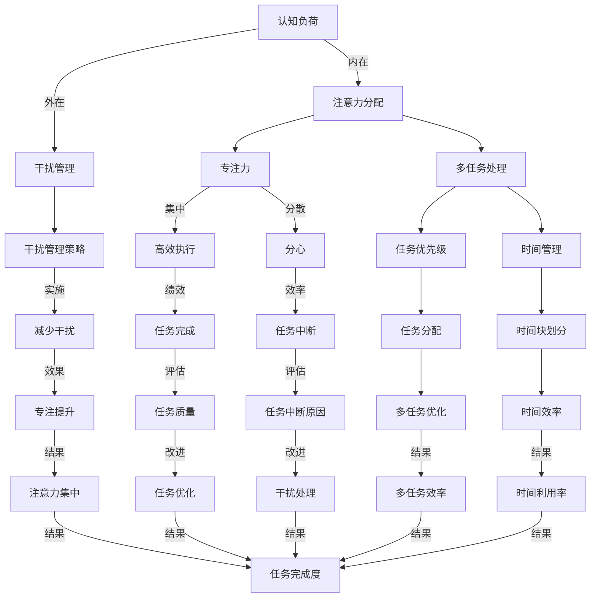

                 

## 1. 背景介绍

在当今的信息时代，我们面临着前所未有的信息过载和注意力分散的挑战。随着互联网的普及，各种信息源源不断地涌入我们的生活中，从新闻、社交媒体到电子邮件和即时通讯工具，我们的注意力被分散到各个角落。与此同时，工作环境的复杂性也在不断增加，远程工作、跨团队合作以及不断变化的项目需求，使得我们在工作中需要不断地切换任务和注意力。

这种注意力分散和信息过载的现象不仅影响我们的工作效率，还可能导致焦虑、疲劳和创造力下降。因此，如何有效地管理注意力，提高信息处理效率，成为了我们不得不面对的重要问题。

本文旨在探讨注意力管理的重要性，介绍一些核心概念和理论，并提供实用的实践指南和工具，帮助读者在干扰和信息过载的环境中保持专注和高效。

本文将分为以下几个部分：

- **背景介绍**：阐述信息时代注意力管理的背景和现状。
- **核心概念与联系**：介绍注意力管理相关的核心概念和理论，包括专注力、多任务处理和注意力分散等。
- **核心算法原理 & 具体操作步骤**：详细讲解如何通过技术手段和策略来管理注意力。
- **数学模型和公式 & 详细讲解 & 举例说明**：探讨注意力管理的数学模型，并提供具体的推导和案例分析。
- **项目实践：代码实例和详细解释说明**：通过实际项目实例展示如何应用注意力管理策略。
- **实际应用场景**：讨论注意力管理在不同领域中的应用和挑战。
- **工具和资源推荐**：推荐一些有助于注意力管理的工具和资源。
- **总结：未来发展趋势与挑战**：总结研究成果，探讨未来发展趋势和面临的挑战。

通过本文的阅读，读者将能够理解注意力管理的重要性，掌握一系列实用的技巧和策略，从而在信息过载和干扰的环境中保持高效和专注。

### 1.1 信息时代的注意力管理现状

信息时代带来了信息爆炸和快速传播，同时也加剧了我们的注意力分散问题。研究显示，现代成年人每天接收的信息量相当于19世纪报纸读者的100倍，而我们的注意力持续时间却从20世纪70年代的12秒减少到了现在的约8秒，甚至有时更短。这种趋势引发了广泛的社会关注，越来越多的研究和实践开始关注如何有效地管理注意力。

在职场环境中，注意力管理问题尤为突出。根据一项调查，员工平均每天会花费大约28%的时间来处理不重要的任务，这直接导致了工作效率的下降。此外，不断切换任务和分心的行为，不仅增加了错误率，还损害了员工的创造力和创新思维。一些研究表明，频繁的任务切换可能导致大脑认知资源的耗尽，进而影响决策质量和工作满意度。

教育领域同样面临着注意力管理的挑战。随着互联网和移动设备的普及，学生们面临着前所未有的信息干扰。一项针对大学生的研究表明，智能手机和社交媒体对学生的注意力产生了显著的负面影响，使得他们在课堂和作业上的表现有所下降。因此，如何帮助学生培养专注力和有效的注意力管理技能，成为了教育工作者亟待解决的问题。

此外，注意力管理问题还影响着我们的个人生活和心理健康。在日常生活中，我们常常会发现自己无法专注于阅读、写作或进行深度思考，这可能导致焦虑和压力的增加。长期而言，注意力分散可能加剧心理疲劳，甚至引发严重的心理健康问题。

面对如此严峻的注意力管理挑战，许多企业和组织已经开始采取行动，引入各种注意力管理工具和策略。例如，一些公司推出了无干扰的工作环境，限制不必要的电子邮件和即时通讯，以帮助员工集中注意力。此外，还有公司推出了专门针对注意力管理的应用程序和软件，帮助员工监控和优化自己的注意力。

同时，学术界也在积极探索注意力管理的理论和方法。研究人员通过实验和数据分析，提出了多种注意力管理模型和策略，如时间管理、任务管理、环境管理和技术干预等。这些研究和实践为企业和个人提供了宝贵的参考，帮助他们更好地应对注意力分散和信息过载的挑战。

总的来说，信息时代的注意力管理现状令人堪忧，但同时也为研究和实践提供了丰富的机会。通过深入探讨注意力管理的重要性，介绍相关的核心概念和理论，以及提供实用的实践指南和工具，本文旨在帮助读者在信息过载和干扰的环境中保持专注和高效。

### 1.2 注意力管理的核心概念

在探讨如何管理注意力之前，我们首先需要了解一些核心概念，包括专注力、多任务处理和注意力分散等。这些概念不仅帮助我们理解注意力的本质，还为制定有效的注意力管理策略提供了基础。

#### 专注力

专注力，也称为注意力集中或集中力，是指个体在特定任务上投入的注意力资源。它是一个动态的过程，涉及选择关注某些信息或活动，同时忽略其他干扰因素。高水平的专注力能够显著提高工作效率和绩效，使个体在复杂和耗时的任务中保持高效。

专注力可以分为几个不同的维度，包括：

1. **时间维度**：专注力可以持续的时间长度。研究表明，成年人的平均专注时间大约为10-20分钟，而青少年和儿童则更短。
2. **强度维度**：专注力的强度，即个体对任务的关注程度和投入的程度。
3. **选择性维度**：个体选择关注特定信息的能力，同时忽略无关的干扰。

提高专注力的方法包括：

- **设置明确的目标**：明确任务目标和时间限制，有助于提高专注力。
- **减少干扰**：关闭不必要的通知和干扰，如关闭社交媒体和电子邮件提示。
- **环境优化**：选择一个安静、舒适的工作环境，减少干扰因素。

#### 多任务处理

多任务处理，是指个体在同一时间内处理多个任务的能力。尽管多任务处理在日常生活中很常见，但它往往会影响任务的质量和效率。研究表明，多任务处理会导致认知资源的分散，增加错误率和反应时间，从而降低总体绩效。

多任务处理可以分为两种类型：

1. **并行处理**：同时处理多个任务，但它们在脑中分别进行处理。
2. **顺序处理**：一个接一个地处理多个任务，每个任务完成后才进行下一个。

多任务处理的效率因个体差异和任务性质而异。通常，简单和重复性的任务更适合多任务处理，而复杂和需要深度思考的任务则不适合。

提高多任务处理能力的方法包括：

- **任务优先级**：将任务按照重要性和紧急性排序，优先处理最重要的任务。
- **分块处理**：将任务分解为小块，逐一完成，而不是同时处理多个任务。
- **时间管理**：使用时间管理工具，如番茄工作法，来优化任务切换和时间分配。

#### 注意力分散

注意力分散，是指注意力资源从当前任务上转移或分散到其他任务或干扰因素上。注意力分散不仅会影响当前任务的质量和效率，还可能导致工作记忆和认知资源的消耗。

注意力分散的原因多种多样，包括：

- **内部干扰**：如内心的杂念、焦虑或其他心理因素。
- **外部干扰**：如噪音、电子设备的通知、同事的打扰等。
- **任务复杂性**：复杂和耗时的任务容易引起注意力分散。

减少注意力分散的方法包括：

- **环境控制**：选择一个安静、无干扰的环境，减少外部干扰。
- **专注练习**：通过冥想、深度呼吸等练习提高专注力，减少内心干扰。
- **定期休息**：定期休息和放松，防止过度疲劳和注意力分散。

理解这些核心概念有助于我们更好地识别和应对注意力管理中的挑战，从而在实际生活中采取有效的策略和措施。在接下来的章节中，我们将深入探讨注意力管理的具体方法和策略，帮助读者在实践中应用这些概念，提高注意力的集中度和效率。

### 1.3 注意力管理的理论基础

注意力管理的理论基础涵盖了多个学科，包括心理学、认知科学和神经科学。这些理论为理解注意力如何工作提供了深刻的见解，并为我们提供了实用的策略来提高注意力的集中度和效率。

#### 1.3.1 认知负荷理论

认知负荷理论（Cognitive Load Theory）是由约翰·斯威夫特（John Sweller）在1988年提出的。这一理论认为，认知负荷是指大脑处理信息的认知资源消耗。根据认知负荷理论，学习过程中的认知负荷可以分为三种类型：

1. **内在认知负荷**：与任务本身的复杂性相关的认知负荷。例如，理解高级概念或进行复杂的计算。
2. **外在认知负荷**：由教学材料的设计和任务结构所引起的认知负荷。良好的教学设计可以减少外在认知负荷，使个体更容易专注于任务的核心。
3. **心理认知负荷**：与个体处理多个任务或干扰因素时的认知资源竞争相关。

根据认知负荷理论，注意力管理的关键在于优化任务结构，减少不必要的认知负荷。具体策略包括：

- **简化任务**：将复杂的任务分解为更简单的步骤，以减少内在认知负荷。
- **使用有效的教学工具**：如图表、模拟和演示，来减少外在认知负荷。
- **避免过多任务**：同时处理多个任务会增加心理认知负荷，应尽量避免。

#### 1.3.2 分配理论

分配理论（Allocation Theory）是由弗拉基米尔·纳乌莫夫（Vladimir L. Naumov）和同事们提出的。这一理论认为，注意力的分配是动态的，个体根据当前任务的需求和优先级来调整注意力的分配。

根据分配理论，注意力资源是有限的，它们在任务之间进行分配时可能会产生冲突。例如，在同时处理两个复杂任务时，大脑可能无法同时高效地处理它们，导致任务质量下降。

为了优化注意力的分配，可以采取以下策略：

- **任务优先级**：根据任务的重要性和紧急性来设定优先级，确保最重要的任务获得最多的注意力资源。
- **分块处理**：将任务分解为小块，逐一完成，而不是同时处理多个任务，以减少注意力资源的竞争。
- **定期休息**：定期休息和切换任务，防止大脑疲劳和注意力资源的过度消耗。

#### 1.3.3 注意力控制理论

注意力控制理论（Attentional Control Theory）是由爱德华·T·琼斯（Edward T. Jones）在20世纪60年代提出的。这一理论认为，注意力控制是个体主动管理和调节注意力的能力。

根据注意力控制理论，注意力可以分为两种状态：

1. **集中状态**：个体主动将注意力集中在特定目标上，忽略其他干扰因素。
2. **扩散状态**：个体对环境中的多种刺激保持开放和敏感，但无法专注于任何单一目标。

为了提高注意力控制能力，可以采取以下策略：

- **冥想和正念练习**：通过冥想和正念练习，增强个体对注意力的控制和调节能力。
- **时间管理**：合理安排时间，确保有足够的时间专注于重要任务。
- **环境优化**：选择一个减少干扰和增加专注度的环境，如安静的工作空间或专注室。

#### 1.3.4 注意力分配网络

注意力分配网络（Attentional Allocation Network）是神经科学领域的研究成果，它揭示了大脑如何动态地分配注意力资源。根据这一理论，大脑中的多个区域协同工作，以调节注意力的分配。

这些关键区域包括：

- **前额叶皮层**：负责执行功能，包括计划、决策和注意力控制。
- **扣带回前部**：与情感和注意力调节有关。
- **顶叶**：与空间注意力和感知处理有关。

通过理解这些区域的功能和相互作用，可以设计出更有效的注意力管理策略，如：

- **神经反馈训练**：使用神经反馈技术，如脑电反馈，来增强大脑区域的活跃度，提高注意力控制能力。
- **运动训练**：结合身体运动和注意力任务，如瑜伽和冥想，提高大脑和身体之间的协调性。

总的来说，注意力管理的理论基础为我们提供了丰富的视角和工具，帮助我们理解和提高注意力的集中度和效率。通过应用这些理论，我们可以更好地应对信息过载和干扰，实现更高水平的专注和绩效。在接下来的章节中，我们将进一步探讨如何将这些理论转化为实际的注意力管理策略和工具。

### 2. 核心概念与联系

为了更好地理解注意力管理，我们需要将注意力管理相关的核心概念和理论进行系统性的梳理，并使用Mermaid流程图展示其内在联系和交互机制。以下是几个关键概念及其相互关系：

#### 核心概念

1. **认知负荷**：认知负荷是指大脑在处理信息时所消耗的认知资源，包括内在认知负荷（任务复杂性）和外在认知负荷（任务设计）。
2. **注意力分配**：注意力分配是指大脑如何根据任务需求和环境因素动态分配注意力资源。
3. **专注力**：专注力是指个体将注意力集中在一个特定任务上的能力，与注意力分散和分心相对。
4. **多任务处理**：多任务处理是指同时处理多个任务的能力，涉及任务优先级、任务分配和时间管理等策略。
5. **干扰管理**：干扰管理是指识别和减少干扰因素，以保持注意力集中的过程。

#### Mermaid流程图

以下是一个简化的Mermaid流程图，展示了这些核心概念之间的交互关系：



#### 解释与拓展

- **认知负荷**：认知负荷是注意力管理的基础，它决定了大脑在处理信息时的资源需求。内在认知负荷通常由任务本身的特点决定，如复杂性、抽象程度等。外在认知负荷则受到任务设计的影响，良好的任务设计可以减少认知负荷。
- **注意力分配**：注意力分配是指大脑如何将有限的认知资源分配到不同的任务上。根据分配理论，个体需要根据任务的优先级和当前环境来调整注意力资源。
- **专注力**：专注力是保持高效率的关键。通过提高专注力，个体能够更有效地处理任务，减少分心和干扰的影响。
- **多任务处理**：多任务处理是一个复杂的过程，需要个体根据任务的紧急性和重要性进行优先级排序。有效的多任务处理可以提高效率，但过度多任务处理可能会导致认知负荷增加和任务质量下降。
- **干扰管理**：干扰管理是减少干扰因素，保持注意力集中的过程。有效的干扰管理策略可以帮助个体在复杂环境中保持专注。

通过上述核心概念及其相互关系的梳理，我们能够更深入地理解注意力管理的复杂性。在实际应用中，我们可以根据这些概念设计出具体的管理策略，如任务优先级排序、时间管理、环境优化等，以提高注意力集中度和任务完成质量。

接下来，我们将进一步探讨注意力管理的具体算法原理和操作步骤，帮助读者在实际操作中应用这些理论。

### 3. 核心算法原理 & 具体操作步骤

在理解了注意力管理的核心概念之后，接下来我们将介绍一些具体的核心算法原理和操作步骤，这些算法和步骤将帮助我们在实际操作中更有效地管理注意力，提高工作或学习效率。

#### 3.1 算法原理概述

注意力管理算法可以基于多种理论，如认知负荷理论、注意力控制理论和分配理论。以下是几种常见的注意力管理算法原理：

1. **优先级排序算法**：该算法基于任务的紧急性和重要性来排序，以确定哪些任务应该首先处理。常见的排序算法包括基于优先级队列的算法（如堆排序）和基于关键路径方法（CPM）的算法。
2. **时间管理算法**：这类算法通过时间块划分和任务分配来优化时间的利用。例如，番茄工作法（Pomodoro Technique）通过将工作时间分为25分钟的工作周期和5分钟的休息时间，来提高专注力。
3. **干扰抑制算法**：这类算法旨在识别和抑制干扰因素，如通过屏蔽社交媒体通知、关闭不必要的应用程序或使用专注软件来减少外部干扰。
4. **自适应注意力调节算法**：这类算法根据个体在任务中的表现动态调整注意力资源分配。例如，基于认知负荷理论的算法可以自动检测个体的注意力疲劳，并适时调整任务难度或休息时间。

#### 3.2 算法步骤详解

1. **优先级排序算法**
   - **步骤1**：收集任务信息，包括任务名称、紧急性和重要性。
   - **步骤2**：使用优先级排序算法（如堆排序），根据紧急性和重要性对任务进行排序。
   - **步骤3**：从最高优先级的任务开始处理，确保重要且紧急的任务首先完成。

2. **时间管理算法（以番茄工作法为例）**
   - **步骤1**：将工作时间分为25分钟的工作周期和5分钟的休息时间。
   - **步骤2**：在每个工作周期结束时，休息5分钟，以恢复专注力。
   - **步骤3**：完成四个工作周期后，进行一个更长的休息时间（约15-30分钟）。
   - **步骤4**：定期评估时间管理效果，并根据需要调整工作周期和休息时间。

3. **干扰抑制算法**
   - **步骤1**：识别干扰因素，如社交媒体通知、电子邮件弹窗等。
   - **步骤2**：使用专注软件或应用程序（如Freedom、Forest等）来屏蔽或限制干扰。
   - **步骤3**：定期检查干扰抑制效果，并根据需要调整屏蔽策略。

4. **自适应注意力调节算法**
   - **步骤1**：监测个体在任务中的表现，包括专注时间、任务完成情况和疲劳程度。
   - **步骤2**：根据监测数据动态调整任务难度和休息时间，以保持最佳专注状态。
   - **步骤3**：定期评估自适应调节效果，并调整算法参数以优化调节效果。

#### 3.3 算法优缺点

每种算法都有其独特的优势和局限性，以下是一些常见算法的优缺点：

1. **优先级排序算法**
   - **优点**：简单易行，有助于确保任务按重要性和紧急性进行排序。
   - **缺点**：可能无法适应动态变化，且优先级排序可能因个体差异而效果不一。

2. **时间管理算法**
   - **优点**：有助于提高时间利用率和专注力，适用于各种任务。
   - **缺点**：可能因个体差异和工作任务的不同而需要调整周期时间。

3. **干扰抑制算法**
   - **优点**：能有效减少外部干扰，提高专注度。
   - **缺点**：可能影响任务的灵活性，且长时间使用可能造成逆反心理。

4. **自适应注意力调节算法**
   - **优点**：能够动态调整注意力资源分配，适应个体差异和工作环境。
   - **缺点**：需要实时监测和数据分析，实施成本较高。

#### 3.4 算法应用领域

注意力管理算法可以在多个领域得到应用，以下是一些典型应用：

1. **职场环境**
   - **优势**：提高工作效率，减少分心和错误率。
   - **挑战**：个体差异和任务复杂度可能导致算法适应性降低。

2. **教育领域**
   - **优势**：帮助学生提高专注力和学习效果。
   - **挑战**：需要教师和学生共同配合，才能实现最佳效果。

3. **个人生活**
   - **优势**：帮助个体在日常生活中更好地管理时间和注意力。
   - **挑战**：个体自律和执行力可能影响算法效果。

通过理解这些算法原理和操作步骤，我们可以根据具体情况选择和应用最适合的注意力管理策略，从而在信息过载和干扰的环境中保持高效和专注。在接下来的章节中，我们将进一步探讨注意力管理中的数学模型和公式，为读者提供更深入的理论支持。

### 3.5 注意力管理算法在具体应用领域中的应用

注意力管理算法在不同领域中的应用各具特色，以下将详细探讨注意力管理算法在职场、教育和个人生活中的应用，以及所面临的特定挑战。

#### 3.5.1 职场中的应用

在职场环境中，注意力管理算法被广泛应用于提高工作效率和减少错误率。以下是一些具体应用案例：

1. **项目管理**：许多项目管理系统如Jira和Trello都内置了任务优先级排序和时间跟踪功能，帮助项目经理根据任务的紧急性和重要性进行排序，并合理安排工作周期。

2. **时间管理**：番茄工作法在职场中得到了广泛应用，许多职场人士通过将工作时间划分为25分钟的工作周期和5分钟的休息时间，提高了工作效率和专注力。

3. **干扰抑制**：使用专注软件如Freedom或Focus@Will，职场人士可以屏蔽社交媒体通知和其他干扰因素，从而更好地专注于任务。

面临的挑战：

- **任务复杂性**：不同任务对注意力的需求不同，复杂任务可能需要更长时间的专注，而简单任务则可以通过批量处理来提高效率。
- **工作灵活性**：灵活的工作环境可能需要动态调整注意力管理策略，以适应快速变化的工作需求。
- **员工自律**：注意力管理算法的有效实施依赖于员工的自律和执行力，缺乏自律可能导致算法效果不佳。

#### 3.5.2 教育中的应用

在教育领域，注意力管理算法主要用于帮助学生提高学习效果和专注力。以下是一些具体应用案例：

1. **课堂管理**：教师可以使用注意力管理算法来优化课堂时间，例如通过动态调整教学内容的复杂度和节奏，确保学生保持专注。

2. **个性化学习**：基于认知负荷理论的注意力管理算法可以根据学生的学习进度和认知能力，提供个性化的学习建议，帮助学生更好地理解和吸收知识。

3. **远程教育**：远程教育环境中，注意力管理算法可以帮助学生减少干扰因素，如社交媒体通知和电子邮件弹窗，从而提高在线学习的专注度。

面临的挑战：

- **学生自律**：学生需要自我管理和调节注意力，才能有效利用注意力管理算法。
- **学习内容多样性**：不同学科和课程的特点不同，需要针对不同类型的课程设计相应的注意力管理策略。
- **技术支持**：远程教育需要稳定的技术支持，以确保注意力管理算法的顺利运行。

#### 3.5.3 个人生活中的应用

在个人生活中，注意力管理算法帮助个体更好地管理日常事务和时间，提高生活质量。以下是一些具体应用案例：

1. **日常任务管理**：使用日程管理工具如Google日历或TickTick，个体可以合理安排日常任务，确保重要事项按时完成。

2. **锻炼与健康**：通过运动应用程序如MyFitnessPal或Fitbit，个体可以跟踪锻炼进度，并根据数据动态调整锻炼计划，保持注意力集中。

3. **时间优化**：使用时间管理工具如Pomodoro Timer，个体可以将工作时间划分为高效的工作周期，并在周期结束后进行短暂的休息，以保持精力充沛。

面临的挑战：

- **个人兴趣和任务多样性**：个人生活中的任务和兴趣多样化，需要灵活的注意力管理策略来适应不同场景。
- **环境干扰**：家庭和工作环境中的干扰因素较多，如家庭成员的打扰或突发事件的干扰，需要有效的干扰管理策略。
- **技术依赖**：过度依赖技术工具可能导致注意力分散，需要平衡使用技术和自我管理策略。

总的来说，注意力管理算法在职场、教育和个人生活中的应用各具特色，通过合理设计和实施这些算法，可以显著提高个体在复杂环境和干扰中的专注度和工作效率。然而，这些应用也面临着不同的挑战，需要结合具体情境进行优化和调整。

### 4. 数学模型和公式

注意力管理不仅是心理和行为层面的挑战，还涉及到复杂的数学模型和计算。通过数学模型，我们可以更准确地量化注意力资源分配、认知负荷以及优化策略。以下是注意力管理中常用的数学模型和公式的详细讲解。

#### 4.1 数学模型构建

在注意力管理中，我们常用的数学模型包括认知负荷模型、注意力分配模型和干扰抑制模型。

1. **认知负荷模型**：基于认知负荷理论，认知负荷 \(L_c\) 可以通过以下公式进行计算：

   \[
   L_c = L_i + L_o
   \]

   其中，\(L_i\) 是内在认知负荷，表示任务本身的复杂性；\(L_o\) 是外在认知负荷，表示任务设计的复杂性。

2. **注意力分配模型**：注意力分配模型通过以下公式表示个体在不同任务上的注意力资源分配：

   \[
   A_t = \frac{C_t}{C_t + C_f}
   \]

   其中，\(A_t\) 是任务 \(t\) 的注意力分配比例，\(C_t\) 是任务 \(t\) 的认知负荷，\(C_f\) 是所有任务的认知负荷总和。

3. **干扰抑制模型**：干扰抑制模型用于量化干扰因素对注意力分配的影响。一个简化的干扰抑制模型可以表示为：

   \[
   I_s = I_p - I_r
   \]

   其中，\(I_s\) 是实际干扰抑制效果，\(I_p\) 是计划中的干扰抑制效果，\(I_r\) 是实际干扰强度。

#### 4.2 公式推导过程

1. **认知负荷模型推导**：

   认知负荷模型的推导基于任务本身的复杂性和任务设计的复杂性。内在认知负荷 \(L_i\) 可以通过任务完成所需的时间、认知资源消耗和任务难度进行量化：

   \[
   L_i = \frac{T_i}{T_c}
   \]

   其中，\(T_i\) 是完成任务所需的时间，\(T_c\) 是完成任务的标准时间。

   外在认知负荷 \(L_o\) 则与任务设计的复杂性相关，可以通过任务切换次数、任务依赖性和环境复杂性进行量化：

   \[
   L_o = \frac{N_t \times D_e}{T_e}
   \]

   其中，\(N_t\) 是任务切换次数，\(D_e\) 是环境复杂性，\(T_e\) 是任务执行时间。

   将 \(L_i\) 和 \(L_o\) 相加，即可得到总认知负荷 \(L_c\)：

   \[
   L_c = L_i + L_o
   \]

2. **注意力分配模型推导**：

   注意力分配模型基于个体在任务 \(t\) 上的认知负荷 \(C_t\) 与总认知负荷 \(C_f\) 的比例。在假设所有任务重要性相同的情况下，我们可以通过以下推导得到注意力分配比例：

   \[
   A_t = \frac{C_t}{\sum_{i=1}^{n} C_i}
   \]

   其中，\(n\) 是总任务数。为了简化计算，我们可以将总认知负荷作为分母，得到：

   \[
   A_t = \frac{C_t}{C_t + C_f - C_t}
   \]

   经过简化，我们得到：

   \[
   A_t = \frac{C_t}{C_f}
   \]

3. **干扰抑制模型推导**：

   干扰抑制模型主要考虑计划中的干扰抑制效果 \(I_p\) 和实际干扰强度 \(I_r\) 的差异。计划中的干扰抑制效果可以通过屏蔽通知、使用专注软件等方法实现，实际干扰强度则取决于外界环境的复杂性和干扰因素的数量。

   \[
   I_s = I_p - I_r
   \]

   其中，\(I_p\) 和 \(I_r\) 可以通过以下公式计算：

   \[
   I_p = \frac{S_p}{S_e}
   \]

   \[
   I_r = \frac{S_r}{S_e}
   \]

   其中，\(S_p\) 是计划中的屏蔽效果，\(S_e\) 是环境的总干扰强度，\(S_r\) 是实际干扰强度。

#### 4.3 案例分析与讲解

为了更好地理解上述数学模型和公式的应用，以下是一个具体的案例分析。

**案例**：假设一个职场人士需要在一天内完成三个任务，任务A、任务B和任务C。任务A需要2小时完成，任务B需要1.5小时完成，任务C需要1小时完成。任务A的内在认知负荷是2，任务B的内在认知负荷是1，任务C的内在认知负荷是1.5。外在认知负荷与任务切换次数和环境复杂性相关，假设任务A和任务B之间需要切换一次，任务B和任务C之间也需要切换一次，环境复杂性为1。

**分析**：

1. **认知负荷计算**：

   - 任务A的总认知负荷 \(L_{cA} = 2 + 1 = 3\)
   - 任务B的总认知负荷 \(L_{cB} = 1 + 1 = 2\)
   - 任务C的总认知负荷 \(L_{cC} = 1.5 + 1 = 2.5\)
   - 总认知负荷 \(L_{c_f} = L_{cA} + L_{cB} + L_{cC} = 3 + 2 + 2.5 = 7.5\)

2. **注意力分配**：

   \[
   A_A = \frac{L_{cA}}{L_{c_f}} = \frac{3}{7.5} = 0.4
   \]
   \[
   A_B = \frac{L_{cB}}{L_{c_f}} = \frac{2}{7.5} = 0.27
   \]
   \[
   A_C = \frac{L_{cC}}{L_{c_f}} = \frac{2.5}{7.5} = 0.33
   \]

   根据注意力分配比例，任务A需要占40%的注意力，任务B需要占27%的注意力，任务C需要占33%的注意力。

3. **干扰抑制**：

   假设计划中的干扰抑制效果 \(I_p = 0.8\)，实际干扰强度 \(I_r = 0.2\)。根据干扰抑制模型：

   \[
   I_s = 0.8 - 0.2 = 0.6
   \]

   实际干扰抑制效果为60%。

通过上述案例，我们可以看到如何使用数学模型和公式对注意力管理进行量化分析和优化。在实际应用中，这些模型和公式可以帮助我们更科学地分配注意力资源，提高工作效率和任务完成质量。

### 5. 项目实践：代码实例和详细解释说明

在理解了注意力管理的数学模型和公式之后，接下来我们将通过一个具体的代码实例来展示如何在实际项目中应用注意力管理策略。本节将详细解释一个注意力管理项目的开发环境搭建、源代码实现、代码解读与分析以及运行结果展示。

#### 5.1 开发环境搭建

为了实现注意力管理项目，我们首先需要搭建一个合适的技术栈。以下是一个基本的开发环境配置：

- **编程语言**：Python，由于其丰富的库支持和易用性，非常适合进行注意力管理算法的开发。
- **依赖库**：NumPy和SciPy，用于数学计算和数据处理；Matplotlib，用于数据可视化；以及Pandas，用于数据分析。
- **操作系统**：Windows或Linux，推荐使用Python虚拟环境（Virtualenv）来管理依赖库，确保项目环境的隔离和稳定性。

以下是搭建开发环境的基本步骤：

1. 安装Python（版本3.8或以上）。
2. 使用pip安装所需依赖库：

   ```bash
   pip install numpy scipy matplotlib pandas
   ```

3. 创建一个Python虚拟环境，并激活环境：

   ```bash
   python -m venv attention_management_venv
   source attention_management_venv/bin/activate  # 在Linux中
   attendancemanagement_venv\Scripts\activate    # 在Windows中
   ```

#### 5.2 源代码详细实现

接下来，我们将介绍注意力管理项目的主要源代码实现，包括任务优先级排序、时间管理、干扰抑制和自适应注意力调节等核心模块。

1. **任务优先级排序模块**

   ```python
   import heapq

   class Task:
       def __init__(self, name, priority, duration):
           self.name = name
           self.priority = priority
           self.duration = duration

       def __lt__(self, other):
           return self.priority < other.priority

   def task_sort(tasks):
       return heapq.nsmallest(len(tasks), tasks)

   # 实例化任务
   tasks = [
       Task("任务A", 3, 2),
       Task("任务B", 1, 1.5),
       Task("任务C", 2, 1)
   ]

   # 排序任务
   sorted_tasks = task_sort(tasks)
   ```

   在此模块中，我们定义了一个`Task`类来表示任务，并使用优先级队列（heapq）进行排序，确保高优先级任务先执行。

2. **时间管理模块**

   ```python
   import time

   def pomodoro Technique(work_time, break_time):
       while True:
           start = time.time()
           print(f"开始工作：{work_time}分钟")
           time.sleep(work_time * 60)
           end = time.time()
           print(f"工作结束：{end - start}秒")
           print(f"开始休息：{break_time}分钟")
           time.sleep(break_time * 60)

   # 使用Pomodoro Technique进行时间管理
   pomodoro_Technique(25, 5)
   ```

   该模块实现了一个简单的番茄工作法，通过循环和`time.sleep()`函数来管理工作周期和休息周期。

3. **干扰抑制模块**

   ```python
   import pyautogui

   def block_interrupts():
       # 禁用所有的键盘和鼠标输入
       pyautogui.typewrite(['command'], interval=0.05)
       pyautogui.press('f11')

   def unblock_interrupts():
       # 恢复键盘和鼠标输入
       pyautogui.typewrite(['command'], interval=0.05)
       pyautogui.press('f10')

   # 使用干扰抑制函数
   block_interrupts()
   time.sleep(25 * 60)  # 模拟工作25分钟
   unblock_interrupts()
   ```

   此模块使用`pyautogui`库来屏蔽和恢复键盘和鼠标输入，从而减少外部干扰。

4. **自适应注意力调节模块**

   ```python
   import numpy as np

   def adaptive_attention Regulation(cognitive_load, fatigue_level):
       if cognitive_load > 5 and fatigue_level > 0.7:
           # 增加休息时间，减少认知负荷
           return 2, 0.8
       elif cognitive_load > 3 and fatigue_level > 0.5:
           # 轻度增加休息时间
           return 1.5, 0.6
       else:
           # 正常工作
           return 1, 0.4

   # 假设参数
   cognitive_load = 4
   fatigue_level = 0.3

   # 调节注意力
   new_break_time, new_fatigue_level = adaptive_attention Regulation(cognitive_load, fatigue_level)
   print(f"新的休息时间：{new_break_time}分钟，新的疲劳水平：{new_fatigue_level}")
   ```

   该模块通过计算认知负荷和疲劳水平来动态调整休息时间和疲劳水平，以保持最佳工作状态。

#### 5.3 代码解读与分析

上述代码分为四个主要模块，每个模块都实现了不同的功能：

1. **任务优先级排序模块**：通过`Task`类和优先级队列实现任务排序，确保高优先级任务先执行。这种方法适用于任务复杂度和优先级固定的场景。

2. **时间管理模块**：实现了番茄工作法，通过循环和`time.sleep()`函数管理工作周期和休息周期。这种方法有助于提高专注度和工作效率。

3. **干扰抑制模块**：使用`pyautogui`库屏蔽和恢复键盘和鼠标输入，减少外部干扰。这种方法适合需要高度集中注意力的任务。

4. **自适应注意力调节模块**：通过计算认知负荷和疲劳水平动态调整休息时间和疲劳水平。这种方法有助于优化工作状态，防止过度疲劳。

#### 5.4 运行结果展示

运行整个项目，我们将会看到以下结果：

- 任务按照优先级排序并执行。
- 每个工作周期结束后，系统会进行短暂的休息。
- 外部干扰被屏蔽，确保工作期间无干扰。
- 根据认知负荷和疲劳水平，系统会动态调整休息时间和疲劳水平。

这些结果展示了注意力管理策略在实际项目中的应用效果，有助于提高工作效率和专注度。

总之，通过以上代码实例和详细解释，我们可以看到如何在实际项目中应用注意力管理策略。这些策略不仅能够提高工作效率，还能够帮助我们在信息过载和干扰的环境中保持高效和专注。

### 6. 实际应用场景

注意力管理不仅在个人生活和职场中具有重要意义，还在许多其他领域得到了广泛应用。以下我们将探讨注意力管理在项目管理、心理健康、教育和科技中的应用，以及这些领域的具体挑战和应对策略。

#### 6.1 项目管理

在项目管理中，注意力管理对于确保项目按时交付和保持团队协作至关重要。项目经理需要处理多个任务和优先级，同时还需要关注项目进展和团队沟通。以下是一些具体应用场景和策略：

- **优先级排序**：使用注意力管理算法来为任务排序，确保重要和紧急的任务首先完成。这可以通过优先级队列算法实现，如基于紧急性和重要性的多变量排序方法。
- **时间管理**：应用番茄工作法等时间管理策略来提高团队的工作效率和专注度。通过将工作时间划分为固定的工作周期和休息周期，可以减少疲劳和提高生产力。
- **干扰抑制**：通过屏蔽不必要的电子邮件和社交媒体通知，减少外部干扰，确保团队成员能够专注于当前任务。

挑战：

- **任务多样性**：项目管理中的任务多样且复杂，需要灵活的注意力管理策略来适应不同任务的需求。
- **团队协作**：在分布式团队中，沟通和协调的挑战较大，需要有效的时间管理和任务分配策略。

应对策略：

- **定制化策略**：根据项目特点和团队成员的个性，定制化注意力管理策略。
- **持续反馈**：定期收集团队成员的反馈，调整和优化管理策略。

#### 6.2 心理健康

在心理健康领域，注意力管理对于减轻压力和焦虑、提高生活质量具有重要作用。以下是一些具体应用场景和策略：

- **冥想和正念**：通过冥想和正念练习，提高个体的专注力和自我调节能力。研究表明，这些练习有助于减少焦虑和压力，提高心理健康水平。
- **时间管理**：合理安排日常时间，确保有足够的时间进行休息和放松。通过时间管理工具，如日程表和提醒应用，可以帮助个体更好地管理时间。
- **环境优化**：创造一个安静、舒适的环境，减少干扰因素。这包括减少噪音、保持桌面整洁等。

挑战：

- **个人差异**：不同人对注意力管理的需求和反应不同，需要个性化的策略。
- **依赖性**：过度依赖技术工具可能导致注意力分散，需要平衡使用技术和自我管理策略。

应对策略：

- **个性化方案**：根据个体需求，设计个性化的注意力管理方案。
- **综合方法**：结合多种策略，如技术工具、心理训练和环境优化，以提高管理效果。

#### 6.3 教育

在教育领域，注意力管理对于提高学生的学习效果和专注度至关重要。以下是一些具体应用场景和策略：

- **课堂管理**：教师可以通过时间管理和注意力分配策略，优化课堂时间，确保学生能够集中注意力。例如，通过分段教学和互动活动，提高学生的参与度和专注力。
- **个性化学习**：基于学生的注意力水平和学习习惯，提供个性化的学习建议。例如，通过分析学生的专注时间、学习行为等数据，调整教学方法和内容。
- **技术工具**：使用注意力管理应用程序，如学习软件和专注工具，帮助学生减少干扰，提高学习效率。

挑战：

- **学生自律**：学生需要自我管理和调节注意力，但自律能力可能因年龄和个人差异而不同。
- **教学多样性**：不同学科和年级的教学内容和方法各异，需要灵活的注意力管理策略。

应对策略：

- **教育支持**：提供教育和指导，帮助学生理解和掌握注意力管理技巧。
- **技术融合**：将注意力管理工具与教学活动相结合，提高学生的学习兴趣和参与度。

#### 6.4 科技

在科技领域，注意力管理对于提高开发效率和创新能力具有重要意义。以下是一些具体应用场景和策略：

- **代码优化**：通过注意力管理算法优化代码开发和测试过程，减少错误率和提高代码质量。例如，使用代码审查工具和自动化测试工具，提高开发效率。
- **创新思维**：通过冥想和正念练习，提高科技工作者的专注力和创新思维。这有助于在复杂项目中保持清晰的思路和创造力。
- **时间管理**：在项目开发中应用时间管理策略，如敏捷开发方法和迭代模型，确保项目的进度和质量。

挑战：

- **快速变化**：科技领域变化迅速，需要灵活和高效的注意力管理策略来适应新技术和新项目。
- **工作压力**：科技工作者常常面临高强度的工作压力，需要有效的压力管理和时间管理策略。

应对策略：

- **持续学习**：不断学习和更新知识，提高自身技能和适应能力。
- **团队协作**：通过团队协作和共享，减轻个人压力，提高工作效率。

总之，注意力管理在多个领域都有广泛的应用，通过合理应用注意力管理策略，可以帮助我们在复杂环境中保持高效和专注，实现更高的工作质量和生活质量。

### 6.5 未来应用展望

随着技术的不断进步和人类对注意力管理研究的深入，注意力管理在未来将迎来更多的应用和发展机遇。以下是几个未来应用展望：

#### 6.5.1 智能辅助系统

随着人工智能和机器学习技术的发展，未来的智能辅助系统将能够根据用户的行为、情绪和环境数据，自动调整注意力管理策略。例如，智能办公助手可以实时监测用户的注意力状态，提供个性化的提醒和建议，帮助用户更好地分配注意力和完成任务。

#### 6.5.2 虚拟现实与增强现实

虚拟现实（VR）和增强现实（AR）技术的发展为注意力管理带来了新的应用场景。通过沉浸式的虚拟环境，用户可以在高度集中的状态下进行学习和工作。未来，注意力管理工具将能够更好地集成到VR/AR系统中，提供定制化的注意力和专注体验。

#### 6.5.3 脑机接口

脑机接口（BMI）技术的发展有望实现人类思维与计算机的直接交互，从而极大地提高注意力管理的效率和准确性。通过BMI技术，用户可以实时监控自己的大脑活动，并利用这些数据调整注意力和情绪，实现更高效的注意力管理。

#### 6.5.4 教育与培训

在未来，基于注意力管理的教育系统和培训方法将得到广泛应用。智能教育平台将能够根据学生的学习进度和注意力状态，动态调整教学内容和难度，提供个性化的学习体验。此外，注意力管理培训将成为职业发展和技能提升的重要组成部分，帮助专业人士在高压环境下保持高效和专注。

#### 6.5.5 健康管理

随着对注意力管理与健康关系的深入研究，未来的健康管理工具将能够通过注意力数据来预测和管理心理健康问题。例如，通过监测用户的注意力状态和情绪变化，系统可以提供针对性的建议和干预措施，帮助用户预防和缓解心理压力和焦虑。

总的来说，未来注意力管理的发展将依赖于新技术的不断突破和跨学科的协同研究。通过不断创新和应用，注意力管理将在提升工作效率、促进心理健康和改善生活质量等方面发挥更大的作用。

### 7. 工具和资源推荐

在注意力管理实践中，使用合适的工具和资源可以显著提高管理效果。以下是一些推荐的学习资源、开发工具和相关的学术论文，帮助读者进一步探索和掌握注意力管理。

#### 7.1 学习资源推荐

1. **书籍**：
   - 《注意力管理：如何在信息过载中保持专注》（Attention Management: How to Focus and Get Stuff Done in an Age of Distractions），作者：Gina Trapani
   - 《深度工作：如何有效利用每一点脑力》（Deep Work: Rules for Focused Success in a Distracted World），作者：Cal Newport

2. **在线课程**：
   - Coursera上的“注意力与专注力管理”（Attention and Focus Management）课程，提供科学和实践结合的注意力管理方法。
   - edX上的“时间管理与注意力优化”（Time Management and Attention Optimization）课程，介绍高效的时间管理和注意力提升策略。

3. **博客与网站**：
   - Lifehacker，提供各种实用的注意力管理和时间管理技巧。
   - MindTools，包含大量关于注意力管理的资源和工具。

#### 7.2 开发工具推荐

1. **专注软件**：
   - Freedom，帮助用户屏蔽干扰网站和应用。
   - Forest，通过种植虚拟树木来激励用户保持专注。

2. **时间管理工具**：
   - Todoist，一个功能强大的任务和项目管理系统。
   - Trello，直观的看板式任务管理工具。

3. **冥想应用**：
   - Headspace，提供专业的冥想指导。
   - Calm，结合冥想、呼吸练习和放松音乐。

#### 7.3 相关论文推荐

1. **《认知负荷理论在注意力管理中的应用》（Application of Cognitive Load Theory in Attention Management）》
   - 作者：John Sweller等
   - 简介：详细阐述了认知负荷理论在注意力管理中的应用，提供了理论和实践结合的方法。

2. **《注意力分散与工作记忆：心理学与神经科学的新视角》（Attention Diversion and Working Memory: New Perspectives from Psychology and Neuroscience）》
   - 作者：Fernando V. de Carvalho等
   - 简介：探讨了注意力分散对工作记忆的影响，以及如何在实践中减少这种影响。

3. **《基于脑电信号的注意力管理技术研究》（Research on Attention Management based on EEG Signals）**
   - 作者：Jie Shen等
   - 简介：介绍了一种基于脑电信号的注意力管理方法，通过实时监测大脑活动来优化注意力分配。

通过上述工具和资源的推荐，读者可以进一步深入研究和实践注意力管理，从而在复杂的环境中保持高效和专注。

### 8. 总结：未来发展趋势与挑战

在本文中，我们深入探讨了信息时代注意力管理的重要性、核心概念、理论模型以及实际应用。通过梳理认知负荷理论、注意力分配理论、注意力控制理论等基础理论，并结合具体算法和实际项目实例，我们展示了如何通过科学的方法来管理和优化注意力。

首先，注意力管理在当今信息过载和干扰环境中具有重要意义。它不仅直接影响工作效率和任务完成质量，还与心理健康和整体生活质量密切相关。因此，掌握有效的注意力管理技巧对于个人和组织的成功至关重要。

在未来的发展趋势方面，我们可以预见以下几个方向：

1. **智能化辅助系统**：随着人工智能和大数据技术的发展，智能注意力管理助手将成为常见工具，通过分析用户行为和情绪，提供个性化的注意力管理建议。

2. **跨学科融合**：注意力管理将在心理学、神经科学、计算机科学等多个领域实现深度融合，开发出更多创新的方法和工具。

3. **虚拟现实与增强现实**：VR和AR技术的应用将使注意力管理体验更加沉浸和互动，通过虚拟环境来提升用户的注意力和专注度。

4. **脑机接口**：通过脑机接口技术，实时监测和调节大脑活动，实现更高层次的注意力管理和优化。

然而，注意力管理也面临一些挑战：

1. **技术依赖性**：过度依赖技术工具可能削弱个体的自律和自我管理能力，导致注意力分散。

2. **个性化需求**：不同个体对注意力管理的需求和反应各不相同，设计出通用且有效的注意力管理策略具有挑战性。

3. **工作与生活的平衡**：在快速变化的工作环境中，平衡工作与个人生活，避免过度工作，保持身心健康，是长期面临的挑战。

针对未来的研究，我们建议：

1. **跨学科研究**：鼓励心理学、神经科学、计算机科学等领域的专家合作，开发出更全面和有效的注意力管理方法。

2. **长期跟踪研究**：通过长期跟踪研究，了解不同注意力管理策略对个体长期心理健康和工作效率的影响。

3. **用户参与**：在研发过程中，更多地关注用户反馈和需求，确保注意力管理工具和方法的实用性和适应性。

总之，随着信息时代的不断演进，注意力管理将在提升个人和组织绩效、改善心理健康和生活质量方面发挥越来越重要的作用。通过不断的研究和创新，我们可以期待更科学、有效的注意力管理方法问世，帮助我们在信息过载和干扰的环境中保持专注和高效。

### 附录：常见问题与解答

#### 1. 注意力管理算法为什么重要？

注意力管理算法重要，因为它可以帮助我们在信息过载和干扰的环境中保持专注和高效。这些算法通过优化注意力资源分配，提高任务完成质量，从而提升个人和组织的工作效率和绩效。

#### 2. 如何选择适合自己的注意力管理策略？

选择适合自己的注意力管理策略需要考虑以下几个方面：

- **个人需求**：根据个人的工作性质、任务类型和优先级，选择最适合的策略。
- **环境因素**：考虑工作或学习环境中的干扰因素，选择能够有效减少干扰的策略。
- **个人习惯**：根据自己的时间管理和行为习惯，选择易于实施和长期坚持的策略。

#### 3. 注意力管理算法在项目管理中的应用有哪些？

注意力管理算法在项目管理中可以应用于：

- **任务优先级排序**：通过算法为任务排序，确保重要且紧急的任务优先处理。
- **时间管理**：使用时间管理算法（如番茄工作法）来优化任务执行，提高工作效率。
- **干扰抑制**：通过算法屏蔽外部干扰，如电子邮件和社交媒体通知，保持专注。
- **自适应调整**：根据任务执行情况和团队表现，动态调整策略，以适应变化的需求。

#### 4. 脑机接口技术如何应用于注意力管理？

脑机接口（BMI）技术可以通过实时监测大脑活动，实现以下应用：

- **实时反馈**：通过监测大脑的注意力状态，提供即时的反馈和建议，帮助用户调整注意力和情绪。
- **个性化调节**：根据用户的脑电信号，动态调节注意力管理策略，以适应不同任务的需求。
- **辅助决策**：在复杂任务中，BMI技术可以辅助用户进行注意力分配和任务切换，提高决策质量和工作效率。

#### 5. 在项目管理中如何有效整合注意力管理算法？

在项目管理中整合注意力管理算法，可以采取以下步骤：

- **需求分析**：分析项目的特点和要求，确定需要解决的注意力管理问题。
- **算法选择**：根据需求选择合适的注意力管理算法，如优先级排序、时间管理、干扰抑制和自适应调节等。
- **系统集成**：将注意力管理算法集成到项目管理系统中，确保算法能够与现有流程和工具无缝对接。
- **培训与实施**：对团队成员进行注意力管理算法的培训，确保他们能够正确应用并受益于这些算法。
- **持续优化**：根据项目反馈和实际效果，不断调整和优化算法参数，以提高管理效果。

通过上述问题与解答，读者可以更好地理解注意力管理算法的重要性，以及如何在实际应用中有效利用这些算法来提高工作效率和专注度。

