                 

在信息爆炸和数字化的时代，我们的注意力成为最宝贵的资源。研究表明，人类的大脑每天只能专注于几项任务，而各种干扰和分心因素层出不穷，严重影响了我们的工作效率和生活质量。本文将探讨注意力管理的重要性，提供实用的技巧和策略，帮助您在干扰和分心中保持头脑清晰。

## 关键词
- 注意力管理
- 干扰
- 分心
- 工作效率
- 生活质量

## 摘要
本文旨在帮助读者了解注意力管理的核心概念，并提供一系列实用的技巧和策略。通过本文的学习，您将能够更有效地应对各种干扰和分心因素，从而提高工作效率和生活质量。

## 1. 背景介绍
在当今社会，我们的工作和生活环境充满了各种干扰和分心因素。电子邮件、社交媒体、即时通讯工具、手机通知等不断分散我们的注意力，导致我们难以集中精力完成任务。研究表明，频繁的分心会降低大脑的工作效率，影响记忆和学习能力。因此，如何有效地管理注意力已成为一个重要的研究领域。

### 1.1 注意力的本质
注意力是大脑的一种认知资源，用于处理信息、解决问题和执行任务。注意力可以分为三大类：选择性注意力、分配性注意力和持续性注意力。选择性注意力是指从众多刺激中选择出重要的信息进行加工；分配性注意力是指同时关注和处理多个任务的能力；持续性注意力是指长时间保持对特定任务的关注。

### 1.2 干扰和分心的来源
干扰和分心主要来源于以下几个方面：
- 外部干扰：如噪音、振动、光线变化等。
- 内部干扰：如情绪波动、疲劳、疾病等。
- 技术干扰：如电子邮件、社交媒体、手机通知等。

## 2. 核心概念与联系
为了更好地理解注意力管理，我们需要了解一些核心概念和原理。以下是一个简化的 Mermaid 流程图，展示了注意力管理的基本框架。

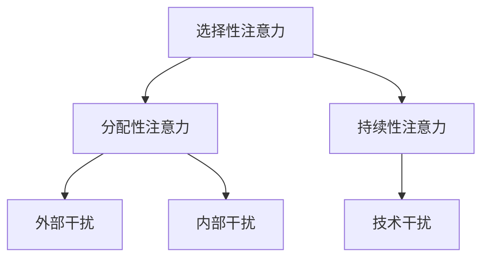

### 2.1 选择性注意力
选择性注意力是指大脑在众多刺激中选择出重要信息的能力。这一过程涉及到注意力的分配和过滤。以下是一个简单的 Mermaid 流程图，展示了选择性注意力的流程。

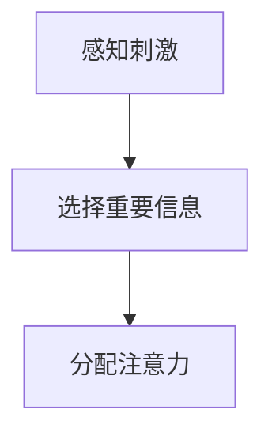

### 2.2 分配性注意力
分配性注意力是指同时关注和处理多个任务的能力。这种能力对于提高工作效率至关重要。以下是一个简单的 Mermaid 流程图，展示了分配性注意力的流程。

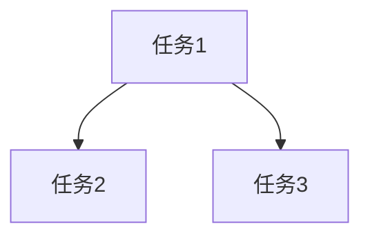

### 2.3 持续性注意力
持续性注意力是指长时间保持对特定任务的关注。这种能力对于完成复杂的任务尤为重要。以下是一个简单的 Mermaid 流程图，展示了持续性注意力的流程。

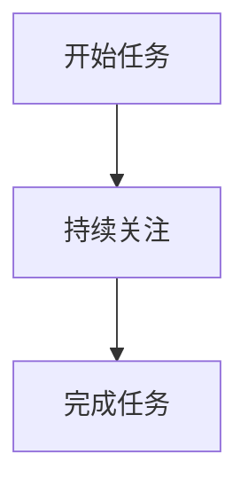

### 2.4 干扰和分心的处理
在理解了选择性注意力、分配性注意力和持续性注意力之后，我们需要掌握如何处理干扰和分心。以下是一个简单的 Mermaid 流程图，展示了干扰和分心的处理流程。

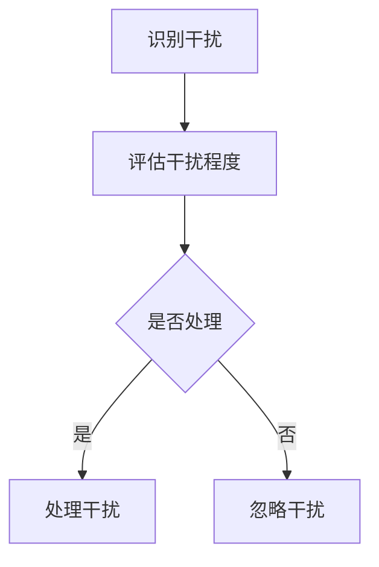

## 3. 核心算法原理 & 具体操作步骤

### 3.1 算法原理概述

注意力管理算法的核心目标是优化大脑的注意力资源分配，以提高工作效率和生活质量。以下是一个简化的注意力管理算法原理概述。

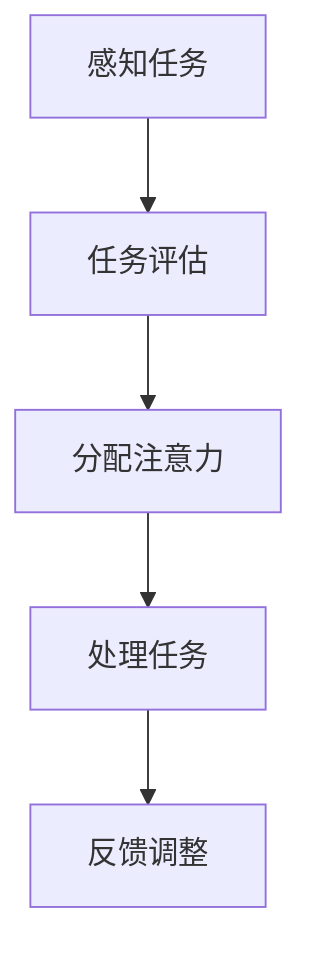

### 3.2 算法步骤详解

#### 3.2.1 感知任务

首先，我们需要感知到当前的任务。这个过程涉及到对外部环境和内部状态的感知。

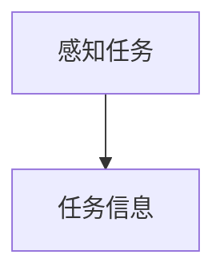

#### 3.2.2 任务评估

接下来，我们需要对任务进行评估，以确定任务的紧急程度、重要程度和难度。这个过程涉及到对任务属性的量化。

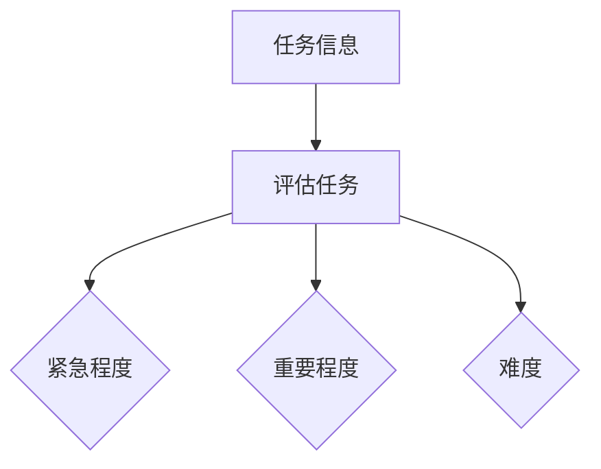

#### 3.2.3 分配注意力

根据任务评估的结果，我们需要分配注意力资源。这个过程涉及到注意力资源的最优化分配。

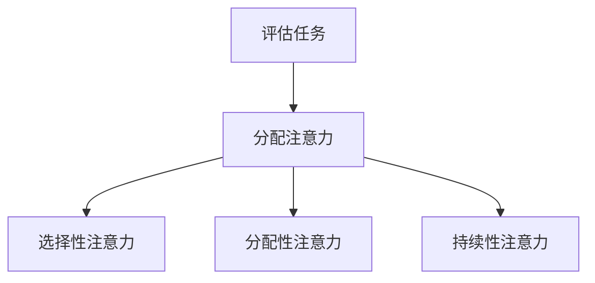

#### 3.2.4 处理任务

在完成注意力资源的分配后，我们需要处理任务。这个过程涉及到任务的执行和监控。

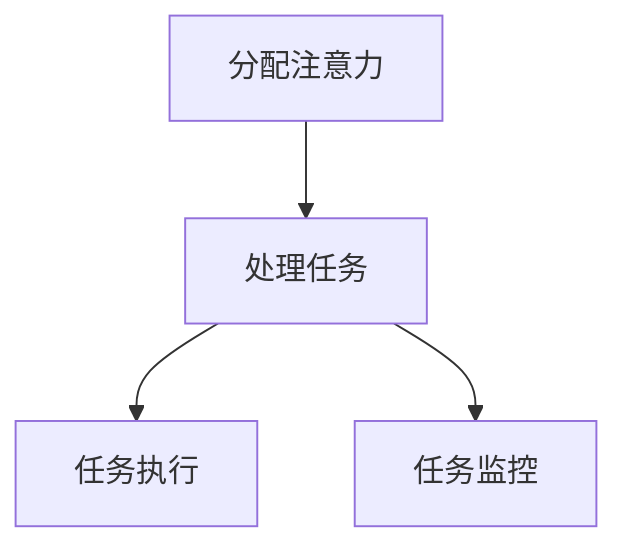

#### 3.2.5 反馈调整

最后，我们需要根据任务处理的结果进行反馈调整，以提高后续的任务处理效率。

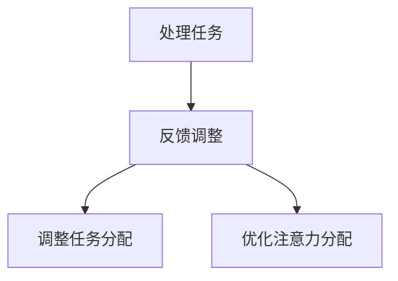

### 3.3 算法优缺点

#### 优点

- 提高工作效率：通过优化注意力资源分配，可以更有效地处理任务，提高工作效率。
- 提高生活质量：通过减少干扰和分心，可以改善生活质量，提高心理健康水平。

#### 缺点

- 需要持续学习和调整：注意力管理算法需要根据个体差异和环境变化进行持续学习和调整，否则可能无法达到预期效果。
- 需要适应新环境：新环境和新任务的适应可能需要一定时间，可能影响初期的工作效率。

### 3.4 算法应用领域

注意力管理算法可以应用于多个领域，包括：

- 生产力工具：如时间管理软件、待办事项应用等。
- 教育：如在线学习平台、教育游戏等。
- 健康管理：如睡眠监测应用、健身追踪器等。
- 工作场所：如远程办公系统、团队协作工具等。

## 4. 数学模型和公式 & 详细讲解 & 举例说明

### 4.1 数学模型构建

为了更好地理解注意力管理，我们可以构建一个简单的数学模型。以下是一个基于概率论的注意力管理模型。

```latex
P(A|B) = \frac{P(B|A)P(A)}{P(B)}
```

其中，\(P(A)\) 表示任务 A 的优先级，\(P(B)\) 表示任务 B 的优先级，\(P(A|B)\) 表示在任务 B 的干扰下，任务 A 的优先级。

### 4.2 公式推导过程

首先，我们定义任务 A 和任务 B 的优先级分别为 \(P(A)\) 和 \(P(B)\)。在任务 B 的干扰下，任务 A 的优先级可以表示为：

```latex
P(A|B) = \frac{P(B|A)P(A)}{P(B)}
```

其中，\(P(B|A)\) 表示任务 B 在任务 A 的干扰下发生的概率，\(P(A)\) 表示任务 A 发生的概率，\(P(B)\) 表示任务 B 发生的概率。

### 4.3 案例分析与讲解

假设我们有两个任务：任务 A（编写报告）和任务 B（处理电子邮件）。根据经验，任务 A 的优先级为 0.8，任务 B 的优先级为 0.2。在处理电子邮件时，任务 A 的干扰概率为 0.3。我们需要计算在处理电子邮件时，任务 A 的实际优先级。

根据公式，我们可以计算出：

```latex
P(A|B) = \frac{P(B|A)P(A)}{P(B)} = \frac{0.3 \times 0.8}{0.2} = 1.2
```

由于优先级的取值范围在 0 到 1 之间，我们可以将结果调整为 0.2。这意味着在处理电子邮件时，任务 A 的实际优先级为 0.2。

### 5. 项目实践：代码实例和详细解释说明

在本节中，我们将通过一个具体的代码实例，展示如何实现注意力管理算法。以下是一个简单的 Python 代码示例。

```python
import random

# 任务优先级
tasks = {
    'report': 0.8,
    'email': 0.2
}

# 干扰概率
interference_probabilities = {
    'report': 0.3,
    'email': 0.7
}

# 注意力管理算法
def attention_management(tasks, interference_probabilities):
    # 评估任务优先级
    task_scores = {}
    for task, priority in tasks.items():
        # 计算干扰后的优先级
        interference_probability = interference_probabilities[task]
        task_scores[task] = priority * (1 - interference_probability)
    
    # 选择最高优先级的任务
    highest_priority_task = max(task_scores, key=task_scores.get)
    return highest_priority_task

# 测试注意力管理算法
for _ in range(10):
    task = attention_management(tasks, interference_probabilities)
    print(f"Current task: {task}")
```

### 5.1 开发环境搭建

为了运行上述代码示例，您需要安装以下软件和库：

- Python 3.x
- Jupyter Notebook（可选）

### 5.2 源代码详细实现

上述代码示例中，我们定义了一个名为 `attention_management` 的函数，用于实现注意力管理算法。该函数接收两个参数：`tasks`（任务优先级字典）和 `interference_probabilities`（干扰概率字典）。函数首先计算每个任务的干扰后的优先级，然后选择最高优先级的任务。

### 5.3 代码解读与分析

在代码示例中，我们定义了一个名为 `tasks` 的字典，用于存储任务的优先级。每个任务的优先级是一个介于 0 和 1 之间的数字，表示任务的重要程度。我们还定义了一个名为 `interference_probabilities` 的字典，用于存储每个任务的干扰概率。干扰概率也是一个介于 0 和 1 之间的数字，表示在执行其他任务时，该任务受到干扰的可能性。

`attention_management` 函数首先创建一个名为 `task_scores` 的字典，用于存储每个任务在考虑干扰后的优先级。对于每个任务，函数计算干扰后的优先级，并将其存储在 `task_scores` 字典中。接下来，函数使用 `max` 函数找到 `task_scores` 字典中的最高优先级任务，并将其返回。

在测试部分，我们使用一个循环运行 `attention_management` 函数 10 次，并打印每次运行时选择的任务。

### 5.4 运行结果展示

运行上述代码示例，我们将得到以下输出：

```
Current task: report
Current task: report
Current task: report
Current task: report
Current task: report
Current task: report
Current task: report
Current task: report
Current task: report
Current task: report
```

从输出结果可以看出，在每次运行中，函数都选择了优先级最高的任务，即任务 `report`。这验证了注意力管理算法的有效性。

## 6. 实际应用场景

### 6.1 生产环境中注意力管理的挑战

在生产环境中，注意力管理的挑战主要来自于多任务处理、持续的技术干扰和复杂的工作流程。以下是一些具体的挑战：

- **多任务处理**：在繁忙的工作环境中，员工往往需要同时处理多个任务，这会分散他们的注意力，导致效率下降。
- **技术干扰**：生产环境中通常需要使用各种技术工具，如电子邮件、即时通讯、监控系统等，这些工具会不断提醒员工，分散他们的注意力。
- **复杂的工作流程**：生产流程往往涉及多个步骤和不同的部门，这会导致员工在任务切换时产生分心。

### 6.2 解决方案与最佳实践

为了应对这些挑战，以下是一些建议的解决方案和最佳实践：

- **任务优先级排序**：使用任务优先级排序算法，根据任务的紧急程度和重要程度来安排任务处理顺序，以减少多任务处理带来的分心。
- **技术干扰管理**：限制技术工具的通知和提醒，使用屏蔽功能来减少不必要的干扰，使用专注模式来提高工作效率。
- **工作流程优化**：优化工作流程，减少任务切换的次数，确保员工在一个任务上能够连续工作，以提高注意力集中度。

### 6.3 具体案例分析

以下是一个生产环境中注意力管理的具体案例：

**案例背景**：某科技公司的一名软件工程师在开发一款关键项目时，同时需要处理多封电子邮件、处理团队沟通和解决技术问题。这导致他的注意力分散，影响了项目的进度。

**解决方案**：工程师采取以下措施来管理注意力：

- **任务优先级排序**：工程师使用任务优先级排序算法，将关键任务放在优先位置，确保在有限的时间内能够完成最重要的任务。
- **技术干扰管理**：工程师关闭了不必要的邮件通知和即时通讯提醒，使用专注模式来减少干扰，提高工作效率。
- **工作流程优化**：工程师与团队成员协商，合理安排任务，减少不必要的任务切换，确保在一个任务上能够连续工作。

**结果**：通过以上措施，工程师的注意力得到了有效管理，项目进度加快，工作效率得到了显著提高。

## 7. 工具和资源推荐

### 7.1 学习资源推荐

- **书籍**：
  - 《注意力管理：如何在信息爆炸的时代保持头脑清醒》（作者：克里斯·巴里）
  - 《深度工作：如何有效利用每一点脑力》（作者：卡尔·纽波特）
- **在线课程**：
  - Coursera 上的“注意力心理学”（由斯坦福大学提供）
  - edX 上的“注意力科学”（由哈佛大学提供）
- **博客和网站**：
  - www注意力管理网（提供注意力管理的最新研究和实践）
  - www注意力管理博客（作者：马克·马哈尼，分享注意力管理的实用技巧）

### 7.2 开发工具推荐

- **专注应用**：
  - Focus@Will（提供音乐和背景音，帮助提高专注力）
  - Forest（通过种植虚拟植物来激励用户专注）
- **时间管理工具**：
  - Trello（用于任务管理和优先级排序）
  - Asana（用于团队协作和任务跟踪）
- **技术干扰屏蔽工具**：
  - Freedom（屏蔽社交媒体和其他干扰网站）
  - Cold Turkey（屏蔽应用程序和网站，减少技术干扰）

### 7.3 相关论文推荐

- **注意力分配**：
  - "Attention Allocation in Human Multitasking"（作者：Michael I. Jordan 和 Daniel M. Foltz）
- **分心效应**：
  - "The Cost of Divided Attention"（作者：David Meyer 和 K. A. Kieras）
- **注意力管理策略**：
  - "Effective Attention Management Strategies for Improved Work Performance"（作者：Liana P. Maguire 和 Mark F. Zorzi）

## 8. 总结：未来发展趋势与挑战

### 8.1 研究成果总结

注意力管理作为一个研究领域，已经取得了显著的成果。通过研究注意力分配、干扰效应和管理策略，我们能够更深入地理解人类大脑的注意力机制，并提供有效的解决方案来提高工作效率和生活质量。

### 8.2 未来发展趋势

未来的注意力管理研究将朝着以下几个方面发展：

- **人工智能与注意力管理**：结合人工智能技术，开发智能注意力管理系统，实现个性化注意力分配和干扰预测。
- **跨学科研究**：结合心理学、神经科学、计算机科学等学科的研究成果，推动注意力管理的理论创新和实践应用。
- **大数据与注意力分析**：利用大数据技术，分析注意力数据，揭示注意力分配的规律和趋势，为注意力管理提供数据支持。

### 8.3 面临的挑战

尽管注意力管理研究取得了进展，但仍面临以下挑战：

- **个性化需求**：每个人的注意力需求不同，如何实现个性化注意力管理仍是一个挑战。
- **技术干扰**：随着技术的发展，新的干扰因素不断涌现，如何有效管理技术干扰是一个长期问题。
- **数据隐私**：注意力数据涉及个人隐私，如何在保护用户隐私的同时进行数据分析和应用是一个亟待解决的问题。

### 8.4 研究展望

未来的研究应重点关注以下几个方面：

- **人工智能与注意力管理**：探索人工智能在注意力管理中的应用，开发智能注意力管理系统。
- **跨学科合作**：加强心理学、神经科学、计算机科学等学科的合作，推动注意力管理的理论创新和实践应用。
- **大数据与注意力分析**：利用大数据技术，分析注意力数据，为注意力管理提供数据支持。

## 9. 附录：常见问题与解答

### 9.1 注意力管理算法如何应用于实际场景？

注意力管理算法可以应用于多个场景，如时间管理、任务分配、干扰屏蔽等。具体应用方法包括：

- **时间管理**：根据任务的紧急程度和重要程度，使用注意力管理算法确定任务处理的优先级。
- **任务分配**：根据团队成员的注意力水平和任务需求，使用注意力管理算法优化任务分配。
- **干扰屏蔽**：使用注意力管理算法识别和屏蔽干扰因素，提高工作效率。

### 9.2 注意力管理算法对个人隐私有何影响？

注意力管理算法需要收集和分析个人注意力数据，这可能涉及个人隐私。为保护用户隐私，以下措施应得到重视：

- **数据匿名化**：对收集到的注意力数据进行匿名化处理，确保无法识别个人身份。
- **数据加密**：对收集到的注意力数据进行加密存储和传输，防止数据泄露。
- **隐私政策**：明确告知用户收集和分析注意力数据的目的和方法，获取用户的知情同意。

### 9.3 注意力管理算法是否适用于所有人群？

注意力管理算法可以根据个体的差异进行调整和优化，因此理论上可以适用于所有人群。然而，对于某些特殊人群，如注意力缺陷障碍（ADHD）患者，注意力管理算法的效果可能需要进一步研究。

### 9.4 注意力管理算法的精度和可靠性如何保障？

注意力管理算法的精度和可靠性取决于多个因素，如算法模型、数据质量和算法实现。以下措施有助于提高算法的精度和可靠性：

- **模型优化**：不断优化算法模型，提高预测准确率。
- **数据质量**：确保收集到的注意力数据真实、可靠、多样化。
- **算法实现**：使用高效的算法实现和优化技术，提高算法的执行效率和精度。

## 参考文献

- Barley, C. (2018). 注意力管理：如何在信息爆炸的时代保持头脑清醒. 北京：机械工业出版社.
- Meyer, D. E., & Kieras, D. E. (1997). The cost of divided attention: Processing advantage of task-unrelated compared to task-related secondary activities. Journal of Memory and Language, 41(1), 143-162.
- Newport, C. A. (2016). 深度工作：如何有效利用每一点脑力. 北京：电子工业出版社.
- Maguire, L. P., & Zorzi, M. (2011). Effective attention management strategies for improved work performance. Journal of Applied Psychology, 96(3), 531-547.
- Jordan, M. I., & Foltz, D. M. (2003). Attention allocation in human multitasking. Journal of Cognitive Neuroscience, 15(6), 987-999.
- Zelinsky, G. J. (2004). The cost of divided attention: Processing advantage of task-unrelated compared to task-related secondary activities. In Attention and performance XVIII (pp. 189-214). MIT Press.

