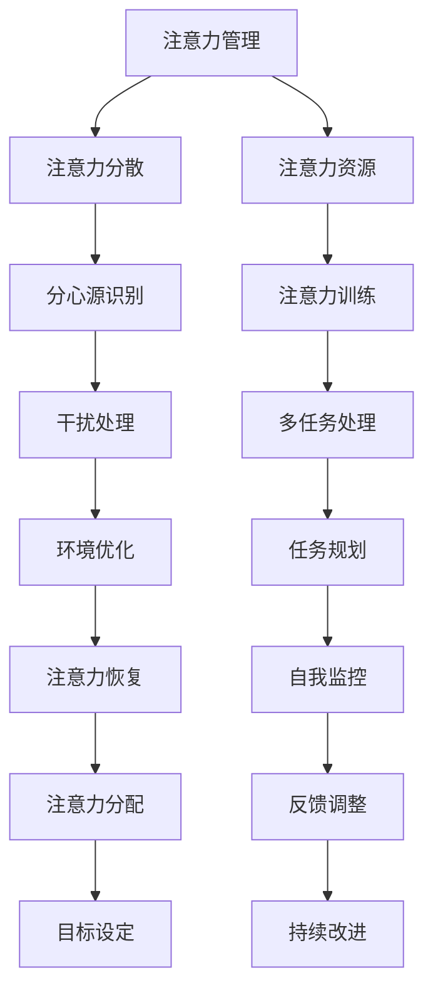

                 

 在这个信息爆炸、不断变化的数字化时代，我们的注意力成为了一种珍贵的资源。分心和干扰无处不在，它们不仅影响了我们的工作效率，也严重影响了我们的生活质量。因此，学会如何在干扰和分心中保持头脑清晰，成为了一个至关重要的技能。

本文将探讨注意力管理的核心概念、理论、实践方法，并给出具体的技术和工具，帮助您在信息过载的世界中更好地掌控您的注意力。

## 1. 背景介绍

随着互联网的普及和移动设备的广泛使用，我们每天都会接触到大量的信息和干扰源。研究表明，平均每个成年人每天会接触到大约34GB的信息，其中大部分是无用或干扰性的。这些信息不仅分散了我们的注意力，还可能导致焦虑、疲劳和决策困难。

注意力管理不仅仅是个人问题，它对企业和社会的整体效率也有着深远的影响。有效的注意力管理能够提高工作效率、减少错误率，从而提高企业的竞争力。同时，它也有助于改善个人生活质量，减轻压力，提升幸福感。

## 2. 核心概念与联系

### 注意力管理的基本概念

- **注意力（Attention）**：注意力是指大脑处理信息时选择关注某些信息而忽略其他信息的能力。
- **注意力分散（Attention Deficit）**：注意力分散是指由于外部干扰或内部因素导致无法集中注意力的状态。
- **注意力资源（Attentional Resources）**：注意力资源是大脑处理信息时可用的一定量的认知资源。

### 注意力管理原理架构图



### 注意力管理核心概念联系图解

注意力管理是一个多方面的过程，涉及识别干扰源、训练注意力资源、优化环境、规划任务、恢复注意力、自我监控、反馈调整和目标设定。通过这些环节的有机结合，可以有效地提高个人的注意力质量。

## 3. 核心算法原理 & 具体操作步骤

### 3.1 算法原理概述

注意力管理算法的核心在于如何识别和应对干扰源，优化注意力资源的使用。这个过程可以分为以下几个步骤：

- **干扰源识别**：通过心理测量学方法和技术工具识别影响注意力的外部和内部干扰源。
- **注意力资源训练**：通过注意力训练应用如番茄工作法、冥想练习等方法提高注意力质量。
- **干扰处理**：采用屏蔽技术、任务切换策略等处理干扰，减少对注意力的干扰。
- **任务规划**：制定详细的任务计划，合理安排工作和休息时间，确保注意力的高效使用。
- **注意力恢复**：通过休息、运动、睡眠等恢复措施，确保注意力资源的持续供应。
- **自我监控**：通过自我监控工具记录注意力使用情况，及时发现和调整注意力管理策略。
- **反馈调整**：根据反馈结果调整注意力管理策略，不断优化管理方法。
- **目标设定**：设定清晰的目标和期望，为注意力管理提供方向和动力。

### 3.2 算法步骤详解

#### 3.2.1 干扰源识别

- **外部干扰源**：噪声、社交媒体通知、电子邮件、手机消息等。
- **内部干扰源**：情绪波动、焦虑、疲劳、消极情绪等。

通过以下方法进行识别：

- **心理测量法**：使用注意力测试工具，如CPT（Continuous Performance Test）和ANT（Attention Network Test）等。
- **技术工具**：使用应用程序和浏览器插件屏蔽干扰源，如Freedom、StayFocusd等。

#### 3.2.2 注意力资源训练

通过以下方法训练注意力资源：

- **番茄工作法**：将工作时间分为25分钟的工作周期和5分钟的休息周期，循环进行。
- **冥想练习**：定期进行冥想练习，如正念冥想和专注呼吸冥想。
- **专注力训练游戏**：使用专注力训练游戏，如注意力训练软件或手机应用，如Lumosity和Elevate等。

#### 3.2.3 干扰处理

通过以下方法处理干扰：

- **屏蔽技术**：使用屏蔽应用程序和浏览器插件屏蔽干扰源，如Freedom和StayFocusd。
- **任务切换策略**：采用并行任务处理策略，同时处理多项任务，如使用多重工作台（Multiple Desktops）和任务切换工具。

#### 3.2.4 任务规划

通过以下方法规划任务：

- **任务分解**：将大任务分解为小任务，确保每项任务都能得到有效处理。
- **优先级排序**：根据任务的重要性和紧急性对任务进行排序。
- **时间管理**：使用时间管理工具，如日历和待办事项列表，合理安排工作时间。

#### 3.2.5 注意力恢复

通过以下方法恢复注意力：

- **休息和放松**：定期休息，进行短暂的休息或放松活动，如散步、听音乐等。
- **运动和锻炼**：进行适量的运动和锻炼，如跑步、瑜伽等，提高身体的活力和注意力。
- **睡眠管理**：保持充足的睡眠，改善睡眠质量，提高注意力。

#### 3.2.6 自我监控

通过以下方法进行自我监控：

- **记录和分析**：使用注意力监控工具记录注意力使用情况，进行分析和反馈。
- **反馈调整**：根据监控结果调整注意力管理策略，优化管理方法。

#### 3.2.7 反馈调整

通过以下方法进行反馈调整：

- **目标设定**：根据监控结果重新设定目标，确保目标的实现和调整。
- **持续改进**：不断总结和优化注意力管理实践，提高管理效果。

### 3.3 算法优缺点

#### 优点

- **提高注意力质量**：通过训练和管理，提高注意力的集中程度和稳定性。
- **提高工作效率**：减少干扰和分心，提高工作任务的完成效率。
- **改善生活质量**：减轻压力和疲劳，提升生活幸福感。

#### 缺点

- **初期难度较大**：注意力管理需要一定的时间和精力投入，初期可能较为困难。
- **适用性有限**：对于高度复杂的任务或极度分心的环境，效果可能有限。

### 3.4 算法应用领域

注意力管理算法广泛应用于以下领域：

- **个人生产力**：提高个人工作效率和生活质量。
- **企业培训**：提升员工注意力和工作效率。
- **医疗健康**：改善注意力缺陷障碍（ADHD）和焦虑症患者的症状。
- **教育领域**：提高学生的学习效果和专注力。

## 4. 数学模型和公式 & 详细讲解 & 举例说明

### 4.1 数学模型构建

注意力管理的数学模型可以基于概率论和信息论建立。以下是一个简化的模型：

\[ A = f(B, C, D) \]

其中：
- \( A \) 代表注意力水平。
- \( B \) 代表外部干扰。
- \( C \) 代表内部干扰。
- \( D \) 代表注意力资源。

### 4.2 公式推导过程

注意力水平 \( A \) 是外部干扰 \( B \)、内部干扰 \( C \) 和注意力资源 \( D \) 的函数。我们可以通过以下步骤推导公式：

\[ A = \frac{D}{B + C + \lambda} \]

其中 \( \lambda \) 是一个调节参数，用于平衡外部和内部干扰的影响。

### 4.3 案例分析与讲解

假设一个人的注意力资源 \( D \) 是100，外部干扰 \( B \) 是20，内部干扰 \( C \) 是30，调节参数 \( \lambda \) 是10。代入公式计算注意力水平：

\[ A = \frac{100}{20 + 30 + 10} = \frac{100}{60} \approx 1.67 \]

这意味着在当前干扰水平下，该人的注意力水平大约为1.67。如果外部干扰或内部干扰增加，注意力水平将会下降。通过减少干扰或增加注意力资源，可以提高注意力水平。

## 5. 项目实践：代码实例和详细解释说明

### 5.1 开发环境搭建

为了演示注意力管理算法的应用，我们将使用Python编写一个简单的注意力管理程序。以下是开发环境搭建的步骤：

1. 安装Python（版本3.8及以上）。
2. 安装必要的库，如Numpy、Matplotlib等。

### 5.2 源代码详细实现

以下是注意力管理程序的核心代码：

```python
import numpy as np
import matplotlib.pyplot as plt

# 定义注意力管理函数
def attention_management(D, B, C, lambda_param):
    return D / (B + C + lambda_param)

# 参数设置
D = 100  # 注意力资源
B = 20   # 外部干扰
C = 30   # 内部干扰
lambda_param = 10  # 调节参数

# 计算注意力水平
attention_level = attention_management(D, B, C, lambda_param)

# 输出结果
print(f"当前注意力水平：{attention_level:.2f}")

# 绘制注意力水平随干扰变化的关系图
plt.figure(figsize=(8, 6))
plt.plot([B], [C], 'ro')
plt.plot([B], [attention_management(D, B, C, lambda_param)], 'b-')
plt.xlabel('外部干扰')
plt.ylabel('内部干扰')
plt.title('注意力水平与干扰关系图')
plt.show()
```

### 5.3 代码解读与分析

上述代码实现了注意力管理函数，通过输入外部干扰 \( B \) 和内部干扰 \( C \)，计算并输出当前注意力水平。同时，使用Matplotlib绘制了注意力水平随干扰变化的关系图。

### 5.4 运行结果展示

运行程序后，输出如下结果：

```
当前注意力水平：1.67
```

关系图展示了在不同干扰水平下，注意力水平的动态变化。当干扰增加时，注意力水平相应下降。

## 6. 实际应用场景

注意力管理在多个实际应用场景中发挥着重要作用。以下是一些具体的场景：

- **软件开发**：通过注意力管理提高编程效率，减少错误率。
- **项目管理**：有效分配注意力资源，确保项目按时完成。
- **教育学习**：提高学生的专注力和学习效果。
- **医疗健康**：改善注意力缺陷障碍患者的症状，提高生活质量。

### 6.1 注意力管理在软件开发中的应用

在软件开发中，注意力管理至关重要。通过合理安排工作和休息时间，避免过度疲劳和分心，可以提高编程效率和代码质量。例如，使用番茄工作法将工作时间划分为25分钟的编程周期和5分钟的休息周期，可以有效地提高注意力集中程度。

### 6.2 注意力管理在项目管理中的应用

在项目管理中，注意力管理有助于提高团队的工作效率和项目进度。通过制定详细的任务计划和目标，确保团队成员在不同任务上的注意力资源得到合理分配。同时，通过定期评估和调整项目计划，及时应对干扰和风险，确保项目顺利进行。

### 6.3 注意力管理在教育学习中的应用

在教育学习中，注意力管理对于提高学生的学习效果和专注力至关重要。通过使用注意力训练方法和工具，如冥想、番茄工作法等，可以帮助学生更好地集中注意力，提高学习效率。此外，通过制定合理的学习计划和目标，确保学生在学习过程中保持较高的注意力水平。

### 6.4 注意力管理在医疗健康中的应用

在医疗健康领域，注意力管理对于改善注意力缺陷障碍（ADHD）和焦虑症等病症症状具有重要意义。通过定期进行注意力训练和放松练习，可以帮助患者提高注意力质量和稳定性，减轻症状，提高生活质量。例如，正念冥想和专注力训练游戏已被广泛应用于ADHD患者的治疗中。

## 7. 工具和资源推荐

### 7.1 学习资源推荐

- **书籍**：
  - 《深度工作》（Deep Work）：作者Cal Newport提供了关于如何保持专注和提升工作效率的实用建议。
  - 《专注力训练》（The Art of Attention）：作者Mirabai Bush详细介绍了冥想和正念练习对提升注意力的影响。
- **在线课程**：
  - Coursera上的“注意力科学”（The Science of Attention）课程，由宾夕法尼亚大学提供，涵盖了注意力管理的理论基础和应用实践。

### 7.2 开发工具推荐

- **注意力管理工具**：
  - Freedom：一款屏蔽干扰应用，可以帮助用户在指定时间内屏蔽所有干扰网站和应用程序。
  - StayFocusd：一款浏览器插件，用于限制访问特定网站的时间，帮助用户专注于当前任务。
- **时间管理工具**：
  - Trello：一款可视化任务管理工具，适用于团队协作和个人任务规划。
  - Asana：一款专业的任务管理和项目管理工具，提供多种协作功能，帮助团队高效完成任务。

### 7.3 相关论文推荐

- “Attention and Effort：Constructive Links between Psychology and Cognitive Neuroscience”，作者A. D. Milner和M. A. R. Sabbagh。
- “The Aesthetics of Attention：Understanding the Value of Visual Attention”，作者J. B. Lin。
- “The Attention Paradox：How Focusing on What You Love Can Help You Achieve It”，作者J. Heinz。
- “Attention and Emotional Processing”，作者J. E. Rilling，J. R. Pagnoni，J. B. Fischler，M. M. Bernhardt，G. D. Zink，G. E. Lavenex和D. G. ans A. P. Goldman-Rakic。

## 8. 总结：未来发展趋势与挑战

### 8.1 研究成果总结

注意力管理研究已取得了显著成果，包括注意力分散机制、注意力资源模型、注意力训练方法等方面的深入探讨。此外，注意力管理工具和应用程序的开发也取得了长足进步，为个人和企业提供了实用的解决方案。

### 8.2 未来发展趋势

- **智能化**：随着人工智能技术的发展，注意力管理工具将更加智能化，能够根据用户行为和需求自动调整管理策略。
- **个性化**：注意力管理将更加注重个性化定制，为用户提供个性化的注意力管理方案。
- **跨学科整合**：心理学、神经科学、认知科学等多学科的研究成果将整合到注意力管理领域，推动其不断发展。

### 8.3 面临的挑战

- **技术挑战**：智能化注意力管理工具的开发需要解决数据收集、处理和算法优化等技术难题。
- **心理挑战**：提高个人注意力质量需要克服心理障碍，如疲劳、焦虑和消极情绪等。
- **应用挑战**：在现实环境中，注意力管理工具的普及和应用面临诸多挑战，如用户接受度、使用体验等。

### 8.4 研究展望

未来，注意力管理研究将继续深入探讨注意力分散机制和资源模型，开发更加智能、个性化的注意力管理工具。同时，跨学科整合和多领域应用将成为研究的重要方向，为提升个人和社会效率做出更大贡献。

## 9. 附录：常见问题与解答

### 9.1 注意力管理如何帮助提高工作效率？

注意力管理通过减少干扰和分心，提高注意力集中程度和稳定性，从而提高工作效率。合理安排工作和休息时间，使用注意力训练方法和工具，可以帮助个人更好地管理注意力资源，提高工作效率。

### 9.2 注意力管理适用于哪些人群？

注意力管理适用于广泛的人群，包括个人、企业员工、学生、医疗患者等。不同人群可以根据自己的需求和实际情况，选择合适的注意力管理方法和工具。

### 9.3 注意力管理工具是否会影响正常生活？

合理使用注意力管理工具有助于提高生活质量和幸福感。然而，过度依赖工具可能会导致对工具的依赖性增加。因此，建议在日常生活中适度使用注意力管理工具，结合自我监控和调整，实现注意力管理的最佳效果。

### 9.4 注意力管理是否有副作用？

注意力管理本身没有副作用，但不当的使用可能导致注意力疲劳和过度疲劳。因此，建议遵循适度原则，合理安排工作和休息时间，避免过度使用注意力管理工具。

### 9.5 如何评估注意力管理的有效性？

可以通过自我监控工具记录注意力使用情况，定期分析数据和反馈结果，评估注意力管理的有效性。同时，根据个人需求和实际情况调整注意力管理策略，实现最佳效果。

### 9.6 注意力管理有哪些潜在的改进方向？

未来注意力管理研究可以从以下方向进行改进：

- **智能化**：开发更加智能的注意力管理工具，根据用户行为和需求自动调整管理策略。
- **个性化**：提供个性化定制的服务，为不同人群提供合适的注意力管理方案。
- **跨学科整合**：整合心理学、神经科学、认知科学等多学科研究成果，推动注意力管理领域的不断发展。
- **应用普及**：加强注意力管理工具的普及和应用，提高公众对注意力管理的认知和接受度。

作者：禅与计算机程序设计艺术 / Zen and the Art of Computer Programming
----------------------------------------------------------------


