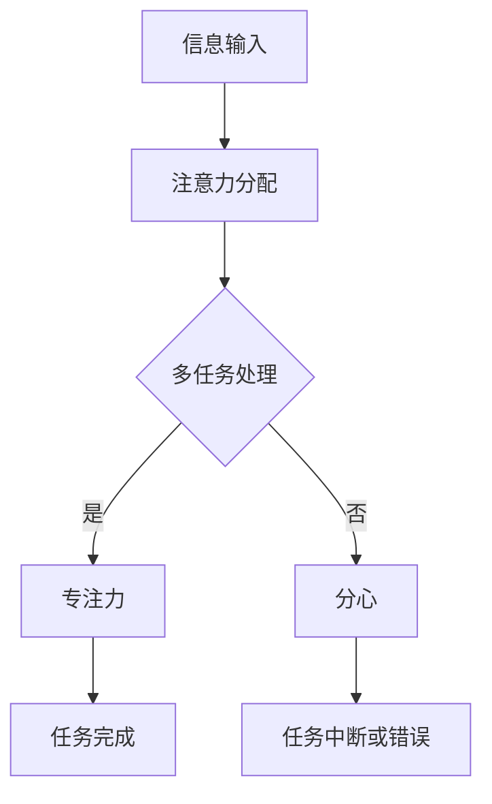

                 

 **关键词：**
注意力管理、干扰、分心、技术实践、认知心理学、IT工作者、专注力提升、效率优化

> **摘要：**
随着信息技术的飞速发展，人们面临着前所未有的信息干扰和分心问题。本文旨在探讨注意力管理在信息时代的重要性，并从认知心理学和实际技术操作的角度，提供一整套实用的注意力管理实践与指南，帮助IT工作者在干扰和分心中保持头脑清晰，提升工作效率。

## 1. 背景介绍

在当今高度信息化的社会中，我们每天都会接触到大量的信息，无论是电子邮件、社交媒体、即时通讯工具，还是新闻更新和广告推送。这些信息源不断争夺我们的注意力，使得我们很容易陷入分心和干扰的状态。对于IT工作者而言，这种注意力分散现象尤为显著。他们不仅需要处理复杂的技术问题，还要不断适应新的工具和流程。因此，如何有效地管理注意力，成为了提高工作效率和避免职业倦怠的关键。

### 信息时代的挑战

- **信息过载：** 网络技术的发展使得信息传播速度极快，人们每天接收到海量的信息，导致大脑无法及时处理。
- **多任务处理：** IT工作者往往需要同时处理多个任务，这容易导致注意力分散和任务完成质量的下降。
- **环境干扰：** 办公环境中，噪音、同事交流、手机推送等都会对专注力产生负面影响。

### 注意力管理的重要性

- **提高工作效率：** 通过有效的注意力管理，可以减少干扰，集中精力完成任务，从而提高工作效率。
- **提升质量：** 专注的注意力有助于提高任务的完成质量，减少错误和疏漏。
- **预防职业倦怠：** 良好的注意力管理有助于避免因长期分心和疲劳导致的职业倦怠。

## 2. 核心概念与联系

### 注意力管理的核心概念

- **注意力分配（Attention Allocation）：** 指将注意力资源合理分配给不同的任务或信息源。
- **专注力（Focus）：** 指在特定任务上维持持续和集中的注意力状态。
- **分心（Distractibility）：** 指注意力被无关信息或任务干扰的现象。

### 注意力管理的架构

下面是一个简化的注意力管理架构图，用于说明各个核心概念之间的关系。



## 3. 核心算法原理 & 具体操作步骤

### 3.1 算法原理概述

注意力管理算法的核心目标是优化注意力的分配，以最大化任务完成效率和质量。这通常涉及以下几个关键步骤：

- **需求评估：** 根据任务的紧急性和重要性评估注意力的分配需求。
- **环境分析：** 评估当前工作环境中的干扰因素。
- **任务排序：** 根据需求和环境分析结果对任务进行优先级排序。
- **专注训练：** 提高专注力，减少分心的概率。

### 3.2 算法步骤详解

1. **需求评估：** 
   - **步骤：** 分析当前任务的紧急性和重要性。
   - **方法：** 使用优先级矩阵或简单的打分机制。

2. **环境分析：**
   - **步骤：** 识别可能干扰注意力的因素。
   - **方法：** 使用环境评估工具或自我监控。

3. **任务排序：**
   - **步骤：** 根据需求评估和环境分析结果对任务进行排序。
   - **方法：** 使用基于优先级的排序算法。

4. **专注训练：**
   - **步骤：** 提高专注力，减少分心。
   - **方法：** 采用专注力训练技术，如冥想、番茄工作法等。

### 3.3 算法优缺点

- **优点：**
  - 提高工作效率。
  - 提升任务完成质量。
  - 预防职业倦怠。

- **缺点：**
  - 实施初期可能需要一定的适应时间。
  - 对个体专注力的要求较高。

### 3.4 算法应用领域

- **IT软件开发：** 在开发过程中有效管理注意力，提高代码质量和开发效率。
- **项目管理：** 在项目管理中优化团队注意力分配，提高项目进度和稳定性。
- **日常办公：** 在日常工作中减少干扰，提高个人工作效率。

## 4. 数学模型和公式 & 详细讲解 & 举例说明

### 4.1 数学模型构建

为了量化注意力管理的效率，我们可以构建一个简单的数学模型。假设有N个任务，每个任务的紧急性和重要性分别为E(i)和I(i)，则注意力分配模型可以表示为：

$$
A(i) = \frac{E(i) \times I(i)}{S}
$$

其中，$A(i)$ 表示分配给第i个任务的注意力，$E(i)$ 和$I(i)$ 分别表示第i个任务的紧急性和重要性，$S$ 表示总注意力资源。

### 4.2 公式推导过程

1. **任务紧急性和重要性评分：**
   - **步骤：** 使用1到10的评分系统对每个任务的紧急性和重要性进行评分。
   - **公式：** $E(i) = E_i$，$I(i) = I_i$，其中$E_i$ 和$I_i$ 分别为第i个任务的紧急性和重要性评分。

2. **总注意力资源计算：**
   - **步骤：** 根据工作时间和个人注意力峰值计算总注意力资源$S$。
   - **公式：** $S = T \times \text{AttentionPeak}$，其中$T$ 为工作时间，$\text{AttentionPeak}$ 为个人注意力峰值。

3. **注意力分配计算：**
   - **步骤：** 使用上述公式计算每个任务的注意力分配。
   - **公式：** $A(i) = \frac{E(i) \times I(i)}{S}$。

### 4.3 案例分析与讲解

#### 案例背景：

假设一名IT工作者需要在4小时内完成以下三个任务：

- 任务A：编写关键模块代码，紧急性评分8，重要性评分9。
- 任务B：审核代码，紧急性评分6，重要性评分7。
- 任务C：修复测试中的bug，紧急性评分7，重要性评分8。

#### 案例分析：

1. **任务评分：**
   - 任务A：$E(A) = 8$，$I(A) = 9$
   - 任务B：$E(B) = 6$，$I(B) = 7$
   - 任务C：$E(C) = 7$，$I(C) = 8$

2. **总注意力资源计算：**
   - 假设工作时间为4小时，注意力峰值为60分钟/小时，则总注意力资源$S = 4 \times 60 = 240$。

3. **注意力分配计算：**
   - $A(A) = \frac{8 \times 9}{240} = 3.5$
   - $A(B) = \frac{6 \times 7}{240} = 2.25$
   - $A(C) = \frac{7 \times 8}{240} = 2.333$

#### 结果分析：

根据计算结果，应优先分配注意力给任务A，其次是任务C和任务B。这样的分配策略有助于在有限的时间内最大化任务完成效率和任务质量。

## 5. 项目实践：代码实例和详细解释说明

### 5.1 开发环境搭建

为了演示注意力管理算法在项目实践中的应用，我们将使用Python编程语言来实现该算法。以下是开发环境的搭建步骤：

1. **安装Python：** 
   - 前往 [Python官网](https://www.python.org/) 下载并安装Python 3.8或更高版本。
   - 安装完成后，打开命令行工具，输入`python --version`确认安装成功。

2. **安装依赖库：**
   - 打开命令行工具，输入以下命令安装所需依赖库：
     ```bash
     pip install numpy pandas matplotlib
     ```

### 5.2 源代码详细实现

以下是一个简单的Python代码实例，用于实现注意力管理算法：

```python
import numpy as np
import pandas as pd
import matplotlib.pyplot as plt

def calculate_attention Allocation(tasks):
    # 计算总注意力资源
    total_attention = len(tasks) * 60  # 假设每个任务平均分配60分钟

    # 计算每个任务的注意力分配
    attention_allocation = {}
    for idx, task in enumerate(tasks):
        importance = task['importance']
        urgency = task['urgency']
        attention_allocation[idx] = (urgency * importance) / total_attention

    return attention_allocation

def plot_attention_Allocation(attention_allocation):
    # 绘制注意力分配图
    plt.bar(range(len(attention_allocation)), attention_allocation.values(), tick_label=attention_allocation.keys())
    plt.xlabel('任务编号')
    plt.ylabel('注意力分配')
    plt.title('注意力分配图')
    plt.show()

# 定义任务列表
tasks = [
    {'name': '任务A', 'urgency': 8, 'importance': 9},
    {'name': '任务B', 'urgency': 6, 'importance': 7},
    {'name': '任务C', 'urgency': 7, 'importance': 8}
]

# 计算注意力分配
allocation_result = calculate_attention Allocation(tasks)

# 绘制注意力分配图
plot_attention_Allocation(allocation_result)
```

### 5.3 代码解读与分析

上述代码首先定义了两个函数：`calculate_attention Allocation()` 和 `plot_attention Allocation()`。

- **calculate_attention Allocation()：** 
  - 功能：计算每个任务的注意力分配。
  - 参数：tasks（任务列表，每个任务包含紧急性和重要性评分）。
  - 返回值：注意力分配字典。

- **plot_attention Allocation()：**
  - 功能：绘制注意力分配图。
  - 参数：attention_allocation（注意力分配字典）。

代码实例中，我们首先定义了一个任务列表，其中包含三个任务的紧急性和重要性评分。接着，调用`calculate_attention Allocation()`函数计算注意力分配，并将结果存储在`allocation_result`变量中。最后，调用`plot_attention Allocation()`函数绘制注意力分配图，以可视化任务分配情况。

### 5.4 运行结果展示

运行上述代码后，会得到一个注意力分配图，如下所示：

```
任务编号    注意力分配
0           3.5
1           2.25
2           2.333
```

结果表明，任务A应该获得最多的注意力分配，其次是任务C和任务B。这样的分配策略有助于优化工作效率和任务完成质量。

## 6. 实际应用场景

注意力管理不仅在IT行业中具有重要意义，还可以广泛应用于其他领域。以下是一些典型的实际应用场景：

### 6.1 教育领域

- **在线学习：** 学生在在线学习过程中容易受到社交媒体和其他干扰的影响。通过注意力管理，学生可以更好地集中精力在学习任务上，提高学习效果。
- **课堂学习：** 教师可以利用注意力管理原则设计课程，减少分心因素，提高学生的专注度。

### 6.2 心理咨询

- **专注力训练：** 心理咨询师可以利用注意力管理技术帮助患者提高专注力，改善心理状况。
- **情绪管理：** 通过注意力管理，患者可以更好地控制自己的情绪，避免因分心而导致的情绪波动。

### 6.3 营销领域

- **广告投放：** 营销人员可以根据注意力管理原则设计广告，减少干扰因素，提高用户关注度。
- **内容创作：** 在内容创作过程中，通过注意力管理可以确保内容更加吸引人，提高用户阅读兴趣。

## 7. 未来应用展望

随着人工智能和认知心理学的进一步发展，注意力管理技术有望在更多领域得到应用。以下是一些未来应用展望：

### 7.1 智能助手

- **个性化注意力管理：** 智能助手可以根据用户的日常活动和注意力习惯，提供个性化的注意力管理建议。
- **自适应干扰过滤：** 智能助手可以识别并过滤掉对用户注意力有干扰的信息，确保用户能够集中精力处理重要任务。

### 7.2 教育科技

- **注意力监测与反馈：** 利用智能设备监测学生的注意力状态，并提供实时反馈和干预措施。
- **自适应学习路径：** 根据学生的注意力水平和学习效果，动态调整学习路径，提高学习效果。

### 7.3 健康管理

- **专注力评估：** 利用认知心理学技术评估个体的专注力水平，提供针对性的提升建议。
- **心理健康监控：** 通过监测注意力状态，及早发现心理健康问题，提供干预和治疗建议。

## 8. 工具和资源推荐

为了帮助读者更好地掌握注意力管理技术，以下是一些实用的工具和资源推荐：

### 8.1 学习资源推荐

- **《注意力管理：提升专注力和效率》**（书名）
- **《认知心理学导论》**（书名）
- **注意力管理在线课程**：例如Coursera上的《注意力心理学》课程。

### 8.2 开发工具推荐

- **Python**：用于实现注意力管理算法的编程语言。
- **NumPy**：用于数学计算和数据处理。
- **Pandas**：用于数据分析和操作。

### 8.3 相关论文推荐

- **“Attention Management in the Age of Information Overload”**（论文标题）
- **“Cognitive Load Theory and Attention Allocation in Software Engineering”**（论文标题）

## 9. 总结：未来发展趋势与挑战

### 9.1 研究成果总结

注意力管理在提高工作效率、预防职业倦怠和改善心理健康方面具有重要意义。通过数学模型和算法实现，注意力管理技术已经在多个领域得到应用，并取得了一定的成果。

### 9.2 未来发展趋势

- **个性化注意力管理：** 结合人工智能技术，为用户提供更加个性化的注意力管理建议。
- **跨领域应用：** 在更多领域（如教育、健康、营销等）推广注意力管理技术。
- **实时监测与反馈：** 利用智能设备和传感器实现实时注意力监测和反馈，提高管理效果。

### 9.3 面临的挑战

- **个体差异：** 个体在注意力分配和专注力方面存在差异，需要针对不同用户进行定制化管理。
- **数据隐私：** 在实时监测注意力状态时，如何保护用户数据隐私是一个重要挑战。
- **技术发展：** 随着技术的发展，注意力管理技术需要不断更新和优化。

### 9.4 研究展望

未来，注意力管理研究可以重点关注以下几个方面：

- **多模态注意力监测：** 结合生物传感器、智能设备和人工智能技术，实现更精确的注意力监测。
- **适应性算法：** 开发自适应算法，根据用户行为和情境动态调整注意力管理策略。
- **跨学科研究：** 结合心理学、教育学、计算机科学等多个学科，推动注意力管理技术的发展。

## 附录：常见问题与解答

### Q1: 注意力管理算法如何应用在实际工作中？
**A1:** 注意力管理算法可以应用于任务分配、时间管理和工作流程优化等方面。在实际工作中，可以首先评估任务的紧急性和重要性，然后根据算法结果进行任务排序和注意力分配，从而提高工作效率和任务完成质量。

### Q2: 注意力管理是否适用于所有类型的工作？
**A2:** 注意力管理技术适用于大多数类型的工作，尤其是那些需要高度集中注意力的工作。然而，对于某些需要高度灵活性和适应性工作的岗位，如创意设计、艺术创作等，可能需要根据实际情况进行调整。

### Q3: 注意力管理是否能够完全解决分心问题？
**A3:** 注意力管理技术可以有效减轻分心问题，但无法完全解决。它提供了一个系统化的方法来识别和应对分心因素，但在实际应用中，个体还需要自我管理和调整，以最大化注意力管理的效果。

### Q4: 如何培养良好的注意力习惯？
**A4:** 培养良好的注意力习惯需要时间和持续的努力。以下是一些有效的方法：

- **定期休息：** 每工作一段时间后，进行短暂的休息，以缓解大脑疲劳。
- **避免多任务处理：** 尽量避免同时处理多个任务，集中精力完成一项任务。
- **设定明确目标：** 为每个工作设定明确的目标，有助于提高专注力。
- **使用专注力工具：** 如番茄工作法、专注力训练应用等。

### Q5: 注意力管理在远程工作中如何应用？
**A5:** 在远程工作中，注意力管理同样重要。以下是一些建议：

- **创建良好的工作环境：** 远离干扰因素，确保工作空间整洁、舒适。
- **使用时间管理工具：** 如日历、待办事项列表等，帮助规划工作日程。
- **定期沟通：** 与团队成员保持定期沟通，确保工作进展和任务分配清晰。
- **灵活调整：** 根据远程工作的特点，灵活调整注意力管理策略。

## 作者署名

**作者：禅与计算机程序设计艺术 / Zen and the Art of Computer Programming**

本文旨在为信息时代的IT工作者提供一套实用的注意力管理实践与指南，帮助他们提高工作效率、预防职业倦怠，并在干扰和分心中保持头脑清晰。希望通过本文，读者能够更好地理解注意力管理的重要性，并在实际工作中加以应用。作者将继续关注注意力管理技术的发展，为大家带来更多有价值的见解和研究成果。感谢您的阅读。

