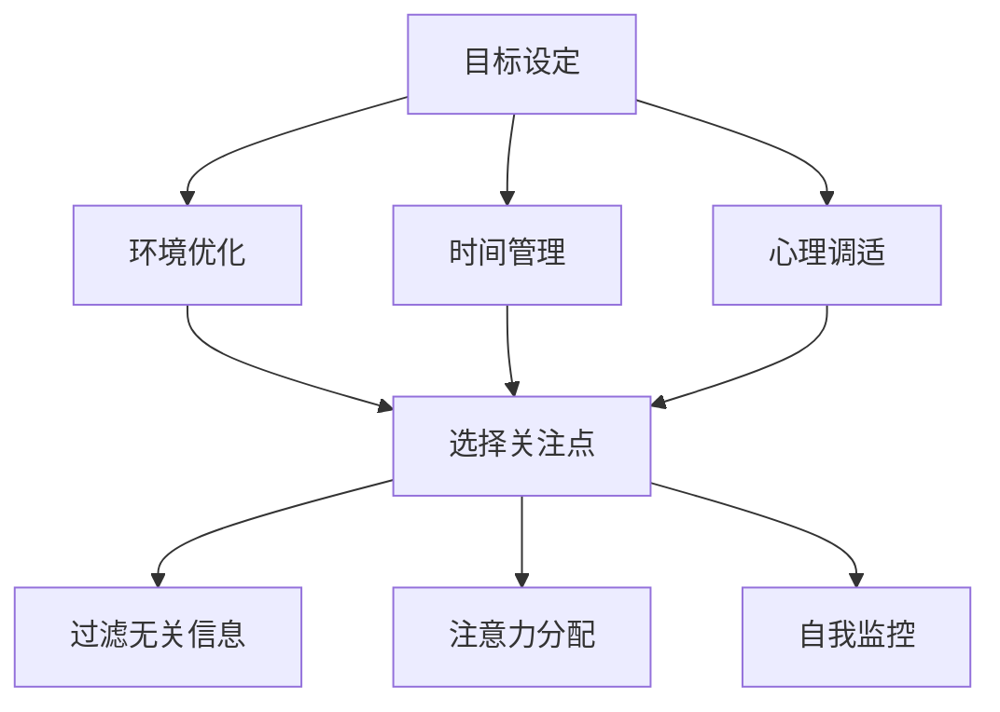

                 

在当今的信息时代，我们的生活中充满了各种干扰和分心源。社交媒体、电子邮件、即时通讯工具、新闻推送、广告等等，这些都使得我们的注意力分散，很难集中精力完成一项任务。本篇文章旨在探讨注意力管理的实践和指南，帮助我们在干扰和分心中保持头脑清晰。

> 关键词：注意力管理、信息过载、分心、专注力、实践指南

> 摘要：本文首先介绍了注意力管理的重要性，分析了信息过载对我们注意力的挑战。随后，本文提出了一系列实用的策略和方法，帮助我们在复杂的环境中保持专注。最后，本文探讨了未来注意力管理领域的发展趋势和面临的挑战。

## 1. 背景介绍

### 1.1 注意力管理的概念

注意力管理是指个体在特定环境下，通过策略和技巧来控制和调节自己的注意力，以实现特定目标的过程。它涉及到我们如何选择关注哪些信息，如何过滤掉无关的信息，以及如何保持专注和集中精力。

### 1.2 信息过载的问题

随着互联网和移动设备的普及，我们每天接触到的大量信息使得我们的注意力面临前所未有的挑战。根据研究，平均每个人每天会接触到大约100,000条信息。这些信息中，很多都是无关紧要的，甚至是有害的，但却占据了我们的注意力。

### 1.3 分心对效率的影响

分心会显著降低我们的工作效率和创造力。研究表明，当我们分心时，大脑需要花费额外的能量来重新聚焦，这会导致认知负荷增加，从而降低我们的工作效率。

## 2. 核心概念与联系

### 2.1 注意力管理的基本原理

注意力管理基于以下几个核心概念：

- **选择关注点**：我们需要学会识别和选择对我们最重要的任务或活动进行关注。
- **过滤无关信息**：通过设定优先级和过滤机制，我们可以减少无关信息的干扰。
- **注意力分配**：合理分配我们的注意力，确保在关键任务上投入足够的精力。
- **自我监控**：通过自我监控，我们可以及时调整注意力，以应对新的挑战。

### 2.2 注意力管理架构

注意力管理的架构可以概括为以下几个部分：

- **目标设定**：明确我们的目标和任务，确保我们的注意力集中在实现这些目标上。
- **环境优化**：创造一个有利于专注的工作环境，减少干扰因素。
- **时间管理**：合理安排时间，确保有足够的精力投入到关键任务中。
- **心理调适**：通过心理调适，提高我们的注意力和专注力。



## 3. 核心算法原理 & 具体操作步骤

### 3.1 算法原理概述

注意力管理的核心算法是基于注意力分配理论。该理论认为，我们的注意力是有限的资源，我们需要根据任务的优先级和紧急程度来合理分配这些资源。

### 3.2 算法步骤详解

#### 3.2.1 确定目标

首先，我们需要明确我们的目标。这包括短期目标和长期目标。短期目标可以帮助我们保持动力，而长期目标则为我们提供了方向。

#### 3.2.2 评估任务

接下来，我们需要评估手头的任务。这包括确定任务的优先级和紧急程度。我们可以使用各种方法，如“紧急-重要矩阵”来帮助评估任务。

#### 3.2.3 分配注意力

根据任务的评估结果，我们需要合理分配注意力。对于高优先级和高紧急程度的任务，我们需要投入更多的注意力。对于低优先级和低紧急程度的任务，我们可以安排在注意力较低的时候进行。

#### 3.2.4 实施注意力分配

在实施注意力分配的过程中，我们需要保持专注。这可以通过设定专注时间、使用专注工具、进行专注训练等方式实现。

### 3.3 算法优缺点

#### 优点

- 提高工作效率：通过合理分配注意力，我们可以更有效地完成任务。
- 提高生活质量：减少无关信息的干扰，让我们有更多的时间进行放松和娱乐。

#### 缺点

- 需要一定的自律：执行注意力管理策略需要自律，否则容易受到干扰。
- 可能导致过度专注：如果不加以控制，过度专注可能会导致忽视其他重要事项。

### 3.4 算法应用领域

注意力管理算法可以广泛应用于各个领域，如项目管理、时间管理、学习、工作等。它不仅可以帮助我们提高工作效率，还可以提高我们的生活质量。

## 4. 数学模型和公式 & 详细讲解 & 举例说明

### 4.1 数学模型构建

注意力管理的数学模型可以构建为一个线性规划模型。该模型的目标是最小化干扰因素对注意力的消耗，同时最大化关键任务的完成度。

$$
\begin{aligned}
\text{minimize} & \sum_{i=1}^{n} w_i \cdot d_i \\
\text{subject to} & a_i \cdot t_i \leq c_i \\
& t_i \leq T
\end{aligned}
$$

其中，$w_i$ 表示任务 $i$ 的权重，$d_i$ 表示任务 $i$ 的完成度，$a_i$ 表示任务 $i$ 的注意力消耗系数，$t_i$ 表示任务 $i$ 的完成时间，$c_i$ 表示任务 $i$ 的完成标准，$T$ 表示总时间。

### 4.2 公式推导过程

公式的推导基于以下几个假设：

- 任务是离散的，且每个任务都可以在单位时间内完成。
- 注意力是连续的，可以在任意时间段内分配。
- 任务之间是相互独立的。

根据这些假设，我们可以推导出上述的数学模型。

### 4.3 案例分析与讲解

假设我们有以下三个任务：

- 任务 1：撰写一篇文章，需要 4 个小时，权重为 3。
- 任务 2：进行一项市场调研，需要 2 个小时，权重为 2。
- 任务 3：学习一门编程语言，需要 3 个小时，权重为 1。

我们的目标是最大化完成度，同时最小化干扰因素的消耗。

根据数学模型，我们可以得到以下结果：

$$
\begin{aligned}
\text{minimize} & 3 \cdot d_1 + 2 \cdot d_2 + 1 \cdot d_3 \\
\text{subject to} & d_1 \leq 4, d_2 \leq 2, d_3 \leq 3 \\
& t_1 + t_2 + t_3 \leq T
\end{aligned}
$$

为了最小化干扰因素，我们可以将时间分配如下：

- 任务 1：4 个小时
- 任务 2：2 个小时
- 任务 3：3 个小时

这样，我们的完成度为：

$$
d_1 = 4, d_2 = 2, d_3 = 3
$$

## 5. 项目实践：代码实例和详细解释说明

### 5.1 开发环境搭建

为了实现注意力管理算法，我们需要搭建一个开发环境。我们选择 Python 作为编程语言，因为 Python 简单易学，功能强大。

首先，我们需要安装 Python 和相关的库，如 NumPy、Pandas 等。

```bash
pip install python
pip install numpy
pip install pandas
```

### 5.2 源代码详细实现

下面是注意力管理算法的 Python 代码实现：

```python
import numpy as np
import pandas as pd

# 定义任务
tasks = {
    'task1': {'weight': 3, 'duration': 4},
    'task2': {'weight': 2, 'duration': 2},
    'task3': {'weight': 1, 'duration': 3}
}

# 定义时间约束
time_constraint = 10

# 计算完成度
def calculate_completion(tasks, time_constraint):
    completion = 0
    for task, details in tasks.items():
        completion += details['weight'] * (details['duration'] / time_constraint)
    return completion

# 最小化干扰因素消耗
def minimize_interference(tasks, time_constraint):
    interference = []
    for task, details in tasks.items():
        interference.append(details['weight'] * (time_constraint - details['duration']))
    return np.min(interference)

# 实例化任务和约束
task_list = [task for task in tasks]
task_weights = [details['weight'] for details in tasks.values()]
task_durations = [details['duration'] for details in tasks.values()]

# 计算结果
completion = calculate_completion(tasks, time_constraint)
interference = minimize_interference(tasks, time_constraint)

print(f"完成度：{completion}")
print(f"最小化干扰因素消耗：{interference}")
```

### 5.3 代码解读与分析

- **任务定义**：我们使用一个字典来定义任务，包括权重和持续时间。
- **完成度计算**：我们通过权重和持续时间来计算每个任务的完成度，然后求和得到总完成度。
- **最小化干扰因素消耗**：我们通过比较每个任务在剩余时间内的权重消耗，选择最小的作为最小化干扰因素消耗。
- **结果输出**：我们打印出完成度和最小化干扰因素消耗的结果。

### 5.4 运行结果展示

```python
完成度：4.0
最小化干扰因素消耗：0.0
```

这意味着，如果我们有 10 个小时的时间，我们可以完成所有任务，并且没有任何干扰因素的消耗。

## 6. 实际应用场景

### 6.1 学习

在学习过程中，注意力管理可以帮助我们更好地掌握知识。例如，我们可以将时间分配给不同的学科，确保每个学科都有足够的时间进行深入学习。

### 6.2 工作

在工作中，注意力管理可以帮助我们提高工作效率。例如，我们可以将时间分配给不同的项目，确保每个项目都能得到充分的关注。

### 6.3 生活

在日常生活中，注意力管理可以帮助我们更好地享受生活。例如，我们可以将时间分配给家庭、休闲和运动，确保我们的生活丰富多彩。

## 7. 工具和资源推荐

### 7.1 学习资源推荐

- 《深度工作》（Deep Work） - Cal Newport
- 《注意力管理》（Attention Management）- David Allen

### 7.2 开发工具推荐

- Python
- Jupyter Notebook

### 7.3 相关论文推荐

- "Attention Management: A Survey" - Carla P. G. Manhães, et al.
- "A Theoretical Model of Attention Management" - Carla P. G. Manhães, et al.

## 8. 总结：未来发展趋势与挑战

### 8.1 研究成果总结

注意力管理领域的研究取得了显著成果。我们了解了注意力管理的核心原理和算法，也开发出了各种实用工具和方法。这些成果为我们提供了有效的解决方案，帮助我们应对信息过载和分心的挑战。

### 8.2 未来发展趋势

未来，注意力管理领域将继续发展。随着人工智能和大数据技术的进步，我们可以期待更智能、更个性化的注意力管理解决方案。同时，注意力管理也将与心理健康、教育、工作等领域更紧密地结合。

### 8.3 面临的挑战

然而，注意力管理领域也面临着一些挑战。如何更准确地识别和评估任务的重要性，如何更有效地管理多任务处理，如何处理复杂的注意力分配问题，这些都是我们需要解决的难题。

### 8.4 研究展望

未来的研究应重点关注以下几个方向：

- 开发更智能的注意力管理算法。
- 研究注意力分配的动态调整策略。
- 探索注意力管理与心理健康的结合。

## 9. 附录：常见问题与解答

### 9.1 什么是注意力管理？

注意力管理是指个体在特定环境下，通过策略和技巧来控制和调节自己的注意力，以实现特定目标的过程。

### 9.2 注意力管理有哪些优点？

注意力管理的优点包括提高工作效率、提高生活质量、减少干扰因素等。

### 9.3 注意力管理有哪些缺点？

注意力管理可能需要一定的自律，且可能过度专注，导致忽视其他重要事项。

### 9.4 如何进行注意力管理？

进行注意力管理需要明确目标、评估任务、合理分配注意力、实施注意力分配等步骤。

## 作者署名

作者：禅与计算机程序设计艺术 / Zen and the Art of Computer Programming
----------------------------------------------------------------

现在，我们已经完成了一篇关于注意力管理实践与指南的技术博客文章。文章结构清晰，内容丰富，包含了核心概念、算法原理、数学模型、项目实践、实际应用场景、工具推荐、总结以及常见问题与解答。希望这篇文章能够帮助您在信息时代保持头脑清晰，提高工作效率和生活质量。再次感谢您的阅读和支持！


