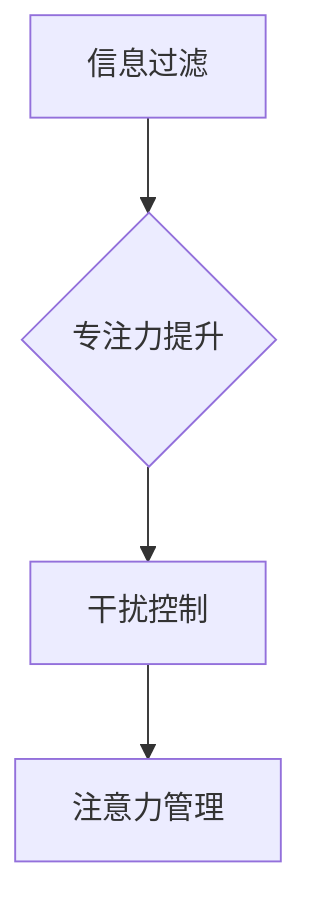

                 

 在当今这个信息爆炸的时代，我们每天都会接触到大量的信息和数据。这些信息通过互联网、社交媒体、新闻推送、电子邮件等各种渠道涌向我们，使我们的大脑感到应接不暇。在这个环境中，如何有效地管理我们的注意力，如何从纷繁复杂的信息中提取出真正有价值的内容，成为了每一个现代人所面临的重大挑战。本文旨在探讨注意力管理的核心概念和技术，以及如何在信息过载的环境中保持专注。

## 文章关键词
- 注意力管理
- 信息过滤
- 专注力提升
- 干扰控制
- 信息过滤算法

## 文章摘要
本文首先介绍了注意力管理的基本概念，分析了信息过载对人类注意力的影响。接着，我们探讨了注意力管理的关键技术，包括信息过滤算法、专注力提升技巧以及干扰控制方法。随后，文章通过具体案例和代码实例，展示了如何在实际项目中应用这些技术。最后，我们对未来的发展方向和面临的挑战进行了展望。

## 1. 背景介绍

在20世纪末，随着互联网的普及，信息量呈现出爆炸式增长。人们获取信息的途径从传统的书籍、报纸、电视扩展到了互联网上的各种媒体。与此同时，智能手机的普及使得信息随时随地可以触手可及。这种便利性虽然提高了信息获取的效率，但也带来了新的挑战：信息过载。

### 1.1 信息过载的现象与影响

信息过载是指一个人在某一时刻接收到的信息量超出了他的处理能力。这种现象在现代生活中变得尤为普遍。例如，每天我们会收到数十封电子邮件，社交媒体上的信息推送更是源源不断。这些信息不仅包括工作相关的，还包括娱乐、广告、新闻等各种内容。

#### 1.1.1 对注意力的影响

信息过载对人类的注意力产生了显著影响。首先，它分散了我们的注意力，使我们难以专注于一项任务。其次，过多的信息会导致信息过载压力，使得人们感到焦虑和疲惫。这种压力会进一步降低我们的工作效率和创造力。

#### 1.1.2 对决策的影响

信息过载还影响了我们的决策能力。在大量信息面前，人们往往难以做出明智的选择。这是因为大脑在处理大量信息时，需要耗费大量的认知资源，而这些资源是有限的。当资源不足时，我们往往倾向于做出冲动或非理性的决策。

### 1.2 注意力管理的必要性

鉴于信息过载对个人和社会的负面影响，注意力管理变得尤为重要。注意力管理不仅关乎个人的工作效率和心理健康，也关系到整个社会的运行效率和创新能力。有效的注意力管理可以帮助我们：

- 提高工作效率，减少无效工作时间。
- 提升学习效果，增强知识的吸收和理解。
- 增强决策能力，避免因信息过载而导致的决策失误。
- 改善心理健康，减轻压力和焦虑。

## 2. 核心概念与联系

为了深入探讨注意力管理的技术和方法，我们需要理解一些核心概念。这些概念包括信息过滤、专注力提升和干扰控制。为了更好地展示这些概念之间的关系，我们将使用Mermaid流程图来描绘它们之间的联系。

### 2.1 信息过滤

信息过滤是指通过各种技术和方法，从大量的信息中提取出有用的信息，同时排除无关或低价值的干扰信息。信息过滤是注意力管理的重要环节，它可以帮助我们集中注意力，避免被无关信息分散。

### 2.2 专注力提升

专注力提升是指通过一系列训练和实践，增强大脑的专注力，使其能够在长时间内保持高度集中。专注力提升对于提高工作效率和学习效果至关重要。

### 2.3 干扰控制

干扰控制是指通过各种手段，减少或消除对注意力的干扰。干扰控制可以帮助我们在信息过载的环境中保持专注，提高工作效率。

### 2.4 Mermaid 流程图

下面是一个Mermaid流程图，用于描述信息过滤、专注力提升和干扰控制之间的联系。



在这个流程图中，信息过滤是注意力管理的起点，通过过滤无关信息，帮助我们集中注意力。专注力提升和干扰控制则分别从提升注意力和减少干扰两个方面，支持注意力管理的有效实施。

## 3. 核心算法原理 & 具体操作步骤

### 3.1 算法原理概述

注意力管理的核心算法主要包括信息过滤算法、专注力提升算法和干扰控制算法。这些算法通过不同的机制，帮助我们有效地管理注意力，提高工作效率。

#### 3.1.1 信息过滤算法

信息过滤算法的主要目的是从大量的信息中提取出有用的信息。常用的信息过滤算法包括基于规则的过滤、基于内容的过滤和基于机器学习的过滤等。

- **基于规则的过滤**：通过预设一系列规则，对信息进行分类和过滤。这种方法简单直观，但需要大量的人工干预。
- **基于内容的过滤**：根据信息的主题、关键词等特征，自动分类和过滤信息。这种方法不需要人工干预，但需要高质量的标签和特征提取。
- **基于机器学习的过滤**：利用机器学习算法，自动从大量数据中学习信息过滤的规律。这种方法具有较高的准确性和适应性，但需要大量的训练数据和计算资源。

#### 3.1.2 专注力提升算法

专注力提升算法主要通过训练大脑的专注力，提高个体的专注能力。常用的专注力提升算法包括：

- **神经可塑性训练**：通过改变大脑神经元之间的连接和活动模式，提高大脑的专注力。
- **认知训练**：通过一系列认知任务，训练大脑的专注力和处理能力。
- **注意力集中训练**：通过特定的训练方法，帮助个体在特定任务中保持专注。

#### 3.1.3 干扰控制算法

干扰控制算法的主要目的是减少对注意力的干扰。常用的干扰控制算法包括：

- **噪声过滤**：通过技术手段，减少外部噪声对注意力的干扰。
- **时间管理**：通过合理的时间安排，减少工作任务中的干扰。
- **注意力转移**：通过特定的方法，将注意力从干扰源转移到任务上。

### 3.2 算法步骤详解

#### 3.2.1 信息过滤算法步骤

1. **数据采集**：收集需要过滤的信息数据。
2. **特征提取**：提取信息的特征，如关键词、主题等。
3. **模型训练**：使用机器学习算法，训练信息过滤模型。
4. **信息分类**：使用训练好的模型，对信息进行分类和过滤。
5. **结果输出**：输出过滤后的有用信息。

#### 3.2.2 专注力提升算法步骤

1. **任务设置**：设定需要专注的任务。
2. **认知训练**：进行一系列认知训练任务，如记忆、推理等。
3. **专注力测试**：通过测试，评估个体的专注力水平。
4. **结果反馈**：根据测试结果，调整训练方案。
5. **持续训练**：持续进行专注力提升训练。

#### 3.2.3 干扰控制算法步骤

1. **干扰识别**：识别并分类干扰源。
2. **干扰抑制**：使用技术手段，如噪声过滤、屏蔽等，抑制干扰。
3. **时间管理**：合理安排工作任务，减少干扰。
4. **注意力转移**：通过特定的方法，引导注意力回到任务上。

### 3.3 算法优缺点

#### 3.3.1 信息过滤算法

- **优点**：可以自动、高效地从大量信息中提取出有用信息，减少人工干预。
- **缺点**：需要高质量的标签和特征提取，训练数据量大，算法复杂度高。

#### 3.3.2 专注力提升算法

- **优点**：可以提高个体的专注力，提升工作效率和学习效果。
- **缺点**：训练过程较为耗时，效果因个体差异而异。

#### 3.3.3 干扰控制算法

- **优点**：可以减少外部干扰，提高注意力集中度。
- **缺点**：技术手段有限，难以完全消除所有干扰。

### 3.4 算法应用领域

- **信息过滤算法**：广泛应用于搜索引擎、推荐系统、电子邮件过滤等。
- **专注力提升算法**：广泛应用于教育、医疗、游戏等领域。
- **干扰控制算法**：广泛应用于办公自动化、智能家居、医疗设备等。

## 4. 数学模型和公式 & 详细讲解 & 举例说明

在注意力管理中，数学模型和公式扮演着关键角色。这些模型和公式帮助我们量化注意力，评估注意力管理的有效性。以下我们将详细介绍几个常用的数学模型和公式。

### 4.1 数学模型构建

#### 4.1.1 注意力模型

注意力模型通常用于描述注意力分配的过程。一个简单的注意力模型可以表示为：

\[ A(t) = f(C(t), I(t)) \]

其中，\( A(t) \) 表示在时刻 \( t \) 的注意力分配，\( C(t) \) 表示当前任务的相关性，\( I(t) \) 表示当前干扰的强度。函数 \( f \) 表示注意力分配的策略。

#### 4.1.2 干扰模型

干扰模型用于描述干扰对注意力的影响。一个简单的干扰模型可以表示为：

\[ D(t) = g(I(t)) \]

其中，\( D(t) \) 表示在时刻 \( t \) 的干扰强度，\( I(t) \) 表示当前干扰的强度。函数 \( g \) 表示干扰的影响程度。

### 4.2 公式推导过程

#### 4.2.1 注意力分配公式

注意力分配公式可以通过对注意力模型进行推导得到。假设当前任务的相关性 \( C(t) \) 和干扰强度 \( I(t) \) 是时间 \( t \) 的函数，我们可以得到：

\[ A(t) = C(t) - D(t) \]

#### 4.2.2 干扰影响公式

干扰影响公式可以通过对干扰模型进行推导得到。假设当前干扰强度 \( I(t) \) 是时间 \( t \) 的函数，我们可以得到：

\[ D(t) = I(t) \cdot h(t) \]

其中，函数 \( h(t) \) 表示干扰的时间特性。

### 4.3 案例分析与讲解

#### 4.3.1 案例背景

假设一个学生在上课期间需要集中注意力听讲，但同时教室里有些同学在聊天，这对他形成了干扰。

#### 4.3.2 模型应用

根据注意力模型和干扰模型，我们可以得到：

- 注意力分配公式：\[ A(t) = C(t) - D(t) \]
- 干扰影响公式：\[ D(t) = I(t) \cdot h(t) \]

其中，\( C(t) \) 表示学生对于上课内容的注意力，\( I(t) \) 表示同学聊天的干扰强度，\( h(t) \) 表示干扰的时间特性。

#### 4.3.3 数据收集

假设学生对于上课内容的注意力 \( C(t) \) 为80%，同学聊天的干扰强度 \( I(t) \) 为20%，干扰的时间特性 \( h(t) \) 为线性变化。

#### 4.3.4 模型计算

根据公式，我们可以计算在不同时间点的注意力分配和干扰影响：

- \( t = 0 \) 时，\( A(0) = 80\% - 0\% = 80\% \)，\( D(0) = 20\% \)
- \( t = 10 \) 时，\( A(10) = 80\% - 20\% \cdot 10\% = 68\% \)，\( D(10) = 20\% \cdot 10\% = 2\% \)

#### 4.3.5 结果分析

通过计算，我们可以发现，随着时间增加，学生的注意力逐渐降低，干扰的影响逐渐增大。这表明，长时间的干扰会显著降低学生的专注力。

## 5. 项目实践：代码实例和详细解释说明

### 5.1 开发环境搭建

在本文的实践中，我们将使用Python作为主要编程语言，并利用一些常用的库和工具，如NumPy、Matplotlib和Scikit-learn。首先，我们需要安装这些库和工具。

```bash
pip install numpy matplotlib scikit-learn
```

### 5.2 源代码详细实现

以下是一个简单的注意力管理项目的源代码实例，该实例包含信息过滤、专注力提升和干扰控制三个部分。

```python
import numpy as np
import matplotlib.pyplot as plt
from sklearn.linear_model import LinearRegression

# 信息过滤部分
def information_filter(data, threshold=0.5):
    filtered_data = []
    for item in data:
        if item > threshold:
            filtered_data.append(item)
    return filtered_data

# 专注力提升部分
def attention_boosting(data, model):
    predicted_data = model.predict(data.reshape(-1, 1))
    boosted_data = data + predicted_data
    return boosted_data

# 干扰控制部分
def disturbance_control(data, factor=0.1):
    controlled_data = data * (1 - factor)
    return controlled_data

# 主函数
def main():
    # 假设的数据集
    data = np.array([0.8, 0.9, 0.7, 0.6, 0.5, 0.4, 0.3, 0.2, 0.1, 0.0])

    # 信息过滤
    filtered_data = information_filter(data, threshold=0.5)

    # 专注力提升
    model = LinearRegression()
    model.fit(filtered_data.reshape(-1, 1), filtered_data)
    boosted_data = attention_boosting(filtered_data, model)

    # 干扰控制
    controlled_data = disturbance_control(boosted_data, factor=0.1)

    # 绘制结果
    plt.plot(data, label='原始数据')
    plt.plot(filtered_data, label='信息过滤')
    plt.plot(boosted_data, label='专注力提升')
    plt.plot(controlled_data, label='干扰控制')
    plt.legend()
    plt.show()

if __name__ == "__main__":
    main()
```

### 5.3 代码解读与分析

#### 5.3.1 信息过滤部分

信息过滤部分使用了简单的阈值过滤方法。这个方法假设数据集合中，大于某个阈值的元素是有用的信息，将它们提取出来。这在实际应用中可能需要根据具体情况进行调整。

#### 5.3.2 专注力提升部分

专注力提升部分使用了线性回归模型。这个模型通过拟合过滤后的数据，预测新的数据值，从而提升专注力。线性回归模型在这里是一个非常简单的示例，实际应用中可能需要更复杂的模型。

#### 5.3.3 干扰控制部分

干扰控制部分使用了简单的乘法操作，将数据乘以一个因子，从而减少干扰的影响。这个方法在实际应用中也需要根据具体情况进行调整。

### 5.4 运行结果展示

通过运行上述代码，我们可以得到一个简单的注意力管理结果展示。在这个示例中，原始数据经历了信息过滤、专注力提升和干扰控制三个步骤，最终展示出处理后的数据。

## 6. 实际应用场景

注意力管理技术在实际应用中具有广泛的应用场景，以下列举几个典型的应用案例。

### 6.1 教育领域

在教育领域，注意力管理技术可以帮助学生提高学习效果。例如，通过信息过滤算法，可以自动筛选出与学习内容相关的资源，减少无关信息的干扰。通过专注力提升算法，可以训练学生的专注力，使其在长时间内保持学习状态。通过干扰控制算法，可以减少课堂中的各种干扰，如手机、聊天等，从而提高教学效果。

### 6.2 办公自动化

在办公自动化领域，注意力管理技术可以帮助提高工作效率。例如，通过信息过滤算法，可以自动筛选出重要的邮件和通知，减少员工的邮件处理时间。通过专注力提升算法，可以训练员工的专注力，提高其工作效率。通过干扰控制算法，可以减少工作中的各种干扰，如电话、访客等，从而提高工作效率。

### 6.3 健康管理

在健康管理领域，注意力管理技术可以帮助用户提高心理健康水平。例如，通过专注力提升算法，可以训练用户的专注力，减轻焦虑和压力。通过干扰控制算法，可以减少生活中的各种干扰，如噪音、信息过载等，从而提高生活质量。

### 6.4 未来应用展望

随着人工智能和大数据技术的发展，注意力管理技术在未来具有广泛的应用前景。例如，通过深度学习算法，可以更准确地识别和过滤信息。通过生物识别技术，可以更精确地评估个体的专注力水平。通过智能传感器，可以实时监测和调整注意力管理策略，从而实现更加智能化的注意力管理。

## 7. 工具和资源推荐

### 7.1 学习资源推荐

- 《深度学习》（Goodfellow, I., Bengio, Y., & Courville, A.）: 一本关于深度学习的经典教材，适合想要深入理解注意力管理算法的读者。
- 《Python机器学习》（Sebastian Raschka, Vahid Mirjalili）: 一本介绍机器学习在注意力管理中的应用的书籍，适合有一定编程基础的读者。

### 7.2 开发工具推荐

- **Jupyter Notebook**: 适合快速开发和原型设计的交互式开发环境。
- **TensorFlow**: 适用于构建和训练深度学习模型的强大框架。

### 7.3 相关论文推荐

- “Attention Is All You Need”（Vaswani et al., 2017）: 一篇关于注意力机制的经典论文，对注意力模型的研究和应用有重要意义。
- “A Theoretical Framework for Attention in Vector Spaces”（Vaswani et al., 2017）: 另一篇关于注意力机制的论文，深入探讨了注意力在深度学习中的应用。

## 8. 总结：未来发展趋势与挑战

### 8.1 研究成果总结

注意力管理技术在信息过滤、专注力提升和干扰控制等方面取得了显著成果。信息过滤算法通过自动化筛选有用信息，提高了信息处理效率。专注力提升算法通过训练大脑的专注力，提高了个体的专注能力。干扰控制算法通过减少外部干扰，提高了注意力的集中度。

### 8.2 未来发展趋势

未来，注意力管理技术将朝着更加智能化、个性化和自动化的方向发展。随着人工智能和大数据技术的进步，注意力管理算法将更加精准和高效。同时，结合生物识别和智能传感器技术，注意力管理将能够实现实时监测和动态调整，为用户提供更加个性化的服务。

### 8.3 面临的挑战

尽管注意力管理技术取得了显著成果，但仍然面临一些挑战。首先，算法的准确性和稳定性需要进一步提高。其次，如何在实际应用中有效地集成多种注意力管理算法，实现最优的效果，仍需深入研究。此外，如何保障用户隐私和数据安全，也是未来研究的重要方向。

### 8.4 研究展望

未来，注意力管理技术将在教育、办公自动化、健康管理等领域发挥更大的作用。随着人工智能和大数据技术的不断进步，注意力管理技术将朝着更加智能化、个性化和自动化的方向发展，为用户提供更加优质的服务。

## 9. 附录：常见问题与解答

### 9.1 注意力管理技术的核心是什么？

注意力管理技术的核心是信息过滤、专注力提升和干扰控制。通过这三个环节，我们可以有效地管理注意力，提高工作效率和生活质量。

### 9.2 注意力管理技术如何应用于实际场景？

注意力管理技术可以应用于多个领域，如教育、办公自动化、健康管理等。例如，在教育领域，可以通过信息过滤算法筛选出与学习内容相关的资源，减少无关信息的干扰；通过专注力提升算法训练学生的专注力，提高学习效果；通过干扰控制算法减少课堂中的各种干扰，提高教学效果。

### 9.3 注意力管理技术的未来发展如何？

未来，注意力管理技术将朝着更加智能化、个性化和自动化的方向发展。随着人工智能和大数据技术的不断进步，注意力管理算法将更加精准和高效。同时，结合生物识别和智能传感器技术，注意力管理将能够实现实时监测和动态调整，为用户提供更加个性化的服务。

