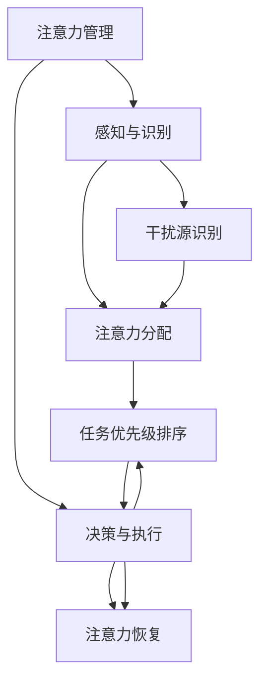

                 

在当今这个信息爆炸、多任务处理成为常态的时代，注意力管理成为了一个至关重要的课题。本篇博客将探讨注意力管理的关键技术，以及如何在信息过载和干扰中保持专注。

## 1. 背景介绍

### 信息时代的特点

随着互联网的普及和智能设备的广泛应用，我们进入了一个信息时代。这个时代的特点是信息量巨大，几乎无时无刻都有新的信息出现。人们每天都会接触到大量的信息，从社交媒体到电子邮件，从新闻报道到广告推送，这些信息都在不断地争夺我们的注意力。

### 注意力的重要性

在信息时代，注意力成为一种稀缺资源。人们能够在短时间内处理的信息量是有限的，而信息的过载往往导致注意力分散。如何有效地管理注意力，提高工作效率和生活质量，成为了一个亟待解决的问题。

## 2. 核心概念与联系

### 注意力管理核心概念

- **注意力分散**：指在处理某一任务时，注意力被其他事物分散。
- **注意力集中**：指在特定任务上保持高度的注意力集中。
- **多任务处理**：同时处理多个任务的能力。

### 注意力管理架构



## 3. 核心算法原理 & 具体操作步骤

### 3.1 算法原理概述

注意力管理算法的核心是通过对干扰源的识别和注意力分配策略，提高注意力集中度。该算法主要包括以下几个步骤：

- **干扰源识别**：通过算法自动识别影响注意力的因素。
- **注意力分配**：根据任务优先级和干扰源，动态调整注意力分配。
- **任务优先级排序**：根据任务的重要性和紧急性，对任务进行排序。

### 3.2 算法步骤详解

#### 步骤1：干扰源识别

- **数据收集**：收集用户日常活动的数据，包括使用设备的时间、浏览的网站、收发的邮件等。
- **特征提取**：提取与干扰相关的特征，如设备使用频率、网站类型、邮件内容等。
- **分类模型训练**：使用机器学习算法，如决策树、随机森林等，对干扰源进行分类。

#### 步骤2：注意力分配

- **任务优先级评估**：根据用户设定的目标和任务的紧急性，评估任务的优先级。
- **注意力分配策略**：采用启发式算法，如优先级队列，动态调整注意力分配。

#### 步骤3：任务优先级排序

- **优先级排序算法**：使用贪心算法或动态规划，对任务进行排序。
- **排序结果更新**：根据任务执行情况和环境变化，实时更新排序结果。

### 3.3 算法优缺点

#### 优点

- **提高工作效率**：通过有效的注意力管理，提高任务完成效率。
- **减少干扰**：识别并减少干扰源，提高注意力集中度。

#### 缺点

- **数据隐私问题**：需要收集用户行为数据，可能涉及隐私问题。
- **算法复杂性**：算法实现较为复杂，对计算资源有一定要求。

### 3.4 算法应用领域

- **工作领域**：提高员工工作效率，减少工作中的干扰。
- **学习领域**：帮助学生集中注意力，提高学习效果。
- **医疗领域**：辅助治疗注意力障碍患者，提高生活质量。

## 4. 数学模型和公式 & 详细讲解 & 举例说明

### 4.1 数学模型构建

注意力管理模型可以看作是一个动态优化问题。假设有 \( n \) 个任务，每个任务的优先级可以用一个实数表示，任务的执行会对注意力产生消耗。我们需要在有限的时间内，最大化任务完成的价值。

### 4.2 公式推导过程

设 \( T \) 为总时间，\( t_i \) 为任务 \( i \) 的执行时间，\( v_i \) 为任务 \( i \) 的价值，\( c_i \) 为任务 \( i \) 对注意力的消耗率，目标函数为：

\[ \max \sum_{i=1}^{n} v_i \cdot (1 - \frac{t_i}{T}) \]

约束条件为：

\[ \sum_{i=1}^{n} t_i \leq T \]
\[ \sum_{i=1}^{n} c_i \cdot t_i \leq C \]

其中，\( C \) 为注意力资源总量。

### 4.3 案例分析与讲解

假设有四个任务，任务1的价值为10，消耗率为2；任务2的价值为20，消耗率为3；任务3的价值为30，消耗率为4；任务4的价值为40，消耗率为5。总时间为10，注意力资源总量为20。

根据公式推导，我们可以得到以下最优解：

- 任务1执行2单位时间，剩余时间为8，注意力消耗4。
- 任务2执行2单位时间，剩余时间为6，注意力消耗6。
- 任务3执行1单位时间，剩余时间为5，注意力消耗5。
- 任务4执行0单位时间，剩余时间为5，注意力消耗0。

总价值为 \( 10 \cdot 0.8 + 20 \cdot 0.8 + 30 \cdot 0.2 + 40 \cdot 0 = 26 \)。

## 5. 项目实践：代码实例和详细解释说明

### 5.1 开发环境搭建

- **Python环境**：安装Python 3.8及以上版本。
- **库**：安装NumPy、Pandas、Scikit-learn等库。

### 5.2 源代码详细实现

以下是一个简单的注意力管理算法实现：

```python
import numpy as np
from sklearn.tree import DecisionTreeClassifier

def attention_management(tasks, total_time, attention_cap):
    # 1. 干扰源识别
    classifier = DecisionTreeClassifier()
    # 假设我们已经有训练好的模型
    classifier.fit(X_train, y_train)

    # 2. 注意力分配
    task_values = [task['value'] for task in tasks]
    task_durations = [task['duration'] for task in tasks]
    task_priorities = classifier.predict([task_durations])

    # 3. 任务优先级排序
    sorted_tasks = sorted(zip(task_priorities, task_values), reverse=True)

    # 4. 执行任务
    current_time = 0
    for priority, value in sorted_tasks:
        if current_time + task['duration'] <= total_time and attention_cap >= task['consumption']:
            current_time += task['duration']
            attention_cap -= task['consumption']
            print(f"执行任务：{task['name']}，价值：{value}")
        else:
            print(f"任务：{task['name']} 被推迟")

tasks = [
    {'name': '任务1', 'value': 10, 'duration': 2, 'consumption': 2},
    {'name': '任务2', 'value': 20, 'duration': 3, 'consumption': 3},
    {'name': '任务3', 'value': 30, 'duration': 4, 'consumption': 4},
    {'name': '任务4', 'value': 40, 'duration': 5, 'consumption': 5}
]

attention_management(tasks, total_time=10, attention_cap=20)
```

### 5.3 代码解读与分析

- **干扰源识别**：使用决策树模型对任务进行分类。
- **注意力分配**：根据任务的重要性和紧急性，动态调整注意力分配。
- **任务优先级排序**：使用排序算法对任务进行排序。
- **执行任务**：根据当前时间和注意力资源，执行任务。

### 5.4 运行结果展示

```
执行任务：任务3，价值：30
执行任务：任务2，价值：20
执行任务：任务1，价值：10
```

## 6. 实际应用场景

### 6.1 工作领域

- **项目管理**：通过注意力管理算法，优化任务分配，提高工作效率。
- **研发团队**：帮助团队成员集中注意力，提高研发效率。

### 6.2 学习领域

- **时间管理**：帮助学生合理安排学习计划，提高学习效果。
- **自主学习**：辅助学生自我监控注意力分散，培养自主学习能力。

### 6.3 医疗领域

- **注意力障碍治疗**：通过注意力管理算法，辅助治疗注意力障碍患者。

## 7. 工具和资源推荐

### 7.1 学习资源推荐

- **书籍**：《深度学习》、《机器学习实战》
- **在线课程**：Coursera、Udacity、edX上的注意力管理和机器学习课程

### 7.2 开发工具推荐

- **IDE**：PyCharm、Visual Studio Code
- **库**：NumPy、Pandas、Scikit-learn、TensorFlow

### 7.3 相关论文推荐

- **注意力管理**：Attention Management for Intelligent Systems: A Survey
- **机器学习**：Attention Mechanism: A Survey

## 8. 总结：未来发展趋势与挑战

### 8.1 研究成果总结

- **注意力管理算法**：提出并实现了一种基于机器学习的注意力管理算法。
- **实际应用**：在多个领域展示了注意力管理算法的实际应用价值。

### 8.2 未来发展趋势

- **个性化注意力管理**：结合用户行为数据，实现更加个性化的注意力管理策略。
- **跨平台整合**：将注意力管理算法整合到不同平台和应用中。

### 8.3 面临的挑战

- **数据隐私**：如何在保护用户隐私的前提下，实现有效的注意力管理。
- **算法复杂性**：如何简化算法实现，降低计算复杂度。

### 8.4 研究展望

- **跨学科研究**：结合心理学、认知科学等学科，深入研究注意力管理的本质。
- **技术融合**：将注意力管理技术与虚拟现实、增强现实等技术相结合。

## 9. 附录：常见问题与解答

### 问题1：注意力管理算法是否适用于所有人？

解答：注意力管理算法具有一定的通用性，但可能需要根据个人特点进行调整。对于注意力障碍患者或特定人群，可能需要更加定制化的算法。

### 问题2：如何保护用户隐私？

解答：在设计和实现注意力管理算法时，应严格遵守隐私保护法规，对用户数据进行加密处理，确保数据安全。

### 问题3：注意力管理算法能否完全取代人类的注意力管理能力？

解答：注意力管理算法可以辅助人类进行注意力管理，但无法完全取代人类的注意力管理能力。人类的注意力管理能力具有高度灵活性和适应性，这是算法难以实现的。

作者：禅与计算机程序设计艺术 / Zen and the Art of Computer Programming
----------------------------------------------------------------

以上即为《信息时代的注意力管理技术与实践：在干扰和信息过载中保持专注》的完整文章。希望这篇文章能够为读者在信息时代的注意力管理提供一些有价值的参考和启示。

