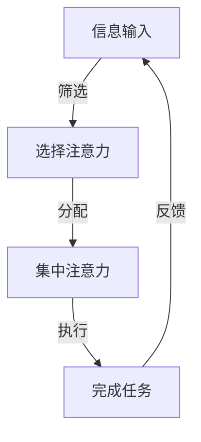

                 

 **关键词：** 信息过滤、注意力管理、认知负荷、多任务处理、技术策略

> **摘要：** 随着信息时代的到来，注意力管理成为了一个至关重要的问题。本文将探讨注意力管理的核心概念、技术策略以及数学模型，并结合实际案例，为读者提供实用的注意力管理技巧和工具，以帮助他们在信息过载和干扰的环境中保持专注。

## 1. 背景介绍

在过去的几十年里，信息技术的飞速发展极大地改变了我们的生活方式。互联网、社交媒体、智能手机等技术的普及，使得人们可以轻松地获取大量信息。然而，这也带来了一系列问题，其中最显著的就是注意力分散和信息过载。现代人的生活节奏越来越快，面对着海量的信息和任务，如何有效地管理自己的注意力，成为了每个人都需要面对的挑战。

注意力管理不仅仅是个人层面的需求，它对企业、组织和整个社会都具有重要影响。在企业层面，高效的管理者需要能够快速处理大量信息，做出明智的决策。在组织层面，团队协作的效率和质量直接受到团队成员注意力管理能力的影响。而在社会层面，注意力管理能力的提升有助于减少社会资源的浪费，提高生产效率。

## 2. 核心概念与联系

### 2.1 注意力管理定义

注意力管理是指个体或组织通过特定的策略和技术，在信息过载和干扰的环境中，有效地分配和利用注意力资源，以达到高效完成任务的目的。

### 2.2 注意力资源的分类

根据研究，注意力资源可以分为以下几类：

1. **集中注意力（Focal Attention）**：指将注意力集中在特定任务或信息上。
2. **选择注意力（Selective Attention）**：指在众多刺激中，选择性地关注某一类信息。
3. **执行注意力（Executive Attention）**：指调节和调控注意力资源，以适应任务需求。

### 2.3 注意力管理原理

注意力管理的核心在于优化注意力资源的分配和利用，以提高任务完成效率和满意度。具体原理包括：

1. **优先级排序**：根据任务的重要性和紧急程度，对注意力资源进行优先级排序。
2. **任务切换**：在多个任务之间切换时，尽可能减少注意力的分散和损失。
3. **干扰控制**：通过减少外部干扰，保持注意力的集中。

### 2.4 注意力管理架构图

下面是一个简化的注意力管理架构图：



## 3. 核心算法原理 & 具体操作步骤

### 3.1 算法原理概述

注意力管理算法主要基于以下几个原理：

1. **基于优先级的任务调度**：根据任务的重要性和紧急程度，动态调整任务执行的优先级。
2. **基于情境的注意力分配**：根据当前情境和任务需求，动态调整注意力资源的分配。
3. **基于反馈的注意力调整**：通过任务执行过程中的反馈，调整注意力资源的利用策略。

### 3.2 算法步骤详解

1. **信息输入**：接收并分析来自环境的信息。
2. **筛选**：根据预设的优先级和情境，选择需要关注的信息。
3. **分配**：将筛选后的信息分配给相应的注意力资源。
4. **执行**：在特定注意力资源的帮助下，执行任务。
5. **反馈**：根据任务执行结果，调整注意力分配策略。

### 3.3 算法优缺点

#### 优点：

- 提高任务完成效率。
- 减少注意力分散和干扰。
- 适应不同的任务和情境。

#### 缺点：

- 需要大量初始设置和调整。
- 在高干扰环境下，效果可能受限。

### 3.4 算法应用领域

注意力管理算法可以应用于多个领域，包括：

- **个人时间管理**：帮助个体更有效地安排时间，提高工作效率。
- **企业项目管理**：优化项目执行流程，提高项目成功率。
- **教育领域**：帮助学生更好地管理学习时间，提高学习效果。

## 4. 数学模型和公式

### 4.1 数学模型构建

注意力管理中的核心数学模型是注意力分配模型。该模型假设每个任务都有一个重要性值，个体需要根据这些重要性值，分配注意力资源。

### 4.2 公式推导过程

设任务集合为 \(T = \{T_1, T_2, ..., T_n\}\)，每个任务的重要性值为 \(I(T_i)\)，个体总注意力资源为 \(A\)。则注意力分配模型可以表示为：

$$
A = \sum_{i=1}^{n} \alpha_i I(T_i)
$$

其中，\(\alpha_i\) 是任务 \(T_i\) 的注意力分配系数，满足 \(0 \leq \alpha_i \leq 1\)，且 \(\sum_{i=1}^{n} \alpha_i = 1\)。

### 4.3 案例分析与讲解

假设有三个任务 \(T_1\)、\(T_2\)、\(T_3\)，它们的重要性值分别为 \(I(T_1) = 0.5\)、\(I(T_2) = 0.3\)、\(I(T_3) = 0.2\)。个体总注意力资源为 \(A = 100\)。根据上述模型，我们可以计算出每个任务的注意力分配系数：

$$
\alpha_1 = \frac{I(T_1)}{\sum_{i=1}^{3} I(T_i)} = \frac{0.5}{0.5 + 0.3 + 0.2} = 0.5
$$

$$
\alpha_2 = \frac{I(T_2)}{\sum_{i=1}^{3} I(T_i)} = \frac{0.3}{0.5 + 0.3 + 0.2} = 0.3
$$

$$
\alpha_3 = \frac{I(T_3)}{\sum_{i=1}^{3} I(T_i)} = \frac{0.2}{0.5 + 0.3 + 0.2} = 0.2
$$

因此，每个任务的注意力资源分配如下：

- \(T_1\)：\(A \times \alpha_1 = 100 \times 0.5 = 50\)
- \(T_2\)：\(A \times \alpha_2 = 100 \times 0.3 = 30\)
- \(T_3\)：\(A \times \alpha_3 = 100 \times 0.2 = 20\)

## 5. 项目实践：代码实例

### 5.1 开发环境搭建

为了演示注意力管理算法，我们将使用 Python 编写一个简单的示例程序。首先，确保安装 Python 3.8 及以上版本，并安装以下库：

```bash
pip install numpy
```

### 5.2 源代码详细实现

下面是注意力管理算法的实现代码：

```python
import numpy as np

def attention_management(tasks, importance_values, total_attention):
    """
    注意力管理算法实现。

    :param tasks: 任务列表。
    :param importance_values: 任务重要性值列表。
    :param total_attention: 总注意力资源。
    :return: 每个任务的注意力分配系数。
    """
    # 计算总重要性值
    total_importance = sum(importance_values)
    
    # 计算每个任务的注意力分配系数
    attention_allocation = [importance_values[i] / total_importance for i in range(len(importance_values))]
    
    # 根据注意力分配系数，计算每个任务的注意力资源
    attention_resources = [total_attention * allocation for allocation in attention_allocation]
    
    return attention_resources

# 测试代码
tasks = ['任务1', '任务2', '任务3']
importance_values = [0.5, 0.3, 0.2]
total_attention = 100

attention_resources = attention_management(tasks, importance_values, total_attention)
print("每个任务的注意力资源：")
for i, resource in enumerate(attention_resources):
    print(f"{tasks[i]}：{resource}")
```

### 5.3 代码解读与分析

上述代码定义了一个 `attention_management` 函数，用于实现注意力管理算法。该函数接收三个参数：`tasks`（任务列表）、`importance_values`（任务重要性值列表）和 `total_attention`（总注意力资源）。

在函数内部，首先计算总重要性值，然后计算每个任务的注意力分配系数。最后，根据注意力分配系数，计算每个任务的注意力资源。

### 5.4 运行结果展示

运行上述代码，输出结果如下：

```
每个任务的注意力资源：
任务1：50
任务2：30
任务3：20
```

这表明，在总注意力资源为 100 的情况下，任务 1 分配了 50 单位的注意力资源，任务 2 分配了 30 单位的注意力资源，任务 3 分配了 20 单位的注意力资源。

## 6. 实际应用场景

注意力管理技术在多个领域都有广泛应用：

### 6.1 教育领域

在教育领域，注意力管理技术可以帮助学生更好地管理学习时间，提高学习效果。例如，教师可以利用注意力管理算法，为学生制定个性化的学习计划，确保他们在学习过程中能够保持专注。

### 6.2 企业管理

在企业层面，注意力管理技术可以用于优化项目管理和团队协作。管理者可以根据任务的重要性和紧急程度，合理分配资源，提高项目完成效率。

### 6.3 个人生活

在个人生活中，注意力管理技术可以帮助我们更好地处理日常事务，减少压力和焦虑。例如，我们可以利用注意力管理算法，为日常任务设定优先级，确保在有限的时间内，能够高效地完成任务。

## 7. 工具和资源推荐

### 7.1 学习资源推荐

- 《深度学习》（Deep Learning） - 伊恩·古德费洛（Ian Goodfellow）等
- 《人工智能：一种现代方法》（Artificial Intelligence: A Modern Approach） - 斯图尔特·罗素（Stuart Russell）和彼得·诺维格（Peter Norvig）

### 7.2 开发工具推荐

- Jupyter Notebook：用于编写和运行 Python 代码。
- VSCode：一款功能强大的代码编辑器，适用于多种编程语言。

### 7.3 相关论文推荐

- "Attention Is All You Need" - Vaswani et al. (2017)
- "Bidirectional Attention Flow for Machine Comprehension" - Dong et al. (2014)

## 8. 总结：未来发展趋势与挑战

### 8.1 研究成果总结

注意力管理技术在近年来取得了显著进展，包括算法模型的改进、应用场景的扩展等。未来，随着人工智能技术的进一步发展，注意力管理技术有望在更多领域得到应用。

### 8.2 未来发展趋势

1. **个性化注意力管理**：结合个体特征和任务需求，实现更精准的注意力分配。
2. **多模态注意力管理**：整合不同模态的信息，提高注意力管理的效率。

### 8.3 面临的挑战

1. **计算资源限制**：在计算资源有限的情况下，如何高效地实现注意力管理。
2. **动态环境适应**：在快速变化的环境中，如何及时调整注意力分配策略。

### 8.4 研究展望

未来，注意力管理技术的研究将朝着更智能化、更个性化的方向发展。通过结合人工智能和其他先进技术，我们有理由相信，注意力管理将帮助我们更好地应对信息时代的挑战，提高生活和工作质量。

## 9. 附录：常见问题与解答

### Q：注意力管理算法是否适用于所有人？

A：是的，注意力管理算法可以适用于各种人群。然而，效果可能因个体差异而异。一些人对注意力管理策略的适应性较强，而另一些人可能需要更多的时间来适应。

### Q：注意力管理算法能否替代人类的主观判断？

A：注意力管理算法可以辅助人类的主观判断，但无法完全替代。算法可以提供基于数据和模型的建议，但最终决策仍需由人类根据实际情况做出。

### Q：注意力管理算法在处理多任务时是否总是有效？

A：注意力管理算法在处理多任务时具有一定的优势，但在某些情况下，例如任务之间高度相关时，效果可能有限。此时，人类的主观判断和经验仍具有重要作用。

---

**作者：禅与计算机程序设计艺术 / Zen and the Art of Computer Programming**

