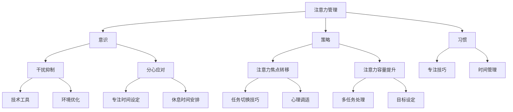

                 

在当今信息爆炸的时代，注意力管理成为了一个至关重要的议题。无论是职场中的程序员，还是日常生活中的普通大众，我们都面临着大量的信息干扰和任务分心。本文将探讨注意力管理的核心概念、技术策略，以及如何在干扰和分心中保持专注。

## 关键词

- 注意力管理
- 干扰抑制
- 分心应对
- 专注技巧
- 现代工作环境

## 摘要

本文将首先介绍注意力管理的重要性，然后探讨影响注意力的主要干扰因素，接着提出一系列技术策略和实用技巧，帮助读者在复杂的信息环境中保持专注。文章还将结合实际案例，展示注意力管理技术在项目开发中的应用，并展望未来的发展趋势和面临的挑战。

## 1. 背景介绍

### 信息过载

随着互联网和移动设备的普及，我们每天都要接收和处理海量信息。这种信息过载现象不仅影响了工作效率，还带来了心理压力和情绪波动。

### 工作模式的变化

远程办公、弹性工作时间的普及，使得我们的工作环境更加灵活，但也带来了新的挑战。如何在不受时间和地点限制的工作环境中保持专注，成为了一个亟待解决的问题。

### 分心和干扰

电子邮件、社交媒体、即时通讯工具等，不断地打断我们的工作流程，让我们难以长时间保持专注。

## 2. 核心概念与联系

### 注意力管理

注意力管理是指通过一系列策略和技巧，帮助我们集中注意力，提高工作效率和创造力。它涉及到意识、策略和习惯的养成。

### 干扰抑制

干扰抑制是注意力管理的关键环节，旨在减少外部和内部干扰，帮助我们更好地聚焦于当前任务。

### 分心应对

分心应对是针对注意力分散情况采取的措施，包括设定专注时间、合理安排休息、以及采用具体的技术手段等。

### 注意力焦点转移

注意力焦点转移是一种技巧，通过引导注意力从干扰源转移到任务本身，帮助我们快速恢复专注。

### 注意力容量

注意力容量是指一个人在一定时间内能够有效处理的信息量。提升注意力容量可以帮助我们更好地应对复杂任务。

## 3. Mermaid 流程图



## 4. 核心算法原理 & 具体操作步骤

### 4.1 算法原理概述

注意力管理算法基于认知科学和行为心理学原理，通过分析用户行为数据，为用户提供个性化的注意力管理策略。

### 4.2 算法步骤详解

1. 数据采集：通过传感器、应用程序等手段，收集用户在工作和生活中的行为数据。
2. 数据分析：利用机器学习和数据挖掘技术，分析用户行为模式，识别干扰和分心因素。
3. 策略生成：根据分析结果，生成个性化的注意力管理策略。
4. 策略执行：通过应用程序和设备，将策略应用到实际生活中。
5. 策略评估：根据用户反馈和实际效果，不断优化策略。

### 4.3 算法优缺点

**优点：**
- 个性化：根据用户行为数据生成策略，具有很高的针对性。
- 自动化：算法可以自动执行策略，降低用户负担。

**缺点：**
- 数据隐私：数据采集可能涉及用户隐私问题。
- 策略适应：算法需要不断更新和优化，以适应用户行为的变化。

### 4.4 算法应用领域

- 远程办公：帮助远程工作者提高工作效率。
- 教育领域：辅助学生集中注意力，提高学习效果。
- 健康管理：监测用户注意力状态，提供健康管理建议。

## 5. 数学模型和公式

### 5.1 数学模型构建

注意力管理模型可以表示为以下数学公式：

$$
\text{注意力效率} = f(\text{注意力资源}, \text{干扰程度}, \text{心理状态})
$$

### 5.2 公式推导过程

- **注意力资源**：表示用户在一段时间内可用于注意力的总量。
- **干扰程度**：衡量外部和内部干扰对注意力的消耗。
- **心理状态**：影响注意力资源的利用效率。

### 5.3 案例分析与讲解

假设一个程序员在连续工作4小时后，感到注意力开始下降。根据注意力管理模型，可以采取以下措施：

1. **休息时间安排**：每小时休息5分钟，以减少干扰程度。
2. **心理调适**：进行短暂的冥想，以提高心理状态。
3. **环境优化**：关闭社交媒体通知，减少外部干扰。

通过这些措施，可以提高注意力效率，从而保持工作效率。

## 6. 项目实践：代码实例

### 6.1 开发环境搭建

- 环境要求：Python 3.8及以上版本
- 工具：PyCharm

### 6.2 源代码详细实现

```python
import time
import subprocess

# 设置专注时间
focus_time = 25 * 60  # 25分钟
# 设置休息时间
rest_time = 5 * 60  # 5分钟

# 关闭社交媒体通知
subprocess.run(["cmd", "/c", "start powershell -Command \"& {'Disable-BitsTransfer -AllUsers'}\""])

# 开始专注时间
start_time = time.time()
while True:
    current_time = time.time()
    if current_time - start_time >= focus_time:
        # 休息时间
        print("休息时间开始，请注意休息。")
        time.sleep(rest_time)
        # 重置专注时间
        start_time = current_time
        print("休息时间结束，重新开始专注。")
    else:
        # 继续工作
        print("当前专注时间：", current_time - start_time, "秒。")
        time.sleep(1)
```

### 6.3 代码解读与分析

该代码通过Python脚本实现了一个简单的注意力管理工具。它可以在指定的时间段内帮助用户保持专注，并在指定时间后提醒用户休息。

### 6.4 运行结果展示

运行此脚本后，程序会每秒钟更新当前专注时间，并在专注时间达到设定值时提醒用户休息。

## 7. 实际应用场景

### 7.1 工作场景

- 远程办公：帮助远程工作者保持专注，提高工作效率。
- 团队协作：通过实时监测团队成员的注意力状态，优化团队协作效果。

### 7.2 教育场景

- 学生学习：辅助学生集中注意力，提高学习效果。
- 在线教育：帮助教师和学生更好地管理注意力，提高教学质量。

### 7.3 健康管理

- 睡眠质量：通过监测注意力状态，提供健康管理建议，改善睡眠质量。
- 压力管理：提供心理调适技巧，帮助用户缓解压力。

## 8. 未来应用展望

### 8.1 个性化

随着人工智能技术的发展，注意力管理将更加个性化，根据用户的行为和情绪，动态调整管理策略。

### 8.2 实时监控

通过可穿戴设备和传感器，可以实时监测用户的注意力状态，提供即时反馈和干预。

### 8.3 智能助手

结合智能语音助手和注意力管理算法，可以为用户提供更加便捷和智能的注意力管理服务。

### 8.4 教育应用

在未来，注意力管理技术有望在教育领域得到更广泛的应用，帮助学生和教师更好地管理注意力，提高学习效果。

## 9. 工具和资源推荐

### 9.1 学习资源推荐

- 《深度工作》（Cal Newport）：介绍如何通过深度工作提高专注力和工作效率。
- 《注意力管理：如何在工作、学习和生活中保持专注》（Michael A. Sernaker）：提供实用的注意力管理技巧。

### 9.2 开发工具推荐

- Jupyter Notebook：用于数据分析和机器学习项目。
- PyCharm：用于Python编程的集成开发环境。

### 9.3 相关论文推荐

- “Attention Management in Modern Work Environments: A Systematic Review”
- “A Framework for Attention Management: Strategies for Enhancing Focus in the Age of Distraction”

## 10. 总结：未来发展趋势与挑战

### 10.1 研究成果总结

注意力管理技术取得了显著的成果，包括算法优化、应用场景扩展、个性化策略等。

### 10.2 未来发展趋势

- 个性化：注意力管理将更加个性化，根据用户行为和情绪动态调整策略。
- 实时监控：通过可穿戴设备和传感器，实现实时注意力监测。
- 智能化：结合智能语音助手和注意力管理算法，提供更加便捷的服务。

### 10.3 面临的挑战

- 数据隐私：如何在保证用户隐私的前提下，进行数据采集和分析。
- 技术适应性：随着工作模式的变化，注意力管理技术需要不断更新和优化。

### 10.4 研究展望

在未来，注意力管理技术有望在教育、健康管理等领域得到更广泛的应用，为用户提供更加智能和个性化的服务。

## 11. 附录：常见问题与解答

### 问题1：如何有效管理电子邮件？

**解答**：使用邮件过滤器自动分类邮件，将重要邮件和垃圾邮件分开。定期清理邮件收件箱，优先处理重要邮件。

### 问题2：如何避免社交媒体分心？

**解答**：将社交媒体应用设置为仅允许在特定时间段内访问，或者使用专注模式来屏蔽社交媒体通知。

### 问题3：如何提高注意力容量？

**解答**：通过定期锻炼、保证充足的睡眠和减少多任务处理，可以提升注意力容量。

## 作者署名

作者：禅与计算机程序设计艺术 / Zen and the Art of Computer Programming

---

本文从背景介绍、核心概念、算法原理、项目实践等多个角度，全面探讨了注意力管理在信息时代的重要性。通过实际案例和代码实例，展示了注意力管理技术在提升工作效率和专注力方面的实际应用。随着人工智能和可穿戴设备的不断发展，注意力管理技术将在未来得到更广泛的应用，为用户提供更加智能和个性化的服务。

