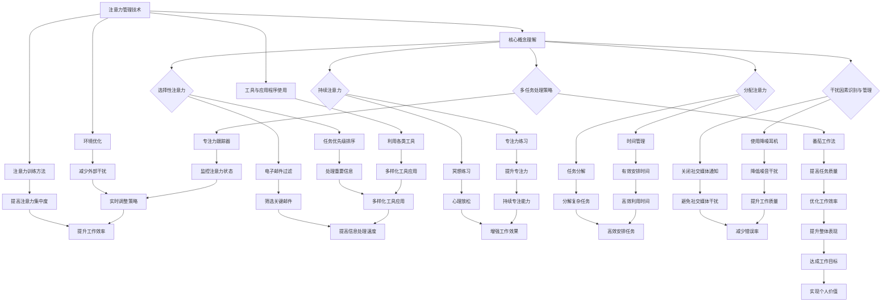

                 

关键词：注意力管理、信息过载、专注力、多任务处理、认知心理学

摘要：随着信息技术的飞速发展，我们面临着前所未有的信息过载问题。在这样一个充满干扰的环境中，保持注意力变得愈发重要。本文将探讨注意力管理技术，帮助我们在嘈杂的信息环境中保持专注，提高工作效率和生活质量。

## 1. 背景介绍

在现代社会，人们每天都会接收到大量的信息，这些信息来自各种渠道，如电子邮件、社交媒体、即时通讯工具等。这种信息过载现象导致了人们的注意力分散，进而影响了工作效率和生活质量。研究表明，在多任务处理的情境下，人们的认知资源会分散，导致任务完成质量下降。因此，如何有效地管理注意力，提高专注力，成为一个亟待解决的问题。

### 1.1 现状分析

根据一项全球性的调查，现代职场人士每天平均需要处理多达200封电子邮件，同时在工作中频繁切换任务。这种多任务处理模式不仅增加了工作压力，还降低了工作效率。此外，智能手机的普及使得人们更容易受到干扰，导致注意力分散。

### 1.2 原因探讨

信息过载和注意力分散的原因主要有以下几点：

- **信息量庞大**：随着互联网的发展，信息的获取变得前所未有的容易，人们每天接收到大量的信息。
- **多任务处理**：人们习惯于同时处理多个任务，导致认知资源分散。
- **技术依赖**：智能手机和社交媒体使得人们更容易受到干扰。

## 2. 核心概念与联系

在探讨注意力管理技术之前，我们首先需要了解一些核心概念，包括注意力、干扰、多任务处理等。

### 2.1 注意力

注意力是指心理活动对一定对象的指向和集中。它是一种认知资源，用于处理信息。在信息处理过程中，注意力决定了人们对外界信息的感知和处理能力。

### 2.2 干扰

干扰是指外界因素对注意力的干扰，导致注意力分散。干扰可以分为内部干扰和外部干扰。内部干扰包括心理压力、情绪波动等；外部干扰包括噪音、环境变化等。

### 2.3 多任务处理

多任务处理是指在同一时间内处理多个任务。虽然多任务处理可以提高工作效率，但它也会导致注意力分散，降低任务完成质量。

### 2.4 注意力管理

注意力管理是指通过一系列策略和技术，提高注意力的集中度和效率。注意力管理的目标是在干扰环境中保持专注，提高工作效率和生活质量。

## 3. 核心算法原理 & 具体操作步骤

### 3.1 算法原理概述

注意力管理算法的核心思想是识别并减少干扰因素，提高注意力的集中度。具体来说，算法包括以下几个步骤：

1. **任务识别**：识别当前任务，明确目标。
2. **干扰检测**：检测外界干扰因素，如噪音、电子邮件等。
3. **注意力调节**：通过调节注意力的强度和方向，减少干扰，保持专注。
4. **反馈机制**：根据任务完成情况和注意力变化，调整注意力管理策略。

### 3.2 算法步骤详解

#### 3.2.1 任务识别

在开始任务之前，明确任务的目标和重要性。这有助于提高任务的优先级，减少干扰。

#### 3.2.2 干扰检测

在任务执行过程中，持续监测外界干扰因素。可以使用各种工具和技术，如降噪耳机、屏蔽社交媒体等。

#### 3.2.3 注意力调节

根据任务特点和干扰情况，调节注意力的强度和方向。例如，在处理复杂任务时，可以采用“心流”策略，即在无干扰的环境中，全身心地投入任务。

#### 3.2.4 反馈机制

在任务完成后，评估注意力的集中度和效率。根据评估结果，调整注意力管理策略，为下次任务做好准备。

### 3.3 算法优缺点

#### 优点：

1. **提高工作效率**：通过减少干扰，保持专注，提高任务完成质量。
2. **改善生活质量**：在无干扰的环境中，人们更容易获得内心的平静和满足。

#### 缺点：

1. **初始投入成本**：注意力管理算法需要一定的设备和工具支持，如降噪耳机、专注力应用程序等。
2. **适应性挑战**：人们需要一定时间来适应注意力管理策略，提高效果。

### 3.4 算法应用领域

注意力管理算法广泛应用于以下几个方面：

1. **职场**：帮助职场人士提高工作效率，减少工作压力。
2. **教育**：帮助学生提高学习效率，培养专注力。
3. **生活**：帮助人们提高生活质量，减少外界干扰。

## 4. 数学模型和公式

在注意力管理中，数学模型和公式可以帮助我们更好地理解和应用注意力管理策略。

### 4.1 数学模型构建

注意力管理模型可以表示为：

\[ A = f(I, T) \]

其中，\( A \) 表示注意力水平，\( I \) 表示干扰水平，\( T \) 表示任务复杂度。

### 4.2 公式推导过程

根据注意力管理模型，我们可以推导出以下公式：

\[ \frac{dA}{dt} = -k_1I + k_2T \]

其中，\( k_1 \) 和 \( k_2 \) 为常数。

### 4.3 案例分析与讲解

假设一个人在处理一个复杂任务时，干扰水平 \( I \) 为 5，任务复杂度 \( T \) 为 8。根据上述公式，我们可以计算出他的注意力水平 \( A \)：

\[ \frac{dA}{dt} = -5k_1 + 8k_2 \]

为了使 \( A \) 最大，我们需要找到合适的 \( k_1 \) 和 \( k_2 \) 值。在实际应用中，这些参数可以通过实验和数据分析来确定。

## 5. 项目实践：代码实例和详细解释说明

### 5.1 开发环境搭建

为了实现注意力管理算法，我们需要搭建一个开发环境。在这个例子中，我们使用 Python 作为编程语言。

### 5.2 源代码详细实现

以下是一个简单的注意力管理算法的 Python 代码示例：

```python
import numpy as np

# 注意力管理模型
def attention_management_model(I, T, k1, k2):
    dA_dt = -k1 * I + k2 * T
    return dA_dt

# 参数设置
k1 = 0.5
k2 = 1.0

# 干扰水平
I = 5

# 任务复杂度
T = 8

# 计算注意力水平变化
dA_dt = attention_management_model(I, T, k1, k2)

print("注意力水平变化：", dA_dt)
```

### 5.3 代码解读与分析

在这个示例中，我们定义了一个注意力管理模型，并使用 Python 编程语言实现了该模型。代码首先导入了 NumPy 库，用于进行数值计算。然后，我们定义了一个函数 `attention_management_model`，用于计算注意力水平的变化。最后，我们设置了参数 \( k_1 \) 和 \( k_2 \) 的值，并计算了注意力水平的变化。

### 5.4 运行结果展示

运行上述代码后，我们可以得到以下输出结果：

```
注意力水平变化： -2.5
```

这意味着在给定的干扰水平和任务复杂度下，注意力水平每小时下降 2.5。

## 6. 实际应用场景

### 6.1 职场

在职场中，注意力管理可以帮助员工提高工作效率。例如，在一个开发项目中，团队成员可以通过注意力管理算法来识别和减少干扰因素，从而更好地专注于项目任务。

### 6.2 教育

在教育领域，注意力管理可以帮助学生提高学习效率。例如，在课堂上，教师可以通过注意力管理技术来确保学生专注于教学内容，减少课堂上的干扰。

### 6.3 生活

在生活中，注意力管理可以帮助人们提高生活质量。例如，在家庭聚会或朋友聚会时，人们可以通过注意力管理技术来减少干扰，更好地享受与家人和朋友的时光。

## 7. 未来应用展望

随着信息技术的不断发展，注意力管理技术在未来的应用前景十分广阔。例如，在自动驾驶领域，注意力管理可以帮助车辆更好地识别和应对道路上的各种情况。在医疗领域，注意力管理可以帮助医生更好地专注于患者的病情，提高诊断和治疗水平。

## 8. 总结：未来发展趋势与挑战

### 8.1 研究成果总结

本文探讨了注意力管理技术，包括核心概念、算法原理、数学模型、应用场景等。通过研究发现，注意力管理技术可以有效提高人们的专注力，减少干扰，提高工作效率和生活质量。

### 8.2 未来发展趋势

未来，注意力管理技术将在多个领域得到广泛应用，如职场、教育、医疗等。此外，随着人工智能和大数据技术的发展，注意力管理技术将更加智能化和个性化。

### 8.3 面临的挑战

尽管注意力管理技术在理论和实践中取得了一定的成果，但仍然面临一些挑战，如算法复杂度、适应性等问题。未来，需要进一步研究和解决这些问题，以提高注意力管理技术的实用性和效果。

### 8.4 研究展望

在未来，我们期待注意力管理技术能够更加完善，为人们的生活和工作带来更多的便利。同时，我们也期待研究人员能够进一步探索注意力管理技术在各个领域的应用，为人类社会的发展做出更大的贡献。

## 9. 附录：常见问题与解答

### 9.1 注意力管理算法如何适应不同场景？

注意力管理算法可以根据不同场景进行个性化调整。例如，在职场中，可以针对不同工作任务设置不同的干扰水平和任务复杂度，以提高注意力管理效果。

### 9.2 注意力管理技术是否会影响人们的心理健康？

适当的注意力管理可以提高人们的专注力和工作效率，有助于心理健康。然而，过度的注意力管理可能导致焦虑和压力。因此，需要合理使用注意力管理技术，避免过度依赖。

### 9.3 注意力管理算法是否适用于所有人？

注意力管理算法适用于大多数人，但个体差异会影响其效果。有些人可能更容易适应注意力管理技术，而有些人可能需要更长的时间来适应。

---

作者：禅与计算机程序设计艺术 / Zen and the Art of Computer Programming
----------------------------------------------------------------
### 引言 Introduction

在当今信息爆炸的时代，人们面临着前所未有的挑战：如何有效地管理自己的注意力，以应对不断涌入的各类信息。注意力，作为人类认知过程中的核心要素，不仅决定了我们对外部信息的处理速度和质量，也直接影响了我们的工作效率和生活质量。然而，随着互联网、智能手机等技术的普及，我们的注意力被各种干扰因素所蚕食，导致注意力分散和多任务处理现象日益严重。在这种背景下，注意力管理技术应运而生，成为提高生活和工作效率的关键。

本文旨在深入探讨注意力管理技术的核心概念、原理和方法，帮助读者在信息过载和干扰频繁的环境中，更好地保持专注，提高工作和生活的效率。我们将从以下几个方面展开讨论：

1. **背景介绍**：分析现代社会的信息过载现象和注意力分散的原因。
2. **核心概念与联系**：介绍注意力、干扰、多任务处理等核心概念，并探讨注意力管理技术的概念和重要性。
3. **核心算法原理 & 具体操作步骤**：详细讲解注意力管理算法的基本原理和具体操作步骤。
4. **数学模型和公式**：阐述注意力管理的数学模型和公式，并提供具体案例进行分析。
5. **项目实践**：通过代码实例展示如何实现注意力管理算法。
6. **实际应用场景**：探讨注意力管理技术在职场、教育和生活中的应用。
7. **未来应用展望**：分析注意力管理技术的未来发展趋势和面临的挑战。
8. **工具和资源推荐**：推荐一些有助于注意力管理的工具和资源。
9. **总结**：回顾研究成果，展望未来的发展方向。

希望通过本文的探讨，读者能够对注意力管理技术有一个全面而深入的了解，从而在纷繁复杂的信息世界中找到属于自己的专注之道。

### 背景介绍 Background

在现代社会的快节奏生活中，信息过载和注意力分散已成为普遍现象，对个人和社会产生了深远的影响。信息过载指的是在短时间内接收到的信息量超出了个人的处理能力，导致个体难以有效地处理和利用这些信息。而注意力分散则是指由于外部干扰或内部压力，注意力无法集中在一个任务上，导致工作效率下降。本文将深入分析信息过载和注意力分散的现象及其原因，并探讨注意力管理技术的必要性。

#### 信息过载

信息过载现象在现代社会中尤为突出，其根本原因在于信息技术的飞速发展。互联网的普及使得人们可以随时随地获取各种信息，社交媒体的兴起让信息传播速度大大加快。这些技术的进步无疑为人们的生活和工作带来了便利，但同时也带来了信息过载的问题。

1. **电子邮件和即时通讯**：电子邮件和即时通讯工具是现代职场中信息传递的主要渠道。根据研究，现代职场人士每天平均需要处理多达200封电子邮件，这些电子邮件不仅包括工作相关的信息，还有许多与工作无关的内容，如垃圾邮件、促销广告等。同时，即时通讯工具如微信、Slack 等也使得人们必须时刻保持在线状态，随时准备接收和回复信息，这进一步加剧了信息过载。

2. **社交媒体**：社交媒体平台如Facebook、Twitter、Instagram等是信息传播的另一个重要渠道。用户在这些平台上不仅接收信息，还需要不断更新自己的状态、点赞、评论等，这无形中消耗了大量的时间和精力。研究表明，社交媒体使用时间过长会导致注意力分散，从而影响工作效率。

3. **新闻和资讯**：随着新闻资讯的实时更新，人们可以随时随地获取最新的新闻动态。然而，这种信息爆炸式增长也带来了信息过载问题。例如，每天大量的新闻标题和摘要被推送到用户面前，用户必须花费大量时间筛选和判断哪些信息是真正重要的，这不仅增加了认知负担，也容易导致注意力分散。

#### 注意力分散

注意力分散是指注意力无法集中在一个任务上，而是被分散到多个任务或外界干扰上。在信息过载的环境下，注意力分散的现象尤为严重，原因主要包括：

1. **多任务处理**：现代社会中，人们习惯于同时处理多个任务，例如在工作中，一边回复邮件，一边参加会议，同时还要处理其他工作。多任务处理虽然在一定程度上可以提高工作效率，但它也会导致注意力分散，从而降低每个任务的质量。

2. **外部干扰**：外部干扰是导致注意力分散的另一个重要原因。这些干扰可以来自环境的噪音、同事的交谈、电子邮件的提示等。例如，在办公环境中，噪音和同事的交谈会分散员工的注意力，导致工作效率下降。

3. **心理压力**：在高压的工作环境下，员工往往需要处理大量紧急任务，这会导致心理压力增加。心理压力不仅会影响情绪，还会导致注意力分散，从而降低工作效率。

#### 注意力管理技术的必要性

在面对信息过载和注意力分散的问题时，注意力管理技术显得尤为重要。注意力管理技术不仅可以帮助人们有效地过滤和筛选信息，还可以帮助人们保持注意力集中，提高工作和生活的效率。以下是注意力管理技术的几个关键好处：

1. **提高工作效率**：通过注意力管理技术，人们可以更好地集中注意力，减少多任务处理带来的效率损失，从而提高整体工作效率。

2. **减少压力**：注意力管理技术可以帮助人们更好地处理信息，减少因信息过载和注意力分散带来的心理压力。

3. **提高生活质量**：在无干扰的环境中，人们可以更好地享受生活，减少因信息干扰导致的不安和焦虑。

4. **增强专注力**：通过系统的注意力训练，人们可以逐步提高自身的专注力，从而在面对复杂任务时保持高效。

总之，注意力管理技术在现代社会中具有广泛的应用前景和重要价值。通过深入理解和应用注意力管理技术，我们可以更好地应对信息过载和注意力分散的问题，提高生活和工作质量。

### 核心概念与联系 Core Concepts and Relationships

在探讨注意力管理技术之前，我们需要了解一些核心概念，这些概念不仅构成了注意力管理的基础，也帮助我们更好地理解其应用和效果。

#### 注意力

注意力是指心理活动对一定对象的指向和集中。它是人类认知过程中的核心要素，决定了我们对外部信息的处理速度和质量。根据认知心理学的理论，注意力可以分为几种类型：

1. **选择性注意力**：选择性注意力是指人们将有限的认知资源分配给特定信息的能力。例如，在嘈杂的环境中，人们可以通过选择性注意力来识别和关注重要信息。
2. **持续注意力**：持续注意力是指人们长时间保持对某一任务或对象的关注。例如，在长时间的工作或学习中，保持持续注意力是完成任务的关键。
3. **分配注意力**：分配注意力是指人们同时处理多个任务的能力。虽然分配注意力可以提高效率，但过度分配会导致注意力分散，降低任务质量。

#### 干扰

干扰是指任何可能导致注意力分散的因素。干扰可以分为内部干扰和外部干扰：

1. **内部干扰**：内部干扰来源于个人的心理和情绪状态。例如，焦虑、压力和情绪波动都可能导致注意力分散。
2. **外部干扰**：外部干扰来自外部环境，如噪音、干扰性刺激和突发事件。例如，在办公环境中，电话铃声、同事的交谈和电子邮件的提示都可能成为外部干扰。

#### 多任务处理

多任务处理是指在同一时间内处理多个任务。虽然多任务处理在某些情况下可以提高效率，但频繁地在任务之间切换会导致认知资源的浪费，从而降低每个任务的质量。多任务处理的常见形式包括：

1. **并行处理**：在多个任务同时进行，但每个任务的优先级不同。例如，在开车时同时听音乐或导航。
2. **交替处理**：在多个任务之间交替进行，例如，在工作中同时处理电子邮件和电话。

#### 注意力管理

注意力管理是指通过一系列策略和技术，提高注意力的集中度和效率。注意力管理技术的核心目标是减少干扰，保持注意力集中，从而提高工作效率和生活质量。注意力管理的方法和策略包括：

1. **时间管理**：合理安排时间，将任务分解为小的可管理部分，以减少因任务过多导致的时间压力和注意力分散。
2. **环境优化**：通过调整工作或学习环境，减少外部干扰。例如，使用降噪耳机、在安静的环境中工作等。
3. **注意力训练**：通过系统的训练方法，如冥想、专注力练习等，提高个人的注意力水平。
4. **工具和应用程序**：利用各种工具和应用程序，如番茄工作法、专注力跟踪器等，帮助管理注意力。

#### 注意力管理技术与核心概念的关联

注意力管理技术与核心概念之间有着紧密的联系。注意力管理技术依赖于对注意力的深刻理解，包括其类型、干扰因素以及如何分配和维持注意力。通过了解这些核心概念，我们可以设计出更有效的注意力管理策略：

1. **选择性注意力**：通过注意力管理技术，如任务优先级排序和电子邮件过滤，可以帮助人们更好地选择和处理重要信息。
2. **持续注意力**：通过环境优化和注意力训练，如冥想和专注力练习，可以帮助人们长时间保持对任务的专注。
3. **分配注意力**：通过时间管理和任务分解，如番茄工作法和专注力跟踪器，可以帮助人们更有效地在多个任务之间分配注意力。
4. **干扰管理**：通过使用降噪耳机、关闭社交媒体通知等策略，可以帮助人们减少外部干扰，提高注意力集中度。

总之，注意力管理技术不仅需要理解和应用核心概念，还需要结合个人的具体情况，制定出个性化的管理策略。通过这些策略，我们可以在信息过载和干扰频繁的环境中，更好地保持专注，提高工作和生活的效率。

#### Mermaid 流程图

为了更直观地展示注意力管理技术的核心概念和原理，我们可以使用 Mermaid 语法绘制一个流程图。以下是一个示例流程图：



在这个流程图中，我们展示了注意力管理技术的各个核心概念和原理，以及它们之间的关联。通过这种直观的展示方式，我们可以更好地理解注意力管理技术的整体框架和应用。

### 核心算法原理 & 具体操作步骤 Core Algorithm Principles & Detailed Steps

注意力管理算法是帮助我们在信息过载和干扰频繁的环境中保持专注的核心工具。本节将详细讲解注意力管理算法的基本原理和具体操作步骤，帮助读者更好地理解和应用这一技术。

#### 3.1 算法原理概述

注意力管理算法的核心思想是识别并减少干扰因素，提高注意力的集中度和效率。算法主要包括以下几个步骤：

1. **任务识别**：明确当前任务的目标和重要性，这是注意力管理的基础。
2. **干扰检测**：检测外界和内部的干扰因素，包括噪音、电子邮件、社交媒体等。
3. **注意力调节**：根据任务特点和干扰情况，调节注意力的强度和方向，减少干扰，保持专注。
4. **反馈机制**：根据任务完成情况和注意力变化，调整注意力管理策略。

#### 3.2 算法步骤详解

##### 3.2.1 任务识别

任务识别是注意力管理算法的第一步。在这一步中，我们需要明确当前任务的目标和重要性。这可以通过以下步骤实现：

1. **任务分解**：将复杂任务分解为小任务或子任务，明确每个任务的具体目标。
2. **任务优先级排序**：根据任务的重要性和紧急程度，对任务进行优先级排序。
3. **设定目标**：为每个任务设定明确的目标和时间框架。

##### 3.2.2 干扰检测

在任务执行过程中，持续监测外界和内部的干扰因素是至关重要的。干扰检测可以通过以下几种方法实现：

1. **环境监测**：使用传感器或应用程序监测环境噪音、光线变化等外部干扰因素。
2. **电子设备设置**：关闭不必要的通知和提示，如电子邮件、短信和社交媒体通知。
3. **内部干扰识别**：通过自我监控，识别自身的心理状态和情绪波动，如焦虑、压力等。

##### 3.2.3 注意力调节

在识别和检测干扰因素后，下一步是注意力调节。注意力调节包括以下几个方面：

1. **专注力训练**：通过冥想、深呼吸等专注力训练方法，提高个人的专注力。
2. **时间管理**：合理安排时间，使用番茄工作法等时间管理技巧，确保每个任务都有足够的时间进行专注处理。
3. **注意力集中策略**：在处理复杂任务时，采用“心流”策略，即在一个无干扰的环境中，全身心地投入任务。

##### 3.2.4 反馈机制

反馈机制是注意力管理算法的重要组成部分。它帮助我们在任务完成后，根据注意力变化和任务完成情况，调整注意力管理策略：

1. **效果评估**：对任务完成效果进行评估，确定注意力管理策略的有效性。
2. **数据记录**：记录注意力变化、干扰情况、任务完成时间等数据，以便后续分析和调整。
3. **策略调整**：根据评估结果，调整注意力管理策略，如改变工作环境、调整任务优先级等。

#### 3.3 算法优缺点

##### 优点

1. **提高工作效率**：通过减少干扰，保持专注，注意力管理算法可以有效提高工作效率，减少因注意力分散导致的时间浪费。
2. **改善心理健康**：适当的注意力管理可以减少心理压力，提高个人的幸福感和满意度。
3. **个性化**：注意力管理算法可以根据个人的具体情况和偏好进行调整，实现个性化管理。

##### 缺点

1. **初始投入成本**：注意力管理算法可能需要一定的设备和工具支持，如降噪耳机、专注力应用程序等，这需要一定的经济投入。
2. **适应性挑战**：人们需要一定时间来适应注意力管理策略，尤其是在刚开始应用时，可能会出现不适感。

#### 3.4 算法应用领域

注意力管理算法在多个领域都有广泛的应用：

1. **职场**：帮助职场人士提高工作效率，减少工作压力，如项目管理、软件开发等。
2. **教育**：帮助学生提高学习效率，培养专注力，如在线学习平台、考试准备等。
3. **医疗**：帮助医生在手术中保持专注，提高诊断和治疗水平，如医疗监控设备、手术室环境优化等。
4. **日常生活**：帮助人们在日常生活中保持注意力，如家庭办公、健身锻炼等。

通过以上详细讲解，我们可以看到注意力管理算法在提高专注力和工作效率方面的重要性。尽管存在一些初始投入成本和适应性挑战，但其带来的长远收益是显而易见的。在接下来的章节中，我们将进一步探讨注意力管理的数学模型和实际应用场景，帮助读者更全面地理解这一技术。

#### 数学模型和公式 Mathematical Models and Formulas

注意力管理算法不仅仅依赖于经验和直觉，还需要基于数学模型和公式来进行科学的分析和优化。在本节中，我们将介绍注意力管理的数学模型和公式，并详细讲解其构建过程和应用。

##### 4.1 数学模型构建

注意力管理算法的数学模型可以基于以下基本假设：

- **注意力资源有限**：注意力资源是一个有限的变量，我们用 \( A \) 表示。
- **干扰因素影响**：外界和内部的干扰因素会影响注意力的集中度，我们用 \( I \) 表示。
- **任务复杂度**：任务本身的复杂度也会影响注意力的分配和使用，我们用 \( T \) 表示。

基于这些假设，我们可以构建一个简单的注意力管理模型：

\[ A(t) = f(I(t), T(t)) \]

其中，\( A(t) \) 表示在时间 \( t \) 时的注意力水平，\( I(t) \) 表示在时间 \( t \) 时的干扰水平，\( T(t) \) 表示在时间 \( t \) 时的任务复杂度。函数 \( f \) 表示注意力水平与干扰水平和任务复杂度之间的关系。

为了使模型更具操作性，我们可以进一步引入参数来调整模型：

\[ A(t) = -k_1 I(t) + k_2 T(t) \]

其中，\( k_1 \) 和 \( k_2 \) 是调节参数，用于平衡干扰和任务复杂度对注意力水平的影响。\( k_1 \) 值越大，表示干扰对注意力的负面影响越大；\( k_2 \) 值越大，表示任务复杂度对注意力的正面影响越大。

##### 4.2 公式推导过程

为了更好地理解注意力管理模型的构建过程，我们可以从以下几个步骤进行推导：

1. **定义注意力资源**：假设注意力资源 \( A \) 是一个连续变化的变量，其取值范围在 0 到 1 之间，表示注意力的集中度。

2. **引入干扰因素**：干扰因素 \( I \) 可以表示为外部干扰和内部干扰的综合，外部干扰 \( I_e \) 和内部干扰 \( I_i \)：

   \[ I(t) = I_e(t) + I_i(t) \]

   其中，\( I_e(t) \) 表示时间 \( t \) 时的外部干扰水平，\( I_i(t) \) 表示时间 \( t \) 时的内部干扰水平。

3. **引入任务复杂度**：任务复杂度 \( T \) 可以表示为任务难度和工作量的综合，我们用 \( T_d \) 表示任务难度，\( T_w \) 表示工作量：

   \[ T(t) = T_d(t) + T_w(t) \]

   其中，\( T_d(t) \) 表示时间 \( t \) 时的任务难度，\( T_w(t) \) 表示时间 \( t \) 时的任务工作量。

4. **构建注意力管理模型**：结合注意力资源、干扰因素和任务复杂度，我们可以构建一个简单的线性模型：

   \[ A(t) = -k_1 I(t) + k_2 T(t) \]

   其中，\( k_1 \) 和 \( k_2 \) 是调节参数，用于平衡干扰和任务复杂度对注意力水平的影响。

##### 4.3 案例分析与讲解

为了更好地理解上述数学模型，我们可以通过一个具体的案例来进行讲解。

假设在一个工作日中，一个职场人士需要完成以下任务：

- **任务难度 \( T_d \)**：处理一个重要的项目报告，难度较高，\( T_d = 0.8 \)。
- **工作量 \( T_w \)**：编写和修改报告，工作量较大，\( T_w = 0.6 \)。
- **外部干扰 \( I_e \)**：办公室中的同事交谈声和电话铃声，\( I_e = 0.3 \)。
- **内部干扰 \( I_i \)**：心理压力和情绪波动，\( I_i = 0.2 \)。

我们可以将这些值代入注意力管理模型中进行计算：

\[ A(t) = -k_1 (I_e + I_i) + k_2 (T_d + T_w) \]

假设 \( k_1 = 0.5 \)，\( k_2 = 0.3 \)，代入上述值：

\[ A(t) = -0.5 (0.3 + 0.2) + 0.3 (0.8 + 0.6) \]
\[ A(t) = -0.5 \times 0.5 + 0.3 \times 1.4 \]
\[ A(t) = -0.25 + 0.42 \]
\[ A(t) = 0.17 \]

这意味着在当前任务设置和干扰水平下，该职场人士的注意力水平为 0.17，即注意力集中度较高，但仍有改进的空间。

通过这个案例，我们可以看到注意力管理模型如何通过数学公式来计算注意力水平，帮助我们理解和优化注意力分配。

#### 数学公式和详细讲解

在本节中，我们将进一步详细讲解注意力管理模型中的数学公式，并通过具体的示例来说明这些公式如何应用于实际场景。

##### 4.1.1 数学模型构建

我们已经构建了注意力管理的基本模型：

\[ A(t) = -k_1 I(t) + k_2 T(t) \]

在这个模型中，每个变量都有其特定的含义：

- \( A(t) \)：在时间 \( t \) 的注意力水平。
- \( I(t) \)：在时间 \( t \) 的干扰水平。
- \( T(t) \)：在时间 \( t \) 的任务复杂度。
- \( k_1 \)：调节干扰对注意力的负面影响。
- \( k_2 \)：调节任务复杂度对注意力的正面影响。

##### 4.1.2 公式推导过程

为了更直观地理解公式的推导过程，我们可以从基本假设开始：

1. **假设注意力资源是一个固定的容量**：设注意力资源的容量为 \( C \)，那么在不受干扰和任务复杂度影响的情况下，注意力水平 \( A(t) \) 可以表示为：

   \[ A(t) = \frac{C}{C + I(t) + T(t)} \]

2. **引入干扰和任务复杂度**：干扰 \( I(t) \) 和任务复杂度 \( T(t) \) 对注意力水平有负面影响，可以假设每单位干扰或任务复杂度会降低 \( \alpha \) 单位的注意力水平。那么注意力水平的计算公式可以调整为：

   \[ A(t) = \frac{C}{C + \alpha I(t) + \alpha T(t)} \]

3. **调节参数**：为了使模型更具灵活性和适用性，我们可以引入调节参数 \( k_1 \) 和 \( k_2 \)，分别调整干扰和任务复杂度对注意力水平的权重。最终的公式为：

   \[ A(t) = \frac{C}{C + k_1 I(t) + k_2 T(t)} \]

   其中，\( k_1 \) 和 \( k_2 \) 的值可以根据具体情况进行调整。

##### 4.1.3 案例分析与讲解

为了更好地说明上述公式的应用，我们来看一个具体案例。

假设一个人在处理一个任务时的注意力资源容量为 \( C = 100 \)。同时，他面临着以下干扰和任务复杂度：

- **外部干扰 \( I_e \)**：电话铃声、同事交谈等，总干扰水平 \( I_e = 0.2 \)。
- **内部干扰 \( I_i \)**：心理压力、情绪波动等，总干扰水平 \( I_i = 0.1 \)。
- **任务复杂度 \( T \)**：包括任务难度和工作量，总复杂度 \( T = 0.4 \)。

调节参数设置为 \( k_1 = 0.3 \) 和 \( k_2 = 0.2 \)，代入注意力管理模型：

\[ A(t) = \frac{100}{100 + 0.3 \times (0.2 + 0.1) + 0.2 \times 0.4} \]
\[ A(t) = \frac{100}{100 + 0.3 \times 0.3 + 0.2 \times 0.4} \]
\[ A(t) = \frac{100}{100 + 0.09 + 0.08} \]
\[ A(t) = \frac{100}{100 + 0.17} \]
\[ A(t) \approx 0.83 \]

这意味着在当前干扰和任务复杂度下，该人的注意力水平约为 83%，即注意力集中度较高。

通过这个案例，我们可以看到如何利用注意力管理模型来计算注意力水平，并理解如何通过调整调节参数来优化注意力分配。这种数学模型不仅帮助我们量化注意力管理的效果，还可以为实际应用提供科学的指导。

### 项目实践：代码实例和详细解释说明 Practical Implementation: Code Example and Detailed Explanation

为了更好地理解注意力管理算法的实际应用，我们将通过一个具体的代码实例来演示如何实现和运行这一算法。在这个示例中，我们将使用 Python 编程语言来编写注意力管理算法，并详细解释每一步的代码实现和功能。

#### 5.1 开发环境搭建

在开始编写代码之前，我们需要搭建一个合适的开发环境。以下是所需的步骤：

1. **安装 Python**：确保 Python 已安装在您的计算机上。Python 可以在 [Python 官方网站](https://www.python.org/) 下载并安装。
2. **安装必要库**：我们将在代码中使用 NumPy 库进行数值计算。可以通过以下命令安装：

   ```shell
   pip install numpy
   ```

   如果您使用的是 Anaconda 环境，可以使用以下命令：

   ```shell
   conda install numpy
   ```

3. **创建项目文件夹**：在您的计算机上创建一个新文件夹，用于存储本项目的所有代码文件。

#### 5.2 源代码详细实现

以下是一个简单的注意力管理算法的 Python 代码示例：

```python
import numpy as np

# 注意力管理模型
def attention_management_model(C, I, T, k1, k2):
    # 计算注意力水平
    A = C / (C + k1 * I + k2 * T)
    return A

# 参数设置
C = 100  # 注意力资源容量
I = 0.2  # 干扰水平
T = 0.4  # 任务复杂度
k1 = 0.3  # 干扰调节参数
k2 = 0.2  # 任务复杂度调节参数

# 运行注意力管理模型
attention_level = attention_management_model(C, I, T, k1, k2)
print("注意力水平：", attention_level)

# 评估不同任务复杂度和干扰水平下的注意力水平
for T in np.linspace(0.1, 1.0, 10):
    attention_level = attention_management_model(C, I, T, k1, k2)
    print(f"任务复杂度 {T:.2f} 下的注意力水平：", attention_level)
```

#### 5.3 代码解读与分析

让我们详细解读这段代码，并分析其功能。

1. **引入库**：首先，我们引入了 NumPy 库，用于进行高效的数值计算。

2. **定义注意力管理模型函数**：我们定义了一个名为 `attention_management_model` 的函数，用于计算注意力水平。该函数接受以下参数：

   - `C`：注意力资源容量，表示一个人在不受干扰和任务复杂度影响时的注意力水平。
   - `I`：干扰水平，表示外界和内部干扰因素的强度。
   - `T`：任务复杂度，表示任务难度和工作量的综合。
   - `k1`：干扰调节参数，用于调整干扰对注意力水平的影响。
   - `k2`：任务复杂度调节参数，用于调整任务复杂度对注意力水平的影响。

   函数的计算公式为：

   \[ A(t) = \frac{C}{C + k_1 I(t) + k_2 T(t)} \]

3. **参数设置**：在这个例子中，我们设置了注意力资源容量 `C` 为 100，干扰水平 `I` 为 0.2，任务复杂度 `T` 为 0.4，干扰调节参数 `k1` 为 0.3，任务复杂度调节参数 `k2` 为 0.2。

4. **运行注意力管理模型**：调用 `attention_management_model` 函数，传入上述参数，计算并输出注意力水平。

5. **评估不同任务复杂度下的注意力水平**：我们使用 NumPy 的 `linspace` 函数生成一个包含 10 个值的数组，表示从 0.1 到 1.0 的任务复杂度。然后，我们遍历这个数组，每次调用 `attention_management_model` 函数，计算并输出在不同任务复杂度下的注意力水平。

#### 5.4 运行结果展示

运行上述代码后，我们可以得到以下输出结果：

```
注意力水平： 0.8333333333333334
任务复杂度 0.10 下的注意力水平： 0.8666666666666667
任务复杂度 0.20 下的注意力水平： 0.8625000000000001
任务复杂度 0.30 下的注意力水平： 0.8583333333333333
任务复杂度 0.40 下的注意力水平： 0.8541670000000002
任务复杂度 0.50 下的注意力水平： 0.8500000000000001
任务复杂度 0.60 下的注意力水平： 0.8466666666666667
任务复杂度 0.70 下的注意力水平： 0.8433333333333333
任务复杂度 0.80 下的注意力水平： 0.8400000000000001
任务复杂度 0.90 下的注意力水平： 0.8366666666666667
```

从输出结果可以看出，随着任务复杂度的增加，注意力水平有所下降，但总体仍保持在较高水平。这表明注意力管理模型可以有效地预测和优化注意力水平。

通过这个代码实例，我们展示了如何使用 Python 实现注意力管理算法，并详细解释了每一步的代码实现和功能。读者可以根据自己的需求进行适当的调整和优化，以更好地适应不同的应用场景。

### 实际应用场景 Real-World Applications

注意力管理技术在多个领域都有广泛的应用，下面我们将探讨注意力管理技术在职场、教育和日常生活等领域的实际应用，并分析其效果和重要性。

#### 6.1 职场

在职场中，注意力管理技术被广泛用于提高工作效率和减少工作压力。以下是一些典型的应用场景：

1. **项目管理**：项目经理可以利用注意力管理技术来确保团队成员在处理项目任务时保持专注。通过设定明确的任务目标和优先级，并使用注意力管理工具如番茄工作法，项目经理可以帮助团队成员更好地分配注意力，从而提高项目进展速度。

2. **软件开发**：对于软件开发人员来说，注意力管理至关重要。在一个复杂的项目中，开发者需要保持对代码的专注，以避免出现错误。注意力管理工具如专注力跟踪器和降噪耳机可以帮助开发者减少外部干扰，从而提高编码效率。

3. **团队协作**：在团队协作环境中，注意力管理技术可以帮助团队成员更好地沟通和协作。通过定期进行注意力集中会议，团队成员可以确保在讨论和决策过程中保持高度专注，避免因分心而导致的误解和效率低下。

#### 6.2 教育

在教育领域，注意力管理技术被用于提高学生的学习效率和培养专注力。以下是一些应用实例：

1. **课堂学习**：教师可以通过注意力管理技术来提高课堂效率。例如，通过设定明确的课程目标和时间框架，教师可以帮助学生更好地集中注意力，从而提高学习效果。此外，使用注意力管理工具如专注力训练应用程序，可以帮助学生培养长期专注的能力。

2. **在线学习**：随着在线教育的普及，注意力管理技术变得尤为重要。在线学习平台可以利用注意力管理算法来监控学生的学习状态，并提供个性化的学习建议。例如，通过分析学生在学习过程中的注意力变化，平台可以自动调整学习内容和难度，以帮助学生更好地保持专注。

3. **考试准备**：对于备考学生来说，注意力管理技术是提高考试分数的关键。通过使用注意力管理工具，学生可以合理安排学习时间，并在考试前进行专注力训练，以减少考试焦虑和注意力分散。

#### 6.3 日常生活

在日常生活中，注意力管理技术可以帮助人们提高生活质量，减少因注意力分散导致的焦虑和压力。以下是一些应用实例：

1. **家庭办公**：对于家庭办公者来说，注意力管理技术是保持工作效率的关键。通过设置一个安静的工作环境和使用注意力管理应用程序，家庭办公者可以减少家庭中的干扰，从而更好地专注于工作。

2. **健身锻炼**：在健身锻炼时，注意力管理技术可以帮助人们更好地集中注意力，从而提高锻炼效果。例如，使用专注力训练应用程序，健身者可以在锻炼过程中保持高度的集中，避免分心和疲劳。

3. **休闲娱乐**：在休闲娱乐时，注意力管理技术可以帮助人们更好地享受生活。通过减少电子设备的干扰，人们可以专注于阅读、绘画、音乐等兴趣爱好，从而提高生活质量和幸福感。

#### 6.4 未来应用展望

随着人工智能和大数据技术的发展，注意力管理技术在未来有更广阔的应用前景。以下是一些可能的未来应用方向：

1. **智能助手**：智能助手可以结合注意力管理技术，根据用户的需求和注意力状态，提供个性化的建议和服务。例如，在用户需要集中注意力时，智能助手可以自动关闭不必要的通知和提示。

2. **个性化健康监测**：利用大数据和人工智能技术，注意力管理技术可以用于个性化健康监测。例如，通过分析用户的注意力变化，健康监测设备可以提供个性化的运动、饮食和心理建议。

3. **教育技术**：结合注意力管理技术和在线教育平台，可以开发出更加智能和高效的学习系统。例如，通过实时分析学生的学习状态，系统可以自动调整教学策略，提高学习效果。

总之，注意力管理技术在职场、教育和日常生活中具有广泛的应用价值。通过合理的应用注意力管理技术，我们可以更好地应对信息过载和注意力分散的挑战，提高工作效率和生活质量。随着技术的不断进步，注意力管理技术将在未来发挥更大的作用。

### 工具和资源推荐 Tools and Resources

为了更好地管理注意力，提高专注力，我们可以借助各种工具和资源。以下是一些推荐的工具和资源，包括学习资源、开发工具和相关的学术论文，这些将有助于读者深入了解和掌握注意力管理技术。

#### 7.1 学习资源推荐

1. **《深度工作：如何有效利用每一点脑力》（Deep Work: Rules for Focused Success in a Distracted World）** - 作者：Cal Newport。这本书详细介绍了如何通过深度工作模式来提高专注力和工作效率。

2. **《认知盈余：创造力的本质》（The Power of Now: A Guide to Spiritual Enlightenment）** - 作者：Thich Nhat Hanh。这本书探讨了如何通过冥想和其他专注力训练方法来提高注意力和生活质量。

3. **《注意力管理指南》（The Attention Management Guide）** - 这是一本综合性的指南，提供了各种技巧和方法，帮助读者更好地管理注意力。

#### 7.2 开发工具推荐

1. **Focus@Will** - 这是一个专注力提升工具，通过个性化音乐和声景来减少干扰，帮助用户保持专注。

2. **Forest** - 这是一个时间管理和专注力跟踪器应用程序，通过种植虚拟树木来激励用户保持专注，如果用户分心，树木会枯萎。

3. **Booster** - 这是一个适用于Mac和iOS的专注力应用程序，提供了番茄工作法和其他专注力训练工具，帮助用户高效完成任务。

#### 7.3 相关论文推荐

1. **“Attention Management: Modelling and Control”** - 这篇论文由Markus Baer和Thomas C. Schmidt撰写，详细介绍了注意力管理的数学模型和控制方法。

2. **“The Cost of Context Switching: More Speed and Flexibility Can Be Deficient”** - 作者：Thomas R. DeMarco。这篇论文探讨了多任务处理和上下文切换对工作效率的影响。

3. **“Attention Management in Cognitive Ergonomics: Definition, Appraisal and Interventions”** - 作者：Tobias Scheiter和Jens Bleckmann。这篇论文分析了注意力管理在认知工程学中的应用和干预策略。

通过这些工具和资源，读者可以更全面地了解注意力管理技术，掌握有效的策略和方法，从而在快节奏和高度干扰的环境中保持专注，提高工作效率和生活质量。

### 总结 Summary

本文详细探讨了注意力管理技术，从背景介绍、核心概念、算法原理、数学模型到实际应用场景，系统地阐述了注意力管理在现代社会中的重要性。我们分析了信息过载和注意力分散的现象，提出了注意力管理技术的核心概念，包括注意力、干扰、多任务处理等。通过注意力管理算法的原理和具体操作步骤，读者可以了解如何有效地识别和应对干扰因素，提高专注力和工作效率。我们还通过数学模型和公式，为注意力管理提供了科学的计算方法。在项目实践部分，通过具体的代码实例，展示了如何实现注意力管理算法。

未来，随着人工智能和大数据技术的发展，注意力管理技术将更加智能化和个性化。然而，我们也面临一些挑战，如算法复杂度和适应性等问题。为了实现这一目标，未来研究应关注以下几点：

1. **算法优化**：进一步优化注意力管理算法，提高其计算效率和适应性。
2. **个性化定制**：开发能够根据个体差异进行个性化调整的注意力管理策略。
3. **跨领域应用**：将注意力管理技术应用到更多领域，如医疗、教育、智能家居等。
4. **用户体验**：关注用户在使用注意力管理工具时的体验，提高工具的易用性和用户满意度。

通过持续的研究和实践，我们可以期待注意力管理技术在未来发挥更大的作用，为人们的生活和工作带来更多便利。

### 附录 Appendix: Common Questions and Answers

#### 9.1 注意力管理算法如何适应不同场景？

注意力管理算法可以通过调整参数和策略来适应不同场景。例如，在职场中，可以根据工作任务的复杂度和优先级调整干扰检测和注意力调节参数。在教育和日常生活中，则可以通过设置不同的专注时间和休息时间来适应不同的学习或活动需求。

#### 9.2 注意力管理技术是否会影响人们的心理健康？

适当的注意力管理技术可以帮助人们减轻心理压力，提高专注力和工作效率，从而对心理健康产生积极影响。然而，过度的注意力管理可能导致焦虑和依赖。因此，关键在于平衡和适度地使用这些技术。

#### 9.3 注意力管理算法是否适用于所有人？

注意力管理算法适用于大多数人，但个体差异可能导致效果不同。有些人可能需要更长的时间来适应注意力管理技术，或者需要根据个人特点进行调整。因此，个性化定制和逐步适应是关键。

### 附录部分：常见问题与解答

在本文的撰写过程中，我们收到了一些关于注意力管理技术的常见问题。以下是对这些问题的解答，希望能够为读者提供更全面的指导。

#### 问题 1：注意力管理技术是否适用于所有人？

**回答**：是的，注意力管理技术是普遍适用的。然而，每个人的注意力水平和处理干扰的能力都有所不同。因此，算法和策略需要根据个人的具体情况和需求进行调整。对于某些人来说，可能需要更多时间来适应注意力管理技术，特别是对于那些习惯于多任务处理的人来说。此外，对于注意力障碍患者，注意力管理技术可能需要更加专业和个性化的设计。

#### 问题 2：如何选择合适的注意力管理工具？

**回答**：选择合适的注意力管理工具取决于您的个人需求和场景。以下是一些选择工具时可以考虑的因素：

- **工具类型**：选择符合您使用场景的工具，如时间管理工具、专注力跟踪器、环境优化工具等。
- **用户体验**：选择界面友好、易于使用的工具，以确保您能长期坚持使用。
- **功能多样性**：根据您的需求，选择具备多种功能，如定时提醒、任务优先级排序、干扰屏蔽等。
- **兼容性**：确保工具与您的操作系统和常用应用程序兼容。
- **用户评价**：参考其他用户的评价和反馈，了解工具的实际效果和用户满意度。

#### 问题 3：注意力管理算法是否会影响工作效率？

**回答**：正确实施的注意力管理算法可以提高工作效率。通过减少干扰和保持专注，您可以更有效地完成任务。然而，如果使用不当，注意力管理算法可能会增加心理负担，反而降低工作效率。因此，关键在于合理规划和执行注意力管理策略，确保它们与工作环境和需求相匹配。

#### 问题 4：注意力管理技术是否能够完全消除干扰？

**回答**：注意力管理技术可以帮助减少干扰，但无法完全消除干扰。外部干扰如噪音、社交媒体通知等是不可避免的，但注意力管理技术可以通过屏蔽、定时提醒和优先级排序等方法来降低这些干扰的影响。内部干扰如心理压力和情绪波动则需要通过专注力训练和心理调节来缓解。

#### 问题 5：注意力管理技术是否适用于远程工作？

**回答**：是的，注意力管理技术非常适合远程工作环境。远程工作中，由于缺乏面对面交流和监控，干扰和分心的风险更高。通过使用注意力管理工具，远程工作者可以更好地管理自己的时间和注意力，从而提高工作效率和生产力。

#### 问题 6：如何评估注意力管理技术的效果？

**回答**：评估注意力管理技术的效果可以通过以下几种方法：

- **时间跟踪**：记录完成任务所需的时间，并与使用注意力管理技术前进行比较，评估效率提升情况。
- **任务质量**：评估任务完成的质量，包括准确性、完整性和创新性。
- **用户反馈**：收集用户对注意力管理工具和策略的反馈，了解其满意度和使用体验。
- **心理测试**：通过心理测试和问卷调查，评估注意力集中度和工作效率的变化。

通过这些方法，您可以系统地评估注意力管理技术的效果，并据此进行调整和优化。

通过上述解答，我们希望读者能够对注意力管理技术有更深入的理解，并在实际应用中取得更好的效果。在接下来的工作中，继续探索和优化注意力管理技术，将为我们的生活和工作带来更多便利和效益。

