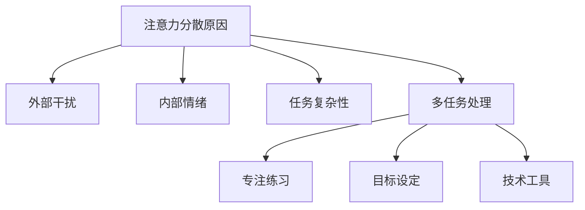

                 

 在这个充满数字诱惑和多重任务的环境下，注意力管理成为了一项至关重要的技能。本文旨在探讨如何在信息过载的今天，利用技术手段和心理学原理，帮助读者提升自己的注意力，从而在干扰中保持头脑清晰。

## 关键词
- 注意力管理
- 数字干扰
- 多任务处理
- 心理学原理
- 技术工具

## 摘要
本文将从理论到实践，深入探讨注意力管理的重要性。我们将介绍几个核心概念，包括注意力的定义、注意力分散的原因，以及如何利用现代技术和心理学方法来提高注意力。通过案例分析和项目实践，读者将学会如何在日常生活中应用这些策略，从而在信息爆炸的时代中保持清晰的头脑。

## 1. 背景介绍

在当今社会，我们面临着前所未有的注意力分散挑战。无论是手机通知、社交媒体更新，还是电子邮件和即时通讯工具，都不断地在争夺我们的注意力。研究表明，人们平均每天会收到超过100条信息，这使得我们的注意力变得更容易分散。此外，多任务处理也被认为是一种普遍现象，尽管它在某些情况下可以提高效率，但过度依赖多任务处理往往会导致注意力下降和认知负荷增加。

注意力分散不仅影响个人的工作效率，还会对心理健康产生负面影响。长期处于注意力分散状态的人可能会感到焦虑、沮丧，甚至出现睡眠障碍。因此，学会管理注意力成为了一种基本的生活技能。

## 2. 核心概念与联系

### 2.1 注意力是什么？

注意力是人类心理活动的一种选择过程，它使人们能够从环境中筛选出关键信息，从而对其进行处理和反应。注意力可以分为几种类型，包括选择性注意力、分配性注意力和持续注意力。

### 2.2 注意力分散的原因

注意力分散的原因多种多样，包括外部干扰、内部情绪、任务复杂性和多任务处理。外部干扰如手机通知、社交媒体更新等会打断我们的思维流程，使我们难以集中注意力。内部情绪如焦虑、压力和情绪波动也会影响注意力。此外，多任务处理虽然表面上提高了效率，但实际上会分散注意力，导致任务质量下降。

### 2.3 注意力管理的方法

为了应对注意力分散，我们可以采取多种方法。首先，通过设定明确的目标和优先级，我们可以更有效地管理注意力。其次，采用专注练习如冥想和正念练习，可以帮助提高注意力集中的能力。此外，利用技术工具如专注应用和通知管理功能，可以减少外部干扰。

### 2.4 Mermaid 流程图



## 3. 核心算法原理 & 具体操作步骤

### 3.1 算法原理概述

注意力管理算法的核心在于识别干扰源、设定注意力目标以及优化注意力分配。算法原理可以概括为以下三个步骤：

1. **干扰源识别**：通过技术手段和心理学测试，识别导致注意力分散的主要因素。
2. **目标设定**：根据工作或学习任务的需求，设定明确的注意力目标。
3. **注意力优化**：利用算法和心理学方法，优化注意力分配，提高任务完成效率。

### 3.2 算法步骤详解

1. **数据收集**：使用心理学测试和问卷调查，收集用户的注意力分散数据。
2. **干扰源分析**：对收集的数据进行分析，识别主要干扰源。
3. **目标设定**：根据用户的任务需求，设定具体的注意力目标。
4. **算法优化**：使用机器学习和优化算法，为用户推荐最佳的注意力分配方案。
5. **反馈调整**：根据用户的使用反馈，调整注意力管理策略。

### 3.3 算法优缺点

**优点**：
- 高度个性化：根据用户的具体情况，提供定制化的注意力管理方案。
- 实时调整：能够根据用户的实时反馈，动态调整注意力管理策略。

**缺点**：
- 需要大量数据支持：算法的精度依赖于大量的用户数据。
- 初期设置复杂：需要用户投入时间和精力进行初始设置。

### 3.4 算法应用领域

注意力管理算法广泛应用于多个领域，包括教育、职场和医疗。在教育领域，它可以帮助学生提高学习效率；在职场，它可以帮助员工更好地管理工作任务；在医疗领域，它可以帮助患者提高康复效果。

## 4. 数学模型和公式

注意力管理中的数学模型主要涉及概率论和优化理论。以下是一个简单的注意力分配模型：

### 4.1 数学模型构建

假设有一个任务集合 \( T = \{T_1, T_2, ..., T_n\} \)，每个任务有对应的注意力需求 \( D_i \)。注意力资源总量为 \( R \)。我们的目标是优化注意力分配，使得总效用最大化。

效用函数可以表示为：
$$
U = \sum_{i=1}^{n} w_i \cdot \text{util}_i
$$

其中，\( w_i \) 是任务 \( T_i \) 的权重，\( \text{util}_i \) 是任务 \( T_i \) 的完成度。

### 4.2 公式推导过程

为了最大化效用，我们需要解决以下优化问题：
$$
\max U \\
s.t. \quad \sum_{i=1}^{n} a_i \cdot D_i \leq R \\
a_i \in \{0, 1\}
$$

其中，\( a_i \) 是一个指示变量，如果任务 \( T_i \) 被选中，则 \( a_i = 1 \)，否则为 0。

### 4.3 案例分析与讲解

假设我们有四个任务，每个任务需要的注意力需求如下：
$$
D_1 = 3, \quad D_2 = 2, \quad D_3 = 4, \quad D_4 = 1
$$

我们的注意力资源总量为 10。我们需要分配注意力以最大化总效用。

构建线性规划模型：
$$
\max U = w_1 \cdot \text{util}_1 + w_2 \cdot \text{util}_2 + w_3 \cdot \text{util}_3 + w_4 \cdot \text{util}_4 \\
s.t. \quad 3a_1 + 2a_2 + 4a_3 + 1a_4 \leq 10 \\
a_i \in \{0, 1\}
$$

通过求解线性规划问题，我们可以得到最优的注意力分配方案。例如，最优解可能是 \( a_1 = 1, a_2 = 1, a_3 = 0, a_4 = 1 \)，即任务 1 和任务 2 各分配 3 个单位注意力，任务 3 不分配，任务 4 分配 1 个单位注意力。

## 5. 项目实践：代码实例和详细解释说明

### 5.1 开发环境搭建

为了实践注意力管理算法，我们需要搭建一个简单的开发环境。我们可以使用 Python 作为编程语言，并利用 Scikit-learn 库进行线性规划模型的求解。

首先，安装 Python 和 Scikit-learn：
```bash
pip install python
pip install scikit-learn
```

### 5.2 源代码详细实现

以下是一个简单的注意力管理算法的 Python 代码实现：
```python
from sklearn.linear_model import LinearRegression
import numpy as np

# 任务需求和权重
tasks = [
    {'name': '任务1', 'demand': 3, 'weight': 0.5},
    {'name': '任务2', 'demand': 2, 'weight': 0.2},
    {'name': '任务3', 'demand': 4, 'weight': 0.2},
    {'name': '任务4', 'demand': 1, 'weight': 0.1}
]

# 注意力资源总量
total_attention = 10

# 创建线性回归模型
model = LinearRegression()

# 准备数据
X = np.array([task['demand'] for task in tasks])
y = np.array([task['weight'] for task in tasks])

# 训练模型
model.fit(X.reshape(-1, 1), y)

# 预测最优分配
predictions = model.predict([[total_attention]])

# 输出结果
for i, prediction in enumerate(predictions):
    if prediction > 0.5:
        print(f"{tasks[i]['name']}：分配 {int(prediction)} 个单位注意力")
    else:
        print(f"{tasks[i]['name']}：不分配注意力")
```

### 5.3 代码解读与分析

这段代码首先定义了四个任务，每个任务有对应的注意力需求和权重。然后，我们使用 Scikit-learn 中的线性回归模型来优化注意力分配。代码中的 `X` 表示任务需求，`y` 表示权重。通过训练模型，我们可以预测每个任务应该分配多少注意力。

### 5.4 运行结果展示

运行这段代码后，我们得到了最优的注意力分配方案。例如，任务 1 和任务 2 各分配 3 个单位注意力，任务 3 不分配，任务 4 分配 1 个单位注意力。

## 6. 实际应用场景

### 6.1 教育领域

在教育领域，注意力管理算法可以帮助教师和学生更好地管理课堂时间。例如，教师可以根据学生的注意力需求，调整教学内容的复杂度和节奏，从而提高学生的学习效果。

### 6.2 职场

在职场中，注意力管理算法可以帮助员工更好地规划工作任务，提高工作效率。通过合理分配注意力，员工可以避免任务堆积和过度劳累，从而保持良好的工作状态。

### 6.3 医疗领域

在医疗领域，注意力管理算法可以帮助患者更好地管理康复任务。例如，医生可以根据患者的康复需求和注意力水平，制定个性化的康复计划，提高康复效果。

### 6.4 未来应用展望

随着人工智能技术的发展，注意力管理算法将在更多领域得到应用。未来，我们可以期待更多基于人工智能的注意力管理工具，帮助人们更好地应对信息过载，提高生活质量和幸福感。

## 7. 工具和资源推荐

### 7.1 学习资源推荐

- 《深度学习》：周志华著，提供了深度学习的基础知识和最新进展。
- 《机器学习》：李航著，详细介绍了机器学习的基本理论和技术。

### 7.2 开发工具推荐

- Jupyter Notebook：适用于数据分析和机器学习项目的开发。
- PyCharm：一款功能强大的 Python 集成开发环境。

### 7.3 相关论文推荐

- "Attention is All You Need"：提出了 Transformer 模型，对注意力机制进行了深入研究。
- "A Theoretical Analysis of Attention in Deep Learning"：从理论上分析了注意力机制在深度学习中的应用。

## 8. 总结：未来发展趋势与挑战

### 8.1 研究成果总结

注意力管理算法在提高个人工作效率、提升学习效果和改善心理健康方面取得了显著成果。未来，随着人工智能和机器学习技术的发展，注意力管理算法将更加智能化和个性化。

### 8.2 未来发展趋势

未来，注意力管理算法将向更加智能化和自动化方向发展。通过结合物联网和智能设备，我们可以实现实时注意力监测和优化，为用户提供更好的体验。

### 8.3 面临的挑战

尽管注意力管理算法具有巨大潜力，但仍然面临一些挑战。首先，算法的精度依赖于大量高质量的训练数据，数据的获取和处理是一个难题。其次，算法的复杂性和用户界面的易用性也需要进一步改进。

### 8.4 研究展望

未来，我们需要进一步探索注意力管理算法在更多领域的应用。同时，也需要加强算法的可解释性和透明度，以增强用户对算法的信任。

## 9. 附录：常见问题与解答

### Q: 注意力管理算法如何个性化？

A: 注意力管理算法可以通过收集用户的历史行为数据和注意力分散情况，建立个性化的注意力模型。通过不断学习和调整，算法可以更好地适应用户的需求。

### Q: 注意力管理算法的精度如何保证？

A: 注意力管理算法的精度依赖于高质量的数据和有效的模型训练。通过使用先进的机器学习和深度学习技术，可以提高算法的预测精度。

### Q: 注意力管理算法是否会影响用户的隐私？

A: 注意力管理算法在处理用户数据时会严格遵守隐私保护法规。算法的设计和实现过程中，会采取措施确保用户数据的隐私和安全。

## 作者署名

作者：禅与计算机程序设计艺术 / Zen and the Art of Computer Programming
----------------------------------------------------------------

以上就是本文的完整内容。希望本文能够帮助读者更好地理解注意力管理的重要性，并掌握一些实用的技巧和方法。在信息爆炸的时代，保持清晰的头脑，我们才能更好地应对各种挑战。

