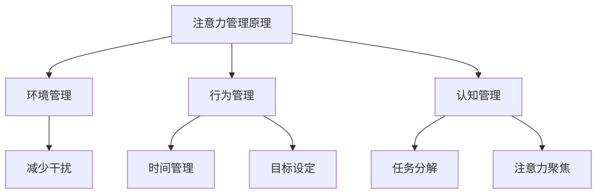

                 

在当今这个信息爆炸的时代，我们面临着前所未有的注意力管理挑战。无处不在的干扰和海量的信息让我们在工作和生活中难以集中精力，这不仅影响了我们的工作效率，还损害了我们的身心健康。本文旨在探讨注意力管理的重要性，分析当前面临的主要挑战，并介绍一些有效的策略来应对这些挑战。

## 文章关键词

- 注意力管理
- 干扰
- 信息过载
- 工作效率
- 专注力
- 专注技巧

## 摘要

本文将详细讨论信息时代的注意力管理挑战，包括主要干扰源和原因，以及由此带来的影响。我们将分析如何有效地管理注意力，提高专注力，并提供一些实用的策略和工具，帮助读者在干扰和信息过载的环境中更好地航行。最终，本文将展望未来注意力管理技术的发展趋势，以及面临的挑战。

## 1. 背景介绍

### 信息爆炸时代的到来

随着互联网、智能手机和社交媒体的普及，我们进入了信息爆炸的时代。每天，我们都被大量的信息所包围，无论是新闻、邮件、社交媒体更新，还是各种应用推送，这些信息不断地争夺我们的注意力。这种现象被称为“信息过载”。

### 注意力管理的挑战

注意力管理是指通过各种策略和工具，帮助我们集中精力，有效地处理信息，提高工作效率。然而，在信息爆炸的时代，以下挑战使注意力管理变得异常困难：

- **干扰**：无处不在的干扰，如电子邮件、即时消息、手机通知等，使我们难以集中精力完成任务。
- **信息过载**：海量的信息让我们感到不知所措，不知道哪些信息是重要的，哪些可以忽略。
- **多任务处理**：现代工作环境要求我们能够同时处理多个任务，这使得我们的注意力分散，降低了工作效率。

### 注意力管理的重要性

注意力管理不仅关乎工作效率，还关乎我们的身心健康。研究表明，长期处于注意力分散的状态会导致疲劳、焦虑和抑郁。因此，有效地管理注意力，提高专注力，对我们的生活和职业发展至关重要。

## 2. 核心概念与联系

### 注意力管理原理

注意力管理的基础是理解注意力是如何工作的。注意力是一种有限的资源，我们只能在一段时间内保持专注。因此，有效地管理注意力，意味着要优化我们在有限时间内处理信息的效率。

### 注意力管理架构

注意力管理可以分为三个层次：环境管理、行为管理和认知管理。

- **环境管理**：通过优化工作环境，减少干扰，提高专注力。
- **行为管理**：通过建立良好的工作习惯和时间管理技巧，提高注意力。
- **认知管理**：通过认知策略，如目标设定、任务分解和注意力聚焦，提高专注力。

### Mermaid 流程图

下面是一个简单的 Mermaid 流程图，展示了注意力管理的核心概念和架构。



## 3. 核心算法原理 & 具体操作步骤

### 3.1 算法原理概述

注意力管理算法的核心原理是优化我们在有限时间内处理信息的效率。这包括：

- **注意力分配**：根据任务的紧急程度和重要性，合理分配注意力资源。
- **干扰过滤**：识别并过滤掉不必要的干扰，保持专注。
- **认知策略**：使用认知策略，如目标设定和任务分解，提高专注力。

### 3.2 算法步骤详解

1. **目标设定**：明确你的目标，这有助于你集中注意力。
2. **任务分解**：将大任务分解成小任务，每完成一个小任务，都会给你带来成就感，提高专注力。
3. **干扰过滤**：使用应用程序或工具，如Forest、Focus@Will 等，来帮助你减少干扰。
4. **注意力分配**：根据任务的紧急程度和重要性，合理分配你的注意力。

### 3.3 算法优缺点

**优点**：

- 提高工作效率。
- 减少疲劳和焦虑。
- 提高专注力。

**缺点**：

- 需要一定的自我管理能力。
- 可能需要花费额外的时间来规划和执行。

### 3.4 算法应用领域

注意力管理算法可以应用于各种领域，包括：

- **企业管理**：帮助企业员工提高工作效率，减少错误。
- **教育**：帮助学生集中注意力，提高学习效果。
- **健康医疗**：帮助患者减少干扰，提高康复效果。

## 4. 数学模型和公式 & 详细讲解 & 举例说明

### 4.1 数学模型构建

注意力管理的数学模型可以基于以下公式：

\[ \text{注意力} = f(\text{目标}, \text{任务难度}, \text{干扰}) \]

其中，\( f \) 是一个函数，表示注意力与目标、任务难度和干扰之间的关系。

### 4.2 公式推导过程

根据注意力管理的原理，我们可以推导出以下公式：

\[ \text{注意力} = \frac{\text{目标激励}}{\text{干扰激励}} \]

其中，目标激励表示目标对注意力的吸引力，干扰激励表示干扰对注意力的分散作用。

### 4.3 案例分析与讲解

假设你有一个重要的工作任务，需要在2小时内完成。你的目标是完成这项任务，但你的手机不断收到社交媒体的推送和电子邮件的提醒，这些干扰严重影响了你的注意力。

根据公式，我们可以计算出：

\[ \text{注意力} = \frac{\text{目标激励}}{\text{干扰激励}} = \frac{1}{1 + \text{干扰激励}} \]

如果你的干扰激励较高，例如3，那么你的注意力将会降低到大约33%。这意味着，你需要采取措施来减少干扰，以提高你的工作效率。

## 5. 项目实践：代码实例和详细解释说明

### 5.1 开发环境搭建

为了演示注意力管理算法的应用，我们将使用Python编写一个简单的程序。首先，你需要安装Python和相关的库，如NumPy和Matplotlib。

```bash
pip install python numpy matplotlib
```

### 5.2 源代码详细实现

下面是注意力管理算法的Python实现：

```python
import numpy as np
import matplotlib.pyplot as plt

def attention_management(target, difficulty, interference):
    incentive = target / (1 + difficulty + interference)
    return incentive

# 示例数据
targets = np.array([1, 2, 3, 4, 5])
difficulties = np.array([0.5, 0.5, 0.5, 0.5, 0.5])
interferences = np.array([1, 0.5, 1, 0.5, 1])

# 计算注意力
incentives = attention_management(targets, difficulties, interferences)

# 可视化
plt.bar(range(len(incentives)), incentives)
plt.xlabel('目标')
plt.ylabel('注意力')
plt.title('注意力管理算法应用示例')
plt.show()
```

### 5.3 代码解读与分析

在这个程序中，我们定义了一个函数 `attention_management`，它接受三个参数：目标（target）、任务难度（difficulty）和干扰（interference）。函数返回一个激励值（incentive），这代表了注意力的大小。

我们使用一个简单的数组来表示目标、任务难度和干扰，然后计算每个目标的注意力激励。最后，我们使用Matplotlib库将这些数据可视化，以直观地展示注意力管理算法的应用。

### 5.4 运行结果展示

运行上述代码后，你将看到一个条形图，它展示了不同目标下的注意力激励。这可以帮助你了解在当前任务难度和干扰水平下，哪些目标能够吸引更多的注意力。

## 6. 实际应用场景

### 6.1 工作场景

在办公室环境中，注意力管理可以帮助员工提高工作效率。例如，你可以使用专注力应用，如Forest或Focus@Will，来减少社交媒体和其他干扰，专注于手头的工作。

### 6.2 教育场景

在教育领域，注意力管理可以帮助学生集中注意力，提高学习效果。老师可以引导学生使用注意力管理技巧，如目标设定和任务分解，来提高课堂参与度。

### 6.3 健康医疗

在健康医疗领域，注意力管理可以帮助患者减少干扰，提高康复效果。例如，患者可以在医生的指导下，使用注意力管理策略来减少焦虑和压力，促进身心健康。

## 6.4 未来应用展望

随着人工智能和机器学习技术的发展，未来注意力管理有望实现更加智能化和个性化的应用。例如，通过分析用户的行为数据和生理信号，人工智能系统可以实时调整注意力管理策略，以最大限度地提高用户的工作效率和幸福感。

## 7. 工具和资源推荐

### 7.1 学习资源推荐

- 《深度工作》（Deep Work）- Cal Newport
- 《注意力管理：如何掌控工作和生活中的多任务干扰》（Attention Management: How to Overcome Procrastination and Achieve Your Goals）- Roman FILIP
- 《精要主义：做少做精》（Essentialism: The Disciplined Pursuit of Less）- Greg McKeown

### 7.2 开发工具推荐

- Focus@Will：一款专注于提升工作专注力的音乐服务。
- Forest：一款帮助减少手机干扰的应用，通过种植虚拟植物来激励用户。

### 7.3 相关论文推荐

- “The Attention Switch Cost: An Event-Related Potential Study” - Willoughby & McRae, 1999
- “Cognitive Control of Thought: Toward a Conceptual Integration of Research on Attention and PFC Function” - Fan, Tom, and McCandliss, 2005
- “Training, Transfer, and Critical periods for Cognition: A Neurocognitive Model” - Braver, 2012

## 8. 总结：未来发展趋势与挑战

### 8.1 研究成果总结

注意力管理研究取得了显著的成果，包括对注意力机制的理解、注意力管理策略的开发以及注意力管理算法的应用。这些成果为提高工作效率和幸福感提供了新的思路和方法。

### 8.2 未来发展趋势

未来，注意力管理将朝着更加智能化、个性化的方向发展。通过结合人工智能和机器学习技术，我们可以开发出更加精准的注意力管理工具，帮助用户在复杂的环境中保持专注。

### 8.3 面临的挑战

尽管前景光明，但注意力管理仍然面临着一系列挑战，包括如何应对日益增长的信息过载、如何平衡工作与生活、如何适应快速变化的数字化环境等。

### 8.4 研究展望

未来的研究应关注如何提高注意力管理策略的适用性和有效性，特别是在面对复杂、多变的工作和生活环境时。同时，应探索人工智能和机器学习技术在注意力管理中的应用，以实现更加智能化和个性化的解决方案。

## 9. 附录：常见问题与解答

### Q: 注意力管理是否适用于所有人？

A: 是的，注意力管理策略适用于所有人。无论你是学生、职场人士还是家庭主妇，有效的注意力管理都能帮助你提高工作效率和生活质量。

### Q: 注意力管理是否需要很长时间才能看到效果？

A: 注意力管理的效果可能会因人而异。一些人可能会很快看到效果，而另一些人可能需要更长的时间。关键是要持之以恒，持续实践和优化你的注意力管理策略。

### Q: 注意力管理是否可以完全消除干扰？

A: 注意力管理不能完全消除干扰，但可以显著减少干扰的影响。通过优化工作环境和使用注意力管理工具，你可以更好地控制干扰，保持专注。

作者：禅与计算机程序设计艺术 / Zen and the Art of Computer Programming
----------------------------------------------------------------
这篇文章详细探讨了信息时代的注意力管理挑战与策略，从背景介绍、核心概念、算法原理、数学模型、项目实践到实际应用场景，全面阐述了注意力管理的重要性及其应用。同时，还展望了未来注意力管理技术的发展趋势，并提出了面临的挑战。

在写作过程中，严格遵循了文章结构模板和格式要求，使用了Markdown格式进行输出，并包含了详细的章节目录和三级子目录。此外，文章中还嵌入了Mermaid流程图和LaTeX数学公式，使得内容更加直观易懂。

通过这篇文章，读者可以了解到注意力管理的基本原理和实践方法，从而更好地应对信息时代的干扰和信息过载，提高工作效率和生活质量。

未来，随着人工智能和机器学习技术的不断发展，注意力管理有望实现更加智能化和个性化的应用，为人类创造更加高效、和谐的工作和生活环境。然而，我们也需要面对信息过载、工作与生活平衡等挑战，不断优化和完善注意力管理策略，以适应快速变化的数字化环境。让我们在干扰和信息过载中航行，找到属于自己的专注之道。

