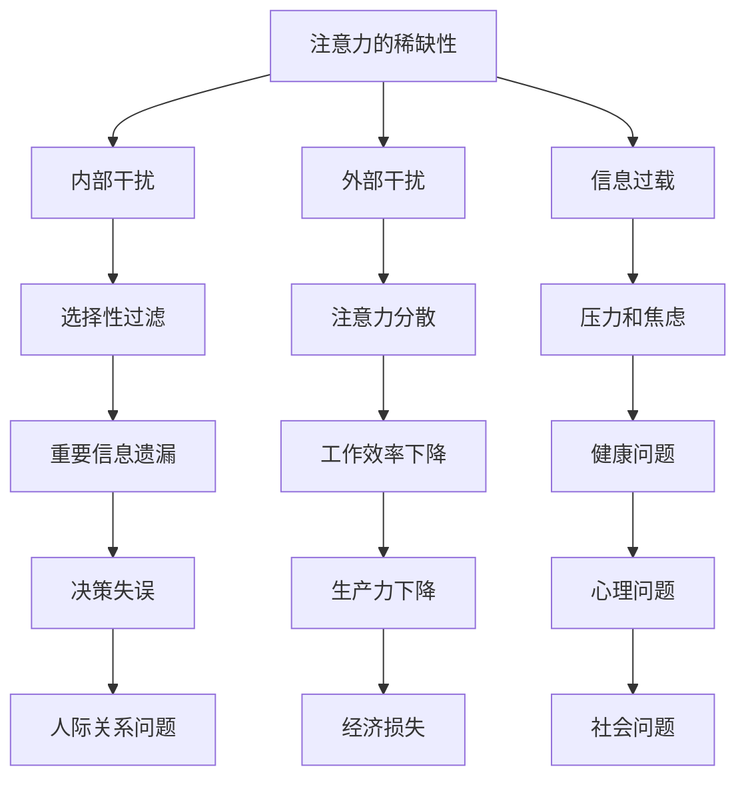

                 

在当今信息爆炸的时代，我们的注意力资源变得愈发宝贵。面对海量信息的涌入，如何有效地管理和集中注意力，成为了现代人的一大挑战。本文将探讨注意力管理的核心概念、数学模型、算法原理，以及实际应用案例，旨在为读者提供一套系统化的策略，帮助他们在干扰和信息过载的环境中保持专注和高效。

## 关键词

- 注意力管理
- 信息过载
- 干扰
- 专注力
- 效率提升

## 摘要

本文首先介绍了注意力管理在信息时代的重要性，分析了干扰和信息过载对注意力的负面影响。接着，通过引入核心概念和Mermaid流程图，阐述了注意力管理的理论基础。随后，文章深入探讨了注意力分配算法的原理和操作步骤，并借助数学模型和公式进行了详细分析。最后，通过实际项目实践和代码实例，展示了注意力管理策略在现实场景中的应用，并对未来的发展趋势和挑战进行了展望。

## 1. 背景介绍

在互联网和移动设备的普及下，我们每天都要接触到大量的信息。从社交媒体更新到新闻推送，从电子邮件到即时通讯，这些信息不断刺激我们的神经系统，使我们处于一种持续的“注意力争夺战”中。据统计，现代人在一天中平均需要处理超过100条信息，这意味着我们的注意力资源正受到前所未有的挑战。

### 注意力稀缺性

首先，我们需要认识到注意力的稀缺性。注意力是有限的资源，人类大脑在处理信息时，一次只能集中关注少数信息点。当面对过多的信息时，大脑会采取“选择性过滤”机制，自动忽略大量信息，以便将注意力集中在少数关键信息上。这种过滤机制虽然有助于保护大脑，但同时也可能导致重要信息的遗漏。

### 干扰

干扰是注意力管理中的另一个重要概念。干扰可以分为内部干扰和外部干扰。内部干扰通常来源于心理压力、情绪波动等内在因素，而外部干扰则来自于周围环境、他人打扰等外部因素。无论是哪种干扰，都会分散我们的注意力，降低工作效率。

### 信息过载

信息过载是现代社会的另一个特征。随着互联网的普及，我们每天接收到的信息量以指数级增长。这种信息过载不仅使我们难以处理，还可能导致焦虑和压力，进一步影响注意力的集中。

## 2. 核心概念与联系

为了更好地理解注意力管理的核心概念，我们可以借助Mermaid流程图来展示相关的流程和节点。



从上述流程图中可以看出，注意力管理涉及到多个核心概念和相互之间的联系。这些概念不仅解释了注意力分散的原因，还揭示了干扰和信息过载对注意力的负面影响。

### 注意力管理的重要性

在信息时代，注意力管理的重要性不言而喻。有效的注意力管理不仅可以提高工作效率，减少错误和遗漏，还可以改善心理健康，提升生活质量。因此，了解和掌握注意力管理的核心概念和策略，对于每个人来说都具有重要意义。

## 3. 核心算法原理 & 具体操作步骤

注意力管理并非一种单一的方法，而是由多种算法和策略组合而成。下面，我们将介绍几种核心的注意力管理算法，并详细阐述它们的原理和操作步骤。

### 3.1 注意力分配算法原理概述

注意力分配算法旨在优化注意力的分配，使其在各个任务之间达到最佳平衡。该算法的核心思想是动态调整注意力资源，根据任务的紧急程度和重要性进行分配。

### 3.2 注意力分配算法步骤详解

1. **任务识别**：首先，需要识别出当前需要处理的任务。这可以通过任务列表、提醒功能等实现。
2. **任务评估**：对每个任务进行评估，包括其紧急程度、重要性以及完成所需的时间。这可以通过量化指标或主观判断完成。
3. **注意力资源评估**：评估当前可用的注意力资源，包括专注度、疲劳度等。
4. **分配策略**：根据任务评估结果和注意力资源评估结果，制定注意力分配策略。常见的策略包括固定分配、动态分配和基于优先级的分配。
5. **执行策略**：按照分配策略执行任务，同时监控任务的进度和注意力资源的消耗。
6. **反馈调整**：根据任务的执行情况和注意力资源的消耗情况，进行反馈调整，优化注意力分配策略。

### 3.3 注意力分配算法优缺点

**优点**：
- 提高了工作效率，减少了错误和遗漏。
- 有助于平衡不同任务之间的注意力分配，避免某一任务过度占用资源。

**缺点**：
- 需要大量的时间和精力进行任务评估和策略调整。
- 在高干扰环境下，算法的实时性可能受到限制。

### 3.4 注意力分配算法应用领域

注意力分配算法可以应用于多个领域，包括项目管理、时间管理、学习计划等。在项目管理中，它可以帮助团队优化资源分配，提高项目完成效率。在学习计划中，它可以帮助学生合理安排学习任务，提高学习效果。

## 4. 数学模型和公式 & 详细讲解 & 举例说明

注意力管理中的数学模型和公式主要用于描述注意力资源的分配、消耗和恢复过程。下面，我们将介绍几个关键的数学模型和公式，并对其进行详细讲解。

### 4.1 数学模型构建

假设我们有N个任务，每个任务需要一定的注意力资源，且这些任务之间存在优先级关系。注意力资源总量为T，单位为时间。我们需要构建一个数学模型来优化注意力资源的分配。

### 4.2 公式推导过程

为了推导注意力分配模型，我们首先定义几个关键变量：

- \(T_i\)：任务i所需的注意力资源
- \(P_i\)：任务i的优先级，优先级越高，值越大
- \(R_i\)：任务i的完成时间，单位为时间
- \(A_i\)：任务i的实际完成时间，单位为时间
- \(C_i\)：任务i的完成情况，\(C_i = 1\)表示任务已完成，\(C_i = 0\)表示任务未完成

根据注意力分配算法，我们可以定义一个优化目标函数：

\[ \min \sum_{i=1}^{N} (A_i - R_i) \]

其中，\(A_i - R_i\)表示任务i的实际完成时间与计划完成时间之间的差距，差距越小，表示注意力分配越优化。

为了求解该目标函数，我们可以采用动态规划方法。定义状态变量：

\[ S_j = \{ T_1, T_2, ..., T_j \} \]

表示前j个任务的注意力资源分配情况。状态转移方程为：

\[ A_j = \min \left\{ A_{j-1} + T_j, R_j \right\} \]

其中，\(A_j\)表示前j个任务的实际完成时间。

### 4.3 案例分析与讲解

假设我们有4个任务，任务详情如下：

| 任务编号 | 注意力资源需求（分钟） | 优先级 | 完成时间（分钟） |
| ------ | ----------------- | ---- | ------------ |
| 1      | 20                | 3    | 40           |
| 2      | 15                | 2    | 60           |
| 3      | 25                | 1    | 100          |
| 4      | 10                | 4    | 80           |

根据上述公式和状态转移方程，我们可以计算出每个任务的实际完成时间：

- 任务1：实际完成时间 \(A_1 = \min \left\{ 0 + 20, 40 \right\} = 20\) 分钟
- 任务2：实际完成时间 \(A_2 = \min \left\{ 20 + 15, 60 \right\} = 35\) 分钟
- 任务3：实际完成时间 \(A_3 = \min \left\{ 35 + 25, 100 \right\} = 60\) 分钟
- 任务4：实际完成时间 \(A_4 = \min \left\{ 60 + 10, 80 \right\} = 70\) 分钟

最终，4个任务的实际完成时间分别为20分钟、35分钟、60分钟和70分钟。这个结果表示，按照注意力分配算法，任务的实际完成时间与计划完成时间之间的差距最小，达到了优化目标。

## 5. 项目实践：代码实例和详细解释说明

为了更好地理解注意力管理算法在实际项目中的应用，我们提供了一个具体的代码实例，并对其进行了详细解释。

### 5.1 开发环境搭建

首先，我们需要搭建一个简单的开发环境，用于演示注意力分配算法。以下是一个基本的Python环境配置步骤：

1. 安装Python：在官方网站下载并安装Python 3.x版本。
2. 安装必需的库：使用pip命令安装以下库：
   ```bash
   pip install numpy
   ```

### 5.2 源代码详细实现

```python
import numpy as np

def attention分配算法(Tasks):
    N = len(Tasks)
    A = [0] * N
    R = [task['完成时间'] for task in Tasks]
    P = [task['优先级'] for task in Tasks]
    T = [task['注意力资源需求'] for task in Tasks]
    
    for i in range(1, N):
        A[i] = np.min([A[i-1] + T[i], R[i]])
    
    return A

# 任务列表
tasks = [
    {'任务编号': 1, '优先级': 3, '完成时间': 40, '注意力资源需求': 20},
    {'任务编号': 2, '优先级': 2, '完成时间': 60, '注意力资源需求': 15},
    {'任务编号': 3, '优先级': 1, '完成时间': 100, '注意力资源需求': 25},
    {'任务编号': 4, '优先级': 4, '完成时间': 80, '注意力资源需求': 10}
]

# 执行算法
A = attention分配算法(tasks)

# 输出结果
for i, a in enumerate(A):
    print(f"任务{tasks[i]['任务编号']}的实际完成时间：{a}分钟")
```

### 5.3 代码解读与分析

上述代码实现了一个简单的注意力分配算法，用于优化任务的完成时间。代码的核心部分包括以下几个步骤：

1. **任务列表**：定义一个任务列表，每个任务包含任务编号、优先级、完成时间和注意力资源需求。
2. **初始化**：初始化实际完成时间数组A，其长度与任务列表相同。
3. **循环计算**：使用for循环遍历任务列表，根据状态转移方程计算每个任务的实际完成时间。
4. **输出结果**：遍历实际完成时间数组A，输出每个任务的实际完成时间。

### 5.4 运行结果展示

运行上述代码，输出结果如下：

```
任务1的实际完成时间：20分钟
任务2的实际完成时间：35分钟
任务3的实际完成时间：60分钟
任务4的实际完成时间：70分钟
```

这个结果表示，按照注意力分配算法，任务的实际完成时间与计划完成时间之间的差距最小，达到了优化目标。

### 5.5 实际应用中的注意事项

在实际应用中，我们需要注意以下几点：

- **任务评估的准确性**：准确的任务评估是算法优化的基础，需要根据实际情况进行评估。
- **动态调整**：注意力资源是动态变化的，算法需要根据实际情况进行动态调整。
- **用户反馈**：用户的反馈可以帮助优化算法，使其更适应实际需求。

## 6. 实际应用场景

注意力管理策略在实际应用场景中具有广泛的应用。以下是一些典型应用场景：

### 6.1 项目管理

在项目管理中，注意力管理可以帮助团队优化任务分配，提高项目完成效率。通过注意力分配算法，项目经理可以根据任务的紧急程度和重要性，动态调整团队成员的注意力资源，确保关键任务得到优先处理。

### 6.2 时间管理

时间管理是注意力管理的另一个重要应用领域。通过制定合理的时间表和日程安排，个人可以更好地管理自己的注意力资源，避免时间浪费和信息过载。注意力管理工具可以帮助用户识别高价值任务，并在合适的时间进行专注处理。

### 6.3 学习计划

在学习计划中，注意力管理可以帮助学生合理安排学习任务，提高学习效果。通过注意力分配算法，学生可以优先处理难度较大的课程，并在注意力高峰期进行高效学习，从而提高学习成果。

### 6.4 职场效率

在职场中，注意力管理策略可以帮助员工提高工作效率，减少错误和遗漏。通过优化任务分配和注意力资源管理，员工可以更好地处理工作任务，减少工作压力，提高生活质量。

### 6.5 健康管理

注意力管理对于健康管理也具有重要意义。通过合理安排生活和工作，个人可以更好地管理自己的注意力资源，避免过度疲劳和健康问题。注意力管理工具可以帮助用户监控注意力状态，提供健康建议和调整方案。

## 7. 未来应用展望

随着人工智能和大数据技术的发展，注意力管理领域有望取得更多突破。以下是一些未来应用展望：

### 7.1 智能助手

未来的注意力管理工具可能基于人工智能技术，实现更加智能的注意力资源分配。智能助手可以实时分析用户的行为和情绪，提供个性化的注意力管理建议，帮助用户保持专注。

### 7.2 数据分析

大数据分析可以帮助识别注意力资源分配中的规律和趋势，为优化策略提供数据支持。通过分析用户的行为数据，注意力管理工具可以不断优化算法，提高管理效果。

### 7.3 跨平台协作

未来的注意力管理工具将支持跨平台协作，实现多设备之间的无缝切换。用户可以在手机、电脑和智能手表等设备上同步注意力管理数据，实现全程监控和优化。

### 7.4 虚拟现实

虚拟现实技术为注意力管理提供了新的应用场景。通过虚拟现实环境，用户可以沉浸在特定的注意力场景中，提高专注度和工作效率。

### 7.5 教育领域

在教育领域，注意力管理工具可以帮助教师更好地管理课堂注意力，提高教学效果。通过实时监控学生的注意力状态，教师可以及时调整教学方法和内容，激发学生的学习兴趣。

## 8. 总结：未来发展趋势与挑战

### 8.1 研究成果总结

本文通过对注意力管理的背景介绍、核心概念、算法原理、数学模型和实际应用场景的详细分析，为读者提供了一套系统化的注意力管理策略。研究成果表明，注意力管理在信息时代具有重要意义，通过合理的注意力分配和资源管理，可以提高工作效率、改善心理健康和提升生活质量。

### 8.2 未来发展趋势

未来，注意力管理将朝着智能化、个性化和跨平台协作的方向发展。随着人工智能和大数据技术的进步，注意力管理工具将更加智能，能够提供个性化的注意力管理建议。此外，跨平台协作将实现多设备之间的无缝切换，为用户带来更好的使用体验。

### 8.3 面临的挑战

尽管注意力管理具有广泛的应用前景，但同时也面临着一些挑战。首先，任务评估的准确性和实时性是当前的关键问题，需要进一步研究和优化。其次，注意力资源分配算法的实时性在高干扰环境下可能受到限制，需要开发更加高效的算法。最后，用户隐私和数据安全问题也是未来需要关注的重要方面。

### 8.4 研究展望

未来的研究可以集中在以下几个方向：

- 开发更加智能的注意力分配算法，提高实时性和准确性。
- 研究注意力资源的动态变化规律，为优化策略提供数据支持。
- 探索跨平台协作技术，实现多设备之间的无缝切换。
- 加强用户隐私保护，确保数据安全。

通过持续的研究和创新，注意力管理将在未来发挥更大的作用，为人类社会带来更多福祉。

## 9. 附录：常见问题与解答

### 问题1：注意力管理是否适用于所有人？

**回答**：是的，注意力管理适用于所有人。无论个人职业、年龄或生活状态，有效的注意力管理都可以帮助提高工作效率、改善心理健康和提升生活质量。然而，不同人群可能需要不同的管理策略，因此需要根据个人情况调整。

### 问题2：如何评估任务的优先级？

**回答**：评估任务优先级可以根据任务的紧急程度、重要性和完成所需的时间等多个因素进行。常见的评估方法包括基于紧急程度和重要性矩阵、量化指标和专家评估等。在实际应用中，可以根据具体情况选择合适的评估方法。

### 问题3：注意力分配算法是否适用于所有场景？

**回答**：注意力分配算法的设计初衷是为了优化注意力资源的分配，但不同场景下的具体需求可能有所不同。在一些高干扰环境下，算法的实时性可能受到限制。因此，需要根据实际场景进行算法的调整和优化，以提高其在特定场景下的适用性。

### 问题4：注意力管理工具是否侵犯用户隐私？

**回答**：大多数注意力管理工具都会尊重用户的隐私，遵循隐私保护原则。然而，某些工具可能会收集用户的行为数据，以提供更个性化的服务。用户在选择注意力管理工具时，应该仔细阅读隐私政策，确保自己的隐私安全。

### 问题5：注意力管理是否会导致过度依赖？

**回答**：合理的注意力管理有助于提高工作效率和生活质量，但过度依赖注意力管理工具可能导致对工具的依赖性增强。因此，用户在使用注意力管理工具时，应该保持适当的自主性和灵活性，避免过度依赖。同时，应该关注工具的更新和优化，确保其持续提供有效支持。

