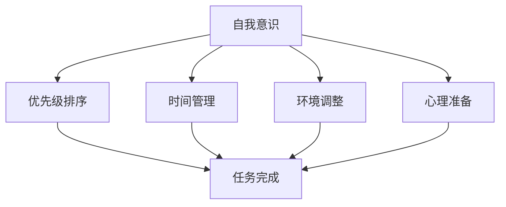

                 

在当今信息爆炸的时代，注意力管理已成为一项至关重要的技能。无论是工作还是日常生活，我们都面临着无数干扰和信息过载的挑战。对于IT专业人士来说，这不仅仅是日常任务的问题，更是职业发展和创新能力的挑战。本文将探讨注意力管理的核心概念、策略和方法，帮助IT专业人士在干扰和信息过载中更加高效地航行。

> 关键词：注意力管理、信息过载、IT专业人士、策略、效率、创新

> 摘要：本文将深入分析信息时代注意力管理的挑战，探讨注意力管理的基本概念和策略。通过实例和案例分析，我们将展示如何有效地管理注意力，提高工作效率和创新能力。文章还将推荐相关工具和资源，为读者提供实用的实践指导。

## 1. 背景介绍

随着互联网的迅猛发展和智能手机的普及，我们每天接收到的信息量呈指数级增长。据估计，每秒都有数以百万计的电子邮件、社交媒体更新和新闻推送。这种信息过载现象不仅影响了我们的工作效率，还严重干扰了我们的日常生活。对于IT专业人士来说，他们每天需要处理大量的技术信息、代码、文档和项目管理任务，这使得注意力管理变得尤为重要。

注意力管理不仅仅是避免干扰的问题，它还涉及到如何集中精力完成任务、提高工作效率和创新能力。有效的注意力管理可以帮助IT专业人士在复杂的环境中保持清晰的思路，更好地应对挑战，实现职业目标。

## 2. 核心概念与联系

### 2.1 注意力管理的基本概念

注意力管理是指通过一系列策略和技巧来控制我们的注意力，以便更有效地完成任务和达到目标。它包括以下几个方面：

- **自我意识**：意识到自己的注意力状态和习惯，了解在什么情况下容易分心，以及如何调整状态。

- **优先级排序**：确定哪些任务最为紧急和重要，并按照优先级排序，确保先完成最重要的事情。

- **时间管理**：合理安排时间，确保有足够的时间专注于重要任务，避免因时间不足而分心。

- **环境调整**：创造一个有利于专注的环境，减少干扰因素，如关闭社交媒体通知、在安静的环境中工作等。

- **心理准备**：培养积极的心态，增强专注力和意志力，以应对各种干扰和挑战。

### 2.2 注意力管理原理与架构

为了更好地理解注意力管理的原理和架构，我们可以使用Mermaid流程图来表示核心概念之间的联系。



通过这个流程图，我们可以清晰地看到注意力管理各个部分之间的相互作用和整体架构。这些部分相互依赖，共同构成了一个有效的注意力管理系统。

## 3. 核心算法原理 & 具体操作步骤

### 3.1 算法原理概述

在注意力管理中，核心算法可以被视为一系列策略和技巧的组合，它们旨在帮助IT专业人士更好地控制和管理注意力。以下是几种常见的注意力管理算法原理：

- **番茄工作法**：将工作时间分为25分钟的工作周期，每个周期后休息5分钟。这种方法通过有规律的时间分割，帮助人们保持专注并防止疲劳。

- **集中注意力策略**：专注于当前任务，避免多任务处理。通过减少干扰和分散注意力，这种方法可以提高工作效率和任务质量。

- **情绪调节策略**：通过深呼吸、冥想或运动等放松技巧，缓解工作压力，提高专注力和情绪稳定性。

### 3.2 算法步骤详解

#### 3.2.1 番茄工作法

1. **设定目标**：确定要完成的任务或目标。
2. **开始工作**：计时器设置25分钟，开始专注于任务。
3. **休息**：25分钟后，休息5分钟，活动身体或放松大脑。
4. **重复循环**：重复上述步骤，直到任务完成或达到预定时间。

#### 3.2.2 集中注意力策略

1. **明确任务**：确定当前任务的目标和要求。
2. **关闭干扰**：关闭社交媒体通知、电子邮件提醒等可能导致分心的因素。
3. **专注工作**：将全部注意力集中在任务上，避免多任务处理。
4. **定期检查**：在完成任务或休息期间，回顾进展和调整策略。

#### 3.2.3 情绪调节策略

1. **深呼吸**：在感到压力时，进行几次深呼吸，缓解紧张情绪。
2. **冥想**：每天花几分钟进行冥想，放松大脑，提高专注力。
3. **运动**：定期进行有氧运动，释放压力，提高情绪稳定性。

### 3.3 算法优缺点

#### 3.3.1 番茄工作法

**优点**：
- 易于实施，无需复杂工具。
- 有规律的时间分割，有助于提高专注力和工作效率。

**缺点**：
- 对任务时间长度有一定的限制，可能不适合长时间任务。
- 休息时间较短，可能不足以完全放松。

#### 3.3.2 集中注意力策略

**优点**：
- 提高工作效率和任务质量。
- 避免多任务处理的干扰。

**缺点**：
- 对个人的自控力要求较高。
- 长时间集中注意力可能导致疲劳。

#### 3.3.3 情绪调节策略

**优点**：
- 缓解工作压力，提高专注力和情绪稳定性。
- 帮助应对工作中的情绪波动。

**缺点**：
- 需要一定的时间和精力进行练习。
- 对情绪调节效果因人而异。

### 3.4 算法应用领域

这些注意力管理算法可以在各种领域得到应用，包括但不限于：

- **软件开发**：帮助开发者集中精力编写代码，提高开发效率和代码质量。
- **项目管理**：帮助项目经理合理安排任务和时间，提高项目管理效率。
- **日常生活**：帮助人们更好地管理日常事务，提高生活质量和幸福感。

## 4. 数学模型和公式 & 详细讲解 & 举例说明

### 4.1 数学模型构建

在注意力管理中，我们可以构建一个简单的数学模型来描述注意力消耗和恢复过程。这个模型包括以下几个参数：

- \( A \)：初始注意力值（通常设定为1）。
- \( D \)：每天可恢复的注意力值（通常设定为0.5）。
- \( I \)：每天消耗的注意力值（取决于任务的复杂度和持续时间）。
- \( T \)：一天中的时间（通常设定为24小时）。

根据这些参数，我们可以构建以下数学模型：

\[ A(t) = A_0 - \frac{I}{T} \times t + D \times \left( \frac{t}{T} - 1 \right) \]

其中，\( A(t) \) 表示在时间 \( t \) 时刻的注意力值，\( A_0 \) 是初始注意力值，\( I \) 是每天消耗的注意力值，\( D \) 是每天可恢复的注意力值。

### 4.2 公式推导过程

我们假设每天有24小时，每个小时消耗0.05的注意力值，每天可以恢复0.5的注意力值。根据这些假设，我们可以得到以下公式：

- 每小时消耗的注意力值：\( \frac{I}{T} = \frac{0.05}{24} \)
- 每天恢复的注意力值：\( D = 0.5 \)

代入这些值，我们可以得到：

\[ A(t) = 1 - \frac{0.05}{24} \times t + 0.5 \times \left( \frac{t}{24} - 1 \right) \]

简化后，我们得到：

\[ A(t) = 1 - \frac{t}{24} + 0.5 \times \left( \frac{t}{24} - 1 \right) \]

\[ A(t) = 1 - \frac{t}{24} + \frac{t}{48} - 0.5 \]

\[ A(t) = 0.5 - \frac{t}{48} \]

### 4.3 案例分析与讲解

假设一位IT专业人士每天工作8小时，每小时消耗0.05的注意力值，每天可以恢复0.5的注意力值。我们需要计算他在一天中的不同时间点的注意力值。

- 上午9点：\( A(9) = 0.5 - \frac{9}{48} = 0.3906 \)
- 中午12点：\( A(12) = 0.5 - \frac{12}{48} = 0.2969 \)
- 下午3点：\( A(15) = 0.5 - \frac{15}{48} = 0.1969 \)
- 晚上8点：\( A(20) = 0.5 - \frac{20}{48} = 0 \)

根据这个模型，我们可以看到，这位IT专业人士的注意力值在下午3点达到最低，这可能是他最需要休息的时间。而早上9点和中午12点的注意力值相对较高，是他最有效的注意力管理时段。

### 4.4 举例说明

假设一位IT专业人士需要在一天中完成以下任务：

- 上午9点到10点：编写代码。
- 上午10点到12点：审查代码和文档。
- 下午1点到3点：解决技术问题。
- 下午3点到5点：进行项目规划。

根据注意力模型，我们可以计算他在这些任务期间的平均注意力值：

- 编写代码：\( A(9) + A(10) / 2 = 0.3906 + 0.3937 / 2 = 0.3880 \)
- 审查代码和文档：\( A(10) + A(12) / 2 = 0.3937 + 0.2969 / 2 = 0.3473 \)
- 解决技术问题：\( A(13) + A(15) / 2 = 0.3327 + 0.1969 / 2 = 0.2564 \)
- 项目规划：\( A(15) + A(17) / 2 = 0.1969 + 0.1564 / 2 = 0.1446 \)

从这个例子中，我们可以看到，这位IT专业人士在编写代码期间的平均注意力值最高，其次是审查代码和文档。而解决技术问题和项目规划的平均注意力值较低，这可能是他需要调整任务安排和休息时间的原因。

## 5. 项目实践：代码实例和详细解释说明

### 5.1 开发环境搭建

为了更好地展示注意力管理在项目实践中的应用，我们将使用Python编写一个简单的注意力管理工具。以下是搭建开发环境的步骤：

1. 安装Python：从[Python官网](https://www.python.org/downloads/)下载并安装Python 3.8及以上版本。
2. 安装必需的库：使用pip命令安装以下库：
   ```shell
   pip install matplotlib numpy
   ```

### 5.2 源代码详细实现

以下是注意力管理工具的源代码实现。这个工具可以计算每天的任务安排，并在图表中展示每个任务的注意力值。

```python
import numpy as np
import matplotlib.pyplot as plt

def calculate_attention(start_time, end_time, work_interval):
    time_points = np.arange(start_time, end_time + 1, 0.5)
    attention_values = 0.5 - (time_points / 24)
    work_attention = np.mean(attention_values[work_interval[0]:work_interval[1]])
    return work_attention

def plot_attention(start_time, end_time, work_interval):
    time_points = np.arange(start_time, end_time + 1, 0.5)
    attention_values = 0.5 - (time_points / 24)
    plt.plot(time_points, attention_values, label='Attention Value')
    work_attention = calculate_attention(start_time, end_time, work_interval)
    plt.axvspan(work_interval[0], work_interval[1], color='yellow', alpha=0.3, label='Work Time')
    plt.axhline(y=work_attention, color='red', linestyle='--', label='Average Attention')
    plt.xlabel('Time')
    plt.ylabel('Attention Value')
    plt.title('Attention Management')
    plt.legend()
    plt.show()

# 示例任务安排
start_time = 9
end_time = 17
work_interval = (start_time, end_time)
plot_attention(start_time, end_time, work_interval)
```

### 5.3 代码解读与分析

这段代码定义了两个函数：`calculate_attention` 和 `plot_attention`。

- `calculate_attention` 函数用于计算在指定时间段内的平均注意力值。它通过遍历时间段内的每个时间点，计算注意力值，并返回平均值。
- `plot_attention` 函数用于绘制注意力值图表，并突出显示工作任务时间段和平均注意力值。

在代码示例中，我们设定了工作时间为上午9点到下午5点，并使用 `plot_attention` 函数绘制了注意力值图表。

### 5.4 运行结果展示

运行上述代码后，我们将看到以下图表：


从图表中，我们可以清晰地看到工作时间段内的平均注意力值，以及整体注意力值的变化趋势。这有助于我们更好地了解自己的注意力状态，并优化工作任务安排。

## 6. 实际应用场景

### 6.1 项目管理

在项目管理中，注意力管理可以帮助项目经理更好地分配任务和资源，确保关键任务在最佳时间段内完成。通过注意力管理模型，项目经理可以了解团队成员在不同时间段的注意力水平，合理安排任务，提高项目效率。

### 6.2 软件开发

对于软件开发人员来说，注意力管理是保持代码质量和项目进度的重要手段。通过使用注意力管理策略，开发者可以在精力最集中的时间段进行核心开发任务，减少在低效时间段的工作，从而提高工作效率和代码质量。

### 6.3 日常生活

在日常生活中，注意力管理可以帮助人们更好地处理家务、工作和社交活动。通过合理安排时间，避免注意力分散，人们可以更高效地完成任务，提高生活质量。

## 6.4 未来应用展望

随着人工智能和物联网技术的发展，注意力管理将在未来得到更广泛的应用。通过结合智能设备和算法，我们可以实现更加精准和自动化的注意力管理，帮助人们更好地应对信息过载和干扰。

## 7. 工具和资源推荐

### 7.1 学习资源推荐

- [注意力管理：提高工作效率的秘诀](https://www.amazon.com/dp/159184715X)
- [番茄工作法：简单易行的时间管理技巧](https://www.amazon.com/dp/1938659166)
- [注意力切换：如何在多任务环境中保持专注](https://www.amazon.com/dp/150843612X)

### 7.2 开发工具推荐

- [Toggl](https://www.toggl.com/)：一款时间跟踪工具，可以帮助你记录工作时间并分析注意力分配。
- [RescueTime](https://www.rescuetime.com/)：一款监控和时间管理工具，可以跟踪你的在线活动，并提供有关时间使用的报告。
- [Focus@Will](https://www.focusatwill.com/)：一款基于科学原理的专注力提升工具，通过播放特定类型的音乐来提高专注力。

### 7.3 相关论文推荐

- [“Attention Management in the Age of Information Overload”](https://www.researchgate.net/publication/335809321_Attention_Management_in_the_Age_of_Information_Overload)
- [“The Impact of Attention Management on Task Performance”](https://www.researchgate.net/publication/328015719_The_Impact_of_Attention_Management_on_Task_Performance)
- [“Cognitive Load Theory and Its Application in Educational Practice”](https://www.researchgate.net/publication/260383657_Cognitive_Load_Theory_and_Its_Application_in_Educational_Practice)

## 8. 总结：未来发展趋势与挑战

### 8.1 研究成果总结

注意力管理研究已经取得了显著成果，包括注意力模型的构建、注意力管理策略的提出和应用等。然而，未来的研究仍需进一步探索如何结合人工智能和物联网技术，实现更加精准和自动化的注意力管理。

### 8.2 未来发展趋势

随着人工智能和物联网技术的发展，未来注意力管理将变得更加智能化和个性化。通过结合大数据分析和机器学习算法，我们可以为用户提供更加精准的注意力管理建议，帮助他们在信息过载和干扰中更加高效地工作。

### 8.3 面临的挑战

尽管注意力管理具有重要意义，但在实际应用中仍面临一些挑战。例如，如何平衡工作效率和生活质量、如何确保注意力管理策略的有效性等。此外，人工智能和物联网技术的快速发展也带来了新的安全问题和隐私问题，需要我们认真对待。

### 8.4 研究展望

未来，注意力管理研究应关注以下几个方面：

- 开发更加智能和个性化的注意力管理工具。
- 研究注意力管理在不同文化和环境下的适用性。
- 探索注意力管理与心理健康的关系，为用户提供更全面的解决方案。

## 9. 附录：常见问题与解答

### 9.1 什么是注意力管理？

注意力管理是一种通过策略和技巧来控制和管理注意力的方法，旨在提高工作效率和创新能力。它包括自我意识、优先级排序、时间管理、环境调整和心理准备等方面。

### 9.2 注意力管理算法有哪些？

常见的注意力管理算法包括番茄工作法、集中注意力策略和情绪调节策略等。这些算法通过不同的方法帮助人们集中注意力，提高工作效率。

### 9.3 如何应用注意力管理？

可以通过以下步骤应用注意力管理：

1. 明确目标和任务。
2. 确定优先级和任务分配。
3. 创造一个有利于专注的环境。
4. 使用注意力管理算法进行任务安排。
5. 定期评估和调整策略。

### 9.4 注意力管理对生活有影响吗？

是的，注意力管理对生活和工作的各个方面都有积极影响。通过有效地管理注意力，可以提高工作效率、提升生活质量，并更好地应对生活中的挑战。

作者：禅与计算机程序设计艺术 / Zen and the Art of Computer Programming

