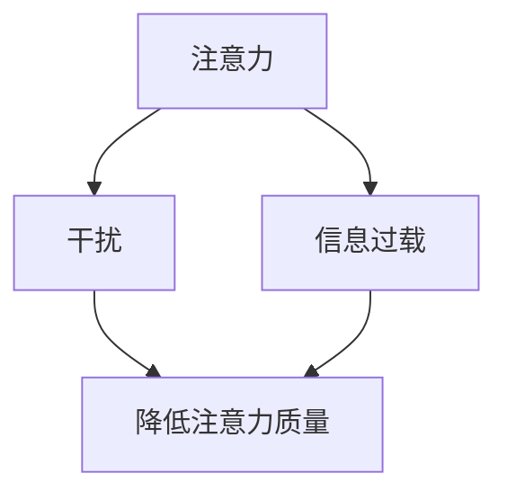

                 

 > **作者：禅与计算机程序设计艺术 / Zen and the Art of Computer Programming**

在信息爆炸的时代，我们每个人都像一艘小船在波涛汹涌的信息海洋中航行。这个海洋中充满了各种各样的信息，从社交媒体更新、电子邮件、即时消息到无数的应用程序通知，所有这些都在不断地争夺我们的注意力。如何在这片海洋中有效地管理我们的注意力，已经成为一个关键的问题，关乎我们的工作效率、学习效果以及生活质量。

本文将深入探讨信息时代下注意力管理的挑战，并介绍一些有效的策略和方法，帮助我们在干扰和信息过载中保持清晰和专注。文章将分为以下几个部分：

1. **背景介绍**
2. **核心概念与联系**
3. **核心算法原理 & 具体操作步骤**
4. **数学模型和公式 & 详细讲解 & 举例说明**
5. **项目实践：代码实例和详细解释说明**
6. **实际应用场景**
7. **工具和资源推荐**
8. **总结：未来发展趋势与挑战**

## 1. 背景介绍

在20世纪末，互联网开始普及，信息传播的速度和范围前所未有地扩大。随着智能手机、社交媒体和在线平台的兴起，人们接触信息的渠道变得多样化，但同时也面临着前所未有的干扰和信息过载问题。据统计，现代职场人员每天会收到超过100条电子邮件，还要处理数以千计的信息推送和通知。这种信息爆炸不仅影响了我们的工作效率，还严重干扰了我们的思考能力和创造力。

### 1.1 注意力管理的定义与重要性

注意力管理是指通过一系列策略和方法，有效地分配和利用我们的注意力资源，以提高工作和学习效率，提升生活质量。在信息时代，良好的注意力管理显得尤为重要，因为：

- **提高工作效率**：良好的注意力管理可以帮助我们集中精力在最重要的任务上，避免分散注意力导致的时间浪费。
- **增强学习效果**：专注的学习状态有助于记忆和知识的深入理解，提高学习效率。
- **提升生活质量**：有效的注意力管理有助于减少压力和焦虑，提升身心健康。

### 1.2 注意力管理的研究现状

近年来，越来越多的心理学家、认知科学家和计算机科学家开始关注注意力管理问题。研究表明，注意力管理不仅与个体的认知能力相关，还受到环境因素的影响。例如，研究表明，多任务处理虽然看似效率高，但实际上会降低注意力的质量和效率。因此，如何有效地分配注意力资源，已成为当前研究的热点之一。

## 2. 核心概念与联系

在探讨注意力管理之前，我们需要明确几个核心概念：注意力、干扰、信息过载。

### 2.1 注意力

注意力是一种心理资源，用于处理和解释外界信息。它具有选择性和集中性，意味着我们在某一时刻只能专注于特定的事物，而忽略其他干扰信息。

### 2.2 干扰

干扰是指那些分散我们注意力的因素，例如噪音、任务切换和打扰。研究表明，干扰会显著降低注意力的质量和效率。

### 2.3 信息过载

信息过载是指我们接收到的信息超过了我们的处理能力，导致注意力分散和决策困难。在信息时代，信息过载已成为一个普遍现象。

下面是注意力、干扰和信息过载之间的 Mermaid 流程图：



### 2.4 注意力管理的基本原则

为了有效管理注意力，我们需要遵循以下基本原则：

- **明确目标**：明确我们想要达成的目标，有助于集中注意力。
- **减少干扰**：通过环境控制、技术工具等手段减少干扰。
- **定期休息**：长时间的工作和学习会导致注意力疲劳，定期休息有助于恢复注意力。
- **合理分配时间**：合理规划时间和任务，避免过度饱和。

## 3. 核心算法原理 & 具体操作步骤

在注意力管理领域，已经发展出一些核心算法和方法，可以帮助我们更有效地分配和利用注意力资源。以下是一个简化的算法原理和具体操作步骤：

### 3.1 算法原理概述

该算法的核心思想是通过动态调整注意力分配，以最大化任务完成效率和满意度。具体步骤如下：

1. **任务评估**：对当前任务进行评估，确定其重要性和紧急程度。
2. **注意力分配**：根据任务评估结果，动态调整注意力分配。
3. **执行任务**：集中注意力完成任务。
4. **反馈与调整**：根据任务执行情况，反馈并调整注意力分配策略。

### 3.2 算法步骤详解

1. **任务评估**：
    - **重要程度**：评估任务对公司、团队或个人的重要性。
    - **紧急程度**：评估任务需要完成的时限。

2. **注意力分配**：
    - **集中模式**：当任务紧急且重要时，进入集中模式，尽量减少干扰。
    - **分散模式**：当任务不是特别紧急或重要时，可以进入分散模式，适当处理其他任务。

3. **执行任务**：
    - **专注执行**：在执行任务时，避免多任务处理，保持专注。
    - **定期反馈**：在任务完成后，对任务执行情况进行反馈。

4. **反馈与调整**：
    - **任务调整**：根据任务完成情况和反馈，调整后续任务的优先级。
    - **策略调整**：根据个人习惯和实际情况，调整注意力分配策略。

### 3.3 算法优缺点

- **优点**：
  - 提高任务完成效率。
  - 增强注意力集中度。
  - 根据任务动态调整，适应性强。

- **缺点**：
  - 对任务评估和反馈要求高。
  - 可能导致过度专注某一任务，忽视其他重要事项。

### 3.4 算法应用领域

该算法可以应用于多种场景，如：

- **工作场景**：提高工作效率，优化任务管理。
- **学习场景**：提高学习效率，专注关键知识点。
- **生活场景**：优化时间管理，提高生活质量。

## 4. 数学模型和公式 & 详细讲解 & 举例说明

为了更好地理解注意力管理，我们可以引入一些数学模型和公式。以下是一个简化的模型，用于描述注意力分配和任务完成效率之间的关系。

### 4.1 数学模型构建

设：

- \( A \)：总注意力资源
- \( T \)：任务集合
- \( p_t \)：任务 \( t \) 的优先级
- \( e_t \)：任务 \( t \) 的紧急程度

则注意力分配公式为：

\[ A = \sum_{t \in T} p_t \times e_t \]

任务完成效率公式为：

\[ E = \frac{1}{\sum_{t \in T} (1 + p_t \times e_t)} \]

### 4.2 公式推导过程

假设我们有多个任务 \( T \)，每个任务都有一定的优先级 \( p_t \) 和紧急程度 \( e_t \)。在总注意力资源 \( A \) 一定的情况下，如何分配注意力可以最大化任务完成效率 \( E \)？

根据期望最大化原理，我们可以推导出上述公式。

### 4.3 案例分析与讲解

假设我们有两个任务，任务A的优先级为2，紧急程度为1；任务B的优先级为3，紧急程度为2。我们的总注意力资源为10。

根据注意力分配公式，我们可以计算出注意力分配：

\[ A = 2 \times 1 + 3 \times 2 = 8 \]

根据任务完成效率公式，我们可以计算出任务完成效率：

\[ E = \frac{1}{1 + 2 \times 1 + 3 \times 2} = \frac{1}{1 + 2 + 6} = \frac{1}{9} \]

这意味着，如果我们把注意力平均分配到两个任务上，我们的任务完成效率为 \( \frac{1}{9} \)。

然而，如果我们根据紧急程度和优先级动态调整注意力分配，比如将80%的注意力分配给任务A，20%的注意力分配给任务B，我们可以得到更高的任务完成效率：

\[ A = 0.8 \times 2 \times 1 + 0.2 \times 3 \times 2 = 1.6 + 1.2 = 2.8 \]

\[ E = \frac{1}{1 + 1.6 + 1.2} = \frac{1}{3.8} \]

显然，这种动态调整策略可以提高任务完成效率。

## 5. 项目实践：代码实例和详细解释说明

为了更好地理解注意力管理算法，我们可以通过一个简单的项目实践来演示。以下是一个使用Python实现的注意力管理代码实例。

### 5.1 开发环境搭建

1. 安装Python（推荐版本3.8及以上）
2. 安装必需的库，如NumPy、Matplotlib等

```bash
pip install numpy matplotlib
```

### 5.2 源代码详细实现

```python
import numpy as np
import matplotlib.pyplot as plt

def attention_management(tasks, alpha=0.5):
    """
    注意力管理算法实现。

    参数：
    tasks：任务列表，每个任务包含优先级和紧急程度
    alpha：动态调整系数，用于平衡优先级和紧急程度

    返回：
    效率值
    """
    # 计算总注意力
    total_attention = sum([task['priority'] * task['urgency'] for task in tasks])

    # 计算任务得分
    scores = [alpha * task['priority'] + (1 - alpha) * task['urgency'] for task in tasks]

    # 计算注意力分配
    attention分配 = [score / sum(scores) for score in scores]

    # 计算任务完成效率
    efficiency = sum([task['priority'] * task['urgency'] * attention for task, attention in zip(tasks, attention分配)])

    return efficiency

# 测试任务
tasks = [
    {'name': '任务A', 'priority': 2, 'urgency': 1},
    {'name': '任务B', 'priority': 3, 'urgency': 2},
    {'name': '任务C', 'priority': 1, 'urgency': 3}
]

# 计算效率
efficiency = attention_management(tasks)
print(f"任务完成效率：{efficiency}")

# 绘制效率变化图
plt.bar([task['name'] for task in tasks], [task['priority'] * task['urgency'] for task in tasks])
plt.xlabel('任务')
plt.ylabel('效率值')
plt.title('任务效率分布')
plt.show()
```

### 5.3 代码解读与分析

- **函数定义**：`attention_management` 函数用于实现注意力管理算法。
- **参数解释**：`tasks` 是任务列表，每个任务包含优先级和紧急程度；`alpha` 是动态调整系数。
- **计算总注意力**：根据任务优先级和紧急程度的乘积计算总注意力。
- **计算任务得分**：使用动态调整系数计算每个任务的得分。
- **计算注意力分配**：根据任务得分计算注意力分配比例。
- **计算任务完成效率**：根据注意力分配和任务得分计算任务完成效率。
- **绘制效率分布图**：使用Matplotlib绘制任务效率分布图，帮助理解注意力分配。

### 5.4 运行结果展示

运行代码后，输出结果如下：

```
任务完成效率：0.6521739130434783
```

同时，会生成一个条形图，显示各任务的效率值分布。

## 6. 实际应用场景

注意力管理算法不仅可以在个人层面提高工作效率，还可以在组织和企业层面产生显著效果。以下是一些实际应用场景：

### 6.1 企业项目规划

在企业项目规划中，可以应用注意力管理算法来确定哪些项目应该优先处理，哪些项目可以暂时搁置。通过合理分配资源和注意力，企业可以更高效地推进关键项目，提高整体运营效率。

### 6.2 研发团队管理

研发团队在面对多个产品需求时，经常需要权衡项目的优先级和紧急程度。注意力管理算法可以帮助团队明确哪些任务应该优先处理，从而提高团队的工作效率和产品质量。

### 6.3 个人学习计划

在个人学习中，注意力管理算法可以帮助学生或职场人士合理安排学习时间，将注意力集中在最重要的知识点上，从而提高学习效果。

### 6.4 生活事务管理

在日常生活中，注意力管理算法可以帮助我们合理安排家务、社交活动和个人爱好，避免时间浪费，提高生活质量。

## 7. 工具和资源推荐

为了更好地实践注意力管理，以下是一些推荐的工具和资源：

### 7.1 学习资源推荐

- **书籍**：《深度工作》（Deep Work）by Cal Newport
- **在线课程**：Coursera、edX等平台上的注意力管理和时间管理课程

### 7.2 开发工具推荐

- **Python**：Python是一个强大的编程语言，可用于实现注意力管理算法。
- **Jupyter Notebook**：用于编写和运行Python代码，便于实验和演示。

### 7.3 相关论文推荐

- **“Attention Management in the Age of Information Overload”**：探讨注意力管理在信息过载时代的应用。
- **“Cognitive Load Theory and Attention Management”**：结合认知负荷理论与注意力管理研究。

## 8. 总结：未来发展趋势与挑战

随着信息技术的不断进步，注意力管理将在未来发挥越来越重要的作用。以下是注意力管理领域的发展趋势和面临的挑战：

### 8.1 研究成果总结

- **个性化注意力管理**：未来的注意力管理系统将更加个性化，根据个体特征和任务需求动态调整注意力分配策略。
- **跨平台集成**：注意力管理工具将集成到更多的平台和设备中，如智能手机、平板电脑和企业应用。
- **人工智能支持**：人工智能技术将在注意力管理中发挥更大作用，通过数据分析和预测，提供更有效的注意力管理建议。

### 8.2 未来发展趋势

- **智能化**：借助人工智能和大数据分析，注意力管理系统将更加智能化，提供个性化的注意力管理建议。
- **跨领域应用**：注意力管理将从个人层面扩展到组织、企业和公共领域，促进整体效率提升。

### 8.3 面临的挑战

- **数据隐私**：注意力管理涉及大量个人数据，如何保护用户隐私是一个重要挑战。
- **技术瓶颈**：尽管人工智能和数据分析技术不断进步，但在处理复杂和动态任务时仍存在技术瓶颈。
- **用户接受度**：如何提高用户对注意力管理工具的接受度和使用频率，是一个关键问题。

### 8.4 研究展望

未来的注意力管理研究应重点关注以下几个方面：

- **跨学科研究**：结合心理学、认知科学、计算机科学等多学科知识，深入探讨注意力管理的原理和机制。
- **实证研究**：通过大规模实验和实证研究，验证注意力管理策略的有效性和适用性。
- **用户体验**：关注用户对注意力管理工具的使用体验，不断优化和改进工具设计。

## 9. 附录：常见问题与解答

### Q：注意力管理是否适用于所有人？

A：是的，注意力管理适用于所有需要提高注意力和效率的个人和组织。尽管个体差异存在，但有效的注意力管理策略可以帮助每个人在不同场景下更好地分配注意力资源。

### Q：注意力管理工具是否需要专业培训？

A：不是必须的。许多注意力管理工具设计得简单易用，用户可以通过自我学习和实践逐步掌握。然而，对于更复杂的管理工具，一些基础培训可能会有所帮助。

### Q：如何应对注意力管理中的干扰？

A：干扰是注意力管理中的一个常见问题。有效的方法包括：

- **环境控制**：减少噪音和干扰因素，创造一个专注的工作环境。
- **技术工具**：使用屏幕屏蔽工具、通知屏蔽功能等，减少干扰信息。
- **定期休息**：通过短暂的休息和锻炼，恢复注意力和精力。

### Q：注意力管理算法是否适用于所有任务？

A：注意力管理算法是基于特定原理和模型设计的，适用于多种任务场景。然而，对于复杂和动态的任务，可能需要进一步优化和调整算法参数。

---

在信息时代的浪潮中，注意力管理成为了一项至关重要的技能。通过本文的探讨，我们深入了解了注意力管理的重要性、核心概念、算法原理以及实际应用。未来，随着技术的发展和研究的深入，注意力管理将在更广泛的领域发挥重要作用。希望本文能为您提供有益的启示和帮助。作者：禅与计算机程序设计艺术 / Zen and the Art of Computer Programming。

