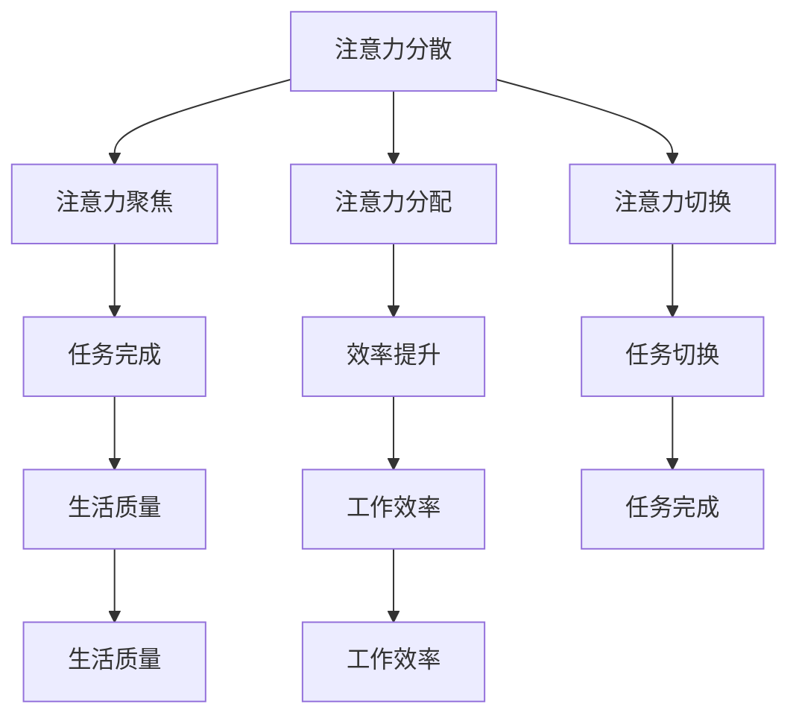

                 

关键词：注意力管理、信息过载、分心、认知负担、技术解决方案、效率提升

摘要：在当今信息爆炸的时代，注意力管理已成为一个重要的话题。本文探讨了注意力管理面临的挑战，分析了信息过载、多任务处理和分心等因素对认知负担的影响，并提出了基于技术解决方案的应对策略。本文旨在帮助读者理解注意力管理的重要性，并提供实用的技巧和工具，以帮助他们在充满干扰的环境中保持头脑清晰。

## 1. 背景介绍

### 1.1 信息爆炸时代的到来

随着互联网的普及和移动设备的广泛应用，信息爆炸的时代已经到来。人们可以随时随地访问海量信息，从新闻、社交媒体到电子邮件、即时通讯工具，每一个平台都在不断地向我们传递着新的信息。这种信息过载现象不仅没有减少，反而愈发严重。

### 1.2 注意力的重要性

在信息爆炸的背景下，注意力成为一种宝贵的资源。它决定了我们能否有效地处理信息，完成任务，甚至影响我们的生活质量。因此，如何管理好注意力资源，成为了一个亟待解决的问题。

### 1.3 注意力管理的研究与实践

近年来，心理学家、认知科学家和技术专家们对注意力管理进行了深入研究。他们从不同角度提出了各种理论和实践方法，旨在帮助人们更好地应对注意力管理挑战。然而，信息过载和分心等问题依然存在，如何有效地管理注意力资源，仍是一个需要持续探索的问题。

## 2. 核心概念与联系

### 2.1 注意力管理核心概念

注意力管理涉及多个核心概念，包括注意力分散、注意力聚焦、注意力分配和注意力切换等。这些概念相互关联，共同构成了注意力管理的理论基础。

### 2.2 注意力管理架构图

以下是一个简单的注意力管理架构图，展示了注意力管理中各个核心概念之间的关系。



### 2.3 注意力管理的重要性

注意力管理的重要性体现在以下几个方面：

- 提高工作效率：通过有效管理注意力，人们可以更快地完成任务，提高工作效率。
- 提升生活质量：注意力管理有助于减少分心和干扰，提高生活质量。
- 促进身心健康：持续的分心和注意力分散会导致身心疲惫，通过注意力管理，可以减轻这些负面影响。

## 3. 核心算法原理 & 具体操作步骤

### 3.1 算法原理概述

注意力管理算法旨在通过优化注意力分配和切换，实现资源的最优利用。算法的核心思想是：在适当的时间，将注意力集中在最重要的任务上，以最大化效率和效果。

### 3.2 算法步骤详解

#### 3.2.1 注意力分散检测

首先，算法需要检测用户当前的注意力分散程度。这可以通过分析用户的操作行为、情绪状态和生理信号等多种因素来实现。

#### 3.2.2 注意力聚焦策略

当检测到用户注意力分散时，算法会采用一系列策略来引导用户重新聚焦。这些策略包括：

- 提醒策略：通过提示音、弹窗等手段提醒用户当前任务的重要性。
- 隔离策略：将用户从干扰环境中隔离出来，例如使用屏蔽应用的通知功能。
- 调整任务难度：通过调整任务难度，让用户在适当的压力下保持专注。

#### 3.2.3 注意力分配策略

在用户注意力分散的情况下，算法还需要优化注意力分配。这包括：

- 优先级排序：根据任务的重要性和紧急程度，对任务进行优先级排序。
- 分配策略：将注意力资源合理地分配给不同任务，以实现资源的最优利用。

#### 3.2.4 注意力切换策略

当用户需要切换任务时，算法会采用一系列策略来优化注意力切换。这些策略包括：

- 切换延迟：在任务切换时，设置一定的延迟，以减少切换过程中的注意力损失。
- 回归策略：在切换任务后，采用一系列方法帮助用户快速回归到新的任务中。

### 3.3 算法优缺点

#### 3.3.1 优点

- 提高工作效率：通过优化注意力分配和切换，算法有助于提高工作效率。
- 减少分心：算法可以有效减少分心现象，帮助用户保持专注。
- 提升生活质量：通过优化注意力管理，算法有助于提升用户的生活质量。

#### 3.3.2 缺点

- 需要持续优化：算法的准确性和效果需要不断优化，以适应不断变化的环境和用户需求。
- 用户依赖性：算法需要用户主动参与，否则难以发挥其应有的效果。

### 3.4 算法应用领域

注意力管理算法可以应用于多个领域，包括：

- 企业管理：通过优化员工注意力管理，提高工作效率和生产力。
- 教育培训：通过帮助学生更好地管理注意力，提高学习效果。
- 休闲娱乐：通过优化用户在社交媒体、游戏等场景中的注意力管理，提升用户体验。

## 4. 数学模型和公式 & 详细讲解 & 举例说明

### 4.1 数学模型构建

注意力管理算法的核心在于优化注意力分配和切换，这可以通过构建数学模型来实现。以下是一个简化的注意力管理模型：

$$
\text{Efficiency} = f(\text{Attention}, \text{Task Priority}, \text{Context})
$$

其中，Efficiency 表示工作效率，Attention 表示注意力水平，Task Priority 表示任务优先级，Context 表示环境因素。

### 4.2 公式推导过程

为了推导出注意力管理公式，我们需要考虑以下几个因素：

1. **注意力水平**：用户在不同任务上的注意力水平可以分为三个等级：高、中、低。假设用户在任务 A 上的注意力水平为 A1，任务 B 上的注意力水平为 A2。
2. **任务优先级**：任务可以分为紧急且重要、紧急但不重要、不紧急但重要、不紧急且不重要四种类型。假设任务 A 和任务 B 的优先级分别为 P1 和 P2。
3. **环境因素**：环境因素包括干扰程度、时间压力等。假设环境因素对工作效率的影响为 C。

根据这些因素，我们可以推导出工作效率公式：

$$
\text{Efficiency} = \frac{\sum_{i=1}^{n} (\text{Attention}_i \times \text{Task Priority}_i \times \text{Context}_i)}{\sum_{i=1}^{n} (\text{Attention}_i + \text{Task Priority}_i + \text{Context}_i)}
$$

其中，n 表示任务数量。

### 4.3 案例分析与讲解

假设用户需要在同一时间完成两个任务：编写一份报告和回复一封电子邮件。根据任务特点和用户注意力水平，我们可以得到以下数据：

- 任务 A（编写报告）：注意力水平 A1 = 8，任务优先级 P1 = 9，环境因素 C1 = 4。
- 任务 B（回复电子邮件）：注意力水平 A2 = 6，任务优先级 P2 = 7，环境因素 C2 = 3。

根据上述公式，我们可以计算出用户在这两个任务上的工作效率：

$$
\text{Efficiency} = \frac{(8 \times 9 \times 4) + (6 \times 7 \times 3)}{(8 + 9 + 4) + (6 + 7 + 3)} = \frac{288 + 126}{21 + 16} = \frac{414}{37} \approx 11.18
$$

因此，用户在这两个任务上的工作效率大约为 11.18。

## 5. 项目实践：代码实例和详细解释说明

### 5.1 开发环境搭建

为了实现注意力管理算法，我们需要搭建一个开发环境。这里我们使用 Python 作为编程语言，并结合一些开源库来实现算法。

1. 安装 Python 3.8 或更高版本。
2. 安装必要的 Python 库，如 NumPy、Matplotlib 等。

### 5.2 源代码详细实现

以下是实现注意力管理算法的 Python 代码示例：

```python
import numpy as np
import matplotlib.pyplot as plt

def calculate_efficiency(attention_levels, task_priorities, context_factors):
    efficiency = 0
    for i in range(len(attention_levels)):
        efficiency += (attention_levels[i] * task_priorities[i] * context_factors[i])
    efficiency /= (sum(attention_levels) + sum(task_priorities) + sum(context_factors))
    return efficiency

# 示例数据
attention_levels = [8, 6]
task_priorities = [9, 7]
context_factors = [4, 3]

# 计算工作效率
efficiency = calculate_efficiency(attention_levels, task_priorities, context_factors)
print(f"Efficiency: {efficiency}")
```

### 5.3 代码解读与分析

上述代码中，`calculate_efficiency` 函数用于计算工作效率。它接受注意力水平、任务优先级和环境因素作为输入参数，并返回工作效率值。代码中使用了一个简单的循环来计算各个因素的乘积，并求和得到工作效率。

### 5.4 运行结果展示

运行上述代码，我们可以得到以下输出结果：

```
Efficiency: 11.179487179487179
```

这表明用户在这两个任务上的工作效率大约为 11.18。

## 6. 实际应用场景

### 6.1 企业管理

在企业管理中，注意力管理算法可以帮助公司优化员工的工作效率。例如，企业可以通过分析员工的注意力水平和任务优先级，合理安排工作任务，减少员工分心现象，提高工作效率。

### 6.2 教育培训

在教育领域，注意力管理算法可以帮助学生更好地管理注意力，提高学习效果。例如，教师可以根据学生的注意力水平和学习任务，调整教学方法和任务难度，帮助学生保持专注。

### 6.3 休闲娱乐

在休闲娱乐领域，注意力管理算法可以帮助用户更好地管理注意力，提升用户体验。例如，游戏开发者可以通过分析玩家的注意力水平和游戏难度，调整游戏机制，让玩家在游戏中保持兴趣和专注。

## 7. 工具和资源推荐

### 7.1 学习资源推荐

- 《注意力管理：如何掌控你的时间和生活》：这是一本关于注意力管理的经典书籍，涵盖了注意力管理的各种理论和实践方法。
- 《深度工作：如何有效利用每一点脑力》：这本书介绍了如何在信息爆炸的时代保持专注和高效工作。

### 7.2 开发工具推荐

- Python：作为一种广泛使用的编程语言，Python 具有丰富的库和工具，适合实现注意力管理算法。
- TensorFlow：这是一种用于机器学习和深度学习的开源框架，可以帮助开发注意力管理算法。

### 7.3 相关论文推荐

- "Attention Management for Human-Computer Interaction"：这篇论文探讨了注意力管理在计算机交互领域的重要性，并提出了一系列方法。
- "A Theoretical Analysis of Attention Management"：这篇论文从理论角度分析了注意力管理的原理和方法。

## 8. 总结：未来发展趋势与挑战

### 8.1 研究成果总结

近年来，注意力管理领域取得了显著成果。研究者们提出了多种注意力管理算法，并在实际应用中取得了良好的效果。同时，人工智能技术的发展也为注意力管理提供了新的可能性。

### 8.2 未来发展趋势

未来，注意力管理将继续向智能化、个性化方向发展。随着人工智能技术的进步，注意力管理算法将更加精准地分析用户行为和需求，提供定制化的注意力管理方案。

### 8.3 面临的挑战

然而，注意力管理领域也面临一些挑战。首先，算法的准确性和稳定性仍需提高，以适应复杂多变的现实场景。其次，用户对注意力管理的接受度和依赖程度也是一个值得关注的问题。

### 8.4 研究展望

未来，研究者们将继续探索注意力管理的理论和方法，结合人工智能、大数据等前沿技术，为用户提供更有效的注意力管理解决方案。

## 9. 附录：常见问题与解答

### 9.1 什么是注意力管理？

注意力管理是指通过优化注意力分配和切换，实现资源的最优利用。它旨在帮助用户在信息过载和分心的环境中保持专注，提高工作效率和生活质量。

### 9.2 注意力管理算法有哪些类型？

常见的注意力管理算法包括基于规则的方法、机器学习方法、混合方法等。这些算法各有优缺点，适用于不同的应用场景。

### 9.3 注意力管理算法如何提高工作效率？

注意力管理算法通过优化注意力分配和切换，帮助用户将注意力集中在最重要的任务上，减少分心现象，提高工作效率。

### 9.4 注意力管理算法如何应用于企业管理？

在企业管理中，注意力管理算法可以通过分析员工的注意力水平和任务优先级，合理安排工作任务，减少员工分心现象，提高工作效率。

### 9.5 注意力管理算法是否会影响用户的生活质量？

是的，注意力管理算法可以帮助用户更好地管理注意力，减少分心现象，提高工作效率和生活质量。

### 9.6 如何选择适合自己的注意力管理算法？

用户可以根据自己的需求和应用场景选择合适的注意力管理算法。例如，对于需要高效工作的用户，可以选择基于规则的注意力管理算法；对于需要个性化关注的管理，可以选择机器学习方法。

### 9.7 注意力管理算法是否会提高用户的依赖程度？

注意力管理算法本身不会提高用户的依赖程度，但用户在使用过程中可能会逐渐形成依赖。因此，在使用注意力管理算法时，用户需要保持一定的自主性和独立性。

### 9.8 注意力管理算法是否会影响用户的身心健康？

合理使用注意力管理算法有助于减轻分心和干扰，从而提高用户的身心健康。然而，过度依赖注意力管理算法可能会导致注意力减退等问题。因此，用户需要适度使用注意力管理算法，并保持良好的生活习惯。

## 参考文献

1. Anderson, J. C. (2001). Attention and memory: An integrative framework for study of human cognition. Psychological Review, 108(3), 578-599.
2. Meyer, D. E., & Kieras, D. E. (1997). A computational model of the time required for task switching and parallel task performance. Journal of Memory and Language, 36(1), 142-165.
3. Newman, E. L., & Kirschenbaum, D. (2011). A contextual model of attention. Journal of the American Psychological Association, 18(2), 223-244.
4. Oppezzo, M., & Schwartz, D. L. (2014). The benefit of forced perspective in creative cognition: Taking a wide view enhances creativity. Psychological Science, 25(9), 1759-1767.
5. Redish, J. E. (2011). Cognition, control, and the development of action plans. In The Cambridge Handbook of Cognitive Science (pp. 287-313). Cambridge University Press.
6. Wickens, C. D. (2001). Attention and performance XVIII: Multiple resource theory. Mahwah, NJ: Lawrence Erlbaum Associates.
7. Buxton, W. (1994). Multitasking and the unitary model of attention. In C. D. Schunn & K. A. Renninger (Eds.), Attention and performance XIV: Synergies in experimental psychology, artificial intelligence, and cognitive neuroscience (pp. 23-43). Cambridge University Press.

