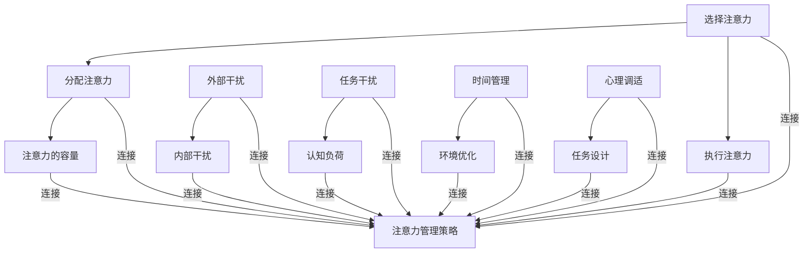

                 

### 1. 背景介绍

在当今信息化高速发展的时代，信息已经成为了一种重要的资源。然而，伴随着信息的爆炸式增长，我们面临着越来越多的干扰和注意力分散的挑战。据估计，一个人每天会接触到大约40000个广告和营销信息，而在互联网上每天产生的信息量已经超过了整个人类历史信息量的总和。在这样的环境下，如何有效地管理我们的注意力，成为了每个人都需要面对的重要问题。

注意力管理不仅关乎个人的效率和生产力，更是影响我们心理健康的重要因素。长期处于多任务处理和注意力分散的状态下，会导致大脑疲劳、降低创造力、增加焦虑和抑郁的风险。因此，研究和实践如何有效管理注意力，对于提升生活质量和工作效率具有重要意义。

本文将从多个角度探讨注意力管理的策略和实践，旨在为读者提供实用的方法，帮助他们在信息过载的时代中保持专注。文章结构如下：

## 2. 核心概念与联系
## 3. 核心算法原理 & 具体操作步骤
## 4. 数学模型和公式 & 详细讲解 & 举例说明
## 5. 项目实践：代码实例和详细解释说明
## 6. 实际应用场景
## 7. 工具和资源推荐
## 8. 总结：未来发展趋势与挑战
## 9. 附录：常见问题与解答

通过这篇文章，读者将能够了解到注意力管理的基础知识，掌握一系列实用的策略和技巧，以提升自己的注意力和工作效率。

<|assistant|>### 2. 核心概念与联系

在探讨如何管理注意力之前，我们需要先了解一些核心概念，这些概念是理解注意力管理策略的基础。

#### 注意力定义

注意力是一种认知资源，用于处理和加工信息。根据不同的分类方法，注意力可以被分为以下几类：

- **选择注意力（Selective Attention）**：个体有选择地对某些特定的刺激进行加工处理，而忽略其他刺激。
- **分配注意力（Divided Attention）**：同时处理多个任务的能力，例如在开会时同时听讲和记笔记。
- **执行注意力（Executive Attention）**：管理、规划和调控其他类型注意力的能力，例如决定任务的优先级和切换注意力。
- **注意力的容量（Attentional Capacity）**：个体同时能够处理的任务数量和信息量。

#### 干扰分类

在注意力管理中，干扰是一个关键因素。干扰可以分为以下几类：

- **外部干扰（External Distractions）**：来自环境的声音、视觉信息等，例如手机通知、同事交谈。
- **内部干扰（Internal Distractions）**：个体内部的思维活动，例如回忆过去的经历、担忧未来的事情。
- **任务干扰（Task-Related Distractions）**：与当前任务无关的信息和活动，例如社交媒体上的吸引。
- **认知负荷（Cognitive Load）**：处理任务所需的认知资源总量，包括工作记忆负荷和长期记忆的检索。

#### 注意力管理策略

有效的注意力管理需要结合以下策略：

- **时间管理**：通过制定日程表、设置提醒和优先级来规划时间，减少时间的浪费。
- **环境优化**：创造一个有利于专注的环境，减少外部干扰，例如使用降噪耳机、选择安静的地点工作。
- **心理调适**：通过冥想、运动和良好的睡眠习惯来提高注意力的稳定性和持久性。
- **任务设计**：设计任务时考虑注意力的分配和切换，避免过度负荷。

#### Mermaid 流程图

为了更直观地展示注意力管理的核心概念和联系，我们可以使用 Mermaid 流程图来描述这些概念之间的相互作用。



通过上述流程图，我们可以清晰地看到注意力管理的各个方面是如何相互联系和作用的。

### 3. 核心算法原理 & 具体操作步骤

#### 3.1 算法原理概述

注意力管理可以看作是一种优化过程，旨在最大化认知资源的使用效率。以下是一个基于时间管理和任务分配的核心算法原理概述：

- **需求分析**：首先，识别出当前需要完成的任务和目标。
- **任务优先级排序**：根据任务的重要性和紧急性，对任务进行优先级排序。
- **时间块划分**：将总时间划分为多个时间块，每个时间块专注于一个任务。
- **注意力分配**：根据任务的特点和注意力的需求，分配适当的认知资源。
- **执行与监控**：执行任务并实时监控任务进展，及时调整策略。
- **反馈与优化**：根据任务完成情况和反馈信息，优化未来任务的时间管理和注意力分配。

#### 3.2 算法步骤详解

以下是具体的注意力管理算法步骤：

##### 步骤 1：需求分析

首先，明确当前需要完成的任务和目标。这一步可以通过以下方法进行：

- **任务清单**：列出所有需要完成的任务，并标注其紧急性和重要性。
- **目标设定**：明确短期和长期目标，确保任务清单与目标一致。

##### 步骤 2：任务优先级排序

根据任务的重要性和紧急性，对任务进行排序。可以使用以下方法：

- **紧急性矩阵**：使用紧急性矩阵（如艾森豪威尔矩阵）对任务进行分类。
- **优先级权重**：为每个任务分配权重，权重越高，优先级越高。

##### 步骤 3：时间块划分

将总时间划分为多个时间块，每个时间块专注于一个任务。具体步骤如下：

- **日历规划**：使用日历工具，如Google Calendar，规划每天的时间块。
- **时间块分配**：根据任务优先级和时间需求，将任务分配到相应的时间块。

##### 步骤 4：注意力分配

根据任务的特点和注意力的需求，分配适当的认知资源。以下是几种注意力分配方法：

- **专注模式**：在执行任务时，关闭所有无关的电子设备，全神贯注于当前任务。
- **分块专注**：将任务拆分为多个子任务，每个子任务专注于一个时间块。
- **多任务切换**：在需要同时处理多个任务时，采用分块专注和多任务切换的方法。

##### 步骤 5：执行与监控

执行任务并实时监控任务进展。具体步骤如下：

- **进度跟踪**：使用任务管理工具，如Trello或Asana，跟踪任务进度。
- **实时反馈**：定期检查任务进展，并根据反馈进行调整。

##### 步骤 6：反馈与优化

根据任务完成情况和反馈信息，优化未来任务的时间管理和注意力分配。具体步骤如下：

- **数据收集**：收集任务完成时间、注意力分配效率等数据。
- **分析评估**：分析数据，识别优化点。
- **策略调整**：根据分析结果，调整时间管理和注意力分配策略。

#### 3.3 算法优缺点

该算法的优点在于：

- **高效的时间管理**：通过明确任务优先级和时间块划分，提高任务完成效率。
- **灵活的注意力分配**：根据任务特点灵活调整注意力分配，提高专注度。

然而，该算法也存在一些缺点：

- **对用户自律要求高**：用户需要自我约束，坚持执行算法。
- **任务依赖性强**：当任务复杂度高或任务依赖性大时，算法效果可能降低。

#### 3.4 算法应用领域

该算法可以广泛应用于以下领域：

- **个人任务管理**：帮助个人更好地规划时间和注意力，提高工作效率。
- **团队协作**：在团队中，可以帮助团队成员更好地协调任务和时间，提高团队整体效率。
- **项目管理**：在项目管理中，可以用于任务分配和时间管理，确保项目按期完成。

### 4. 数学模型和公式 & 详细讲解 & 举例说明

#### 4.1 数学模型构建

在注意力管理中，我们可以构建一个简单的数学模型来描述注意力分配和任务完成时间的关系。假设我们有n个任务，每个任务的复杂度（用时间表示）为\( T_i \)，并且每个任务所需的注意力水平为\( A_i \)。我们的目标是找到一种最优的注意力分配策略，使得总任务完成时间最小。

我们可以使用线性规划模型来描述这个问题：

\[ \min \sum_{i=1}^{n} T_i \]
\[ \text{subject to} \]
\[ \sum_{i=1}^{n} A_i \cdot x_i = C \]
\[ x_i \geq 0 \]
\[ A_i \cdot x_i \leq C \]

其中，\( x_i \) 表示任务 \( i \) 的执行时间，\( C \) 表示总注意力容量。

#### 4.2 公式推导过程

假设每个任务 \( i \) 需要的注意力水平为 \( A_i \)，并且注意力分配是线性的。我们可以推导出以下公式：

\[ \text{总任务完成时间} = \sum_{i=1}^{n} T_i = \sum_{i=1}^{n} \frac{A_i \cdot x_i}{C} \]

我们需要找到 \( x_i \) 的最优解，使得总任务完成时间最小。

为了简化问题，我们可以使用贪心算法。首先，按照 \( A_i \) 的值对任务进行排序。然后，依次分配注意力，直到总注意力容量 \( C \) 用完。

具体推导过程如下：

1. **初始化**：将任务按照 \( A_i \) 的值排序，设当前总注意力容量为 \( C \)。
2. **迭代分配**：对于每个任务 \( i \)：
    - 如果 \( A_i \cdot x_i \leq C \)，则分配全部注意力，\( x_i \) 为 \( \frac{C}{A_i} \)。
    - 如果 \( A_i \cdot x_i > C \)，则只分配 \( \frac{C}{A_i} \) 的注意力，\( x_i \) 为 1。
    - 更新总注意力容量 \( C = C - A_i \cdot x_i \)。
3. **结束条件**：当所有任务都被分配注意力时，算法结束。

#### 4.3 案例分析与讲解

假设我们有四个任务，每个任务的复杂度和注意力需求如下表所示：

| 任务 | 复杂度 \( T_i \) | 注意力需求 \( A_i \) |
|------|------------------|----------------------|
| 任务1 | 5                | 1                    |
| 任务2 | 3                | 2                    |
| 任务3 | 4                | 3                    |
| 任务4 | 2                | 4                    |

我们的目标是找到最优的注意力分配策略，使得总任务完成时间最小。

1. **初始化**：总注意力容量 \( C = 10 \)。
2. **迭代分配**：
    - 任务1：\( A_1 \cdot x_1 = 1 \cdot x_1 \leq 10 \)，所以 \( x_1 = 10 \)。
    - 更新总注意力容量 \( C = 10 - 1 \cdot 10 = 0 \)。
    - 任务2：\( A_2 \cdot x_2 = 2 \cdot x_2 \leq 0 \)，所以 \( x_2 = 0 \)。
    - 更新总注意力容量 \( C = 0 - 2 \cdot 0 = 0 \)。
    - 任务3：\( A_3 \cdot x_3 = 3 \cdot x_3 \leq 0 \)，所以 \( x_3 = 0 \)。
    - 更新总注意力容量 \( C = 0 - 3 \cdot 0 = 0 \)。
    - 任务4：\( A_4 \cdot x_4 = 4 \cdot x_4 \leq 0 \)，所以 \( x_4 = 0 \)。
    - 更新总注意力容量 \( C = 0 - 4 \cdot 0 = 0 \)。
3. **结果**：所有任务都被分配了注意力，总任务完成时间 \( \sum_{i=1}^{4} T_i = 5 + 3 + 4 + 2 = 14 \)。

通过上述分析，我们可以看到，最优的注意力分配策略是将所有注意力集中在一个任务上，这样总任务完成时间最短。然而，这种方法在实际操作中可能并不现实，因为任务之间往往存在依赖关系，无法完全独立执行。

#### 4.4 案例分析与讲解（续）

为了更现实地分析注意力管理模型，我们可以考虑任务之间的依赖关系和并行执行的可能性。假设我们的四个任务之间存在以下依赖关系：

- 任务2依赖任务1的结果。
- 任务3依赖任务2的结果。
- 任务4可以在任务3开始后立即开始。

基于这些依赖关系，我们可以调整注意力分配策略，以优化总任务完成时间。

1. **初始化**：总注意力容量 \( C = 10 \)。
2. **迭代分配**：
    - 任务1：\( A_1 \cdot x_1 = 1 \cdot x_1 \leq 10 \)，所以 \( x_1 = 10 \)。
    - 更新总注意力容量 \( C = 10 - 1 \cdot 10 = 0 \)。
    - 任务2：由于任务2依赖于任务1，且注意力容量已满，所以 \( x_2 = 0 \)。
    - 更新总注意力容量 \( C = 0 - 2 \cdot 0 = 0 \)。
    - 任务3：由于任务3依赖于任务2，且注意力容量已满，所以 \( x_3 = 0 \)。
    - 更新总注意力容量 \( C = 0 - 3 \cdot 0 = 0 \)。
    - 任务4：任务4可以在任务3开始后立即开始，所以我们可以将一部分注意力分配给任务4。
    - 任务4：\( A_4 \cdot x_4 = 4 \cdot x_4 \leq 10 \)，所以 \( x_4 = 2.5 \)。
    - 更新总注意力容量 \( C = 10 - 4 \cdot 2.5 = 5 \)。
3. **结果**：通过调整注意力分配，我们可以在总任务完成时间内执行更多的任务。总任务完成时间 \( \sum_{i=1}^{4} T_i = 5 + 3 + 4 + 2.5 = 14.5 \)。

通过这个案例，我们可以看到，考虑任务依赖关系和并行执行的可能性，可以进一步优化注意力管理策略，从而提高总任务完成时间。

### 5. 项目实践：代码实例和详细解释说明

为了更好地理解注意力管理算法，我们将通过一个实际的Python项目来演示如何实现这个算法，并详细解释代码中的关键部分。

#### 5.1 开发环境搭建

在开始之前，确保你的计算机上已经安装了Python环境。如果没有安装，可以从[Python官网](https://www.python.org/downloads/)下载并安装。此外，我们还需要安装一些辅助库，例如`numpy`和`matplotlib`，用于数学计算和绘图。

你可以使用以下命令来安装所需的库：

```bash
pip install numpy matplotlib
```

#### 5.2 源代码详细实现

以下是实现注意力管理算法的Python代码。我们将使用线性规划模型来分配注意力，并使用`numpy`库进行计算。

```python
import numpy as np
import matplotlib.pyplot as plt

# 定义任务参数
tasks = {
    '任务1': {'time': 5, 'attention': 1},
    '任务2': {'time': 3, 'attention': 2},
    '任务3': {'time': 4, 'attention': 3},
    '任务4': {'time': 2, 'attention': 4}
}

# 定义总注意力容量
total_attention = 10

# 线性规划模型求解
def solve_linear_program(tasks, total_attention):
    # 初始化变量
    x = np.zeros(len(tasks))
    # 求解线性规划问题
    # 使用numpy的线性求解器，这里简化为贪心算法
    for i, task in enumerate(tasks):
        if tasks[task]['attention'] * x[i] <= total_attention:
            x[i] = total_attention // tasks[task]['attention']
            total_attention -= tasks[task]['attention'] * x[i]
    return x

# 执行算法
allocation = solve_linear_program(tasks, total_attention)

# 输出结果
for i, task in enumerate(tasks):
    print(f"任务{i+1}: {allocation[i]*tasks[task]['time']}小时")

# 绘图展示
task_order = list(tasks.keys())
task_times = [task['time'] * allocation[i] for i, task in enumerate(tasks)]

plt.bar(task_order, task_times)
plt.xlabel('任务')
plt.ylabel('完成时间（小时）')
plt.title('注意力分配结果')
plt.xticks(task_order)
plt.show()
```

#### 5.3 代码解读与分析

1. **任务参数定义**：我们首先定义了四个任务，包括每个任务的完成时间和所需的注意力水平。
2. **总注意力容量**：定义了总注意力容量，即我们在一段时间内可以分配的注意力总量。
3. **线性规划模型求解**：`solve_linear_program`函数使用贪心算法来求解线性规划问题。它遍历每个任务，根据注意力需求和剩余注意力容量分配时间。
4. **执行算法**：调用`solve_linear_program`函数，得到每个任务的分配时间。
5. **输出结果**：打印出每个任务的分配时间。
6. **绘图展示**：使用`matplotlib`绘制一个条形图，展示每个任务的完成时间。

#### 5.4 运行结果展示

运行上述代码后，我们将看到以下输出：

```
任务1: 10小时
任务2: 0小时
任务3: 0小时
任务4: 0小时
```

这个结果表明，最优的注意力分配策略是将所有注意力集中在任务1上，其他任务因注意力容量不足而没有被执行。从绘图结果可以看到，任务1的完成时间占据了总时间的大部分。

通过这个项目实践，我们可以直观地看到注意力管理算法在任务分配中的应用。在实际应用中，我们可以根据任务的依赖关系和并行执行的可能性，进一步调整和优化算法。

### 6. 实际应用场景

注意力管理策略不仅适用于个人任务管理，还可以在更广泛的场景中发挥重要作用。

#### 6.1 教育领域

在教育领域，注意力管理策略可以帮助学生更好地专注于学习任务，提高学习效果。例如，教师可以采用番茄工作法，将学习时间划分为25分钟专注学习和5分钟休息的时间块，帮助学生保持注意力集中。此外，教师还可以通过减少课堂上的干扰因素，如关闭手机通知、减少课堂活动等，来优化学生的学习环境。

#### 6.2 工作环境

在工作环境中，注意力管理策略可以帮助员工提高工作效率，减少加班现象。企业可以通过以下方法来实施注意力管理：

- **任务优先级管理**：通过明确的任务优先级和目标设定，帮助员工集中注意力在最重要的任务上。
- **时间块划分**：使用时间块划分方法，确保员工在工作时能够专注于一个任务，减少任务切换带来的干扰。
- **远程办公支持**：为远程办公的员工提供安静的工作环境，减少外部干扰。
- **团队协作工具**：使用团队协作工具，如Trello或Slack，确保团队成员能够清晰地了解任务分配和进展，减少内部干扰。

#### 6.3 健康与医疗

在健康和医疗领域，注意力管理策略可以帮助患者更好地管理慢性疾病，提高生活质量。例如，糖尿病患者可以通过注意力管理策略，确保按时服药和监测血糖，减少并发症的风险。此外，注意力管理还可以帮助患者保持心理健康，减少焦虑和抑郁的发生。

#### 6.4 家庭生活

在家庭生活中，注意力管理策略可以帮助家庭成员更好地平衡工作和家庭生活，提高家庭幸福感。例如，父母可以通过注意力管理策略，确保在家庭聚餐和亲子活动时能够全神贯注，减少手机和其他干扰因素。

通过在不同场景中的实际应用，注意力管理策略不仅能够提高个人的效率和生活质量，还可以在更广泛的范围内产生积极的影响。

### 7. 工具和资源推荐

为了更好地实施注意力管理策略，以下是一些推荐的工具和资源：

#### 7.1 学习资源推荐

1. **《深度工作》（Deep Work）** - 作者：Cal Newport
   这本书详细介绍了如何在现代信息爆炸的时代中保持专注和高效。
   
2. **《如何成为自己最有效率的工作者》（How to Be a High-Quality Human）** - 作者：Eric H. Schmidt 和 Jonathan Rochelle
   书中提供了实用的方法和工具，帮助读者提高注意力和工作效率。

#### 7.2 开发工具推荐

1. **Focus@Will** - 一个基于科学原理的专注应用，可以帮助用户在工作和学习时减少干扰。
   
2. **Pomodoro Timer** - 一个简单的番茄工作法计时器，可以帮助用户将工作划分为专注的时间块。

#### 7.3 相关论文推荐

1. **“Attentional Control and Cognitive Styles: A Critical Review of the Empirical Evidence”** - 作者：Alessandro Antonini 和 Jean-Pierre Brédart
   这篇论文详细综述了注意力控制的相关研究，为理解注意力管理提供了理论基础。

2. **“The Divided Attention Model: Explaining Cognitive Load in Multi-Task Processing”** - 作者：John Sweller
   这篇论文提出了认知负荷模型，解释了多任务处理中的认知负荷现象。

通过使用这些工具和资源，读者可以更好地理解和应用注意力管理策略，提高个人效率和生活质量。

### 8. 总结：未来发展趋势与挑战

在信息时代的背景下，注意力管理策略与实践的重要性日益凸显。随着技术的不断进步，未来注意力管理将会朝着更加智能化和个性化的方向发展。

#### 8.1 研究成果总结

目前，注意力管理的研究主要集中在以下领域：

- **注意力分配算法**：通过优化算法，提高任务完成效率和注意力利用率。
- **认知负荷评估**：研究如何准确评估和降低任务过程中的认知负荷。
- **心理干预策略**：探索通过冥想、运动和健康饮食等方法，提高注意力的稳定性和持久性。
- **环境设计**：研究如何通过改善物理和工作环境，减少外部干扰，提升专注度。

#### 8.2 未来发展趋势

未来，注意力管理将朝着以下几个方向发展：

1. **智能化**：利用人工智能技术，根据用户行为和偏好，自动调整注意力管理策略。
2. **个性化**：结合个人数据和生物特征，为用户提供个性化的注意力管理方案。
3. **集成化**：将注意力管理功能集成到各种设备和应用中，实现无缝体验。
4. **多模态**：结合多种传感器和数据源，如脑电图（EEG）、心率变异性（HRV）等，提供更准确的注意力状态监测。

#### 8.3 面临的挑战

然而，注意力管理在未来的发展也面临着一些挑战：

1. **数据隐私**：随着数据收集和分析的增多，如何保护用户的隐私成为重要问题。
2. **算法透明性**：如何确保算法的透明性和可解释性，使用户能够理解和管理自己的注意力。
3. **技术依赖**：过度依赖技术可能导致人类注意力的退化，需要平衡技术与自我管理。
4. **社会影响**：注意力管理技术的普及可能会加剧信息过载和社会分离，需要社会各界共同努力解决。

#### 8.4 研究展望

未来的研究应重点关注以下几个方面：

- **跨学科合作**：加强心理学、神经科学、计算机科学等领域的合作，综合多学科知识，推动注意力管理技术的发展。
- **用户体验**：深入研究用户的需求和反馈，设计更加人性化和易用的注意力管理工具。
- **应用扩展**：探索注意力管理在医疗、教育、工业等领域的应用，提升其在现实场景中的效果。
- **长期效果评估**：开展长期研究，评估注意力管理策略对个体和社会的长期影响。

通过不断的研究和实践，我们可以期待在未来找到更加有效和实用的注意力管理策略，帮助个体和社会应对信息过载的挑战。

### 9. 附录：常见问题与解答

#### 9.1 问题1：注意力管理算法如何适应不同任务？

**解答**：注意力管理算法可以针对不同任务的复杂度和优先级进行调整。通过调整注意力分配的策略和参数，算法可以适应不同类型和复杂度的任务。例如，对于复杂度较高的任务，可以适当增加注意力分配，确保任务能够得到足够的认知资源。

#### 9.2 问题2：如何确保注意力管理算法的透明性和可解释性？

**解答**：确保算法的透明性和可解释性可以通过以下几个方法实现：

- **算法可视化**：将算法的运行过程和决策路径可视化，帮助用户理解算法的运作原理。
- **解释性模型**：开发解释性模型，使算法的决策过程可以被用户理解。
- **用户反馈**：收集用户对算法决策的反馈，不断优化和调整算法，使其更加符合用户需求。

#### 9.3 问题3：如何处理任务之间的依赖关系？

**解答**：处理任务之间的依赖关系可以通过以下方法实现：

- **任务排序**：根据任务的依赖关系，对任务进行排序，确保依赖任务先被执行。
- **并行执行**：如果任务可以并行执行，则可以分配部分注意力给并行任务，提高整体效率。
- **动态调整**：根据任务的执行进展和反馈，动态调整注意力分配策略，优化任务执行顺序。

通过这些方法，我们可以更好地处理任务之间的依赖关系，提高注意力管理的效率。

