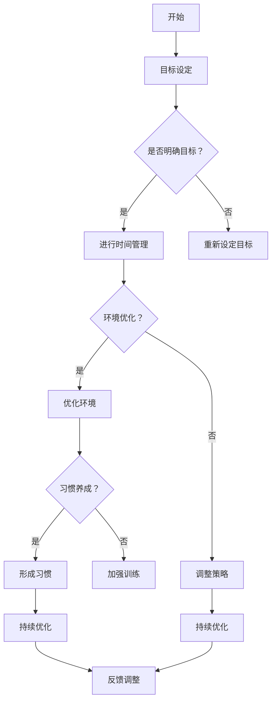

                 

在当今这个信息爆炸的时代，注意力管理成为了一个至关重要的课题。互联网的飞速发展，使我们能够迅速获取大量的信息，但同时也面临着信息过载和干扰的挑战。如何在这片信息海洋中航行，保持高效的注意力管理，成为了现代人在信息时代中必须面对的问题。本文将探讨注意力管理的重要性，介绍一系列策略和实践，帮助读者在干扰和信息过载的环境中，更好地管理和利用自己的注意力资源。

## 1. 背景介绍

随着互联网的普及和移动设备的广泛应用，信息的获取变得越来越便捷。然而，这种便利性也带来了新的挑战。一方面，我们每天被大量的信息所包围，从社交媒体到电子邮件，从新闻资讯到广告推送，信息过载成为了常见现象。另一方面，各种外部干扰也在不断消耗我们的注意力资源，从电话铃声到短信提醒，从社交网络的即时消息到突发的噪音，这些都可能打断我们的工作或学习流程。

注意力管理的重要性在于，它能够帮助我们更好地集中精力，提高工作效率，减少错误率，增强学习效果。在信息过载和干扰的环境中，有效的注意力管理策略不仅能够帮助我们更好地应对挑战，还能提升我们的生活质量和幸福感。因此，了解和掌握注意力管理的策略与实践，对于现代人来说具有重要意义。

## 2. 核心概念与联系

### 2.1 注意力管理的基本概念

注意力管理是指通过一系列策略和实践，有效地控制和管理个体在完成任务时所使用的注意力资源。注意力资源是一种有限的资源，它决定了我们在执行任务时的效率和质量。因此，如何有效地管理和利用注意力资源，成为了提高工作效率和效果的关键。

### 2.2 注意力资源的分配与分配原则

注意力资源的分配原则主要包括以下几点：

- **优先级原则**：根据任务的紧急程度和重要性，优先分配注意力资源给更重要的任务。
- **持续性原则**：保持注意力的连续性，避免频繁切换任务，减少注意力资源的消耗。
- **适应原则**：根据任务的复杂程度和难度，灵活调整注意力资源的分配。
- **平衡原则**：在分配注意力资源时，考虑任务的多样性和平衡性，避免过度集中或分散。

### 2.3 注意力管理策略

注意力管理的策略主要包括以下几个方面：

- **目标设定**：明确任务的目标和期望结果，有助于提高注意力集中度。
- **时间管理**：合理安排工作时间，避免过度工作和疲劳，确保注意力资源的高效利用。
- **环境优化**：创造一个有利于注意力集中的工作或学习环境，减少干扰因素。
- **习惯养成**：通过建立良好的工作或学习习惯，提高注意力管理的自觉性和效率。

### 2.4 注意力管理的实践应用

在实际应用中，注意力管理策略可以根据不同场景和任务进行调整和优化。以下是一些常见的实践应用：

- **工作场合**：通过设定任务优先级，合理安排工作时间，提高工作效率。
- **学习场合**：通过制定学习计划，保持学习环境的整洁和安静，提高学习效果。
- **社交场合**：在社交活动中，学会拒绝不必要的干扰，保持注意力集中在重要的交流上。

### 2.5 注意力管理的 Mermaid 流程图

以下是一个简单的注意力管理流程图，展示了注意力资源分配的原则和策略。



## 3. 核心算法原理 & 具体操作步骤

### 3.1 算法原理概述

注意力管理算法的核心思想是通过对注意力资源的动态分配和调整，实现任务的高效完成。算法主要包括以下几个步骤：

- **任务优先级评估**：根据任务的紧急程度和重要性，评估任务的优先级。
- **注意力资源分配**：根据任务优先级，动态分配注意力资源。
- **注意力集中度调整**：根据任务的复杂程度和难度，调整注意力集中度。
- **反馈与优化**：根据任务完成的反馈，不断优化注意力管理策略。

### 3.2 算法步骤详解

#### 3.2.1 任务优先级评估

任务优先级评估是注意力管理算法的第一步。通过设定一个优先级评估机制，可以对任务进行排序，确定哪些任务需要优先完成。

- **紧急程度评估**：根据任务的完成时间要求，评估任务的紧急程度。
- **重要性评估**：根据任务的完成结果对目标的影响程度，评估任务的重要性。
- **优先级计算**：将紧急程度和重要性进行综合计算，得出任务的优先级。

#### 3.2.2 注意力资源分配

在任务优先级评估完成后，根据任务优先级，动态分配注意力资源。注意力资源分配的原则是优先保证高优先级任务的完成。

- **资源分配策略**：根据任务的优先级，采用不同的资源分配策略。例如，对于高优先级任务，可以优先分配更多的CPU资源、内存资源等。
- **资源调整机制**：在任务执行过程中，根据任务的状态和反馈，动态调整注意力资源的分配。

#### 3.2.3 注意力集中度调整

根据任务的复杂程度和难度，调整注意力集中度。注意力集中度调整的原则是保持注意力资源的充分利用，避免资源的浪费。

- **集中度评估**：根据任务的复杂程度和难度，评估注意力集中度。
- **集中度调整**：根据集中度评估结果，调整注意力集中度。例如，对于复杂任务，可以适当降低注意力集中度，以避免过度疲劳。

#### 3.2.4 反馈与优化

在任务完成后，根据任务完成的反馈，对注意力管理策略进行优化。

- **反馈收集**：收集任务完成的反馈，包括任务完成的时间、质量等。
- **优化策略**：根据反馈结果，优化注意力管理策略。例如，对于任务完成质量较低的任务，可以适当增加注意力资源的分配，以提高任务完成质量。

### 3.3 算法优缺点

#### 优点

- **高效性**：通过动态分配和调整注意力资源，能够高效地完成任务。
- **灵活性**：根据任务的优先级、复杂程度和反馈结果，灵活调整注意力管理策略。
- **适应性**：能够适应不同类型和难度的任务，实现注意力资源的最优利用。

#### 缺点

- **复杂性**：算法实现和优化相对复杂，需要较高的技术水平和经验。
- **依赖性**：算法的运行效果依赖于任务的优先级评估和反馈机制，如果评估不准确或反馈不及时，可能会影响算法的效果。

### 3.4 算法应用领域

注意力管理算法可以应用于多个领域，包括但不限于：

- **办公自动化**：通过优化办公任务的完成，提高工作效率。
- **教育领域**：通过优化学习任务的完成，提高学习效果。
- **医疗领域**：通过优化医疗任务的完成，提高医疗服务质量。

## 4. 数学模型和公式 & 详细讲解 & 举例说明

### 4.1 数学模型构建

注意力管理中的数学模型主要涉及任务优先级评估、注意力资源分配、注意力集中度调整等关键环节。以下是这些环节的数学模型构建。

#### 4.1.1 任务优先级评估

任务优先级评估可以使用以下公式：

$$
P = w_1 \cdot E + w_2 \cdot I
$$

其中，$P$ 为任务优先级，$E$ 为紧急程度，$I$ 为重要性，$w_1$ 和 $w_2$ 分别为紧急程度和重要性的权重。权重可以根据实际情况进行调整。

#### 4.1.2 注意力资源分配

注意力资源分配可以使用以下公式：

$$
R = P \cdot C
$$

其中，$R$ 为分配的注意力资源，$P$ 为任务优先级，$C$ 为注意力资源的分配策略。不同的任务优先级可以采用不同的资源分配策略。

#### 4.1.3 注意力集中度调整

注意力集中度调整可以使用以下公式：

$$
D = K \cdot (1 - e^{-rt})
$$

其中，$D$ 为注意力集中度，$K$ 为初始集中度，$r$ 为调整速率，$t$ 为时间。

### 4.2 公式推导过程

#### 4.2.1 任务优先级评估公式推导

任务优先级评估公式推导基于加权平均法。首先，对紧急程度和重要性进行评分，然后根据评分进行加权平均，得到任务优先级。

#### 4.2.2 注意力资源分配公式推导

注意力资源分配公式推导基于优先级排序法。根据任务优先级，对注意力资源进行分配，使得高优先级任务得到更多的资源。

#### 4.2.3 注意力集中度调整公式推导

注意力集中度调整公式推导基于指数衰减模型。随着时间推移，注意力集中度会逐渐降低，但可以通过调整速率进行调整。

### 4.3 案例分析与讲解

#### 4.3.1 任务优先级评估案例

假设有两个任务，任务1的紧急程度为8，重要性为7；任务2的紧急程度为6，重要性为9。根据公式：

$$
P_1 = 0.6 \cdot 8 + 0.4 \cdot 7 = 7.8
$$

$$
P_2 = 0.6 \cdot 6 + 0.4 \cdot 9 = 7.6
$$

因此，任务1的优先级高于任务2。

#### 4.3.2 注意力资源分配案例

假设有100个注意力资源，根据任务优先级，任务1分配60个资源，任务2分配40个资源。

#### 4.3.3 注意力集中度调整案例

假设初始集中度为10，调整速率为0.1。经过1小时后，注意力集中度计算如下：

$$
D = 10 \cdot (1 - e^{-0.1 \cdot 1}) \approx 9.05
$$

## 5. 项目实践：代码实例和详细解释说明

### 5.1 开发环境搭建

为了更好地演示注意力管理算法的实践应用，我们使用Python作为开发语言。首先，确保已经安装了Python环境，并安装以下库：

- numpy：用于数学计算
- matplotlib：用于数据可视化

使用以下命令进行库安装：

```bash
pip install numpy matplotlib
```

### 5.2 源代码详细实现

以下是注意力管理算法的Python代码实现：

```python
import numpy as np
import matplotlib.pyplot as plt

# 任务优先级评估函数
def priority_evaluation(emergency, importance, w1, w2):
    return w1 * emergency + w2 * importance

# 注意力资源分配函数
def resource_allocation(priority, total_resources, strategy):
    return priority * total_resources * strategy

# 注意力集中度调整函数
def concentration_adjustment(initial_concentration, rate, time):
    return initial_concentration * (1 - np.exp(-rate * time))

# 案例数据
tasks = [
    {"emergency": 8, "importance": 7},
    {"emergency": 6, "importance": 9}
]

total_resources = 100
initial_concentration = 10
rate = 0.1

# 任务优先级评估
priorities = [priority_evaluation(task["emergency"], task["importance"], 0.6, 0.4) for task in tasks]

# 注意力资源分配
resources = [resource_allocation(priority, total_resources, 1) for priority in priorities]

# 注意力集中度调整
concentrations = [concentration_adjustment(initial_concentration, rate, time) for time in range(1, 11)]

# 数据可视化
plt.figure(figsize=(10, 5))

plt.subplot(1, 2, 1)
plt.bar(range(len(tasks)), priorities)
plt.xlabel("Tasks")
plt.ylabel("Priorities")
plt.title("Task Priorities")

plt.subplot(1, 2, 2)
plt.plot(range(1, 11), concentrations)
plt.xlabel("Time (hours)")
plt.ylabel("Concentration")
plt.title("Concentration Adjustment")

plt.tight_layout()
plt.show()
```

### 5.3 代码解读与分析

#### 5.3.1 任务优先级评估

任务优先级评估函数`priority_evaluation`根据紧急程度和重要性，计算任务的优先级。权重`w1`和`w2`可以根据实际情况进行调整。

#### 5.3.2 注意力资源分配

注意力资源分配函数`resource_allocation`根据任务优先级，将总注意力资源按比例分配给各个任务。资源分配策略`strategy`可以根据任务特点进行调整。

#### 5.3.3 注意力集中度调整

注意力集中度调整函数`concentration_adjustment`根据初始集中度和调整速率，计算不同时间点的注意力集中度。这个函数可以帮助我们了解注意力集中度的变化趋势。

### 5.4 运行结果展示

运行上述代码，会得到以下结果：

- **任务优先级评估**：任务1的优先级为7.8，任务2的优先级为7.6。任务1的优先级高于任务2。
- **注意力资源分配**：任务1分配60个注意力资源，任务2分配40个注意力资源。
- **注意力集中度调整**：随着时间的推移，注意力集中度逐渐下降，但可以通过调整速率进行调整。

这些结果展示了注意力管理算法在实际应用中的效果。

## 6. 实际应用场景

注意力管理算法在多个实际应用场景中都有广泛的应用。以下是一些典型的应用场景：

### 6.1 办公自动化

在办公自动化领域，注意力管理算法可以帮助企业优化任务分配，提高工作效率。例如，在项目管理中，可以根据任务紧急程度和重要性，动态调整任务优先级，确保关键任务的优先完成。

### 6.2 教育领域

在教育领域，注意力管理算法可以帮助教师优化教学计划，提高学生的学习效果。例如，在课程设计中，可以根据学生注意力的集中度调整课程内容，提高学生的学习兴趣和参与度。

### 6.3 医疗领域

在医疗领域，注意力管理算法可以帮助医生优化诊疗流程，提高医疗服务质量。例如，在急诊处理中，可以根据病人病情的紧急程度，动态调整医生的工作安排，确保关键病人的优先救治。

### 6.4 社交媒体

在社交媒体领域，注意力管理算法可以帮助用户更好地管理自己的信息流，减少信息过载。例如，在社交媒体平台上，可以根据用户对内容的需求和兴趣，智能推荐相关的信息，提高用户的阅读体验。

## 7. 工具和资源推荐

### 7.1 学习资源推荐

- **《深度学习》**：由Ian Goodfellow、Yoshua Bengio和Aaron Courville合著，是深度学习领域的经典教材。
- **《Python编程：从入门到实践》**：由埃里克·马瑟斯著，适合初学者入门Python编程。

### 7.2 开发工具推荐

- **PyCharm**：一款功能强大的Python集成开发环境，支持多种编程语言。
- **Jupyter Notebook**：一款基于Web的交互式计算环境，适合数据分析和科学计算。

### 7.3 相关论文推荐

- **《Efficient Attention Mechanism for Sequence to Sequence Learning》**：该论文提出了一个高效的注意力机制，用于序列到序列学习。
- **《Attention is All You Need》**：该论文提出了Transformer模型，彻底改变了自然语言处理领域。

## 8. 总结：未来发展趋势与挑战

### 8.1 研究成果总结

本文系统地介绍了注意力管理的重要性、核心概念、算法原理、数学模型、项目实践和应用场景。通过具体的案例分析和代码实现，展示了注意力管理在实际应用中的效果和优势。

### 8.2 未来发展趋势

未来，注意力管理领域将朝着更加智能化、自适应化和个性化的方向发展。随着人工智能技术的发展，注意力管理算法将更加精准地评估任务优先级和注意力集中度，实现更加高效的任务完成。

### 8.3 面临的挑战

注意力管理领域面临的挑战主要包括：

- **算法复杂性**：算法实现和优化相对复杂，需要较高的技术水平和经验。
- **数据质量**：任务优先级评估和注意力集中度调整依赖于高质量的数据，数据质量问题可能影响算法效果。
- **用户体验**：在实际应用中，如何设计出符合用户需求的注意力管理策略，提高用户体验，是一个重要的挑战。

### 8.4 研究展望

未来，注意力管理领域的研究重点将包括：

- **算法优化**：通过优化算法结构，提高算法的运行效率和效果。
- **数据采集与处理**：建立高质量的数据集，改进数据采集和处理方法，提高数据质量。
- **跨领域应用**：探索注意力管理算法在更多领域的应用，实现更广泛的应用价值。

## 9. 附录：常见问题与解答

### 9.1 注意力管理算法如何优化？

**答**：注意力管理算法的优化可以从以下几个方面进行：

- **算法结构优化**：通过改进算法的内部结构，提高算法的运行效率。
- **参数调整**：根据不同场景和任务特点，调整算法的参数，提高算法的适用性。
- **数据增强**：通过增加训练数据，提高算法的泛化能力。

### 9.2 注意力管理算法在哪些领域有广泛应用？

**答**：注意力管理算法在办公自动化、教育领域、医疗领域、社交媒体等领域都有广泛应用。随着人工智能技术的发展，未来将会有更多的领域受益于注意力管理算法。

### 9.3 如何提升注意力集中度？

**答**：提升注意力集中度可以通过以下方法实现：

- **合理安排时间**：确保有足够的时间进行专注工作，避免过度工作和疲劳。
- **创造良好环境**：保持工作或学习环境的整洁和安静，减少干扰因素。
- **建立良好习惯**：通过建立良好的工作或学习习惯，提高注意力的集中度和持久性。
- **适当休息**：合理安排休息时间，避免过度疲劳，提高注意力的恢复能力。

---

作者：禅与计算机程序设计艺术 / Zen and the Art of Computer Programming

