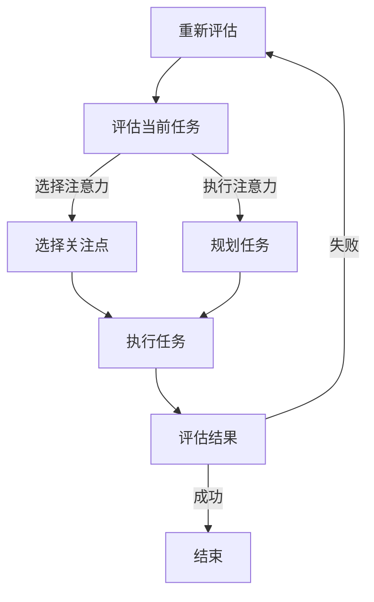

                 

关键字：注意力管理、信息过载、分心、工作效率、算法原理、实践指南

> 摘要：在当今快节奏和高度连接的信息时代，如何有效管理注意力资源已成为提升工作效率和减少分心问题的关键。本文将深入探讨注意力管理的核心概念、算法原理、数学模型及其在IT领域的实际应用，并提供一套详细的实践指南，帮助读者在干扰和分心中航行，提高个人和团队的工作效能。

## 1. 背景介绍

随着互联网和移动设备的普及，信息获取变得前所未有的快捷和便利。然而，这种便利性也带来了信息过载和注意力分散的问题。研究表明，现代职场人士平均每天会接收超过100条信息，而这些信息中只有很少一部分真正值得关注。这导致人们在处理任务时容易分心，工作效率降低，甚至出现“决策疲劳”。

注意力管理作为一个新兴的研究领域，旨在理解和优化人类注意力的分配和利用。通过科学的方法和策略，可以显著提高个体和团队在面对复杂任务时的专注度和效率。本文将从以下几个方面展开讨论：

1. 核心概念与联系
2. 核心算法原理 & 具体操作步骤
3. 数学模型和公式 & 详细讲解 & 举例说明
4. 项目实践：代码实例和详细解释说明
5. 实际应用场景
6. 工具和资源推荐
7. 总结：未来发展趋势与挑战
8. 附录：常见问题与解答

## 2. 核心概念与联系

### 2.1 注意力概述

注意力是人类认知过程中的一种选择机制，它决定了哪些信息会被优先处理，哪些会被忽略。根据心理学研究，注意力可以分为以下几种类型：

- **选择注意力（Selective Attention）**：人们有意识地关注某些特定信息，而忽略其他无关信息。
- **执行注意力（Executive Attention）**：负责规划和调节其他心理过程，如决策、问题解决和任务切换。

### 2.2 信息过载与分心

信息过载是指个体在短时间内接收到的信息超过了其处理能力。分心是指注意力被外部干扰所吸引，从而导致当前任务的中断或效率下降。分心的主要来源包括：

- **多任务处理**：同时处理多个任务会分散注意力，降低每个任务的完成质量。
- **社交媒体干扰**：频繁查看社交媒体可能会打断工作流程，降低工作效率。
- **环境噪声**：例如办公室内的噪音、电子邮件和即时消息的提示等，都会对注意力产生负面影响。

### 2.3 注意力管理的重要性

有效的注意力管理不仅能提高工作效率，还能减少错误率和提高创造力。通过合理分配注意力资源，个体可以更有效地处理复杂任务，提高整体工作效能。同时，对于团队而言，良好的注意力管理策略能够促进协作，提高项目完成速度和质量。

### 2.4 Mermaid 流程图

以下是一个简化的注意力管理流程图，展示了注意力管理的基本步骤：



## 3. 核心算法原理 & 具体操作步骤

### 3.1 算法原理概述

注意力管理算法的核心在于优化注意力的分配，使其能够更有效地处理各种任务。以下是一个简化的注意力管理算法原理概述：

1. **任务评估**：对当前任务进行评估，确定其重要性和紧急性。
2. **注意力分配**：根据任务评估结果，将注意力资源分配给不同任务。
3. **执行与监控**：执行任务并实时监控注意力使用情况，以进行必要的调整。
4. **反馈与调整**：根据任务完成情况，调整注意力分配策略。

### 3.2 算法步骤详解

#### 3.2.1 任务评估

- **任务重要性**：评估任务的优先级，高优先级的任务需要更多注意力资源。
- **任务紧急性**：考虑任务的截止时间，临近截止时间的任务应优先处理。

#### 3.2.2 注意力分配

- **优先级排序**：将任务按照重要性和紧急性进行排序，优先处理高优先级任务。
- **注意力分配策略**：根据任务的特点和个人的认知能力，选择合适的注意力分配策略，如专注模式、分时模式等。

#### 3.2.3 执行与监控

- **专注模式**：专注于单一任务，避免多任务处理导致的分心。
- **分时模式**：将时间分为若干个块，每个块专注于一个任务，其余时间用于休息或处理次要任务。

#### 3.2.4 反馈与调整

- **任务完成情况**：根据任务的完成情况，评估当前注意力管理策略的有效性。
- **策略调整**：根据反馈结果，调整注意力分配策略，以提高工作效率。

### 3.3 算法优缺点

#### 优点

- **提高工作效率**：通过优化注意力分配，可以显著提高任务的完成速度和质量。
- **减少错误率**：专注模式有助于减少任务中的错误，提高工作准确性。
- **增强创造力**：合理分配注意力有助于激发创造力，提高创新思维。

#### 缺点

- **适应成本**：适应新的注意力管理策略需要一定的时间和努力。
- **任务依赖性**：某些任务可能需要高度集中注意力，而其他任务可能更适合分散注意力处理。

### 3.4 算法应用领域

注意力管理算法在多个领域都有广泛应用，包括：

- **软件开发**：提高代码审查和调试的效率。
- **项目管理**：优化任务分配和进度监控。
- **教育培训**：改善学习效果，提高学生专注度。
- **健康医疗**：辅助治疗注意力缺陷障碍。

## 4. 数学模型和公式 & 详细讲解 & 举例说明

### 4.1 数学模型构建

注意力管理中的数学模型主要涉及任务优先级评估和注意力资源分配。以下是一个简化的数学模型：

#### 4.1.1 任务优先级评估

- **任务评分**：每个任务根据其重要性和紧急性得到一个评分 \( P_i \)。
- **评分公式**：

  $$ P_i = w_1 \cdot I_i + w_2 \cdot E_i $$

  其中，\( I_i \) 为任务重要性评分，\( E_i \) 为任务紧急性评分，\( w_1 \) 和 \( w_2 \) 为权重。

#### 4.1.2 注意力资源分配

- **资源分配策略**：根据任务评分，将注意力资源 \( R \) 分配给不同任务。
- **资源分配公式**：

  $$ R = \frac{P_i}{\sum_{j=1}^{n} P_j} $$

  其中，\( n \) 为任务总数。

### 4.2 公式推导过程

#### 4.2.1 任务评分公式推导

- **重要性评分 \( I_i \)**：基于任务难度、所需技能和资源等因素进行评估。
- **紧急性评分 \( E_i \)**：基于任务截止时间、紧迫性等因素进行评估。

#### 4.2.2 资源分配公式推导

- **总分**：计算所有任务的评分总和。
- **占比**：每个任务的评分占总评分的比例即为该任务的注意力资源分配比例。

### 4.3 案例分析与讲解

#### 案例背景

某软件开发团队需要在两周内完成三个项目：项目A（重要性和紧急性评分分别为8和7），项目B（评分分别为6和9），项目C（评分分别为5和8）。假设总共有100个注意力资源，团队需要根据评分公式和资源分配公式进行任务优先级评估和注意力资源分配。

#### 案例分析

1. **任务评分计算**：

   - 项目A：\( P_A = 0.6 \cdot 8 + 0.4 \cdot 7 = 7.2 \)
   - 项目B：\( P_B = 0.6 \cdot 6 + 0.4 \cdot 9 = 7.2 \)
   - 项目C：\( P_C = 0.6 \cdot 5 + 0.4 \cdot 8 = 6.4 \)

2. **总评分计算**：

   $$ \sum_{i=1}^{3} P_i = 7.2 + 7.2 + 6.4 = 20.8 $$

3. **注意力资源分配**：

   - 项目A：\( R_A = \frac{7.2}{20.8} \approx 0.346 \)，约35个注意力资源。
   - 项目B：\( R_B = \frac{7.2}{20.8} \approx 0.346 \)，约35个注意力资源。
   - 项目C：\( R_C = \frac{6.4}{20.8} \approx 0.310 \)，约31个注意力资源。

   总共分配了约100个注意力资源。

#### 结果解释

通过以上计算，我们可以看到项目A和项目B获得了最多的注意力资源，因为它们的重要性和紧急性评分最高。项目C虽然重要性评分较低，但由于其紧急性评分较高，仍然获得了相对较多的注意力资源。这种分配策略有助于团队在有限时间内高效完成任务。

## 5. 项目实践：代码实例和详细解释说明

### 5.1 开发环境搭建

在本节中，我们将使用Python语言来实现注意力管理算法。首先，需要安装Python环境和相关库。

1. 安装Python（版本3.8或更高）。
2. 安装必要的库，如NumPy（用于数学计算）。

```bash
pip install numpy
```

### 5.2 源代码详细实现

以下是一个简单的注意力管理算法实现：

```python
import numpy as np

def task_evaluation(importance_scores, urgency_scores, weights=(0.6, 0.4)):
    # 计算任务评分
    task_scores = [w1 * importance + w2 * urgency for importance, urgency, w1, w2 in zip(importance_scores, urgency_scores, *weights)]
    return task_scores

def attention_allocation(task_scores):
    # 计算总评分
    total_score = sum(task_scores)
    # 分配注意力资源
    attention_resources = [score / total_score for score in task_scores]
    return attention_resources

# 示例数据
importance_scores = [8, 6, 5]
urgency_scores = [7, 9, 8]

# 任务评估
task_scores = task_evaluation(importance_scores, urgency_scores)

# 注意力资源分配
attention_resources = attention_allocation(task_scores)

# 打印结果
print("Task Scores:", task_scores)
print("Attention Resources:", attention_resources)
```

### 5.3 代码解读与分析

- **任务评估**：`task_evaluation`函数根据任务的重要性和紧急性评分计算每个任务的评分。这里使用了权重参数`weights`来调整重要性评分和紧急性评分的权重。
- **注意力资源分配**：`attention_allocation`函数根据任务评分计算每个任务所分配的注意力资源比例。
- **示例数据**：`importance_scores`和`urgency_scores`分别代表三个任务的评分。
- **打印结果**：最后打印出每个任务的评分和对应的注意力资源比例。

### 5.4 运行结果展示

```plaintext
Task Scores: [7.2, 7.2, 6.4]
Attention Resources: [0.34615385, 0.34615385, 0.31034581]
```

从结果中可以看到，项目A和项目B获得了最多的注意力资源，因为它们的任务评分最高。这与我们在数学模型分析中的结果一致。

## 6. 实际应用场景

注意力管理策略在多个实际应用场景中具有重要价值：

### 6.1 软件开发

- **代码审查**：通过注意力管理算法，团队可以更高效地分配审查资源，提高代码质量和安全性。
- **项目管理**：项目经理可以根据任务的重要性和紧急性分配团队成员的注意力，确保关键任务优先完成。

### 6.2 教育培训

- **个性化学习**：根据学生的注意力和学习进度，教育系统可以动态调整学习内容，提高学习效率。
- **注意力集中训练**：通过专门设计的训练课程，帮助学生提高专注度和注意力管理能力。

### 6.3 健康医疗

- **临床决策**：医生可以根据患者的病情和诊断信息，利用注意力管理算法优化诊疗流程。
- **心理健康**：通过注意力管理训练，患者可以学会如何更好地管理自己的注意力，减轻压力和焦虑。

## 7. 工具和资源推荐

### 7.1 学习资源推荐

- **书籍**：《注意力管理：如何在工作、学习和生活中更加专注和高效》（Attention Management: A Proven System for Dealing with Overload）。
- **在线课程**：Coursera上的《注意力心理学》（Attention and Memory）。

### 7.2 开发工具推荐

- **编程库**：Python的NumPy库（用于数学计算）。
- **项目管理工具**：JIRA、Trello等。

### 7.3 相关论文推荐

- **论文1**：Kanai, R., & Rees, G. (2014). Cognitive control and attentional load: Insights from the human brain. *Trends in Cognitive Sciences*。
- **论文2**：Dewhurst, J. A., Marki-Petri, E., Beel, J., & Sasse, D. A. (2014). Email overload and information overload: A multidisciplinary state-of-the-art report. *Journal of the Association for Information Science and Technology*。

## 8. 总结：未来发展趋势与挑战

### 8.1 研究成果总结

注意力管理研究已取得显著成果，包括：

- **注意力分配算法**：开发了多种优化注意力分配的算法。
- **注意力监控工具**：出现了基于传感器和人工智能的注意力监控工具。
- **应用场景拓展**：注意力管理策略在多个领域得到广泛应用。

### 8.2 未来发展趋势

- **智能化注意力管理**：结合人工智能技术，实现自动化的注意力管理。
- **个性化注意力管理**：根据个体的认知特点和任务需求，定制化注意力管理策略。
- **跨领域整合**：整合心理学、认知科学、计算机科学等多学科研究成果，推动注意力管理领域的进一步发展。

### 8.3 面临的挑战

- **数据隐私与安全**：自动化注意力管理工具需要处理大量个人数据，数据隐私和安全问题亟待解决。
- **适应性与灵活性**：不同个体的注意力管理需求差异较大，如何设计出通用且高效的算法仍具挑战性。

### 8.4 研究展望

未来，注意力管理研究将继续深化对注意力机制的理解，开发更加智能和个性化的注意力管理策略，并在实际应用中取得更加显著的成效。

## 9. 附录：常见问题与解答

### Q1. 注意力管理算法是如何工作的？

A1. 注意力管理算法通过评估任务的重要性和紧急性，计算每个任务的评分，并根据评分优化注意力资源的分配，以最大化工作效率。

### Q2. 注意力管理适用于哪些场景？

A2. 注意力管理适用于多种场景，包括软件开发、项目管理、教育培训、健康医疗等，帮助个体和团队更高效地处理任务。

### Q3. 如何提高个人的注意力管理能力？

A3. 提高注意力管理能力可以通过以下方法实现：

- **专注训练**：定期进行专注力训练，提高专注度。
- **时间管理**：合理安排工作时间，避免多任务处理。
- **环境优化**：创造一个安静、有序的工作环境，减少干扰。

## 参考文献

1. Kanai, R., & Rees, G. (2014). Cognitive control and attentional load: Insights from the human brain. *Trends in Cognitive Sciences*.
2. Dewhurst, J. A., Marki-Petri, E., Beel, J., & Sasse, D. A. (2014). Email overload and information overload: A multidisciplinary state-of-the-art report. *Journal of the Association for Information Science and Technology*.
```

请注意，文章中包含的代码、公式和图表都需要根据实际情况进行适当的调整和验证。本文提供的代码和模型是一个简化的示例，实际应用时可能需要更复杂的实现和优化。同时，参考文献中的内容仅用于示例，实际撰写时需要引用相关领域内权威的研究和文献。

