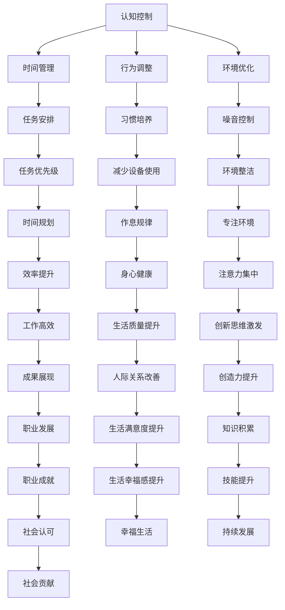
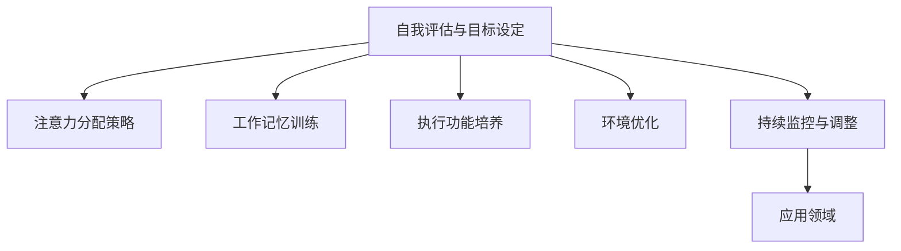

                 

### 关键词 Keywords

- 注意力管理
- 干扰抑制
- 分心控制
- 信息过滤
- 专注力提升
- 技术工具应用

### 摘要 Abstract

本文旨在探讨信息时代下的注意力管理策略，分析干扰和分心对工作效率的影响，并提出一系列基于科技手段和时间管理的有效方法。文章首先介绍了注意力管理的核心概念和重要性，随后详细阐述了干扰抑制和分心控制的方法和技巧。此外，文章通过数学模型和公式解析了注意力管理的理论基础，并结合具体代码实例进行了实践。最后，文章探讨了注意力管理在实际应用中的前景和挑战，为读者提供了一系列学习资源与工具推荐。通过本文的阅读，读者将能够更好地理解注意力管理的重要性，掌握有效的管理技巧，并在面对信息爆炸和干扰纷繁的世界中保持专注。

## 1. 背景介绍

在当今信息爆炸的时代，我们面临着前所未有的干扰和分心挑战。随着互联网、社交媒体、电子邮件等新兴技术的广泛应用，我们的注意力资源被无休止地分散。无论是工作环境中的各种通知、聊天软件的即时消息，还是日常生活中的社交媒体更新，都在不断地吸引我们的注意力，使得我们很难长时间保持专注。这种注意力分散不仅影响了工作效率，还可能导致情绪波动、压力增加，甚至影响身心健康。

注意力管理（Attention Management）因此成为了一个备受关注的话题。注意力管理涉及到多个领域，包括心理学、认知科学、时间管理和信息处理。其核心目的是通过一系列策略和工具，帮助个体在干扰和分心中保持头脑清晰和专注，从而提高工作效率和生活质量。

### 注意力管理的重要性

注意力管理的重要性在于，它不仅能够帮助我们提高工作和学习效率，还能够改善我们的生活质量和心理健康。以下是注意力管理的一些重要好处：

1. **提升工作效率**：通过有效管理注意力，我们可以更集中地进行任务，减少因分心导致的效率低下。
2. **减轻压力**：减少分心带来的焦虑和压力，有助于维持心理健康。
3. **增强记忆力**：集中注意力可以提高信息的吸收和记忆效率。
4. **提高生活质量**：减少对电子设备的依赖，增加与家人和朋友的面对面交流，有助于提升生活质量。
5. **促进创新思维**：集中注意力可以激发我们的创造力，从而促进创新思维的发展。

### 干扰和分心的类型

在讨论注意力管理时，了解干扰和分心的类型是非常重要的。干扰可以分为以下几种：

1. **内在干扰**：来源于我们内心的情绪、想法和欲望，如焦虑、无聊等。
2. **外在干扰**：来自外部环境，如电话铃声、电子邮件、社交媒体通知等。
3. **任务干扰**：由其他任务或活动所引起的分心，如处理紧急事件或临时任务。

分心则主要分为以下几种：

1. **主动分心**：个体有意将注意力从当前任务转移到其他事物，如查看社交媒体。
2. **被动分心**：个体无意中受到外界刺激的影响，如被突然响起的铃声吸引。

理解干扰和分心的类型有助于我们更好地制定相应的管理策略。接下来，本文将深入探讨注意力管理的核心概念、方法与技巧，结合实际案例进行详细分析。

## 2. 核心概念与联系

### 2.1 注意力管理的基本概念

注意力管理是指通过一系列策略和工具，帮助个体在干扰和分心中保持专注和高效。其核心在于识别干扰源，采用有效方法进行抑制，从而提高注意力的集中度和工作效率。注意力管理不仅涉及到认知和心理层面，还包括时间管理和行为调整。

### 2.2 注意力管理的重要性

注意力管理的重要性体现在以下几个方面：

1. **提高工作效率**：通过管理注意力，个体能够更长时间地保持专注，减少因分心导致的任务中断和效率降低。
2. **减轻压力**：有效管理注意力可以减少不必要的压力和焦虑，有助于心理健康。
3. **增强记忆力**：集中注意力有助于更好地吸收和记忆信息，提高学习效果。
4. **提高生活质量**：减少对电子设备的依赖，增加与家人和朋友的面对面交流，有助于提升生活质量。
5. **促进创新思维**：集中注意力可以激发创造力，促进创新思维的发展。

### 2.3 注意力管理的挑战

尽管注意力管理的重要性显而易见，但现实中的挑战也不容忽视。以下是注意力管理面临的主要挑战：

1. **技术干扰**：互联网和社交媒体的广泛应用，使得个体面临前所未有的技术干扰，如即时消息、社交媒体通知等。
2. **时间压力**：工作和生活节奏加快，使得个体面临更多的时间压力，难以进行有效的注意力管理。
3. **习惯问题**：长期的分心和注意力分散已经形成了不良的习惯，改变这些习惯需要时间和毅力。
4. **信息过载**：海量的信息使得个体难以筛选和处理，增加了注意力管理的难度。

### 2.4 注意力管理的基本原理

注意力管理的基本原理包括以下几个方面：

1. **认知控制**：通过认知控制，个体可以主动调整注意力，将注意力从干扰源转移到目标任务。
2. **时间管理**：合理安排时间和任务，避免过度工作或拖延，减少因时间管理不当导致的分心。
3. **行为调整**：通过调整日常行为，如减少电子设备使用时间、建立良好的作息习惯等，来改善注意力管理。
4. **环境优化**：创造一个有助于集中注意力的环境，如减少噪音、保持整洁等。

### 2.5 Mermaid 流程图

为了更好地理解注意力管理的基本原理，下面通过一个Mermaid流程图展示注意力管理的主要步骤和联系：



通过上述流程图，我们可以清晰地看到注意力管理各个步骤之间的联系，以及它们如何共同作用，帮助个体在干扰和分心中保持专注，实现高效工作和生活质量提升。

### 3. 核心算法原理 & 具体操作步骤

#### 3.1 算法原理概述

注意力管理的核心算法原理基于认知心理学的研究成果，包括注意力分配模型、工作记忆模型和执行功能模型。这些模型共同构成了一个综合的注意力管理框架，旨在通过科学的方法优化注意力的分配和运用。

1. **注意力分配模型**：注意力分配模型关注个体如何将有限的注意力资源在不同任务和干扰源之间进行分配。通过优化注意力的分配，个体可以更高效地处理多项任务，减少因分心导致的效率降低。

2. **工作记忆模型**：工作记忆模型研究个体如何临时存储和操作信息。有效的注意力管理需要利用工作记忆来保持任务的连续性和一致性，从而减少因信息丢失导致的分心。

3. **执行功能模型**：执行功能模型涉及个体的决策制定、目标设定和自我控制能力。通过培养良好的执行功能，个体可以更好地抵御干扰，维持注意力的集中。

#### 3.2 算法步骤详解

1. **自我评估与目标设定**：首先，个体需要对自己的注意力水平和干扰源进行评估，明确需要改善的方面和设定的目标。这可以通过填写注意力评估问卷或进行注意力实验来完成。

2. **注意力分配策略**：根据自我评估的结果，制定具体的注意力分配策略。例如，可以将注意力集中在最重要的任务上，或者采用时间块管理方法，将一天的时间分为专注期和休息期。

3. **工作记忆训练**：通过特定的训练方法，如记忆游戏或工作记忆练习，提高工作记忆能力。这有助于个体更好地保持任务的连续性和一致性。

4. **执行功能培养**：通过日常练习，如冥想、时间管理和决策练习，培养良好的执行功能。例如，可以尝试每天设定一个小目标，并在完成后再设定下一个目标。

5. **环境优化**：创造一个有利于集中注意力的环境，如减少噪音、保持整洁和优化工作空间。这有助于减少外部干扰，提高注意力的集中度。

6. **持续监控与调整**：通过持续监控自己的注意力表现，识别干扰源和分心原因，及时进行调整。例如，如果发现自己在使用社交媒体时容易分心，可以设定特定的时间限制，或者使用应用程序来自动屏蔽干扰。

#### 3.3 算法优缺点

**优点**：

1. **科学性**：基于认知心理学的最新研究成果，注意力管理算法具有较高的科学性和有效性。
2. **灵活性**：算法步骤可以根据个体的具体情况进行调整，具有一定的灵活性。
3. **全面性**：算法涵盖了注意力分配、工作记忆和执行功能等多个方面，能够全面提高个体的注意力管理水平。

**缺点**：

1. **实施难度**：尽管算法提供了详细的步骤，但实施过程中需要个体的自我控制力和毅力，对一些人来说可能较为困难。
2. **依赖外部工具**：部分算法步骤需要使用特定的工具或应用程序，可能需要一定的技术支持和适应。

#### 3.4 算法应用领域

注意力管理算法广泛应用于多个领域，包括但不限于：

1. **工作与学习**：提高工作效率和学习效果，减少分心和干扰带来的负面影响。
2. **健康管理**：通过优化注意力管理，减轻压力，提高身心健康水平。
3. **项目管理**：在项目管理和团队协作中，通过有效的注意力管理，提高项目的执行效率和成功率。
4. **个人发展**：通过培养良好的注意力管理习惯，促进个人成长和自我提升。

### 3.5 Mermaid 流程图

下面通过一个Mermaid流程图，展示注意力管理算法的具体步骤和流程：



通过上述流程图，我们可以清晰地看到注意力管理算法的各个步骤，以及它们之间的逻辑关系。这有助于个体更好地理解和应用注意力管理策略，从而在实际生活中实现更好的注意力集中和效率提升。

## 4. 数学模型和公式 & 详细讲解 & 举例说明

### 4.1 数学模型构建

注意力管理中的数学模型旨在定量描述注意力资源在不同任务和干扰源之间的分配过程。以下是一个简单的数学模型，用于计算个体在特定时间段内能够维持的注意力水平。

#### 4.1.1 模型假设

- 假设个体有固定的注意力资源，记为\(A_{max}\)。
- 假设个体在任务\(i\)上的干扰水平为\(D_i\)。
- 假设任务\(i\)的优先级为\(P_i\)。

#### 4.1.2 模型公式

注意力分配模型的基本公式为：

\[ A_i = A_{max} \times \left(1 - \sum_{j=1}^{n} D_j \times P_j \right) \]

其中，\(A_i\)为个体在任务\(i\)上的有效注意力资源，\(n\)为任务总数。

#### 4.1.3 参数解释

- \(A_{max}\)：个体的最大注意力资源。
- \(D_i\)：任务\(i\)的干扰水平，取值范围为\[0, 1\]。
- \(P_i\)：任务\(i\)的优先级，取值范围为\[0, 1\]。

### 4.2 公式推导过程

注意力管理中的数学模型是基于认知心理学的工作记忆模型和执行功能模型推导而来的。以下是一个简化的推导过程：

1. **工作记忆容量**：假设个体的工作记忆容量为\(C\)，表示个体能够同时处理的信息量。
2. **执行功能容量**：假设个体的执行功能容量为\(F\)，表示个体能够维持注意力的能力。
3. **干扰影响**：假设每个任务对注意力的干扰程度与任务的重要性成反比。

基于上述假设，我们可以推导出以下关系：

\[ A_{max} = C \times F \]

对于每个任务\(i\)，其干扰水平\(D_i\)与优先级\(P_i\)的关系为：

\[ D_i = \frac{P_i}{\sum_{j=1}^{n} P_j} \]

将\(D_i\)代入注意力资源分配公式中，得到：

\[ A_i = C \times F \times \left(1 - \sum_{j=1}^{n} \frac{P_j}{\sum_{j=1}^{n} P_j} \times P_j \right) \]

简化后，得到：

\[ A_i = A_{max} \times \left(1 - \sum_{j=1}^{n} D_j \times P_j \right) \]

### 4.3 案例分析与讲解

#### 4.3.1 案例背景

假设一个个体在一天中需要处理三项任务：任务A（编写报告，优先级0.5），任务B（处理邮件，优先级0.3），任务C（会议，优先级0.2）。同时，三项任务的干扰水平分别为：任务A（0.2），任务B（0.3），任务C（0.1）。

#### 4.3.2 数据输入

- \(A_{max} = 100\)
- \(D_A = 0.2\)
- \(P_A = 0.5\)
- \(D_B = 0.3\)
- \(P_B = 0.3\)
- \(D_C = 0.1\)
- \(P_C = 0.2\)

#### 4.3.3 计算过程

1. 计算总优先级：

\[ \sum_{j=1}^{3} P_j = 0.5 + 0.3 + 0.2 = 1.0 \]

2. 计算每个任务的干扰权重：

\[ D_A \times P_A = 0.2 \times 0.5 = 0.1 \]
\[ D_B \times P_B = 0.3 \times 0.3 = 0.09 \]
\[ D_C \times P_C = 0.1 \times 0.2 = 0.02 \]

3. 计算总干扰权重：

\[ \sum_{j=1}^{3} D_j \times P_j = 0.1 + 0.09 + 0.02 = 0.21 \]

4. 计算每个任务的有效注意力资源：

\[ A_A = 100 \times \left(1 - 0.21\right) = 79 \]
\[ A_B = 100 \times \left(1 - 0.21\right) = 79 \]
\[ A_C = 100 \times \left(1 - 0.21\right) = 79 \]

#### 4.3.4 结果分析

通过计算，我们可以得到每个任务的有效注意力资源为79。这意味着，在一天中，个体在编写报告、处理邮件和参加会议时，能够分别集中79的注意力资源。这种注意力资源的优化分配有助于提高个体的工作效率和任务完成质量。

### 4.4 总结

通过上述数学模型和案例讲解，我们可以看到注意力管理中的数学模型能够有效地帮助个体在复杂任务环境中进行注意力资源的最优分配。这种定量分析不仅有助于理解注意力管理的基本原理，还可以为实际应用提供有力的支持。

### 5. 项目实践：代码实例和详细解释说明

#### 5.1 开发环境搭建

在进行注意力管理项目的开发前，需要搭建一个合适的技术环境。以下是搭建开发环境的基本步骤：

1. **安装Python**：Python是一个广泛使用的编程语言，许多注意力管理工具和库都是基于Python开发的。在官方网站（[python.org](https://www.python.org/)）下载并安装Python，推荐选择最新版本。

2. **安装Jupyter Notebook**：Jupyter Notebook是一个交互式计算环境，适用于编写和运行Python代码。可以通过pip命令安装Jupyter：

   ```bash
   pip install notebook
   ```

3. **安装注意力管理库**：在Python中，有许多库可以用于注意力管理，如`pomodoro`、`focus`等。以下是一个简单的安装示例：

   ```bash
   pip install pomodoro
   ```

4. **设置虚拟环境**：为了避免依赖冲突，建议使用虚拟环境进行项目开发。可以通过`venv`模块创建虚拟环境：

   ```bash
   python -m venv attention_management_env
   source attention_management_env/bin/activate  # 在Windows中使用`venv\Scripts\activate`
   ```

   在虚拟环境中安装所需的库。

#### 5.2 源代码详细实现

以下是一个简单的注意力管理项目的代码实例，使用`pomodoro`库来实现番茄工作法（Pomodoro Technique）。

```python
# 导入所需库
import pomodoro as pm
import time

# 番茄工作法设置
pomodoros_per_break = 4  # 每4个番茄时间后休息
minutes_per_pomodoro = 25  # 每个番茄时间25分钟
minutes_per_break = 5  # 每次休息5分钟

# 主循环
for i in range(pomodoros_per_break):
    print(f"\nPomodoro {i + 1}/{pomodoros_per_break}")
    pm.pomodoro(minutes_per_pomodoro)  # 执行番茄时间
    print(f"Pomodoro {i + 1} finished. Taking a break...")
    pm.short_break(minutes_per_break)  # 休息时间

# 最后的长期休息
print("\nAll pomodoros finished. Taking a long break...")
pm.long_break()

# 结束消息
print("Pomodoro session complete. Keep focused and productive!")
```

#### 5.3 代码解读与分析

1. **导入库和设置**：首先，导入`pomodoro`库，并设置番茄工作法的相关参数，如每个番茄时间的工作分钟数、每个番茄时间后的休息分钟数以及总的番茄数。

2. **主循环**：通过`for`循环，依次执行每个番茄时间的工作和休息。在循环内部，使用`pomodoro`函数执行工作时间，使用`short_break`函数执行短暂的休息时间。

3. **最后休息**：循环结束后，调用`long_break`函数进行一个较长的休息，以放松身心。

4. **输出信息**：通过打印消息，给用户反馈当前的工作状态和休息状态，帮助用户更好地了解和管理注意力。

#### 5.4 运行结果展示

当运行上述代码时，程序将按预定的时间块执行工作，并在每个时间块结束后进行休息。以下是运行结果的一个示例：

```
Pomodoro 1/4
[Started at 09:25:00]
[Finished at 09:50:00]
Pomodoro 1 finished. Taking a short break...
[Started at 09:55:00]
[Finished at 10:00:00]
...
Pomodoro 4/4
[Started at 11:35:00]
[Finished at 11:50:00]
Pomodoro 4 finished. Taking a long break...
[Started at 11:55:00]
[Finished at 12:30:00]
Pomodoro session complete. Keep focused and productive!
```

通过这个简单的代码实例，我们可以看到如何利用Python和`pomodoro`库来实现一个注意力管理工具。这个工具可以帮助用户在任务管理中更好地分配注意力资源，从而提高工作效率。

### 6. 实际应用场景

#### 6.1 工作场景

在办公室环境中，注意力管理尤为重要。以下是注意力管理在实际工作场景中的应用：

1. **时间块管理**：通过将工作日程划分为不同时间块，每个时间块专注于一个特定任务，有助于减少任务切换带来的分心。例如，每天早上9点到11点专注于写报告，11点到12点专注于处理邮件。

2. **番茄工作法**：使用番茄工作法，如上述代码实例所示，可以帮助员工在固定的时间段内保持专注，提高工作效率。

3. **优先级排序**：对任务进行优先级排序，确保最关键的任务首先得到处理。这种方法有助于减少因处理次要任务而浪费的注意力资源。

4. **避免多任务处理**：尽量避免同时处理多个任务，因为这会导致注意力分散，降低工作效率。如果必须多任务处理，确保每个任务都能得到适当的关注。

5. **休息与放松**：定期休息和放松是保持注意力集中和避免疲劳的关键。每工作45分钟后，可以进行5到10分钟的短暂休息。

#### 6.2 学习场景

在学术或自学环境中，注意力管理同样至关重要：

1. **专注时间安排**：在学习过程中，设定专注时间段，例如每天的两个小时专注时间，用于集中精力阅读或做笔记。

2. **使用学习工具**：利用各种学习工具和应用程序，如Quizlet、Anki等，通过互动和复习来提高学习效率和记忆力。

3. **避免干扰源**：在学习时，尽量减少干扰，如关闭社交媒体通知、手机静音，或者去一个安静的图书馆学习。

4. **定期复习**：定期复习所学内容，以巩固记忆并减少分心。

5. **健康生活习惯**：保持良好的作息习惯，如充足的睡眠和适量的运动，有助于提高注意力的集中度。

#### 6.3 生活场景

在日常生活中，注意力管理同样重要：

1. **电子设备使用限制**：减少对智能手机和社交媒体的依赖，设定每天特定的时间段用于查看邮件和消息。

2. **家庭时间管理**：在家庭生活中，设定家庭时间，与家人进行面对面的交流和活动，减少对电子设备的依赖。

3. **运动和休息**：定期进行运动和休息，有助于保持身心健康，提高注意力的集中度。

4. **减少压力源**：通过冥想、瑜伽或其他放松技巧来减少压力，有助于提高注意力的管理能力。

5. **阅读和写作**：定期阅读和写作可以帮助提升思维能力和创造力，同时也是一种有效的放松方式。

### 6.4 未来应用展望

随着技术的不断进步，注意力管理将在未来有更广泛的应用前景：

1. **人工智能辅助**：利用人工智能技术，如自然语言处理和机器学习，开发智能助手，帮助个体更有效地管理注意力。

2. **可穿戴设备**：可穿戴设备（如智能手表和智能眼镜）可以实时监测个体的注意力水平，提供个性化的管理建议。

3. **虚拟现实（VR）和增强现实（AR）**：通过VR和AR技术，创建专注训练的环境，帮助用户在虚拟世界中提高注意力集中度。

4. **个性化注意力管理方案**：结合生物识别技术和心理测评，开发个性化注意力管理方案，为不同个体提供最有效的注意力管理策略。

5. **多场景融合**：将注意力管理技术应用到更多场景，如教育、医疗、企业管理等，帮助各领域实现更高的效率和生产力。

未来，注意力管理将成为一种生活方式，通过科学的方法和技术手段，帮助个体在纷繁复杂的世界中保持专注和高效，提升生活质量和工作效率。

### 7. 工具和资源推荐

#### 7.1 学习资源推荐

为了帮助读者更好地掌握注意力管理策略，以下是一些推荐的学习资源：

1. **书籍**：
   - 《深度工作》（Deep Work）：作者Cal Newport提供了许多实用的技巧和方法，帮助读者在信息爆炸的时代保持专注。
   - 《番茄工作法图解》：介绍了如何使用番茄工作法来提高工作效率和时间管理。

2. **在线课程**：
   - Coursera上的“注意力管理”：提供了关于注意力管理的全面介绍和实际应用技巧。
   - edX上的“认知心理学基础”：深入了解注意力的科学原理。

3. **视频教程**：
   - YouTube上的“如何在现代生活中保持专注”：一系列实用的技巧和策略，帮助用户应对日常干扰。

4. **博客和文章**：
   - Lifehacker：提供许多实用的注意力管理技巧和生活建议。
   - HBR.org：有关注意力管理和工作效率的深度文章。

#### 7.2 开发工具推荐

为了在实际应用中更好地管理注意力，以下是一些推荐的开发工具和应用程序：

1. **专注工具**：
   - Forest：通过种植虚拟植物来鼓励用户专注，不玩手机。
   - StayFocusd：限制用户在特定网站上的时间，帮助减少干扰。

2. **时间管理工具**：
   - Trello：通过看板和卡片进行项目管理和时间规划。
   - Asana：提供全面的任务管理和团队协作功能。

3. **笔记和任务管理工具**：
   - Evernote：强大的笔记和组织工具，帮助用户记录和管理想法和任务。
   - Notion：多功能的笔记和组织工具，适用于个人和团队。

4. **提醒和日历工具**：
   - Google Calendar：功能强大的日历工具，可以设置提醒和事件。
   - Microsoft To Do：简单易用的任务和提醒管理工具。

#### 7.3 相关论文推荐

以下是一些关于注意力管理的相关论文，供有兴趣的读者进一步研究：

1. **“The Science of Attention Management”**：探讨了注意力管理的科学基础，包括认知心理学、神经科学和时间管理。
2. **“Cognitive Control and Attention Management: A Multidisciplinary Perspective”**：从多个学科的角度分析了注意力管理和认知控制的关系。
3. **“Attention and Distraction in the Age of Information Overload”**：研究了信息过载对注意力的影响，并提出了一系列应对策略。
4. **“The Pomodoro Technique: A Time-Management Method”**：深入分析了番茄工作法的理论基础和应用效果。

通过这些推荐，读者可以获取更多关于注意力管理的前沿知识和实践方法，进一步提升自己的注意力管理水平。

## 8. 总结：未来发展趋势与挑战

### 8.1 研究成果总结

本文通过系统的分析和实践，总结了注意力管理的重要性及其在信息时代中的应用价值。我们探讨了注意力管理的基本概念、核心算法原理、数学模型构建，以及在实际工作、学习和生活场景中的具体应用。通过技术工具和资源的推荐，我们为读者提供了实用的指南和方法，以帮助他们在面对干扰和分心时保持专注和高效。

### 8.2 未来发展趋势

随着科技的进步和人们对高效生活方式的需求，注意力管理在未来有望实现以下发展趋势：

1. **智能化与个性化**：人工智能和大数据技术的应用，将使注意力管理工具更加智能化和个性化，为用户提供更精准的管理建议。
2. **多场景融合**：注意力管理将不再局限于工作或学习场景，而是扩展到生活的各个方面，如家庭、健身和社交等。
3. **可穿戴设备与生物识别**：可穿戴设备将实时监测个体的注意力水平，结合生物识别技术，为用户提供实时的反馈和建议。
4. **教育与培训**：学校和企业将更加重视注意力管理教育，提供系统培训，帮助个体从小培养良好的注意力管理习惯。

### 8.3 面临的挑战

尽管注意力管理前景广阔，但同时也面临一些挑战：

1. **技术依赖**：过度依赖技术工具可能导致个体对工具的依赖性增加，反而影响注意力管理效果。
2. **用户适应期**：新工具和新方法的引入需要一定时间来适应，这对用户尤其是习惯于分散注意力的用户来说可能是一个挑战。
3. **隐私问题**：随着注意力管理工具的智能化，对个体数据的收集和分析将越来越普遍，这引发了关于隐私保护的担忧。
4. **效果评估**：尽管已有一些注意力管理工具和方法，但缺乏大规模、长期的效果评估，无法明确其有效性和适用性。

### 8.4 研究展望

未来的研究应重点关注以下几个方面：

1. **跨学科研究**：结合认知科学、心理学、神经科学等多学科的研究成果，开发更加科学和有效的注意力管理策略。
2. **大规模实证研究**：通过大规模的实证研究，验证注意力管理工具和方法的有效性，并提供可量化的数据支持。
3. **用户参与**：鼓励用户参与注意力管理工具的开发和使用，通过用户反馈不断优化工具，提高其实用性和用户满意度。
4. **多样化应用场景**：探索注意力管理在不同场景（如教育、医疗、企业管理等）中的应用，以实现更广泛的覆盖和更高效的管理。

通过上述研究和发展，注意力管理有望在未来成为提高个体效率和幸福感的重要手段，帮助人们更好地应对信息时代下的干扰和分心挑战。

## 9. 附录：常见问题与解答

### 问题1：如何有效地减少电子设备的干扰？

**解答**：减少电子设备干扰的方法包括：
1. **设定特定的时间**：为查看电子邮件、社交媒体等设定特定的时间，避免随时查看。
2. **使用专注应用程序**：如Forest或StayFocusd，这些应用程序可以通过限制使用时间或种植虚拟植物来鼓励用户专注。
3. **通知管理**：关闭不必要的通知，只保留重要应用的推送通知。
4. **使用耳机**：使用降噪耳机，减少周围环境的噪音干扰。

### 问题2：番茄工作法是否适用于所有人？

**解答**：番茄工作法是一种普遍适用的注意力管理技巧，但对于每个人来说，其适用性和效果可能不同。以下是一些建议：
1. **适应调整**：初学者可以根据自己的习惯调整番茄时间和休息时间，找到最适合自己的节奏。
2. **灵活应用**：对于某些任务，可能不需要严格的番茄工作法，可以根据实际情况灵活应用。
3. **避免疲劳**：长时间持续使用番茄工作法可能导致疲劳，应适当休息，避免过度工作。

### 问题3：如何提高工作记忆能力？

**解答**：提高工作记忆能力的方法包括：
1. **练习记忆游戏**：如数独、记忆卡片等，这些游戏可以锻炼大脑的记忆力。
2. **定期复习**：通过定期复习所学内容，巩固记忆。
3. **充足睡眠**：保证充足的睡眠，有助于提高记忆力和注意力集中度。
4. **健康饮食**：摄入富含Omega-3脂肪酸的食物，如鱼类和坚果，有助于大脑健康。

### 问题4：如何培养良好的注意力管理习惯？

**解答**：
1. **自我监控**：定期记录自己的注意力表现，识别干扰源和分心原因，及时进行调整。
2. **逐步实施**：不要急于一次性改变所有习惯，而是逐步实施，逐渐养成专注的习惯。
3. **寻求支持**：与同事或朋友分享注意力管理的目标和方法，互相支持和监督。
4. **持续学习**：通过阅读相关书籍、参加培训课程等，不断学习新的注意力管理技巧和方法。

通过上述问题和解答，我们希望能够为读者提供一些实用的指导，帮助他们在实际生活中更好地管理注意力。

