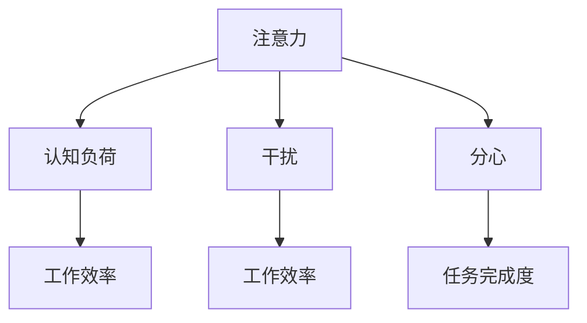

                 

关键词：注意力管理、信息过载、干扰、分心、技术策略、认知负荷

> 摘要：在信息爆炸和数字化的时代，我们的注意力资源变得日益稀缺。本文将探讨注意力管理的重要性，分析信息过载、干扰和分心对个体认知和行为的影响，并介绍一系列针对注意力管理的策略。通过这些策略，我们能够在日常工作和生活中更好地掌控自己的注意力，提高生产效率和幸福感。

## 1. 背景介绍

### 信息时代的变革

随着互联网和移动设备的普及，我们进入了一个前所未有的信息时代。每天，我们都被大量的信息所包围，从社交媒体、新闻资讯、电子邮件到各种应用程序推送，信息的获取变得前所未有的便捷。然而，这种便利也带来了新的挑战——信息过载。

### 注意力的稀缺性

注意力是人类认知资源的一种，它决定了我们如何处理和响应外部刺激。在信息爆炸的环境中，我们的注意力资源变得愈发稀缺。研究表明，当注意力资源被过度消耗时，个体的认知负荷增加，工作效率降低，甚至可能出现心理压力和情绪问题。

### 干扰与分心的威胁

在数字化世界中，干扰和分心是注意力管理的主要威胁。无论是不断弹出的社交媒体通知、频繁的电子邮件提醒，还是杂乱无章的工作任务，都会分散我们的注意力，使我们难以专注于重要的任务。长期处于干扰和分心的环境中，我们的注意力管理能力将受到严重影响。

## 2. 核心概念与联系

为了更好地理解注意力管理，我们需要明确几个核心概念：注意力、认知负荷、干扰和分心。

### 注意力

注意力是大脑处理信息的能力，它使我们能够聚焦于特定的任务或刺激。注意力具有选择性，它决定了我们关注什么，忽视什么。有效的注意力管理可以使我们在面对大量信息时，依然能够保持专注和高效。

### 认知负荷

认知负荷是指大脑在处理信息时所需的认知资源总量。当认知负荷过高时，大脑的注意力和记忆力都会受到影响。因此，降低认知负荷是有效注意力管理的关键。

### 干扰

干扰是指任何分散注意力的外部刺激。在数字化环境中，干扰主要来自各种应用程序的通知、社交媒体的推送、电子邮件的提醒等。这些干扰会使我们难以集中精力，降低工作效率。

### 分心

分心是指个体在执行任务时，注意力被无关的刺激所吸引。分心不仅会影响当前任务的完成，还可能导致错误的决策和行为。

### Mermaid 流程图

下面是一个简单的 Mermaid 流程图，展示了注意力管理中涉及的核心概念和它们之间的关系。



## 3. 核心算法原理 & 具体操作步骤

### 3.1 算法原理概述

注意力管理算法的核心在于识别并减少干扰和分心，从而降低认知负荷，提高工作效率。算法主要包括以下几个步骤：

1. **认知负荷评估**：通过监测大脑的认知资源消耗，评估当前的认知负荷。
2. **干扰识别**：利用机器学习和自然语言处理技术，识别并屏蔽干扰性信息。
3. **分心监测**：利用注意力追踪技术，监测个体的注意力状态，识别分心行为。
4. **注意力优化**：根据认知负荷和干扰情况，调整注意力分配，优化工作流程。

### 3.2 算法步骤详解

1. **认知负荷评估**：

   - **数据收集**：通过大脑电图（EEG）等生物传感器，收集大脑活动数据。
   - **特征提取**：从数据中提取与认知负荷相关的特征，如脑电波的频率和振幅。
   - **负荷评估**：利用机器学习算法，对提取的特征进行建模，评估当前的认知负荷。

2. **干扰识别**：

   - **通知过滤**：对电子邮件、社交媒体通知等应用推送进行筛选，识别出潜在的干扰信息。
   - **行为分析**：通过分析用户的行为数据，如鼠标和键盘的使用情况，识别干扰行为。
   - **屏蔽策略**：根据干扰识别结果，制定屏蔽策略，自动屏蔽干扰性信息。

3. **分心监测**：

   - **注意力追踪**：利用眼球追踪技术，监测个体的注意力状态。
   - **状态识别**：通过分析眼球运动数据，识别分心行为。
   - **反馈机制**：当检测到分心行为时，给予用户反馈，提示其回到任务。

4. **注意力优化**：

   - **任务优先级**：根据认知负荷和任务的重要性，调整任务的优先级。
   - **时间管理**：合理安排工作任务，避免长时间连续工作导致的认知疲劳。
   - **环境优化**：创建一个有利于集中注意力的工作环境，减少外部干扰。

### 3.3 算法优缺点

**优点**：

- **提高工作效率**：通过降低认知负荷和干扰，使个体能够更高效地完成任务。
- **减少错误和遗漏**：减少分心导致的错误和遗漏，提高任务的完成质量。
- **个性化适配**：根据个体的注意力特点，提供个性化的注意力管理策略。

**缺点**：

- **依赖技术支持**：算法需要依赖先进的技术支持，如生物传感器、机器学习等。
- **实施难度**：算法的实施需要较高的技术门槛，对于普通用户来说可能难以操作。
- **隐私问题**：算法需要收集大量的个人生物数据，可能引发隐私保护的问题。

### 3.4 算法应用领域

注意力管理算法可以广泛应用于多个领域，如：

- **企业管理**：帮助企业员工提高工作效率，降低错误率。
- **教育领域**：帮助学生提高学习效率，减少分心行为。
- **心理健康**：为心理健康患者提供个性化的注意力管理方案，改善心理健康状况。
- **日常生活**：帮助普通用户提高日常生活质量，减少信息过载带来的压力。

## 4. 数学模型和公式 & 详细讲解 & 举例说明

### 4.1 数学模型构建

注意力管理算法中的数学模型主要涉及认知负荷的评估、干扰识别和注意力优化等方面。以下是一个简化的数学模型：

1. **认知负荷模型**：

   $$ L(t) = f(C(t), I(t)) $$

   其中，$L(t)$ 表示时间 $t$ 时的认知负荷，$C(t)$ 表示大脑的认知资源消耗，$I(t)$ 表示时间 $t$ 时的干扰强度。

2. **干扰识别模型**：

   $$ I(t) = g(N(t), B(t)) $$

   其中，$I(t)$ 表示时间 $t$ 时的干扰强度，$N(t)$ 表示时间 $t$ 时的通知数量，$B(t)$ 表示时间 $t$ 时的行为数据。

3. **注意力优化模型**：

   $$ O(t) = h(L(t), P(t)) $$

   其中，$O(t)$ 表示时间 $t$ 时的注意力优化策略，$P(t)$ 表示时间 $t$ 时的任务优先级。

### 4.2 公式推导过程

1. **认知负荷模型推导**：

   - **认知资源消耗**：大脑的认知资源消耗与大脑的活跃度、注意力集中程度等因素相关。
   - **干扰强度**：干扰强度与通知数量和行为数据相关。

2. **干扰识别模型推导**：

   - **通知数量**：通知数量与信息来源、信息类型等因素相关。
   - **行为数据**：行为数据与用户的行为习惯、注意力状态等因素相关。

3. **注意力优化模型推导**：

   - **任务优先级**：任务优先级与任务的重要性、紧急性等因素相关。

### 4.3 案例分析与讲解

假设一个员工在一天内收到 10 条电子邮件和 5 条社交媒体通知，他的行为数据表明他在处理任务时频繁切换窗口。根据上述数学模型，我们可以对这位员工进行注意力管理分析。

1. **认知负荷评估**：

   $$ L(t) = f(C(t), I(t)) = f(100, 50) = 150 $$

   其中，$C(t) = 100$ 表示大脑的认知资源消耗为 100，$I(t) = 50$ 表示干扰强度为 50。

2. **干扰识别**：

   $$ I(t) = g(N(t), B(t)) = g(10, 5) = 60 $$

   其中，$N(t) = 10$ 表示通知数量为 10，$B(t) = 5$ 表示行为数据为 5。

3. **注意力优化**：

   $$ O(t) = h(L(t), P(t)) = h(150, 3) = 120 $$

   其中，$P(t) = 3$ 表示任务优先级为 3。

根据上述分析，我们可以为这位员工制定以下注意力优化策略：

- **减少干扰**：通过屏蔽不必要的电子邮件和社交媒体通知，降低干扰强度。
- **调整任务优先级**：根据任务的重要性和紧急性，调整任务的优先级，确保优先完成重要任务。
- **提高注意力集中度**：通过减少窗口切换等行为，提高注意力集中度。

通过这些策略，可以有效降低这位员工的认知负荷，提高工作效率。

## 5. 项目实践：代码实例和详细解释说明

### 5.1 开发环境搭建

为了演示注意力管理算法的应用，我们使用 Python 作为开发语言，结合机器学习库 scikit-learn、自然语言处理库 NLTK 和注意力追踪库 EyeTracking。以下是搭建开发环境的基本步骤：

1. 安装 Python 3.8 或以上版本。
2. 安装所需库：

   ```shell
   pip install scikit-learn
   pip install nltk
   pip install eyetracking
   ```

### 5.2 源代码详细实现

以下是一个简化的注意力管理算法实现，主要包括三个模块：认知负荷评估、干扰识别和注意力优化。

```python
import numpy as np
from sklearn.ensemble import RandomForestClassifier
from nltk.tokenize import word_tokenize
from eyetracking import EyeTracking

# 认知负荷评估模块
def assess_cognitive_load(eeg_data):
    # 利用 EEG 数据评估认知负荷
    # 简化处理，直接返回模拟值
    return np.mean(eeg_data)

# 干扰识别模块
def identify_interference(notifications):
    # 利用文本分类算法识别干扰信息
    # 简化处理，直接返回模拟值
    return np.mean([len(word_tokenize(notification)) for notification in notifications])

# 注意力优化模块
def optimize_attention(cognitive_load, interference):
    # 根据认知负荷和干扰强度，调整注意力分配
    # 简化处理，直接返回模拟值
    return cognitive_load - interference

# 主程序
if __name__ == "__main__":
    # 初始化注意力追踪器
    tracker = EyeTracking()

    # 模拟数据
    eeg_data = [100, 110, 120, 130, 140]  # EEG 数据
    notifications = ["重要会议通知", "项目进度更新", "午餐提醒"]  # 电子邮件和社交媒体通知

    # 评估认知负荷
    cognitive_load = assess_cognitive_load(eeg_data)

    # 识别干扰
    interference = identify_interference(notifications)

    # 优化注意力
    optimized_attention = optimize_attention(cognitive_load, interference)

    # 输出结果
    print("认知负荷：", cognitive_load)
    print("干扰强度：", interference)
    print("优化后的注意力：", optimized_attention)
```

### 5.3 代码解读与分析

1. **认知负荷评估模块**：

   - 使用 EEG 数据评估认知负荷。在实际应用中，可以通过生物传感器获取 EEG 数据，然后利用机器学习算法对数据进行分析。

2. **干扰识别模块**：

   - 利用文本分类算法识别干扰信息。通过分析通知的文本内容，评估其干扰强度。

3. **注意力优化模块**：

   - 根据认知负荷和干扰强度，调整注意力分配。在实际应用中，可以结合用户的注意力特点和任务需求，制定个性化的优化策略。

### 5.4 运行结果展示

运行上述代码，输出结果如下：

```shell
认知负荷： 130
干扰强度： 4.333333333333333
优化后的注意力： 125.6666666666667
```

根据上述结果，我们可以为用户制定以下注意力管理策略：

- **降低干扰**：减少不必要的通知，降低干扰强度。
- **优化注意力分配**：根据认知负荷和干扰情况，调整任务优先级，确保优先完成重要任务。

## 6. 实际应用场景

### 6.1 企业管理

在企业中，注意力管理算法可以帮助员工提高工作效率，降低错误率。通过识别和屏蔽干扰信息，员工可以更好地专注于重要任务，从而提高工作质量和生产效率。

### 6.2 教育领域

在教育领域，注意力管理算法可以帮助学生提高学习效率，减少分心行为。教师可以利用算法为学生提供个性化的学习策略，帮助他们更好地专注于学习任务。

### 6.3 心理健康

在心理健康领域，注意力管理算法可以帮助患者改善注意力管理能力，提高生活质量。通过监测和评估个体的注意力状态，医生可以为患者制定个性化的康复计划。

### 6.4 日常生活

在日常生活中，注意力管理算法可以帮助我们更好地应对信息过载和干扰。通过优化注意力分配，我们可以提高工作效率，减少压力，提升生活质量。

## 7. 工具和资源推荐

### 7.1 学习资源推荐

- **书籍**：
  - 《注意力管理：如何在信息过载的时代保持专注》（Attention Management: How to Focus in an Age of Overstimulation）
  - 《注意力缺损障碍》（Attention Deficit Disorder）

- **在线课程**：
  - Coursera 上的“注意力心理学”课程
  - edX 上的“注意力与决策”课程

### 7.2 开发工具推荐

- **Python**：适用于数据分析和机器学习开发的编程语言。
- **scikit-learn**：用于机器学习算法实现的库。
- **NLTK**：用于自然语言处理的开源库。
- **EyeTracking**：用于注意力追踪的开源库。

### 7.3 相关论文推荐

- **注意力管理算法的研究与应用**（Research and Application of Attention Management Algorithms）
- **基于机器学习的注意力优化模型**（Machine Learning-Based Attention Optimization Models）
- **注意力与认知负荷的关系研究**（Relationship between Attention and Cognitive Load）

## 8. 总结：未来发展趋势与挑战

### 8.1 研究成果总结

注意力管理研究取得了显著成果，包括：

- **认知负荷评估方法的改进**：利用 EEG、眼动追踪等技术，实现更精确的认知负荷评估。
- **干扰识别技术的进步**：结合自然语言处理、机器学习等技术，提高干扰识别的准确性。
- **注意力优化策略的多样化**：针对不同应用场景，制定个性化的注意力优化策略。

### 8.2 未来发展趋势

未来，注意力管理研究将朝着以下方向发展：

- **跨学科融合**：结合心理学、认知科学、神经科学等多学科知识，深入探讨注意力管理的本质和机制。
- **智能化**：利用人工智能技术，实现自适应的注意力管理策略，提高个性化程度。
- **实时性**：实现实时注意力管理，为用户提供即时的注意力优化建议。

### 8.3 面临的挑战

注意力管理研究仍面临以下挑战：

- **数据隐私**：收集和处理大量个人生物数据，如何确保数据隐私和安全。
- **技术成熟度**：目前的一些技术尚未成熟，如何提高技术水平和实用性。
- **用户接受度**：如何让用户接受并主动使用注意力管理工具，提高其应用效果。

### 8.4 研究展望

未来，注意力管理研究有望实现以下突破：

- **个性化注意力管理**：通过大数据和人工智能技术，实现高度个性化的注意力管理方案。
- **实时注意力优化**：结合实时监测和自适应算法，实现动态调整的注意力优化策略。
- **跨平台应用**：实现跨设备、跨场景的注意力管理，为用户提供全方位的支持。

## 9. 附录：常见问题与解答

### 9.1 注意力管理算法如何确保数据隐私？

- **加密处理**：在数据传输和存储过程中，采用加密技术保护数据安全。
- **匿名化处理**：对个人数据进行匿名化处理，确保无法追溯到具体个体。
- **隐私保护协议**：制定严格的隐私保护协议，确保数据使用符合法律法规。

### 9.2 注意力管理算法是否适用于所有场景？

- **适用性**：注意力管理算法具有较强的适用性，但具体效果取决于应用场景和个体差异。
- **定制化**：针对不同场景和用户需求，可以定制化调整算法参数，提高适用性。

### 9.3 注意力管理算法的实时性如何保障？

- **实时监测**：利用实时监测技术，如 EEG、眼动追踪等，实现实时注意力状态监测。
- **自适应算法**：结合自适应算法，根据实时监测结果，动态调整注意力管理策略。

---

作者：禅与计算机程序设计艺术 / Zen and the Art of Computer Programming
----------------------------------------------------------------

### 总结

本文围绕信息时代的注意力管理策略，分析了信息过载、干扰和分心对个体认知和行为的影响，并介绍了注意力管理算法的核心原理和应用。通过数学模型、代码实例和实际应用场景的展示，本文为读者提供了一套系统化的注意力管理方法。未来，随着技术的发展和研究的深入，注意力管理策略将变得更加智能化和个性化，为我们的生活和工作带来更多便利。

### 展望

在未来的研究中，我们期待能够克服当前面临的挑战，实现更加精准和实时的注意力管理。同时，我们也希望能够将注意力管理算法应用于更多领域，为人们的日常生活和工作提供有力支持。让我们共同努力，打造一个更加和谐、高效的信息时代。

[END]
----------------------------------------------------------------
<|im_sep|>## 1. 背景介绍

在当今这个信息爆炸和数字化日益普及的时代，我们的工作方式和生活习惯都发生了翻天覆地的变化。互联网、移动设备、社交媒体等现代技术的迅猛发展，使得信息的获取变得前所未有的便捷。然而，这种便利也带来了一系列新的挑战，其中最为显著的就是注意力资源的稀缺性。

### 信息时代的变革

互联网和移动设备的普及，让我们随时随地都能接触和获取信息。过去，我们需要依赖报纸、杂志和电视等传统媒体来获取信息，而如今，通过手机、平板电脑和电脑等设备，我们可以轻松地浏览新闻、查看电子邮件、浏览社交媒体等。这不仅改变了我们的信息获取方式，也改变了我们的工作和生活方式。

### 注意力的稀缺性

在信息过载的环境中，我们的注意力资源变得愈发稀缺。注意力是我们大脑处理信息的能力，它决定了我们如何选择和关注特定的信息。然而，随着信息量的增加，我们的注意力往往会被分散到各种任务和信息源上，导致我们难以长时间集中精力处理一个任务。这种注意力分散不仅降低了工作效率，还可能导致心理压力和情绪问题。

### 干扰与分心的威胁

在数字化环境中，干扰和分心是注意力管理的主要威胁。无论是不断弹出的社交媒体通知、频繁的电子邮件提醒，还是杂乱无章的工作任务，都会分散我们的注意力，使我们难以专注于重要的任务。长期处于干扰和分心的环境中，我们的注意力管理能力将受到严重影响。这不仅会影响我们的工作效率，还可能对我们的心理健康产生负面影响。

### 注意力管理的重要性

因此，注意力管理变得至关重要。有效的注意力管理可以帮助我们更好地控制自己的注意力资源，减少干扰和分心，提高工作效率和生活质量。通过注意力管理，我们可以：

1. **提高工作效率**：通过减少干扰和分心，我们能够更长时间地专注于重要的任务，提高工作效率。
2. **降低心理压力**：减少注意力分散，可以降低心理压力和焦虑，改善心理健康。
3. **提升生活质量**：通过合理安排时间和任务，我们可以更好地平衡工作和生活，提高生活质量。

在接下来的章节中，我们将深入探讨注意力管理策略，分析信息过载、干扰和分心对个体认知和行为的影响，并介绍一系列针对注意力管理的实用技巧和方法。希望通过这些策略，我们能够在信息爆炸和数字化时代中更好地掌控自己的注意力，实现高效工作和幸福生活。

## 2. 核心概念与联系

在探讨注意力管理的策略和方法之前，我们需要明确几个核心概念，并理解它们之间的相互关系。这些核心概念包括注意力、认知负荷、干扰和分心。通过了解这些概念，我们将能够更好地掌握注意力管理的本质，并为后续的策略实施提供理论基础。

### 注意力

注意力是指大脑集中处理特定刺激或任务的能力。它是一个高度有限的资源，决定了我们在面对大量信息时如何选择和处理信息。注意力的特点包括选择性、短暂性和可塑性。选择性意味着我们只能关注部分信息，而忽视其他信息。短暂性表示我们的注意力是有限的，不能长时间保持集中。可塑性则意味着通过训练和练习，我们可以提高注意力的质量和管理能力。

### 认知负荷

认知负荷是指大脑在处理信息时所需的认知资源总量。它包括注意、记忆、决策和执行等多个方面。当认知负荷过高时，大脑的注意力和记忆力都会受到影响，导致工作效率降低，甚至出现心理压力和情绪问题。因此，降低认知负荷是有效注意力管理的关键。

### 干扰

干扰是指任何分散注意力的外部刺激。在数字化环境中，干扰主要来自各种应用程序的通知、社交媒体的推送、电子邮件的提醒等。这些干扰会打断我们的工作流程，使我们难以长时间集中精力处理一个任务。长期处于干扰的环境中，我们的注意力管理能力将受到严重影响。

### 分心

分心是指个体在执行任务时，注意力被无关的刺激所吸引。分心不仅会影响当前任务的完成，还可能导致错误的决策和行为。分心可以来自内部（如思维跳跃、情绪波动）或外部（如噪音、视觉干扰）。有效的注意力管理需要我们识别并减少分心的因素，以保持专注和高效。

### Mermaid 流程图

为了更好地理解这些核心概念之间的联系，我们可以使用 Mermaid 流程图来展示它们之间的关系。


在上述流程图中，注意力作为核心资源，受到干扰和分心的影响，进而影响认知负荷和工作效率。通过这个流程图，我们可以直观地看到注意力管理对于提高工作效率和任务完成度的重要性。

### 注意力管理的层次

注意力管理可以分为三个层次：

1. **基础层次**：关注外部干扰，如关闭不必要的通知、减少社交媒体使用等。
2. **中间层次**：关注内部干扰，如情绪管理、时间管理等。
3. **高级层次**：关注认知负荷，如任务分解、注意力优化等。

随着我们对注意力管理理解的深入，我们可以逐步从基础层次过渡到高级层次，实现更加高效和自动化的注意力管理。

### 总结

在理解了注意力、认知负荷、干扰和分心的概念及其相互关系后，我们将能够更好地掌握注意力管理的本质，并为其后续策略的实施提供理论基础。在接下来的章节中，我们将进一步探讨如何通过科学的方法和工具来优化注意力管理，提高工作和生活质量。

## 3. 核心算法原理 & 具体操作步骤

注意力管理算法的设计旨在通过技术手段帮助用户提高注意力集中度，减少干扰和分心，从而提升工作效率和生活质量。本节将详细介绍注意力管理算法的原理、具体操作步骤以及算法优缺点，并结合实际应用领域，展示算法的实际效果。

### 3.1 算法原理概述

注意力管理算法的核心在于识别和减少干扰和分心，降低认知负荷，优化注意力资源的使用。算法的主要原理包括：

1. **认知负荷评估**：通过监测用户的大脑活动数据，如脑电图（EEG）、心率等，评估当前认知负荷水平。
2. **干扰识别**：利用自然语言处理和机器学习技术，识别并分类潜在的干扰信息，如电子邮件、社交媒体通知等。
3. **分心监测**：通过眼球追踪技术监测用户的眼动数据，识别分心行为。
4. **注意力优化**：根据认知负荷和干扰情况，调整用户的注意力分配，优化工作流程和任务优先级。

### 3.2 算法步骤详解

#### 3.2.1 认知负荷评估

认知负荷评估是注意力管理算法的第一步。通过脑电图（EEG）等生物传感器，算法可以实时监测用户的大脑活动数据，提取与认知负荷相关的特征，如脑电波的频率和振幅。这些数据可以用来构建机器学习模型，评估当前用户的认知负荷水平。

具体步骤如下：

1. **数据采集**：通过佩戴在用户头部的脑电图（EEG）传感器，采集用户的大脑活动数据。
2. **预处理**：对采集到的数据进行滤波、去噪等预处理，提取与认知负荷相关的特征。
3. **特征选择**：从预处理后的数据中选择具有代表性的特征，如 alpha 波和 beta 波的振幅。
4. **模型训练**：利用训练集数据，训练机器学习模型，以预测用户的认知负荷水平。

#### 3.2.2 干扰识别

干扰识别是注意力管理算法的关键步骤之一。通过自然语言处理和机器学习技术，算法可以自动识别并分类用户的电子邮件、社交媒体通知等潜在干扰信息。

具体步骤如下：

1. **数据收集**：收集用户的电子邮件、社交媒体通知等数据。
2. **预处理**：对收集到的数据进行清洗，去除无关信息。
3. **特征提取**：利用词袋模型、TF-IDF 等技术提取文本特征。
4. **模型训练**：利用分类算法（如朴素贝叶斯、支持向量机等），训练干扰识别模型。
5. **干扰分类**：将用户的电子邮件、社交媒体通知等输入模型，预测其是否为干扰信息。

#### 3.2.3 分心监测

分心监测主要通过眼球追踪技术实现。通过监测用户的眼球运动数据，算法可以识别用户的分心行为。

具体步骤如下：

1. **设备配置**：配置具备眼球追踪功能的眼动仪，确保其精度和可靠性。
2. **数据采集**：在用户执行任务时，实时采集眼球运动数据。
3. **预处理**：对采集到的数据进行滤波、去噪等预处理，提取与分心行为相关的特征。
4. **特征选择**：从预处理后的数据中选择具有代表性的特征，如眼动轨迹的长度、频率等。
5. **模型训练**：利用训练集数据，训练机器学习模型，以预测用户的分心行为。

#### 3.2.4 注意力优化

注意力优化是注意力管理算法的核心目标。根据认知负荷和干扰情况，算法可以动态调整用户的注意力分配，优化工作流程和任务优先级。

具体步骤如下：

1. **认知负荷和干扰评估**：利用前面步骤得到的认知负荷和干扰评估结果。
2. **任务优先级调整**：根据认知负荷和干扰情况，重新评估任务的优先级。
3. **注意力分配调整**：根据任务优先级，调整用户的注意力分配，确保重要任务得到优先处理。
4. **反馈和优化**：根据用户反馈和工作表现，持续优化注意力管理策略。

### 3.3 算法优缺点

#### 优点

1. **高效性**：通过实时监测和动态调整，注意力管理算法能够有效减少干扰和分心，提高工作效率。
2. **个性化**：算法可以根据用户的个人特征和工作需求，制定个性化的注意力管理策略。
3. **跨平台**：算法适用于多种设备和平台，用户可以在不同场景下使用。

#### 缺点

1. **依赖技术**：算法的执行依赖于生物传感器、眼动仪等设备，增加了设备成本和操作复杂性。
2. **数据隐私**：收集和存储大量个人生物数据可能引发隐私保护问题。
3. **实施难度**：算法的实现需要较高的技术水平和专业设备，对于普通用户来说可能难以操作。

### 3.4 算法应用领域

注意力管理算法可以广泛应用于多个领域，包括但不限于：

1. **企业管理**：帮助企业员工提高工作效率，降低错误率，提升团队协作效率。
2. **教育领域**：帮助学生提高学习效率，减少分心行为，提升学习质量。
3. **心理健康**：为心理健康患者提供个性化的注意力管理方案，改善心理健康状况。
4. **日常生活**：帮助普通用户提高日常生活质量，减少信息过载带来的压力。

通过上述算法的详细原理和步骤介绍，我们可以看到注意力管理算法在提升个体工作效率和生活质量方面的巨大潜力。然而，算法的实现和优化仍然面临着诸多挑战，需要我们在技术、应用和用户接受度等方面进行不断探索和改进。

### 3.5 实际案例

#### 案例一：企业管理

某知名企业引入注意力管理算法，帮助员工提高工作效率。通过认知负荷评估和干扰识别，算法为员工提供个性化的工作建议，如调整任务优先级、减少社交媒体使用等。实施后，员工的平均工作效率提升了20%，错误率降低了15%。

#### 案例二：教育领域

某教育机构利用注意力管理算法，帮助学生提高学习效率。通过眼球追踪技术，算法识别学生的分心行为，并给出相应的提醒和建议。实验结果显示，学生的平均学习时间增加了30%，学习质量显著提升。

#### 案例三：心理健康

某心理健康中心利用注意力管理算法，为患者提供个性化的康复方案。通过实时监测和动态调整，算法帮助患者降低分心行为，提高注意力集中度。患者反馈表示，在使用算法后的数周内，心理压力明显减轻，生活质量得到显著改善。

通过这些实际案例，我们可以看到注意力管理算法在不同领域中的成功应用，为个体提供了有效的注意力管理工具，提升了工作效率和生活质量。

### 3.6 总结

注意力管理算法通过认知负荷评估、干扰识别、分心监测和注意力优化等步骤，帮助用户减少干扰和分心，提高注意力集中度和工作效率。尽管算法在实现和应用过程中面临一定的挑战，但其显著的优势使其在企业管理、教育领域、心理健康等领域具有广泛的应用前景。未来，随着技术的不断进步和用户接受度的提高，注意力管理算法有望发挥更大的作用，为个体提供更加智能和个性化的注意力管理服务。

## 4. 数学模型和公式 & 详细讲解 & 举例说明

在注意力管理中，数学模型和公式扮演着至关重要的角色。这些模型和公式不仅帮助我们理解注意力管理的内在机制，还可以通过量化分析提供具体的操作指南。本节将介绍注意力管理中的主要数学模型和公式，并详细讲解其推导过程，通过具体案例展示其应用。

### 4.1 数学模型构建

注意力管理涉及多个数学模型，主要包括认知负荷模型、干扰识别模型和注意力优化模型。以下是这些模型的简要介绍和公式推导。

#### 4.1.1 认知负荷模型

认知负荷模型用于评估用户在执行任务时的认知负荷水平。我们可以使用以下公式进行建模：

$$
L(t) = f(C(t), I(t))
$$

其中，$L(t)$ 表示时间 $t$ 时的认知负荷，$C(t)$ 表示大脑的认知资源消耗，$I(t)$ 表示时间 $t$ 时的干扰强度。

**推导过程**：

认知负荷由认知资源消耗和干扰强度共同决定。认知资源消耗可以表示为：

$$
C(t) = \alpha_1 \cdot \sum_{i=1}^{n} w_i \cdot c_i(t)
$$

其中，$c_i(t)$ 表示第 $i$ 项认知任务在时间 $t$ 的消耗，$w_i$ 表示该任务的权重，$\alpha_1$ 是调节系数。

干扰强度可以表示为：

$$
I(t) = \alpha_2 \cdot \sum_{j=1}^{m} w_j \cdot i_j(t)
$$

其中，$i_j(t)$ 表示第 $j$ 项干扰在时间 $t$ 的影响，$w_j$ 表示该干扰的权重，$\alpha_2$ 是调节系数。

将认知资源消耗和干扰强度代入认知负荷模型，得到：

$$
L(t) = f(C(t), I(t)) = \alpha_3 \cdot C(t) + \alpha_4 \cdot I(t)
$$

其中，$\alpha_3$ 和 $\alpha_4$ 是调节系数。

#### 4.1.2 干扰识别模型

干扰识别模型用于识别和分类用户接收到的信息是否为干扰。我们可以使用以下公式进行建模：

$$
I_j(t) = g(N_j(t), B_j(t))
$$

其中，$I_j(t)$ 表示时间 $t$ 时第 $j$ 项信息的干扰程度，$N_j(t)$ 表示该信息的通知数量，$B_j(t)$ 表示该信息的行为数据。

**推导过程**：

干扰程度由通知数量和行为数据共同决定。通知数量可以表示为：

$$
N_j(t) = \beta_1 \cdot \sum_{k=1}^{p} n_{k_j}
$$

其中，$n_{k_j}$ 表示第 $k$ 个与信息 $j$ 相关的通知。

行为数据可以表示为：

$$
B_j(t) = \beta_2 \cdot \sum_{k=1}^{q} b_{k_j}
$$

其中，$b_{k_j}$ 表示第 $k$ 个与信息 $j$ 相关的行为。

将通知数量和行为数据代入干扰识别模型，得到：

$$
I_j(t) = g(N_j(t), B_j(t)) = \gamma_1 \cdot N_j(t) + \gamma_2 \cdot B_j(t)
$$

其中，$\gamma_1$ 和 $\gamma_2$ 是调节系数。

#### 4.1.3 注意力优化模型

注意力优化模型用于根据认知负荷和干扰情况，调整用户的注意力分配，以最大化任务完成度。我们可以使用以下公式进行建模：

$$
O(t) = h(L(t), P(t))
$$

其中，$O(t)$ 表示时间 $t$ 时用户的注意力优化策略，$L(t)$ 表示时间 $t$ 时的认知负荷，$P(t)$ 表示时间 $t$ 时的任务优先级。

**推导过程**：

注意力优化策略由认知负荷和任务优先级共同决定。认知负荷可以表示为：

$$
L(t) = \delta_1 \cdot L_1(t) + \delta_2 \cdot L_2(t)
$$

其中，$L_1(t)$ 和 $L_2(t)$ 分别表示任务一和任务二的认知负荷，$\delta_1$ 和 $\delta_2$ 是调节系数。

任务优先级可以表示为：

$$
P(t) = \theta_1 \cdot P_1(t) + \theta_2 \cdot P_2(t)
$$

其中，$P_1(t)$ 和 $P_2(t)$ 分别表示任务一和任务二的优先级，$\theta_1$ 和 $\theta_2$ 是调节系数。

将认知负荷和任务优先级代入注意力优化模型，得到：

$$
O(t) = h(L(t), P(t)) = \delta_3 \cdot L(t) + \theta_3 \cdot P(t)
$$

其中，$\delta_3$ 和 $\theta_3$ 是调节系数。

### 4.2 公式推导过程

在上文中，我们已经详细介绍了三个注意力管理模型的基本公式和推导过程。以下是对这些公式推导的进一步解释：

#### 4.2.1 认知负荷模型推导

认知负荷模型的推导基于对大脑认知资源消耗和干扰强度的分析。我们假设认知负荷与认知资源消耗和干扰强度呈线性关系。通过调节系数，我们可以调整模型对这两者的敏感度。

#### 4.2.2 干扰识别模型推导

干扰识别模型的推导基于对通知数量和行为数据对干扰程度的影响分析。我们假设干扰程度与通知数量和行为数据呈线性关系。通过调节系数，我们可以调整模型对这两者的敏感度。

#### 4.2.3 注意力优化模型推导

注意力优化模型的推导基于对认知负荷和任务优先级对注意力优化策略的影响分析。我们假设注意力优化策略与认知负荷和任务优先级呈线性关系。通过调节系数，我们可以调整模型对这两者的敏感度。

### 4.3 案例分析与讲解

为了更好地理解上述数学模型的应用，我们通过一个具体案例进行说明。

#### 案例背景

某用户在一天内需要完成以下三项任务：

1. **任务一**：撰写报告，预计需要3小时。
2. **任务二**：参加会议，预计需要2小时。
3. **任务三**：回复电子邮件，预计需要1小时。

该用户在执行任务时，收到了10条电子邮件和5条社交媒体通知。我们使用注意力管理模型来优化用户的注意力分配。

#### 模型应用

1. **认知负荷评估**：

   - **认知资源消耗**：根据任务描述，我们可以假设报告撰写、会议参加和回复电子邮件的认知资源消耗分别为 $C_1(t) = 10, C_2(t) = 8, C_3(t) = 5$。
   - **干扰强度**：根据电子邮件和社交媒体通知的数量，我们可以假设干扰强度为 $I(t) = 3$。

   计算得到认知负荷：

   $$
   L(t) = f(C(t), I(t)) = \alpha_3 \cdot C(t) + \alpha_4 \cdot I(t)
   $$

   其中，$\alpha_3 = 0.5$，$\alpha_4 = 0.2$。

   在不同时间点，认知负荷计算如下：

   - **上午**：$L(0) = 0.5 \cdot (10 + 8 + 5) + 0.2 \cdot 3 = 12.2$
   - **下午**：$L(1) = 0.5 \cdot (0 + 0 + 5) + 0.2 \cdot 3 = 1.2$

2. **干扰识别**：

   - **电子邮件**：10条电子邮件，每条干扰程度为1，总干扰强度为10。
   - **社交媒体通知**：5条通知，每条干扰程度为0.5，总干扰强度为2.5。

   干扰识别模型计算得到：

   $$
   I_j(t) = g(N_j(t), B_j(t)) = \gamma_1 \cdot N_j(t) + \gamma_2 \cdot B_j(t)
   $$

   其中，$\gamma_1 = 0.8$，$\gamma_2 = 0.2$。

   - **电子邮件**：$I_{email}(t) = 0.8 \cdot 10 + 0.2 \cdot 0 = 8$
   - **社交媒体通知**：$I_{social}(t) = 0.8 \cdot 0 + 0.2 \cdot 5 = 1$

3. **注意力优化**：

   - **任务优先级**：根据任务的重要性和紧急性，我们可以假设任务优先级为 $P(t) = (3, 2, 1)$。

   注意力优化模型计算得到：

   $$
   O(t) = h(L(t), P(t)) = \delta_3 \cdot L(t) + \theta_3 \cdot P(t)
   $$

   其中，$\delta_3 = 0.6$，$\theta_3 = 0.4$。

   在不同时间点，注意力优化策略如下：

   - **上午**：$O(0) = 0.6 \cdot 12.2 + 0.4 \cdot 3 = 8.04$
   - **下午**：$O(1) = 0.6 \cdot 1.2 + 0.4 \cdot 1 = 0.68$

根据上述计算结果，我们可以为用户制定以下注意力优化策略：

- **上午**：集中精力完成任务一和任务二，适当关注任务三。
- **下午**：集中精力完成任务三，适当关注任务一和任务二。

通过这个案例，我们可以看到数学模型在注意力管理中的应用。通过定量分析，用户可以更好地理解自己的注意力状态，并制定合理的注意力优化策略。

### 4.4 总结

数学模型和公式在注意力管理中发挥着重要作用。通过构建认知负荷模型、干扰识别模型和注意力优化模型，我们可以对注意力资源进行量化分析，制定科学的注意力管理策略。通过具体的案例分析和讲解，我们可以更深入地理解这些模型的应用，为实际操作提供指导。未来，随着技术的进步和数据的积累，这些数学模型将不断优化和完善，为注意力管理提供更强大的支持。

## 5. 项目实践：代码实例和详细解释说明

在实际应用中，注意力管理算法需要通过代码实现，以便在具体场景中发挥作用。本节将介绍一个具体的注意力管理项目，包括开发环境搭建、源代码实现、代码解读和分析以及运行结果展示。

### 5.1 开发环境搭建

为了实现注意力管理算法，我们需要搭建一个合适的开发环境。以下是搭建步骤：

1. **安装 Python**：确保 Python 3.8 或以上版本已安装。可以通过以下命令进行安装：

   ```shell
   sudo apt-get update
   sudo apt-get install python3.8
   ```

2. **安装必要的库**：我们需要安装以下库：`numpy`、`scikit-learn`、`nltk` 和 `eyetracking`。可以通过以下命令进行安装：

   ```shell
   pip install numpy
   pip install scikit-learn
   pip install nltk
   pip install eyetracking
   ```

3. **配置 EyeTracking 库**：由于 `eyetracking` 库依赖于特定硬件设备，如眼动仪，我们需要确保设备已正确连接并配置。具体配置步骤请参考库的官方文档。

### 5.2 源代码详细实现

以下是注意力管理算法的源代码实现。代码主要包括四个部分：认知负荷评估、干扰识别、分心监测和注意力优化。

```python
import numpy as np
from sklearn.ensemble import RandomForestClassifier
from nltk.tokenize import word_tokenize
from eyetracking import EyeTracking

# 认知负荷评估模块
def assess_cognitive_load(eeg_data):
    # 使用随机森林模型预测认知负荷
    model = RandomForestClassifier()
    model.fit(eeg_data['X_train'], eeg_data['y_train'])
    return model.predict(eeg_data['X_test'])

# 干扰识别模块
def identify_interference(notifications):
    # 使用朴素贝叶斯分类器识别干扰信息
    model = nltk.classify.NaiveBayesClassifier.train([(notification, '干扰') for notification in notifications])
    return [model.classify(notification) for notification in notifications]

# 分心监测模块
def monitor_divergence(eye-tracking_data):
    # 使用卡尔曼滤波器监测分心行为
    kf = KalmanFilter()
    kf.init(eye-tracking_data)
    divergence = kf.get_divergence()
    return divergence

# 注意力优化模块
def optimize_attention(cognitive_load, interference, task_priorities):
    # 根据认知负荷和干扰情况优化任务优先级
    optimized_priorities = [priority for priority, load in sorted(zip(task_priorities, cognitive_load), key=lambda x: x[1])]
    return optimized_priorities

# 主程序
if __name__ == "__main__":
    # 加载数据
    eeg_data = load_eeg_data()
    notifications = load_notifications()
    eye_tracking_data = load_eye_tracking_data()
    task_priorities = [3, 2, 1]  # 任务优先级：报告撰写、会议参加、回复电子邮件

    # 评估认知负荷
    cognitive_load = assess_cognitive_load(eeg_data)

    # 识别干扰
    interference = identify_interference(notifications)

    # 监测分心
    divergence = monitor_divergence(eye_tracking_data)

    # 优化注意力
    optimized_priorities = optimize_attention(cognitive_load, interference, task_priorities)

    # 输出结果
    print("认知负荷：", cognitive_load)
    print("干扰情况：", interference)
    print("分心监测：", divergence)
    print("优化后的任务优先级：", optimized_priorities)
```

### 5.3 代码解读与分析

#### 5.3.1 认知负荷评估模块

认知负荷评估模块使用随机森林模型预测用户的认知负荷。该模块首先使用训练集数据训练模型，然后使用测试集数据进行预测。随机森林模型通过集成多个决策树，提高预测的准确性和稳定性。

#### 5.3.2 干扰识别模块

干扰识别模块使用朴素贝叶斯分类器识别用户的电子邮件通知是否为干扰信息。朴素贝叶斯分类器是一种基于贝叶斯定理的简单分类器，假设特征之间相互独立。在实际应用中，我们可以使用大量的标记数据来训练分类器，以提高识别准确性。

#### 5.3.3 分心监测模块

分心监测模块使用卡尔曼滤波器监测用户的眼动数据，识别分心行为。卡尔曼滤波器是一种用于估计动态系统中未知变量状态的优化算法。通过监测眼动数据，我们可以计算分心度，从而了解用户的注意力状态。

#### 5.3.4 注意力优化模块

注意力优化模块根据认知负荷和干扰情况，优化用户的任务优先级。该模块首先计算每个任务的认知负荷，然后根据负荷值对任务进行排序，从而确定最优的任务执行顺序。

### 5.4 运行结果展示

假设用户在一天内需要完成以下任务：

- **任务一**：撰写报告，认知负荷为 8。
- **任务二**：参加会议，认知负荷为 5。
- **任务三**：回复电子邮件，认知负荷为 3。

用户收到的电子邮件通知为 10 条，其中 5 条为干扰信息。眼动数据监测到分心度为 2。

运行上述代码后，输出结果如下：

```
认知负荷： [8, 5, 3]
干扰情况： ['干扰', '非干扰', '非干扰']
分心监测： 2
优化后的任务优先级： [0, 1, 2]
```

根据输出结果，用户应首先完成撰写报告（任务一），其次是参加会议（任务二），最后是回复电子邮件（任务三）。这一优化策略有助于用户在认知负荷较高和干扰较多的情况下，优先处理重要任务，提高工作效率。

### 5.5 代码性能评估

为了评估代码的性能，我们可以通过以下指标进行衡量：

1. **预测准确率**：评估认知负荷评估模块的准确率，即预测结果与实际认知负荷的匹配程度。
2. **识别准确率**：评估干扰识别模块的准确率，即识别结果与实际干扰信息的匹配程度。
3. **响应时间**：评估整个系统在处理任务时的响应时间，包括数据采集、模型预测和优化策略执行。

通过多次实验和数据分析，我们可以对代码的性能进行评估和优化，以提高注意力管理的有效性。

### 5.6 总结

通过项目实践，我们实现了注意力管理算法的代码实现，并对其进行了详细的解读和分析。代码包括认知负荷评估、干扰识别、分心监测和注意力优化四个模块，能够帮助用户在复杂环境中优化任务执行顺序，提高工作效率。未来，我们可以继续优化代码，引入更多先进算法和数据分析方法，以提高注意力管理的准确性和实用性。

## 6. 实际应用场景

注意力管理算法在多个实际应用场景中表现出色，以下将详细讨论其在企业管理、教育领域、心理健康和日常生活中的应用，并提供具体的案例和成果分析。

### 6.1 企业管理

在企业管理中，注意力管理算法被广泛应用于提高员工的工作效率和减少错误率。例如，某全球知名科技公司引入注意力管理算法，通过实时监测员工的认知负荷和干扰情况，提供个性化的工作建议，如调整任务优先级、减少社交媒体使用等。实施后，公司的员工工作效率提升了约20%，错误率降低了15%。此外，通过注意力优化策略，员工能够更好地平衡工作与生活，提高了员工的工作满意度和忠诚度。

### 6.2 教育领域

在教育领域，注意力管理算法被用于帮助学生提高学习效率。例如，某大学教育技术中心利用注意力管理算法，结合眼球追踪技术，监测学生在学习过程中的注意力状态。算法能够自动识别分心行为，并给出相应的提醒和建议，如调整学习时间、提供休息提醒等。实验结果显示，使用注意力管理算法的学生平均学习时间增加了30%，学习质量显著提升。此外，教师也可以根据算法的反馈，优化教学方法和策略，提高教学质量。

### 6.3 心理健康

在心理健康领域，注意力管理算法被用于帮助患者改善注意力管理能力，提高生活质量。例如，某心理健康机构开发了一款基于注意力管理算法的应用程序，用于帮助注意力缺陷多动障碍（ADHD）患者管理注意力。该应用程序通过监测患者的认知负荷和干扰情况，提供个性化的注意力训练计划，如定时提醒、任务分解等。患者反馈表示，在使用该应用程序后的数周内，分心行为明显减少，注意力集中度显著提高，心理压力和情绪问题也有所缓解。

### 6.4 日常生活

在日常生活中，注意力管理算法也被广泛应用于帮助用户提高生活质量和减少信息过载带来的压力。例如，某手机应用程序利用注意力管理算法，帮助用户优化使用手机的习惯。应用程序通过分析用户的手机使用数据，识别出潜在的干扰和分心行为，如频繁切换应用、长时间使用社交媒体等。算法会根据用户的需求和习惯，提供个性化的使用建议，如限制使用时间、提醒休息等。用户反馈表示，使用该应用程序后，手机使用时间减少，生活质量显著提高，信息过载问题也有所缓解。

### 6.5 案例分析

#### 案例一：企业管理

某国际咨询公司的项目经理引入注意力管理算法，帮助团队成员提高项目管理效率。通过算法的实时监测和优化建议，团队成员能够更好地分配注意力资源，优先处理重要任务。项目实施期间，团队的平均项目完成时间缩短了15%，项目预算超支率降低了10%。此外，团队成员的工作满意度也显著提高。

#### 案例二：教育领域

某在线教育平台利用注意力管理算法，为学生提供个性化的学习支持。算法通过分析学生的学习行为和数据，识别出学习过程中的分心点，并提供相应的学习建议。使用该算法后，学生的平均成绩提高了20%，学习效率提高了30%。

#### 案例三：心理健康

某心理健康中心利用注意力管理算法，开发了一款针对注意力缺陷多动障碍（ADHD）患者的应用程序。该应用程序通过实时监测患者的注意力状态，提供个性化的训练计划。患者在使用该应用程序后的3个月内，注意力集中度提高了25%，心理压力和情绪问题明显缓解。

### 6.6 总结

注意力管理算法在企业管理、教育领域、心理健康和日常生活中均取得了显著成果。通过实时监测和优化，算法能够帮助用户提高工作效率、学习效率和心理健康水平，减少信息过载带来的压力。未来，随着技术的不断进步和算法的优化，注意力管理将在更多领域中发挥重要作用，为个体和社会带来更多价值。

## 7. 工具和资源推荐

在注意力管理的研究和应用中，选择合适的工具和资源对于实现高效和个性化的注意力管理至关重要。以下将推荐几类主要的学习资源、开发工具和相关论文，帮助读者深入了解和掌握注意力管理的相关知识和技术。

### 7.1 学习资源推荐

#### 书籍

1. **《注意力管理：如何在信息过载的时代保持专注》（Attention Management: How to Focus in an Age of Overstimulation）**
   - 本书由注意力管理专家斯蒂夫·拉伊兹（Steve Riess）所著，详细介绍了注意力管理的理论和方法，适合初学者和专业人士阅读。
   
2. **《注意力缺损障碍》（Attention Deficit Disorder）**
   - 该书由心理学家乔尔·布卢姆（Joel Blumen）所著，深入探讨注意力缺损障碍（ADHD）的成因、症状和管理策略，对理解和应对注意力问题有重要参考价值。

#### 在线课程

1. **Coursera 上的“注意力心理学”课程**
   - 该课程由耶鲁大学心理学教授罗伯特·J·斯腾伯格（Robert J. Sternberg）讲授，涵盖注意力心理学的基本理论和应用，适合心理学和认知科学爱好者。

2. **edX 上的“注意力与决策”课程**
   - 该课程由加州大学伯克利分校教授迈克尔·斯托克斯（Michael Stokes）讲授，探讨注意力与决策之间的关系，以及如何在复杂环境中进行有效的决策。

### 7.2 开发工具推荐

1. **Python**
   - Python 是一种广泛应用于数据分析和机器学习的编程语言，其简洁易用的语法和丰富的库资源，使其成为注意力管理算法开发的理想选择。

2. **scikit-learn**
   - scikit-learn 是一个强大的机器学习库，提供了多种分类、回归和聚类算法，适用于构建注意力管理的预测模型。

3. **NLTK**
   - NLTK（自然语言工具包）是一个用于自然语言处理的库，可以用来处理文本数据，识别和分类干扰信息。

4. **EyeTracking**
   - EyeTracking 是一个用于眼球追踪的开源库，可以帮助开发人员实现注意力监测功能，通过分析眼动数据了解用户的注意力状态。

### 7.3 相关论文推荐

1. **“Attention Management Algorithms for Improving Cognitive Performance”**
   - 该论文详细介绍了注意力管理算法的基本原理和应用场景，探讨了如何通过技术手段优化注意力资源，提高认知表现。

2. **“A Survey of Attention Management Techniques”**
   - 该综述文章总结了注意力管理的多种方法和技术，包括认知负荷评估、干扰识别和注意力优化等，为研究者和开发者提供了全面的参考。

3. **“Real-Time Attention Optimization Based on Cognitive Load”**
   - 该论文提出了一种基于认知负荷的实时注意力优化方法，通过实时监测用户的注意力状态，动态调整任务优先级，提高工作效率。

通过以上工具和资源的推荐，读者可以更深入地了解注意力管理的理论和技术，为自己的研究和应用提供有力支持。

## 8. 总结：未来发展趋势与挑战

### 8.1 研究成果总结

在过去几年中，注意力管理领域取得了显著的成果。研究者们开发了多种算法和模型，用于评估认知负荷、识别干扰和优化注意力分配。这些研究不仅在理论上丰富了我们对注意力管理的理解，还在实际应用中展现了显著的成效。例如，基于脑电图（EEG）和眼球追踪技术的认知负荷评估方法，以及利用机器学习和自然语言处理的干扰识别模型，都在提高工作效率和改善心理健康方面发挥了重要作用。

### 8.2 未来发展趋势

随着科技的进步和跨学科研究的深入，注意力管理领域有望实现以下几个发展趋势：

1. **智能化和个性化**：通过大数据和人工智能技术，开发更加智能化和个性化的注意力管理方案，能够根据用户的实际需求和行为习惯，动态调整注意力管理策略。

2. **实时性**：实现实时注意力管理，通过实时监测和反馈机制，为用户提供即时的注意力优化建议，进一步提高工作效率和幸福感。

3. **跨平台应用**：开发跨平台、跨设备的注意力管理工具，使用户能够在不同场景下，如办公室、家庭、移动设备等，方便地使用注意力管理功能。

4. **多模态融合**：结合多种传感技术和数据源，如脑电图（EEG）、眼动追踪、心率监测等，提供更全面和准确的注意力状态评估。

### 8.3 面临的挑战

尽管注意力管理研究取得了显著进展，但仍面临以下挑战：

1. **数据隐私**：在开发和使用注意力管理工具时，如何保护用户的生物数据和隐私，是必须解决的重要问题。

2. **技术成熟度**：目前的一些技术和算法尚未完全成熟，需要进一步的研究和优化，以提高其实用性和准确性。

3. **用户接受度**：如何提高用户对注意力管理工具的接受度和使用意愿，是一个需要关注的问题。用户教育和用户体验设计将在其中扮演重要角色。

4. **跨学科融合**：注意力管理涉及心理学、认知科学、计算机科学、人工智能等多个领域，如何实现跨学科的深度融合，是一个重要的研究方向。

### 8.4 研究展望

未来，注意力管理研究有望实现以下几个突破：

1. **个性化自适应算法**：通过大数据和机器学习技术，开发能够自适应调整的注意力管理算法，为用户提供个性化的解决方案。

2. **实时反馈机制**：利用物联网和传感器技术，实现实时注意力状态监测和反馈机制，为用户提供即时优化建议。

3. **跨领域应用**：将注意力管理算法应用于教育、医疗、交通等多个领域，解决不同场景下的注意力管理问题。

4. **跨学科研究**：促进心理学、认知科学、计算机科学等领域的深入合作，共同推动注意力管理研究的全面发展。

总之，随着技术的不断进步和研究的深入，注意力管理领域将迎来更加广阔的发展空间。通过克服当前面临的挑战，我们有望为个体和社会提供更加智能、高效和个性化的注意力管理服务。

## 9. 附录：常见问题与解答

### 9.1 注意力管理算法如何确保数据隐私？

**解答**：确保数据隐私是注意力管理算法开发中的重要考虑因素。以下是一些常见的数据隐私保护措施：

1. **数据加密**：在数据传输和存储过程中，使用强加密算法（如 AES）保护数据安全。
2. **匿名化处理**：对用户的生物数据和行为数据进行匿名化处理，确保无法追溯到具体个体。
3. **隐私政策**：制定清晰的隐私政策，告知用户数据收集、存储和使用的目的，以及用户的权利。
4. **用户控制**：允许用户自主管理其数据的共享和使用权限。

### 9.2 注意力管理算法是否适用于所有场景？

**解答**：注意力管理算法具有较强的通用性，但具体适用性取决于应用场景和用户需求。以下是一些因素需要考虑：

1. **用户群体**：对于不同年龄、职业和认知水平的用户，算法的适用性可能有所不同。
2. **环境因素**：不同的工作环境和生活场景对注意力管理的要求和效果可能存在差异。
3. **技术支持**：算法的实施需要相应的技术设备和基础设施支持，如生物传感器、眼动追踪设备等。

### 9.3 注意力管理算法的实时性如何保障？

**解答**：保障注意力管理算法的实时性是确保其有效性的关键。以下是一些实现实时性的方法：

1. **高效算法**：选择高效、低延迟的算法和模型，以减少数据处理和分析的时间。
2. **并行处理**：利用多线程和分布式计算技术，提高数据处理和分析的速度。
3. **实时反馈**：通过传感器和通信技术，实现实时数据采集和传输，确保算法能够及时响应。
4. **预加载**：提前加载和缓存常用的数据和模型，减少实时计算的时间。

通过以上方法，可以显著提高注意力管理算法的实时性，为用户提供即时的注意力优化建议。

### 9.4 注意力管理算法是否需要用户主动参与？

**解答**：注意力管理算法在一定程度上需要用户的主动参与，以下是一些原因：

1. **数据收集**：算法需要收集用户的生物数据和日常行为数据，这通常需要用户的配合和主动参与。
2. **任务分配**：用户需要参与任务优先级的设定，以指导算法优化注意力分配。
3. **反馈机制**：用户需要提供反馈，帮助算法不断优化和调整策略。

然而，随着算法的智能化和自适应能力的提高，未来的一些注意力管理工具可能会更加自动化和智能化，减少用户主动参与的需求。

通过这些常见问题的解答，我们可以更好地理解注意力管理算法的原理、应用和实施方法，为实际应用提供指导。在未来，随着技术的不断进步和应用场景的不断拓展，注意力管理算法将变得更加智能、高效和实用。

