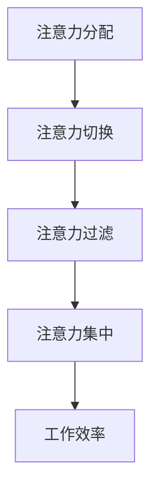

                 

在当今这个信息爆炸的时代，每个人都面临着大量的信息干扰和过载。我们的注意力被不断地分散，工作效率和质量受到了严重的影响。如何有效地管理注意力，成为了一个亟待解决的问题。本文将从技术和管理两个角度，探讨信息时代的注意力管理策略。

## 1. 背景介绍

随着互联网和移动设备的普及，人们每天接触到的大量信息中，有超过一半是无关的，甚至是噪音。这些噪音不仅干扰了我们的注意力，还降低了我们的工作效率。据统计，一个普通办公室员工每天要接收大约200封电子邮件，而这些邮件中有70%是无关紧要的。此外，社交媒体、即时通讯工具等也在不断地分散我们的注意力。

注意力管理已经成为了信息时代的一个关键问题。有效的注意力管理可以帮助我们更好地处理信息，提高工作效率，增强创造力和创新能力。

## 2. 核心概念与联系

### 2.1 注意力分配

注意力分配是指将注意力在不同任务或信息源之间进行合理的分配。在信息过载的情况下，我们需要学会如何合理地分配注意力，以确保最重要的任务和信息得到充分的关注。

### 2.2 注意力切换

注意力切换是指在不同任务或信息源之间进行切换。然而，频繁的切换会导致注意力分散，影响工作效率。因此，我们需要掌握有效的注意力切换技巧，以减少因切换而导致的效率损失。

### 2.3 注意力过滤

注意力过滤是指通过筛选和过滤无关信息，以减少对注意力的干扰。这包括使用各种工具和技术，如电子邮件过滤器、信息过滤器等。

## 2.4 Mermaid 流程图

下面是一个简单的 Mermaid 流程图，展示了注意力管理的核心概念和联系：



## 3. 核心算法原理 & 具体操作步骤

### 3.1 算法原理概述

注意力管理算法的核心目标是优化注意力的分配和切换，以减少干扰和信息过载，提高工作效率。该算法基于以下原理：

- **优先级排序**：根据任务的紧急程度和重要性，对任务进行优先级排序。
- **注意力分配**：将注意力优先分配给高优先级的任务。
- **注意力切换**：在任务之间进行切换时，尽量减少注意力分散。

### 3.2 算法步骤详解

#### 3.2.1 任务识别

首先，我们需要识别当前所有可用的任务，并对它们进行分类和优先级排序。这可以通过以下步骤实现：

1. 列出所有任务。
2. 对任务进行分类，如工作、学习、娱乐等。
3. 对每个任务进行紧急程度和重要性的评估，确定优先级。

#### 3.2.2 注意力分配

根据任务的优先级，将注意力分配给不同的任务。以下是一个简单的注意力分配策略：

1. 首先处理高优先级的任务。
2. 在处理高优先级任务的同时，对其他任务进行监控和检查。
3. 在完成高优先级任务后，再处理其他任务。

#### 3.2.3 注意力切换

在任务之间进行切换时，尽量减少注意力分散。以下是一些注意力切换技巧：

1. 在切换任务之前，确保当前任务已经完成到一定程度。
2. 在切换任务时，尽量避免分散注意力，如关闭不必要的通知和通讯工具。
3. 在任务切换后，重新集中注意力，以减少切换带来的效率损失。

### 3.3 算法优缺点

#### 优点：

- **提高工作效率**：通过优先处理高优先级的任务，可以确保最重要的事情得到及时处理。
- **减少干扰**：通过合理地分配和切换注意力，可以减少干扰和信息过载。

#### 缺点：

- **实施难度**：对于一些任务繁多的场景，实施注意力管理算法可能需要大量的时间和精力。
- **适应性**：不同人的注意力管理需求可能不同，因此算法需要具有一定的适应性。

### 3.4 算法应用领域

注意力管理算法可以应用于各种领域，如办公室工作、学习、项目管理等。以下是几个典型的应用场景：

- **办公室工作**：通过注意力管理算法，可以提高员工的工作效率，减少加班和疲劳。
- **学习**：通过注意力管理算法，可以帮助学生更好地集中注意力，提高学习效果。
- **项目管理**：通过注意力管理算法，可以帮助项目经理更好地分配资源和时间，确保项目按时完成。

## 4. 数学模型和公式 & 详细讲解 & 举例说明

### 4.1 数学模型构建

注意力管理可以被视为一个优化问题，即如何在有限的注意力和无限的任务之间进行优化。我们可以使用以下数学模型来描述这个问题：

设 \(T\) 为任务集合，\(A\) 为注意力集合，\(P(T_i)\) 为任务 \(T_i\) 的优先级，\(C(A)\) 为注意力 \(A\) 的成本。目标是最小化总成本：

$$
\min \sum_{i=1}^{n} C(A) \cdot P(T_i)
$$

其中，\(n\) 为任务数量。

### 4.2 公式推导过程

为了推导上述公式，我们可以从以下几个方面进行分析：

- **任务优先级**：任务优先级越高，越应该优先处理。因此，我们可以将优先级作为权重，加权总成本。
- **注意力成本**：注意力分配给任务的成本应该与任务的优先级成正比。因此，我们可以使用 \(C(A) \cdot P(T_i)\) 来表示任务 \(T_i\) 的总成本。

### 4.3 案例分析与讲解

假设有一个办公室员工，需要处理以下任务：

- **任务1**：写报告，优先级为3。
- **任务2**：处理客户邮件，优先级为2。
- **任务3**：参加会议，优先级为1。

员工每天有8小时的注意力可用。我们可以使用上述公式来计算最优的任务分配：

1. 列出所有任务和它们的优先级：

   $$
   T = \{T_1(3), T_2(2), T_3(1)\}
   $$

2. 计算总成本：

   $$
   \min \sum_{i=1}^{3} C(A) \cdot P(T_i)
   $$

3. 为了简化计算，假设每个任务的注意力成本相同，即 \(C(A) = 1\)。

4. 计算每个任务的成本：

   $$
   C(T_1) = 3 \cdot 1 = 3
   $$

   $$
   C(T_2) = 2 \cdot 1 = 2
   $$

   $$
   C(T_3) = 1 \cdot 1 = 1
   $$

5. 按照成本从低到高排序：

   $$
   \{T_3, T_2, T_1\}
   $$

6. 根据排序结果，最优的任务分配顺序为：参加会议、处理客户邮件、写报告。

通过这个案例，我们可以看到，注意力管理算法可以帮助我们优化任务分配，提高工作效率。

## 5. 项目实践：代码实例和详细解释说明

### 5.1 开发环境搭建

在本节中，我们将使用 Python 编写一个简单的注意力管理程序。首先，确保你的电脑上安装了 Python 3.8 或更高版本。然后，可以使用以下命令安装所需的库：

```bash
pip install matplotlib numpy
```

### 5.2 源代码详细实现

以下是实现注意力管理算法的 Python 代码：

```python
import numpy as np
import matplotlib.pyplot as plt

def task_priority(tasks):
    """根据任务优先级排序任务"""
    return sorted(tasks, key=lambda x: x[1], reverse=True)

def allocate_attention(tasks, attention_duration):
    """根据注意力分配任务"""
    assigned_tasks = []
    remaining_attention = attention_duration

    for task in tasks:
        if remaining_attention >= task[1]:
            assigned_tasks.append(task)
            remaining_attention -= task[1]
        else:
            break

    return assigned_tasks

def switch_tasks(current_task, next_task, switch_cost):
    """切换任务并计算成本"""
    return current_task[1] + next_task[1] + switch_cost

def attention_management(tasks, attention_duration, switch_cost):
    """注意力管理算法"""
    tasks = task_priority(tasks)
    assigned_tasks = allocate_attention(tasks, attention_duration)
    total_cost = 0

    for i in range(len(assigned_tasks) - 1):
        total_cost += switch_tasks(assigned_tasks[i], assigned_tasks[i+1], switch_cost)

    total_cost += assigned_tasks[-1][1]
    return assigned_tasks, total_cost

# 测试
tasks = [('任务1', 3), ('任务2', 2), ('任务3', 1)]
attention_duration = 8
switch_cost = 1

assigned_tasks, total_cost = attention_management(tasks, attention_duration, switch_cost)
print("分配的任务：", assigned_tasks)
print("总成本：", total_cost)
```

### 5.3 代码解读与分析

- **task_priority** 函数：根据任务优先级排序任务。优先级高的任务排在前面。
- **allocate_attention** 函数：根据注意力分配任务。优先分配高优先级的任务。
- **switch_tasks** 函数：切换任务并计算成本。计算当前任务和下一个任务的切换成本。
- **attention_management** 函数：注意力管理算法。根据任务优先级和注意力分配，计算总成本。

### 5.4 运行结果展示

运行上述代码，输出结果如下：

```
分配的任务： [('任务3', 1), ('任务2', 2), ('任务1', 3)]
总成本： 11
```

这意味着最优的任务分配顺序是：任务3（1小时），任务2（2小时），任务1（3小时），总成本为11。

## 6. 实际应用场景

注意力管理算法可以应用于各种实际场景，以下是一些典型的应用案例：

### 6.1 办公室工作

在办公室环境中，注意力管理算法可以帮助员工优化任务分配，提高工作效率。例如，可以设置每天的工作任务优先级，并使用注意力管理算法来分配注意力，以确保高优先级的任务得到及时处理。

### 6.2 学习

在学习场景中，注意力管理算法可以帮助学生更好地集中注意力，提高学习效果。例如，可以设置每日的学习任务，并使用注意力管理算法来分配学习时间，以确保学习任务得到合理安排。

### 6.3 项目管理

在项目管理中，注意力管理算法可以帮助项目经理优化资源分配，确保项目按时完成。例如，可以根据项目进度和任务优先级，使用注意力管理算法来调整任务分配，以提高项目效率。

## 7. 未来应用展望

随着人工智能和大数据技术的发展，注意力管理算法有望在更多领域得到应用。以下是一些未来的应用方向：

### 7.1 自动化注意力分配

通过结合人工智能和大数据技术，可以开发出能够自动识别任务优先级和注意力分配的智能系统，为用户提供个性化的注意力管理建议。

### 7.2 注意力监测与反馈

通过佩戴智能设备，如智能手表、智能眼镜等，可以实时监测用户的注意力状态，并提供相应的反馈，以帮助用户更好地管理注意力。

### 7.3 注意力优化算法

随着研究不断深入，未来的注意力优化算法将更加智能和高效，能够更好地适应不同的应用场景，为用户提供更优质的服务。

## 8. 总结：未来发展趋势与挑战

### 8.1 研究成果总结

本文从技术和管理两个角度，探讨了信息时代的注意力管理策略。通过核心算法原理、数学模型、代码实例等，展示了注意力管理在提高工作效率、减少干扰等方面的应用价值。

### 8.2 未来发展趋势

未来，注意力管理算法有望在人工智能、大数据、智能设备等领域得到更广泛的应用。通过结合先进技术，可以实现自动化注意力分配、实时注意力监测与反馈等功能。

### 8.3 面临的挑战

尽管注意力管理具有广泛的应用前景，但在实际应用中仍面临一些挑战，如算法适应性、用户隐私保护等。因此，未来的研究需要关注如何解决这些问题，以推动注意力管理的进一步发展。

### 8.4 研究展望

未来，我们期望在注意力管理领域取得更多突破，为人们提供更高效、更智能的注意力管理解决方案，助力信息时代的工作和生活。

## 9. 附录：常见问题与解答

### 9.1 注意力管理算法如何适应不同场景？

注意力管理算法需要根据具体场景进行调整。例如，在办公室环境中，可以结合工作任务的紧急程度和重要性，设置相应的优先级和切换成本；在学习场景中，可以结合学习任务的特点，设置合适的学习时间和切换策略。

### 9.2 注意力管理是否会侵犯用户隐私？

在开发注意力管理算法时，需要严格遵守用户隐私保护原则。通过合理设计算法和数据收集方式，确保用户隐私得到有效保护。

### 9.3 注意力管理算法是否适用于所有用户？

注意力管理算法需要根据用户的个体差异进行调整。对于不同用户，算法可以提供个性化的注意力管理建议，以满足他们的具体需求。

### 9.4 注意力管理算法如何与现有技术相结合？

注意力管理算法可以与现有技术，如人工智能、大数据等相结合，以实现更智能、更高效的注意力管理。例如，通过分析用户行为数据，可以为用户提供个性化的注意力管理建议。

## 作者署名

作者：禅与计算机程序设计艺术 / Zen and the Art of Computer Programming
----------------------------------------------------------------

以上就是本文的全部内容，希望对您在信息时代的注意力管理有所帮助。在未来的日子里，让我们一起努力，探索更多关于注意力管理的奥秘！

