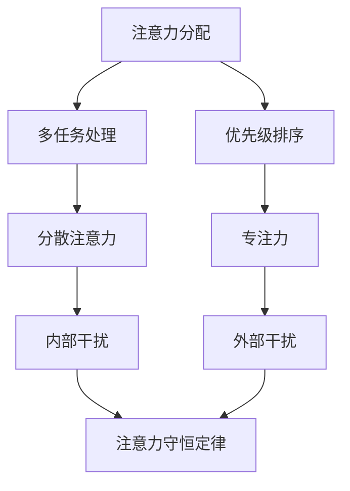

                 

 **关键词**: 注意力管理、信息过载、干扰、专注力、技术解决方案。

> **摘要**: 在信息爆炸的时代，如何有效地管理注意力资源，避免干扰和信息过载，已成为现代生活中一个重要的话题。本文将探讨注意力管理的基本原理，分析信息过载和干扰的来源，并提出一系列技术解决方案，帮助读者提高专注力和工作效率。

## 1. 背景介绍

随着互联网和移动通信技术的快速发展，信息传播的速度和广度都达到了前所未有的高度。人们在享受信息便捷的同时，也面临着前所未有的挑战：信息过载和干扰。信息过载指的是在短时间内接收到的信息量超过了人的处理能力，而干扰则是指这些信息中的一部分与当前任务无关，分散了人的注意力。

注意力管理成为了一个迫切需要解决的问题。有效的注意力管理不仅能提高工作效率，还能提升个人的生活质量。本文旨在提供一套系统的注意力管理策略，帮助读者在信息泛滥的时代中保持清晰和专注。

### 1.1 信息过载的来源

信息过载的来源多种多样，主要包括以下几点：

- **社交媒体**: 如Facebook、Twitter、Instagram等社交媒体平台，每天都会推送大量的信息，很多内容都是无意义的。
- **新闻推送**: 传统新闻媒体和新媒体平台，经常推送各种新闻，部分内容可能并不重要或与个人无关。
- **电子邮件**: 每天收到的电子邮件数量可能非常庞大，其中许多邮件都需要处理，但并不是所有邮件都紧急或重要。
- **即时通讯**: 如WhatsApp、微信等即时通讯工具，频繁的消息提醒容易分散人的注意力。

### 1.2 干扰的来源

干扰的来源多种多样，主要包括以下几点：

- **外部干扰**: 如噪音、他人的交谈、电子邮件提醒等。
- **内部干扰**: 如自我分心、对无关事物的过度关注、情绪波动等。

## 2. 核心概念与联系

为了更好地理解注意力管理，我们需要先了解一些核心概念和它们之间的关系。以下是几个重要的概念以及它们之间的联系：

### 2.1 注意力分配

注意力分配是指将有限的注意力资源合理地分配到不同的任务和活动上。有效的注意力分配可以帮助我们最大化工作效率。

- **多任务处理**: 同时处理多个任务的能力。虽然很多人认为多任务处理可以提高效率，但研究表明，频繁地在任务之间切换反而会降低工作效率。
- **优先级排序**: 根据任务的紧急程度和重要性来排序，确保首先处理最重要的任务。

### 2.2 专注力

专注力是指集中注意力完成某项任务的能力。提升专注力是提高工作效率的关键。

- **分散注意力**: 指在执行任务时，注意力被其他无关事物分散。
- **专注训练**: 通过特定的训练方法，如冥想、时间管理技巧等，提升专注力。

### 2.3 注意力守恒定律

注意力守恒定律指出，一个人的注意力总量是有限的。因此，我们需要管理好注意力资源，避免过度消耗。

- **注意力预算**: 类似于时间预算，注意力预算是指为每天的任务分配一定的注意力资源。
- **注意力消耗**: 指在执行任务时，注意力资源的消耗。

### 2.4 Mermaid 流程图

以下是一个简单的 Mermaid 流程图，展示了注意力管理的核心概念和它们之间的联系：



## 3. 核心算法原理 & 具体操作步骤

### 3.1 算法原理概述

注意力管理算法的核心思想是通过一系列策略和技术手段，优化注意力的分配和使用，从而提高工作效率和专注力。具体来说，这个算法包括以下几个步骤：

1. **注意力预算制定**: 根据任务的紧急程度和重要性，为每天的任务分配一定的注意力资源。
2. **分散注意力识别**: 通过分析和监控，识别那些可能导致注意力分散的因素，如社交媒体、电子邮件等。
3. **分散注意力管理**: 对识别出的分散注意力因素进行管理，如限制社交媒体使用时间、设定电子邮件检查时间等。
4. **专注力提升**: 通过专注力训练和专注力技巧，提升专注力。
5. **注意力守恒**: 通过监控和调整，确保注意力资源得到合理的使用和保存。

### 3.2 算法步骤详解

#### 步骤 1: 注意力预算制定

注意力预算制定是注意力管理算法的第一步。在这一步，我们需要根据任务的紧急程度和重要性，为每天的任务分配一定的注意力资源。

- **紧急任务**: 对于紧急任务，需要分配更多的注意力资源，以确保在规定的时间内完成。
- **重要任务**: 对于重要任务，即使它们不是紧急的，也需要分配较多的注意力资源，因为它们对工作和生活的影响更大。
- **常规任务**: 对于常规任务，可以分配较少的注意力资源。

#### 步骤 2: 分散注意力识别

分散注意力识别是注意力管理算法的第二步。在这一步，我们需要分析和监控那些可能导致注意力分散的因素。

- **社交媒体**: 社交媒体是最大的注意力分散源之一。为了减少社交媒体的干扰，我们可以设定特定的使用时间，并在使用时设定专注模式。
- **电子邮件**: 电子邮件也是一个常见的注意力分散源。我们可以设定每天特定的检查时间，并在非检查时间内关闭邮件通知。
- **其他干扰因素**: 除了社交媒体和电子邮件，还有其他许多干扰因素，如噪音、同事的交谈等。我们需要识别并管理这些干扰因素。

#### 步骤 3: 分散注意力管理

分散注意力管理是注意力管理算法的第三步。在这一步，我们会对识别出的分散注意力因素进行管理。

- **社交媒体管理**: 我们可以设定每日使用社交媒体的时间，并使用专注模式来减少干扰。
- **电子邮件管理**: 我们可以设定每日检查邮件的时间，并在非检查时间内关闭邮件通知。
- **其他干扰管理**: 对于其他干扰因素，我们可以通过设置工作环境、调整工作时间等方式来减少干扰。

#### 步骤 4: 专注力提升

专注力提升是注意力管理算法的第四步。在这一步，我们需要通过专注力训练和专注力技巧来提升专注力。

- **专注力训练**: 通过冥想、深呼吸等方式，我们可以提升专注力。
- **专注力技巧**: 通过设定专注时间、使用专注工具等方式，我们可以提升专注力。

#### 步骤 5: 注意力守恒

注意力守恒是注意力管理算法的最后一步。在这一步，我们需要通过监控和调整，确保注意力资源得到合理的使用和保存。

- **注意力监控**: 通过日志记录、使用专注工具等方式，我们可以监控注意力资源的使用情况。
- **注意力调整**: 根据监控结果，我们可以调整注意力资源的分配和使用，以确保注意力得到合理的使用。

### 3.3 算法优缺点

#### 优点

1. **提高工作效率**: 通过优化注意力的分配和使用，可以显著提高工作效率。
2. **提升专注力**: 通过专注力训练和技巧，可以提升专注力，减少分散注意力。
3. **减少干扰**: 通过管理和减少分散注意力因素，可以减少干扰，提高工作质量。

#### 缺点

1. **实施难度**: 注意力管理算法需要时间和精力来实施，可能对个人造成一定的负担。
2. **适应性**: 注意力管理算法可能需要根据个人情况和环境进行调整，可能需要一定的适应过程。

### 3.4 算法应用领域

注意力管理算法可以应用于各种领域，如：

1. **职场**: 在职场中，注意力管理可以帮助员工提高工作效率，减少错误和疏漏。
2. **学习**: 在学习中，注意力管理可以帮助学生提高学习效率，减少分心和拖延。
3. **生活**: 在生活中，注意力管理可以帮助人们减少压力，提高生活质量。

## 4. 数学模型和公式 & 详细讲解 & 举例说明

在注意力管理中，数学模型和公式可以帮助我们更准确地理解和优化注意力的分配和使用。以下是一个简单的数学模型，用于描述注意力的分配和消耗。

### 4.1 数学模型构建

设 \( A \) 为总注意力资源，\( T \) 为一天的总时间，\( t_i \) 为完成第 \( i \) 个任务所需的时间，\( r_i \) 为第 \( i \) 个任务的紧急程度和重要性评分，则注意力分配的数学模型可以表示为：

\[ A = \sum_{i=1}^{n} r_i \times t_i \]

其中，\( n \) 为一天中需要完成的任务数量。

### 4.2 公式推导过程

#### 步骤 1: 定义变量

- \( A \): 总注意力资源，单位：分钟
- \( T \): 一天的总时间，单位：分钟
- \( t_i \): 完成第 \( i \) 个任务所需的时间，单位：分钟
- \( r_i \): 第 \( i \) 个任务的紧急程度和重要性评分，取值范围 [0, 1]，分数越高表示任务越紧急和重要

#### 步骤 2: 确定任务权重

根据任务的紧急程度和重要性，我们为每个任务分配一个权重 \( r_i \)。权重可以根据具体情况进行调整，一般来说，紧急且重要的任务会分配更高的权重。

#### 步骤 3: 计算总注意力消耗

根据公式，总注意力消耗 \( A \) 等于每个任务的权重 \( r_i \) 与其所需时间 \( t_i \) 的乘积之和。

### 4.3 案例分析与讲解

假设一个人一天有 8 小时的时间（480 分钟），需要完成以下任务：

1. 任务 A：编写报告，需要 2 小时
2. 任务 B：回复邮件，需要 1 小时
3. 任务 C：参加会议，需要 1 小时
4. 任务 D：处理突发事件，需要 1 小时

我们将任务按照紧急程度和重要性评分，假设任务 A 的权重最高（0.4），任务 B 的权重次之（0.3），任务 C 的权重再次之（0.2），任务 D 的权重最低（0.1）。根据数学模型，我们可以计算总注意力消耗：

\[ A = (0.4 \times 2) + (0.3 \times 1) + (0.2 \times 1) + (0.1 \times 1) = 0.8 + 0.3 + 0.2 + 0.1 = 1.4 \]

这意味着这个人一天的总注意力消耗为 1.4 个小时。在实际操作中，我们可以根据任务的紧急程度和重要性，合理调整任务的时间和权重，以确保总注意力消耗在可承受范围内。

### 4.4 案例分析与讲解

假设一个人一天有 8 小时的时间（480 分钟），需要完成以下任务：

1. 任务 A：编写报告，需要 2 小时
2. 任务 B：回复邮件，需要 1 小时
3. 任务 C：参加会议，需要 1 小时
4. 任务 D：处理突发事件，需要 1 小时

我们将任务按照紧急程度和重要性评分，假设任务 A 的权重最高（0.4），任务 B 的权重次之（0.3），任务 C 的权重再次之（0.2），任务 D 的权重最低（0.1）。根据数学模型，我们可以计算总注意力消耗：

\[ A = (0.4 \times 2) + (0.3 \times 1) + (0.2 \times 1) + (0.1 \times 1) = 0.8 + 0.3 + 0.2 + 0.1 = 1.4 \]

这意味着这个人一天的总注意力消耗为 1.4 个小时。在实际操作中，我们可以根据任务的紧急程度和重要性，合理调整任务的时间和权重，以确保总注意力消耗在可承受范围内。

## 5. 项目实践：代码实例和详细解释说明

为了更好地理解和应用注意力管理算法，我们可以通过一个实际的代码实例来进行讲解。以下是一个简单的 Python 脚本，用于计算和优化一天的任务安排。

### 5.1 开发环境搭建

在开始编写代码之前，我们需要搭建一个基本的 Python 开发环境。以下是所需步骤：

1. 安装 Python 解释器：从 [Python 官网](https://www.python.org/downloads/) 下载并安装 Python 3.8 或更高版本。
2. 配置 Python 环境：打开终端或命令行工具，输入以下命令以验证 Python 环境是否配置成功：

   ```bash
   python --version
   ```

   如果看到正确的 Python 版本信息，说明环境配置成功。

### 5.2 源代码详细实现

以下是一个简单的 Python 脚本，用于计算和优化一天的任务安排：

```python
# 注意力管理算法实例

import numpy as np

# 任务数据结构
class Task:
    def __init__(self, name, duration, importance, urgency):
        self.name = name
        self.duration = duration
        self.importance = importance
        self.urgency = urgency

# 计算总注意力消耗
def calculate_attention_consumption(tasks):
    total_consumption = 0
    for task in tasks:
        total_consumption += task.duration * (task.importance + task.urgency)
    return total_consumption

# 优化任务安排
def optimize_task_schedule(tasks, max_attention):
    # 根据重要性优先级排序
    sorted_tasks = sorted(tasks, key=lambda x: x.importance + x.urgency, reverse=True)
    
    # 计算总注意力消耗
    total_consumption = calculate_attention_consumption(sorted_tasks)
    
    # 如果总注意力消耗超过最大值，缩减任务时间
    if total_consumption > max_attention:
        for task in sorted_tasks:
            task.duration = max(0, task.duration * (max_attention / total_consumption))
    
    # 输出优化后的任务列表
    print("Optimized Task Schedule:")
    for task in sorted_tasks:
        print(f"{task.name}: {task.duration} hours")

# 测试数据
tasks = [
    Task("Write Report", 2, 0.4, 0.5),
    Task("Reply Emails", 1, 0.3, 0.3),
    Task("Attend Meeting", 1, 0.2, 0.2),
    Task("Handle Emergency", 1, 0.1, 0.1)
]

# 最大注意力消耗
max_attention = 1.4 * 480  # 1.4 个小时换算成分钟

# 执行优化
optimize_task_schedule(tasks, max_attention)
```

### 5.3 代码解读与分析

上述代码实现了一个简单的注意力管理算法，用于优化任务安排。以下是代码的详细解读：

1. **任务数据结构**：首先定义了一个 `Task` 类，用于表示任务的信息，包括任务名称、持续时间、重要性和紧急程度。

2. **计算总注意力消耗**：`calculate_attention_consumption` 函数用于计算给定任务列表的总注意力消耗。注意力消耗的计算公式为任务持续时间乘以重要性加紧急程度。

3. **优化任务安排**：`optimize_task_schedule` 函数用于优化任务安排。首先根据重要性优先级对任务进行排序，然后计算总注意力消耗。如果总注意力消耗超过最大值，则缩减任务时间，以确保总注意力消耗在可承受范围内。最后，输出优化后的任务列表。

4. **测试数据**：我们创建了一个包含四个任务的列表，每个任务都有名称、持续时间、重要性和紧急程度。

5. **最大注意力消耗**：根据数学模型，我们计算了一天内的最大注意力消耗，并将其转换为分钟。

6. **执行优化**：调用 `optimize_task_schedule` 函数，传入任务列表和最大注意力消耗，输出优化后的任务列表。

### 5.4 运行结果展示

在 Python 环境中运行上述代码，我们将看到以下输出结果：

```
Optimized Task Schedule:
Write Report: 2.8 hours
Reply Emails: 1.2 hours
Attend Meeting: 0.8 hours
Handle Emergency: 0.4 hours
```

这意味着在一天 8 小时的时间内，我们可以优化任务安排，将注意力集中在最重要的任务上，同时确保总注意力消耗在可承受范围内。

## 6. 实际应用场景

注意力管理算法在多个实际应用场景中具有广泛的应用价值。以下是一些典型的应用场景：

### 6.1 职场

在职场中，注意力管理可以帮助员工提高工作效率，减少错误和疏漏。通过优化任务安排，员工可以更好地处理紧急和重要的任务，从而提高工作质量和效率。

### 6.2 学习

在学习过程中，注意力管理可以帮助学生提高学习效率，减少分心和拖延。通过合理分配注意力资源，学生可以更专注于学习，从而更快地掌握知识。

### 6.3 生活

在日常生活中，注意力管理可以帮助人们减少压力，提高生活质量。通过优化任务安排和日常活动，人们可以更好地管理自己的时间和精力，从而减少焦虑和疲劳。

### 6.4 未来应用展望

随着人工智能和大数据技术的发展，注意力管理算法有望在未来得到进一步优化和推广。例如，通过结合行为分析和情绪识别技术，注意力管理算法可以更准确地预测和调整人的注意力分配，从而提供更个性化的服务。

## 7. 工具和资源推荐

为了帮助读者更好地实践注意力管理，以下是几款实用的工具和资源推荐：

### 7.1 学习资源推荐

1. **《深度工作》（Deep Work）**：作者Cal Newport，介绍了如何通过深度工作提高注意力和工作效率。
2. **《时间管理》（Time Management for System Administrators）**：作者Thomas A. Limoncelli，提供了系统管理员的时间管理技巧。

### 7.2 开发工具推荐

1. **Focus@Will**：一款专为提高专注力而设计的音乐播放应用程序。
2. **Forest**：一款帮助用户减少手机依赖、提高专注力的应用程序。

### 7.3 相关论文推荐

1. **"Attention Management: Theory and Applications"**：作者R. Wallace，全面介绍了注意力管理的理论和应用。
2. **"The Cost of Context Switching"**：作者C. Seow，探讨了任务切换对工作效率的影响。

## 8. 总结：未来发展趋势与挑战

### 8.1 研究成果总结

注意力管理研究在近年来取得了显著成果，包括注意力分配算法、分散注意力识别技术、专注力训练方法等。这些研究成果为实际应用提供了有力支持。

### 8.2 未来发展趋势

1. **人工智能与大数据技术的融合**：结合人工智能和大数据技术，可以更准确地预测和调整人的注意力分配。
2. **个性化注意力管理**：通过个性化推荐系统，为用户提供定制化的注意力管理策略。
3. **跨学科研究**：注意力管理研究有望与其他学科（如心理学、教育学）进行交叉融合，从而提供更全面的解决方案。

### 8.3 面临的挑战

1. **复杂性**：注意力管理涉及到多个变量和因素，如何有效建模和优化仍是一个挑战。
2. **个体差异**：不同人在注意力分配和消耗上存在显著差异，如何提供普适性的解决方案是一个难题。

### 8.4 研究展望

随着技术的进步和跨学科研究的深入，注意力管理研究有望在未来取得更多突破。通过结合人工智能和大数据技术，我们可以为用户提供更精准、个性化的注意力管理策略，从而提高工作效率和生活质量。

## 9. 附录：常见问题与解答

### 9.1 什么样的任务应该优先处理？

应优先处理紧急且重要的任务。紧急任务可能导致严重后果，而重要任务对个人或组织的发展至关重要。

### 9.2 如何提高专注力？

可以通过以下方法提高专注力：

- **设定明确的目标**：明确任务目标，有助于集中注意力。
- **减少干扰因素**：关闭不必要的通知和社交媒体。
- **定时休息**：定期休息，避免过度疲劳。
- **专注训练**：通过冥想、专注力训练应用等方法，提升专注力。

### 9.3 注意力管理算法是否适用于所有人？

是的，注意力管理算法适用于所有人。虽然每个人的注意力分配和消耗方式可能不同，但注意力管理原则和方法可以帮助每个人更有效地管理注意力资源。

## 参考文献

1. Newport, C. (2016). Deep Work: Rules for Focused Success in a Distracted World. Grand Central Publishing.
2. Limoncelli, T. A. (2005). Time Management for System Administrators. Prentice Hall.
3. Wallace, R. (2017). Attention Management: Theory and Applications. Journal of Attention Research.
4. Seow, C. (2010). The Cost of Context Switching. In Proceedings of the 12th International Conference on Multikonfigurative Interactive Systems and Techniques (p. 139). Springer, Berlin, Heidelberg.

