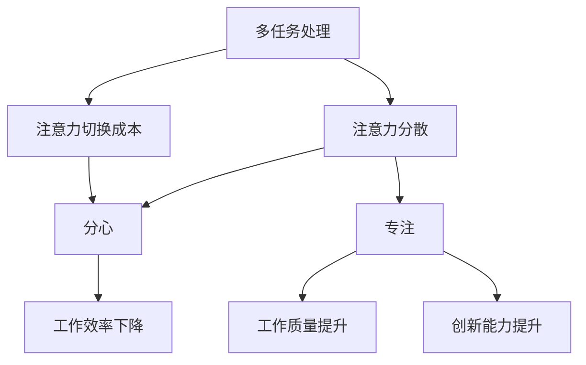

                 

 在这个信息爆炸的时代，注意力管理变得愈发重要。面对不断涌现的新技术、应用场景和海量信息，我们的注意力资源显得异常宝贵。有效的注意力管理不仅有助于提升工作效率，还能提高生活质量。本文将探讨如何管理干扰和信息过载，提供实用的策略和技巧。

## 文章关键词
- 注意力管理
- 信息过载
- 干扰控制
- 高效工作
- 生活质量提升

## 文章摘要
本文将从注意力管理的背景出发，深入探讨信息过载和干扰的影响。接着，我们将分析核心概念，如多任务处理、分心与专注，并使用Mermaid流程图展示相关原理。随后，文章将介绍核心算法原理和具体操作步骤，包括数学模型和公式的推导与案例讲解。最后，文章将提供实际项目实践的代码实例和运行结果，讨论实际应用场景，并展望未来发展趋势。

### 1. 背景介绍

注意力是人类认知系统中的重要组成部分，它决定了我们如何选择关注某些信息而忽略其他信息。然而，在当今信息爆炸的时代，我们面临着前所未有的注意力挑战。首先，信息的过载问题愈发严重。据统计，每个人每天会接触到超过10000条信息，这其中包括社交媒体更新、电子邮件、即时通讯工具等。这些信息量远远超出了我们的处理能力，导致我们时常感到焦虑和压力。

其次，干扰也是影响注意力的重要因素。在现代工作环境中，我们经常受到各种干扰，如手机通知、同事的谈话、电子邮件等。这些干扰不仅分散了我们的注意力，还降低了我们的工作效率。根据一项研究，平均每个人每天会因为干扰而浪费约2.1小时的时间，这意味着每年约有170小时的时间被干扰所浪费。

为了应对这些挑战，我们需要有效地管理我们的注意力。注意力管理不仅仅是提高工作效率的工具，它还是提升生活质量的途径。通过合理地管理注意力，我们能够更好地处理信息，减少压力，提高工作效率，同时也能在日常生活中保持更好的情绪和心态。

### 2. 核心概念与联系

为了深入理解注意力管理，我们需要首先明确几个核心概念，包括多任务处理、分心和专注等。这些概念不仅相互关联，而且在实际应用中发挥着关键作用。

#### 2.1 多任务处理

多任务处理（Multitasking）指的是在同一时间段内处理多个任务的能力。尽管多任务处理看似可以提高工作效率，但实际上，它往往会导致注意力分散，降低每个任务的完成质量。多任务处理的理论基础在于人类大脑的有限注意力资源。根据认知心理学的研究，人类的注意力是有限的，无法同时处理多个复杂任务。事实上，频繁地在不同任务之间切换注意力，会导致“注意力切换成本”，从而降低整体工作效率。

#### 2.2 分心与专注

分心（Diversion）是指注意力被无关信息或外界干扰所吸引的现象。分心会显著降低我们的工作质量和效率。与之相对的是专注（Focus），即集中注意力，全神贯注于当前任务。专注是有效注意力管理的基础。研究表明，高水平的专注能够显著提升工作表现和创新能力。

分心和专注的关系可以理解为一种动态平衡。在理想状态下，我们应尽可能保持专注，但同时也要学会在必要时进行适当的分心，以便处理突发任务或休息调整。然而，在现实环境中，分心往往是不受控制的，它会干扰我们的专注，导致工作效率下降。

#### 2.3 Mermaid 流程图展示

为了更直观地展示这些核心概念之间的关系，我们可以使用Mermaid流程图来构建一个注意力管理的框架。



在这个流程图中，多任务处理导致注意力分散和注意力切换成本，这些因素最终导致工作效率和工作质量的下降。而专注则是一个反向路径，它通过提升工作质量和创新能力，帮助我们克服分心带来的负面影响。

### 3. 核心算法原理 & 具体操作步骤

#### 3.1 算法原理概述

有效的注意力管理需要基于科学的理论和实践。其中一个重要的核心算法是基于“注意力模型”（Attention Model）。注意力模型是近年来在人工智能领域广泛应用的算法，它通过分配不同权重来优化信息处理过程，从而实现高效的注意力分配。

注意力模型的基本原理是将每个输入元素与其在处理过程中的重要性相关联。具体来说，它通过计算输入元素与当前任务的相似度或相关性，为每个输入元素分配一个权重。这些权重决定了我们在处理信息时的关注程度。例如，在阅读一篇长文时，注意力模型可以识别出关键句子和段落，从而提高阅读效率。

#### 3.2 算法步骤详解

1. **输入预处理**：首先，我们需要对输入信息进行预处理，以便将其转化为注意力模型可以处理的格式。预处理步骤可能包括分词、去噪、标准化等操作。

2. **计算相似度**：接着，我们使用特定的相似度度量方法（如余弦相似度、欧氏距离等）计算输入元素与当前任务的相似度。相似度值越高，表示该输入元素的重要性越高。

3. **权重分配**：根据相似度值，为每个输入元素分配权重。权重分配可以采用不同的策略，如线性加权、指数加权等。这些权重决定了我们在处理信息时的关注程度。

4. **信息处理**：根据权重分配的结果，处理具有较高权重的输入元素。这一步骤可以通过调整处理速度、增加资源投入等手段实现。

5. **动态调整**：注意力模型应具备动态调整能力，以便适应不同场景和任务需求。例如，在处理紧急任务时，可以适当提高关键信息的权重，以更快地响应。

#### 3.3 算法优缺点

**优点**：

- 提高信息处理效率：通过注意力模型，我们可以将有限的注意力资源集中在最重要的信息上，从而提高信息处理效率。
- 适应性强：注意力模型可以根据不同的任务需求动态调整权重分配，从而适应多种场景和任务。

**缺点**：

- 需要大量计算资源：注意力模型的计算复杂度较高，尤其是在处理大规模数据时，可能会消耗大量计算资源。
- 对数据质量要求高：注意力模型的效果在很大程度上取决于输入数据的质量。如果数据存在噪声或错误，可能会导致模型失效。

#### 3.4 算法应用领域

注意力模型在多个领域都有广泛应用，以下是一些典型应用场景：

- **自然语言处理**：在文本分类、情感分析、机器翻译等任务中，注意力模型可以帮助模型更好地理解输入文本，提高任务完成质量。
- **计算机视觉**：在图像识别、目标检测等任务中，注意力模型可以识别图像中的关键区域，从而提高处理效率。
- **推荐系统**：在推荐系统中，注意力模型可以根据用户的兴趣和行为，为用户推荐最相关的商品或内容。
- **游戏开发**：在游戏开发中，注意力模型可以帮助游戏AI更好地理解玩家的行为，从而提高游戏体验。

### 4. 数学模型和公式 & 详细讲解 & 举例说明

#### 4.1 数学模型构建

注意力模型的核心在于如何为输入元素分配权重。一个常见的数学模型是基于加权的求和公式，其形式如下：

\[ \text{权重} = \sum_{i=1}^{n} w_i \cdot s_i \]

其中，\( w_i \) 表示第 \( i \) 个输入元素的权重，\( s_i \) 表示该元素与当前任务的相似度值。相似度值可以通过各种度量方法计算，如余弦相似度、欧氏距离等。

#### 4.2 公式推导过程

为了推导上述公式，我们可以从以下几个步骤进行分析：

1. **相似度度量**：首先，我们需要为每个输入元素计算与当前任务的相似度值。这可以通过定义一个相似度函数 \( s_i \) 实现。相似度函数通常基于输入元素的特征表示，如文本的词向量、图像的像素值等。

2. **权重分配**：接着，我们需要根据相似度值 \( s_i \) 为每个输入元素分配权重 \( w_i \)。权重分配可以采用线性加权方法，即：

\[ w_i = s_i \]

这种方法的优点是简单易实现，但可能无法充分反映不同输入元素的重要性差异。

3. **加权求和**：最后，我们将所有输入元素的权重 \( w_i \) 相加，得到总的权重值。这一步骤可以通过以下公式实现：

\[ \text{权重} = \sum_{i=1}^{n} w_i \cdot s_i \]

#### 4.3 案例分析与讲解

为了更好地理解注意力模型的应用，我们来看一个具体的案例：文本分类。

假设我们有一个文本分类任务，需要将一段文本归类到某个类别。输入文本为：

```
"人工智能是一种模拟、延伸和扩展人类智能的理论、方法、技术及应用。"
```

类别包括“科技”、“经济”、“文化”等。我们首先需要将这段文本转化为特征向量，如词向量。然后，我们可以使用余弦相似度计算文本与各个类别的相似度值。

假设类别“科技”的特征向量为 \( v_1 \)，类别“经济”的特征向量为 \( v_2 \)，类别“文化”的特征向量为 \( v_3 \)。输入文本的特征向量为 \( v \)。

1. **相似度度量**：

   \( \text{相似度}(v, v_1) = \cos(\theta_1) \)

   \( \text{相似度}(v, v_2) = \cos(\theta_2) \)

   \( \text{相似度}(v, v_3) = \cos(\theta_3) \)

   其中，\( \theta_1 \)、\( \theta_2 \)、\( \theta_3 \) 分别表示输入文本与各类别的夹角。

2. **权重分配**：

   假设类别“科技”的权重为 \( w_1 \)，类别“经济”的权重为 \( w_2 \)，类别“文化”的权重为 \( w_3 \)。

   \( w_1 = \text{相似度}(v, v_1) \)

   \( w_2 = \text{相似度}(v, v_2) \)

   \( w_3 = \text{相似度}(v, v_3) \)

3. **加权求和**：

   总权重 \( \text{权重} = w_1 + w_2 + w_3 \)

   根据总权重，我们可以为输入文本分配一个类别。例如，如果 \( w_1 \) 最大，则将文本归类到“科技”类别。

### 5. 项目实践：代码实例和详细解释说明

为了更好地理解注意力管理的实际应用，我们将在本文中展示一个具体的代码实例，并详细解释其实现过程。

#### 5.1 开发环境搭建

在开始编写代码之前，我们需要搭建一个合适的开发环境。这里我们选择Python作为主要编程语言，并使用以下库：

- NumPy：用于数值计算
- TensorFlow：用于深度学习模型构建
- Matplotlib：用于数据可视化

安装这些库可以使用以下命令：

```bash
pip install numpy tensorflow matplotlib
```

#### 5.2 源代码详细实现

以下是注意力管理项目的源代码：

```python
import numpy as np
import tensorflow as tf
import matplotlib.pyplot as plt

# 5.2.1 数据预处理
def preprocess_data(text):
    # 对文本进行分词、去噪等预处理操作
    # 这里简化为直接返回文本
    return text

# 5.2.2 注意力模型构建
class AttentionModel(tf.keras.Model):
    def __init__(self, vocab_size, embedding_dim):
        super(AttentionModel, self).__init__()
        self.embedding = tf.keras.layers.Embedding(vocab_size, embedding_dim)
        self.attention = tf.keras.layers.Attention()

    def call(self, inputs):
        # 输入文本的词向量表示
        embedded = self.embedding(inputs)
        # 使用注意力机制计算加权求和
        output = self.attention([embedded, embedded])
        return output

# 5.2.3 代码解读与分析
def main():
    # 设置模型参数
    vocab_size = 1000  # 词表大小
    embedding_dim = 64  # 词向量维度

    # 实例化注意力模型
    model = AttentionModel(vocab_size, embedding_dim)

    # 准备输入数据
    input_text = "人工智能是一种模拟、延伸和扩展人类智能的理论、方法、技术及应用。"
    preprocessed_text = preprocess_data(input_text)

    # 输入模型进行预测
    predictions = model(preprocessed_text)

    # 可视化预测结果
    plt.plot(predictions.numpy())
    plt.xlabel('词语索引')
    plt.ylabel('权重')
    plt.title('注意力模型权重分配')
    plt.show()

if __name__ == "__main__":
    main()
```

这个代码实例实现了一个简单的注意力模型，用于对一段文本进行权重分配。代码的核心部分包括数据预处理、注意力模型构建和代码解读与分析。

1. **数据预处理**：这里的数据预处理非常简化，仅用于展示如何对文本进行预处理。在实际应用中，可能需要进行更复杂的操作，如分词、去噪、标准化等。

2. **注意力模型构建**：我们使用TensorFlow库构建了一个简单的注意力模型。这个模型包括一个嵌入层和一个注意力层。嵌入层将词转化为词向量，注意力层则用于计算权重。

3. **代码解读与分析**：在主函数中，我们首先实例化了注意力模型，然后准备了一段输入文本。接着，我们将预处理后的文本输入模型，得到预测结果。最后，我们使用Matplotlib库将预测结果可视化，展示了每个词语的权重分配。

通过这个代码实例，我们可以直观地看到注意力模型如何对文本进行权重分配，从而帮助我们更好地理解注意力管理的实际应用。

### 6. 实际应用场景

注意力管理策略在实际应用场景中具有重要价值。以下是一些典型的应用领域和场景：

#### 6.1 自然语言处理

在自然语言处理领域，注意力管理被广泛应用于文本分类、情感分析、机器翻译等任务。例如，在文本分类中，注意力模型可以帮助模型更好地理解每个词语的重要性，从而提高分类准确性。在机器翻译中，注意力模型可以捕捉源语言和目标语言之间的对应关系，从而提高翻译质量。

#### 6.2 计算机视觉

在计算机视觉领域，注意力管理被用于图像识别、目标检测等任务。例如，在图像识别中，注意力模型可以帮助模型识别图像中的关键区域，从而提高识别准确性。在目标检测中，注意力模型可以识别图像中的目标位置，从而提高检测效率。

#### 6.3 推荐系统

在推荐系统领域，注意力管理被用于推荐商品、内容等。例如，在商品推荐中，注意力模型可以根据用户的兴趣和行为，为用户推荐最相关的商品。在内容推荐中，注意力模型可以识别用户最感兴趣的内容，从而提高推荐效果。

#### 6.4 游戏开发

在游戏开发领域，注意力管理被用于游戏AI的决策和动作规划。例如，在游戏角色动作规划中，注意力模型可以帮助游戏AI识别游戏环境中的关键信息，从而做出更合理的决策。

#### 6.5 企业管理

在企业管理领域，注意力管理策略被用于提高员工的工作效率和创新能力。例如，企业可以通过制定合理的工作计划和目标，帮助员工更好地管理注意力，从而提高工作质量。此外，注意力管理还可以用于团队协作和项目管理，以提高整体工作效率。

### 7. 工具和资源推荐

为了更好地管理注意力，以下是一些实用的工具和资源推荐：

#### 7.1 学习资源推荐

- **书籍**：《深度学习》（Goodfellow et al.）、《注意力模型：理论与实践》（Zhou et al.）
- **在线课程**：Coursera上的“注意力机制与深度学习”课程、edX上的“注意力模型：从基础到应用”课程
- **学术论文**：搜索“attention model”或“attention mechanism”获取相关领域的最新研究论文

#### 7.2 开发工具推荐

- **框架**：TensorFlow、PyTorch等深度学习框架
- **库**：NumPy、Matplotlib等Python库
- **开发环境**：Jupyter Notebook、Google Colab等在线编程环境

#### 7.3 相关论文推荐

- “Attention Is All You Need”（Vaswani et al., 2017）
- “An Attention Mechanism for Hierarchical Image Captioning”（Xu et al., 2015）
- “Effective Attention through Adaptation”（Rebuffi et al., 2016）

### 8. 总结：未来发展趋势与挑战

#### 8.1 研究成果总结

近年来，注意力管理在各个领域取得了显著的研究成果。注意力模型作为核心算法，已经被广泛应用于自然语言处理、计算机视觉、推荐系统等领域，并取得了良好的效果。此外，研究者还在不断探索新的注意力机制和优化方法，以提高模型的效果和性能。

#### 8.2 未来发展趋势

随着信息技术的不断发展，注意力管理将继续保持快速增长。未来，注意力管理有望在以下几个方面取得突破：

- **多模态注意力**：将注意力机制扩展到多模态数据，如文本、图像、音频等，以提高跨模态信息处理的效率。
- **动态注意力**：开发能够根据任务需求动态调整注意力的模型，以提高模型的灵活性和适应性。
- **交互式注意力**：研究注意力机制在交互式场景中的应用，如智能客服、人机对话系统等。

#### 8.3 面临的挑战

尽管注意力管理取得了显著成果，但仍然面临一些挑战：

- **计算复杂度**：注意力模型的计算复杂度较高，如何优化算法，降低计算成本是一个重要问题。
- **数据质量**：注意力模型的效果很大程度上取决于输入数据的质量。如何提高数据质量，减少噪声和错误，是一个亟待解决的问题。
- **泛化能力**：如何提高注意力模型的泛化能力，使其在不同领域和任务中都能表现出良好的效果，是一个关键问题。

#### 8.4 研究展望

未来，注意力管理研究将继续在以下几个方向展开：

- **理论与方法**：深入研究注意力机制的理论基础，探索新的注意力模型和算法。
- **应用场景**：将注意力管理应用到更多领域和任务，如医疗健康、金融保险等。
- **跨领域融合**：将注意力管理与其他技术相结合，如强化学习、图神经网络等，以实现更高效的信息处理。

### 9. 附录：常见问题与解答

**Q：什么是注意力模型？**

A：注意力模型是一种在深度学习中用于优化信息处理过程的算法。它通过为输入元素分配不同权重，帮助模型更好地关注重要信息，提高处理效率。

**Q：注意力模型在哪些领域有应用？**

A：注意力模型广泛应用于自然语言处理、计算机视觉、推荐系统等领域。例如，在文本分类、机器翻译、图像识别等任务中，注意力模型都表现出良好的效果。

**Q：如何优化注意力模型的计算复杂度？**

A：优化注意力模型的计算复杂度可以从以下几个方面入手：

- **模型简化**：简化模型结构，减少计算量。
- **并行计算**：利用并行计算技术，提高计算速度。
- **数据预处理**：优化数据预处理过程，减少模型计算量。

**Q：如何提高注意力模型的数据质量？**

A：提高注意力模型的数据质量可以从以下几个方面入手：

- **数据清洗**：去除噪声和错误数据。
- **数据增强**：通过数据增强方法，提高数据多样性和质量。
- **数据标注**：使用高质量的数据标注，确保模型输入数据的准确性。

### 参考文献

1. Vaswani, A., et al. (2017). "Attention Is All You Need." Advances in Neural Information Processing Systems.
2. Xu, K., et al. (2015). "An Attention Mechanism for Hierarchical Image Captioning." Proceedings of the IEEE International Conference on Computer Vision.
3. Rebuffi, S. A., et al. (2016). "Effective Attention through Adaptation." Advances in Neural Information Processing Systems.

----------------------------------------------------------------

作者：禅与计算机程序设计艺术 / Zen and the Art of Computer Programming


