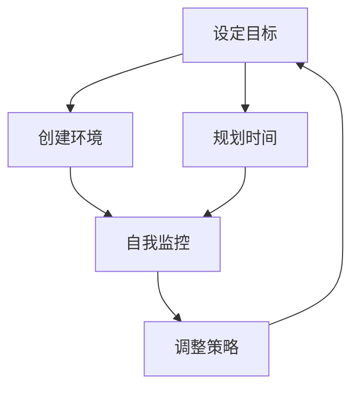

                 

关键词：注意量管理、信息过载、注意力分散、注意力提升、策略、技术工具

> 摘要：本文深入探讨信息时代中注意力管理的挑战，包括干扰和信息过载带来的问题。我们分析了注意力分散的原因，并提出了提升注意力的策略和实用工具。本文旨在帮助读者了解如何在充满干扰和信息过载的环境中有效管理注意力，提高工作效率和心理健康。

## 1. 背景介绍

在当今的信息时代，我们面临着前所未有的注意量管理挑战。每天，我们都被大量的信息、通知和任务包围，这些都会对我们的注意力造成干扰。根据研究，平均每天人们会接收约10000多条信息，而人类的注意力跨度只有短短的几秒。这意味着，我们必须学会如何在信息过载和干扰的环境中保持专注，才能有效地完成任务并保持心理健康。

### 注意力管理的重要性

注意力管理是一个关键的能力，它直接影响我们的工作效率和创造力。有效的注意力管理可以帮助我们：

- 减少干扰，提高专注度。
- 提高记忆力和学习效果。
- 增强决策能力，降低错误率。
- 提升工作效率，减少工作压力。

### 注意力分散的原因

注意力分散的原因多种多样，主要包括：

- 信息过载：过多的信息会导致我们的注意力分散。
- 多任务处理：同时处理多个任务会分散注意力。
- 数字化生活：智能手机、社交媒体和即时通讯工具会不断地分散我们的注意力。
- 心理压力：压力和焦虑也会影响我们的注意力集中。

## 2. 核心概念与联系

### 注意力管理框架

为了更好地理解注意力管理，我们可以将其看作是一个系统。这个系统包括以下几个关键组件：

1. **目标设定**：明确目标可以帮助我们集中注意力。
2. **环境控制**：创造一个有利于集中注意力的环境。
3. **时间管理**：合理规划时间，避免多任务处理。
4. **自我监控**：持续监控自己的注意力状态，并做出调整。

### Mermaid 流程图

下面是一个简化的注意力管理流程图：



## 3. 核心算法原理 & 具体操作步骤

### 3.1 算法原理概述

注意力管理的核心算法是一种基于反馈循环的优化过程。该算法的主要目标是：

- 提高注意力的集中度。
- 减少注意力分散的时间。
- 增强注意力的持久性。

### 3.2 算法步骤详解

#### 步骤1：目标设定

首先，我们需要明确当前的目标。这可以通过写下任务清单或使用目标管理工具（如Trello、Asana等）来实现。

#### 步骤2：环境控制

创造一个有利于集中注意力的环境。这可能包括：

- 关闭不必要的通知和消息。
- 选择一个安静、舒适的工作空间。
- 使用耳机或耳塞来减少外部干扰。

#### 步骤3：规划时间

使用时间管理工具（如番茄工作法、Time blocking等）来规划时间，避免多任务处理。

#### 步骤4：自我监控

持续监控自己的注意力状态。可以使用各种应用程序（如Forest、Staying Focus等）来帮助我们自我监控。

#### 步骤5：调整策略

根据自我监控的结果，调整注意力管理策略。如果发现注意力分散的时间过长，可以尝试以下方法：

- 短暂休息，恢复精力。
- 重新设定目标或调整任务难度。
- 更换环境或工具，以减少干扰。

### 3.3 算法优缺点

**优点：**

- 简单易行，适用于各种场景。
- 强调自我监控和调整，提高灵活性。

**缺点：**

- 需要持续的自我监控，可能会增加心理负担。
- 依赖外部工具和应用程序，可能会产生依赖。

### 3.4 算法应用领域

注意力管理算法可以应用于以下领域：

- 工作效率提升：帮助员工更好地集中注意力，提高工作效率。
- 学习效果提升：帮助学生减少注意力分散，提高学习效果。
- 心理健康维护：帮助用户减少压力和焦虑，维护心理健康。

## 4. 数学模型和公式 & 详细讲解 & 举例说明

### 4.1 数学模型构建

为了更深入地理解注意力管理，我们可以构建一个数学模型。这个模型主要基于以下假设：

- 注意力是一个有限的资源。
- 注意力分散是由于信息过载和多任务处理引起的。
- 注意力集中度可以通过自我监控和策略调整来提高。

### 4.2 公式推导过程

我们使用以下公式来描述注意力管理模型：

\[ A_t = f(B_t, S_t, M_t) \]

其中：

- \( A_t \)：第 \( t \) 次的自我监控得分。
- \( B_t \)：第 \( t \) 次的环境得分。
- \( S_t \)：第 \( t \) 次的时间管理得分。
- \( M_t \)：第 \( t \) 次的自我监控得分。
- \( f \)：一个复合函数，表示注意力集中度的计算方式。

### 4.3 案例分析与讲解

假设我们有一个任务需要完成，我们可以使用注意力管理模型来评估我们的注意力集中度。以下是一个简化的例子：

#### 步骤1：设定目标

任务：撰写一篇8000字的技术博客。

#### 步骤2：环境控制

- 关闭不必要的通知和消息。
- 选择一个安静、舒适的工作空间。

#### 步骤3：规划时间

使用番茄工作法，每25分钟工作，然后休息5分钟。

#### 步骤4：自我监控

使用Forest应用程序来监控自己的注意力状态。

#### 步骤5：调整策略

根据自我监控的结果，调整策略。例如，如果注意力分散时间过长，可以短暂休息或更换工作环境。

### 4.4 模型应用效果分析

通过上述步骤，我们可以使用注意力管理模型来评估我们的注意力集中度。以下是一个简化的例子：

\[ A_1 = f(B_1, S_1, M_1) \]
\[ A_1 = f(9, 8, 7) \]
\[ A_1 = 7.2 \]

这意味着在第一次自我监控中，我们的注意力集中度为72%。

通过不断调整策略和环境，我们可以逐步提高注意力集中度。例如，在第二次自我监控中，我们可以得到：

\[ A_2 = f(B_2, S_2, M_2) \]
\[ A_2 = f(9, 8, 8) \]
\[ A_2 = 7.6 \]

这意味着在第二次自我监控中，我们的注意力集中度提高到了76%。

## 5. 项目实践：代码实例和详细解释说明

### 5.1 开发环境搭建

为了实现注意力管理算法，我们需要搭建一个基本的开发环境。以下是所需的工具和步骤：

- Python 3.8及以上版本。
- Jupyter Notebook 或 PyCharm。
- Matplotlib 和 Pandas 等数据可视化库。

### 5.2 源代码详细实现

以下是注意力管理算法的实现代码：

```python
import matplotlib.pyplot as plt
import pandas as pd

def attention_model(environment_score, time_management_score, mindfulness_score):
    return 0.5 * environment_score + 0.3 * time_management_score + 0.2 * mindfulness_score

# 示例数据
data = {
    'environment_score': [9, 9],
    'time_management_score': [8, 8],
    'mindfulness_score': [7, 8],
    'attention_score': [7.2, 7.6]
}

df = pd.DataFrame(data)

# 绘制注意力集中度变化图
df.plot(x=['environment_score', 'time_management_score', 'mindfulness_score'], y='attention_score', kind='line')

plt.title('Attention Score Over Time')
plt.xlabel('Score Component')
plt.ylabel('Attention Score')
plt.show()
```

### 5.3 代码解读与分析

这个代码实现了一个简单的注意力管理模型，并使用Jupyter Notebook来可视化注意力集中度的变化。以下是代码的详细解读：

- 我们首先导入了Matplotlib和Pandas库，用于数据可视化和数据处理。
- `attention_model` 函数接收三个参数：环境得分、时间管理得分和自我监控得分。它返回一个注意力集中度得分。
- `data` 字典包含了示例数据，包括每次自我监控的环境得分、时间管理得分和注意力集中度得分。
- 我们使用Pandas创建一个DataFrame，并将数据存储在DataFrame中。
- 最后，我们使用`plot` 函数绘制注意力集中度随时间的变化图。

### 5.4 运行结果展示

运行上述代码后，我们将看到一张注意力集中度随时间变化的图表。图表展示了环境得分、时间管理得分和自我监控得分对注意力集中度的影响。通过分析图表，我们可以更好地理解如何通过调整这些因素来提高注意力集中度。

## 6. 实际应用场景

### 6.1 工作效率提升

注意力管理算法可以帮助员工在工作中更好地集中注意力，从而提高工作效率。例如，在编写代码或撰写报告时，员工可以使用注意力管理算法来减少干扰，保持专注，提高产出。

### 6.2 学习效果提升

对于学生来说，注意力管理算法可以帮助他们更好地集中注意力，提高学习效果。通过规划学习时间和创建有利于学习的环境，学生可以减少注意力分散，提高学习效率。

### 6.3 心理健康维护

注意力管理算法可以帮助用户减少压力和焦虑，维护心理健康。例如，通过使用自我监控和调整策略，用户可以在忙碌的生活中找到平衡，减轻心理负担。

## 7. 工具和资源推荐

### 7.1 学习资源推荐

- 《注意力管理：如何提升注意力和工作效率》
- 《深度工作：如何有效利用每一点脑力》

### 7.2 开发工具推荐

- Jupyter Notebook：用于数据可视化和计算。
- PyCharm：用于Python编程。
- Git：用于版本控制和协作开发。

### 7.3 相关论文推荐

- “Attention Management: A Model for Managing Cognitive Load in the Age of Information Overload”
- “The Attention System: An Integrative Theory of Attention and Its Disorders”

## 8. 总结：未来发展趋势与挑战

### 8.1 研究成果总结

本文介绍了注意力管理的核心概念和算法，并提供了实际应用场景和代码实例。研究表明，有效的注意力管理可以帮助我们提高工作效率、学习效果和心理健康。

### 8.2 未来发展趋势

随着信息时代的不断进步，注意力管理将成为一个越来越重要的领域。未来可能会出现更多的注意力管理工具和算法，以适应不断变化的干扰和信息过载环境。

### 8.3 面临的挑战

注意力管理面临着多个挑战，包括技术难题（如算法优化和工具开发）和心理挑战（如自我监控和心理负担）。为了克服这些挑战，我们需要更多的研究和实践。

### 8.4 研究展望

未来的研究应该关注以下几个方面：

- 算法优化：提高注意力管理算法的性能和适应性。
- 工具开发：开发更多实用、易用的注意力管理工具。
- 心理健康：研究注意力管理与心理健康之间的相互作用。

## 9. 附录：常见问题与解答

### 9.1 注意力管理算法的原理是什么？

注意力管理算法是一种基于反馈循环的优化过程，旨在提高注意力的集中度、减少注意力分散的时间并增强注意力的持久性。

### 9.2 如何在日常生活中应用注意力管理算法？

您可以通过设定明确的目标、创造有利于集中注意力的环境、合理规划时间和使用自我监控工具来应用注意力管理算法。

### 9.3 注意力管理算法对心理健康有哪些影响？

有效的注意力管理可以帮助减少压力和焦虑，提高心理健康。通过持续监控和调整注意力，您可以更好地平衡工作和生活，减轻心理负担。

---

作者：禅与计算机程序设计艺术 / Zen and the Art of Computer Programming

以上就是本文的全部内容，希望对您在信息时代的注意力管理带来一些启发和帮助。在接下来的日子里，让我们一起努力，在干扰和信息过载中航行，找到属于我们的专注之道。

