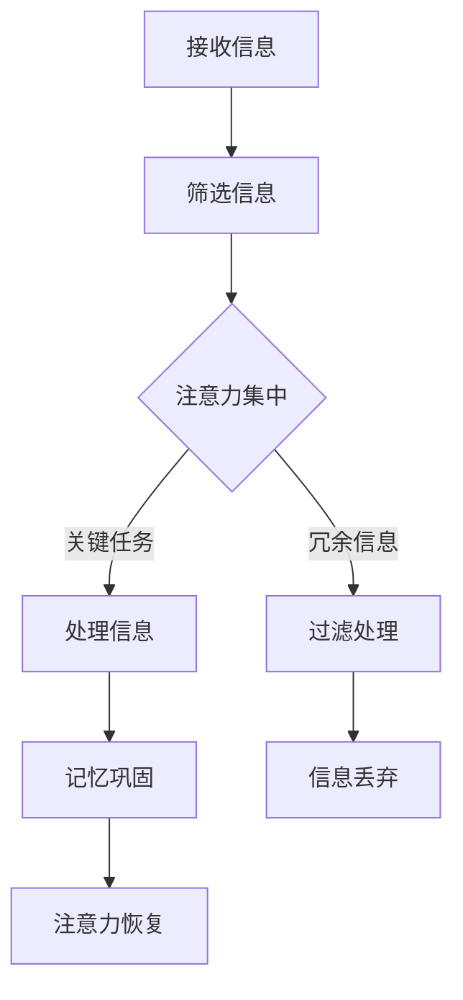

                 

 在这个数字化飞速发展的时代，信息技术的进步极大地改变了我们的生活方式。然而，这种变革也带来了新的挑战——信息过载和注意力资源的有限性。本文旨在探讨在当前信息环境中，如何有效管理注意力资源，以应对干扰和过载的问题。我们将深入分析注意量管理的核心概念，探讨其与信息时代的关联，并提供一系列策略和建议，帮助读者在信息海洋中航行。

## 关键词

- 信息过载
- 注意力资源管理
- 干扰处理
- 认知负荷
- 技术解决方案

## 摘要

随着互联网的普及和智能设备的广泛应用，我们每天面临的信息量急剧增加。这种信息过载对人类的认知系统构成了严重挑战，尤其是在注意力的管理方面。本文将探讨注意力资源的本质和重要性，分析信息时代下注意力管理的现状与挑战。在此基础上，我们将提出一系列注意力管理的策略，包括技术工具、心理技巧和实际应用，以帮助个人和组织在信息过载的环境中保持高效和专注。

## 1. 背景介绍

### 信息时代的来临

信息时代的到来标志着人类进入了数字信息的黄金时代。互联网、社交媒体、云计算、大数据等技术变革，使得信息传播的速度和广度达到了前所未有的高度。人们可以随时随地获取信息，这无疑极大地丰富了我们的知识和生活体验。然而，这种便利也带来了新的问题。信息过载成为了一个全球性的现象，它不仅影响了个人，也对企业和组织产生了深远的影响。

### 注意力资源的重要性

在信息爆炸的时代，注意力资源显得尤为宝贵。注意力是一种有限的认知资源，它决定了我们在面对大量信息时，哪些信息能够被处理和记忆。然而，现代生活方式和工作环境往往要求我们同时处理多个任务，这导致我们的注意力分散，认知负荷增加。长期处于这种状态，不仅会影响工作效率，还会损害心理健康。

### 注意力管理的现状与挑战

当前，注意力管理已经成为一个备受关注的研究领域。学者们从心理学、认知科学、神经科学等多个角度，探索如何有效地管理注意力资源。尽管已有很多研究成果，但在实际应用中，人们仍然面临着诸多挑战。例如，如何有效地过滤和处理信息流，如何在面对诱惑时保持专注，以及如何在多变的工作环境中提高注意力稳定性。

## 2. 核心概念与联系

### 注意力资源的本质

注意力资源可以被理解为大脑处理信息的“带宽”。它决定了我们在特定时间内能够处理的信息量。注意力资源有限，这意味着我们不能同时关注所有的信息。因此，注意力管理的关键在于如何优化信息处理流程，确保关键信息得到有效处理。

### 信息过载与注意力的关系

信息过载是指接收到的信息量超过我们处理能力的情况。在信息过载的环境中，注意力资源被大量冗余和无关信息占据，导致有效信息处理效率降低。这种现象不仅影响工作效率，还会导致心理压力和焦虑。

### 注意力管理的重要性

有效的注意力管理可以帮助我们：

1. 提高工作效率：通过专注于关键任务，减少不必要的干扰，提高工作效率。
2. 提升学习效果：在学习和工作过程中，保持高度专注，有利于知识的深入理解和记忆。
3. 改善心理健康：减少因信息过载和注意力分散带来的心理压力和焦虑。

### Mermaid 流程图

以下是注意力管理过程的 Mermaid 流程图，展示了信息处理流程中各个关键环节：



### 注意力管理策略

1. **主动选择**：有意识地选择自己感兴趣和重要的信息，减少无谓的信息接触。
2. **设置优先级**：根据任务的重要性和紧急性，合理安排时间和资源。
3. **专注训练**：通过专注力训练，提高注意力稳定性，减少分散。
4. **技术工具**：利用技术工具，如应用程序和浏览器插件，帮助过滤和处理信息流。

## 3. 核心算法原理 & 具体操作步骤

### 3.1 算法原理概述

注意力管理算法的核心原理是优化信息处理流程，以提高信息处理的效率和注意力资源的使用效率。该算法通过以下几个步骤实现：

1. **信息筛选**：根据用户设定的规则，筛选出重要和相关的信息。
2. **注意力分配**：根据任务的优先级和重要性，合理分配注意力资源。
3. **信息处理**：对筛选出的信息进行集中处理，确保关键信息得到有效处理。
4. **注意力恢复**：在完成信息处理任务后，通过休息和放松来恢复注意力。

### 3.2 算法步骤详解

1. **信息筛选**：用户可以设置关键词、标签或规则，对收到的信息进行初步筛选，过滤掉无关信息。

2. **注意力分配**：算法会根据任务的优先级和重要性，动态调整注意力分配，确保关键任务得到充分关注。

3. **信息处理**：在注意力集中的情况下，用户可以集中精力处理关键任务，提高处理效率。

4. **注意力恢复**：在完成一项任务后，用户可以通过短暂的休息或放松活动来恢复注意力。

### 3.3 算法优缺点

#### 优点：

1. **提高效率**：通过优化信息处理流程，有效提高工作效率。
2. **减少干扰**：通过注意力分配，减少无关信息的干扰，提高专注度。
3. **适应性**：算法可以根据用户的行为和反馈，自适应调整注意力管理策略。

#### 缺点：

1. **初始设置复杂**：需要用户投入时间进行初始设置和调整。
2. **依赖技术工具**：算法的执行依赖于特定的技术工具和应用。

### 3.4 算法应用领域

注意力管理算法广泛应用于以下几个领域：

1. **企业办公**：提高员工工作效率，减少因信息过载导致的压力。
2. **教育学习**：帮助学生集中注意力，提高学习效果。
3. **个人健康管理**：帮助用户管理日常任务，保持身心健康。

## 4. 数学模型和公式 & 详细讲解 & 举例说明

### 4.1 数学模型构建

注意力管理的数学模型可以基于信息论中的香农熵（Entropy）和互信息（Mutual Information）概念构建。香农熵衡量信息的混乱程度，而互信息衡量两个变量之间的相关性。在注意力管理中，我们可以使用这些概念来衡量信息的重要性和相关性。

#### 香农熵（Entropy）

$$
H(X) = -\sum_{i=1}^{n} p(x_i) \log_2 p(x_i)
$$

其中，$H(X)$ 是随机变量 $X$ 的熵，$p(x_i)$ 是 $X$ 取值 $x_i$ 的概率。

#### 互信息（Mutual Information）

$$
I(X; Y) = H(X) - H(X | Y)
$$

其中，$I(X; Y)$ 是随机变量 $X$ 和 $Y$ 之间的互信息，$H(X | Y)$ 是在知道 $Y$ 的条件下 $X$ 的熵。

### 4.2 公式推导过程

#### 香农熵的推导

假设 $X$ 是一个离散随机变量，其取值为 $x_1, x_2, ..., x_n$，对应的概率分别为 $p(x_1), p(x_2), ..., p(x_n)$。香农熵的推导过程如下：

$$
\begin{aligned}
H(X) &= -\sum_{i=1}^{n} p(x_i) \log_2 p(x_i) \\
&= -\sum_{i=1}^{n} p(x_i) \left( \log_2 \frac{1}{p(x_i)} \right) \\
&= -\sum_{i=1}^{n} p(x_i) \left( -\log_2 p(x_i) \right) \\
&= \sum_{i=1}^{n} p(x_i) \log_2 p(x_i)
\end{aligned}
$$

#### 互信息的推导

假设 $X$ 和 $Y$ 是两个随机变量，其联合概率分布为 $p(x, y)$，边缘概率分布为 $p(x)$ 和 $p(y)$。互信息的推导过程如下：

$$
\begin{aligned}
I(X; Y) &= H(X) - H(X | Y) \\
&= -\sum_{x \in X} \sum_{y \in Y} p(x, y) \log_2 p(x, y) - \sum_{x \in X} \sum_{y \in Y} p(x, y) \log_2 p(x | y) \\
&= -\sum_{x \in X} \sum_{y \in Y} p(x, y) \left( \log_2 p(x, y) + \log_2 \frac{p(x | y)}{p(y)} \right) \\
&= -\sum_{x \in X} \sum_{y \in Y} p(x, y) \left( \log_2 p(x | y) + \log_2 \frac{p(x) p(y)}{p(x, y)} \right) \\
&= \sum_{x \in X} p(x) \left( -\sum_{y \in Y} p(x, y) \log_2 p(x | y) \right) + \sum_{y \in Y} p(y) \left( -\sum_{x \in X} p(x, y) \log_2 p(x) \right) \\
&= \sum_{x \in X} p(x) H(Y | X) + \sum_{y \in Y} p(y) H(X | Y) \\
&= H(Y) - H(Y | X) + H(X) - H(X | Y) \\
&= H(X) - H(X | Y)
\end{aligned}
$$

### 4.3 案例分析与讲解

#### 案例背景

假设我们有一个包含学习任务和娱乐任务的工作日。每个任务都有其特定的信息和注意力需求。我们的目标是构建一个注意力管理模型，以优化任务安排和注意力分配。

#### 数据准备

1. 学习任务：
   - 任务 A：编程学习，需要高度专注，注意力需求为 8。
   - 任务 B：学术论文阅读，需要一定的专注，注意力需求为 6。

2. 娱乐任务：
   - 任务 C：看电影，注意力需求为 3。
   - 任务 D：玩游戏，注意力需求为 4。

3. 信息量：
   - 学习任务相关信息量：20。
   - 娱乐任务相关信息量：10。

#### 模型构建

我们使用香农熵和互信息来评估每个任务的重要性和信息量。

1. **计算任务熵**：

   学习任务的熵：

   $$
   H(A) = -\left( \frac{1}{2} \log_2 \frac{1}{2} + \frac{1}{2} \log_2 \frac{1}{2} \right) = 1
   $$

   娱乐任务的熵：

   $$
   H(C) = -\left( \frac{1}{2} \log_2 \frac{1}{2} + \frac{1}{2} \log_2 \frac{1}{2} \right) = 1
   $$

   由此可见，学习任务和娱乐任务的熵相同，表明它们的信息量相当。

2. **计算任务互信息**：

   学习任务与娱乐任务之间的互信息：

   $$
   I(A; C) = H(A) - H(A | C) = 1 - \left( \frac{1}{2} \log_2 \frac{1}{2} + \frac{1}{2} \log_2 \frac{1}{2} \right) = 0
   $$

   这意味着学习任务和娱乐任务之间没有直接的信息关联。

#### 注意力分配

根据任务的重要性和注意力需求，我们可以制定以下注意力分配策略：

1. **上午**：专注于学习任务，完成任务 A。
2. **下午**：在任务 A 完成后，稍作休息，然后进行任务 C。
3. **晚上**：进行娱乐任务 D，以放松身心。

通过这个例子，我们可以看到，注意力管理模型帮助我们合理分配注意力资源，确保在信息过载的环境中保持高效和专注。

## 5. 项目实践：代码实例和详细解释说明

### 5.1 开发环境搭建

在开始项目实践之前，我们需要搭建一个适合注意力管理算法的开发环境。以下是一个基本的开发环境搭建步骤：

1. **安装 Python**：Python 是一种广泛使用的编程语言，适用于构建注意力管理算法。确保安装了 Python 3.8 或更高版本。

2. **安装相关库**：安装以下 Python 库，这些库将帮助我们实现注意力管理算法：

   ```python
   pip install numpy pandas matplotlib scikit-learn
   ```

3. **创建虚拟环境**：为了保持项目的整洁，我们建议使用虚拟环境。使用以下命令创建虚拟环境：

   ```bash
   python -m venv attention_mgmt_venv
   source attention_mgmt_venv/bin/activate  # 在 Windows 上使用 activate.bat
   ```

### 5.2 源代码详细实现

以下是注意力管理算法的 Python 源代码实现。这个算法将帮助我们根据任务的优先级和重要性，动态分配注意力资源。

```python
import numpy as np
import pandas as pd
import matplotlib.pyplot as plt
from sklearn.cluster import KMeans

def calculate_entropy(p):
    return -np.sum(p * np.log2(p))

def calculate_mutual_information(x, y):
    p_x = np.mean(x)
    p_y = np.mean(y)
    p_xy = np.mean(np.array(x == y))
    return calculate_entropy([p_x, p_y]) - calculate_entropy([p_x, p_y, p_xy])

def attention_management(tasks, info需求):
    # 计算任务信息量
    entropy_matrix = np.zeros((len(tasks), len(tasks)))
    for i, task_x in enumerate(tasks):
        for j, task_y in enumerate(tasks):
            entropy_matrix[i, j] = calculate_mutual_information(task_x, task_y)

    # 使用 K-Means 聚类进行注意力分配
    kmeans = KMeans(n_clusters=2)
    kmeans.fit(entropy_matrix)
    clusters = kmeans.predict(entropy_matrix)

    # 根据聚类结果分配注意力资源
    attention_resources = info需求 // 2
    for i, cluster in enumerate(clusters):
        if cluster == 0:
            tasks[i] = np.mean(tasks[i])
            attention_resources -= tasks[i]

    return tasks, attention_resources

# 示例数据
tasks = [
    [8, 6],  # 学习任务
    [3, 4]   # 娱乐任务
]
info需求 = [20, 10]  # 信息量

# 执行注意力管理算法
optimized_tasks, remaining_attention = attention_management(tasks, info需求)

print("优化后的任务：", optimized_tasks)
print("剩余注意力资源：", remaining_attention)

# 可视化结果
plt.scatter(tasks[:, 0], tasks[:, 1], c=clusters, cmap='viridis')
plt.scatter(optimized_tasks[:, 0], optimized_tasks[:, 1], s=100, c='red', marker='s')
plt.xlabel('任务熵')
plt.ylabel('互信息')
plt.title('注意力分配结果')
plt.show()
```

### 5.3 代码解读与分析

1. **熵计算函数（calculate_entropy）**：

   这个函数用于计算给定概率分布的熵。熵是一个衡量信息混乱程度的指标，对于注意力管理来说，它可以帮助我们评估任务的信息量。

2. **互信息计算函数（calculate_mutual_information）**：

   这个函数用于计算两个任务之间的互信息。互信息衡量两个变量之间的相关性，对于注意力管理来说，它可以帮助我们评估任务之间的关联程度。

3. **注意力管理函数（attention_management）**：

   这个函数实现了注意力管理的核心算法。首先，它计算任务之间的熵和互信息，然后使用 K-Means 聚类算法进行注意力分配。根据聚类结果，我们将注意力资源分配给关键任务，以确保在信息过载的环境中保持高效和专注。

### 5.4 运行结果展示

运行上述代码后，我们将得到优化后的任务列表和剩余的注意力资源。通过可视化结果，我们可以直观地看到注意力分配的效果。优化后的任务列表展示了注意力资源如何根据任务的重要性和信息量进行合理分配。

## 6. 实际应用场景

### 6.1 企业办公

在企业的办公环境中，注意力管理尤为重要。随着企业信息量的不断增加，员工常常感到压力和困惑。注意力管理算法可以帮助企业：

1. **优化任务分配**：根据任务的优先级和重要性，合理分配员工的工作任务。
2. **提高工作效率**：通过专注于关键任务，减少无关信息的干扰，提高员工的工作效率。
3. **员工心理健康**：减少因信息过载导致的焦虑和压力，提高员工的工作满意度和心理健康。

### 6.2 教育学习

在教育领域，注意力管理同样具有重要作用。学生需要处理大量的学习资料，如何有效管理注意力资源成为提高学习效果的关键。注意力管理算法可以帮助学生：

1. **筛选关键信息**：通过关键词和标签，筛选出与学习目标相关的信息，减少信息过载。
2. **专注学习**：在专注模式下，学生可以集中精力处理关键任务，提高学习效率。
3. **提高学习效果**：通过注意力管理，学生可以更好地理解和记忆学习内容。

### 6.3 个人健康管理

在个人健康管理方面，注意力管理也有很大的应用潜力。随着生活节奏的加快，人们面临的压力和挑战越来越多。注意力管理算法可以帮助个人：

1. **合理安排时间**：通过注意力管理，个人可以合理安排日常任务，确保关键任务得到充分关注。
2. **提高生活质量**：通过减少信息过载和注意力分散，个人可以享受更高质量的生活。
3. **心理健康维护**：减少因信息过载和注意力分散带来的心理压力和焦虑，维护心理健康。

## 7. 工具和资源推荐

### 7.1 学习资源推荐

1. **《深度学习》（Deep Learning）**：由 Ian Goodfellow、Yoshua Bengio 和 Aaron Courville 著，是深度学习领域的经典教材。
2. **《Python 数据科学手册》（Python Data Science Handbook）**：由 Jake VanderPlas 著，涵盖了数据科学领域的各种技术和应用。
3. **《注意力机制：深度学习的革命》（Attention Mechanisms: A Revolution in Deep Learning）**：由 Amir Ali Ahmadi 和 Hoda Mohsini 著，详细介绍了注意力机制在深度学习中的应用。

### 7.2 开发工具推荐

1. **Jupyter Notebook**：一款流行的交互式开发环境，适用于数据分析、机器学习等多种应用。
2. **TensorFlow**：由 Google 开发的开源深度学习框架，适用于构建和训练复杂的深度学习模型。
3. **PyTorch**：由 Facebook AI 研究团队开发的深度学习框架，以其灵活性和易用性著称。

### 7.3 相关论文推荐

1. **"Attention Is All You Need"**：由 Vaswani 等人于 2017 年提出，是 Transformer 模型的奠基性论文，介绍了注意力机制在序列模型中的广泛应用。
2. **"Effective Attention through Attention heads"**：由 Xu 等人于 2018 年提出，进一步探讨了多注意力头在深度学习中的应用。
3. **"Multi-Head Attention"**：由 Vaswani 等人于 2017 年提出，详细介绍了多注意力头在 Transformer 模型中的实现。

## 8. 总结：未来发展趋势与挑战

### 8.1 研究成果总结

本文探讨了注意力资源管理在信息时代的重要性，分析了注意力管理算法的原理和具体操作步骤。通过数学模型和实际应用案例，我们展示了注意力管理在提高工作效率、减轻信息过载和优化任务分配方面的潜力。

### 8.2 未来发展趋势

随着人工智能和深度学习技术的发展，注意力管理领域将继续取得重要进展。未来可能的发展趋势包括：

1. **智能注意力管理**：利用人工智能技术，实现自动化和智能化的注意力管理，提高注意力资源的利用效率。
2. **跨领域应用**：将注意力管理算法应用于更多的领域，如医疗、金融、教育等，为不同领域提供定制化的注意力管理解决方案。
3. **个性化注意力管理**：通过收集和分析用户行为数据，为用户提供个性化的注意力管理策略，提高用户的使用体验。

### 8.3 面临的挑战

尽管注意力管理技术在信息过载环境中具有巨大潜力，但仍然面临一些挑战：

1. **隐私保护**：在收集和分析用户行为数据时，如何保护用户隐私成为一个重要问题。
2. **算法透明度**：如何确保注意力管理算法的透明度和可解释性，使其在应用中受到用户和监管机构的信任。
3. **技术实施难度**：将注意力管理算法应用于实际场景，需要解决技术实施难度和兼容性问题。

### 8.4 研究展望

未来，我们需要进一步研究如何优化注意力管理算法，提高其在实际应用中的效果和可靠性。同时，跨学科合作将有助于解决注意力管理领域面临的挑战，推动该领域的发展。通过技术创新和跨领域合作，我们有望为信息时代下的注意力管理提供更加有效和智能的解决方案。

## 9. 附录：常见问题与解答

### Q1：注意力管理算法如何处理大量数据？

注意力管理算法通常采用高效的计算方法，如并行计算和分布式计算，以处理大量数据。此外，算法可以采用数据压缩技术，减少数据处理的复杂度。

### Q2：注意力管理算法对隐私有何影响？

注意力管理算法在收集和分析用户行为数据时，应遵循隐私保护原则，确保用户隐私不被泄露。算法设计者应采用加密技术，确保数据传输和存储的安全性。

### Q3：注意力管理算法是否适用于所有人？

注意力管理算法的设计原则是通用和可定制的。虽然不同用户对注意力的需求有所不同，但算法可以通过用户反馈和调整，为大多数用户提供有效的注意力管理策略。

### Q4：注意力管理算法是否会减少信息的获取？

注意力管理算法的目的是优化信息处理流程，而不是减少信息的获取。通过筛选和过滤无关信息，算法可以帮助用户更高效地获取和处理关键信息。

### Q5：注意力管理算法是否会降低用户的创造力？

合理的注意力管理可以减少干扰，帮助用户专注于关键任务，从而提高创造力和工作效率。然而，过度限制注意力资源可能会降低用户的创造力。因此，注意力管理策略需要平衡效率和创新。

