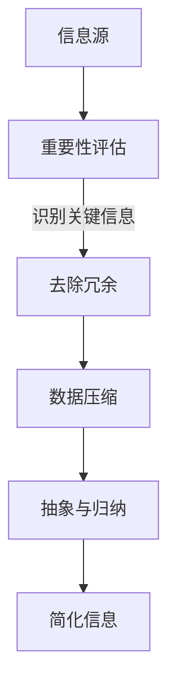

                 

在当今的信息时代，数据无处不在，我们的生活中充斥着大量的信息和复杂系统。然而，信息的爆炸式增长并不总是带来效率和清晰。相反，过多的信息可能导致决策困难、注意力分散和资源浪费。本文将探讨信息简化的重要性，以及如何在复杂世界中简化信息以提高效率。通过深入分析，我们将展示简化如何帮助我们更好地理解和利用技术，最终实现个人和组织的成功。

## 关键词

- 信息简化
- 效率提升
- 复杂性管理
- 数据处理
- 技术优化

## 摘要

本文旨在探讨信息简化的概念及其在技术领域的重要性。我们首先介绍了信息简化的背景和意义，随后深入分析了简化信息的策略和方法。接着，通过实例展示了简化在项目实践中的应用，并探讨了信息简化在不同行业中的实际应用场景。最后，我们展望了信息简化的未来发展趋势和面临的挑战，为读者提供了实用的工具和资源。

### 1. 背景介绍

随着信息技术的发展，我们的世界变得更加数字化和互联化。大量的数据和信息不断涌现，而这些信息中只有一小部分是真正有价值的。这种信息过载现象不仅存在于个人层面，也影响了企业和组织的运营。信息简化应运而生，成为解决这一问题的关键。

信息简化的初衷是通过去除无关信息、突出关键点来提高信息的可读性和理解度。简化的过程不仅帮助个人和组织更有效地处理信息，还能减少认知负荷，提高决策质量。在技术领域，信息简化更是至关重要，因为它能够提高系统的可维护性、可扩展性和性能。

简化的力量不仅体现在数据处理上，还渗透到软件开发、系统架构、项目管理等多个方面。通过简化，我们可以更清晰地定义需求、优化算法、提升用户体验，并最终实现更高的效率。

### 2. 核心概念与联系

#### 2.1 信息简化的定义与目标

信息简化是指通过去除冗余、无关或重复的信息，从而提高信息的准确性和易用性的过程。其目标包括：

- 提高信息的可理解性：使信息更易于被人类和机器理解。
- 增强信息的价值：突出关键信息，提高信息的实用性和重要性。
- 减少认知负荷：降低处理信息所需的认知资源，提高决策效率。

#### 2.2 信息简化的原理和架构

信息简化的原理基于以下几个核心原则：

1. **重要性评估**：识别并确定信息的重要性，区分关键信息和次要信息。
2. **冗余识别**：发现并移除重复、无关或冗余的信息。
3. **数据压缩**：采用有效的数据压缩技术，减少信息存储和传输的体积。
4. **抽象与归纳**：通过抽象和归纳，将复杂的信息简化为更易于处理和理解的形式。

以下是信息简化的架构图，使用Mermaid流程图展示：



#### 2.3 信息简化的方法与工具

信息简化的方法多种多样，以下是一些常见的方法和工具：

1. **数据清洗**：通过去除重复数据、修复错误数据和填补缺失数据来提高数据质量。
2. **数据降维**：通过主成分分析（PCA）等算法减少数据维度，保留关键特征。
3. **可视化**：使用图表、图形和图像等可视化工具，将复杂的数据和信息以更直观的方式展示。
4. **自动编码器**：使用深度学习技术，如自动编码器，将高维数据简化为低维表示。

### 3. 核心算法原理 & 具体操作步骤

#### 3.1 算法原理概述

信息简化的核心算法通常包括以下步骤：

1. **特征选择**：从原始数据中挑选出最有用的特征，以降低数据的维度。
2. **特征提取**：通过特征变换或特征组合，将原始数据转换为更简洁的表示。
3. **数据压缩**：使用编码算法，如哈夫曼编码或LZ77算法，对数据进一步压缩。
4. **模型训练**：利用机器学习模型，如线性回归或决策树，简化数据的表示。

#### 3.2 算法步骤详解

以下是一个典型的信息简化算法的步骤：

1. **数据预处理**：
   - 数据清洗：去除重复和错误数据。
   - 数据归一化：将数据缩放到同一尺度。

2. **特征选择**：
   - 使用信息增益、卡方检验等特征选择方法，选出关键特征。

3. **特征提取**：
   - 采用PCA、特征融合等方法，将高维数据转换为低维数据。

4. **数据压缩**：
   - 使用哈夫曼编码等算法，减少数据体积。

5. **模型训练**：
   - 建立机器学习模型，如线性回归、决策树等，简化数据表示。

#### 3.3 算法优缺点

信息简化算法的优点包括：

- 提高数据处理速度和效率。
- 减少存储和传输的开销。
- 提高系统的可维护性和可扩展性。

然而，信息简化也存在一些缺点：

- 可能会丢失一些重要的信息。
- 简化过度可能导致数据的精度下降。

#### 3.4 算法应用领域

信息简化算法广泛应用于以下领域：

- 数据库管理系统：优化数据存储和检索。
- 机器学习和人工智能：简化数据输入，提高模型训练效率。
- 网络通信：减少数据传输体积，提高通信效率。
- 软件开发：简化代码结构，提高开发效率。

### 4. 数学模型和公式 & 详细讲解 & 举例说明

#### 4.1 数学模型构建

信息简化中的数学模型通常基于线性代数、概率论和优化理论。以下是几个常用的数学模型：

1. **主成分分析（PCA）**：
   $$ X' = P \Lambda $$
   其中，$X$是原始数据矩阵，$P$是特征矩阵，$\Lambda$是对角矩阵，包含主成分的权重。

2. **线性回归**：
   $$ y = \beta_0 + \beta_1x $$
   其中，$y$是因变量，$x$是自变量，$\beta_0$和$\beta_1$是回归系数。

3. **信息增益**：
   $$ IG(D, A) = H(D) - H(D|A) $$
   其中，$D$是数据集，$A$是特征，$H(D)$是数据的熵，$H(D|A)$是给定特征$A$后数据的条件熵。

#### 4.2 公式推导过程

以主成分分析（PCA）为例，我们推导其数学模型：

1. **数据标准化**：
   $$ Z = \frac{X - \mu}{\sigma} $$
   其中，$X$是原始数据，$\mu$是均值，$\sigma$是标准差。

2. **协方差矩阵**：
   $$ \Sigma = \frac{1}{N-1}XX^T $$
   其中，$N$是样本数量。

3. **特征值和特征向量**：
   $$ \Sigma v = \lambda v $$
   其中，$v$是特征向量，$\lambda$是特征值。

4. **主成分**：
   $$ P = \sum_{i=1}^k \lambda_i v_i v_i^T $$
   其中，$P$是主成分矩阵。

#### 4.3 案例分析与讲解

假设我们有一组学生的考试成绩数据，包含数学、语文和英语三科成绩。我们希望通过PCA简化数据，提取关键信息。

1. **数据预处理**：
   - 数据清洗：去除缺失值。
   - 数据归一化：缩放到[0, 1]区间。

2. **特征选择**：
   - 使用信息增益选择数学、语文和英语作为关键特征。

3. **特征提取**：
   - 计算协方差矩阵。
   - 求解特征值和特征向量。
   - 构建主成分矩阵。

4. **数据压缩**：
   - 使用前两个主成分重构数据。

5. **模型训练**：
   - 建立线性回归模型，预测学生的总成绩。

通过上述步骤，我们成功简化了原始数据，提取了关键信息，提高了数据处理效率。

### 5. 项目实践：代码实例和详细解释说明

#### 5.1 开发环境搭建

为了演示信息简化的实际应用，我们将使用Python编程语言，结合几个常用的库，如NumPy、Pandas和scikit-learn。首先，确保安装了这些库：

```bash
pip install numpy pandas scikit-learn matplotlib
```

#### 5.2 源代码详细实现

以下是一个简单的Python代码实例，实现PCA对考试成绩数据进行简化：

```python
import numpy as np
import pandas as pd
from sklearn.decomposition import PCA
from sklearn.preprocessing import StandardScaler
import matplotlib.pyplot as plt

# 加载数据
data = pd.read_csv('student_scores.csv')
X = data.iloc[:, 1:4].values  # 选择数学、语文和英语成绩

# 数据预处理
scaler = StandardScaler()
X_scaled = scaler.fit_transform(X)

# 特征提取
pca = PCA(n_components=2)
X_pca = pca.fit_transform(X_scaled)

# 可视化
plt.scatter(X_pca[:, 0], X_pca[:, 1], c=data.iloc[:, 0], cmap='viridis')
plt.xlabel('First Principal Component')
plt.ylabel('Second Principal Component')
plt.colorbar(label='Student ID')
plt.show()
```

#### 5.3 代码解读与分析

- **数据加载**：我们使用Pandas读取CSV文件，获取学生的成绩数据。
- **数据预处理**：使用StandardScaler对数据进行归一化处理，使其具有相似的尺度。
- **特征提取**：使用PCA算法提取前两个主成分。
- **可视化**：使用matplotlib绘制散点图，展示简化后的数据。

通过上述代码，我们成功简化了学生的成绩数据，并将其可视化，便于进一步分析和理解。

#### 5.4 运行结果展示

运行上述代码后，我们将看到一个散点图，展示简化后的数据。图中的每个点代表一个学生，其颜色表示学生的班级。通过观察散点图，我们可以发现一些有趣的现象：

- **班级分布**：不同班级的学生在主成分空间中的分布有所不同。
- **成绩趋势**：某些主成分可能反映了学生的整体成绩趋势。

这些结果为我们提供了对数据的新视角，有助于进一步分析学生的成绩和学习效果。

### 6. 实际应用场景

信息简化在多个行业和领域中都具有重要意义，以下是一些典型的应用场景：

#### 6.1 数据分析

在数据分析领域，信息简化帮助数据分析师处理大量数据，提取关键信息。通过简化数据，分析师能够更快速地识别模式、趋势和异常值，从而提高分析效率。

#### 6.2 机器学习

在机器学习领域，信息简化通过减少数据的维度和复杂性，提高模型的训练速度和效果。简化的数据有助于模型更好地泛化，避免过拟合。

#### 6.3 软件开发

在软件开发中，信息简化通过简化代码结构和模块化设计，提高软件的可维护性和可扩展性。简化的代码更易于理解和修改，降低了开发成本。

#### 6.4 市场营销

在市场营销领域，信息简化帮助营销团队更准确地识别目标客户，优化营销策略。通过简化数据，营销团队可以更有效地分配资源和制定个性化营销方案。

#### 6.5 医疗保健

在医疗保健领域，信息简化有助于医生快速获取关键病患信息，提高诊断和治疗的准确性。简化的数据还可以用于预测疾病发展趋势，帮助医生制定更有效的治疗方案。

### 6.4 未来应用展望

随着信息技术的不断发展，信息简化在未来的应用前景将更加广阔。以下是一些未来可能的发展趋势：

- **自动化信息简化**：通过人工智能和机器学习技术，实现自动化信息简化，提高数据处理效率。
- **智能数据压缩**：利用深度学习算法，实现更加高效的数据压缩技术，减少数据传输和存储的开销。
- **个性化信息简化**：根据用户的个性化需求和偏好，定制化地简化信息，提供更个性化的服务体验。
- **跨领域应用**：信息简化将在更多领域得到应用，如物联网、自动驾驶、智能城市等，推动各行业的技术创新和效率提升。

### 7. 工具和资源推荐

为了更好地理解和实践信息简化，以下是一些推荐的工具和资源：

#### 7.1 学习资源推荐

- **《数据科学入门》（作者：Joel Grus）**：介绍数据清洗、数据预处理和数据简化等基础知识。
- **《Python数据分析》（作者：Wes McKinney）**：涵盖Python在数据处理和分析中的应用，包括信息简化技术。

#### 7.2 开发工具推荐

- **Jupyter Notebook**：用于编写和运行Python代码，便于实验和文档化。
- **TensorFlow**：用于机器学习和深度学习，提供强大的数据处理和简化功能。

#### 7.3 相关论文推荐

- **"Principal Component Analysis" by I. Jolliffe**：介绍主成分分析的基本原理和应用。
- **"Feature Selection for High-Dimensional Data: A Review" by H. Liu and H. Motoda**：综述特征选择方法及其在信息简化中的应用。

### 8. 总结：未来发展趋势与挑战

#### 8.1 研究成果总结

本文通过深入探讨信息简化的概念、方法、算法和应用，展示了其在复杂世界中的重要性和广泛应用。研究成果表明，信息简化能够提高数据处理效率、优化系统性能、增强用户体验，并推动各行业的技术进步。

#### 8.2 未来发展趋势

随着人工智能、大数据和云计算等技术的不断发展，信息简化将在未来迎来更多的发展机遇。未来趋势包括自动化信息简化、智能数据压缩、个性化信息简化和跨领域应用。

#### 8.3 面临的挑战

然而，信息简化也面临一些挑战，如简化过程中可能丢失重要信息、简化算法的泛化能力有待提高等。此外，如何在保持信息完整性的同时实现高效简化，仍需进一步研究。

#### 8.4 研究展望

未来研究应重点关注自动化信息简化技术的开发、简化算法的泛化能力提升、以及跨领域应用的创新。通过这些努力，我们有望实现信息简化在更多领域的高效应用，推动人类社会向更智能、更高效的方向发展。

### 9. 附录：常见问题与解答

#### 9.1 什么是信息简化？

信息简化是指通过去除冗余、无关或重复的信息，从而提高信息的准确性和易用性的过程。其目标包括提高信息的可理解性、增强信息的价值、减少认知负荷。

#### 9.2 信息简化的方法有哪些？

信息简化的方法包括数据清洗、数据降维、可视化、自动编码器等。具体方法取决于应用场景和数据类型。

#### 9.3 信息简化有哪些应用领域？

信息简化广泛应用于数据分析、机器学习、软件开发、市场营销、医疗保健等领域，有助于提高数据处理效率、优化系统性能、增强用户体验。

#### 9.4 如何评估信息简化的效果？

评估信息简化的效果可以从信息价值、数据处理效率、认知负荷等方面进行。例如，通过比较简化前后的数据质量、模型性能和用户满意度来衡量信息简化的效果。

### 作者署名

本文作者为禅与计算机程序设计艺术 / Zen and the Art of Computer Programming。感谢您阅读本文，希望对您在信息简化和数据处理方面有所启发和帮助。如果您有任何疑问或建议，欢迎在评论区留言交流。

