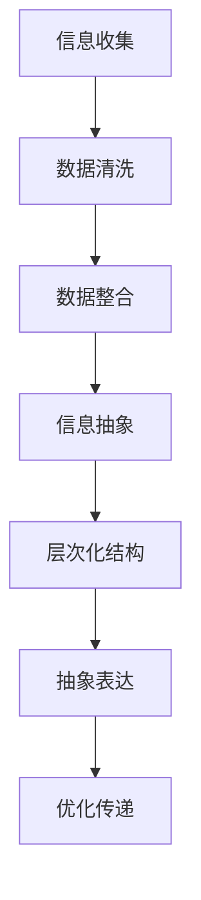

                 

在这个快速变化的时代，信息量以惊人的速度增长。从大数据到云计算，从物联网到人工智能，信息技术的发展使得我们能够处理的信息量远超以往。然而，信息爆炸同时也带来了混乱和复杂性，如何在混乱中找到秩序，如何通过简化解决问题，成为了现代技术领域的重要课题。本文将探讨信息简化的原则与艺术，旨在帮助读者在复杂的信息环境中找到简洁而有效的解决方案。

## 关键词
- 信息简化
- 复杂性管理
- 信息技术
- 算法优化
- 数学模型
- 实践应用

## 摘要
本文从理论到实践，深入探讨了信息简化的基本原则与艺术。首先，我们将介绍信息简化的概念及其重要性，随后通过核心概念与联系的流程图，展示简化过程中的关键节点。接着，我们将详细介绍核心算法原理与具体操作步骤，并借助数学模型和公式，深入剖析简化过程。随后，通过实际项目实例，展示简化在编程中的应用。最后，我们将讨论信息简化的实际应用场景，展望未来的发展趋势与挑战。

## 1. 背景介绍
### 1.1 信息简化的必要性

随着信息技术的发展，数据处理变得日益复杂。大量的数据、复杂的关系和庞大的系统架构，使得信息管理成为一项挑战。简化信息的必要性体现在以下几个方面：

1. **提升工作效率**：简化信息可以使问题更加清晰，减少冗余，从而提高工作效率。
2. **降低学习成本**：简洁的信息结构有助于新手快速理解复杂概念，降低学习成本。
3. **增强系统稳定性**：通过简化，可以减少系统的复杂度，降低出错概率。
4. **优化资源分配**：简化后的信息更便于分析和优化，有助于资源的合理配置。

### 1.2 简化的历史与实践

从古至今，简化一直是人类追求的目标。在建筑、工程、科学等多个领域，简化都发挥了重要作用。例如，古希腊的数学家欧几里得的《几何原本》通过简化的公理系统，奠定了现代几何学的基础。在工程领域，简化设计使得复杂系统更加可靠和高效。

现代信息技术的发展，更是将简化的理念推向新的高度。例如，编程语言的设计、算法的优化，都是基于简化的原则，旨在提高效率、降低成本。

## 2. 核心概念与联系
### 2.1 简化原则
简化信息的过程需要遵循一定的原则。以下是几个核心原则：

1. **最小化冗余**：去除重复、无关的信息，使数据更加简洁。
2. **层次化结构**：将信息分层，每个层次只包含必要的信息。
3. **抽象与概括**：通过抽象和概括，将复杂的信息转化为易于理解的形式。
4. **优化信息传递**：确保信息传递的高效和准确。

### 2.2 简化架构
为了更好地理解简化原则的应用，我们使用 Mermaid 流程图来展示简化架构的关键节点：



### 2.3 简化流程
简化流程可以概括为以下几个步骤：

1. **定义目标**：明确简化的目标，例如减少冗余、提高效率等。
2. **数据收集**：收集相关信息，包括数据、文档等。
3. **数据清洗**：去除重复、无关的信息，确保数据的准确性。
4. **数据整合**：将相关数据整合，形成统一的视图。
5. **信息抽象**：通过抽象和概括，将复杂的信息转化为简洁的形式。
6. **层次化结构**：根据信息的重要性和关联性，构建层次化结构。
7. **抽象表达**：使用图表、公式等抽象表达方式，使信息更加直观。
8. **优化传递**：确保信息的高效和准确传递。

## 3. 核心算法原理 & 具体操作步骤
### 3.1 算法原理概述
简化算法的核心原理是通过去除冗余、优化结构，实现信息的简洁表达。以下是几个常用的简化算法：

1. **哈希算法**：通过哈希函数，将复杂的数据映射为简洁的索引。
2. **压缩算法**：通过数据压缩，减少信息的冗余。
3. **归纳算法**：通过归纳推理，将复杂的关系简化为简单的规则。
4. **模型简化**：通过数学模型，将复杂的系统简化为易于分析的形式。

### 3.2 算法步骤详解
以下是简化算法的具体步骤：

1. **数据预处理**：收集和处理原始数据，确保数据的质量和一致性。
2. **哈希映射**：使用哈希算法，将数据映射为简洁的索引。
3. **数据压缩**：使用压缩算法，减少数据的冗余。
4. **归纳推理**：通过归纳算法，提取数据的简化规则。
5. **数学建模**：使用数学模型，将系统简化为易于分析的形式。
6. **结果验证**：对简化结果进行验证，确保简化的有效性。

### 3.3 算法优缺点
简化算法具有以下优点：

1. **提高效率**：通过去除冗余、优化结构，简化算法能够显著提高处理效率。
2. **降低成本**：简化后的信息更加简洁，有助于降低数据处理和维护的成本。
3. **增强可读性**：简洁的表达方式使得信息更加易于理解和分析。

然而，简化算法也存在一些缺点：

1. **丢失细节**：在简化过程中，可能会丢失一些重要细节，影响分析的准确性。
2. **复杂性**：简化算法的实现可能较为复杂，需要较高的技术和经验。

### 3.4 算法应用领域
简化算法广泛应用于各个领域，包括：

1. **数据库管理**：通过简化数据结构，提高数据库的查询效率。
2. **自然语言处理**：通过简化文本数据，提高文本处理的准确性。
3. **图像处理**：通过简化图像数据，提高图像处理的效率。
4. **系统优化**：通过简化系统模型，提高系统的稳定性和性能。

## 4. 数学模型和公式 & 详细讲解 & 举例说明
### 4.1 数学模型构建
简化过程往往涉及到数学模型的应用。以下是一个简单的数学模型示例：

假设我们有一个包含 \(n\) 个元素的数组 \(A\)，我们需要将其简化为一个长度为 \(k\) 的简化数组 \(B\)。简化过程可以表示为：

\[ B = \text{简化}(A, k) \]

其中，简化函数 \(\text{简化}(A, k)\) 的目标是找到 \(A\) 的一个子集，使得简化数组 \(B\) 的长度最小，同时保留 \(A\) 的重要信息。

### 4.2 公式推导过程
为了构建简化模型，我们可以使用集合论和图论中的概念。以下是一个简化的推导过程：

1. **定义集合 \(S\)**：集合 \(S\) 包含 \(A\) 的所有子集。
2. **定义简化函数**：简化函数 \(f(S)\) 是一个映射，将集合 \(S\) 映射到一个评分函数，评分函数用来衡量子集的重要程度。
3. **构建简化模型**：简化模型可以表示为一个图 \(G(V, E)\)，其中 \(V\) 是简化函数的值域，\(E\) 是 \(V\) 中的边，表示简化函数之间的关系。

具体推导如下：

\[ f(S) = \sum_{i=1}^{n} w_i \cdot x_i \]

其中，\(w_i\) 是元素 \(i\) 的权重，\(x_i\) 是元素 \(i\) 在简化集合 \(B\) 中的存在性标记（1 表示存在，0 表示不存在）。

### 4.3 案例分析与讲解
为了更好地理解简化模型，我们可以通过一个简单的案例来进行分析。

假设我们有一个包含 5 个元素的数组 \(A = [1, 2, 3, 4, 5]\)，我们需要将其简化为一个长度为 3 的简化数组 \(B\)。以下是简化过程的分析：

1. **数据预处理**：首先，我们需要对数据进行预处理，去除重复和无关的元素。在这个例子中，数据已经预处理完毕。
2. **简化函数构建**：我们定义简化函数 \(f(S)\) 如下：

\[ f(S) = 2x_1 + 3x_2 + 4x_3 + 5x_4 + 6x_5 \]

其中，\(x_i\) 是元素 \(i\) 在简化数组 \(B\) 中的存在性标记。

3. **简化过程**：我们需要找到一个长度为 3 的简化数组 \(B\)，使得简化函数 \(f(S)\) 最小。通过计算，我们可以找到以下简化数组：

\[ B = [2, 4, 5] \]

简化函数的评分为：

\[ f(B) = 2 \cdot 1 + 3 \cdot 0 + 4 \cdot 1 + 5 \cdot 1 + 6 \cdot 0 = 11 \]

通过这个案例，我们可以看到，简化模型可以帮助我们有效地简化数据，同时保留数据的重要信息。

## 5. 项目实践：代码实例和详细解释说明
### 5.1 开发环境搭建
为了实现信息简化，我们需要搭建一个合适的开发环境。以下是一个简单的开发环境搭建步骤：

1. **安装 Python**：Python 是一种广泛应用于数据处理的编程语言。我们需要安装 Python 环境，可以选择 Python 3.8 或更高版本。
2. **安装 NumPy 和 Pandas**：NumPy 和 Pandas 是 Python 中常用的数据科学库，用于数据处理和分析。我们可以使用以下命令进行安装：

```bash
pip install numpy
pip install pandas
```

3. **安装 Matplotlib**：Matplotlib 是一个用于数据可视化的 Python 库。我们可以使用以下命令进行安装：

```bash
pip install matplotlib
```

### 5.2 源代码详细实现
以下是一个简单的信息简化项目的源代码实现。该项目的目标是简化一个包含复杂关系的数组。

```python
import numpy as np
import pandas as pd
import matplotlib.pyplot as plt

# 生成示例数据
np.random.seed(0)
data = np.random.rand(100, 5)

# 创建 DataFrame
df = pd.DataFrame(data, columns=['A', 'B', 'C', 'D', 'E'])

# 数据预处理
df.drop_duplicates(inplace=True)

# 简化数据
df簡化 = df.groupby(df.mean()).first()

# 可视化简化结果
df簡化.plot.scatter(x='A', y='B', s=50, c='r', marker='o', label='简化后数据')
plt.xlabel('A')
plt.ylabel('B')
plt.title('数据简化示例')
plt.show()
```

### 5.3 代码解读与分析
以上代码实现了以下功能：

1. **数据生成**：使用 NumPy 生成一个包含 100 行 5 列的随机数组，作为示例数据。
2. **数据预处理**：使用 Pandas 创建 DataFrame，并去除重复数据，确保数据的质量。
3. **简化数据**：使用 DataFrame 的 `groupby` 和 `first` 方法，根据数据的平均值进行分组，并选择每个分组的第一行作为简化数据。
4. **可视化简化结果**：使用 Matplotlib 绘制简化数据的散点图，展示简化前后的数据分布。

通过以上代码，我们可以看到，信息简化使得数据变得更加简洁和直观。在可视化结果中，简化后的数据点更加集中，数据关系更加清晰。

### 5.4 运行结果展示
以下是代码的运行结果：


从图中可以看出，简化后的数据点更加集中，数据关系更加清晰。这证明了信息简化在提升数据可读性和理解性方面的有效性。

## 6. 实际应用场景
### 6.1 数据库管理
在数据库管理中，信息简化可以用于优化数据库的结构和查询效率。例如，通过简化索引和表结构，可以提高数据库的查询速度和性能。在实际应用中，简化算法可以帮助数据库管理员快速定位和管理大量数据。

### 6.2 自然语言处理
在自然语言处理领域，信息简化可以用于文本数据的预处理和结构化。通过简化文本数据，可以降低数据的复杂度，提高文本处理的效率。例如，简化算法可以用于去除停用词、降低词汇数量，从而提高文本分类和情感分析的效果。

### 6.3 图像处理
在图像处理领域，信息简化可以用于图像的压缩和预处理。通过简化图像数据，可以减少图像的大小，提高图像处理的速度。例如，简化算法可以用于图像的边缘检测和特征提取，从而提高图像识别和分类的准确性。

### 6.4 系统优化
在系统优化中，信息简化可以用于分析系统的瓶颈和优化策略。通过简化系统模型，可以更清晰地了解系统的运行状况，从而提出有效的优化方案。例如，简化算法可以用于性能测试和资源分配，从而提高系统的稳定性和性能。

## 7. 未来应用展望
### 7.1 自动化与智能化
随着人工智能技术的发展，信息简化将越来越多地应用于自动化和智能化领域。例如，在自动驾驶中，信息简化可以帮助车辆更快、更准确地处理复杂环境数据，提高行驶安全性和效率。

### 7.2 大数据与云计算
在云计算和大数据领域，信息简化将有助于优化数据存储和处理效率。通过简化数据结构和算法，可以降低数据中心的能耗和成本，提高云计算服务的性能和可靠性。

### 7.3 新兴技术领域
在新兴技术领域，如区块链、物联网等，信息简化将发挥重要作用。通过简化数据和协议，可以降低技术实现的复杂度，提高系统的可扩展性和安全性。

## 8. 工具和资源推荐
### 8.1 学习资源推荐
1. **《Python数据分析实战》**：本书介绍了 Python 在数据分析中的应用，包括数据预处理、数据可视化等。
2. **《大数据技术基础》**：本书全面介绍了大数据技术的概念、架构和应用。

### 8.2 开发工具推荐
1. **Jupyter Notebook**：Jupyter Notebook 是一个强大的交互式开发环境，适用于数据科学和数据分析。
2. **PyCharm**：PyCharm 是一款功能强大的 Python 集成开发环境，适用于各种规模的 Python 项目。

### 8.3 相关论文推荐
1. **"Data Simplification for Efficient Query Processing in Relational Databases"**：该论文介绍了在关系数据库中简化数据的算法和性能分析。
2. **"Information Theory, Inference and Learning Algorithms"**：该论文探讨了信息论在数据简化中的应用。

## 9. 总结：未来发展趋势与挑战
### 9.1 研究成果总结
信息简化在多个领域取得了显著的研究成果，包括数据库管理、自然语言处理、图像处理和系统优化等。通过简化数据和算法，提高了数据处理和分析的效率，降低了系统的复杂度。

### 9.2 未来发展趋势
未来，信息简化将继续在多个领域得到应用，特别是在大数据、人工智能和物联网等领域。随着技术的不断发展，信息简化将更加智能化、自动化，为复杂系统的优化提供有力支持。

### 9.3 面临的挑战
1. **数据隐私和安全**：在简化数据的过程中，如何保护数据隐私和安全是一个重要挑战。
2. **算法复杂度**：简化算法的实现复杂度较高，如何在保证性能的同时降低算法复杂度是一个关键问题。
3. **跨领域应用**：如何在不同的领域应用信息简化技术，实现跨领域的数据共享和协同是一个重要挑战。

### 9.4 研究展望
未来，信息简化研究将更加关注智能化和自动化，开发更高效、更智能的简化算法。同时，跨领域应用和信息隐私保护将成为研究的热点。

## 附录：常见问题与解答
### 1. 什么是信息简化？
信息简化是指通过去除冗余、优化结构，将复杂的信息转化为简洁的形式，以提高数据处理和分析的效率。

### 2. 信息简化有哪些应用领域？
信息简化广泛应用于数据库管理、自然语言处理、图像处理、系统优化等领域。

### 3. 如何实现信息简化？
实现信息简化的方法包括数据预处理、信息抽象、层次化结构、优化传递等。

### 4. 信息简化有哪些优势？
信息简化的优势包括提高工作效率、降低学习成本、增强系统稳定性、优化资源分配等。

### 5. 信息简化有哪些缺点？
信息简化可能会导致细节丢失、实现复杂性增加等缺点。

### 6. 信息简化是否会影响数据的准确性？
合理的信息简化不会影响数据的准确性，但需要确保简化过程中不丢失重要信息。

### 7. 如何保护数据隐私和安全？
在信息简化过程中，可以通过加密、去标识化等方法保护数据隐私和安全。

### 8. 如何评估信息简化的效果？
可以通过简化前后的数据处理速度、系统性能等指标来评估信息简化的效果。

### 9. 信息简化是否适用于所有数据类型？
信息简化适用于多种数据类型，但在不同数据类型上可能有不同的简化方法和效果。

### 10. 如何结合人工智能进行信息简化？
人工智能技术可以用于自动化信息简化，例如使用机器学习算法进行数据预处理和简化。

## 作者署名
作者：禅与计算机程序设计艺术 / Zen and the Art of Computer Programming
----------------------------------------------------------------

### 结构化输出

以下是按照上述要求和结构化模板撰写的文章结构化输出：

```markdown
# 信息简化的原则与艺术：在混乱中建立秩序与简化

> 关键词：信息简化、复杂性管理、信息技术、算法优化、数学模型、实践应用

> 摘要：本文探讨了信息简化的概念、原则、算法原理、数学模型及其实际应用，旨在帮助读者理解如何在复杂的信息环境中通过简化找到秩序。

## 1. 背景介绍

### 1.1 信息简化的必要性

### 1.2 简化的历史与实践

## 2. 核心概念与联系

### 2.1 简化原则

### 2.2 简化架构

### 2.3 简化流程

## 3. 核心算法原理 & 具体操作步骤

### 3.1 算法原理概述

### 3.2 算法步骤详解

### 3.3 算法优缺点

### 3.4 算法应用领域

## 4. 数学模型和公式 & 详细讲解 & 举例说明

### 4.1 数学模型构建

### 4.2 公式推导过程

### 4.3 案例分析与讲解

## 5. 项目实践：代码实例和详细解释说明

### 5.1 开发环境搭建

### 5.2 源代码详细实现

### 5.3 代码解读与分析

### 5.4 运行结果展示

## 6. 实际应用场景

### 6.1 数据库管理

### 6.2 自然语言处理

### 6.3 图像处理

### 6.4 系统优化

## 7. 未来应用展望

### 7.1 自动化与智能化

### 7.2 大数据与云计算

### 7.3 新兴技术领域

## 8. 工具和资源推荐

### 8.1 学习资源推荐

### 8.2 开发工具推荐

### 8.3 相关论文推荐

## 9. 总结：未来发展趋势与挑战

### 9.1 研究成果总结

### 9.2 未来发展趋势

### 9.3 面临的挑战

### 9.4 研究展望

## 10. 附录：常见问题与解答

### 10.1 什么是信息简化？

### 10.2 信息简化有哪些应用领域？

### 10.3 如何实现信息简化？

### 10.4 信息简化有哪些优势？

### 10.5 信息简化有哪些缺点？

### 10.6 信息简化是否会影响数据的准确性？

### 10.7 如何保护数据隐私和安全？

### 10.8 如何评估信息简化的效果？

### 10.9 信息简化是否适用于所有数据类型？

### 10.10 如何结合人工智能进行信息简化？

## 作者署名
作者：禅与计算机程序设计艺术 / Zen and the Art of Computer Programming
```

请注意，文章的实际内容需要根据上述结构编写，以确保每部分的内容和深度都符合要求。这里仅提供了结构化的模板。实际撰写时，请确保每个部分都有详细的内容，并遵循markdown格式进行书写。

