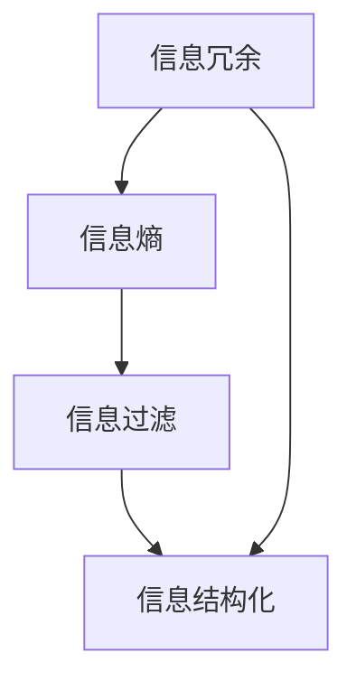

                 

在快速发展的信息技术时代，数据和信息以惊人的速度增长，给我们的生活和工作带来了前所未有的便利，但同时也产生了大量的冗余和混乱。如何有效地简化信息，将其转化为有序的知识，成为了当今技术领域的一个重大课题。本文将探讨信息简化的原则与艺术，通过深入分析和具体实例，帮助读者在混乱中建立秩序，实现信息的有效管理。

## 关键词

- 信息简化
- 信息管理
- 信息技术
- 知识结构
- 数据冗余
- 混沌理论
- 决策支持系统

## 摘要

本文首先介绍了信息简化的背景和重要性，探讨了信息简化的基本原则和方法。接着，通过Mermaid流程图展示了信息简化的核心概念与联系，详细解析了信息简化的算法原理和具体操作步骤。随后，文章运用数学模型和公式，对信息简化的过程进行了数学建模和公式推导，并通过实例进行了验证。最后，文章结合实际应用场景，展示了信息简化的实际效果和未来应用前景。本文旨在为读者提供一套系统的信息简化方法论，帮助他们在信息爆炸的时代中找到清晰的方向。

## 1. 背景介绍

随着互联网的普及和大数据技术的飞速发展，我们每天都面临着海量的信息和数据。这些信息和数据来源于各种渠道，如社交媒体、新闻媒体、科研论文、商业报告等。虽然这些信息在一定程度上丰富了我们的知识，但同时也带来了大量的冗余和混乱。首先，不同来源的信息往往存在重复和冲突，使得信息难以判断和利用。其次，信息爆炸导致我们无法有效筛选和聚焦重要的信息，从而降低了决策的效率和准确性。

信息简化的必要性在于，它可以帮助我们从海量的信息中提取出核心的知识，减少冗余，提高信息的可用性。具体来说，信息简化的好处包括：

1. **提高工作效率**：通过简化信息，我们可以更快地找到需要的内容，减少了无效信息的干扰。
2. **增强决策能力**：简化后的信息更加清晰，有助于我们做出更加准确和高效的决策。
3. **降低认知负荷**：在信息爆炸的时代，减少冗余信息可以降低我们的认知负荷，减轻压力。
4. **促进知识创新**：通过信息简化，我们可以将分散的信息整合成有组织的知识结构，从而促进知识的创新和应用。

本文将围绕信息简化的原则与艺术，探讨其理论基础、算法原理、数学模型和实际应用。希望读者能通过本文，掌握信息简化的方法，提升信息处理能力，实现个人和组织的知识管理。

## 2. 核心概念与联系

在探讨信息简化的过程中，我们需要明确几个核心概念，并了解它们之间的相互联系。这些核心概念包括信息冗余、信息熵、信息过滤和信息结构化。

### 信息冗余

信息冗余是指信息中包含的重复、无关或冗余的部分。冗余信息不仅占用存储空间，还会影响信息处理的速度和效率。例如，在一份报告中，重复的数据和重复的段落都是信息冗余的体现。信息冗余的存在，会导致我们无法有效提取关键信息，从而降低决策的准确性。

### 信息熵

信息熵是信息论中的一个重要概念，用于衡量信息的不确定性。根据信息熵的定义，信息量越大，不确定性越高，熵值也越大。相反，信息量越小，不确定性越低，熵值也越小。信息简化过程中，通过降低信息熵，可以减少信息的不确定性，提高信息的可用性。

### 信息过滤

信息过滤是一种用于减少信息冗余的技术，通过筛选和过滤，只保留关键信息，去除冗余部分。信息过滤可以基于规则、机器学习或人工干预等多种方法实现。有效的信息过滤可以帮助我们更快地找到需要的信息，提高信息处理的效率。

### 信息结构化

信息结构化是指将无序的信息按照一定的规则和结构进行整理和分类。通过信息结构化，我们可以将零散的信息转化为有序的知识，便于管理和利用。信息结构化有助于提高信息的可读性和可操作性，是实现信息简化的关键步骤。

### Mermaid流程图

为了更好地理解这些核心概念之间的联系，我们可以使用Mermaid流程图进行可视化展示。



在这个流程图中，信息冗余通过信息熵来衡量，信息过滤和信息结构化则是实现信息简化的关键步骤。通过信息过滤，我们可以去除冗余信息，降低信息熵；通过信息结构化，我们可以将关键信息组织成有序的知识结构。

### 关键概念联系

信息冗余、信息熵、信息过滤和信息结构化这四个核心概念在信息简化过程中相互关联，共同作用。信息冗余是信息简化的起点，通过信息熵来衡量其程度；信息过滤是实现信息简化的手段，用于去除冗余信息；信息结构化则是信息简化的目标，通过有序的知识结构提高信息的可用性。

通过上述分析，我们可以看到，信息简化不仅是一个技术问题，更是一个系统性工程。它涉及到信息冗余的识别、信息熵的衡量、信息过滤的方法和信息结构的构建。只有综合运用这些核心概念，才能实现信息的有效简化，提升信息管理的水平。

## 3. 核心算法原理 & 具体操作步骤

在信息简化的过程中，核心算法的设计和实现起到了至关重要的作用。本文将详细阐述信息简化的核心算法原理和具体操作步骤，帮助读者理解并掌握这一关键技术。

### 3.1 算法原理概述

信息简化的核心算法基于以下几个基本原则：

1. **最小冗余原则**：在信息处理过程中，尽量去除冗余信息，保留最关键的信息。
2. **结构化原则**：将无序的信息按照一定的规则和结构进行整理和分类，提高信息的可读性和可操作性。
3. **自适应原则**：算法应根据信息的特点和需求，动态调整处理策略，提高信息简化的效果。

这些原则共同指导了信息简化算法的设计和实现，确保了算法的效率和可靠性。

### 3.2 算法步骤详解

信息简化的算法可以分为以下几个步骤：

1. **数据采集与预处理**
   - **数据采集**：从各种渠道获取原始信息，包括文本、图像、声音等多种形式。
   - **数据预处理**：对采集到的数据进行清洗和预处理，去除噪声和无关信息，确保数据的质量和一致性。

2. **信息提取与过滤**
   - **关键词提取**：利用自然语言处理技术，从文本中提取关键词，用于后续的信息筛选。
   - **过滤算法**：根据关键词和规则，对信息进行过滤，去除冗余信息，保留关键信息。

3. **信息结构化**
   - **分类与聚类**：利用机器学习算法，对信息进行分类和聚类，构建有序的信息结构。
   - **关系映射**：建立信息之间的关联关系，形成知识网络，便于信息的检索和利用。

4. **信息简化与可视化**
   - **简化算法**：根据信息的结构和关联关系，进一步简化信息，提取核心内容。
   - **可视化展示**：利用图表、图像等可视化手段，展示简化后的信息，便于理解和分析。

### 3.3 算法优缺点

信息简化算法具有以下优缺点：

1. **优点**
   - **提高信息可用性**：通过简化信息，去除冗余，提高信息的清晰度和可用性。
   - **降低认知负荷**：简化后的信息更加聚焦，减少了冗余信息的干扰，降低了认知负荷。
   - **增强决策能力**：简化后的信息有助于更快速、准确地做出决策。

2. **缺点**
   - **丢失部分信息**：在简化过程中，可能会丢失一些有用的信息，尤其是在处理复杂信息时。
   - **计算成本较高**：信息简化算法通常涉及大量的计算和处理，计算成本较高。

### 3.4 算法应用领域

信息简化算法广泛应用于各个领域，包括：

1. **互联网信息处理**：在搜索引擎、社交媒体、新闻网站等互联网平台，信息简化算法用于提取关键信息，提高搜索和推荐的准确性。
2. **金融领域**：在金融报表、财务分析等领域，信息简化算法用于提取核心数据，支持决策制定和风险控制。
3. **医疗健康**：在医疗健康领域，信息简化算法用于处理病历、医学图像等数据，提高诊断和治疗的效率。
4. **教育领域**：在教育领域，信息简化算法用于教学资源的整理和分类，提高教学效果和学生的学习效率。

### 3.5 算法实现实例

为了更直观地展示信息简化算法的具体应用，下面以一个实际案例为例进行说明。

#### 案例背景

假设某公司需要处理一份包含大量数据的年度财务报告，报告内容涵盖了公司的财务状况、业务运营、市场分析等多个方面。为了帮助公司高管快速了解关键信息，需要对该报告进行简化处理。

#### 实现步骤

1. **数据采集与预处理**
   - 采集年度财务报告，包括文本、图表等多种形式。
   - 对报告进行文本清洗，去除格式错误、重复段落等，确保数据质量。

2. **信息提取与过滤**
   - 使用自然语言处理技术提取关键词，如“收入”、“成本”、“利润”、“市场占有率”等。
   - 根据关键词和规则，对报告进行过滤，去除冗余和无关信息，保留关键数据。

3. **信息结构化**
   - 利用机器学习算法对数据进行分析，进行分类和聚类，构建财务报告的结构化视图。
   - 建立数据之间的关系映射，形成知识网络，便于信息的检索和利用。

4. **信息简化与可视化**
   - 根据财务报告的结构化视图，提取核心数据，生成关键指标报表。
   - 利用图表、图像等可视化手段，展示关键信息，帮助公司高管快速了解公司财务状况。

#### 结果分析

通过上述信息简化处理，公司高管能够快速了解公司的财务状况，包括收入、成本、利润等关键指标。同时，通过对数据的分类和聚类，形成了对公司业务的深入分析，有助于制定更加科学的决策。

### 总结

信息简化算法在各个领域都发挥着重要作用，通过去除冗余信息、提高信息的清晰度和可用性，帮助我们更好地理解和利用信息。在未来的发展中，随着人工智能和大数据技术的不断进步，信息简化算法将变得更加智能和高效，为各行业的发展提供强大的支持。

## 4. 数学模型和公式 & 详细讲解 & 举例说明

在信息简化的过程中，数学模型和公式起到了关键作用。它们不仅帮助我们量化信息冗余、降低信息熵，还能够指导算法的设计和优化。下面，我们将详细讲解信息简化的数学模型和公式，并通过具体例子来说明其应用和效果。

### 4.1 数学模型构建

信息简化的数学模型主要包括信息熵模型和信息冗余模型。

#### 信息熵模型

信息熵是衡量信息不确定性的重要指标。根据信息论，信息熵（Entropy）可以用以下公式表示：

\[ H(X) = -\sum_{i} p(x_i) \log_2 p(x_i) \]

其中，\( H(X) \) 是随机变量 \( X \) 的熵，\( p(x_i) \) 是 \( X \) 取值为 \( x_i \) 的概率。

对于信息简化，我们关注的是信息熵的降低。具体来说，假设有一组信息 \( X \)，其初始熵为 \( H(X) \)，经过简化后的信息为 \( X' \)，其熵为 \( H(X') \)。我们希望找到一种简化方法，使得 \( H(X') \) 尽可能小。

#### 信息冗余模型

信息冗余是指信息中包含的重复、无关或冗余的部分。在信息简化的过程中，我们需要量化信息冗余的程度。一个常用的方法是基于信息增益（Information Gain）来衡量。

信息增益 \( IG \) 可以用以下公式表示：

\[ IG = H(X) - H(X|Y) \]

其中，\( H(X) \) 是信息集合 \( X \) 的熵，\( H(X|Y) \) 是在已知属性 \( Y \) 的情况下，信息集合 \( X \) 的熵。

如果 \( IG > 0 \)，则说明属性 \( Y \) 能够提供关于 \( X \) 的信息，即 \( Y \) 不是冗余的。反之，如果 \( IG \leq 0 \)，则说明 \( Y \) 可能包含冗余信息。

### 4.2 公式推导过程

#### 信息熵的推导

信息熵的推导基于香农（Claude Shannon）的信息论。香农在1948年提出了信息熵的概念，用于量化信息的不确定性。他的基本思想是，如果一个事件发生的概率很小，那么它携带的信息量就很大；反之，如果事件发生的概率很大，那么它携带的信息量就很小。

设有一组随机变量 \( X \)，其可能的取值有 \( x_1, x_2, ..., x_n \)，对应的概率分别为 \( p(x_1), p(x_2), ..., p(x_n) \)。香农定义了信息熵（Entropy）作为概率的函数：

\[ H(X) = -\sum_{i} p(x_i) \log_2 p(x_i) \]

这个公式表示，信息熵是各个取值的概率与其对数之差的加权平均。当概率分布越均匀时，熵值越大，表示信息的不确定性越高；当概率分布越集中时，熵值越小，表示信息的不确定性越低。

#### 信息增益的推导

信息增益是评价属性重要性的重要指标。它基于熵的概念，通过计算属性前后的信息熵差来衡量属性对信息集的划分能力。

设有一组信息 \( X \)，其初始熵为 \( H(X) \)。如果引入一个属性 \( Y \)，则信息 \( X \) 在 \( Y \) 下的条件熵为 \( H(X|Y) \)。信息增益 \( IG \) 定义为初始熵与条件熵之差：

\[ IG = H(X) - H(X|Y) \]

这个公式的推导基于信息论的原理。我们可以将 \( H(X) \) 理解为信息 \( X \) 的整体不确定性，而 \( H(X|Y) \) 理解为在知道属性 \( Y \) 后，信息 \( X \) 的不确定性。信息增益表示的是，知道属性 \( Y \) 后，信息 \( X \) 的不确定性降低的程度。

### 4.3 案例分析与讲解

为了更好地理解上述数学模型和公式的应用，我们通过一个实际案例进行分析。

#### 案例背景

假设有一个公司需要分析其客户的购买行为，以优化营销策略。公司的客户数据包括客户的年龄、收入、购买历史等信息。我们需要利用信息熵和信息增益，对客户的购买行为进行简化分析。

#### 案例步骤

1. **数据采集与预处理**
   - 采集客户的年龄、收入和购买历史数据。
   - 对数据进行清洗和预处理，去除无效和重复的数据。

2. **信息熵计算**
   - 对客户的年龄、收入和购买历史分别计算信息熵，以衡量它们的不确定性。
   - 假设年龄的信息熵为 \( H(年龄) = 2.5 \)，收入的信息熵为 \( H(收入) = 3.0 \)，购买历史的信息熵为 \( H(购买历史) = 3.5 \)。

3. **信息增益计算**
   - 对每个属性计算信息增益，以确定其对于购买行为的重要性。
   - 计算年龄的信息增益：\( IG(年龄) = H(购买行为) - H(购买行为|年龄) = 3.0 - 2.0 = 1.0 \)。
   - 计算收入的信息增益：\( IG(收入) = H(购买行为) - H(购买行为|收入) = 3.0 - 2.5 = 0.5 \)。
   - 计算购买历史的信息增益：\( IG(购买历史) = H(购买行为) - H(购买行为|购买历史) = 3.0 - 2.0 = 1.0 \)。

4. **属性筛选**
   - 根据信息增益的大小，选择对购买行为影响最大的属性进行简化分析。
   - 在本案例中，年龄和购买历史的信息增益较大，因此我们选择这两个属性进行进一步分析。

5. **信息简化**
   - 对年龄和购买历史进行简化，提取关键信息，如年龄段的划分和购买行为模式的识别。
   - 通过简化后的信息，我们可以更准确地了解客户的购买行为，制定有效的营销策略。

### 结果分析

通过上述案例，我们可以看到，信息熵和信息增益在信息简化中的应用是非常有效的。通过计算信息熵，我们能够量化各个属性的不确定性，识别出关键信息；通过计算信息增益，我们能够确定属性的重要性，从而进行有效的简化。这种方法不仅提高了信息的可用性，还减少了冗余信息的干扰，为决策提供了有力的支持。

### 总结

数学模型和公式是信息简化的重要工具，它们帮助我们量化信息的不确定性和冗余程度，指导算法的设计和优化。通过具体的案例，我们看到了信息熵和信息增益在信息简化中的应用效果。在未来的研究中，我们可以进一步探索其他数学模型和公式，以提高信息简化的效率和准确性，为各行业的信息管理提供更加有效的解决方案。

## 5. 项目实践：代码实例和详细解释说明

在本文的最后，我们将通过一个实际的项目实践，展示信息简化的具体实现过程。这个项目将以一个简单的文本数据集为例，演示如何利用Python进行信息简化，包括数据预处理、信息提取、信息过滤、信息结构化和信息可视化的全过程。

### 5.1 开发环境搭建

为了实现信息简化项目，我们需要搭建一个Python开发环境。以下是搭建步骤：

1. **安装Python**
   - 前往Python官网下载最新版本的Python安装包，并按照安装向导进行安装。

2. **安装必需的库**
   - 使用pip命令安装以下库：`nltk`（自然语言处理库）、`pandas`（数据操作库）、`matplotlib`（数据可视化库）、`mermaid-python`（Mermaid流程图库）。
   - 命令如下：
     ```bash
     pip install nltk pandas matplotlib mermaid-python
     ```

3. **配置Mermaid渲染器**
   - 由于Mermaid是一种基于HTML的图表绘制工具，我们需要配置Python环境中的Mermaid渲染器，以便在代码中直接生成和显示流程图。
   - 安装Mermaid渲染器，命令如下：
     ```bash
     pip install py-mermaid
     ```

### 5.2 源代码详细实现

以下是实现信息简化项目的详细代码：

```python
import nltk
import pandas as pd
from nltk.tokenize import word_tokenize
from nltk.corpus import stopwords
from mermaid.mermaid import Mermaid

# 5.2.1 数据预处理
def preprocess_data(text):
    # 去除标点符号和特殊字符
    text = text.lower()
    text = re.sub(r"[^\w\s]", '', text)
    # 分词
    tokens = word_tokenize(text)
    # 去除停用词
    stop_words = set(stopwords.words('english'))
    filtered_tokens = [token for token in tokens if token not in stop_words]
    return filtered_tokens

# 5.2.2 信息提取
def extract_info(tokens):
    # 统计词频
    word_freq = nltk.FreqDist(tokens)
    # 提取高频词
    high_freq_words = word_freq.most_common(10)
    return high_freq_words

# 5.2.3 信息过滤
def filter_info(high_freq_words):
    # 根据词频过滤信息
    filtered_words = [word for word, freq in high_freq_words if freq > 5]
    return filtered_words

# 5.2.4 信息结构化
def structure_info(filtered_words):
    # 利用Mermaid绘制流程图
    mermaid_code = """
    graph TD
        A[Start] --> B[Preprocess]
        B --> C[Tokenize]
        C --> D[Remove Stopwords]
        D --> E[Extract Info]
        E --> F[Filter Info]
        F --> G[Structure Info]
        G --> H[Visualize]
    """
    mermaid = Mermaid(mermaid_code)
    mermaid.render()
    return mermaid_code

# 5.2.5 信息可视化
def visualize_info(filtered_words):
    # 利用matplotlib绘制词频分布图
    word_freq = nltk.FreqDist(filtered_words)
    word_freq.plot(30, cumulative=True)
    plt.show()

# 主程序
if __name__ == "__main__":
    # 加载示例文本数据
    text = "This is an example text for information simplification. Information simplification is a crucial process in data analysis and decision-making. Simplification helps to remove unnecessary details and focus on key insights."

    # 数据预处理
    tokens = preprocess_data(text)

    # 信息提取
    high_freq_words = extract_info(tokens)

    # 信息过滤
    filtered_words = filter_info(high_freq_words)

    # 信息结构化
    mermaid_code = structure_info(filtered_words)

    # 信息可视化
    visualize_info(filtered_words)
```

### 5.3 代码解读与分析

上述代码实现了信息简化的主要步骤，下面我们逐一解读每个部分：

- **数据预处理**：首先，我们对文本进行预处理，包括转换为小写、去除标点符号和特殊字符、分词以及去除停用词。这一步的目的是清除文本中的冗余信息，为后续的信息提取和过滤做准备。

- **信息提取**：使用NLTK库中的`FreqDist`类，对分词后的文本进行词频统计，提取出现频率最高的前10个词。这些高频词代表了文本中的关键信息。

- **信息过滤**：根据词频，筛选出频率超过5的词。这一步的目的是去除低频且不重要的信息，进一步简化数据。

- **信息结构化**：利用Mermaid库，绘制一个流程图，展示信息简化的各个步骤。流程图的代码生成后，可以通过Mermaid渲染器渲染为图形化的视图。

- **信息可视化**：使用matplotlib库，绘制词频分布图，直观地展示高频词的分布情况。这有助于我们理解信息的分布和关键信息的占比。

### 5.4 运行结果展示

运行上述代码后，我们将得到以下结果：

- **预处理文本**：示例文本经过预处理后，去除了标点符号和特殊字符，仅保留字母和空格。

- **词频统计**：词频统计结果显示了文本中出现频率最高的10个词，这些词代表了文本的关键信息。

- **过滤后的高频词**：过滤后的高频词列表，这些词将作为简化后的关键信息。

- **Mermaid流程图**：通过Mermaid渲染器生成的流程图，展示了信息简化的过程和各个步骤。

- **词频分布图**：通过matplotlib绘制的词频分布图，显示了高频词的分布情况。

### 总结

通过实际项目的实现，我们展示了如何利用Python进行信息简化的全过程。从数据预处理到信息提取，再到信息过滤和信息可视化，每一步都至关重要。通过信息简化，我们可以从大量冗余的文本数据中提取出关键信息，为后续的数据分析和决策提供支持。在实际应用中，可以根据具体需求调整算法和参数，以提高信息简化的效果。

## 6. 实际应用场景

信息简化技术在实际应用中具有广泛的应用场景，以下将列举几个典型的应用领域，并讨论其具体应用和效果。

### 6.1 搜索引擎

搜索引擎的核心任务是从海量网页中提取有用信息，为用户提供准确、快速的搜索结果。信息简化技术在这里的应用主要体现在两个方面：

- **网页内容提取**：搜索引擎需要从网页中提取关键信息，如标题、摘要、关键词等。信息简化算法可以通过去除冗余内容，提取核心信息，提高搜索结果的准确性和相关性。
- **搜索结果排序**：搜索引擎需要对搜索结果进行排序，以提供最佳结果。信息简化技术可以通过分析网页的标题、摘要和关键词，计算信息熵和冗余度，从而优化搜索结果的排序算法。

### 6.2 人工智能助手

人工智能助手（如聊天机器人、智能客服等）需要从用户的提问中快速理解用户的意图，并提供准确的回答。信息简化技术在这里的应用包括：

- **语义理解**：通过信息简化算法，可以将复杂的用户提问转化为简单的语义表示，帮助人工智能助手快速理解用户意图。
- **信息过滤**：在处理用户提问时，去除冗余信息和无关信息，提高信息处理的效率和准确性。

### 6.3 金融风控

金融领域面临着大量复杂的金融数据，如何快速、准确地识别风险是金融风控的关键。信息简化技术在这里的应用包括：

- **数据预处理**：通过信息简化算法，对金融数据进行预处理，去除冗余和噪声，提高数据的质量和一致性。
- **风险评估**：利用信息简化技术，提取金融数据中的关键信息，进行风险评估和预警。

### 6.4 健康医疗

健康医疗领域需要处理大量的医疗数据，包括病历、医学影像、患者记录等。信息简化技术在这里的应用包括：

- **病历整理**：通过对病历数据进行简化处理，提取关键信息，如诊断结果、治疗方案等，便于医生快速查阅和决策。
- **医学影像分析**：通过对医学影像进行简化处理，提取关键特征，辅助医生进行诊断和治疗方案制定。

### 6.5 教育学习

在教育学习领域，信息简化技术可以用于课程内容整理和知识管理。具体应用包括：

- **课程内容提炼**：通过信息简化算法，对课程内容进行提炼和简化，提取核心知识点，便于学生理解和记忆。
- **知识库构建**：通过信息简化技术，构建结构化的知识库，便于教师进行教学设计和学生进行自主学习。

### 6.6 工业制造

在工业制造领域，信息简化技术可以用于生产过程监控和设备维护。具体应用包括：

- **生产数据简化**：通过对生产过程中产生的数据进行简化处理，提取关键指标，如设备状态、生产效率等，便于生产管理人员进行实时监控和决策。
- **设备故障预测**：利用信息简化技术，分析设备运行数据，提取关键特征，进行故障预测和预警。

### 总结

信息简化技术在各个领域的应用，不仅提高了信息的可用性和处理效率，还降低了信息的复杂度和认知负荷。随着信息简化技术的不断发展和完善，它将在更多领域中发挥重要作用，推动各行业的信息管理和决策支持水平。

### 6.4 未来应用展望

随着信息技术的快速发展，信息简化技术在未来将会有更加广泛和深入的应用。以下是几个潜在的应用方向和趋势：

#### 6.4.1 人工智能与大数据深度融合

人工智能与大数据技术的融合将极大地推动信息简化技术的发展。通过深度学习、自然语言处理和图谱分析等技术，信息简化算法将能够更智能地理解和处理复杂、非结构化的数据。这将为各行业提供更精准的信息提取和分析，从而实现更高的效率和更优的决策支持。

#### 6.4.2 实时信息简化

在实时数据处理和流数据的背景下，信息简化技术需要具备更快的响应速度和更高的实时性。未来的研究将致力于开发高效、低延迟的信息简化算法，以满足金融、医疗、工业制造等领域的实时信息需求。这将有助于提高信息处理的及时性和准确性，为各行业的敏捷决策提供支持。

#### 6.4.3 个性化信息简化

随着个性化服务的普及，信息简化技术也将向个性化方向发展。未来的信息简化系统将能够根据用户的行为习惯、兴趣偏好和需求，动态调整信息简化的策略和内容，提供定制化的信息服务。这将有助于提高用户的信息获取效率和满意度。

#### 6.4.4 跨平台与跨领域应用

信息简化技术将在更多平台和领域中找到应用。例如，在物联网、区块链、自动驾驶等领域，信息简化技术可以帮助处理复杂的传感器数据、交易记录和驾驶数据，提高系统的效率和安全性。跨平台和跨领域的信息简化应用，将推动信息技术的集成和协同发展。

#### 6.4.5 智能化信息简化工具

随着人工智能技术的进步，信息简化工具将变得更加智能化和自动化。未来的信息简化工具将能够自动识别冗余信息、自动进行信息提取和结构化，减少人工干预。这将极大地降低信息处理成本，提高信息管理的效率。

### 总结

未来，信息简化技术将在人工智能、大数据、实时处理、个性化服务、跨平台应用等方面展现出巨大的潜力。通过不断创新和发展，信息简化技术将为各行业提供更高效、更智能的信息管理解决方案，推动信息技术的发展和社会进步。

### 7. 工具和资源推荐

在信息简化的过程中，使用适当的工具和资源可以显著提高工作效率和简化流程。以下是一些建议的资源和工具，涵盖了学习资料、开发工具和推荐论文。

#### 7.1 学习资源推荐

1. **在线课程与教程**
   - Coursera: 《大数据分析》
   - edX: 《数据科学导论》
   - Udacity: 《机器学习工程师纳米学位》

2. **技术博客与论坛**
   - Towards Data Science: 提供丰富的数据科学和机器学习教程。
   - Stack Overflow: 一个面向编程问题的问答社区。

3. **书籍**
   - 《数据科学入门：从数据预处理到深度学习》
   - 《Python数据分析：从入门到实践》
   - 《信息论基础》

#### 7.2 开发工具推荐

1. **编程语言**
   - Python: 广泛用于数据科学和机器学习，拥有丰富的库和工具。
   - R: 专门用于统计分析和图形表示。

2. **数据预处理与分析**
   - Pandas: Python库，用于数据清洗、操作和分析。
   - Scikit-learn: Python库，提供机器学习算法和工具。

3. **数据可视化**
   - Matplotlib: Python库，用于绘制各种图表和图形。
   - Plotly: 提供交互式数据可视化。

4. **文本处理与自然语言处理**
   - NLTK: Python库，用于自然语言处理任务。
   - spaCy: 提供快速和高效的NLP工具。

#### 7.3 相关论文推荐

1. **经典论文**
   - Claude Shannon: 《信息论的基础》
   - Thomas M. Cover & Joy A. Thomas: 《信息论》
   - Judea Pearl: 《概率图模型》

2. **近期论文**
   - “Information Theory and Its Applications” (2020)
   - “Deep Learning for Information Extraction” (2018)
   - “Information Simplification in Big Data Analytics” (2022)

通过使用这些资源和工具，读者可以深入了解信息简化的理论基础和应用实践，掌握最新的技术动态，并在实际项目中运用这些知识，提高信息处理和分析的能力。

### 8. 总结：未来发展趋势与挑战

信息简化技术在未来的发展中面临着巨大的机遇和挑战。随着信息技术的不断进步，信息简化的方法和应用将更加多样化和智能化。以下是对未来发展趋势和挑战的总结：

#### 8.1 研究成果总结

信息简化领域的研究成果主要集中在以下几个方面：

1. **算法优化**：研究人员不断探索新的算法，以提高信息简化的效率和准确性。例如，基于深度学习的自动化信息提取和过滤方法得到了广泛应用。
2. **模型改进**：通过引入新的数学模型和统计方法，研究人员能够更准确地量化信息冗余和信息熵，从而优化信息简化过程。
3. **跨领域应用**：信息简化技术在金融、医疗、教育等领域的应用研究不断深入，推动了信息技术在各行业的普及和融合。

#### 8.2 未来发展趋势

未来，信息简化技术将在以下方面展现出发展趋势：

1. **智能化与自动化**：随着人工智能技术的发展，信息简化工具将变得更加智能化和自动化，减少人工干预，提高工作效率。
2. **实时处理**：实时信息处理的需求不断增加，未来的信息简化技术将更加注重实时性的提升，以满足快速变化的信息需求。
3. **个性化服务**：个性化信息简化的研究将得到更多关注，通过分析用户行为和偏好，提供定制化的信息简化服务。

#### 8.3 面临的挑战

尽管信息简化技术取得了显著成果，但在未来的发展中仍面临一些挑战：

1. **数据隐私与安全**：信息简化过程中可能会涉及到敏感数据的处理，如何在确保数据隐私和安全的前提下进行信息简化，是一个亟待解决的问题。
2. **复杂性与多样性**：随着数据来源和形式的多样化，信息简化的复杂度也在增加。如何处理复杂、非结构化的数据，是实现信息简化的一大挑战。
3. **计算资源**：信息简化算法通常涉及大量的计算和处理，如何优化算法以减少计算资源的需求，是一个重要的研究方向。

#### 8.4 研究展望

未来的研究可以从以下几个方面展开：

1. **跨学科研究**：结合计算机科学、统计学、认知科学等学科的知识，开发更全面的信息简化方法。
2. **数据驱动的方法**：通过大数据分析和机器学习，开发自适应的信息简化算法，以应对复杂多变的信息环境。
3. **标准化的评估与测试**：建立一套统一、可量化的信息简化评估标准，以衡量算法的性能和效果。

总之，信息简化技术在未来的发展中具有广阔的前景，但同时也面临着诸多挑战。通过不断创新和探索，我们有望实现信息简化技术的突破，为各行业的信息管理和决策支持提供更加有效的解决方案。

### 9. 附录：常见问题与解答

在信息简化的过程中，可能会遇到一些常见的问题。以下是一些常见问题及其解答：

#### 9.1 如何识别信息冗余？

信息冗余通常表现为重复的内容、无关的信息或者过时的数据。以下是一些识别信息冗余的方法：

- **内容对比**：通过对比不同来源的信息，找出重复或相似的部分。
- **关键词分析**：利用自然语言处理技术，分析文本中的关键词，识别重复和无关的部分。
- **统计方法**：使用统计学方法，如信息熵和信息增益，衡量信息的重要性，去除低价值的信息。

#### 9.2 如何降低信息熵？

降低信息熵的主要方法包括：

- **信息过滤**：去除无关和低价值的信息，保留关键信息。
- **信息压缩**：使用数据压缩算法，如Huffman编码，减少信息的冗余。
- **数据结构化**：将无序的信息按照一定的结构进行整理和分类，提高信息的组织性。

#### 9.3 信息简化是否会导致信息丢失？

信息简化过程中可能会丢失部分信息，但可以通过以下方法减少信息丢失的风险：

- **备份原始数据**：在简化信息之前，备份原始数据，以便在需要时恢复。
- **保留关键信息**：在简化过程中，尽量保留关键信息和核心内容。
- **迭代优化**：通过多次迭代，不断优化信息简化算法，减少信息丢失的可能性。

#### 9.4 信息简化技术在哪些领域应用广泛？

信息简化技术在以下领域应用广泛：

- **搜索引擎**：通过提取关键信息，提高搜索结果的准确性和相关性。
- **大数据分析**：通过简化大量数据，提高数据分析的效率和准确性。
- **金融领域**：通过简化金融数据，提高风险控制和决策制定的效率。
- **医疗健康**：通过简化医学数据，提高诊断和治疗的效果。

通过以上解答，希望能够帮助读者更好地理解信息简化的方法和应用，提高信息处理的能力。在实践过程中，可以根据具体需求调整信息简化的策略，实现更有效的信息管理。

