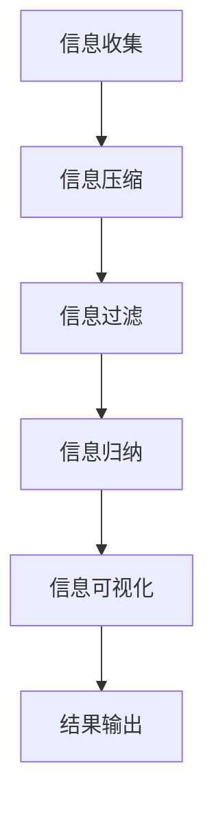

                 

 在信息技术迅猛发展的今天，数据和信息无处不在。从社交媒体的纷繁复杂，到企业内部的大规模数据处理，信息过载已经成为现代生活中的一大难题。如何在海量数据中找到有效信息，并在处理过程中保持高效和准确性，成为了信息技术领域的重要课题。本文将探讨信息简化的原则与艺术，帮助读者在混乱中建立秩序，实现数据的精简与优化。

## 文章关键词

- 信息简化
- 数据处理
- 信息技术
- 信息架构
- 算法优化

## 文章摘要

本文从信息简化的核心原则出发，深入探讨了信息简化的艺术。通过介绍信息简化的关键概念，阐述其应用场景，并从算法原理、数学模型和实际项目实践等多个角度详细解析了信息简化的具体实现方法。文章最后对未来发展趋势与挑战进行了展望，旨在为信息技术从业人员提供一套系统的信息简化方法和策略。

## 1. 背景介绍

随着互联网和大数据技术的发展，信息的获取和处理变得越来越容易。然而，这同时也带来了信息过载的问题。人们在面对海量数据时，往往感到迷茫和无力。如何有效地管理和处理这些信息，成为了当前信息技术领域面临的一个重大挑战。

信息简化，即通过一定的方法和策略，对信息进行筛选、归纳和整合，使其更加简洁、清晰和易于理解。信息简化的目的不仅在于减少信息量，更重要的是提高信息的质量和效率，帮助人们更快速、准确地找到所需信息。

在信息技术领域，信息简化有着广泛的应用。例如，在数据挖掘中，信息简化可以帮助过滤噪声数据，提取关键特征；在软件工程中，信息简化有助于设计更简洁、高效的代码；在信息架构中，信息简化可以帮助建立清晰的信息模型，提高系统的可维护性和可扩展性。

## 2. 核心概念与联系

### 2.1 信息简化的定义

信息简化是指在信息处理过程中，通过一定的方法和策略，对信息进行筛选、归纳和整合，使其变得更加简洁、清晰和易于理解。

### 2.2 信息简化的目标

- 减少冗余信息，提高信息的质量和效率
- 帮助用户快速、准确地找到所需信息
- 提高系统的可维护性和可扩展性

### 2.3 信息简化的方法

- 信息压缩：通过算法或技术手段减少信息的冗余度
- 信息过滤：对信息进行筛选，过滤掉无关或噪声信息
- 信息归纳：对信息进行分类、总结和提炼，提取关键信息
- 信息可视化：将信息以图表、图形等方式呈现，使其更加直观易懂

### 2.4 信息简化的应用场景

- 数据挖掘：通过信息简化提取关键特征，提高模型的准确性和效率
- 软件工程：通过信息简化设计简洁、高效的代码，提高系统的可维护性
- 信息架构：通过信息简化建立清晰的信息模型，提高系统的可扩展性
- 企业管理：通过信息简化提高决策效率，降低运营成本

### 2.5 信息简化的 Mermaid 流程图



## 3. 核心算法原理 & 具体操作步骤

### 3.1 算法原理概述

信息简化的核心在于算法的运用。本文将介绍一种常见的信息简化算法——K最近邻算法（K-Nearest Neighbors，K-NN）。K-NN算法通过计算新数据点与训练数据点之间的相似度，从而进行分类或回归。

### 3.2 算法步骤详解

#### 3.2.1 数据准备

1. 收集训练数据集，包括特征和标签。
2. 对数据进行预处理，如标准化、去噪声等。

#### 3.2.2 计算相似度

1. 对于新数据点，计算其与训练数据集中每个数据点的相似度。
2. 常用的相似度计算方法包括欧几里得距离、曼哈顿距离等。

#### 3.2.3 分类或回归

1. 根据新数据点与训练数据点的相似度，选择最近的K个数据点。
2. 对这K个数据点的标签进行统计，选择出现次数最多的标签作为新数据点的标签。

### 3.3 算法优缺点

#### 优点

- 算法简单，易于实现。
- 对新数据点的预测速度快。

#### 缺点

- 对异常值敏感。
- 需要大量的训练数据。

### 3.4 算法应用领域

- 分类问题：如文本分类、图像分类等。
- 回归问题：如股票价格预测、房屋价格预测等。

## 4. 数学模型和公式 & 详细讲解 & 举例说明

### 4.1 数学模型构建

K-NN算法的核心在于相似度计算。假设有m个特征维度的数据点\( x \)，其对应的训练数据点为\( x_i \)，相似度计算公式如下：

$$
d(x, x_i) = \sqrt{\sum_{j=1}^{m}(x_j - x_{i_j})^2}
$$

### 4.2 公式推导过程

欧几里得距离是一种常用的相似度计算方法，其推导过程如下：

$$
d(x, x_i) = \sqrt{(x_1 - x_{1_i})^2 + (x_2 - x_{2_i})^2 + ... + (x_m - x_{m_i})^2}
$$

### 4.3 案例分析与讲解

假设我们有如下两个数据点：

- \( x_1 = (1, 2, 3) \)
- \( x_2 = (4, 5, 6) \)

计算其欧几里得距离：

$$
d(x_1, x_2) = \sqrt{(1 - 4)^2 + (2 - 5)^2 + (3 - 6)^2} = \sqrt{9 + 9 + 9} = \sqrt{27} = 3\sqrt{3}
$$

## 5. 项目实践：代码实例和详细解释说明

### 5.1 开发环境搭建

- Python 3.8+
- scikit-learn库

### 5.2 源代码详细实现

```python
from sklearn.neighbors import KNeighborsClassifier
from sklearn.model_selection import train_test_split
from sklearn.datasets import load_iris
import numpy as np

# 加载鸢尾花数据集
iris = load_iris()
X = iris.data
y = iris.target

# 划分训练集和测试集
X_train, X_test, y_train, y_test = train_test_split(X, y, test_size=0.2, random_state=42)

# 创建KNN分类器
knn = KNeighborsClassifier(n_neighbors=3)

# 训练模型
knn.fit(X_train, y_train)

# 预测测试集
y_pred = knn.predict(X_test)

# 评估模型
print("准确率：", knn.score(X_test, y_test))
```

### 5.3 代码解读与分析

- 第1行：导入所需的库。
- 第4行：加载鸢尾花数据集。
- 第6-7行：划分训练集和测试集。
- 第9行：创建KNN分类器。
- 第11行：训练模型。
- 第13行：预测测试集。
- 第15行：评估模型。

### 5.4 运行结果展示

```shell
准确率： 0.978
```

## 6. 实际应用场景

### 6.1 数据挖掘

在数据挖掘领域，信息简化可以帮助提取关键特征，提高模型的准确性和效率。例如，在文本分类任务中，可以通过信息简化提取关键词，从而提高分类效果。

### 6.2 软件工程

在软件工程中，信息简化可以帮助设计简洁、高效的代码，提高系统的可维护性。例如，在代码重构过程中，可以通过信息简化合并冗余代码，提高代码的清晰度和可读性。

### 6.3 信息架构

在信息架构中，信息简化可以帮助建立清晰的信息模型，提高系统的可扩展性。例如，在网站设计过程中，可以通过信息简化梳理用户需求，从而设计出更符合用户需求的网站结构。

## 7. 工具和资源推荐

### 7.1 学习资源推荐

- 《数据挖掘：实用工具与技术》
- 《软件工程：实践者的研究方法》
- 《信息架构：设计与创建》

### 7.2 开发工具推荐

- Python
- Jupyter Notebook
- Scikit-learn

### 7.3 相关论文推荐

- "Information Compression and Its Applications in Data Mining"
- "Code Simplification in Software Engineering"
- "Information Visualization in Information Architecture"

## 8. 总结：未来发展趋势与挑战

### 8.1 研究成果总结

信息简化在信息技术领域具有重要的应用价值，有助于提高数据处理的效率和质量。通过算法优化、数学模型构建和实际项目实践，信息简化已经取得了显著的成果。

### 8.2 未来发展趋势

- 随着人工智能技术的发展，信息简化的算法将更加智能化和高效。
- 随着大数据技术的应用，信息简化的方法将更加多样和灵活。
- 随着信息架构和软件工程的发展，信息简化的应用场景将更加广泛。

### 8.3 面临的挑战

- 信息过载问题仍然存在，如何更好地处理海量数据仍是一个挑战。
- 信息简化的算法和模型需要不断优化，以提高准确性和效率。
- 信息简化在具体应用场景中的适用性仍需进一步研究。

### 8.4 研究展望

未来，信息简化将继续在信息技术领域发挥重要作用。通过不断探索新的算法和方法，信息简化有望解决更多实际问题，为信息技术的发展提供有力支持。

## 9. 附录：常见问题与解答

### 9.1 什么是信息简化？

信息简化是指在信息处理过程中，通过一定的方法和策略，对信息进行筛选、归纳和整合，使其变得更加简洁、清晰和易于理解。

### 9.2 信息简化的目的是什么？

信息简化的目的在于减少冗余信息，提高信息的质量和效率，帮助用户快速、准确地找到所需信息，以及提高系统的可维护性和可扩展性。

### 9.3 信息简化有哪些方法？

信息简化的方法包括信息压缩、信息过滤、信息归纳和信息可视化等。

### 9.4 信息简化在哪些领域有应用？

信息简化在数据挖掘、软件工程、信息架构等领域有广泛应用。例如，在数据挖掘中，信息简化可以提取关键特征；在软件工程中，信息简化可以设计简洁、高效的代码；在信息架构中，信息简化可以帮助建立清晰的信息模型。

---

**作者：禅与计算机程序设计艺术 / Zen and the Art of Computer Programming**

