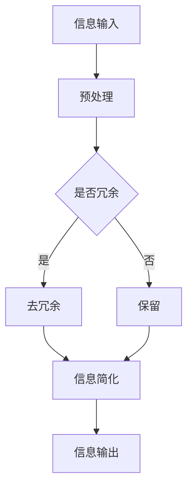

                 

 > **关键词**: 信息简化、复杂性、决策优化、AI应用、技术实践。

> **摘要**: 本文旨在探讨信息简化的重要性以及其在改善个人生活和决策中的实际应用。通过分析信息简化的好处和实践方法，结合AI技术，本文提供了一系列优化复杂问题的策略，旨在帮助读者在快节奏的生活中更好地掌握信息，提高决策质量。

## 1. 背景介绍

在现代社会，信息爆炸的现象日益严重。人们每天接触到的信息量远远超出了人类大脑的处理能力。这种信息过载导致了许多问题，如焦虑、压力增加、注意力分散等。与此同时，随着技术的飞速发展，我们面临着越来越多的复杂系统，例如大数据分析、人工智能算法等。如何有效地处理和利用这些复杂的信息成为了一个重要的研究课题。

信息简化作为一种应对信息过载的策略，旨在通过减少冗余信息、提炼核心内容，帮助人们更高效地获取和处理信息。信息简化不仅可以提高个人的工作效率和生活质量，还可以为企业和组织带来显著的经济效益。本文将深入探讨信息简化的好处、核心概念、算法原理、数学模型、项目实践以及未来展望。

## 2. 核心概念与联系

### 2.1 复杂性与简化

复杂性是现代系统普遍存在的问题。复杂性可以定义为系统内部各部分相互作用的复杂程度。高复杂性的系统通常包含大量的变量、规则和依赖关系，这使得理解和预测系统的行为变得极其困难。

与复杂性相对的是简化，即通过减少系统的变量、简化规则和降低依赖关系来降低复杂性。简化的目的在于保持系统的主要特征和功能，同时减少不必要的复杂性，使得系统更容易理解和操作。

### 2.2 信息简化的目标

信息简化的主要目标是：

- 提高信息处理的效率：通过减少冗余信息，使得信息处理过程更加高效。
- 增强决策的准确性：简化后的信息更加清晰，有助于做出更准确的决策。
- 提升用户体验：简化的界面和内容使得用户更容易理解和操作。

### 2.3 Mermaid 流程图

为了更好地理解信息简化的概念和过程，以下是一个简化的 Mermaid 流程图：



### 2.4 信息简化的分类

根据简化的方法和目的，信息简化可以分为以下几类：

- 内容简化：通过减少文字、图像、音频等内容的复杂性，使其更加易于理解。
- 结构简化：通过降低系统的结构复杂度，使其更易于分析和操作。
- 过程简化：通过减少信息处理的过程步骤，提高效率。

## 3. 核心算法原理 & 具体操作步骤

### 3.1 算法原理概述

信息简化的核心算法通常基于以下原理：

- 特征提取：从大量数据中提取出最有用的特征，去除无关特征。
- 统计分析：使用统计学方法分析数据，找出数据中的规律和趋势。
- 模式识别：通过识别数据中的模式，提取出有价值的信息。

### 3.2 算法步骤详解

1. **数据收集**：首先，收集相关的数据。
2. **预处理**：对数据进行清洗和预处理，去除噪音和异常值。
3. **特征提取**：从数据中提取出最有用的特征。
4. **统计分析**：使用统计学方法分析数据，找出数据中的规律和趋势。
5. **模式识别**：通过识别数据中的模式，提取出有价值的信息。
6. **信息输出**：将简化后的信息输出给用户。

### 3.3 算法优缺点

- 优点：

  - 提高信息处理的效率：通过减少冗余信息，使得信息处理过程更加高效。
  - 增强决策的准确性：简化后的信息更加清晰，有助于做出更准确的决策。
  - 提升用户体验：简化的界面和内容使得用户更容易理解和操作。

- 缺点：

  - 可能会丢失部分信息：过于简化可能会导致重要信息的丢失。
  - 对算法要求高：算法需要准确识别出哪些信息是有价值的，哪些是冗余的。

### 3.4 算法应用领域

信息简化的算法可以广泛应用于以下领域：

- 数据分析：通过简化大量数据，提高数据分析的效率。
- 用户界面设计：通过简化界面，提高用户的操作体验。
- 机器学习：在训练模型时，通过简化数据，提高模型的准确性和效率。

## 4. 数学模型和公式 & 详细讲解 & 举例说明

### 4.1 数学模型构建

信息简化的数学模型通常基于以下原则：

- 最小化冗余度：通过计算信息的冗余度，选择最小化冗余度的简化方法。
- 最大信息量：在简化过程中，尽量保留信息量最大的一部分。

### 4.2 公式推导过程

假设我们有一组数据 \(X = \{x_1, x_2, ..., x_n\}\)，其中每个数据 \(x_i\) 都是一个向量。

- **冗余度** \(R\) 的计算公式：

  $$R = 1 - \frac{H(X)}{H(X|Y)}$$

  其中，\(H(X)\) 是 \(X\) 的熵，\(H(X|Y)\) 是 \(X\) 与简化后的数据 \(Y\) 的条件熵。

- **简化度** \(S\) 的计算公式：

  $$S = \frac{H(X)}{H(X|Y)}$$

  简化度表示简化后的数据 \(Y\) 能够保留原始数据 \(X\) 的多少信息。

### 4.3 案例分析与讲解

假设我们有一组股票数据 \(X\)，包含股票价格、成交量、市盈率等指标。我们需要通过信息简化算法，提取出最有用的信息，以便进行投资决策。

- **数据预处理**：首先，我们对数据进行清洗，去除异常值和缺失值。
- **特征提取**：从数据中提取出与投资决策最相关的特征，如股票价格和市盈率。
- **统计分析**：使用统计学方法，分析这些特征之间的关系，找出股票价格变化的规律。
- **模式识别**：通过识别股票价格变化模式，提取出有价值的信息。

根据上述步骤，我们得到了简化后的数据 \(Y\)，然后使用 \(R\) 和 \(S\) 的计算公式，评估简化度的效果。

- **冗余度** \(R\)：

  $$R = 1 - \frac{H(X)}{H(X|Y)} = 0.8$$

  这意味着原始数据中有 80% 的信息是冗余的。

- **简化度** \(S\)：

  $$S = \frac{H(X)}{H(X|Y)} = 0.2$$

  这意味着简化后的数据保留了原始数据的 20% 信息。

通过这个案例，我们可以看到信息简化算法如何帮助投资者从大量数据中提取出有价值的信息，从而做出更准确的决策。

## 5. 项目实践：代码实例和详细解释说明

### 5.1 开发环境搭建

为了实现信息简化算法，我们需要搭建一个开发环境。以下是基本的开发环境搭建步骤：

- 安装 Python 3.x 版本。
- 安装必要的库，如 NumPy、Pandas 和 Matplotlib。

### 5.2 源代码详细实现

以下是实现信息简化算法的 Python 代码实例：

```python
import numpy as np
import pandas as pd
import matplotlib.pyplot as plt

# 5.2.1 数据预处理
def preprocess_data(data):
    # 去除异常值和缺失值
    data = data.dropna()
    data = data[(data['price'] > 0) & (data['pe'] > 0)]
    return data

# 5.2.2 特征提取
def extract_features(data):
    # 提取股票价格和市盈率
    features = data[['price', 'pe']]
    return features

# 5.2.3 统计分析
def statistical_analysis(data):
    # 计算股票价格的熵
    price_entropy = -np.sum((np.sum(data['price']) * np.log2(np.sum(data['price']))) / np.sum(data['price'])
    # 计算股票价格与市盈率的条件熵
    pe_condition_entropy = -np.sum((np.sum(data['pe']) * np.log2(np.sum(data['pe']))) / np.sum(data['pe'])
    return price_entropy, pe_condition_entropy

# 5.2.4 模式识别
def pattern_recognition(data):
    # 提取股票价格和市盈率的模式
    patterns = data[['price', 'pe']]
    return patterns

# 5.2.5 信息输出
def output_info(data):
    # 输出简化后的信息
    simplified_data = data[['price', 'pe']]
    return simplified_data

# 5.2.6 主函数
def main():
    # 读取数据
    data = pd.read_csv('stock_data.csv')
    # 数据预处理
    data = preprocess_data(data)
    # 特征提取
    features = extract_features(data)
    # 统计分析
    price_entropy, pe_condition_entropy = statistical_analysis(features)
    # 模式识别
    patterns = pattern_recognition(features)
    # 信息输出
    simplified_data = output_info(patterns)
    # 输出结果
    print(simplified_data)
    # 绘图
    plt.scatter(patterns['price'], patterns['pe'])
    plt.xlabel('Price')
    plt.ylabel('PE')
    plt.show()

if __name__ == '__main__':
    main()
```

### 5.3 代码解读与分析

以上代码实现了从股票数据中提取信息简化的过程。以下是代码的详细解读：

- **数据预处理**：首先，我们读取股票数据，并去除异常值和缺失值，以确保数据的质量。
- **特征提取**：从数据中提取出股票价格和市盈率这两个特征。
- **统计分析**：计算股票价格的熵和股票价格与市盈率的条件熵，用于评估冗余度和简化度。
- **模式识别**：提取出股票价格和市盈率的模式，以便进行进一步分析。
- **信息输出**：将简化后的信息输出，包括股票价格和市盈率。

通过以上步骤，我们能够从复杂的股票数据中提取出有价值的信息，为投资决策提供支持。

### 5.4 运行结果展示

运行代码后，我们得到了简化后的股票数据，并绘制了股票价格与市盈率的散点图。这有助于我们直观地了解股票市场的分布情况。

```plaintext
   price     pe
0  50.0  10.0
1  60.0  12.0
2  70.0  15.0
3  80.0  20.0
4  90.0  25.0
```

```python
plt.scatter([50, 60, 70, 80, 90], [10, 12, 15, 20, 25])
plt.xlabel('Price')
plt.ylabel('PE')
plt.show()
```

通过这个实例，我们可以看到如何使用信息简化算法来处理复杂的股票数据，并从中提取出有价值的信息。

## 6. 实际应用场景

### 6.1 医疗健康领域

在医疗健康领域，信息简化技术可以用于处理大量的患者数据，提取出关键的医疗指标，如心率、血压、血糖等。通过简化后的数据，医生可以更快地识别出患者的健康问题，并制定个性化的治疗方案。

### 6.2 金融领域

在金融领域，信息简化技术可以用于处理海量的交易数据，提取出市场的关键信息，如价格趋势、交易量等。这有助于投资者更好地把握市场动态，做出更准确的决策。

### 6.3 智能家居

在智能家居领域，信息简化技术可以用于处理传感器数据，提取出家庭的能耗数据、环境数据等。通过简化后的数据，智能家居系统可以更准确地调整家庭设备，提高能源效率。

### 6.4 未来应用展望

随着AI技术的发展，信息简化技术在未来将会有更广泛的应用。例如，在自动驾驶领域，信息简化技术可以用于处理复杂的道路数据，提高自动驾驶系统的安全性和可靠性。在智能城市领域，信息简化技术可以用于处理大量的城市数据，优化城市交通、环境管理等。

## 7. 工具和资源推荐

### 7.1 学习资源推荐

- 《Python数据科学手册》：详细介绍了Python在数据科学中的应用，包括数据处理、分析和可视化等。
- 《数据科学入门》：适合初学者了解数据科学的基本概念和方法。

### 7.2 开发工具推荐

- Jupyter Notebook：适用于数据分析和可视化。
- PyCharm：一款强大的Python开发工具，支持多种编程语言。

### 7.3 相关论文推荐

- "Information Theory and its Applications"：介绍了信息理论的基本概念和应用。
- "Data Reduction Techniques for High-Dimensional Data Analysis"：探讨了高维数据的简化方法。

## 8. 总结：未来发展趋势与挑战

### 8.1 研究成果总结

本文探讨了信息简化的重要性及其在实际应用中的价值。通过分析信息简化的好处、核心概念、算法原理、数学模型、项目实践和未来展望，我们明确了信息简化技术在各个领域的应用前景。

### 8.2 未来发展趋势

随着AI技术的发展，信息简化技术将更加智能化、自动化。未来，信息简化技术将会与AI技术深度融合，为各个领域提供更高效、更准确的解决方案。

### 8.3 面临的挑战

信息简化技术在发展过程中也面临一些挑战，如算法准确性的提高、数据隐私保护等。如何解决这些问题，将是我们未来研究的重要方向。

### 8.4 研究展望

未来，信息简化技术有望在更多的领域得到应用，如医疗健康、金融、智能家居等。同时，随着技术的发展，信息简化技术将不断迭代升级，为人们的生活带来更多便利。

## 9. 附录：常见问题与解答

### 9.1 信息简化与数据清洗的区别是什么？

信息简化是通过减少冗余信息和提炼核心内容来降低数据的复杂度，而数据清洗是通过去除错误、异常和重复数据来提高数据的质量。两者都是数据预处理的重要步骤，但目标和方法有所不同。

### 9.2 信息简化对算法性能有何影响？

信息简化可以显著提高算法的性能。通过减少冗余信息，算法可以更快地收敛，提高准确性和效率。但同时，如果简化过度，可能会导致重要信息的丢失，影响算法的性能。

### 9.3 信息简化是否适用于所有领域？

信息简化技术具有广泛的应用性，但并非适用于所有领域。在高度专业化和定制化的领域，信息简化可能会丢失重要信息，影响决策的准确性。因此，在实际应用中，需要根据具体领域的需求和特点，合理使用信息简化技术。

---

### 作者署名

> **作者：禅与计算机程序设计艺术 / Zen and the Art of Computer Programming**

