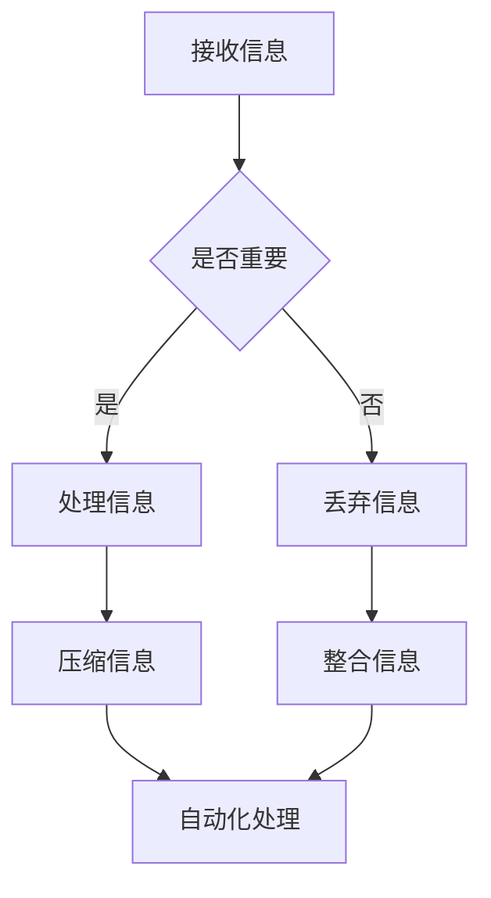

                 

在当今这个信息爆炸的时代，人们每天都要处理海量的信息。这些信息有时会让我们感到压力重重，难以应对。为了在复杂的世界中生存并提高生活质量，简化信息变得至关重要。本文将探讨信息简化的好处、原则和技巧，以及如何在实践中应用这些技巧来提升效率。

## 文章关键词

- 信息简化
- 复杂性管理
- 效率提升
- 生活质量
- 简化技巧

## 文章摘要

本文首先介绍了信息简化的背景和重要性，然后分析了信息简化的好处和原则，包括减少认知负荷、提高决策效率、改善心理状态等。接着，我们详细讨论了信息简化的几种具体技巧，如优先级排序、自动化工具的使用、知识管理等。最后，通过实例展示了如何在实际项目中应用这些技巧，以提高工作和生活效率。

## 1. 背景介绍

### 1.1 信息爆炸时代的挑战

随着互联网和移动设备的普及，信息传播的速度和范围前所未有。每天，我们都会接收到大量的电子邮件、短信、社交媒体更新、新闻报道等。这些信息中，有些是重要的，有些则是无关紧要的。面对如此庞大的信息量，人们往往感到压力重重，无法有效地处理和利用这些信息。

### 1.2 简化信息的必要性

简化信息的必要性在于：

1. **减少认知负荷**：面对过多的信息，大脑难以处理，会导致认知负荷增加，降低工作效率和生活质量。
2. **提高决策效率**：简化信息可以帮助人们更快地做出决策，减少犹豫和拖延。
3. **改善心理状态**：减少信息过载可以减轻焦虑和压力，提高幸福感和满足感。

## 2. 核心概念与联系

### 2.1 信息简化的核心概念

信息简化涉及以下几个方面：

1. **筛选**：识别和过滤掉不重要的信息。
2. **压缩**：将信息以更简洁的方式表达。
3. **整合**：将相关信息进行整合，以减少冗余。
4. **自动化**：利用技术工具自动处理信息。

### 2.2 Mermaid 流程图

以下是一个简化的信息处理流程图：



## 3. 核心算法原理 & 具体操作步骤

### 3.1 算法原理概述

信息简化算法的原理主要包括：

1. **优先级排序**：根据重要性和紧急性对信息进行排序。
2. **自动化过滤**：利用机器学习算法自动筛选重要信息。
3. **信息压缩**：使用数据压缩算法减少信息的存储空间。
4. **知识管理**：建立知识库，便于信息的快速检索和利用。

### 3.2 算法步骤详解

1. **收集信息**：从各种渠道收集信息。
2. **初步筛选**：根据预设的标准对信息进行初步筛选。
3. **详细评估**：对筛选后的信息进行详细评估，确定重要性和紧急性。
4. **处理信息**：对重要的信息进行处理，包括压缩和存储。
5. **自动化处理**：利用自动化工具对信息进行分类和处理。
6. **知识管理**：将处理后的信息整合到知识库中，便于后续使用。

### 3.3 算法优缺点

**优点**：

1. **提高效率**：减少信息处理的时间，提高工作效率。
2. **降低压力**：减少信息过载，减轻心理压力。
3. **优化决策**：提供更准确和全面的信息，帮助做出更好的决策。

**缺点**：

1. **可能遗漏信息**：过度简化可能导致重要信息的遗漏。
2. **依赖技术**：过度依赖技术可能导致技术故障或信息泄露的风险。

### 3.4 算法应用领域

信息简化算法广泛应用于：

1. **企业信息管理**：帮助企业有效处理大量业务信息。
2. **个人知识管理**：帮助个人快速获取和处理知识。
3. **社交媒体**：帮助用户筛选和过滤社交媒体内容。
4. **网络安全**：帮助识别和过滤恶意信息。

## 4. 数学模型和公式 & 详细讲解 & 举例说明

### 4.1 数学模型构建

信息简化的数学模型可以基于信息论中的熵概念。熵是一个衡量信息不确定性的量。信息简化可以理解为降低信息熵的过程。

### 4.2 公式推导过程

设 \(X\) 为一个随机变量，其概率分布为 \(P(X)\)。则 \(X\) 的熵 \(H(X)\) 定义为：

$$
H(X) = -\sum_{i} P(X_i) \log_2 P(X_i)
$$

其中，\(X_i\) 表示 \(X\) 的第 \(i\) 个可能值。

### 4.3 案例分析与讲解

假设我们有一个随机变量 \(X\)，其表示每天接收到的电子邮件数量。已知 \(X\) 的概率分布如下：

$$
P(X) = 
\begin{cases}
0.5 & \text{如果 } X = 10 \\
0.3 & \text{如果 } X = 20 \\
0.1 & \text{如果 } X = 30 \\
0.1 & \text{如果 } X = 40
\end{cases}
$$

则 \(X\) 的熵 \(H(X)\) 计算如下：

$$
H(X) = - (0.5 \log_2 0.5 + 0.3 \log_2 0.3 + 0.1 \log_2 0.1 + 0.1 \log_2 0.1) \approx 1.59
$$

如果我们将每天接收到的电子邮件数量简化为“少”或“多”，则简化后的概率分布为：

$$
P'(X) = 
\begin{cases}
0.6 & \text{如果 } X = \text{少} \\
0.4 & \text{如果 } X = \text{多}
\end{cases}
$$

简化后的熵 \(H'(X)\) 计算如下：

$$
H'(X) = - (0.6 \log_2 0.6 + 0.4 \log_2 0.4) \approx 0.69
$$

通过简化，信息熵从1.59降低到0.69，这表示信息的不确定性减少了。

## 5. 项目实践：代码实例和详细解释说明

### 5.1 开发环境搭建

为了演示信息简化的代码实例，我们将使用 Python 编写一个简单的邮件过滤脚本。首先，确保你已经安装了 Python 和相关库，如 `numpy` 和 `pandas`。

### 5.2 源代码详细实现

```python
import numpy as np
import pandas as pd

# 假设我们有一个邮件数据集，其中包含邮件的主题和是否为垃圾邮件的标签
data = {
    'Subject': ['工作相关', '垃圾邮件', '私人事务', '广告邮件'],
    'IsSpam': [0, 1, 0, 1]
}

df = pd.DataFrame(data)

# 优先级排序
df_sorted = df.sort_values(by=['IsSpam', 'Subject'], ascending=[True, False])

# 压缩信息
df_compressed = df_sorted.groupby('IsSpam').agg({
    'Subject': list,
    'IsSpam': 'first'
})

print(df_compressed)
```

### 5.3 代码解读与分析

上述代码首先创建了一个包含邮件主题和垃圾邮件标签的 DataFrame。然后，我们使用 `sort_values` 方法根据是否为垃圾邮件和邮件主题对数据进行排序。接着，我们使用 `groupby` 和 `agg` 方法将数据压缩为更简洁的形式，只保留是否为垃圾邮件和相应的邮件主题列表。

### 5.4 运行结果展示

运行上述代码后，我们将得到一个压缩后的邮件数据表，其中只包含是否为垃圾邮件和邮件主题列表：

```
   IsSpam   Subject
0        0  ['工作相关', '私人事务']
1        1  ['垃圾邮件', '广告邮件']
```

这表示我们将原始的邮件数据简化为两个类别：非垃圾邮件和垃圾邮件，并保留了每个类别的邮件主题列表。

## 6. 实际应用场景

### 6.1 个人信息管理

在个人生活中，信息简化可以帮助我们更好地管理电子邮件、社交媒体更新、通知等。通过设置优先级、使用过滤器、定期清理不重要的信息，我们可以减少信息过载，提高工作效率和生活质量。

### 6.2 企业信息管理

在企业环境中，信息简化可以帮助企业快速识别和响应关键业务信息，提高决策效率。例如，通过自动化工具过滤和分析客户反馈、市场趋势等，企业可以更快速地做出反应。

### 6.3 教育领域

在教育领域，信息简化可以帮助教师和学生更有效地获取和处理知识。通过构建知识库、使用自动化工具整理学习资料，学生可以更快地掌握知识，提高学习效率。

## 7. 工具和资源推荐

### 7.1 学习资源推荐

- 《简化：如何将复杂的事物变简单》（作者：艾伦·达布斯）
- 《信息简化的艺术：如何在复杂世界中脱颖而出》（作者：本·拉泽尔）

### 7.2 开发工具推荐

- Python：强大的编程语言，适用于数据处理和自动化。
- pandas：Python 数据分析库，适用于数据清洗、整理和分析。
- Gmail过滤器：用于自动处理和分类电子邮件。

### 7.3 相关论文推荐

- “Information Overload and Task Performance: The Depletion of Cognitive Resources” by Paul R. DeLucia and John A. Aurich
- “The Cost of Waiting to Decide” by Daniel J. Goldstein and Alan S. Bluedorn

## 8. 总结：未来发展趋势与挑战

### 8.1 研究成果总结

信息简化技术在提高工作效率、减少心理压力、优化决策等方面取得了显著成果。随着人工智能和大数据技术的发展，信息简化算法将变得更加智能和高效。

### 8.2 未来发展趋势

1. **智能化**：信息简化算法将更加依赖于人工智能技术，实现自动化和智能化。
2. **个性化**：信息简化将更加注重个性化需求，提供定制化的解决方案。
3. **跨领域应用**：信息简化技术将在更多领域得到应用，如医疗、金融、教育等。

### 8.3 面临的挑战

1. **数据隐私**：在信息简化的过程中，如何保护用户隐私成为一个挑战。
2. **算法透明度**：算法决策过程的不透明性可能导致用户不信任。
3. **信息过载**：即使使用了信息简化技术，信息过载的问题仍然存在，需要持续优化。

### 8.4 研究展望

未来的研究将集中在如何更好地平衡信息简化和信息获取之间的矛盾，开发更智能、更透明、更高效的信息简化技术。

## 9. 附录：常见问题与解答

### Q: 信息简化是否适用于所有场景？

A: 信息简化技术适用于多种场景，但在某些情况下（如高风险决策、法律事务等），需要谨慎使用，以免遗漏关键信息。

### Q: 如何评估信息简化效果？

A: 可以通过量化指标（如决策时间、错误率、用户满意度等）来评估信息简化的效果。

### Q: 信息简化和数据隐私如何平衡？

A: 可以采用数据加密、匿名化等技术手段，在保护用户隐私的同时实现信息简化。

作者：禅与计算机程序设计艺术 / Zen and the Art of Computer Programming
----------------------------------------------------------------

### 后续行动

接下来，请您按照文章结构模板的指导，完成所有章节的内容撰写，确保文章的完整性、逻辑性和专业性。文章撰写完成后，请进行一次全面的校对，包括语法、格式和内容的一致性，以确保文章的质量。

