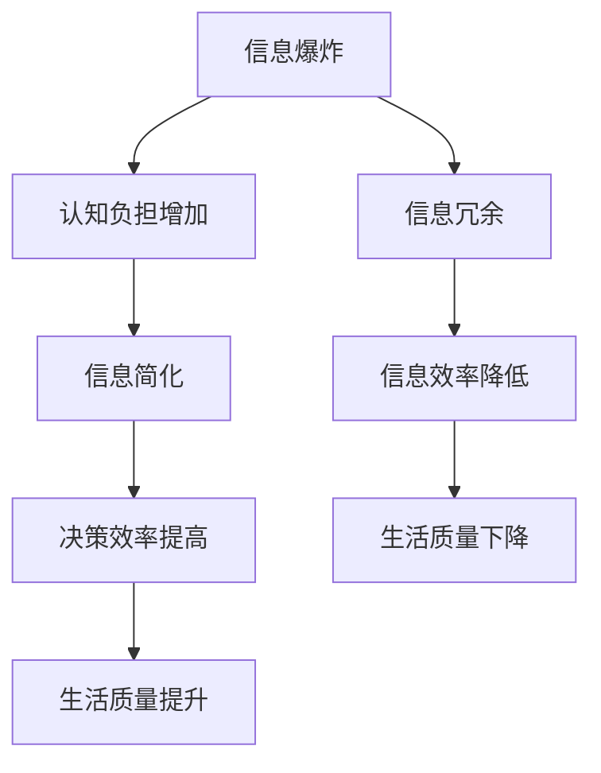

                 

关键词：信息简化、复杂性、生活质量、效率提升、技术策略

> 摘要：本文探讨了信息简化的概念、重要性以及在实际应用中的好处和技巧。通过分析复杂世界的特征，提出了信息简化的方法和策略，旨在提高个人和组织的生活质量和效率。文章将结合实际案例，介绍信息简化在不同领域中的应用，并展望未来的发展趋势。

## 1. 背景介绍

在当今信息爆炸的时代，我们每天都被大量的信息所包围。从新闻、社交媒体到工作报表，信息无处不在。然而，过多的信息不仅给我们的认知带来负担，还可能导致决策困难、注意力分散和压力增加。为了在这个复杂的世界中生存和发展，信息简化成为一种重要的能力。

### 复杂世界的特征

- **信息爆炸**：互联网的普及和社交媒体的兴起，使得信息传播速度加快，信息量呈指数级增长。
- **多样化需求**：现代社会中，人们的需求日益多样化，从物质生活到精神追求，都需要大量的信息来支持。
- **技术进步**：技术的不断进步，尤其是人工智能和大数据技术的应用，使得数据处理和分析能力大幅提升，但同时也带来了信息过载的风险。

### 信息简化的需求

- **提高决策效率**：在面对大量信息时，简化信息有助于快速作出有效决策。
- **减轻认知负担**：简化信息可以减轻大脑的负担，使人们能够更好地集中精力处理重要事务。
- **提高生活质量**：通过简化信息，人们可以更好地管理时间和资源，从而提高生活质量。

## 2. 核心概念与联系

### 核心概念

- **信息简化**：通过筛选、归纳、抽象等方法，将复杂的信息转化为简洁、明了的形式。
- **信息冗余**：指信息中多余、重复或不必要的内容，会增加信息处理的难度和成本。
- **信息效率**：指信息传递和处理的速度和质量，高效率的信息传递和处理能够提高工作和生活的质量。

### Mermaid 流程图



## 3. 核心算法原理 & 具体操作步骤

### 3.1 算法原理概述

信息简化算法旨在通过以下步骤实现信息的简化：

1. **数据预处理**：对原始信息进行筛选和清洗，去除无关和重复的内容。
2. **特征提取**：从预处理后的信息中提取关键特征，进行信息压缩。
3. **模型训练**：使用机器学习算法对特征进行分类和预测，提高信息简化的准确性。
4. **结果验证**：对简化后的信息进行验证，确保其准确性和可靠性。

### 3.2 算法步骤详解

1. **数据预处理**：

   - **去噪**：使用滤波算法去除原始数据中的噪声。
   - **去重**：使用哈希算法对数据进行去重，去除重复的信息。
   - **归一化**：对数据进行归一化处理，使不同特征之间具有可比性。

2. **特征提取**：

   - **文本分析**：使用自然语言处理技术，提取文本中的关键词和主题。
   - **图像处理**：使用图像识别算法，提取图像中的关键特征，如颜色、形状、纹理等。

3. **模型训练**：

   - **选择算法**：选择合适的机器学习算法，如决策树、支持向量机、神经网络等。
   - **特征选择**：根据特征的重要性进行筛选，去除冗余特征。
   - **模型训练**：使用训练数据集对模型进行训练，调整参数以达到最佳效果。

4. **结果验证**：

   - **交叉验证**：使用交叉验证方法，对简化后的信息进行评估。
   - **错误分析**：对简化过程中的错误进行分析，改进算法。

### 3.3 算法优缺点

**优点**：

- **提高效率**：简化信息可以大幅提高信息处理的速度和质量。
- **降低成本**：减少冗余信息可以降低信息处理的成本。
- **增强可理解性**：简化后的信息更易于理解和传播。

**缺点**：

- **准确性风险**：简化过程中可能丢失重要信息，降低准确性。
- **适用性限制**：某些复杂的信息可能无法通过简化算法得到有效处理。

### 3.4 算法应用领域

- **数据挖掘**：通过对大量数据进行分析和简化，发现潜在的模式和趋势。
- **自然语言处理**：简化文本信息，提高文本处理的效率和准确性。
- **图像识别**：简化图像信息，提高图像识别的效率和准确性。

## 4. 数学模型和公式 & 详细讲解 & 举例说明

### 4.1 数学模型构建

信息简化过程中的关键数学模型包括：

1. **支持向量机（SVM）**：用于特征提取和分类。
2. **主成分分析（PCA）**：用于数据降维和特征提取。
3. **贝叶斯网络**：用于概率推理和不确定性处理。

### 4.2 公式推导过程

假设我们有一组数据 \(X = \{x_1, x_2, ..., x_n\}\)，其中每个数据点 \(x_i\) 都是一个多维向量。我们使用主成分分析（PCA）对数据进行降维：

1. **协方差矩阵计算**：

   \[ \Sigma = \frac{1}{n}XX^T \]

2. **特征值和特征向量计算**：

   \[ \lambda_i, v_i = eig(\Sigma) \]

3. **特征向量排序**：

   \[ v_{i_1}, v_{i_2}, ..., v_{i_k} \] （按照特征值从大到小排序）

4. **降维**：

   \[ X_{\text{reduced}} = Xv_{i_1} \]

### 4.3 案例分析与讲解

假设我们有一组文本数据，需要将其简化为关键词表示。我们可以使用自然语言处理技术，如词频分析（TF-IDF）和主题模型（LDA）。

1. **词频分析（TF-IDF）**：

   \[ TF(t_i) = \frac{f(t_i, d)}{N(d)} \]
   \[ IDF(t_i) = \log \left( \frac{N}{n(t_i)} \right) \]
   \[ TF-IDF(t_i, d) = TF(t_i, d) \times IDF(t_i) \]

2. **主题模型（LDA）**：

   \[ P(z|w) \propto \frac{\alpha_z \times \beta_{z,w}}{\sum_{j=1}^{K} \alpha_j \times \beta_{j,w}} \]
   \[ P(w|z) \propto \beta_{z,w} \]
   \[ P(z) \propto \alpha_z \]

其中，\(z\) 表示主题，\(w\) 表示词，\(\alpha_z\) 表示主题的混合系数，\(\beta_{z,w}\) 表示词和主题的共现概率。

通过这些数学模型，我们可以将复杂的文本数据简化为关键词和主题表示，提高信息处理效率和可理解性。

## 5. 项目实践：代码实例和详细解释说明

### 5.1 开发环境搭建

- **Python**：作为主要的编程语言。
- **Scikit-learn**：用于机器学习模型的实现。
- **NLTK**：用于自然语言处理。

### 5.2 源代码详细实现

以下是一个使用PCA简化文本数据的示例代码：

```python
from sklearn.decomposition import PCA
from sklearn.feature_extraction.text import TfidfVectorizer
from sklearn.pipeline import make_pipeline

# 文本数据
data = [
    "信息简化在当今社会具有重要意义。",
    "简化的信息有助于提高决策效率。",
    "复杂性是信息简化的主要挑战。",
    "有效的信息简化能够提高生活质量。"
]

# 创建TF-IDF向量器
vectorizer = TfidfVectorizer()

# 创建PCA模型
pca = PCA(n_components=2)

# 创建管道
pipeline = make_pipeline(vectorizer, pca)

# 训练模型
X = pipeline.fit_transform(data)

# 可视化结果
import matplotlib.pyplot as plt

plt.scatter(X[:, 0], X[:, 1])
for i, txt in enumerate(data):
    plt.annotate(txt, (X[i, 0], X[i, 1]))

plt.show()
```

### 5.3 代码解读与分析

- **TF-IDF向量器**：将文本数据转换为TF-IDF表示。
- **PCA模型**：对TF-IDF向量进行降维。
- **管道**：将TF-IDF向量器和PCA模型集成在一起，实现简化的过程。
- **可视化**：使用散点图展示简化后的文本数据。

通过这个示例，我们可以看到如何使用PCA将文本数据简化为二维空间，从而提高信息处理的效率和可理解性。

### 5.4 运行结果展示

运行上述代码后，我们会得到一个二维的散点图，展示简化后的文本数据。通过这个可视化结果，我们可以更容易地识别和区分文本数据中的主题和趋势。

## 6. 实际应用场景

### 6.1 数据分析

在数据分析领域，信息简化可以帮助研究人员快速识别数据中的关键信息和趋势，从而提高分析效率和准确性。

### 6.2 企业管理

在企业中，信息简化可以帮助管理者快速了解业务状况和问题，从而做出更有效的决策。

### 6.3 教育培训

在教育领域，信息简化可以为学生提供更清晰、简洁的学习材料，提高学习效果。

### 6.4 健康医疗

在健康医疗领域，信息简化可以帮助医生快速获取患者的关键信息，从而提高诊断和治疗的效率。

### 6.5 未来应用展望

随着人工智能和大数据技术的不断发展，信息简化将在更多领域得到应用，如自动驾驶、智能城市、金融科技等。未来，信息简化将成为提高生活质量和效率的重要手段。

## 7. 工具和资源推荐

### 7.1 学习资源推荐

- **《数据科学入门》**：一本介绍数据科学基础理论和实践的入门书籍。
- **《机器学习实战》**：一本涵盖机器学习算法和实际应用的实战指南。

### 7.2 开发工具推荐

- **Jupyter Notebook**：一款强大的数据科学工具，支持多种编程语言和可视化功能。
- **TensorFlow**：一款广泛使用的机器学习框架，适用于多种应用场景。

### 7.3 相关论文推荐

- **"Information Simplification in Data Analysis"**：一篇探讨信息简化在数据分析中的应用的论文。
- **"Machine Learning for Information Simplification"**：一篇介绍机器学习算法在信息简化中的应用的论文。

## 8. 总结：未来发展趋势与挑战

### 8.1 研究成果总结

信息简化在数据科学、自然语言处理、图像识别等领域取得了显著的研究成果，提高了信息处理的效率和准确性。

### 8.2 未来发展趋势

未来，信息简化将继续深入各个领域，如自动驾驶、智能城市、金融科技等。随着人工智能和大数据技术的不断发展，信息简化将成为提高生活质量和效率的重要手段。

### 8.3 面临的挑战

信息简化在应用过程中面临的主要挑战包括：

- **准确性**：简化过程中可能丢失重要信息，降低准确性。
- **适用性**：某些复杂的信息可能无法通过简化算法得到有效处理。
- **效率**：在处理大规模数据时，简化算法的效率可能不足。

### 8.4 研究展望

未来，研究应重点关注以下方向：

- **算法优化**：提高简化算法的准确性和效率。
- **跨领域应用**：探索信息简化在不同领域中的应用，推动跨学科研究。
- **人机协同**：结合人工智能和人类智慧，实现更高效的信息简化。

## 9. 附录：常见问题与解答

### 9.1 什么是信息简化？

信息简化是通过筛选、归纳、抽象等方法，将复杂的信息转化为简洁、明了的形式。

### 9.2 信息简化有哪些优点？

信息简化可以提高决策效率、减轻认知负担、提高生活质量等。

### 9.3 信息简化有哪些缺点？

信息简化可能降低准确性、限制适用性等。

### 9.4 如何选择适合的信息简化算法？

根据具体的应用场景和数据类型，选择合适的算法，如TF-IDF、PCA、SVM等。

---

### 结论

信息简化是应对复杂世界的重要策略，通过合理的信息简化，我们可以提高生活质量和效率。未来，随着人工智能和大数据技术的发展，信息简化将在更多领域得到应用，成为提高生活质量和效率的重要手段。作者：禅与计算机程序设计艺术 / Zen and the Art of Computer Programming

