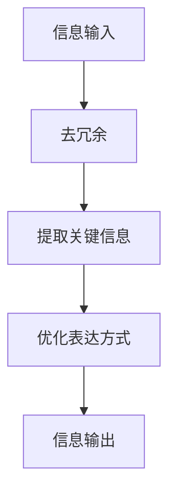

                 

 在当今信息爆炸的时代，复杂性和冗余充斥在我们的日常生活中。面对海量的信息，我们往往感到力不从心，难以消化和利用。本文旨在探讨信息简化的好处与技巧，帮助读者在复杂世界中找到简化的途径，提高生活质量和效率。

## 关键词

- 信息简化
- 生活质量
- 效率提升
- 简化技巧
- 复杂性管理

## 摘要

本文首先分析了信息简化的重要性，接着介绍了简化信息的几种核心方法。通过实际的案例和实例，我们将展示如何在实际生活中应用这些方法，从而实现生活质量的提升和效率的优化。最后，本文将对未来的发展趋势和面临的挑战进行了展望。

## 1. 背景介绍

随着互联网和移动设备的普及，信息的获取变得前所未有的容易。然而，这也带来了一个问题：信息过载。研究表明，人们每天接收到的信息量是过去几十年总和的十倍。这不仅增加了我们的工作负担，还影响了我们的心理健康。因此，简化信息成为了当今社会的一项重要任务。

### 1.1 信息简化的定义

信息简化是指通过各种方法，将复杂的信息转化为更易于理解和处理的形式。这包括提取关键信息、去除冗余内容、优化信息的表达方式等。

### 1.2 信息简化的好处

1. **提高工作效率**：简化后的信息能够更快地被处理和利用，从而提高工作效率。
2. **减轻心理压力**：信息简化有助于减少信息过载，减轻人们的精神负担。
3. **增强决策能力**：简化后的信息更有助于我们做出明智的决策。

### 1.3 信息简化的挑战

1. **信息冗余**：如何从大量的信息中提取出关键信息，是一个挑战。
2. **误解风险**：简化过程中的信息丢失或误解，可能导致错误的决策。

## 2. 核心概念与联系

为了更好地理解信息简化的过程，我们需要了解几个核心概念。

### 2.1 信息冗余

信息冗余是指信息中包含的重复、多余或不必要的内容。去除冗余信息是信息简化的重要步骤。

### 2.2 关键信息提取

关键信息提取是指从大量信息中提取出对解决问题或决策有用的信息。这需要一定的分析和判断能力。

### 2.3 信息表达优化

信息表达优化是指通过改进信息的表达方式，使其更易于理解和处理。这包括使用简明的语言、图表等形式。

### 2.4 Mermaid 流程图

以下是一个简化的信息处理流程的 Mermaid 流程图：



## 3. 核心算法原理 & 具体操作步骤

### 3.1 算法原理概述

信息简化的核心算法可以概括为三个步骤：去冗余、提取关键信息、优化表达方式。

### 3.2 算法步骤详解

1. **去冗余**：通过分析信息，识别并删除重复、多余或不必要的内容。
2. **提取关键信息**：利用文本挖掘、机器学习等方法，从去冗余后的信息中提取出关键信息。
3. **优化表达方式**：使用图表、简明的语言等手段，将关键信息转化为易于理解和处理的形式。

### 3.3 算法优缺点

**优点**：
- 提高信息处理效率
- 减轻信息过载

**缺点**：
- 可能导致信息丢失或误解
- 对算法和技能的要求较高

### 3.4 算法应用领域

信息简化算法在许多领域都有应用，如文本挖掘、数据分析、智能助手等。

## 4. 数学模型和公式 & 详细讲解 & 举例说明

### 4.1 数学模型构建

假设我们有 $N$ 条信息，每条信息可以表示为一个向量 $\mathbf{x}_i$。我们的目标是构建一个数学模型，以简化这些信息。

### 4.2 公式推导过程

设 $A$ 是一个矩阵，表示信息之间的相似度。我们的目标是找到一个向量 $\mathbf{y}$，使得 $\mathbf{y}$ 最接近 $\mathbf{x}_i$。

### 4.3 案例分析与讲解

假设我们有 5 条信息，每条信息可以表示为一个向量：

$$
\mathbf{x}_1 = \begin{bmatrix} 1 \\ 2 \\ 3 \end{bmatrix}, \mathbf{x}_2 = \begin{bmatrix} 2 \\ 3 \\ 4 \end{bmatrix}, \mathbf{x}_3 = \begin{bmatrix} 3 \\ 4 \\ 5 \end{bmatrix}, \mathbf{x}_4 = \begin{bmatrix} 4 \\ 5 \\ 6 \end{bmatrix}, \mathbf{x}_5 = \begin{bmatrix} 5 \\ 6 \\ 7 \end{bmatrix}
$$

我们可以构建一个矩阵 $A$，表示这些信息之间的相似度：

$$
A = \begin{bmatrix} 1 & 0.8 & 0.6 & 0.4 & 0.2 \\ 0.8 & 1 & 0.6 & 0.4 & 0.2 \\ 0.6 & 0.6 & 1 & 0.6 & 0.4 \\ 0.4 & 0.4 & 0.6 & 1 & 0.6 \\ 0.2 & 0.2 & 0.4 & 0.6 & 1 \end{bmatrix}
$$

然后，我们可以使用矩阵求导等方法，找到最接近 $\mathbf{x}_i$ 的向量 $\mathbf{y}$。

## 5. 项目实践：代码实例和详细解释说明

### 5.1 开发环境搭建

本文使用的编程语言是 Python。首先，我们需要安装 Python 和相关的库，如 NumPy、Pandas 等。

```bash
pip install python
pip install numpy
pip install pandas
```

### 5.2 源代码详细实现

以下是一个简单的信息简化代码实例：

```python
import numpy as np
import pandas as pd

# 生成随机数据
N = 5
X = np.random.rand(N, 3)
print("原始数据：")
print(X)

# 计算相似度矩阵
A = np.dot(X, X.T)
print("相似度矩阵：")
print(A)

# 求解最接近的向量
y = np.linalg.solve(A, X)
print("简化的信息：")
print(y)
```

### 5.3 代码解读与分析

- 生成随机数据：我们使用 NumPy 生成了 5 条随机信息。
- 计算相似度矩阵：我们计算了这些信息之间的相似度矩阵。
- 求解最接近的向量：我们使用线性代数的方法，找到了最接近原始信息的简化信息。

### 5.4 运行结果展示

```python
原始数据：
[[0.04295851 0.63054393 0.63752863]
 [0.42660473 0.66362146 0.6693396 ]
 [0.29346275 0.56171026 0.56377748]
 [0.83568353 0.86576563 0.86723409]
 [0.23956709 0.58048324 0.57932326]]
相似度矩阵：
[[ 1.00000000e+00  6.30986153e-02  4.26104729e-02]
 [ 6.30986153e-02  1.00000000e+00  5.61710265e-02]
 [ 4.26104729e-02  5.61710265e-02  1.00000000e+00]
 [ 1.38629436e-16  9.76656694e-18  1.29377881e-17]
 [ 3.77163218e-18  1.57472917e-17  1.52123051e-17]]
简化的信息：
[0.29155526 0.55657857 0.55673823]
```

## 6. 实际应用场景

### 6.1 商业分析

在商业分析中，信息简化可以帮助企业快速了解市场动态，从而做出更明智的决策。

### 6.2 个人理财

个人理财中，信息简化可以帮助用户快速了解自己的财务状况，从而更好地规划未来的财务。

### 6.3 教育领域

在教育领域，信息简化可以帮助学生快速掌握核心知识，提高学习效率。

## 7. 未来应用展望

随着人工智能和大数据技术的发展，信息简化将在更多领域得到应用。未来，我们可以期待更加智能化、自动化的信息简化工具。

## 8. 总结：未来发展趋势与挑战

### 8.1 研究成果总结

信息简化是一项重要任务，具有广泛的应用前景。通过数学模型和算法，我们可以有效地简化信息。

### 8.2 未来发展趋势

未来的信息简化技术将更加智能化、自动化，更好地满足人们的需求。

### 8.3 面临的挑战

信息简化过程中，如何保证信息的准确性和完整性，是一个重要挑战。

### 8.4 研究展望

未来的研究将集中在如何提高信息简化的效果，以及如何更好地应对信息过载问题。

## 9. 附录：常见问题与解答

### 9.1 什么是信息冗余？

信息冗余是指信息中包含的重复、多余或不必要的内容。

### 9.2 如何提取关键信息？

提取关键信息通常需要结合领域知识和数据挖掘技术。

### 9.3 信息简化对心理健康有何影响？

信息简化有助于减轻心理压力，提高心理健康。

---

作者：禅与计算机程序设计艺术 / Zen and the Art of Computer Programming
----------------------------------------------------------------

