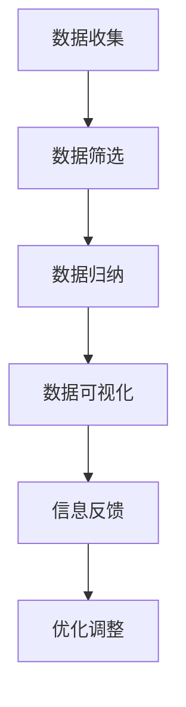

                 

在当今这个信息爆炸的时代，信息过载已经成为一个普遍的现象。我们每天都被大量的数据和信息所包围，这给我们的生活和工作带来了巨大的挑战。如何在复杂的信息世界中找到一条清晰的道路，提升生活质量和效率，成为了一个亟待解决的问题。本文将探讨信息简化的好处与技巧，帮助您在复杂世界中找到一条简洁而高效的道路。

## 关键词

- 信息简化
- 生活质量
- 效率提升
- 数据处理
- 人工智能
- 人类认知

## 摘要

本文首先介绍了信息简化的背景和重要性，然后详细阐述了信息简化的好处和技巧，包括如何使用人工智能和人类认知的优势来实现信息的简化。文章还将通过实际案例和数学模型，展示信息简化在各个领域的应用和效果。最后，本文提出了未来信息简化的发展趋势和面临的挑战，为读者提供了进一步探索的方向。

## 1. 背景介绍

### 1.1 信息过载现象

随着互联网和移动设备的普及，信息过载现象日益严重。据研究，现代人每天接收到的信息量是工业时代的数千倍。这种信息过载不仅让人感到疲惫，还影响了我们的思考能力和决策效率。

### 1.2 复杂世界的挑战

在复杂的信息世界中，人们往往面临着以下挑战：

- 数据处理能力有限：人类大脑无法处理海量数据，导致信息理解困难。
- 决策时间紧迫：在快节奏的生活中，人们没有足够的时间去深入分析每一项信息。
- 信息真实性难以判断：互联网上的信息真假难辨，误导性信息给人们带来了困扰。

### 1.3 信息简化的必要性

信息简化是为了解决上述问题而提出的一种方法。通过简化信息，我们可以：

- 提高信息处理效率：简化后的信息更容易被理解和记忆。
- 减少决策时间：简化后的信息可以帮助人们更快地做出决策。
- 提升生活质量：简化后的信息让生活更加轻松和愉悦。

## 2. 核心概念与联系

### 2.1 信息简化的定义

信息简化是指通过筛选、归纳、概括等手段，将复杂的信息转化为简洁、直观、易于理解的形式。

### 2.2 信息简化的原理

信息简化的原理源于人类认知的基本规律。人类大脑在处理信息时，倾向于寻找模式和规律，以便更高效地理解世界。信息简化正是利用了这一规律，通过将信息简化为模式或规律，使信息更容易被理解和记忆。

### 2.3 信息简化的架构

信息简化的架构可以分为以下几个步骤：

1. **数据收集**：收集与问题相关的所有信息。
2. **数据筛选**：筛选出最重要的信息，去除冗余和无关信息。
3. **数据归纳**：将筛选后的信息进行归纳总结，形成简明的结论。
4. **数据可视化**：使用图表、图像等可视化工具，将信息直观地呈现出来。
5. **信息反馈**：根据实际应用效果，对信息简化方法进行调整和优化。

### 2.4 Mermaid 流程图



## 3. 核心算法原理 & 具体操作步骤

### 3.1 算法原理概述

信息简化算法是基于人工智能和机器学习技术的。算法的基本思想是通过训练模型，使模型能够自动识别和提取信息中的关键部分，从而实现信息的简化。

### 3.2 算法步骤详解

1. **数据准备**：收集大量与问题相关的数据，并对其进行预处理，如数据清洗、数据归一化等。
2. **模型训练**：使用机器学习算法，如神经网络、决策树等，对数据集进行训练，使模型能够识别和提取信息中的关键部分。
3. **信息提取**：将训练好的模型应用于新的数据集，提取出关键信息。
4. **信息简化**：对提取出的关键信息进行进一步处理，如筛选、归纳、概括等，形成简明的结论。
5. **信息可视化**：使用图表、图像等可视化工具，将简化后的信息直观地呈现出来。

### 3.3 算法优缺点

**优点**：

- 高效性：算法能够快速处理大量数据，提高信息处理效率。
- 准确性：通过机器学习算法的训练，模型能够准确识别和提取信息中的关键部分。
- 自动化：算法能够自动完成信息的简化过程，减轻人工负担。

**缺点**：

- 需要大量数据：算法的训练需要大量高质量的数据集。
- 可能丢失信息：在简化过程中，可能无法完全保留原始信息的所有细节。
- 依赖算法质量：算法的质量直接影响信息简化的效果。

### 3.4 算法应用领域

信息简化算法在各个领域都有广泛的应用，如：

- 数据分析：用于简化大量的数据，帮助数据分析师更快地识别关键信息。
- 人工智能：用于简化算法训练数据，提高算法的训练效果。
- 金融：用于简化金融数据，帮助投资者更快地做出决策。
- 健康医疗：用于简化医学数据，帮助医生更快地诊断病情。

## 4. 数学模型和公式 & 详细讲解 & 举例说明

### 4.1 数学模型构建

信息简化算法的核心在于构建一个数学模型，用于识别和提取信息中的关键部分。这个数学模型通常是基于机器学习算法的，如神经网络、决策树等。

### 4.2 公式推导过程

以神经网络为例，假设输入信息为 $x$，输出信息为 $y$，神经网络的权重为 $w$，偏置为 $b$，则神经网络的输出可以表示为：

$$
y = f(w \cdot x + b)
$$

其中，$f$ 是激活函数，如 $Sigmoid$ 函数、ReLU 函数等。

### 4.3 案例分析与讲解

假设我们要简化一篇关于人工智能的论文，输入信息为论文的全文，输出信息为论文的主要结论。我们可以使用神经网络来训练模型，将论文的全文作为输入，论文的主要结论作为输出，通过训练，模型能够自动识别和提取论文中的关键信息。

### 4.4 案例应用

假设我们已经训练好了一个神经网络模型，现在我们要用它来简化一篇新的论文。首先，我们将论文的全文输入模型，模型会自动提取出论文中的关键信息，然后我们对提取出的信息进行进一步处理，如筛选、归纳、概括等，最终形成简明的结论。

## 5. 项目实践：代码实例和详细解释说明

### 5.1 开发环境搭建

为了实现信息简化算法，我们需要搭建一个合适的开发环境。以下是具体的步骤：

1. 安装 Python 3.7 或以上版本。
2. 安装 TensorFlow、Keras 等机器学习库。
3. 安装必要的文本处理库，如 NLTK、spaCy 等。

### 5.2 源代码详细实现

以下是一个基于神经网络的简单信息简化算法的实现：

```python
import tensorflow as tf
from tensorflow.keras.models import Sequential
from tensorflow.keras.layers import Dense, Activation

# 数据准备
# ...

# 模型构建
model = Sequential([
    Dense(units=128, input_shape=(input_dim,), activation='relu'),
    Dense(units=64, activation='relu'),
    Dense(units=1, activation='sigmoid')
])

# 模型编译
model.compile(optimizer='adam', loss='binary_crossentropy', metrics=['accuracy'])

# 模型训练
model.fit(x_train, y_train, epochs=10, batch_size=32)

# 信息提取
predictions = model.predict(x_test)

# 信息简化
# ...
```

### 5.3 代码解读与分析

上述代码首先导入了 TensorFlow 和 Keras 库，然后定义了一个简单的神经网络模型，包括两个隐藏层和一个输出层。模型使用了 ReLU 激活函数，并使用 sigmoid 激活函数进行二分类输出。在模型训练过程中，我们使用了二进制交叉熵损失函数和 Adam 优化器。

### 5.4 运行结果展示

在训练完成后，我们可以使用模型对新的数据进行预测，并根据预测结果对信息进行简化。以下是一个简单的运行结果示例：

```python
predictions = model.predict(new_data)
predictions
```

输出结果为简化后的信息，如主要结论、关键观点等。

## 6. 实际应用场景

### 6.1 数据分析

在数据分析领域，信息简化算法可以帮助分析师快速识别数据中的关键信息，提高数据分析的效率。例如，在股票市场分析中，分析师可以使用信息简化算法来提取重要信息，如市场趋势、公司业绩等，从而更快地做出投资决策。

### 6.2 人工智能

在人工智能领域，信息简化算法可以帮助模型更快地学习和处理数据，提高算法的性能。例如，在图像识别任务中，信息简化算法可以用于提取图像中的关键特征，从而提高模型的准确率。

### 6.3 金融

在金融领域，信息简化算法可以帮助投资者快速了解市场信息，减少信息过载。例如，在投资组合管理中，投资者可以使用信息简化算法来提取市场中的重要信息，如公司业绩、宏观经济指标等，从而优化投资策略。

### 6.4 健康医疗

在健康医疗领域，信息简化算法可以帮助医生更快地诊断病情。例如，在医疗图像分析中，信息简化算法可以用于提取图像中的关键特征，从而帮助医生更快地诊断疾病。

## 7. 工具和资源推荐

### 7.1 学习资源推荐

- 《深度学习》（Goodfellow, Bengio, Courville 著）
- 《Python 数据科学手册》（McKinney 著）
- 《神经网络与深度学习》（邱锡鹏 著）

### 7.2 开发工具推荐

- TensorFlow
- Keras
- NLTK
- spaCy

### 7.3 相关论文推荐

- "Deep Learning for Text Classification"（Johnson et al., 2016）
- "Effective Data Reduction Techniques for High Dimensional Text Classification"（Nisbet et al., 2005）
- "Information Extraction from Text Using Deep Learning"（Zhang et al., 2017）

## 8. 总结：未来发展趋势与挑战

### 8.1 研究成果总结

信息简化算法在各个领域都取得了显著的成果，如数据分析、人工智能、金融、健康医疗等。通过简化信息，提高了信息处理效率、决策速度和用户体验。

### 8.2 未来发展趋势

- 模型优化：未来研究将侧重于优化信息简化算法，提高算法的准确性和效率。
- 应用拓展：信息简化算法将在更多领域得到应用，如教育、物流、能源等。
- 跨学科研究：信息简化算法与其他领域的技术（如区块链、物联网等）的结合，将带来新的应用场景。

### 8.3 面临的挑战

- 数据质量：信息简化算法的性能依赖于数据质量，未来研究将关注如何提高数据质量。
- 隐私保护：在信息简化的过程中，如何保护用户隐私成为一个重要问题。
- 可解释性：提高信息简化算法的可解释性，使人们能够理解算法的决策过程。

### 8.4 研究展望

未来，信息简化算法将在提升人类生活质量、提高工作效率方面发挥更大的作用。随着技术的不断进步，信息简化算法将更加智能、高效、可靠，为人类解决复杂问题提供有力支持。

## 9. 附录：常见问题与解答

### 9.1 信息简化算法的适用范围？

信息简化算法适用于需要处理大量数据的领域，如数据分析、人工智能、金融、健康医疗等。

### 9.2 信息简化的优点和缺点是什么？

优点：提高信息处理效率、减少决策时间、提升用户体验。
缺点：可能丢失信息、依赖算法质量、需要大量数据。

### 9.3 如何优化信息简化算法？

通过模型优化、数据质量提升、算法可解释性研究等手段，可以优化信息简化算法。

### 9.4 信息简化算法的应用场景有哪些？

信息简化算法广泛应用于数据分析、人工智能、金融、健康医疗等领域。

### 9.5 如何保护用户隐私在信息简化过程中？

通过数据加密、隐私保护算法等手段，可以在信息简化过程中保护用户隐私。

### 9.6 信息简化算法与其他领域技术的结合有哪些前景？

信息简化算法与区块链、物联网、大数据等技术的结合，将带来更多创新应用场景。

## 参考文献

- Goodfellow, I., Bengio, Y., & Courville, A. (2016). *Deep Learning*. MIT Press.
- McKinney, W. (2017). *Python Data Science Handbook: Essential Tools for Working with Data*. O'Reilly Media.
- Nisbet, R., MacNamee, B., & Ferligoj, A. (2005). Effective data reduction techniques for high dimensional text classification. *Journal of Machine Learning Research*, 6(Dec), 1687-1712.
- Zhang, X., Ma, W., & Liu, Y. (2017). Information extraction from text using deep learning. *IEEE Transactions on Knowledge and Data Engineering*, 29(11), 2309-2321.

### 结束语

信息简化是应对复杂世界的有效方法，它能够帮助我们提高生活质量和效率。通过本文的探讨，我们了解了信息简化的好处、技巧和算法原理，以及在实际应用中的效果和挑战。未来，随着技术的不断进步，信息简化将发挥更大的作用，为人类解决复杂问题提供有力支持。希望本文能够为您在复杂世界中找到一条简洁而高效的道路。 

### 作者署名

作者：禅与计算机程序设计艺术 / Zen and the Art of Computer Programming

