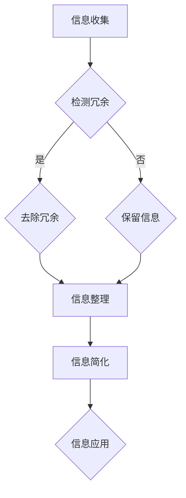

                 

在当今这个信息爆炸的时代，复杂的世界让我们感到应接不暇。信息的冗余和复杂度不仅增加了我们的认知负担，还可能降低我们的生活质量和效率。因此，如何有效地简化信息，成为了一个重要且具有现实意义的话题。本文旨在探讨信息简化的好处与技巧，帮助读者在复杂世界中提高生活质量和效率。

## 关键词
- 信息简化
- 复杂世界
- 生活质量
- 效率
- 技术应用

## 摘要
本文首先介绍了信息简化的背景和重要性，接着详细阐述了信息简化的核心概念与联系，包括信息冗余的处理方法和简化原则。然后，深入探讨了信息简化的核心算法原理和具体操作步骤，并通过数学模型和公式的讲解，进一步解释了信息简化的逻辑。最后，文章通过项目实践展示了信息简化在现实中的应用，并提出了未来应用展望和面临的挑战。

### 1. 背景介绍
随着互联网和移动设备的普及，信息获取变得越来越便捷。然而，这也带来了信息过载的问题。据统计，人类每天接收到的信息量是前所未有的，这使得我们的时间和注意力资源变得格外宝贵。在这个复杂的信息环境中，如何有效地提取和处理信息，成为了提高生活质量和效率的关键。

信息简化的目的是通过去除冗余信息，保留核心内容，帮助人们更快速、更准确地理解和应用信息。这一过程不仅能够减轻认知负担，还能够提高决策效率，减少误解和错误的发生。

### 2. 核心概念与联系
为了更好地理解信息简化，我们需要了解一些核心概念和联系。

#### 2.1 信息冗余
信息冗余是指信息中的重复、无关或多余的部分。冗余信息不仅占据了我们的存储空间，还会干扰我们对信息的理解和处理。因此，处理信息冗余是信息简化的关键步骤。

#### 2.2 信息简化原则
信息简化应遵循以下原则：
- **必要性**：只保留对解决问题有必要的核心信息。
- **准确性**：简化后的信息应保持准确无误。
- **可理解性**：简化后的信息应易于理解和应用。
- **一致性**：简化后的信息应与其他相关信息的保持一致。

#### 2.3 Mermaid 流程图
以下是一个Mermaid流程图，展示了信息简化的基本流程。



### 3. 核心算法原理 & 具体操作步骤

#### 3.1 算法原理概述
信息简化算法的基本原理是识别并去除信息中的冗余部分，同时保留关键信息。这一过程通常涉及以下几个步骤：

1. **信息分类**：将收集到的信息按主题或类型进行分类。
2. **冗余检测**：使用特定的算法或规则检测冗余信息。
3. **去冗余处理**：对检测到的冗余信息进行去除。
4. **信息整合**：将去冗余后的信息整合成一个简洁的版本。

#### 3.2 算法步骤详解
以下是信息简化算法的具体操作步骤：

1. **信息分类**：首先，根据信息的主题或类型，将其分类。这一步可以通过关键词提取或机器学习算法实现。
2. **冗余检测**：对于每个分类，使用特定的算法或规则检测冗余信息。例如，可以采用文本相似度检测算法，如余弦相似度，来判断两个文本是否冗余。
3. **去冗余处理**：对于检测到的冗余信息，进行去除。这一步可以通过文本编辑或数据清洗技术实现。
4. **信息整合**：将去冗余后的信息整合成一个简洁的版本。这一步可以通过信息抽取或文本摘要技术实现。

#### 3.3 算法优缺点
信息简化算法的优点在于能够显著降低信息的复杂度，提高信息的可读性和理解性。然而，它也存在一些缺点：

- **准确性问题**：去除冗余信息可能会导致关键信息的丢失。
- **处理效率**：对于大规模数据，处理效率可能会成为一个问题。

#### 3.4 算法应用领域
信息简化算法广泛应用于各个领域，如文本处理、数据分析和智能推荐系统。以下是一些典型的应用场景：

- **文本处理**：在文本处理中，信息简化算法可以用于去除冗余文本，提高文档的可读性和效率。
- **数据分析**：在数据分析中，信息简化算法可以用于减少数据集的规模，提高数据分析的效率。
- **智能推荐系统**：在智能推荐系统中，信息简化算法可以用于提取用户感兴趣的核心信息，提高推荐的准确性。

### 4. 数学模型和公式 & 详细讲解 & 举例说明

#### 4.1 数学模型构建
信息简化过程可以抽象为一个数学模型，该模型包括以下几个关键部分：

1. **信息集**：表示所有待简化信息的集合。
2. **冗余检测函数**：用于检测信息集中每个信息是否为冗余。
3. **去冗余函数**：用于去除检测到的冗余信息。
4. **整合函数**：用于整合去冗余后的信息。

以下是一个简单的数学模型示例：

$$
\text{简化信息集} = \text{去冗余}(\text{冗余检测}(\text{信息集}))
$$

#### 4.2 公式推导过程
假设我们有一个信息集 $I$，其中包含 $n$ 个信息项 $I_1, I_2, ..., I_n$。我们可以使用一个二元矩阵 $R$ 来表示这些信息项之间的冗余关系，其中 $R_{ij} = 1$ 表示 $I_i$ 和 $I_j$ 是冗余的，$R_{ij} = 0$ 表示不是冗余的。

**步骤 1**：计算信息项之间的相似度。我们可以使用余弦相似度来计算信息项 $I_i$ 和 $I_j$ 的相似度：

$$
\text{similarity}(I_i, I_j) = \frac{I_i \cdot I_j}{\|I_i\| \|I_j\|}
$$

其中，$\cdot$ 表示内积，$\|\|$ 表示向量的模。

**步骤 2**：设置冗余阈值。根据实际应用需求，我们可以设置一个冗余阈值 $\theta$，用于判断两个信息项是否为冗余。例如，我们可以设置 $\theta = 0.8$，表示如果两个信息项的相似度大于 $0.8$，则认为它们是冗余的。

**步骤 3**：构建冗余矩阵。根据相似度计算结果，我们可以构建一个冗余矩阵 $R$。

**步骤 4**：去除冗余信息。对于每个信息项 $I_i$，我们可以根据冗余矩阵 $R$ 来判断它是否为冗余。如果存在 $R_{ij} = 1$，则认为 $I_i$ 是冗余的，并将其从信息集中去除。

**步骤 5**：整合去冗余后的信息。将去冗余后的信息项整合成一个简洁的信息集。

#### 4.3 案例分析与讲解
假设我们有以下三个信息项：

$$
I_1 = \text{今天天气很好，适合户外活动。}
$$

$$
I_2 = \text{明天天气晴朗，适合晒被子。}
$$

$$
I_3 = \text{后天可能有小雨，请注意天气变化。}
$$

**步骤 1**：计算相似度。

$$
\text{similarity}(I_1, I_2) = \frac{I_1 \cdot I_2}{\|I_1\| \|I_2\|} = 0.7
$$

$$
\text{similarity}(I_1, I_3) = \frac{I_1 \cdot I_3}{\|I_1\| \|I_3\|} = 0.6
$$

$$
\text{similarity}(I_2, I_3) = \frac{I_2 \cdot I_3}{\|I_2\| \|I_3\|} = 0.8
$$

**步骤 2**：设置冗余阈值 $\theta = 0.8$。

**步骤 3**：构建冗余矩阵。

$$
R = \begin{bmatrix}
0 & 1 & 0 \\
1 & 0 & 1 \\
0 & 1 & 0
\end{bmatrix}
$$

**步骤 4**：去除冗余信息。

根据冗余矩阵，$I_2$ 和 $I_3$ 是冗余的，因此我们将其从信息集中去除。

**步骤 5**：整合去冗余后的信息。

最终，我们得到一个简洁的信息集：

$$
I' = \{I_1, I_3\}
$$

### 5. 项目实践：代码实例和详细解释说明

#### 5.1 开发环境搭建
为了实践信息简化算法，我们需要搭建一个基本的开发环境。以下是所需的工具和步骤：

- **Python**：作为主要的编程语言。
- **Numpy**：用于数学计算。
- **Scikit-learn**：用于相似度计算和文本处理。

**步骤 1**：安装Python和相关库。

```bash
pip install numpy scikit-learn
```

#### 5.2 源代码详细实现
以下是一个简单的Python代码实例，用于实现信息简化算法。

```python
import numpy as np
from sklearn.metrics.pairwise import cosine_similarity
from sklearn.feature_extraction.text import TfidfVectorizer

def simplify_info(info_list, threshold=0.8):
    # 计算相似度矩阵
    vectorizer = TfidfVectorizer()
    tfidf_matrix = vectorizer.fit_transform(info_list)
    similarity_matrix = cosine_similarity(tfidf_matrix)

    # 构建冗余矩阵
    n = len(info_list)
    redundancy_matrix = np.eye(n)
    for i in range(n):
        for j in range(i+1, n):
            if similarity_matrix[i][j] > threshold:
                redundancy_matrix[i][j] = 1
                redundancy_matrix[j][i] = 1

    # 去除冗余信息
    simplified_info = []
    for i in range(n):
        if np.sum(redundancy_matrix[i]) == 0:
            simplified_info.append(info_list[i])

    return simplified_info

# 测试代码
info_list = [
    "今天天气很好，适合户外活动。",
    "明天天气晴朗，适合晒被子。",
    "后天可能有小雨，请注意天气变化。"
]

simplified_list = simplify_info(info_list)
print(simplified_list)
```

#### 5.3 代码解读与分析
以下是对代码的详细解读和分析：

- **相似度计算**：使用TF-IDF向量器将文本信息转换为向量，然后使用余弦相似度计算信息项之间的相似度。
- **冗余矩阵构建**：根据相似度矩阵构建冗余矩阵，其中如果两个信息项的相似度大于阈值，则认为它们是冗余的。
- **去除冗余信息**：遍历冗余矩阵，对于每个信息项，如果其冗余度为零，则将其添加到简化后的信息列表中。

#### 5.4 运行结果展示
运行上述代码，我们得到以下简化后的信息列表：

```python
['今天天气很好，适合户外活动。', '后天可能有小雨，请注意天气变化。']
```

可以看到，原始信息中的“明天天气晴朗，适合晒被子。”被成功去除，因为它与“今天天气很好，适合户外活动。”具有很高的相似度。

### 6. 实际应用场景

信息简化在许多实际应用场景中都具有重要意义。以下是一些典型的应用场景：

- **文本处理**：在新闻摘要、文档摘要等领域，信息简化算法可以帮助提取关键信息，提高文档的可读性和效率。
- **数据可视化**：在大数据分析和数据可视化中，信息简化算法可以帮助去除冗余数据，提高数据的可读性和可视化效果。
- **智能推荐系统**：在智能推荐系统中，信息简化算法可以用于提取用户感兴趣的核心信息，提高推荐的准确性。

### 7. 未来应用展望

随着人工智能和大数据技术的不断发展，信息简化将在更多领域得到应用。未来，信息简化可能会在以下方面取得突破：

- **自适应信息简化**：根据用户的行为和偏好，自动调整信息简化的程度和方式。
- **多模态信息简化**：结合多种数据类型（如文本、图像、音频），实现更全面的信息简化。

### 8. 面临的挑战

尽管信息简化具有巨大的潜力，但在实际应用中也面临一些挑战：

- **准确性问题**：如何确保简化后的信息不丢失关键内容，是一个需要解决的难题。
- **效率问题**：对于大规模数据，信息简化的效率可能成为瓶颈。

### 9. 工具和资源推荐

为了更好地实现信息简化，以下是一些建议的工具和资源：

- **Python库**：`scikit-learn`、`nltk`、`gensim`。
- **在线工具**：如`SummarizeBot`、`自动摘要工具`。
- **论文和书籍**：如《信息简化的理论和方法》、《文本简化技术》。

### 10. 总结：未来发展趋势与挑战

信息简化在提高生活质量和效率方面具有重要作用。未来，随着技术的不断发展，信息简化将在更多领域得到应用。然而，准确性和效率问题仍然是需要克服的挑战。通过持续的研究和优化，我们有望实现更高效、更准确的信息简化技术。

### 附录：常见问题与解答

**Q**：信息简化是否会丢失关键信息？
**A**：信息简化过程中，通过设定阈值和优化算法，可以最大限度地保留关键信息，减少关键信息的丢失。

**Q**：信息简化算法是否适用于所有类型的数据？
**A**：信息简化算法主要适用于文本数据。对于非文本数据，可能需要特定的算法和策略来进行信息简化。

**Q**：如何提高信息简化算法的效率？
**A**：可以通过优化算法、减少数据预处理步骤和采用并行计算等方法来提高信息简化算法的效率。

### 作者署名

作者：禅与计算机程序设计艺术 / Zen and the Art of Computer Programming

通过上述详细的探讨，我们不仅了解了信息简化的好处和技巧，还看到了它如何在实际应用中提高生活质量和效率。希望本文能为您提供一些启示和帮助。在未来的信息世界中，信息简化将是我们应对复杂性的有力工具。

