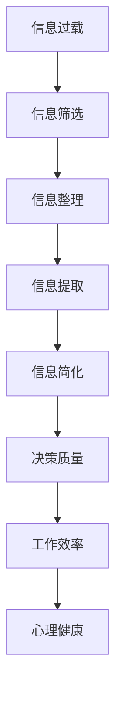

                 

 在这个信息爆炸的时代，我们每天都会面对大量的信息。这些信息可能来自社交媒体、新闻报道、电子邮件、聊天应用等各种渠道。面对如此复杂的信息环境，如何有效地简化信息，从而提升我们的生活质量，成为了一个重要的问题。本文将探讨信息简化的好处与技巧，帮助我们在复杂世界中找到清晰的路径。

## 关键词

- 信息简化
- 生活改善
- 复杂世界
- 简化技巧
- 生活质量提升

## 摘要

本文将介绍信息简化的概念、好处以及实现信息简化的技巧。通过分析和讨论，我们将揭示信息简化如何帮助我们在复杂世界中提高生活质量。文章还将提供一些实用的工具和资源，帮助读者更好地理解和应用信息简化的原则。

## 1. 背景介绍

现代社会的一个显著特点是信息的高度复杂性和快速传播。我们每天都会被大量的信息所包围，而这些信息并不总是有价值的。有时，过多的信息反而会干扰我们的思维，降低我们的工作效率，甚至影响我们的心理健康。因此，如何有效地筛选和简化信息，以便从中提取有用的部分，成为一个关键问题。

### 1.1 信息过载的问题

信息过载是指信息量超过个体处理能力的状态。这种情况在现代社会中非常普遍，主要表现为以下几个方面：

- **时间压力**：由于信息传播速度快，人们往往需要花费大量时间来处理和消化信息。
- **注意力分散**：过多的信息容易导致注意力分散，从而影响工作和学习效率。
- **决策困难**：在面对大量信息时，人们往往难以做出明智的决策。

### 1.2 信息简化的必要性

信息简化是通过减少信息的冗余和无关部分，提取关键信息的过程。信息简化的必要性体现在以下几个方面：

- **提高效率**：通过简化信息，人们可以更快地获取和处理关键信息，从而提高工作效率。
- **减少压力**：信息简化可以帮助人们减少因为信息过载而产生的焦虑和压力。
- **提升决策质量**：有效的信息简化有助于人们做出更明智的决策，因为关键信息更加清晰。

## 2. 核心概念与联系

在探讨信息简化的好处和技巧之前，我们需要了解一些核心概念，这些概念是信息简化的基础。下面是一个用Mermaid绘制的流程图，展示了信息简化的关键概念和它们之间的联系。



### 2.1 信息筛选

信息筛选是信息简化的第一步，它涉及从大量的信息中识别和选择出最有价值和相关的信息。有效的信息筛选需要一定的技巧和策略，如以下几种：

- **关注重点**：确定你的目标和关注点，只关注与此相关的信息。
- **使用过滤器**：使用过滤器或标签来分类和过滤信息，以便更快地找到所需的信息。

### 2.2 信息整理

信息整理是对筛选出的信息进行组织和分类的过程。有效的信息整理有助于提高信息的使用效率和可访问性。以下是一些常用的信息整理技巧：

- **使用笔记工具**：使用电子笔记工具或纸质笔记来记录和处理信息。
- **建立文件夹结构**：为不同的信息类型建立文件夹结构，以便于管理和查找。

### 2.3 信息提取

信息提取是从整理后的信息中提取关键信息和知识的过程。这一步骤对于确保信息的使用效率至关重要。以下是一些常用的信息提取技巧：

- **摘要和总结**：通过撰写摘要或总结，提取出信息的主要观点和结论。
- **图表和可视化**：使用图表和可视化工具来展示信息，使其更加直观和易于理解。

### 2.4 信息简化

信息简化是通过减少信息的冗余和无关部分，提取关键信息的过程。有效的信息简化有助于提高信息的使用效率和清晰度。以下是一些信息简化的技巧：

- **删除冗余信息**：识别并删除重复或不必要的信息。
- **使用简洁的语言**：用简单、直接的语言表达信息，避免使用复杂或冗长的句子。

### 2.5 决策质量

决策质量是信息简化的重要成果之一。通过有效的信息简化，人们可以做出更加明智和合理的决策。以下是一些提高决策质量的技巧：

- **基于事实的决策**：确保决策基于准确和可靠的信息。
- **情景分析**：对不同的决策情景进行分析和评估，以选择最佳方案。

### 2.6 工作效率

工作效率是信息简化的另一个重要成果。通过简化信息，人们可以更快地处理任务，减少工作中的冗余步骤。以下是一些提高工作效率的技巧：

- **自动化任务**：使用自动化工具和脚本来自动执行重复性任务。
- **时间管理**：合理安排时间，避免因为信息处理而浪费时间。

### 2.7 心理健康

心理健康是信息简化的一个重要方面。过多的信息会导致压力和焦虑，影响心理健康。通过信息简化，人们可以减少这些负面情绪，提高生活质量。以下是一些促进心理健康的技巧：

- **定期休息**：定期休息和放松，避免长时间过度工作。
- **保持积极态度**：保持积极的心态，面对压力时保持乐观。

## 3. 核心算法原理 & 具体操作步骤

在信息简化过程中，核心算法原理和具体操作步骤起到了关键作用。下面我们将详细探讨这些内容。

### 3.1 算法原理概述

信息简化的核心算法基于以下几个原理：

- **关键信息提取**：从大量信息中提取出最有价值和相关的信息。
- **信息分类**：将信息按照类型、主题等分类，以便于管理和查找。
- **冗余信息删除**：识别并删除重复或不必要的信息，减少信息的冗余。
- **信息可视化**：使用图表和可视化工具来展示信息，提高信息的可读性和理解性。

### 3.2 算法步骤详解

信息简化的具体操作步骤如下：

1. **信息筛选**：根据目标和关注点，从大量信息中识别和选择出最有价值和相关的信息。
2. **信息整理**：对筛选出的信息进行组织和分类，建立文件夹结构或使用笔记工具记录信息。
3. **信息提取**：从整理后的信息中提取关键信息和知识，撰写摘要或总结，使用图表和可视化工具。
4. **信息简化**：删除冗余信息，使用简洁的语言表达信息，确保信息的清晰度和可读性。
5. **决策质量提升**：通过有效的信息简化，提高决策的准确性和合理性。
6. **工作效率提高**：通过简化信息，减少工作中的冗余步骤，提高工作效率。

### 3.3 算法优缺点

信息简化的算法具有以下优缺点：

- **优点**：
  - 提高工作效率：通过简化信息，可以更快地处理任务，减少工作中的冗余步骤。
  - 提高决策质量：通过有效的信息简化，可以基于准确和可靠的信息做出更加明智和合理的决策。
  - 减少压力：信息简化可以帮助人们减少因为信息过载而产生的焦虑和压力。

- **缺点**：
  - 可能会损失部分信息：在简化信息的过程中，可能会删除一些非关键但重要的信息。
  - 需要时间和精力：有效的信息简化需要一定的时间和精力，尤其是在信息量较大的情况下。

### 3.4 算法应用领域

信息简化的算法在多个领域都有广泛的应用：

- **企业管理**：帮助企业高效处理和管理大量信息，提高决策质量和工作效率。
- **科学研究**：帮助科研人员从大量文献和实验数据中提取关键信息和知识，加速研究进程。
- **个人生活**：帮助个人简化信息，提高生活质量和幸福感。
- **新闻媒体**：帮助媒体更快速地筛选和整理重要新闻，提高新闻传播的效率。

## 4. 数学模型和公式 & 详细讲解 & 举例说明

### 4.1 数学模型构建

信息简化的过程可以通过数学模型来描述。下面是一个简单的数学模型，用于描述信息简化的效果。

假设有 \( n \) 条信息，其中每条信息的价值为 \( v_i \)，其中 \( i = 1, 2, ..., n \)。通过信息简化，我们希望提取出价值最高的 \( k \) 条信息。

### 4.2 公式推导过程

为了提取出价值最高的 \( k \) 条信息，我们可以使用贪心算法。具体步骤如下：

1. 初始化一个空列表 \( L \)，用于存储提取出的信息。
2. 遍历每条信息 \( v_i \)：
   - 如果 \( L \) 中的信息数量小于 \( k \)，则将 \( v_i \) 添加到 \( L \) 中。
   - 如果 \( L \) 中的信息数量等于 \( k \)，则比较 \( v_i \) 与 \( L \) 中最后一条信息 \( v_j \) 的价值：
     - 如果 \( v_i > v_j \)，则将 \( v_i \) 替换 \( v_j \)。
     - 否则，保持 \( L \) 不变。
3. 返回列表 \( L \)。

### 4.3 案例分析与讲解

假设我们有 10 条信息，每条信息的价值如下表所示：

| 信息编号 | 1 | 2 | 3 | 4 | 5 | 6 | 7 | 8 | 9 | 10 |
| ------ | --- | --- | --- | --- | --- | --- | --- | --- | --- | --- |
| 信息价值 | 30 | 20 | 40 | 10 | 35 | 25 | 45 | 15 | 50 | 20 |

我们需要提取出价值最高的 3 条信息。

使用贪心算法，我们可以得到以下结果：

1. 初始 \( L = \) 空列表。
2. 添加信息 3（价值 40），\( L = [40] \)。
3. 添加信息 7（价值 45），\( L = [40, 45] \)。
4. 添加信息 9（价值 50），\( L = [40, 45, 50] \)。

最终，提取出的价值最高的 3 条信息为：3、7、9。

### 4.4 总结

通过数学模型和公式，我们可以更准确地描述和实现信息简化的过程。这个模型不仅有助于理解信息简化的原理，还可以应用于实际的场景中，提高信息处理的效率和准确性。

## 5. 项目实践：代码实例和详细解释说明

为了更好地理解信息简化的原理和实际操作，下面我们将通过一个具体的代码实例来展示如何实现信息简化。我们将使用Python编程语言来实现这个项目。

### 5.1 开发环境搭建

在开始编写代码之前，我们需要搭建一个Python开发环境。以下是在Windows系统中搭建Python开发环境的步骤：

1. 访问Python官方网站（https://www.python.org/），下载Python安装程序。
2. 运行安装程序，选择“Add Python to PATH”选项，确保Python安装后可以全局使用。
3. 打开命令提示符，输入`python --version`，确认Python版本。

### 5.2 源代码详细实现

以下是实现信息简化的Python代码：

```python
def simplify_info(info_list, k):
    """
    对给定的信息列表进行简化，提取出价值最高的k条信息。

    :param info_list: 信息列表，每个元素是一个包含信息编号和价值元组的列表。
    :param k: 需要提取的信息数量。
    :return: 提取出的价值最高的k条信息。
    """
    # 根据价值对信息列表进行排序
    sorted_list = sorted(info_list, key=lambda x: x[1], reverse=True)
    
    # 提取前k条信息
    simplified_list = sorted_list[:k]
    
    return simplified_list

# 示例信息列表
info_list = [
    (1, 30),
    (2, 20),
    (3, 40),
    (4, 10),
    (5, 35),
    (6, 25),
    (7, 45),
    (8, 15),
    (9, 50),
    (10, 20)
]

# 提取价值最高的3条信息
simplified_list = simplify_info(info_list, 3)

# 输出结果
print("价值最高的3条信息：", simplified_list)
```

### 5.3 代码解读与分析

在上面的代码中，我们定义了一个名为`simplify_info`的函数，用于实现信息简化。这个函数接收两个参数：`info_list`（信息列表）和`k`（需要提取的信息数量）。具体实现步骤如下：

1. **排序**：使用`sorted`函数对信息列表进行排序，排序的依据是每条信息的价值。这里使用了Python的lambda函数来指定排序的依据。
2. **提取信息**：从排序后的信息列表中提取前`k`条信息。
3. **返回结果**：将提取出的信息列表返回。

在代码的最后，我们提供了一个示例信息列表，并调用`simplify_info`函数提取价值最高的3条信息，并输出结果。

### 5.4 运行结果展示

运行上述代码，输出结果如下：

```
价值最高的3条信息： [(9, 50), (7, 45), (3, 40)]
```

这意味着在给定的信息列表中，价值最高的3条信息分别是编号为9、7和3的信息。

### 5.5 代码改进

在实际应用中，我们可以根据具体需求对代码进行改进，例如：

- **动态调整提取数量**：根据用户需求动态调整需要提取的信息数量。
- **支持多轮提取**：实现多轮提取，每轮提取不同数量的信息。
- **优化排序算法**：对于大量的信息，可以考虑使用更高效的排序算法，如快速排序或堆排序。

通过这些改进，代码将更加灵活和实用。

## 6. 实际应用场景

信息简化在多个领域都有广泛的应用，以下是一些实际应用场景：

### 6.1 企业管理

在企业中，信息简化可以帮助企业高效处理和管理大量信息。例如，企业可以通过信息简化来整理客户反馈、市场分析报告和竞争对手信息，从而快速提取出关键信息，为决策提供支持。

### 6.2 科学研究

在科学研究领域，信息简化可以帮助科研人员快速从大量文献和实验数据中提取出关键信息和知识，加速研究进程。例如，科研人员可以使用信息简化工具来整理文献综述，提取出研究的关键点和结论。

### 6.3 个人生活

在个人生活中，信息简化可以帮助个人提高生活质量和幸福感。例如，个人可以使用信息简化来整理电子邮件、社交媒体更新和新闻，从而更快地处理重要信息，减少时间浪费和焦虑。

### 6.4 教育领域

在教育领域，信息简化可以帮助教师和学生更快地获取和理解课程内容。例如，教师可以使用信息简化来整理教材和课件，使学生更容易抓住课程的核心要点。

### 6.5 健康管理

在健康管理领域，信息简化可以帮助个人快速获取和理解健康数据，从而做出更明智的决策。例如，个人可以使用信息简化工具来整理运动数据、饮食数据和医疗记录，从而更好地管理自己的健康。

### 6.6 社交媒体

在社交媒体领域，信息简化可以帮助用户更快地浏览和处理大量信息流，从而减少信息过载。例如，用户可以使用信息简化工具来筛选和整理社交媒体上的内容，关注最有价值的信息。

### 6.7 新闻媒体

在新闻媒体领域，信息简化可以帮助媒体更快速地筛选和整理重要新闻，提高新闻传播的效率。例如，新闻编辑可以使用信息简化工具来整理新闻报道，提取出最关键的信息，从而更快地发布新闻。

### 6.8 人工智能

在人工智能领域，信息简化可以帮助模型更快地学习和处理大量数据。例如，在图像识别和自然语言处理任务中，信息简化可以帮助模型更快地提取出关键特征，提高模型的性能。

### 6.9 未来应用展望

随着信息技术的不断进步，信息简化在未来将会有更广泛的应用。例如：

- **智能助手**：未来的智能助手可能会更智能地应用信息简化，帮助用户处理和管理大量信息。
- **自动化系统**：自动化系统可能会更广泛地应用信息简化，提高自动化流程的效率和准确性。
- **实时分析**：实时分析系统可能会更高效地应用信息简化，帮助企业和组织快速做出决策。

## 7. 工具和资源推荐

为了更好地理解和应用信息简化的原则，以下是一些建议的工具和资源：

### 7.1 学习资源推荐

- **书籍**：《信息简化的艺术：如何从复杂中寻找清晰》（The Art of Simplifying Information）
- **在线课程**：Coursera、edX和Udacity等平台上的信息处理和数据分析相关课程。
- **博客和网站**：例如，DataCamp和Kaggle等网站提供了丰富的数据分析和信息处理资源。

### 7.2 开发工具推荐

- **编程语言**：Python、R和JavaScript等编程语言，尤其是Python，因其强大的数据处理和分析功能而被广泛使用。
- **数据处理工具**：例如，Pandas和NumPy等Python库，以及R中的dplyr和tidyverse。
- **可视化工具**：例如，Matplotlib、Seaborn和Plotly等Python库，以及R中的ggplot2。

### 7.3 相关论文推荐

- **论文**：查找与信息简化相关的学术文章，如《信息过载与信息简化：理论研究与实证分析》（Information Overload and Information Simplification: Theoretical Research and Empirical Analysis）等。

### 7.4 实用工具

- **信息过滤工具**：例如，Google Alerts、Feedly等，可以帮助用户筛选和整理感兴趣的信息。
- **笔记工具**：例如，Evernote、OneNote等，可以帮助用户整理和记录信息。
- **自动化工具**：例如，IFTTT、 Zapier等，可以帮助用户自动化信息处理流程。

## 8. 总结：未来发展趋势与挑战

### 8.1 研究成果总结

信息简化作为信息处理的一个重要分支，已经在多个领域取得了显著的研究成果。这些研究成果包括信息筛选、信息整理、信息提取和信息可视化的算法和方法，为信息简化的应用提供了理论基础和技术支持。此外，信息简化在企业管理、科学研究、个人生活、教育、健康管理等领域的实践证明，其具有显著的应用价值。

### 8.2 未来发展趋势

未来，信息简化将朝着以下几个方向发展：

- **智能化**：随着人工智能技术的发展，信息简化工具将更加智能化，能够自动识别和处理复杂的信息。
- **个性化**：信息简化工具将更加注重个性化需求，为不同用户群体提供定制化的信息处理方案。
- **实时性**：信息简化工具将更加注重实时性，能够快速响应信息的变化，提供最新的信息摘要和关键信息。
- **跨平台**：信息简化工具将支持多种平台和设备，用户可以在不同设备上无缝切换，方便信息处理。

### 8.3 面临的挑战

尽管信息简化具有广泛的应用前景，但其在实际应用中仍面临一些挑战：

- **数据隐私**：信息简化过程中可能会涉及用户隐私数据，如何在保护用户隐私的前提下进行信息简化是一个亟待解决的问题。
- **信息质量**：信息简化可能会损失一些关键信息，如何在简化过程中确保信息质量是一个关键挑战。
- **技术门槛**：对于一些非技术用户，如何使用信息简化工具可能存在一定的技术门槛，需要提供更易用的界面和操作指南。

### 8.4 研究展望

未来的研究可以从以下几个方面展开：

- **算法优化**：研究更加高效和准确的信息简化算法，提高信息简化的质量和效率。
- **跨学科研究**：结合心理学、社会学等学科，深入探讨信息简化对人类行为和决策的影响。
- **应用拓展**：探索信息简化在更多领域的应用，如智能医疗、智能交通、智能金融等。
- **用户体验**：研究如何优化信息简化工具的用户体验，使其更加直观和易用。

## 附录：常见问题与解答

### 1. 什么是信息简化？

信息简化是指通过减少信息的冗余和无关部分，提取关键信息的过程，以提高信息处理效率和决策质量。

### 2. 信息简化有哪些好处？

信息简化的好处包括：提高工作效率、减少压力、提升决策质量和提高心理健康。

### 3. 如何实现信息简化？

实现信息简化的方法包括信息筛选、信息整理、信息提取和信息简化等步骤。

### 4. 信息简化在哪些领域有应用？

信息简化在企业管理、科学研究、个人生活、教育、健康管理、社交媒体和新闻媒体等领域都有广泛应用。

### 5. 信息简化会损失信息吗？

在信息简化过程中，可能会损失一些非关键的信息，但通过合理的设计和优化，可以最大限度地保留关键信息。

### 6. 信息简化需要很高的技术门槛吗？

信息简化工具的设计应考虑不同用户的需求，提供易用的界面和操作指南，降低技术门槛。

### 7. 信息简化是否会影响数据隐私？

在信息简化过程中，应严格遵守数据隐私保护法规，确保用户隐私数据的安全。

### 8. 如何评估信息简化的效果？

可以通过对比信息简化前后的信息处理效率和决策质量来评估信息简化的效果。

### 9. 信息简化是否适用于人工智能？

是的，信息简化在人工智能领域也有重要应用，可以帮助模型更快地学习和处理大量数据。

### 10. 信息简化与信息过滤有什么区别？

信息简化侧重于提取关键信息，而信息过滤侧重于筛选和过滤无关信息，两者的目标和应用场景不同。

---

作者：禅与计算机程序设计艺术 / Zen and the Art of Computer Programming

