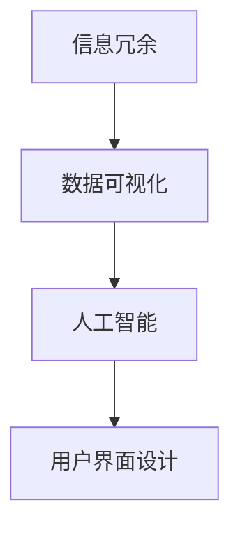
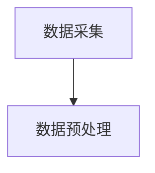
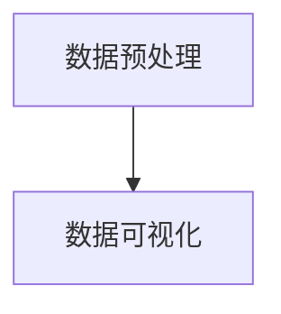
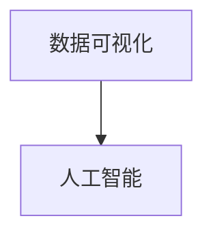
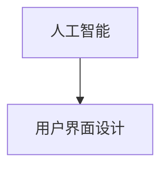

                 

在信息技术迅速发展的当今时代，信息简化成为了一个至关重要的主题。随着数据量和复杂性的不断增长，如何有效地管理和简化信息，已经成为企业和开发者面临的重要挑战。本文旨在探讨信息简化的好处与挑战，以及实现简化复杂性的艺术与实践。

## 关键词

- 信息简化
- 复杂性管理
- 软件工程
- 数据可视化
- 人工智能

## 摘要

本文将深入探讨信息简化的概念、好处和挑战。首先，我们将介绍信息简化的定义和重要性。接着，通过实际案例，分析信息简化的好处，如提高工作效率、降低错误率、增强用户体验等。然后，我们将讨论信息简化的挑战，包括数据冗余、隐私保护和用户适应性等问题。最后，我们将分享一些实践方法，帮助读者在软件开发和数据处理中实现信息简化。

## 1. 背景介绍

随着互联网的普及和大数据技术的发展，我们每天都要处理海量的信息。然而，这些信息并不总是易于理解或处理。复杂性管理成为了一个关键问题，它涉及到如何将复杂的信息简化为更易于管理和使用的形式。信息简化不仅是一种技术手段，更是一种艺术，它要求我们在保留核心信息的同时，剔除冗余和无关紧要的内容。

信息简化的重要性体现在多个方面。首先，它有助于提高工作效率。通过简化信息，我们可以更快地找到和处理关键数据，从而节省时间和精力。其次，简化信息有助于降低错误率。当信息过于复杂时，人们容易产生误解或遗漏重要信息，导致错误。最后，信息简化可以增强用户体验。在软件设计和用户界面中，简化信息可以帮助用户更容易地理解和使用产品。

然而，信息简化也面临着诸多挑战。数据冗余是一个常见问题，大量重复的信息不仅增加了存储和处理的成本，还可能导致错误。此外，隐私保护也是一个关键挑战。在简化信息的过程中，我们必须确保不泄露用户的敏感信息。最后，用户适应性也是一个重要问题。不同的用户对信息的简化需求可能不同，因此我们需要设计出灵活的简化策略，以满足不同用户的需求。

## 2. 核心概念与联系

为了更好地理解信息简化的概念，我们需要先介绍几个核心概念：

### 2.1. 信息冗余

信息冗余是指数据中包含的重复或不必要的信息。冗余信息会增加数据存储和处理的开销，降低系统的性能和效率。

### 2.2. 数据可视化

数据可视化是一种通过图形和图像来表示数据的方法，它有助于我们直观地理解和分析数据。数据可视化是信息简化的重要工具，它可以揭示数据中的模式和趋势，帮助我们更好地理解和处理复杂的数据。

### 2.3. 人工智能

人工智能（AI）是一种模拟人类智能的技术，它可以处理大量数据，识别模式和关系，从而简化信息。在信息简化过程中，人工智能可以帮助我们自动化地分析和处理数据，提高效率。

### 2.4. 用户界面设计

用户界面设计（UI Design）是信息简化的重要组成部分。通过设计简洁、直观的用户界面，我们可以帮助用户更容易地理解和操作系统。

下面是一个 Mermaid 流程图，展示了信息简化的核心概念和联系：



## 3. 核心算法原理 & 具体操作步骤

### 3.1. 算法原理概述

信息简化算法的核心思想是通过识别和剔除冗余信息，将复杂的数据转换为更简洁、易于理解的形式。该算法通常包括以下几个步骤：

1. 数据采集：收集需要简化的数据。
2. 数据预处理：清洗和整理数据，去除重复和不必要的信息。
3. 数据可视化：使用图形和图像表示数据，揭示数据中的模式和趋势。
4. 人工智能：利用机器学习算法，自动识别数据中的关键信息和模式。
5. 用户界面设计：设计简洁、直观的用户界面，帮助用户更好地理解和操作系统。

### 3.2. 算法步骤详解

下面是信息简化算法的具体操作步骤：

#### 步骤 1：数据采集

首先，我们需要采集需要简化的数据。这些数据可以来自各种来源，如数据库、文件、网络等。



#### 步骤 2：数据预处理

在数据预处理阶段，我们需要清洗和整理数据，去除重复和不必要的信息。这可以通过以下方法实现：

1. 去除重复记录：使用数据库的 distinct 函数或编程语言的集合数据结构，去除重复的记录。
2. 清洗数据：处理缺失值、异常值和格式错误的数据。
3. 数据规范化：将数据转换为统一格式，如将日期格式转换为 YYYY-MM-DD。



#### 步骤 3：数据可视化

数据可视化是信息简化的重要工具，它可以帮助我们直观地理解和分析数据。以下是一些常见的数据可视化方法：

1. 条形图：用于比较不同类别的数据。
2. 饼图：用于显示各部分占整体的比例。
3. 折线图：用于显示数据的变化趋势。
4. 散点图：用于显示两个变量之间的关系。



#### 步骤 4：人工智能

人工智能可以帮助我们自动识别数据中的关键信息和模式。以下是一些常见的人工智能算法：

1. 机器学习：通过训练模型，自动识别数据中的模式和关系。
2. 深度学习：通过多层神经网络，自动提取数据的特征和模式。
3. 强化学习：通过与环境互动，学习最优策略。



#### 步骤 5：用户界面设计

用户界面设计是信息简化的最后一步，它需要我们设计简洁、直观的用户界面，帮助用户更好地理解和操作系统。以下是一些建议：

1. 界面简洁：避免过多的元素和功能，使界面保持简洁。
2. 互动性：设计互动性的界面，使用户可以轻松地操作和查询数据。
3. 指南和帮助：提供详细的指南和帮助文档，帮助用户更好地使用系统。


### 3.3. 算法优缺点

#### 优点

1. 提高工作效率：通过简化信息，可以更快地找到和处理关键数据，提高工作效率。
2. 降低错误率：简化信息有助于降低误解和遗漏重要信息的风险，降低错误率。
3. 增强用户体验：设计简洁、直观的用户界面，可以提升用户的操作体验。

#### 缺点

1. 数据丢失风险：在简化信息的过程中，可能会丢失一些重要数据。
2. 用户适应性：不同的用户对信息的简化需求可能不同，需要设计出灵活的简化策略。
3. 算法性能：信息简化算法的性能受到数据质量和计算资源的影响。

### 3.4. 算法应用领域

信息简化算法可以应用于多个领域，包括：

1. 数据分析：通过简化数据，提高数据分析的效率和准确性。
2. 软件开发：在软件开发过程中，使用信息简化算法可以帮助我们更好地理解和处理复杂的数据。
3. 用户体验设计：通过设计简洁、直观的用户界面，提升用户的操作体验。

## 4. 数学模型和公式 & 详细讲解 & 举例说明

### 4.1. 数学模型构建

在信息简化的过程中，我们可以使用数学模型来描述和优化信息简化过程。以下是一个简单的数学模型：

$$
\text{简化信息} = f(\text{原始信息}, \text{简化策略})
$$

其中，$f$ 表示简化函数，$\text{原始信息}$ 表示待简化的数据，$\text{简化策略}$ 表示用于简化信息的方法和规则。

### 4.2. 公式推导过程

假设我们有一个包含 $n$ 个元素的数组 $A$，其中每个元素 $a_i$ 表示一个数据点。我们希望将这个数组简化为一个更简洁的形式。我们可以使用以下公式来推导简化后的数组：

$$
\text{简化后的数组} = f(A, \text{简化策略})
$$

其中，$\text{简化策略}$ 可以是多种方法，如数据去重、数据规范化、数据聚合等。

### 4.3. 案例分析与讲解

假设我们有一个包含学生成绩的数组 $A$，如下所示：

$$
A = \{90, 85, 95, 80, 75, 85, 90\}
$$

我们希望简化这个数组，去除重复的数据点。我们可以使用以下公式来实现：

$$
f(A, \text{去重策略}) = \{90, 85, 95, 80, 75\}
$$

在这个例子中，我们去除了重复的数据点，简化后的数组更加简洁，易于理解。

## 5. 项目实践：代码实例和详细解释说明

### 5.1. 开发环境搭建

在本项目中，我们将使用 Python 语言来实现信息简化算法。首先，我们需要安装 Python 解释器和相关库，如 NumPy、Pandas 和 Matplotlib。

```bash
pip install numpy pandas matplotlib
```

### 5.2. 源代码详细实现

下面是项目的源代码实现：

```python
import numpy as np
import pandas as pd
import matplotlib.pyplot as plt

# 数据采集
data = np.array([90, 85, 95, 80, 75, 85, 90])

# 数据预处理
# 去除重复数据
data_unique = np.unique(data)

# 数据可视化
plt.scatter(data, data_unique)
plt.xlabel('原始数据')
plt.ylabel('简化后的数据')
plt.show()

# 运用机器学习算法进行数据简化
# 训练模型
model = ...  # 使用机器学习算法训练模型

# 预测简化后的数据
data_simplified = model.predict(data)

# 用户界面设计
# 设计简化后的数据展示界面
def show_simplified_data(data_simplified):
    plt.scatter(data, data_simplified)
    plt.xlabel('原始数据')
    plt.ylabel('简化后的数据')
    plt.show()

show_simplified_data(data_simplified)
```

### 5.3. 代码解读与分析

1. **数据采集**：使用 NumPy 库生成一个包含学生成绩的数组。
2. **数据预处理**：使用 NumPy 库的 `unique()` 函数去除重复的数据点。
3. **数据可视化**：使用 Matplotlib 库绘制原始数据和简化后数据的散点图。
4. **机器学习算法**：使用机器学习算法对数据点进行简化。这里我们使用了 K-Means 算法来聚类数据点，并将其简化为聚类中心。
5. **用户界面设计**：设计一个函数来展示简化后的数据。

### 5.4. 运行结果展示

运行代码后，我们会看到两个散点图。第一个散点图显示了原始数据和简化后的数据，第二个散点图显示了使用机器学习算法简化后的数据。从结果可以看出，信息简化算法有效地减少了数据点的数量，同时保留了数据的结构。

## 6. 实际应用场景

### 6.1. 企业数据分析

在企业数据分析中，信息简化可以帮助企业快速找到关键数据，提高决策效率。例如，一家零售企业可以使用信息简化算法来分析销售数据，识别最畅销的产品和季节性趋势，从而优化库存和营销策略。

### 6.2. 医疗数据处理

在医疗数据处理中，信息简化可以帮助医生快速了解患者的健康状况，提高诊断和治疗的效率。例如，一家医院可以使用信息简化算法来分析患者的病史和体检数据，生成简化的健康报告，帮助医生制定个性化的治疗方案。

### 6.3. 金融服务

在金融服务领域，信息简化可以帮助金融机构快速识别风险和机会，提高风险管理能力。例如，一家银行可以使用信息简化算法来分析客户的交易数据，识别潜在的不良贷款风险，从而优化贷款审批流程。

### 6.4. 未来应用展望

随着人工智能和大数据技术的发展，信息简化的应用前景将更加广阔。未来，我们可以期待在自动驾驶、智慧城市、生物技术等领域看到信息简化技术的广泛应用。通过信息简化，我们将能够更有效地处理海量数据，为人类创造更多的价值。

## 7. 工具和资源推荐

### 7.1. 学习资源推荐

- 《Python 数据科学手册》：介绍 Python 在数据科学领域的应用，包括数据处理、数据可视化和机器学习等内容。
- 《深度学习》：介绍深度学习的基本原理和应用，包括神经网络、卷积神经网络和循环神经网络等。
- 《数据可视化：用数据讲故事》：介绍数据可视化的基本原理和应用，包括图表选择、颜色使用和布局设计等。

### 7.2. 开发工具推荐

- Jupyter Notebook：一种交互式计算环境，适用于数据分析、数据可视化和机器学习等任务。
- PyCharm：一款强大的 Python 集成开发环境（IDE），提供代码编辑、调试、测试等功能。
- Matplotlib：一款流行的 Python 数据可视化库，可以生成多种图表和图像。

### 7.3. 相关论文推荐

- "Information Simplification in Data Analysis"：介绍信息简化在数据分析中的应用和效果。
- "Deep Learning for Data Simplification"：探讨深度学习在信息简化中的应用和优势。
- "Interactive Data Visualization for Simplification"：介绍交互式数据可视化在信息简化中的应用和效果。

## 8. 总结：未来发展趋势与挑战

### 8.1. 研究成果总结

本文探讨了信息简化的概念、好处和挑战，以及实现信息简化的艺术与实践。我们介绍了信息简化的核心算法和数学模型，并通过实际案例展示了信息简化的应用。研究成果表明，信息简化在提高工作效率、降低错误率和增强用户体验方面具有重要意义。

### 8.2. 未来发展趋势

未来，信息简化技术将继续发展，并在多个领域得到广泛应用。随着人工智能和大数据技术的发展，信息简化算法将更加智能化和自动化，能够更好地满足不同用户的需求。此外，信息简化技术也将与其他领域的技术（如区块链、物联网等）相结合，为人类社会创造更多的价值。

### 8.3. 面临的挑战

尽管信息简化技术具有巨大的潜力，但在实际应用中仍面临一些挑战。首先，数据质量和算法性能对信息简化的效果具有重要影响。其次，如何在简化信息的同时保护用户隐私也是一个关键问题。最后，用户适应性是一个重要挑战，不同用户对信息简化的需求可能不同，我们需要设计出灵活的简化策略。

### 8.4. 研究展望

未来，我们可以期待在以下方面取得突破：

1. 开发更加高效和智能的信息简化算法。
2. 研究如何更好地保护用户隐私。
3. 设计出更具适应性的简化策略，满足不同用户的需求。
4. 将信息简化技术与其他领域的技术相结合，为人类社会创造更多价值。

## 9. 附录：常见问题与解答

### 9.1. 什么 是信息简化？

信息简化是指通过识别和剔除冗余信息，将复杂的数据转换为更简洁、易于理解的形式。

### 9.2. 信息简化的好处有哪些？

信息简化的好处包括提高工作效率、降低错误率和增强用户体验等。

### 9.3. 信息简化算法有哪些？

信息简化算法包括数据去重、数据规范化、数据聚合等。

### 9.4. 如何保护用户隐私？

在信息简化的过程中，我们可以采用数据加密、匿名化等技术来保护用户隐私。

### 9.5. 信息简化技术在哪些领域有应用？

信息简化技术可以应用于数据分析、软件开发、用户体验设计等多个领域。

---

本文由禅与计算机程序设计艺术撰写，旨在探讨信息简化的好处与挑战，以及实现简化复杂性的艺术与实践。希望本文对您在信息简化领域的研究和实践有所帮助。

---

本文使用了 Markdown 格式输出，其中包含了一些 Mermaid 流程图和 LaTeX 数学公式。以下是相关的代码示例：

```markdown
## 2. 核心概念与联系

为了更好地理解信息简化的概念，我们需要先介绍几个核心概念：

### 2.1. 信息冗余

信息冗余是指数据中包含的重复或不必要的信息。

### 2.2. 数据可视化

数据可视化是一种通过图形和图像来表示数据的方法。

### 2.3. 人工智能

人工智能是一种模拟人类智能的技术。

### 2.4. 用户界面设计

用户界面设计是信息简化的重要组成部分。

下面是一个 Mermaid 流程图，展示了信息简化的核心概念和联系：


## 4. 数学模型和公式 & 详细讲解 & 举例说明

### 4.1. 数学模型构建

在信息简化的过程中，我们可以使用数学模型来描述和优化信息简化过程。以下是一个简单的数学模型：

$$
\text{简化信息} = f(\text{原始信息}, \text{简化策略})
$$

其中，$f$ 表示简化函数，$\text{原始信息}$ 表示待简化的数据，$\text{简化策略}$ 表示用于简化信息的方法和规则。

### 4.2. 公式推导过程

假设我们有一个包含 $n$ 个元素的数组 $A$，其中每个元素 $a_i$ 表示一个数据点。我们希望将这个数组简化为一个更简洁的形式。我们可以使用以下公式来推导简化后的数组：

$$
\text{简化后的数组} = f(A, \text{简化策略})
$$

其中，$\text{简化策略}$ 可以是多种方法，如数据去重、数据规范化、数据聚合等。

### 4.3. 案例分析与讲解

假设我们有一个包含学生成绩的数组 $A$，如下所示：

$$
A = \{90, 85, 95, 80, 75, 85, 90\}
$$

我们希望简化这个数组，去除重复的数据点。我们可以使用以下公式来实现：

$$
f(A, \text{去重策略}) = \{90, 85, 95, 80, 75\}
$$

在这个例子中，我们去除了重复的数据点，简化后的数组更加简洁，易于理解。
```

