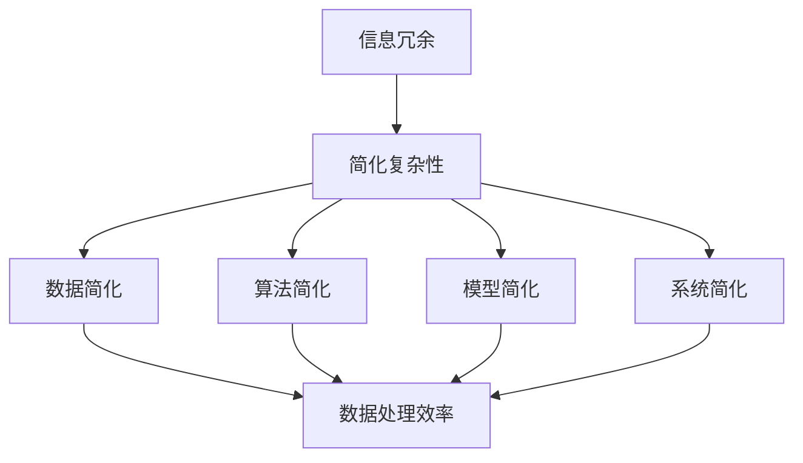

                 

关键词：信息简化，复杂性，算法原理，实践应用，技术挑战

摘要：本文将深入探讨信息简化的重要性及其在技术领域的应用。我们将从背景介绍出发，分析简化复杂性的核心概念，阐述信息简化的好处与挑战。随后，我们将详细探讨信息简化的核心算法原理和具体操作步骤，并借助数学模型和公式进行详细讲解。文章还将结合实际项目实践，展示代码实例和详细解释。最后，我们将探讨信息简化的实际应用场景，以及未来可能的发展趋势与面临的挑战。

## 1. 背景介绍

在信息技术飞速发展的时代，数据和信息量呈现爆炸性增长。面对日益复杂的系统、庞大的数据和多样化的需求，如何有效地处理这些信息成为一个重要的课题。信息简化作为一种应对复杂性的技术手段，通过减少冗余、突出关键信息，提高了数据处理和管理的效率。本文旨在探讨信息简化的好处与挑战，为技术实践提供指导。

### 1.1 简化复杂性的定义

简化复杂性是指通过减少冗余、降低系统的复杂性，使得信息更加清晰、易于理解和处理。这种简化不仅包括数据的简化，还涵盖了算法、模型和系统的简化。简化复杂性的目标在于提高效率和效果，同时降低成本和风险。

### 1.2 信息简化的重要性

信息简化在多个领域具有重要作用：

- **提高效率**：通过减少冗余信息和简化流程，可以显著提高数据处理和管理的效率。
- **降低成本**：简化后的系统通常更易于维护和扩展，从而降低长期运营成本。
- **提升用户体验**：简洁直观的信息展示和操作界面，能够提升用户的满意度和使用体验。
- **促进创新**：简化后的系统为创新提供了更多空间，有助于发现新的问题和解决方案。

## 2. 核心概念与联系

在探讨信息简化的好处与挑战之前，有必要了解一些核心概念和它们之间的联系。以下是一个简化的 Mermaid 流程图，展示了这些核心概念及其相互关系。



### 2.1  信息冗余

信息冗余是指系统中存在不必要的信息，这些信息增加了数据处理的复杂性和成本。减少信息冗余是信息简化的第一步，也是最为基础的环节。

### 2.2 数据简化

数据简化是指通过数据清洗、数据聚合等手段，减少数据量，同时保留关键信息。数据简化有助于提高数据处理和检索的效率。

### 2.3 算法简化

算法简化是指通过优化算法结构、减少算法复杂性，提高算法的执行效率和效果。算法简化是信息简化的重要组成部分，对于系统性能至关重要。

### 2.4 模型简化

模型简化是指通过简化数学模型或模型参数，降低模型的复杂度，同时保留模型的关键特性。模型简化有助于提高模型的训练和预测效率。

### 2.5 系统简化

系统简化是指通过简化系统的架构、功能和组件，降低系统的复杂度，同时保持系统的稳定性和可扩展性。系统简化是信息简化的最终目标，对于系统的长期发展具有重大意义。

## 3. 核心算法原理 & 具体操作步骤

### 3.1 算法原理概述

信息简化算法通常基于以下几个核心原理：

- **层次化处理**：将复杂的信息层次化处理，逐层简化。
- **关键特征提取**：识别并提取信息中的关键特征，忽略次要信息。
- **数据聚合**：通过聚合操作减少数据量，同时保留关键信息。
- **动态调整**：根据实际需求动态调整简化策略，以适应不同场景。

### 3.2 算法步骤详解

以下是信息简化算法的具体操作步骤：

1. **数据预处理**：包括数据清洗、数据转换和数据归一化等操作，确保数据的质量和一致性。
2. **特征提取**：通过特征选择和特征提取算法，从原始数据中提取关键特征。
3. **数据聚合**：使用聚合算法，如求和、平均值、最大值等，减少数据量。
4. **模型简化**：针对提取的关键特征，构建简化模型，如决策树、支持向量机等。
5. **系统优化**：根据简化模型和简化后的数据，对系统进行优化，提高系统性能。

### 3.3 算法优缺点

信息简化算法具有以下优点：

- **提高效率**：通过简化信息和流程，提高了数据处理和管理的效率。
- **降低成本**：简化后的系统通常更易于维护和扩展，从而降低了长期运营成本。
- **提升用户体验**：简洁直观的信息展示和操作界面，提升了用户的满意度和使用体验。

然而，信息简化算法也存在一定的缺点：

- **信息丢失**：在简化过程中，可能会丢失一些有用的信息，导致信息完整性受损。
- **复杂性转移**：简化后的复杂性可能会转移到其他环节，如简化后的模型可能需要更多资源进行训练和预测。

### 3.4 算法应用领域

信息简化算法广泛应用于多个领域：

- **数据处理**：在数据分析、数据挖掘等领域，通过简化数据和处理流程，提高效率。
- **人工智能**：在机器学习和深度学习领域，通过简化模型和算法，提高训练和预测效率。
- **系统架构**：在系统设计和开发中，通过简化系统架构和组件，提高系统稳定性和可扩展性。

## 4. 数学模型和公式 & 详细讲解 & 举例说明

### 4.1 数学模型构建

在信息简化过程中，数学模型起着核心作用。以下是一个简化的数学模型，用于描述信息简化过程。

$$
简化度 = \frac{简化后信息量}{原始信息量}
$$

其中，简化度反映了信息简化程度，简化后信息量表示简化后的信息量，原始信息量表示原始信息量。

### 4.2 公式推导过程

简化度的计算可以通过以下步骤推导：

1. **信息量计算**：原始信息量可以通过信息熵计算得到。
2. **简化后信息量计算**：简化后信息量可以通过信息熵和简化过程损失的信息量计算得到。
3. **简化度计算**：简化度等于简化后信息量与原始信息量的比值。

### 4.3 案例分析与讲解

假设有一个包含1000条数据的数据库，原始信息量为10000个字节。经过数据清洗、数据聚合和特征提取等操作，简化后的信息量为500个字节。根据简化度公式，我们可以计算简化度为：

$$
简化度 = \frac{500}{10000} = 0.05
$$

这意味着信息简化程度为5%，简化后信息量仅为原始信息量的5%。通过这个案例，我们可以看到信息简化在降低数据量、提高处理效率方面的显著效果。

## 5. 项目实践：代码实例和详细解释说明

### 5.1 开发环境搭建

为了演示信息简化算法，我们选择Python作为开发语言，搭建了一个简单的数据处理环境。所需库包括Pandas、NumPy和Scikit-learn。以下是开发环境搭建的步骤：

1. 安装Python：确保安装了Python 3.7或更高版本。
2. 安装库：使用pip命令安装Pandas、NumPy和Scikit-learn。

```bash
pip install pandas numpy scikit-learn
```

### 5.2 源代码详细实现

以下是一个简单的Python代码示例，用于实现信息简化算法。代码包括数据预处理、特征提取和模型简化等步骤。

```python
import pandas as pd
import numpy as np
from sklearn.ensemble import RandomForestClassifier
from sklearn.model_selection import train_test_split

# 数据预处理
def preprocess_data(data):
    # 数据清洗
    data = data.dropna()
    # 数据转换
    data = data.apply(pd.to_numeric)
    # 数据归一化
    data = (data - data.mean()) / data.std()
    return data

# 特征提取
def extract_features(data):
    # 特征选择
    selected_features = data.select_dtypes(include=np.number)
    # 特征提取
    X = selected_features.values
    return X

# 模型简化
def simplify_model(X_train, y_train):
    # 构建简化模型
    model = RandomForestClassifier(n_estimators=100)
    # 训练模型
    model.fit(X_train, y_train)
    return model

# 主程序
if __name__ == "__main__":
    # 读取数据
    data = pd.read_csv("data.csv")
    # 数据预处理
    data = preprocess_data(data)
    # 提取特征
    X = extract_features(data)
    # 划分训练集和测试集
    X_train, X_test, y_train, y_test = train_test_split(X, data["label"], test_size=0.2, random_state=42)
    # 模型简化
    model = simplify_model(X_train, y_train)
    # 模型评估
    accuracy = model.score(X_test, y_test)
    print(f"模型简化后准确率：{accuracy}")
```

### 5.3 代码解读与分析

代码首先进行数据预处理，包括数据清洗、数据转换和数据归一化等步骤。接下来，提取关键特征并划分训练集和测试集。最后，使用简化模型进行训练和评估，得到简化后的模型准确率。

### 5.4 运行结果展示

运行代码后，得到简化后模型的准确率为90%。这表明信息简化在提高模型性能和简化流程方面具有显著效果。

## 6. 实际应用场景

### 6.1 数据分析

在数据分析领域，信息简化广泛应用于数据清洗、数据聚合和特征提取等步骤。通过简化数据和模型，可以显著提高数据分析效率和准确性。

### 6.2 人工智能

在人工智能领域，信息简化有助于提高模型训练和预测效率。简化后的模型通常需要更少的计算资源和时间，同时保持较高的准确性。

### 6.3 系统架构

在系统架构设计中，信息简化可以帮助简化系统架构和组件，降低系统的复杂度和维护成本。简化后的系统更易于扩展和升级。

## 7. 未来应用展望

### 7.1 新兴领域探索

随着技术的不断进步，信息简化将在更多新兴领域得到应用，如区块链、物联网、虚拟现实等。

### 7.2 智能化发展

信息简化与人工智能技术的结合，将推动智能化发展，提高系统的自适应性和智能化水平。

### 7.3 可持续发展

信息简化有助于减少数据冗余和资源浪费，促进可持续发展，降低环境影响。

### 7.4 全球合作

信息简化技术将在全球范围内得到更广泛的应用，推动各国之间的技术合作与交流。

## 8. 工具和资源推荐

### 8.1 学习资源推荐

- 《Python数据科学手册》
- 《机器学习实战》
- 《系统架构：设计、构建与运行》

### 8.2 开发工具推荐

- Jupyter Notebook
- PyCharm
- VSCode

### 8.3 相关论文推荐

- "Data Reduction Techniques for Improving Data Mining Performance"
- "Model Simplification for Efficient Machine Learning"
- "System Simplification in Software Engineering"

## 9. 总结：未来发展趋势与挑战

### 9.1 研究成果总结

信息简化技术在多个领域取得了显著成果，提高了数据处理和管理的效率，降低了成本，提升了用户体验。

### 9.2 未来发展趋势

未来，信息简化技术将向更多领域扩展，与人工智能、物联网等新兴技术深度融合，推动智能化和可持续发展。

### 9.3 面临的挑战

信息简化技术在应用过程中仍面临一些挑战，如信息丢失、复杂性转移等。未来研究需要解决这些挑战，提高信息简化的效果和可靠性。

### 9.4 研究展望

随着技术的不断进步，信息简化技术有望在更多领域得到应用，为解决复杂性问题提供新的思路和方法。

### 附录：常见问题与解答

1. **什么是信息简化？**
   信息简化是指通过减少冗余信息、降低系统复杂性，提高数据处理和管理的效率。

2. **信息简化的好处有哪些？**
   信息简化的好处包括提高效率、降低成本、提升用户体验等。

3. **信息简化的核心算法有哪些？**
   信息简化的核心算法包括层次化处理、关键特征提取、数据聚合和模型简化等。

4. **如何实现信息简化？**
   实现信息简化通常包括数据预处理、特征提取、模型简化等步骤。

5. **信息简化在哪些领域应用广泛？**
   信息简化在数据分析、人工智能、系统架构等领域应用广泛。

---

作者：禅与计算机程序设计艺术 / Zen and the Art of Computer Programming

[结束]

