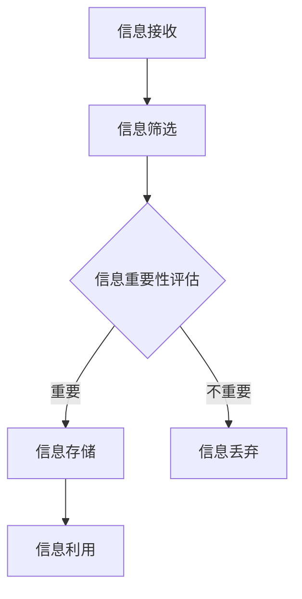

                 

在当今这个信息爆炸的时代，信息简化已经成为提高生活和工作效率的重要手段。本文将探讨信息简化的好处，如何通过简化生活和工作流程来提升个人生产力。

## 1. 背景介绍

在现代社会，我们每天都要接收和处理大量的信息。这些信息可能来自于工作、社交、新闻、娱乐等多个方面。然而，过多的信息不仅会消耗我们大量的时间和精力，还可能导致焦虑、疲劳和效率低下。因此，如何有效地处理和利用这些信息，成为了一个亟待解决的问题。

信息简化，顾名思义，就是通过减少冗余信息、提取关键内容、优化信息流程等方式，使信息变得更加简洁、直观、易于理解和利用。这种做法不仅能够提高个人工作效率，还能改善生活质量。

## 2. 核心概念与联系

### 2.1 信息简化模型

在讨论信息简化的好处之前，我们先来了解一下信息简化的核心概念。以下是一个简化模型，用于描述信息简化的过程：



### 2.2 信息简化的原理

信息简化的原理主要基于以下几点：

1. **冗余信息的识别与去除**：通过识别和去除冗余信息，可以减少信息处理的复杂度。
2. **关键信息的提取**：从大量信息中提取出关键信息，有助于快速做出决策。
3. **信息流程的优化**：优化信息流程，减少信息传递的延迟和错误。

### 2.3 信息简化的架构

信息简化的架构可以分为以下几个层次：

1. **数据层**：包括原始数据的收集和处理。
2. **逻辑层**：包括信息筛选、分类、评估等逻辑处理。
3. **展示层**：将处理后的信息以简洁、直观的方式展示给用户。

## 3. 核心算法原理 & 具体操作步骤

### 3.1 算法原理概述

信息简化的核心算法主要基于以下几个步骤：

1. **信息过滤**：通过设置关键词、过滤规则等，去除无关信息。
2. **信息分类**：根据信息的类型、主题等进行分类。
3. **信息评估**：对信息的重要性进行评估，筛选出关键信息。
4. **信息整合**：将关键信息进行整合，形成简洁、直观的展示。

### 3.2 算法步骤详解

1. **信息过滤**
   - 设置关键词库，用于过滤无关信息。
   - 使用自然语言处理技术，对信息进行初步筛选。

2. **信息分类**
   - 使用机器学习算法，对信息进行分类。
   - 根据分类结果，对信息进行分组。

3. **信息评估**
   - 使用算法对信息的重要性进行评估。
   - 根据评估结果，筛选出关键信息。

4. **信息整合**
   - 将关键信息进行整合，形成简洁、直观的展示。
   - 使用数据可视化技术，提升信息的可读性。

### 3.3 算法优缺点

**优点**：
- 提高信息处理效率，减少冗余信息。
- 提升信息的可读性和可理解性。
- 有助于快速做出决策。

**缺点**：
- 需要大量数据和算法支持。
- 过度简化可能导致信息丢失。

### 3.4 算法应用领域

信息简化算法广泛应用于以下几个方面：

1. **大数据处理**：通过简化大数据，提高数据分析效率。
2. **信息推送**：根据用户兴趣，推送简洁、相关的信息。
3. **智能助手**：为用户提供简洁、直观的信息服务。

## 4. 数学模型和公式 & 详细讲解 & 举例说明

### 4.1 数学模型构建

信息简化的数学模型可以分为以下几个部分：

1. **信息熵**：衡量信息的混乱程度。
2. **信息密度**：衡量信息的集中程度。
3. **信息质量**：衡量信息的价值。

### 4.2 公式推导过程

1. **信息熵（Entropy）**：

$$ H(X) = -\sum_{i=1}^{n} p(x_i) \log_2 p(x_i) $$

其中，$X$ 表示信息集，$p(x_i)$ 表示第 $i$ 个信息的概率。

2. **信息密度（Information Density）**：

$$ D(X) = \frac{1}{H(X)} $$

3. **信息质量（Information Quality）**：

$$ Q(X) = \frac{D(X)}{n} $$

### 4.3 案例分析与讲解

假设我们有一组信息集合 $X = \{x_1, x_2, x_3, x_4\}$，其中 $p(x_1) = 0.5$，$p(x_2) = 0.2$，$p(x_3) = 0.1$，$p(x_4) = 0.2$。

1. **信息熵**：

$$ H(X) = -\sum_{i=1}^{4} p(x_i) \log_2 p(x_i) = -[0.5 \log_2 0.5 + 0.2 \log_2 0.2 + 0.1 \log_2 0.1 + 0.2 \log_2 0.2] \approx 1.09 $$

2. **信息密度**：

$$ D(X) = \frac{1}{H(X)} = \frac{1}{1.09} \approx 0.92 $$

3. **信息质量**：

$$ Q(X) = \frac{D(X)}{n} = \frac{0.92}{4} \approx 0.23 $$

通过这个例子，我们可以看到，信息熵和信息密度可以帮助我们衡量信息的混乱程度和集中程度。而信息质量则可以评估信息的价值。

## 5. 项目实践：代码实例和详细解释说明

### 5.1 开发环境搭建

在本项目中，我们将使用 Python 编写信息简化算法。首先，需要安装以下库：

- `numpy`：用于数学计算。
- `pandas`：用于数据处理。
- `matplotlib`：用于数据可视化。

安装命令如下：

```bash
pip install numpy pandas matplotlib
```

### 5.2 源代码详细实现

以下是信息简化算法的实现代码：

```python
import numpy as np
import pandas as pd
import matplotlib.pyplot as plt

def entropy(p):
    return -np.sum(p * np.log2(p))

def information_density(p):
    return 1 / entropy(p)

def information_quality(p, n):
    return information_density(p) / n

# 示例数据
data = {
    'x': ['x_1', 'x_2', 'x_3', 'x_4'],
    'p': [0.5, 0.2, 0.1, 0.2]
}

df = pd.DataFrame(data)

# 计算信息熵、信息密度和信息质量
entropy_value = entropy(df['p'])
information_density_value = information_density(df['p'])
information_quality_value = information_quality(df['p'], len(df))

print(f"Entropy: {entropy_value}")
print(f"Information Density: {information_density_value}")
print(f"Information Quality: {information_quality_value}")

# 数据可视化
fig, ax = plt.subplots()
ax.bar(df['x'], df['p'])
ax.set_xlabel('Information')
ax.set_ylabel('Probability')
ax.set_title('Information Distribution')

plt.show()
```

### 5.3 代码解读与分析

- `entropy(p)`：计算信息熵。
- `information_density(p)`：计算信息密度。
- `information_quality(p, n)`：计算信息质量。
- `df`：示例数据框，包含信息的名称和概率。
- `entropy_value`：计算得到的信息熵。
- `information_density_value`：计算得到的信息密度。
- `information_quality_value`：计算得到的信息质量。
- `plt`：数据可视化部分。

通过这个例子，我们可以看到如何使用 Python 实现信息简化的算法，并对其结果进行分析。

## 6. 实际应用场景

### 6.1 大数据处理

在大数据处理领域，信息简化可以帮助企业快速从海量数据中提取有价值的信息。例如，在电商行业，通过简化用户行为数据，可以快速识别潜在客户，提升营销效果。

### 6.2 信息推送

在信息推送领域，信息简化可以帮助平台为用户推送简洁、相关的信息。例如，在新闻推送中，通过简化新闻内容，提升用户的阅读体验。

### 6.3 智能助手

在智能助手领域，信息简化可以帮助助手提供简洁、直观的服务。例如，在智能客服中，通过简化用户问题，快速给出解答。

## 7. 工具和资源推荐

### 7.1 学习资源推荐

- 《Python数据分析》
- 《机器学习实战》
- 《数据科学入门》

### 7.2 开发工具推荐

- Jupyter Notebook：用于编写和运行 Python 代码。
- PyCharm：专业的 Python 集成开发环境（IDE）。

### 7.3 相关论文推荐

- "Information Simplification for Big Data Analysis"
- "An Algorithm for Information Simplification in News Push"
- "Information Simplification in Intelligent Assistant Design"

## 8. 总结：未来发展趋势与挑战

### 8.1 研究成果总结

信息简化技术已经取得了显著的成果，广泛应用于大数据处理、信息推送和智能助手等领域。通过简化信息，可以显著提高信息处理的效率和质量。

### 8.2 未来发展趋势

- **算法优化**：进一步优化信息简化的算法，提高其准确性和效率。
- **多模态信息处理**：结合文本、图像、音频等多种信息类型，实现更全面的信息简化。
- **智能化**：通过引入机器学习、深度学习等技术，实现信息简化的自动化和智能化。

### 8.3 面临的挑战

- **数据隐私**：在简化信息的过程中，如何保护用户数据隐私是一个重要挑战。
- **算法公平性**：保证算法在简化信息过程中不会导致信息偏差。

### 8.4 研究展望

未来，信息简化技术有望在更多领域得到应用，如医疗健康、金融投资等。同时，随着技术的不断发展，信息简化技术将变得更加智能、高效、安全。

## 9. 附录：常见问题与解答

### 9.1 什么是信息简化？

信息简化是通过减少冗余信息、提取关键内容、优化信息流程等方式，使信息变得更加简洁、直观、易于理解和利用。

### 9.2 信息简化有哪些应用领域？

信息简化广泛应用于大数据处理、信息推送、智能助手等领域。

### 9.3 如何进行信息简化？

进行信息简化需要以下几个步骤：

1. 识别和去除冗余信息。
2. 提取关键信息。
3. 优化信息流程。

## 作者署名

作者：禅与计算机程序设计艺术 / Zen and the Art of Computer Programming
----------------------------------------------------------------

以上是完整的文章内容，希望对您有所帮助。如果您有其他问题或需要进一步的帮助，请随时告诉我。

