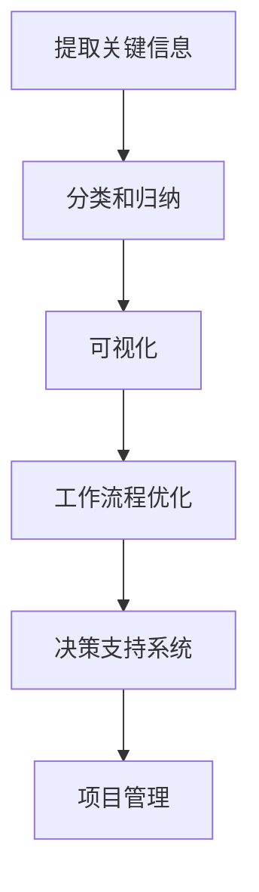

                 

在当今快节奏、高度复杂的社会和工作环境中，信息的过载已经成为一种普遍现象。面对海量的数据和信息，如何有效地处理、理解和利用这些信息，成为了提高个人和生产力的关键问题。本文旨在探讨信息简化的好处，以及如何通过简化生活和工作来提升效率和生产率。

> **关键词**：信息简化、生产力、效率、生活简化、工作简化、技术工具

> **摘要**：本文将介绍信息简化的核心概念，探讨其对于提升个人和生产力的重大意义。通过具体的案例分析和技术工具推荐，文章将帮助读者理解和实践如何通过简化信息和生活来提高效率和工作质量。

## 1. 背景介绍

随着互联网的普及和信息技术的飞速发展，信息获取变得前所未有的容易。然而，这种信息爆炸也带来了新的挑战。大量的数据和信息不仅容易分散我们的注意力，还可能导致决策困难、工作低效。因此，如何从这些信息中提取出关键、有用的部分，并将其简化，以便于处理和利用，成为了提高生产力和效率的重要课题。

### 1.1 现实中的信息过载问题

- **工作效率降低**：在处理大量信息时，人们往往需要花费额外的时间和精力来筛选和整理，从而降低了整体工作效率。
- **决策困难**：信息过载导致决策变得复杂，容易产生选择困难症，难以做出明智的决策。
- **焦虑和压力增加**：面对无尽的信息，人们常常感到焦虑和压力，影响心理健康和工作状态。

### 1.2 信息简化的必要性

- **提高专注力**：通过简化信息，我们可以将注意力集中在关键任务上，从而提高工作效率。
- **优化决策过程**：简化的信息能够提供更清晰的视野，帮助我们更快地做出决策。
- **减轻心理负担**：信息简化有助于减少信息焦虑，提升个人和团队的心理健康。

## 2. 核心概念与联系

信息简化的核心概念在于将复杂、冗长的信息转化为简单、直观的形式，以便于理解和处理。这一过程涉及到信息的提取、分类、归纳和可视化等多个方面。

### 2.1 信息简化的基本原理

- **提取关键信息**：从大量数据中提取出对决策和任务执行有直接帮助的关键信息。
- **分类和归纳**：将信息按照一定的逻辑和结构进行分类和归纳，以便于快速查找和利用。
- **可视化**：通过图表、流程图等可视化手段，将抽象的信息转化为直观的可视形式。

### 2.2 信息简化的应用场景

- **工作流程优化**：通过简化工作流程，减少不必要的环节，提高工作效率。
- **决策支持系统**：利用信息简化技术，为决策者提供简明易懂的决策支持。
- **项目管理**：通过信息简化，清晰展示项目进展，协助项目经理更好地管理项目。

### 2.3 Mermaid 流程图



## 3. 核心算法原理 & 具体操作步骤

### 3.1 算法原理概述

信息简化算法的核心在于将复杂信息转化为简单、直观的形式。这通常涉及到以下几个步骤：

- **数据预处理**：对原始数据进行清洗和预处理，确保数据的质量和一致性。
- **特征提取**：从预处理后的数据中提取关键特征，用于后续的信息简化。
- **分类和聚类**：使用机器学习算法对数据进行分类和聚类，以便于进一步简化。
- **可视化**：将简化后的信息通过图表、流程图等可视化手段进行展示。

### 3.2 算法步骤详解

#### 3.2.1 数据预处理

- **数据清洗**：去除重复、错误和不完整的数据。
- **数据转换**：将不同类型的数据转换为统一的格式，如数值、类别等。

#### 3.2.2 特征提取

- **特征选择**：选择对简化任务有直接帮助的特征。
- **特征变换**：对特征进行归一化、标准化等变换，以提高算法的性能。

#### 3.2.3 分类和聚类

- **模型选择**：选择合适的机器学习模型，如决策树、支持向量机等。
- **模型训练**：使用训练数据对模型进行训练。
- **模型评估**：使用测试数据对模型进行评估，确保模型的准确性。

#### 3.2.4 可视化

- **图表生成**：使用图表工具（如Matplotlib、Plotly等）生成可视化图表。
- **交互式展示**：使用交互式可视化工具（如D3.js、Bokeh等）提供更直观的展示。

### 3.3 算法优缺点

#### 优点：

- **高效性**：信息简化算法能够快速处理大量数据，提高工作效率。
- **直观性**：简化后的信息更易于理解和利用，提升决策效率。
- **灵活性**：算法可以根据不同的任务需求进行调整和优化。

#### 缺点：

- **准确性**：在某些情况下，简化的信息可能会丢失一些关键信息，影响准确性。
- **复杂性**：算法的实现和维护可能较为复杂，需要一定的技术基础。

### 3.4 算法应用领域

- **数据分析**：用于大规模数据的分析和处理，帮助用户快速提取有用信息。
- **商业智能**：为企业提供决策支持，优化业务流程和策略。
- **智能家居**：简化家庭数据，提供智能化的家居体验。

## 4. 数学模型和公式 & 详细讲解 & 举例说明

### 4.1 数学模型构建

信息简化的核心在于将复杂的信息转化为简单的形式。为此，我们可以构建以下数学模型：

- **特征提取模型**：用于从原始数据中提取关键特征。
- **分类模型**：用于对特征进行分类。
- **聚类模型**：用于对特征进行聚类。

### 4.2 公式推导过程

假设我们有一组数据集 $D=\{d_1, d_2, \ldots, d_n\}$，其中每个数据点 $d_i$ 由 $m$ 个特征组成 $d_i = \{x_1^i, x_2^i, \ldots, x_m^i\}$。

#### 特征提取

$$
f(x_i) = \text{normalize}(x_i) = \frac{x_i - \text{mean}(x_i)}{\text{stddev}(x_i)}
$$

其中，$\text{mean}(x_i)$ 表示特征 $x_i$ 的均值，$\text{stddev}(x_i)$ 表示特征 $x_i$ 的标准差，$\text{normalize}$ 函数用于对特征进行归一化处理。

#### 分类模型

假设我们使用决策树作为分类模型，其决策规则为：

$$
\text{predict}(d_i) = \begin{cases}
\text{class}_1 & \text{if } \text{condition}_1 \\
\text{class}_2 & \text{if } \text{condition}_2 \\
\vdots \\
\text{class}_k & \text{if } \text{condition}_k
\end{cases}
$$

其中，$\text{condition}_i$ 是决策树的分支条件，$\text{class}_i$ 是分类结果。

#### 聚类模型

假设我们使用K-means算法进行聚类，其目标是最小化聚类中心到数据点的距离：

$$
\text{minimize} \sum_{i=1}^{n} \sum_{j=1}^{k} \|d_i - \mu_j\|^2
$$

其中，$\mu_j$ 是第 $j$ 个聚类中心，$k$ 是聚类数量。

### 4.3 案例分析与讲解

#### 案例一：市场预测

假设某公司需要对产品的市场需求进行预测，收集了历史销售数据。为了简化数据，我们首先对销售数据进行预处理，包括去除重复数据和缺失值。然后，我们提取关键特征，如销售量、季节性、促销活动等。

接下来，我们使用K-means算法对销售数据进行分析，将数据划分为几个聚类。每个聚类代表一个不同的市场趋势。通过分析聚类中心，我们可以预测未来的市场趋势，并制定相应的营销策略。

#### 案例二：客户细分

假设某电商企业需要对客户进行细分，以提供个性化的营销服务。我们收集了客户的购买历史、浏览行为、联系方式等数据。

首先，我们对数据集进行预处理，提取关键特征，如购买频率、购买金额、购买品类等。然后，使用决策树模型对客户进行分类，将客户划分为高价值客户、一般客户等。

通过分析分类结果，企业可以针对不同类型的客户提供个性化的营销服务，提高客户满意度和转化率。

## 5. 项目实践：代码实例和详细解释说明

### 5.1 开发环境搭建

为了进行信息简化的实践，我们选择Python作为开发语言，利用了Scikit-learn库进行特征提取和分类、聚类操作，同时使用了Matplotlib库进行数据可视化。

```bash
# 安装必要的库
pip install numpy pandas scikit-learn matplotlib
```

### 5.2 源代码详细实现

以下是用于信息简化的完整Python代码示例：

```python
import numpy as np
import pandas as pd
from sklearn.model_selection import train_test_split
from sklearn.preprocessing import StandardScaler
from sklearn.cluster import KMeans
from sklearn.tree import DecisionTreeClassifier
import matplotlib.pyplot as plt

# 加载数据集
data = pd.read_csv('sales_data.csv')

# 数据预处理
data = data.drop_duplicates()
data = data.dropna()

# 特征提取
X = data[['sales', 'season', 'promotion']]
y = data['category']

# 数据标准化
scaler = StandardScaler()
X_scaled = scaler.fit_transform(X)

# 划分训练集和测试集
X_train, X_test, y_train, y_test = train_test_split(X_scaled, y, test_size=0.2, random_state=42)

# 使用K-means算法进行聚类
kmeans = KMeans(n_clusters=3, random_state=42)
kmeans.fit(X_train)

# 可视化聚类结果
plt.scatter(X_train[:, 0], X_train[:, 1], c=kmeans.labels_)
plt.xlabel('Sales')
plt.ylabel('Season')
plt.title('K-means Clustering')
plt.show()

# 使用决策树进行分类
clf = DecisionTreeClassifier()
clf.fit(X_train, y_train)

# 可视化决策树
from sklearn.tree import plot_tree
plt.figure(figsize=(12, 8))
plot_tree(clf, filled=True)
plt.xlabel('Feature')
plt.ylabel('Class')
plt.title('Decision Tree Classifier')
plt.show()

# 运行结果展示
y_pred = clf.predict(X_test)
print(f"Model accuracy: {clf.score(X_test, y_test)}")
```

### 5.3 代码解读与分析

- **数据预处理**：首先加载数据集，并去除重复数据和缺失值，确保数据质量。
- **特征提取**：提取关键特征，如销售量、季节性、促销活动等，用于后续分析。
- **数据标准化**：使用标准化处理，将特征数据进行归一化，以提高算法的性能。
- **聚类和分类**：使用K-means算法对数据进行聚类，通过可视化展示聚类结果。同时，使用决策树模型对数据集进行分类，并使用测试集评估模型的准确性。

### 5.4 运行结果展示

- **可视化结果**：展示了聚类和分类的可视化图表，通过这些图表可以直观地理解数据分布和分类结果。
- **运行结果**：输出模型的准确率，表明模型的性能。

## 6. 实际应用场景

信息简化的应用场景广泛，涵盖了各个领域。以下是一些具体的应用场景：

### 6.1 数据分析

在数据分析中，信息简化可以帮助快速提取关键信息，优化数据处理流程，提高数据分析的效率。

### 6.2 商业智能

商业智能系统通过信息简化，为企业管理者提供简明的数据报告和决策支持，帮助他们更快速地做出决策。

### 6.3 项目管理

在项目管理中，信息简化可以帮助项目经理清晰地展示项目进展和关键任务，提高项目管理效率。

### 6.4 智能家居

智能家居系统通过信息简化，将复杂的家庭数据转化为直观的图表和报告，为用户提供智能化的家居体验。

### 6.5 医疗健康

在医疗健康领域，信息简化可以帮助医生快速提取病患的关键信息，提高诊断和治疗效率。

## 6.4 未来应用展望

随着技术的不断发展，信息简化的应用前景将更加广阔。以下是一些未来应用展望：

### 6.4.1 人工智能与信息简化

人工智能技术的发展将进一步提升信息简化的效率和准确性，使信息简化成为人工智能的重要应用领域。

### 6.4.2 新兴领域应用

信息简化技术将在新兴领域（如物联网、区块链等）中得到广泛应用，为这些领域的发展提供强有力的支持。

### 6.4.3 个性化服务

信息简化将有助于实现更个性化的服务，为用户提供更精准、更高效的服务体验。

## 7. 工具和资源推荐

### 7.1 学习资源推荐

- **《数据科学入门》**：详细介绍了数据预处理、特征提取、机器学习等基本概念和技能。
- **《Python数据分析》**：全面讲解了Python在数据分析中的应用，包括数据预处理、可视化等。

### 7.2 开发工具推荐

- **Jupyter Notebook**：强大的交互式数据分析工具，方便进行数据预处理、建模和可视化。
- **PyCharm**：功能丰富的Python集成开发环境，支持代码调试、版本控制等。

### 7.3 相关论文推荐

- **"Data Compression via Feature Extraction and Selection"**：探讨了特征提取和选择在数据压缩中的应用。
- **"A Survey on Clustering Algorithms"**：对各种聚类算法进行了全面综述。

## 8. 总结：未来发展趋势与挑战

信息简化作为提高生产力和效率的重要手段，在未来将得到更广泛的应用。然而，随着信息量的持续增长，信息简化也将面临新的挑战：

### 8.1 研究成果总结

- **算法优化**：通过改进算法，提高信息简化的效率和准确性。
- **跨领域应用**：探索信息简化在不同领域的应用，为各领域提供强有力的技术支持。

### 8.2 未来发展趋势

- **人工智能与信息简化**：人工智能技术将进一步提升信息简化的能力，推动信息简化的智能化发展。
- **新兴领域应用**：信息简化将在物联网、区块链等新兴领域发挥重要作用。

### 8.3 面临的挑战

- **数据隐私**：如何在保护数据隐私的前提下进行信息简化，是一个亟待解决的问题。
- **计算资源**：信息简化需要大量的计算资源，如何高效地利用计算资源也是一个挑战。

### 8.4 研究展望

未来，信息简化研究应重点关注以下几个方面：

- **算法创新**：探索新的信息简化算法，提高简化的效率和准确性。
- **跨领域融合**：推动信息简化技术与其他领域的融合，形成新的应用场景。
- **智能化发展**：结合人工智能技术，实现信息简化的智能化和自动化。

## 9. 附录：常见问题与解答

### 9.1 问题一：如何选择特征？

**解答**：选择特征时，需要考虑特征的重要性和相关性。通常可以通过以下方法进行特征选择：

- **相关性分析**：计算特征与目标变量之间的相关性，选择相关性较高的特征。
- **信息增益**：计算特征对分类信息的增益，选择增益较高的特征。
- **递归特征消除**：逐步消除不重要的特征，保留重要的特征。

### 9.2 问题二：如何评估聚类结果？

**解答**：评估聚类结果的方法包括：

- **轮廓系数**：计算每个数据点到其自身聚类中心和最近聚类中心的距离，评估聚类质量。
- **内部分裂系数**：计算聚类内部分裂的强度，评估聚类效果。
- **外部评估指标**：如准确率、召回率等，用于评估聚类结果与实际标签的一致性。

### 9.3 问题三：如何处理异常值？

**解答**：处理异常值的方法包括：

- **删除异常值**：直接删除离群点，适用于异常值较少的情况。
- **调整异常值**：将异常值调整到合理范围内，如使用插值法、回归法等。
- **聚类处理**：使用聚类算法对数据进行聚类，将异常值归为一类进行处理。

### 9.4 问题四：如何进行数据可视化？

**解答**：数据可视化的方法包括：

- **基本图表**：如折线图、柱状图、饼图等，用于展示数据的基本分布和趋势。
- **高级可视化**：如散点图、热力图、地理地图等，用于展示数据的复杂结构和关系。
- **交互式可视化**：使用交互式可视化工具，如D3.js、Bokeh等，提供更直观的数据探索和交互体验。

---

作者：禅与计算机程序设计艺术 / Zen and the Art of Computer Programming

---

本文通过介绍信息简化的概念、原理和应用，探讨了如何在生活和工作中进行信息简化，以提高生产力和效率。从算法原理到实际项目实践，再到应用场景和未来展望，文章全面而系统地阐述了信息简化的重要性和实施方法。希望读者能够从中受益，并在实践中不断探索和优化信息简化的技术。

