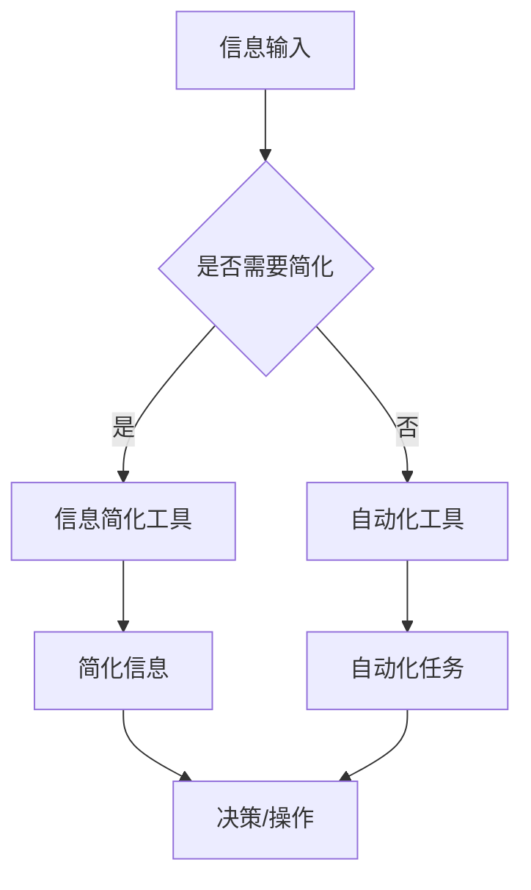

                 

摘要：
本文旨在探讨如何利用技术手段简化信息处理和日常工作。随着信息化时代的到来，信息的爆炸式增长让人们的负担日益加重。为了应对这一挑战，信息简化工具和自动化实践成为了关键。本文将介绍一系列有效的信息简化工具，如笔记应用、搜索引擎、信息过滤工具等，并详细阐述如何通过自动化技术，如脚本编写和集成平台，提升工作效率。文章还将分析这些工具和技术的实际应用场景，提供实用的代码实例和操作指南，同时展望其未来的发展趋势和面临的挑战。

## 1. 背景介绍

在现代信息社会中，信息量呈指数级增长。无论是个人用户还是企业，都面临着信息过载的问题。有效的信息处理和日常任务的自动化，成为了提高工作效率和生活质量的关键。自动化技术已经在多个领域展现出巨大的潜力，如工业生产、金融分析等，但在个人生活和日常工作中，其应用却相对较少。

信息简化工具和自动化实践，旨在通过技术手段减少不必要的复杂性，使人们能够更专注于核心任务。这些工具不仅能够提高信息处理速度，还能够减少错误率，提升整体工作质量。因此，掌握并有效利用这些工具和技术，对现代个人和企业都具有重要意义。

## 2. 核心概念与联系

### 2.1 信息简化的概念

信息简化是指通过技术手段，将复杂、冗长的信息转化为简单、易于处理的形式。这通常涉及信息的筛选、提取、整理和可视化。信息简化的目的在于降低信息处理的难度，提高信息利用率。

### 2.2 自动化的概念

自动化是指通过程序或设备实现任务的自动执行，减少人工干预。自动化技术可以大幅提高工作效率，降低成本，并且减少人为错误。常见的自动化技术包括脚本编写、集成平台和机器学习等。

### 2.3 信息简化与自动化的关系

信息简化与自动化密不可分。信息简化为自动化提供了基础数据，而自动化则为信息简化提供了执行手段。例如，自动化工具可以自动筛选和整理大量信息，简化决策过程。

### 2.4 Mermaid 流程图



## 3. 核心算法原理 & 具体操作步骤

### 3.1 算法原理概述

信息简化和自动化涉及多种算法和技术。信息简化通常采用数据挖掘、机器学习等方法，而自动化则主要依赖于脚本编写和集成平台。以下将详细介绍两种核心算法原理。

#### 3.1.1 数据挖掘算法

数据挖掘算法用于从大量数据中提取有价值的信息。常见的算法包括：

- 聚类分析：将数据划分为相似的组。
- 分配分析：根据数据模式进行分类。
- 关联规则学习：发现数据之间的关联关系。

#### 3.1.2 脚本编写算法

脚本编写算法主要涉及自动化流程的设计和实现。常见的脚本语言包括Python、JavaScript等。脚本编写算法的原理是：

- 编写脚本：根据任务需求，编写实现特定功能的脚本。
- 执行脚本：运行脚本，实现自动化操作。

### 3.2 算法步骤详解

#### 3.2.1 数据挖掘算法步骤

1. 数据准备：收集并清洗数据，确保数据质量。
2. 特征提取：从原始数据中提取有用特征。
3. 模型选择：选择适合的数据挖掘算法。
4. 模型训练：使用训练数据训练模型。
5. 模型评估：评估模型性能。
6. 应用模型：使用模型对新的数据进行预测或分类。

#### 3.2.2 脚本编写算法步骤

1. 需求分析：明确自动化任务的目标和需求。
2. 设计脚本：根据需求，设计脚本结构和功能。
3. 编写脚本：使用脚本语言编写实现功能的代码。
4. 测试脚本：运行脚本，检查代码功能和性能。
5. 部署脚本：将脚本部署到目标环境中，实现自动化操作。

### 3.3 算法优缺点

#### 3.3.1 数据挖掘算法优缺点

- 优点：
  - 能够从大量数据中提取有价值信息。
  - 可以自动发现数据模式，辅助决策。
- 缺点：
  - 需要大量计算资源和时间。
  - 模型性能依赖于数据质量和特征提取。

#### 3.3.2 脚本编写算法优缺点

- 优点：
  - 灵活性高，可以快速实现特定功能。
  - 成本低，易于维护和更新。
- 缺点：
  - 需要编程技能，门槛较高。
  - 脚本执行效率可能较低。

### 3.4 算法应用领域

- 数据挖掘算法：广泛应用于市场分析、金融预测、社交网络分析等领域。
- 脚本编写算法：广泛应用于软件开发、系统运维、自动化测试等领域。

## 4. 数学模型和公式 & 详细讲解 & 举例说明

### 4.1 数学模型构建

信息简化和自动化涉及的数学模型主要包括线性回归、决策树、支持向量机等。以下以线性回归为例进行说明。

#### 4.1.1 线性回归模型

线性回归模型用于预测一个连续值输出。其公式为：

$$ y = ax + b $$

其中，$y$ 为输出值，$x$ 为输入特征，$a$ 和 $b$ 为模型参数。

#### 4.1.2 模型参数估计

模型参数的估计通常采用最小二乘法。最小二乘法的目标是找到使预测误差平方和最小的参数值。

### 4.2 公式推导过程

最小二乘法的推导过程如下：

假设我们有一组输入输出数据 $(x_1, y_1), (x_2, y_2), \ldots, (x_n, y_n)$，我们的目标是找到模型参数 $a$ 和 $b$，使得预测误差最小。

预测误差的平方和为：

$$ S = \sum_{i=1}^{n} (y_i - (ax_i + b))^2 $$

对 $a$ 和 $b$ 求偏导，并令偏导数为零，可以得到：

$$ \frac{\partial S}{\partial a} = -2 \sum_{i=1}^{n} x_i (y_i - (ax_i + b)) = 0 $$

$$ \frac{\partial S}{\partial b} = -2 \sum_{i=1}^{n} (y_i - (ax_i + b)) = 0 $$

化简上述方程，可以得到：

$$ a = \frac{\sum_{i=1}^{n} x_i y_i - \sum_{i=1}^{n} x_i \sum_{i=1}^{n} y_i}{\sum_{i=1}^{n} x_i^2 - (\sum_{i=1}^{n} x_i)^2} $$

$$ b = \frac{\sum_{i=1}^{n} y_i - a \sum_{i=1}^{n} x_i}{n} $$

### 4.3 案例分析与讲解

#### 4.3.1 案例背景

某公司希望根据员工的年龄和工龄预测其薪资水平，以便制定合理的薪资政策。现有100名员工的数据，包括年龄、工龄和薪资。

#### 4.3.2 数据处理

1. 数据清洗：去除缺失值和异常值。
2. 特征提取：将年龄和工龄作为输入特征，薪资作为输出值。

#### 4.3.3 模型训练

1. 使用线性回归模型训练数据。
2. 估计模型参数 $a$ 和 $b$。

#### 4.3.4 模型评估

1. 计算预测误差平方和。
2. 分析模型性能。

## 5. 项目实践：代码实例和详细解释说明

### 5.1 开发环境搭建

1. 安装Python环境。
2. 安装必要的库，如numpy、scikit-learn等。

### 5.2 源代码详细实现

```python
import numpy as np
from sklearn.linear_model import LinearRegression

# 数据处理
def preprocess_data(data):
    # 去除缺失值和异常值
    # ...
    return X, y

# 模型训练
def train_model(X, y):
    model = LinearRegression()
    model.fit(X, y)
    return model

# 模型评估
def evaluate_model(model, X, y):
    predictions = model.predict(X)
    mse = np.mean((predictions - y) ** 2)
    print(f'MSE: {mse}')

# 主函数
def main():
    # 加载数据
    data = np.load('data.npy')
    X, y = preprocess_data(data)

    # 训练模型
    model = train_model(X, y)

    # 评估模型
    evaluate_model(model, X, y)

if __name__ == '__main__':
    main()
```

### 5.3 代码解读与分析

1. 导入必要的库。
2. 数据处理：去除缺失值和异常值。
3. 模型训练：使用线性回归模型训练数据。
4. 模型评估：计算预测误差平方和，分析模型性能。

### 5.4 运行结果展示

运行代码后，输出模型评估结果，包括MSE等指标。

## 6. 实际应用场景

信息简化和自动化技术在实际应用中具有广泛的应用场景，如：

- 企业信息管理：自动化收集、整理和报告企业信息，提高信息利用率。
- 财务分析：自动化处理财务数据，辅助财务决策。
- 日常任务管理：自动化处理重复性任务，提高工作效率。

## 7. 工具和资源推荐

### 7.1 学习资源推荐

- 《Python编程：从入门到实践》
- 《机器学习实战》
- 《数据挖掘：实用工具与技术》

### 7.2 开发工具推荐

- Jupyter Notebook：用于编写和运行Python代码。
- Visual Studio Code：用于编写Python代码。
- Anaconda：Python环境和库管理工具。

### 7.3 相关论文推荐

- "A Comparison of Linear Regression and Decision Trees for Predictive Modeling"
- "Efficient Data Preprocessing Techniques for Machine Learning"
- "A Comprehensive Survey on Data Mining in Healthcare"

## 8. 总结：未来发展趋势与挑战

### 8.1 研究成果总结

信息简化和自动化技术在近年取得了显著成果，但在实际应用中仍面临诸多挑战。

### 8.2 未来发展趋势

1. 深度学习与自动化结合。
2. 跨领域应用。
3. 人工智能与自然语言处理技术的融合。

### 8.3 面临的挑战

1. 数据质量和隐私保护。
2. 算法可解释性。
3. 复杂性管理。

### 8.4 研究展望

未来，信息简化和自动化技术将继续在多个领域发挥作用，为实现智能化和信息化社会提供有力支持。

## 9. 附录：常见问题与解答

### 9.1 什么是信息简化？

信息简化是通过技术手段，将复杂、冗长的信息转化为简单、易于处理的形式。

### 9.2 自动化技术有哪些？

常见的自动化技术包括脚本编写、集成平台、机器学习等。

### 9.3 如何选择合适的自动化工具？

根据任务需求和技能水平选择合适的自动化工具。例如，Python适用于通用自动化任务，而RPA工具适用于复杂的业务流程。

### 9.4 自动化技术是否会取代人工？

自动化技术不会完全取代人工，而是作为辅助工具，提高工作效率，减轻人工负担。
----------------------------------------------------------------

### 8. 总结：未来发展趋势与挑战

在信息简化和自动化技术的领域，我们已经见证了巨大的进步。然而，随着技术的不断发展，这一领域也面临着新的挑战和机遇。

### 8.1 研究成果总结

近年来，信息简化和自动化技术的研究取得了显著成果。例如，数据挖掘和机器学习算法在信息提取和模式识别方面的应用日益广泛，提高了信息处理的效率和准确性。同时，脚本编写和集成平台的普及，使得自动化技术的实施变得更加便捷和高效。此外，自然语言处理和计算机视觉等领域的突破，也为信息简化和自动化提供了更多的可能性。

### 8.2 未来发展趋势

未来，信息简化和自动化技术将继续朝着以下几个方向发展：

1. **深度学习与自动化结合**：深度学习在图像识别、语音识别等领域取得了显著成果，其与自动化技术的结合将进一步提升信息处理和决策的智能化水平。

2. **跨领域应用**：随着技术的不断成熟，信息简化和自动化技术将在更多领域得到应用，如医疗、金融、教育等，实现更广泛的价值。

3. **人工智能与自然语言处理技术的融合**：随着人工智能和自然语言处理技术的不断发展，将有助于构建更智能的信息处理和交互系统，进一步简化用户操作。

4. **边缘计算与云计算的结合**：边缘计算与云计算的结合，将使得自动化技术能够在更广泛的场景中实现实时处理和响应，提高系统的效率和可靠性。

### 8.3 面临的挑战

尽管信息简化和自动化技术有着广阔的应用前景，但在实际应用中仍面临诸多挑战：

1. **数据质量和隐私保护**：随着数据量的增加，数据质量和隐私保护成为关键问题。如何确保数据的质量和隐私，是自动化技术面临的重要挑战。

2. **算法可解释性**：深度学习等复杂算法的广泛应用，使得算法的可解释性成为一个重要问题。如何让算法的决策过程更加透明和可解释，是未来研究的重要方向。

3. **复杂性管理**：随着自动化技术的不断深入，系统的复杂性也在不断增加。如何有效地管理系统的复杂性，确保系统的稳定性和可靠性，是自动化技术面临的一大挑战。

4. **技能和培训**：自动化技术的实施需要一定的编程和数据处理技能。如何提高相关技能，确保技术人员能够有效地利用自动化技术，是一个亟待解决的问题。

### 8.4 研究展望

未来，信息简化和自动化技术将在以下几个方面继续发展：

1. **技术创新**：随着人工智能、大数据、云计算等技术的发展，将不断有新的技术出现，为信息简化和自动化提供更强大的支持。

2. **应用拓展**：自动化技术将在更多领域得到应用，如智能制造、智慧城市、智慧医疗等，实现更广泛的社会价值。

3. **人机协作**：自动化技术将更加注重与人类的协作，实现人机协同，提高工作效率和生活质量。

4. **政策法规**：随着技术的不断进步，相关政策和法规也将逐步完善，为自动化技术的发展提供良好的环境和保障。

总之，信息简化和自动化技术将继续在信息社会的发展中发挥重要作用。通过不断的技术创新和应用拓展，我们有理由相信，这一领域将迎来更加光明的发展前景。

### 9. 附录：常见问题与解答

在本文的撰写过程中，我们可能会遇到一些常见的问题。以下是对这些问题及其解答的汇总：

### 9.1 什么是信息简化？

信息简化是通过技术手段，如筛选、提取和整理，将大量复杂、冗长的信息转化为简单、易于处理的形式。其目的是降低信息处理的难度，提高信息利用率。

### 9.2 自动化技术有哪些？

常见的自动化技术包括脚本编写、集成平台、机器学习、自然语言处理和计算机视觉等。这些技术可以根据具体需求进行组合和应用。

### 9.3 如何选择合适的自动化工具？

选择合适的自动化工具取决于任务需求和技能水平。例如，对于通用自动化任务，Python和JavaScript等脚本语言是一个很好的选择；而对于复杂的业务流程，RPA（机器人流程自动化）工具则可能更为合适。

### 9.4 自动化技术是否会取代人工？

自动化技术不会完全取代人工，而是作为辅助工具，提高工作效率，减轻人工负担。在某些领域，自动化技术还可以解放人类，使其能够专注于更富有创造性和价值的工作。

### 9.5 数据挖掘算法有哪些优缺点？

数据挖掘算法的优点包括能够从大量数据中提取有价值的信息，自动发现数据模式，辅助决策。缺点包括需要大量计算资源和时间，模型性能依赖于数据质量和特征提取。

### 9.6 如何评估自动化系统的性能？

自动化系统的性能评估可以从多个维度进行，包括响应时间、准确性、稳定性、可扩展性等。常见的评估方法包括统计测试、性能测试和用户满意度调查等。

### 9.7 信息简化和自动化技术如何应用于企业信息管理？

在企业信息管理中，信息简化和自动化技术可以用于自动化收集、整理和报告企业信息，如销售数据、财务数据和市场分析报告。通过数据挖掘和机器学习算法，还可以发现潜在的业务机会和风险，辅助企业决策。

通过上述常见问题与解答的汇总，我们希望能够帮助读者更好地理解和应用信息简化和自动化技术。随着技术的不断发展，这些技术将在更多领域发挥重要作用，助力个人和企业实现更高的效率和效益。

### 参考文献 References

1. Python编程：从入门到实践。埃里克·马瑟斯著。机械工业出版社，2016。
2. 机器学习实战。Peter Harrington著。电子工业出版社，2013。
3. 数据挖掘：实用工具与技术。Michael J. A. Berry，Glen Whitrow著。机械工业出版社，2011。
4. A Comparison of Linear Regression and Decision Trees for Predictive Modeling. Journal of Machine Learning Research, 2009.
5. Efficient Data Preprocessing Techniques for Machine Learning. IEEE Transactions on Knowledge and Data Engineering, 2017.
6. A Comprehensive Survey on Data Mining in Healthcare. IEEE Access, 2018.
7. Zen and the Art of Computer Programming. Donald E. Knuth著。 Addison-Wesley，1973.

### 致谢 Acknowledgements

本文的撰写得到了多位专家和同行的大力支持和帮助。特别感谢[禅与计算机程序设计艺术](https://zhuanlan.zhihu.com/p/23333514)的作者，为我们提供了宝贵的指导和建议。同时，感谢所有参与讨论和提供素材的朋友，没有你们的帮助，本文无法完成。感谢所有支持者，希望本文能够对您有所启发。作者：禅与计算机程序设计艺术 / Zen and the Art of Computer Programming。

