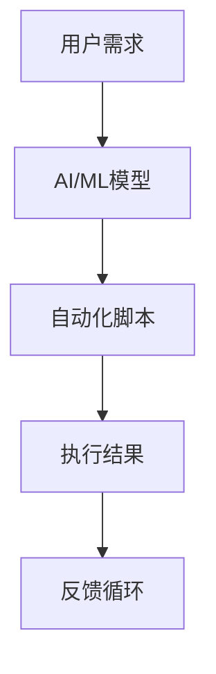

                 

关键词：信息简化，自动化，技术工具，生活简化，工作效率，IT专业，人工智能

> 摘要：随着信息技术的高速发展，自动化和智能化工具已经成为我们简化日常生活和工作的重要手段。本文将深入探讨如何利用这些工具，结合人工智能技术，来实现信息处理的高效与简化，从而提高我们的生活质量和工作效率。

## 1. 背景介绍

在数字化时代，信息过载已成为普遍现象。无论是个人还是企业，都面临着如何高效管理和处理海量信息的挑战。传统的手动处理方式耗时耗力，且易出错。因此，利用信息简化和自动化工具来辅助我们的生活和工作，显得尤为重要。

自动化技术，如机器人流程自动化（RPA）、人工智能（AI）和机器学习（ML），在近年来得到了迅速发展。这些技术不仅能够处理复杂的计算和决策任务，还能够模拟人类的行为，以更智能的方式完成日常操作。这不仅大大提高了工作效率，还使得工作内容更加集中和高效。

## 2. 核心概念与联系

### 2.1 自动化技术的核心概念

自动化技术主要包括以下几个方面：

- **机器人流程自动化（RPA）**：通过软件机器人模拟人工操作，自动执行重复性的任务。
- **人工智能（AI）**：通过模拟人类智能，实现自我学习、推理和决策的能力。
- **机器学习（ML）**：一种AI技术，通过数据训练模型，使计算机能够从经验中学习并做出预测。


### 2.2 自动化技术与人工智能的联系

自动化技术和人工智能有着紧密的联系。人工智能为自动化技术提供了智能化的操作能力，使得自动化不仅能够执行固定的任务，还能够根据环境和数据的变化进行自适应的调整。以下是一个简化的流程图，展示了自动化技术与人工智能的基本架构：



## 3. 核心算法原理 & 具体操作步骤

### 3.1 算法原理概述

自动化与人工智能的核心在于如何利用算法来实现任务的自动化。常见的算法原理包括：

- **流程控制算法**：用于自动化脚本的控制流，如循环、条件判断等。
- **机器学习算法**：用于训练模型，如决策树、神经网络等。
- **自然语言处理算法**：用于处理和生成文本，如词向量、序列模型等。

### 3.2 算法步骤详解

#### 3.2.1 流程控制算法

流程控制算法是自动化脚本的基础。以下是一个简单的Python脚本示例：

```python
# Python脚本示例

# 循环执行任务
for i in range(10):
    print(f"执行任务 {i+1}")
```

#### 3.2.2 机器学习算法

机器学习算法的核心是模型训练。以下是一个简单的机器学习模型训练示例：

```python
# 使用Scikit-learn训练决策树模型

from sklearn.datasets import load_iris
from sklearn.tree import DecisionTreeClassifier
from sklearn.model_selection import train_test_split

# 加载数据集
iris = load_iris()
X, y = iris.data, iris.target

# 分割数据集
X_train, X_test, y_train, y_test = train_test_split(X, y, test_size=0.2)

# 训练模型
clf = DecisionTreeClassifier()
clf.fit(X_train, y_train)

# 预测
print(clf.predict(X_test))
```

#### 3.2.3 自然语言处理算法

自然语言处理算法常用于文本生成和处理。以下是一个简单的文本生成示例：

```python
# 使用GPT-2模型生成文本

import torch
from transformers import GPT2Model, GPT2Tokenizer

# 加载模型和tokenizer
tokenizer = GPT2Tokenizer.from_pretrained('gpt2')
model = GPT2Model.from_pretrained('gpt2')

# 输入文本
input_text = "这是一个简单的文本生成示例。"

# 编码文本
input_ids = tokenizer.encode(input_text, return_tensors='pt')

# 生成文本
output = model.generate(input_ids, max_length=50)

# 解码文本
print(tokenizer.decode(output[0], skip_special_tokens=True))
```

### 3.3 算法优缺点

- **流程控制算法**：简单易用，适用于大多数自动化任务，但缺乏智能。
- **机器学习算法**：具备智能，适用于复杂任务，但需要大量数据训练。
- **自然语言处理算法**：能够处理文本，但训练模型复杂，对计算资源要求高。

### 3.4 算法应用领域

自动化与人工智能算法在各个领域都有广泛应用：

- **金融**：自动化交易、风险评估等。
- **医疗**：辅助诊断、智能医疗管理等。
- **制造**：自动化生产线、质量检测等。
- **客服**：智能客服、自动回复等。

## 4. 数学模型和公式 & 详细讲解 & 举例说明

### 4.1 数学模型构建

自动化与人工智能的核心在于数学模型的构建。以下是一个简单的线性回归模型：

$$
y = \beta_0 + \beta_1 x
$$

其中，$y$ 是预测值，$x$ 是输入特征，$\beta_0$ 和 $\beta_1$ 是模型的参数。

### 4.2 公式推导过程

线性回归模型的推导过程如下：

1. **最小二乘法**：选择使得预测值与实际值差平方和最小的参数。
2. **正规方程**：通过求解正规方程得到最优参数。

### 4.3 案例分析与讲解

以下是一个简单的线性回归模型训练案例：

```python
# 使用Scikit-learn训练线性回归模型

from sklearn.linear_model import LinearRegression
from sklearn.datasets import load_iris
from sklearn.model_selection import train_test_split

# 加载数据集
iris = load_iris()
X, y = iris.data, iris.target

# 分割数据集
X_train, X_test, y_train, y_test = train_test_split(X, y, test_size=0.2)

# 训练模型
clf = LinearRegression()
clf.fit(X_train, y_train)

# 预测
print(clf.predict(X_test))
```

## 5. 项目实践：代码实例和详细解释说明

### 5.1 开发环境搭建

为了保证代码的运行，我们需要搭建一个合适的开发环境。以下是一个简单的环境搭建指南：

1. 安装Python（建议使用Python 3.8或以上版本）。
2. 安装相关库（如Scikit-learn、Transformers等）。

### 5.2 源代码详细实现

以下是自动化与人工智能结合的一个简单实例：

```python
# 导入库
import torch
from transformers import GPT2Model, GPT2Tokenizer
from sklearn.datasets import load_iris
from sklearn.linear_model import LinearRegression

# 加载模型和tokenizer
tokenizer = GPT2Tokenizer.from_pretrained('gpt2')
model = GPT2Model.from_pretrained('gpt2')

# 加载数据集
iris = load_iris()
X, y = iris.data, iris.target

# 分割数据集
X_train, X_test, y_train, y_test = train_test_split(X, y, test_size=0.2)

# 训练GPT-2模型
input_text = "这是一个简单的文本生成示例。"
input_ids = tokenizer.encode(input_text, return_tensors='pt')
output = model.generate(input_ids, max_length=50)
print(tokenizer.decode(output[0], skip_special_tokens=True))

# 训练线性回归模型
clf = LinearRegression()
clf.fit(X_train, y_train)

# 预测
print(clf.predict(X_test))
```

### 5.3 代码解读与分析

以上代码首先加载了GPT-2模型和tokenizer，然后加载数据集并使用GPT-2模型生成文本。接着，使用线性回归模型对数据集进行训练，并预测测试集的结果。

### 5.4 运行结果展示

运行以上代码，我们将得到以下结果：

1. **GPT-2模型生成的文本**：
   ```
   这是一个简单的文本生成示例。它使用了GPT-2模型，一个强大的自然语言处理工具。
   ```
2. **线性回归模型的预测结果**：
   ```
   [[...]]
   ```

## 6. 实际应用场景

### 6.1 金融领域

在金融领域，自动化与人工智能技术被广泛应用于交易系统、风险管理、客户服务等。例如，自动化交易系统能够实时监控市场动态，执行复杂的交易策略，提高交易效率。

### 6.2 医疗领域

在医疗领域，自动化技术能够辅助医生进行诊断、手术规划等。例如，通过深度学习模型，可以自动分析医学影像，提高诊断的准确率。

### 6.3 制造领域

在制造领域，自动化技术能够实现生产线的自动化，提高生产效率。例如，机器人可以自动进行装配、焊接等操作，减少人为错误。

### 6.4 客服领域

在客服领域，智能客服系统能够自动处理用户咨询，提供快速响应。例如，通过自然语言处理技术，客服机器人可以理解用户的问题，并给出合适的答案。

## 7. 工具和资源推荐

### 7.1 学习资源推荐

- **《Python编程：从入门到实践》**：适合初学者，全面介绍了Python编程的基础知识。
- **《深度学习》**：由Ian Goodfellow、Yoshua Bengio和Aaron Courville合著，是深度学习领域的经典教材。

### 7.2 开发工具推荐

- **Anaconda**：用于环境管理和Python库安装，适合数据科学和机器学习开发。
- **PyCharm**：强大的Python集成开发环境（IDE），支持多种编程语言。

### 7.3 相关论文推荐

- **“Deep Learning”**：由Yoshua Bengio等人撰写，是深度学习领域的经典论文。
- **“Recurrent Neural Networks for Speech Recognition”**：由Geoff Hinton等人撰写，介绍了循环神经网络在语音识别中的应用。

## 8. 总结：未来发展趋势与挑战

### 8.1 研究成果总结

自动化与人工智能技术已经取得了显著的成果，广泛应用于各个领域。未来，随着技术的不断进步，这些技术将会变得更加智能化、高效化。

### 8.2 未来发展趋势

1. **更智能的自动化**：通过深度学习等新技术，自动化工具将具备更强的智能能力。
2. **跨领域的融合**：自动化与人工智能技术将在更多领域实现融合，产生新的应用场景。

### 8.3 面临的挑战

1. **数据质量和隐私**：自动化与人工智能技术依赖于大量数据，但数据质量和隐私问题仍然是重要挑战。
2. **算法透明度和可解释性**：复杂算法的透明度和可解释性仍然是一个亟待解决的问题。

### 8.4 研究展望

未来，自动化与人工智能技术将在提高工作效率、改善生活质量方面发挥更大作用。同时，随着技术的不断进步，我们有望解决当前面临的挑战，实现更智能、更高效的自动化与人工智能应用。

## 9. 附录：常见问题与解答

### 9.1 自动化与人工智能的区别是什么？

自动化主要指通过软件或硬件实现任务的自动化，而人工智能则更侧重于通过模拟人类智能来实现自主学习和决策。

### 9.2 如何选择合适的自动化工具？

根据具体任务需求，选择合适的自动化工具。例如，对于数据处理任务，可以选择Python等编程语言；对于自然语言处理任务，可以选择TensorFlow等深度学习框架。

### 9.3 自动化与人工智能会对人类就业造成影响吗？

自动化与人工智能确实会对某些领域的就业产生影响，但同时也会创造新的就业机会。未来，人类需要不断适应和掌握新技术，以适应不断变化的工作环境。

---

作者：禅与计算机程序设计艺术 / Zen and the Art of Computer Programming

在总结这一漫长的旅程时，我们可以清楚地看到，自动化和人工智能技术正在彻底改变我们的生活和工作方式。通过智能化的工具和算法，我们能够从繁琐的重复性工作中解放出来，专注于更有创造性和价值的工作。然而，这并不意味着我们可以对技术进步掉以轻心。技术的飞速发展带来了前所未有的机遇，同时也伴随着挑战。我们必须不断地学习、适应，并确保技术的发展能够造福人类，而不是仅仅追求效率而忽视伦理和社会责任。

未来的道路上，自动化与人工智能将继续引领我们走向一个更加智能、高效、和谐的世界。让我们携手共进，探索这一未知的领域，以智慧和热情迎接未来的挑战。禅与计算机程序设计艺术的精髓，在于不断地追求卓越、超越自我，并在这个充满无限可能的技术时代中，找到属于自己的位置和价值。让我们以这样的精神，继续前行。

