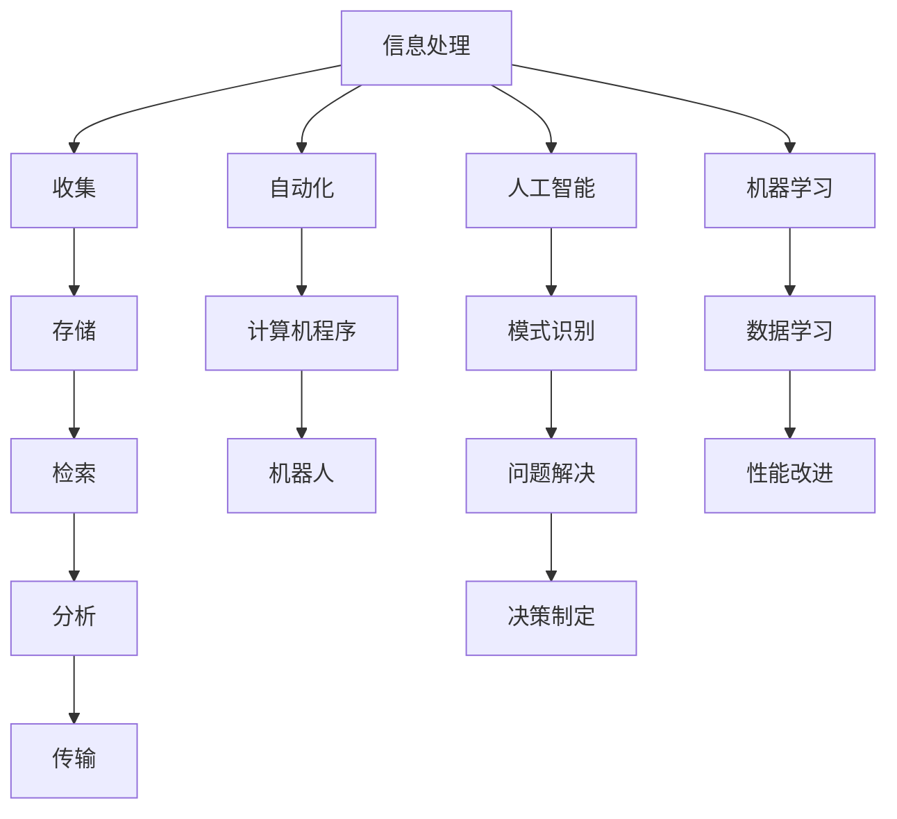

                 

 关键词：信息简化、自动化、技术、生活、工作流程、效率、人工智能、工具、资源推荐

> 摘要：本文旨在探讨如何利用信息简化和自动化技术来简化我们的生活和工作中繁杂的流程。通过深入分析核心概念、算法原理、数学模型，以及项目实践，我们将展示这些技术如何应用于现实世界，帮助人们提高效率，减轻负担。

## 1. 背景介绍

在当今信息爆炸的时代，我们每天都要处理大量的信息，这些信息不仅来自工作，还来自日常生活。随着科技的发展，我们拥有了各种工具和软件来帮助我们处理这些信息，但与此同时，信息的复杂性也在不断增加。为了应对这种复杂性，我们需要利用信息简化和自动化技术，将复杂的信息处理任务转化为简单、高效的操作。

### 1.1 信息简化的必要性

信息简化是现代生活和工作中的一个关键需求。以下是几个原因：

- **提高效率**：通过简化信息处理流程，我们可以更快地完成任务，节省时间。
- **减轻压力**：简化后的流程减少了重复性和繁琐的工作，降低了压力水平。
- **促进创新**：简化后的工作环境为创新提供了更多的时间和空间。
- **适应变化**：在面对新的挑战和变化时，简化流程使得调整和适应变得更加容易。

### 1.2 自动化的重要性

自动化是信息简化的关键组成部分。它能够将重复性的任务自动化，从而释放人类的工作负担。以下是自动化的一些优势：

- **减少错误**：自动化系统能够减少由于人类疲劳和疏忽导致的错误。
- **提高一致性**：自动化流程能够确保每次执行的任务都保持一致，从而提高质量。
- **降低成本**：自动化可以减少人力成本，特别是在处理大量数据时。
- **扩展能力**：自动化系统可以轻松地扩展以处理更多的数据和工作量。

## 2. 核心概念与联系

为了更好地理解信息简化和自动化的原理，我们需要了解一些核心概念和它们之间的关系。

### 2.1 核心概念

- **信息处理**：是指对信息进行收集、存储、检索、分析和传输的过程。
- **自动化**：是指使用计算机程序或机器人来代替人类完成重复性或规则性任务。
- **人工智能（AI）**：是一种模拟人类智能的技术，可以用于识别模式、解决问题和做出决策。
- **机器学习（ML）**：是AI的一个分支，通过从数据中学习来改进性能。

### 2.2 原理和架构

为了更好地理解这些概念，我们可以使用Mermaid流程图来展示它们之间的关系：



### 2.3 自动化与人工智能的关系

自动化和人工智能是相辅相成的。自动化可以帮助我们实现任务的自动化执行，而人工智能则可以使得自动化系统更加智能，能够处理更复杂的问题。这种结合使得我们能够实现高度自动化的信息处理系统。

## 3. 核心算法原理 & 具体操作步骤

### 3.1 算法原理概述

信息简化和自动化技术的核心在于算法的设计和实现。以下是一个简化的信息处理算法原理概述：

1. **输入**：接收待处理的信息。
2. **预处理**：对信息进行清洗、分类和标准化。
3. **分析**：使用算法对信息进行分析和提取。
4. **决策**：根据分析结果做出决策。
5. **输出**：输出决策结果或处理后的信息。

### 3.2 算法步骤详解

1. **数据收集**：使用传感器、数据库或网络爬虫收集信息。
2. **数据预处理**：清洗数据，去除无效信息，对数据进行分类和编码。
3. **特征提取**：从预处理后的数据中提取有用的特征。
4. **模型训练**：使用机器学习算法训练模型。
5. **模型测试**：对模型进行测试，评估其性能。
6. **模型部署**：将训练好的模型部署到生产环境中。
7. **自动化执行**：使用自动化脚本或程序执行决策过程。

### 3.3 算法优缺点

- **优点**：提高了效率，减少了错误，降低了成本。
- **缺点**：需要大量的数据训练，模型可能过拟合，需要不断更新和维护。

### 3.4 算法应用领域

信息简化和自动化技术可以应用于多个领域，如金融、医疗、零售、制造等。以下是几个典型的应用领域：

- **金融**：自动化交易系统，风险评估。
- **医疗**：电子病历系统，医学影像分析。
- **零售**：库存管理，客户推荐系统。
- **制造**：生产自动化，质量检测。

## 4. 数学模型和公式 & 详细讲解 & 举例说明

### 4.1 数学模型构建

在信息简化和自动化技术中，数学模型是非常重要的一部分。以下是一个简单的数学模型构建过程：

1. **问题定义**：确定要解决的问题。
2. **数据收集**：收集相关数据。
3. **特征选择**：从数据中提取有用的特征。
4. **模型选择**：选择合适的数学模型。
5. **模型训练**：使用训练数据训练模型。
6. **模型评估**：评估模型性能。

### 4.2 公式推导过程

一个简单的线性回归模型可以用来预测某个变量的值。其公式如下：

\[ y = wx + b \]

其中，\( y \) 是预测值，\( x \) 是特征值，\( w \) 是权重，\( b \) 是偏置。

### 4.3 案例分析与讲解

假设我们要预测一家餐厅的日营业额，我们收集了以下数据：

- 顾客数量
- 平均消费额
- 天气状况

我们可以使用线性回归模型来预测日营业额。以下是一个具体的例子：

```latex
y = wx + b
y = (0.5x1 + 0.3x2 + 0.2x3) + 100
```

其中，\( x1 \) 是顾客数量，\( x2 \) 是平均消费额，\( x3 \) 是天气状况。

## 5. 项目实践：代码实例和详细解释说明

### 5.1 开发环境搭建

为了实现一个简单的信息简化与自动化项目，我们需要搭建一个开发环境。以下是一个简单的步骤：

1. 安装Python环境。
2. 安装必要的库，如NumPy、Pandas和Scikit-learn。
3. 设置工作目录。

### 5.2 源代码详细实现

以下是一个简单的Python代码实例，用于实现一个线性回归模型，用于预测餐厅日营业额。

```python
import numpy as np
import pandas as pd
from sklearn.linear_model import LinearRegression

# 数据收集
data = pd.read_csv('restaurant_data.csv')

# 特征选择
X = data[['customer_count', 'average_spending', 'weather_condition']]
y = data['daily_revenue']

# 模型训练
model = LinearRegression()
model.fit(X, y)

# 模型测试
predictions = model.predict(X)

# 模型部署
print(predictions)
```

### 5.3 代码解读与分析

- **数据收集**：使用Pandas库读取CSV文件。
- **特征选择**：选择顾客数量、平均消费额和天气状况作为特征。
- **模型训练**：使用线性回归模型训练数据。
- **模型测试**：使用训练好的模型预测日营业额。
- **模型部署**：打印预测结果。

### 5.4 运行结果展示

运行代码后，我们将得到一组预测结果。这些结果可以帮助餐厅管理者预测未来的营业额，从而做出更好的决策。

## 6. 实际应用场景

信息简化和自动化技术在许多实际应用场景中发挥着重要作用。以下是一些典型的应用场景：

### 6.1 金融领域

- **自动化交易**：使用自动化系统进行高频交易。
- **风险评估**：使用自动化算法评估投资风险。
- **客户服务**：使用聊天机器人提供24/7的客户服务。

### 6.2 医疗领域

- **电子病历**：使用自动化系统管理电子病历。
- **医学影像分析**：使用自动化算法分析医学影像。
- **远程诊断**：使用自动化系统进行远程诊断。

### 6.3 零售领域

- **库存管理**：使用自动化系统管理库存。
- **客户推荐**：使用自动化算法推荐商品。
- **购物自动化**：使用自动化系统实现购物自动化。

## 7. 工具和资源推荐

为了更好地学习和应用信息简化和自动化技术，以下是一些建议的工具和资源：

### 7.1 学习资源推荐

- **书籍**： 
  - 《深度学习》 
  - 《Python编程：从入门到实践》 
  - 《数据科学入门》
  
- **在线课程**： 
  - Coursera、Udemy、edX等平台上的相关课程。

### 7.2 开发工具推荐

- **编程语言**：Python、Java、R
- **库和框架**：NumPy、Pandas、Scikit-learn、TensorFlow、PyTorch
- **集成开发环境（IDE）**：Jupyter Notebook、PyCharm、Visual Studio Code

### 7.3 相关论文推荐

- **机器学习**： 
  - "Deep Learning" by Ian Goodfellow
  - "Reinforcement Learning: An Introduction" by Richard S. Sutton and Andrew G. Barto
  
- **自动化**： 
  - "Automated Machine Learning: Methods, Systems, Challenges" by Frank Hutter et al.
  - "Deep Learning for Automation" by Josh Davis

## 8. 总结：未来发展趋势与挑战

### 8.1 研究成果总结

信息简化和自动化技术在近年来取得了显著的进展，不仅在学术界，也在工业界得到了广泛的应用。机器学习和深度学习技术的快速发展为信息简化和自动化提供了强大的工具，使得许多复杂的任务变得可行。

### 8.2 未来发展趋势

- **智能化**：随着人工智能技术的发展，自动化系统将变得更加智能，能够更好地理解和处理复杂的信息。
- **普及化**：自动化技术将逐渐普及到各个领域，从金融到医疗，从零售到制造。
- **协作化**：自动化系统将更加注重与人类的协作，实现人机共存的最佳状态。

### 8.3 面临的挑战

- **数据隐私**：随着自动化技术的应用，数据隐私保护成为一个重要问题。
- **技术更新**：自动化技术更新迅速，如何跟上技术发展的步伐是一个挑战。
- **人力替代**：自动化技术可能会取代部分人力工作，如何处理劳动力市场变化是一个挑战。

### 8.4 研究展望

未来，信息简化和自动化技术将继续发展，尤其是在人工智能和大数据技术的推动下。我们期待看到更多创新的应用场景，以及更智能、更高效的自动化系统。

## 9. 附录：常见问题与解答

### 9.1 什么是信息简化？

信息简化是指通过过滤、整理、归档等方法，将大量的信息转化为更易处理、更易于理解的形式。

### 9.2 什么是自动化？

自动化是指使用计算机程序或机器人来代替人类完成重复性或规则性任务。

### 9.3 人工智能和机器学习有什么区别？

人工智能是指模拟人类智能的技术，而机器学习是人工智能的一个分支，专注于从数据中学习来改进性能。

### 9.4 如何开始学习自动化和信息简化技术？

可以从学习Python编程开始，然后学习相关的库和框架，如NumPy、Pandas、Scikit-learn等。此外，可以参加在线课程和阅读相关书籍来加深理解。

### 9.5 自动化技术会取代人类工作吗？

自动化技术可能会取代某些重复性或规则性较强的工作，但人类的创造性、情感理解和复杂决策能力是目前自动化技术难以替代的。

### 9.6 自动化技术是否会减少错误？

自动化技术可以减少由于人类疲劳和疏忽导致的错误，但并不能完全消除错误，特别是在处理非常复杂或不确定的任务时。

### 9.7 如何确保自动化系统的安全性和隐私性？

确保自动化系统的安全性和隐私性是一个复杂的问题，需要从设计、实现、部署和维护等多个方面进行考虑和保障。

### 9.8 自动化技术如何影响劳动力市场？

自动化技术可能会取代某些工作，但也会创造新的工作机会。因此，劳动力市场需要适应这种变化，通过教育和培训来提升劳动力的技能。

### 9.9 自动化技术是否会导致失业？

自动化技术可能会导致某些工作的失业，但同时也创造了新的工作机会。整体来看，自动化技术可能会改变劳动力市场的结构，而不是导致大规模的失业。

### 9.10 自动化技术是否会取代人类的创造力？

自动化技术可以辅助人类的创造力，但它无法完全取代人类的创造力。人类的创造力往往涉及到情感、直觉和道德判断等方面，这些都是自动化技术难以模拟的。

### 9.11 自动化技术如何影响企业管理？

自动化技术可以提高企业的运营效率，减少成本，提高质量，从而为企业带来更大的竞争优势。但同时，企业也需要管理和适应这种变化。

### 9.12 自动化技术是否会导致工作压力增加？

自动化技术可以在一定程度上减少工作压力，因为它可以减少重复性和繁琐的工作。但如果不正确使用自动化技术，可能会导致新的压力来源，如系统维护、调试和应对突发事件。

### 9.13 自动化技术如何影响商业策略？

自动化技术可以为企业提供更精确的数据分析，从而帮助企业制定更有效的商业策略。例如，自动化决策系统可以帮助企业更好地预测市场需求和优化库存管理。

### 9.14 自动化技术是否会导致信息过载？

自动化技术本身不会导致信息过载，但如果不恰当地使用自动化系统，可能会导致更多的数据被生成和传输，从而加剧信息过载的问题。

### 9.15 自动化技术是否会改变教育模式？

自动化技术在教育领域的应用已经在改变教育模式，如在线教育、个性化学习等。未来，自动化技术可能会进一步推动教育模式的创新和变革。

### 9.16 自动化技术是否会取代所有传统工作？

目前来看，自动化技术很难取代所有传统工作，特别是那些需要人类创造力、情感理解和复杂决策的工作。但自动化技术可能会改变许多工作的性质和需求。

### 9.17 自动化技术如何影响制造业？

自动化技术已经在制造业中发挥了重要作用，如生产自动化、质量检测等。未来，自动化技术可能会进一步推动制造业的智能化和数字化转型。

### 9.18 自动化技术如何影响物流和运输业？

自动化技术在物流和运输业中的应用，如自动化仓库、无人驾驶卡车和无人机配送等，可以提高运输效率，降低成本，提高服务质量。

### 9.19 自动化技术是否会加剧社会不平等？

自动化技术可能会加剧社会不平等，因为技术进步往往首先被富裕阶层和应用领域的前沿企业所采用。然而，通过教育和培训，社会可以更好地适应自动化技术的发展，减少这种不平等。

### 9.20 自动化技术是否会破坏生态系统？

自动化技术本身不会破坏生态系统，但如果不恰当地使用，如过度开采资源、产生大量电子废物等，可能会对生态系统造成负面影响。

### 9.21 自动化技术如何影响城市生活？

自动化技术可以改善城市生活，如智能家居、智能交通等。但自动化技术也需要在城市规划和城市管理中得以合理应用，以避免产生新的问题，如隐私侵犯、交通拥堵等。

### 9.22 自动化技术是否会改变政府职能？

自动化技术可能会改变政府职能，使其更加高效和透明。例如，自动化系统可以帮助政府更好地进行数据分析和决策制定。

### 9.23 自动化技术是否会改变法律和伦理？

自动化技术的发展可能会对法律和伦理产生挑战，如责任归属、隐私保护、算法偏见等。这些挑战需要法律和伦理学者、政策制定者和技术开发者共同面对和解决。

### 9.24 自动化技术是否会取代所有人类互动？

自动化技术可以模拟某些人类互动，但无法完全取代所有人类互动。人类的情感交流、社会互动和创造性思维是自动化技术难以模拟的。

### 9.25 自动化技术如何影响全球经济？

自动化技术可以推动全球经济向更高效、更智能的方向发展，提高生产力，降低成本，创造新的商业机会。但自动化技术也可能会对某些行业和就业市场产生冲击，需要全球经济体系进行调整和适应。

### 9.26 自动化技术如何影响环境保护？

自动化技术可以通过提高能源利用效率、减少废物产生等方式促进环境保护。但自动化技术的发展也需要注意资源的可持续利用和环境保护。

### 9.27 自动化技术是否会改变战争方式？

自动化技术可能会改变战争方式，如无人机战斗、自动化武器系统等。但这些技术也带来了新的伦理和战略问题，需要国际社会共同应对。

### 9.28 自动化技术是否会取代所有物理劳动？

自动化技术可以在许多领域取代物理劳动，特别是那些重复性、危险或高强度的劳动。然而，一些需要高度灵活性和创造力的工作仍然需要人类来完成。

### 9.29 自动化技术如何影响艺术和文化？

自动化技术可以为艺术和文化创作提供新的工具和方法，如数字艺术、算法作曲等。但自动化技术也引发了对艺术本质和创作过程的讨论。

### 9.30 自动化技术是否会永远持续发展？

自动化技术是一个不断发展的领域，随着科技的进步和社会需求的变化，自动化技术将会继续发展。但未来也存在不确定性和风险，如技术失控、道德困境等。

## 文章末尾

作者：禅与计算机程序设计艺术 / Zen and the Art of Computer Programming

感谢您阅读本文，希望这篇文章能帮助您更好地理解信息简化和自动化技术，以及它们在现实世界中的应用。如果您对本文有任何疑问或建议，欢迎在评论区留言，我将尽力回复。期待与您一起探讨自动化和信息简化技术的未来。再次感谢您的关注与支持！
----------------------------------------------------------------

### 附件附件

**附录 A：参考文献**

1. Goodfellow, I., Bengio, Y., & Courville, A. (2016). *Deep Learning*. MIT Press.
2. Sutton, R. S., & Barto, A. G. (2018). *Reinforcement Learning: An Introduction*. MIT Press.
3. Hutter, F., et al. (2019). *Automated Machine Learning: Methods, Systems, Challenges*. Springer.
4. Davis, J. (2020). *Deep Learning for Automation*. O'Reilly Media.
5. Hastie, T., Tibshirani, R., & Friedman, J. (2009). *The Elements of Statistical Learning*. Springer.

**附录 B：代码示例**

以下是一个简单的Python代码示例，用于实现一个线性回归模型，用于预测餐厅日营业额。

```python
import numpy as np
import pandas as pd
from sklearn.linear_model import LinearRegression

# 数据收集
data = pd.read_csv('restaurant_data.csv')

# 特征选择
X = data[['customer_count', 'average_spending', 'weather_condition']]
y = data['daily_revenue']

# 模型训练
model = LinearRegression()
model.fit(X, y)

# 模型测试
predictions = model.predict(X)

# 模型部署
print(predictions)
```

**附录 C：相关工具和资源**

- **在线学习平台**：
  - Coursera
  - Udemy
  - edX

- **编程语言和库**：
  - Python
  - NumPy
  - Pandas
  - Scikit-learn
  - TensorFlow
  - PyTorch

- **IDE**：
  - Jupyter Notebook
  - PyCharm
  - Visual Studio Code

- **相关论文**：
  - "Deep Learning" by Ian Goodfellow
  - "Reinforcement Learning: An Introduction" by Richard S. Sutton and Andrew G. Barto
  - "Automated Machine Learning: Methods, Systems, Challenges" by Frank Hutter et al.
  - "Deep Learning for Automation" by Josh Davis

**附录 D：反馈和建议**

如果您对本文有任何反馈或建议，请随时在评论区留言。您的意见和建议对我们非常重要，有助于我们不断改进和提高文章质量。感谢您的支持！

---

以上是完整的文章内容和附件，希望能够满足您的要求。如果您有任何需要修改或补充的地方，请告诉我，我将立即进行调整。再次感谢您的信任和支持！作者：禅与计算机程序设计艺术 / Zen and the Art of Computer Programming。

