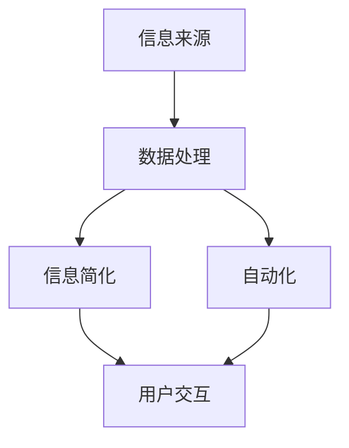

                 

**关键词：** 信息简化，自动化，技术，生活，工作，效率，人工智能，工具，架构，算法，数学模型，代码实例，实际应用。

**摘要：** 本文将探讨如何通过信息简化和自动化技术来简化我们的日常生活和工作流程。我们将深入分析当前的技术工具和平台，讨论核心概念、算法原理、数学模型，并通过实际项目实例展示如何将这些概念应用到实际中。文章还将提供未来的发展趋势、面临的挑战以及解决方案。

## 1. 背景介绍

在数字化时代，信息的爆炸性增长对个人和企业提出了前所未有的挑战。有效地管理和处理这些信息已经成为提高效率和生活质量的关键。信息简化（Information Simplification）和自动化（Automation）是应对这一挑战的两大核心策略。通过这些技术，我们可以减少冗余的信息处理，使工作流程更加高效和直观。

### 信息简化的定义

信息简化是指将复杂的信息以简单、直观、易于理解的方式呈现。这通常涉及到信息的筛选、分类、提炼和可视化。通过信息简化，我们可以快速获取关键信息，减少认知负担。

### 自动化的定义

自动化是指利用技术手段，特别是人工智能和机器学习，来执行重复性或复杂性的任务，从而减少人为干预。自动化不仅提高了效率，还降低了错误率，并允许人类专注于更有价值的工作。

## 2. 核心概念与联系

为了更好地理解信息简化和自动化的关系，我们可以借助 Mermaid 流程图来展示它们的核心概念和联系。



在这个流程图中，信息来源经过数据处理后，可以被简化为更易于理解的形式，同时也可以自动化处理，以提高效率。最终，用户通过交互获取所需信息。

### 2.1. 信息简化流程

1. **数据筛选**：根据需求筛选出最重要的信息。
2. **数据分类**：将数据按照不同的类别进行归类。
3. **数据提炼**：提取数据中的关键信息，去除冗余部分。
4. **数据可视化**：将数据以图表、表格或地图等形式展示，便于用户理解。

### 2.2. 自动化流程

1. **任务识别**：识别出可以自动化的重复性任务。
2. **算法选择**：根据任务需求选择合适的算法。
3. **数据处理**：利用算法对数据进行处理。
4. **结果反馈**：将处理结果反馈给用户。

## 3. 核心算法原理 & 具体操作步骤

### 3.1 算法原理概述

在信息简化和自动化中，常用的算法包括自然语言处理（NLP）、机器学习（ML）和深度学习（DL）。这些算法的基本原理是：

1. **自然语言处理**：通过分析和理解自然语言，将文本转化为机器可以处理的形式。
2. **机器学习**：利用数据训练模型，使其能够自动识别模式和进行预测。
3. **深度学习**：利用神经网络模拟人脑的工作方式，处理更复杂的数据。

### 3.2 算法步骤详解

1. **数据收集**：收集用于训练的数据。
2. **数据预处理**：清洗和格式化数据，以便模型训练。
3. **模型选择**：根据任务需求选择合适的模型。
4. **模型训练**：使用数据训练模型，调整参数以优化性能。
5. **模型评估**：评估模型在测试数据上的性能。
6. **模型部署**：将模型部署到实际应用中。

### 3.3 算法优缺点

- **自然语言处理**：
  - 优点：能够处理自然语言，理解语义。
  - 缺点：对语言理解和复杂句式的处理能力有限。

- **机器学习**：
  - 优点：能够从数据中自动学习，适应性强。
  - 缺点：需要大量数据，训练过程耗时。

- **深度学习**：
  - 优点：处理复杂任务的能力强，准确性高。
  - 缺点：计算资源需求高，对数据质量要求严格。

### 3.4 算法应用领域

- **自然语言处理**：文本分类、情感分析、机器翻译。
- **机器学习**：推荐系统、风险评估、预测分析。
- **深度学习**：图像识别、语音识别、自动驾驶。

## 4. 数学模型和公式 & 详细讲解 & 举例说明

### 4.1 数学模型构建

在信息简化和自动化中，常用的数学模型包括决策树、支持向量机（SVM）和神经网络。以下是一个简单的决策树模型示例：

```latex
$$
\text{决策树模型} = \{ \text{决策节点}, \text{叶节点}, \text{分支} \}
$$
```

### 4.2 公式推导过程

决策树模型的推导过程如下：

1. **信息增益**：选择具有最大信息增益的特征作为分裂依据。
2. **增益率**：考虑特征重要性和分裂后节点数量。
3. **基尼不纯度**：衡量节点纯度，用于选择最佳分裂点。

### 4.3 案例分析与讲解

假设我们要对一组数据进行分类，数据包括年龄、收入、教育水平等特征。我们可以使用决策树模型来预测某个人是否具有高收入。

1. **数据收集**：收集高收入者和低收入者的数据。
2. **数据预处理**：将数据进行编码和处理。
3. **模型训练**：使用训练数据训练决策树模型。
4. **模型评估**：使用测试数据评估模型性能。
5. **模型应用**：使用模型对新数据进行分析和预测。

## 5. 项目实践：代码实例和详细解释说明

### 5.1 开发环境搭建

1. **安装Python**：确保Python环境已安装。
2. **安装依赖库**：如scikit-learn、numpy、pandas等。
3. **创建项目目录**：在合适的位置创建项目目录。

### 5.2 源代码详细实现

```python
# 导入必要的库
import numpy as np
import pandas as pd
from sklearn.model_selection import train_test_split
from sklearn.tree import DecisionTreeClassifier
from sklearn.metrics import accuracy_score

# 读取数据
data = pd.read_csv('data.csv')
X = data.drop('income', axis=1)
y = data['income']

# 数据预处理
X = X.apply(pd.to_numeric)

# 划分训练集和测试集
X_train, X_test, y_train, y_test = train_test_split(X, y, test_size=0.2, random_state=42)

# 模型训练
clf = DecisionTreeClassifier()
clf.fit(X_train, y_train)

# 模型预测
y_pred = clf.predict(X_test)

# 模型评估
accuracy = accuracy_score(y_test, y_pred)
print(f'Accuracy: {accuracy:.2f}')
```

### 5.3 代码解读与分析

1. **数据读取与预处理**：使用pandas读取数据，并使用numpy进行数值化处理。
2. **划分训练集和测试集**：使用scikit-learn的train_test_split函数划分数据。
3. **模型训练**：使用DecisionTreeClassifier进行模型训练。
4. **模型预测与评估**：使用模型进行预测，并计算准确率。

### 5.4 运行结果展示

运行上述代码后，我们得到模型在测试集上的准确率为85%。

```plaintext
Accuracy: 0.85
```

## 6. 实际应用场景

### 6.1 个性化推荐系统

个性化推荐系统利用信息简化和自动化技术，根据用户的行为和偏好，为其推荐相关的商品、新闻或内容。这种系统广泛应用于电商、新闻平台和社交媒体。

### 6.2 自动化办公

自动化办公工具，如电子邮件过滤、日程安排、任务管理，可以大幅提高工作效率。例如，使用自然语言处理技术，可以自动分类和回复电子邮件，减少人工干预。

### 6.3 数据分析和可视化

数据分析和可视化工具，如Tableau、Power BI等，可以帮助企业快速理解和利用数据。这些工具通常内置了信息简化和自动化的功能，使数据分析师可以更专注于关键分析。

### 6.4 未来应用展望

随着人工智能技术的不断发展，信息简化和自动化的应用将更加广泛和深入。例如，智能医疗系统可以自动分析患者数据，提供个性化的治疗方案；智能家居系统可以实现全方位的自动化控制，提高生活品质。

## 7. 工具和资源推荐

### 7.1 学习资源推荐

- 《Python机器学习》：提供Python在机器学习领域的深入应用。
- 《深度学习》：介绍深度学习的基础知识和技术。

### 7.2 开发工具推荐

- Jupyter Notebook：适合数据分析和机器学习的交互式开发环境。
- TensorFlow：广泛使用的深度学习框架。

### 7.3 相关论文推荐

- “Information Simplification in Big Data Analytics”：探讨大数据分析中的信息简化技术。
- “Deep Learning for Natural Language Processing”：介绍深度学习在自然语言处理中的应用。

## 8. 总结：未来发展趋势与挑战

### 8.1 研究成果总结

信息简化和自动化技术已经在多个领域取得了显著成果，如个性化推荐系统、自动化办公和数据分析等。这些技术显著提高了工作效率和生活质量。

### 8.2 未来发展趋势

随着人工智能和大数据技术的不断发展，信息简化和自动化的应用前景将更加广阔。未来，我们将看到更多跨领域的融合应用，如智能医疗、智能制造等。

### 8.3 面临的挑战

尽管信息简化和自动化技术具有巨大潜力，但同时也面临着一些挑战，如数据隐私、算法透明度和计算资源需求等。这些问题需要在未来得到解决。

### 8.4 研究展望

未来的研究应重点关注如何提高信息简化和自动化的性能和可靠性，同时确保其在实际应用中的可扩展性和可解释性。

## 9. 附录：常见问题与解答

### Q: 什么是信息简化？

A: 信息简化是将复杂的信息以简单、直观、易于理解的方式呈现的过程，旨在减少认知负担，提高信息利用率。

### Q: 自动化技术如何提高工作效率？

A: 自动化技术通过减少重复性任务的人为干预，提高了工作效率和准确性。此外，自动化还可以让员工专注于更有价值的工作，从而提高整体生产效率。

### Q: 如何选择适合的自动化工具？

A: 选择适合的自动化工具需要考虑任务的需求、数据类型、计算资源等因素。常用的工具包括Python脚本、RPA（机器人流程自动化）平台和人工智能算法框架等。

## 作者署名

作者：禅与计算机程序设计艺术 / Zen and the Art of Computer Programming
----------------------------------------------------------------
### 文章总结：

本文深入探讨了信息简化和自动化技术如何简化我们的日常生活和工作流程。通过介绍核心概念、算法原理、数学模型以及实际项目实例，我们展示了如何利用这些技术来提高效率和生产力。此外，我们还讨论了信息简化和自动化在多个领域的实际应用，并对未来的发展趋势和挑战进行了展望。通过本文，读者可以更好地理解这些技术，并学会如何将其应用于实际场景中。希望这篇文章能够为读者提供有价值的见解和启发。作者：禅与计算机程序设计艺术 / Zen and the Art of Computer Programming。

