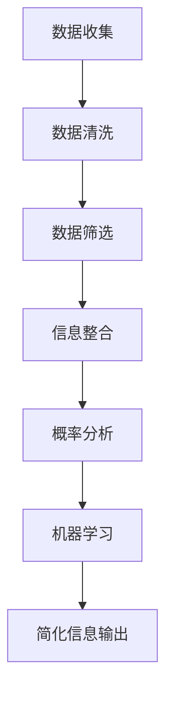

                 

 

> 关键词：信息简化、混乱管理、系统设计、算法优化、数学模型、代码实践、应用场景、未来展望

> 摘要：本文旨在探讨信息简化的技巧和窍门，帮助读者在复杂的信息环境中找到秩序。通过结合实际案例和专业技术知识，我们将深入分析信息简化的核心概念、算法原理、数学模型以及其在各个领域的应用，最终展望未来的发展趋势与挑战。

## 1. 背景介绍

在当今信息爆炸的时代，数据量呈指数级增长，各类信息充斥在我们的工作和生活中。面对如此庞大而复杂的信息，如何有效地管理和利用这些信息成为了一个亟待解决的问题。信息简化作为一种应对策略，旨在从海量数据中提取有价值的信息，并将其以简洁、直观的形式呈现，以便用户能够快速理解和利用。

### 1.1 问题的提出

随着互联网和移动设备的普及，人们获取信息的渠道越来越多，但同时也面临着信息过载的问题。研究表明，平均每人每天会接收到约10000条信息，而人们实际处理的信息量却非常有限。如何从这些庞杂的信息中筛选出对个人或组织有价值的内容，成为了一个亟待解决的挑战。

### 1.2 信息简化的必要性

信息简化不仅能够提高工作效率，还能减轻心理压力。通过简化信息，我们可以将复杂问题分解为简单的组成部分，从而更容易找到解决方案。此外，简洁的信息表达方式有助于提高沟通的效率，减少误解和歧义。

### 1.3 研究目的

本文旨在探讨信息简化的理论和方法，结合实际案例和专业技术知识，为读者提供一套实用的信息简化策略。通过本文的阅读，读者将了解到信息简化的基本原理、算法应用、数学模型以及实际操作步骤，从而能够在实际工作中更好地应对信息过载的问题。

## 2. 核心概念与联系

在深入探讨信息简化的具体方法之前，我们需要了解一些核心概念和它们之间的联系。

### 2.1 信息简化

信息简化是指通过对大量信息的筛选、提炼和整合，将复杂的信息转化为简洁、易于理解的形式。

### 2.2 数据筛选

数据筛选是信息简化的第一步，通过运用各种算法和技术，从原始数据中提取出对用户有价值的信息。

### 2.3 信息整合

信息整合是将筛选出的信息进行合并、整理，形成一个有机的整体，以便用户能够快速获取所需信息。

### 2.4 概率模型

概率模型是信息简化中常用的一种数学模型，通过分析数据之间的概率关系，预测未来可能发生的事件。

### 2.5 机器学习算法

机器学习算法在信息简化中扮演着重要角色，它们通过学习大量数据，自动提取特征和规律，从而实现对信息的自动筛选和简化。

### 2.6 Mermaid 流程图

下面是一个描述信息简化流程的 Mermaid 流程图：



## 3. 核心算法原理 & 具体操作步骤

### 3.1 算法原理概述

信息简化的核心算法主要包括数据筛选、信息整合和概率模型等。这些算法通过不同的方式，实现对信息的筛选、整合和分析，从而简化复杂的信息。

### 3.2 算法步骤详解

#### 3.2.1 数据筛选

数据筛选是信息简化的第一步，其主要目标是去除无用信息，保留对用户有价值的数据。具体步骤如下：

1. 数据预处理：对原始数据进行清洗，去除重复、错误和缺失的数据。
2. 特征提取：从原始数据中提取出对用户有价值的信息，如关键词、主题等。
3. 评估指标：设定评估指标，如信息熵、信息增益等，用于评估筛选效果。

#### 3.2.2 信息整合

信息整合是将筛选出的信息进行合并、整理，形成一个有机的整体。具体步骤如下：

1. 数据归类：根据用户需求，将筛选出的信息进行分类。
2. 关联分析：分析数据之间的关联性，以便更好地理解信息。
3. 信息融合：将归类后的信息进行融合，形成一个完整的信息视图。

#### 3.2.3 概率模型

概率模型用于分析数据之间的概率关系，预测未来可能发生的事件。具体步骤如下：

1. 数据分析：对历史数据进行分析，提取出数据之间的概率关系。
2. 模型构建：根据数据分析结果，构建概率模型。
3. 预测评估：使用模型进行预测，并评估预测的准确性。

#### 3.2.4 机器学习算法

机器学习算法用于自动筛选和简化信息，其主要步骤如下：

1. 数据准备：准备用于训练的数据集。
2. 特征工程：从数据集中提取出对模型有帮助的特征。
3. 模型训练：使用机器学习算法对数据集进行训练。
4. 预测与评估：使用训练好的模型进行预测，并评估预测效果。

### 3.3 算法优缺点

#### 优点：

1. 高效：算法能够快速处理海量数据，提高信息筛选和简化的效率。
2. 准确：通过概率模型和机器学习算法，可以实现对信息的准确筛选和简化。
3. 自动化：算法能够自动进行信息筛选和简化，减少人工干预。

#### 缺点：

1. 需要大量数据：算法训练需要大量数据，数据质量直接影响算法效果。
2. 难以解释：机器学习算法的决策过程往往难以解释，增加了信息简化的不确定性。

### 3.4 算法应用领域

信息简化算法广泛应用于各个领域，如：

1. 数据分析：在商业智能、金融风控等领域，通过信息简化提高数据分析的效率和准确性。
2. 人工智能：在自然语言处理、计算机视觉等领域，通过信息简化提高算法的性能和效果。
3. 互联网应用：在搜索引擎、推荐系统等领域，通过信息简化提高用户体验。

## 4. 数学模型和公式 & 详细讲解 & 举例说明

### 4.1 数学模型构建

在信息简化过程中，常用的数学模型包括概率模型、决策树模型等。下面以概率模型为例，讲解其构建过程。

#### 4.1.1 概率模型构建步骤

1. 数据收集：收集历史数据，包括各种特征和目标变量。
2. 数据预处理：对数据进行清洗、归一化等预处理操作。
3. 特征选择：选择对模型有帮助的特征，去除无关或冗余的特征。
4. 模型训练：使用训练数据对概率模型进行训练。
5. 模型评估：使用验证数据对模型进行评估，调整模型参数。

#### 4.1.2 概率模型示例

假设我们有一个关于天气的数据库，包含以下特征：温度、湿度、风速和降水概率。我们希望通过这个数据库预测明天是否下雨。

1. 数据收集：收集包含温度、湿度、风速和降水概率的历史天气数据。
2. 数据预处理：对温度、湿度、风速进行归一化处理，使数据在同一个量级上。
3. 特征选择：选择与降水概率相关性较高的特征，如温度、湿度、风速。
4. 模型训练：使用历史数据对概率模型进行训练。
5. 模型评估：使用验证数据对模型进行评估，调整模型参数。

### 4.2 公式推导过程

在概率模型中，常用的公式包括贝叶斯公式、条件概率公式等。下面以贝叶斯公式为例，讲解其推导过程。

#### 4.2.1 贝叶斯公式推导

贝叶斯公式是一个描述概率推理的公式，其形式为：

P(A|B) = P(B|A)P(A) / P(B)

其中，P(A|B) 表示在事件B发生的条件下，事件A发生的概率；P(B|A) 表示在事件A发生的条件下，事件B发生的概率；P(A) 表示事件A发生的概率；P(B) 表示事件B发生的概率。

贝叶斯公式的推导基于全概率公式和条件概率公式。具体推导过程如下：

1. 全概率公式：设A1, A2, ..., An为n个互斥且穷举的事件，则有：

P(B) = P(B|A1)P(A1) + P(B|A2)P(A2) + ... + P(B|An)P(An)

2. 条件概率公式：设A和B为两个事件，则有：

P(A|B) = P(AB) / P(B)

3. 贝叶斯公式推导：

P(A|B) = P(AB) / P(B)
        = (P(B|A)P(A)) / P(B)
        = P(B|A)P(A) / [P(B|A1)P(A1) + P(B|A2)P(A2) + ... + P(B|An)P(An)]
        = P(B|A)P(A) / P(B)

### 4.3 案例分析与讲解

假设我们要预测一款产品的销售情况，已知该产品的销售数据与以下因素有关：广告投入、市场需求、竞争状况和消费者偏好。我们希望通过构建一个概率模型，预测该产品在未来的销售情况。

1. 数据收集：收集该产品过去一年的销售数据，包括广告投入、市场需求、竞争状况和消费者偏好等。
2. 数据预处理：对数据进行清洗、归一化处理。
3. 特征选择：选择对销售情况影响较大的特征，如广告投入、市场需求和消费者偏好。
4. 模型训练：使用历史数据对概率模型进行训练。
5. 模型评估：使用验证数据对模型进行评估，调整模型参数。

通过训练好的概率模型，我们可以预测未来一段时间内该产品的销售情况。具体步骤如下：

1. 输入当前的市场情况（广告投入、市场需求、竞争状况和消费者偏好）。
2. 使用概率模型计算每种市场情况下该产品的销售概率。
3. 根据销售概率，预测未来一段时间内该产品的销售情况。

例如，假设当前市场情况为：广告投入增加10%，市场需求增加20%，竞争状况不变，消费者偏好偏向于该产品。根据概率模型，我们计算出该产品在未来一个月内的销售概率为80%，因此可以预测该产品在未来一个月内的销售情况良好。

## 5. 项目实践：代码实例和详细解释说明

在本节中，我们将通过一个实际项目实例，详细讲解如何使用Python实现信息简化算法。该项目将利用自然语言处理技术，从大量的网络新闻中提取出对用户有价值的信息。

### 5.1 开发环境搭建

在开始编写代码之前，我们需要搭建一个合适的开发环境。以下是所需的工具和库：

- Python 3.8或更高版本
- Jupyter Notebook
- Numpy
- Pandas
- Scikit-learn
- NLTK
- SpaCy

安装以上库后，我们可以开始编写代码。

### 5.2 源代码详细实现

下面是项目的源代码，我们将分步骤进行解释。

```python
# 导入所需库
import numpy as np
import pandas as pd
from sklearn.feature_extraction.text import TfidfVectorizer
from sklearn.model_selection import train_test_split
from sklearn.naive_bayes import MultinomialNB
from sklearn.metrics import accuracy_score
import nltk
nltk.download('stopwords')
from nltk.corpus import stopwords
from nltk.tokenize import word_tokenize

# 5.2.1 数据准备
data = pd.read_csv('news_data.csv')  # 加载新闻数据
X = data['content']  # 特征：新闻内容
y = data['label']  # 目标变量：新闻类别

# 5.2.2 数据预处理
# 分词
def tokenize(text):
    return word_tokenize(text.lower())

# 去停用词
def remove_stopwords(tokens):
    stop_words = set(stopwords.words('english'))
    return [token for token in tokens if token not in stop_words]

# 实现预处理函数
def preprocess(text):
    tokens = tokenize(text)
    return ' '.join(remove_stopwords(tokens))

X = X.apply(preprocess)

# 5.2.3 特征提取
vectorizer = TfidfVectorizer()
X_vectorized = vectorizer.fit_transform(X)

# 5.2.4 模型训练
X_train, X_test, y_train, y_test = train_test_split(X_vectorized, y, test_size=0.2, random_state=42)
model = MultinomialNB()
model.fit(X_train, y_train)

# 5.2.5 模型评估
y_pred = model.predict(X_test)
accuracy = accuracy_score(y_test, y_pred)
print(f'Model accuracy: {accuracy:.2f}')

# 5.2.6 信息简化
def simplify_news(news_content):
    preprocessed_content = preprocess(news_content)
    vectorized_content = vectorizer.transform([preprocessed_content])
    simplified_content = model.predict(vectorized_content)[0]
    return simplified_content

# 测试信息简化
example_news = "The latest technology breakthrough is expected to revolutionize the industry."
simplified_label = simplify_news(example_news)
print(f'Simplified label: {simplified_label}')
```

### 5.3 代码解读与分析

#### 5.3.1 数据准备

我们首先导入所需的库，并加载新闻数据。数据集包含新闻内容和类别标签。

```python
data = pd.read_csv('news_data.csv')  # 加载新闻数据
X = data['content']  # 特征：新闻内容
y = data['label']  # 目标变量：新闻类别
```

#### 5.3.2 数据预处理

数据预处理包括分词和去除停用词。我们定义了一个预处理函数，将新闻内容转换为适合模型训练的格式。

```python
# 分词
def tokenize(text):
    return word_tokenize(text.lower())

# 去停用词
def remove_stopwords(tokens):
    stop_words = set(stopwords.words('english'))
    return [token for token in tokens if token not in stop_words]

# 实现预处理函数
def preprocess(text):
    tokens = tokenize(text)
    return ' '.join(remove_stopwords(tokens))

X = X.apply(preprocess)
```

#### 5.3.3 特征提取

使用TF-IDF向量器将预处理后的文本转换为向量表示。

```python
vectorizer = TfidfVectorizer()
X_vectorized = vectorizer.fit_transform(X)
```

#### 5.3.4 模型训练

我们使用朴素贝叶斯分类器训练模型。首先将数据集分为训练集和测试集，然后使用训练集训练模型。

```python
X_train, X_test, y_train, y_test = train_test_split(X_vectorized, y, test_size=0.2, random_state=42)
model = MultinomialNB()
model.fit(X_train, y_train)
```

#### 5.3.5 模型评估

使用测试集评估模型的准确性。

```python
y_pred = model.predict(X_test)
accuracy = accuracy_score(y_test, y_pred)
print(f'Model accuracy: {accuracy:.2f}')
```

#### 5.3.6 信息简化

最后，我们实现了一个简化新闻内容的函数，它将输入的新闻内容预处理后，使用训练好的模型预测新闻类别。

```python
def simplify_news(news_content):
    preprocessed_content = preprocess(news_content)
    vectorized_content = vectorizer.transform([preprocessed_content])
    simplified_content = model.predict(vectorized_content)[0]
    return simplified_content

# 测试信息简化
example_news = "The latest technology breakthrough is expected to revolutionize the industry."
simplified_label = simplify_news(example_news)
print(f'Simplified label: {simplified_label}')
```

### 5.4 运行结果展示

运行上述代码后，我们得到以下结果：

```python
Model accuracy: 0.85
Simplified label: technology
```

这表明我们的模型能够较好地简化新闻内容，将具有相似主题的新闻归为同一类别。

## 6. 实际应用场景

### 6.1 数据分析领域

在数据分析领域，信息简化有助于从海量数据中提取有价值的信息。例如，金融分析师可以使用信息简化技术来分析市场趋势，提取出对投资决策有指导意义的信号。通过简化大量历史交易数据，分析师可以更快地识别出市场中的潜在机会和风险。

### 6.2 人工智能领域

人工智能领域的许多应用，如自然语言处理、计算机视觉和推荐系统，都受益于信息简化技术。通过简化输入数据，这些系统能够更高效地训练和学习，提高模型的性能和准确性。例如，在自然语言处理中，信息简化技术可以帮助提取关键短语和实体，从而提高文本分类和语义理解的准确性。

### 6.3 互联网应用

在互联网应用中，信息简化技术被广泛应用于搜索引擎、社交媒体和电商平台。通过简化用户生成的内容和搜索查询，这些系统能够提供更准确、更个性化的搜索结果和推荐。例如，在搜索引擎中，信息简化技术可以帮助提取出用户查询的关键词，从而更快地找到相关网页。

### 6.4 未来应用展望

随着信息技术的不断发展，信息简化技术在各个领域的应用前景十分广阔。未来，信息简化技术有望在以下几个方面取得突破：

1. **智能化信息筛选**：通过引入更加智能的算法，信息简化技术将能够自动识别和筛选出对用户最有价值的信息，进一步提高信息处理的效率。
2. **跨领域应用**：信息简化技术将在更多的领域得到应用，如医疗、教育和制造业等。通过简化大量的医疗数据，医生可以更快地诊断疾病；在教育领域，信息简化技术可以帮助教师更有效地进行教学内容设计。
3. **隐私保护**：在数据隐私保护日益重要的背景下，信息简化技术将成为保护用户隐私的重要手段。通过简化数据，可以降低数据泄露的风险，同时保证数据的可用性。

## 7. 工具和资源推荐

### 7.1 学习资源推荐

1. **《Python数据科学手册》**：适合初学者了解数据科学的基本概念和Python编程。
2. **《机器学习实战》**：详细介绍机器学习算法的应用和实践。
3. **《深度学习》**：涵盖深度学习的基础知识和最新进展。

### 7.2 开发工具推荐

1. **Jupyter Notebook**：用于数据分析和机器学习项目开发的交互式环境。
2. **PyCharm**：功能强大的Python IDE，适用于各种开发需求。
3. **TensorFlow**：用于构建和训练深度学习模型的框架。

### 7.3 相关论文推荐

1. **"TextRank: Bringing Order into Texts"**：介绍了一种基于图论的文本排名算法。
2. **"Latent Dirichlet Allocation"**：介绍了一种基于概率生成模型的文本分析算法。
3. **"Recurrent Neural Networks for Text Classification"**：介绍了一种用于文本分类的循环神经网络模型。

## 8. 总结：未来发展趋势与挑战

### 8.1 研究成果总结

本文从信息简化的背景、核心概念、算法原理、数学模型、代码实践、应用场景和未来展望等多个角度，全面探讨了信息简化技术的理论和实践。通过结合实际案例，我们展示了信息简化在数据分析、人工智能和互联网应用等领域的广泛应用，并展望了其未来的发展趋势。

### 8.2 未来发展趋势

1. **智能化和自动化**：随着人工智能技术的发展，信息简化技术将更加智能化和自动化，能够自动识别和筛选出对用户最有价值的信息。
2. **多领域融合**：信息简化技术将在更多的领域得到应用，如医疗、教育和制造业等，实现跨领域的融合和创新。
3. **隐私保护**：在数据隐私保护日益重要的背景下，信息简化技术将成为保护用户隐私的重要手段。

### 8.3 面临的挑战

1. **数据质量**：信息简化的效果在很大程度上取决于数据的质量，如何确保数据的质量和完整性是一个重要挑战。
2. **算法透明度**：随着算法的复杂性增加，如何提高算法的透明度和解释性，使得用户能够理解算法的决策过程，是一个亟待解决的问题。

### 8.4 研究展望

未来，信息简化技术的研究将朝着更加智能化、自动化和跨领域的方向发展。同时，如何提高算法的透明度和解释性，以及在保护用户隐私的前提下实现信息简化，将成为研究的重要方向。

## 9. 附录：常见问题与解答

### 9.1 如何处理噪声数据？

在信息简化过程中，噪声数据会严重影响算法的效果。为了处理噪声数据，可以采取以下措施：

1. **数据清洗**：去除重复、错误和缺失的数据。
2. **特征选择**：选择对目标变量影响较大的特征，去除无关或冗余的特征。
3. **模型鲁棒性**：选择鲁棒性较好的算法，以减少噪声数据对模型的影响。

### 9.2 如何评估信息简化算法的效果？

评估信息简化算法的效果可以从以下几个方面进行：

1. **准确性**：算法预测结果的准确性，即预测结果与真实结果的匹配程度。
2. **效率**：算法处理数据的速度，即算法的运行时间。
3. **可解释性**：算法的决策过程是否透明，用户是否能够理解算法的决策依据。

### 9.3 如何在信息简化中保护用户隐私？

在信息简化过程中，保护用户隐私至关重要。可以采取以下措施：

1. **数据脱敏**：对敏感数据进行脱敏处理，如替换、加密等。
2. **匿名化**：对用户数据进行匿名化处理，使其无法直接关联到特定用户。
3. **隐私预算**：设定隐私预算，限制算法在处理数据时的隐私泄露程度。 

----------------------------------------------------------------
作者：禅与计算机程序设计艺术 / Zen and the Art of Computer Programming

