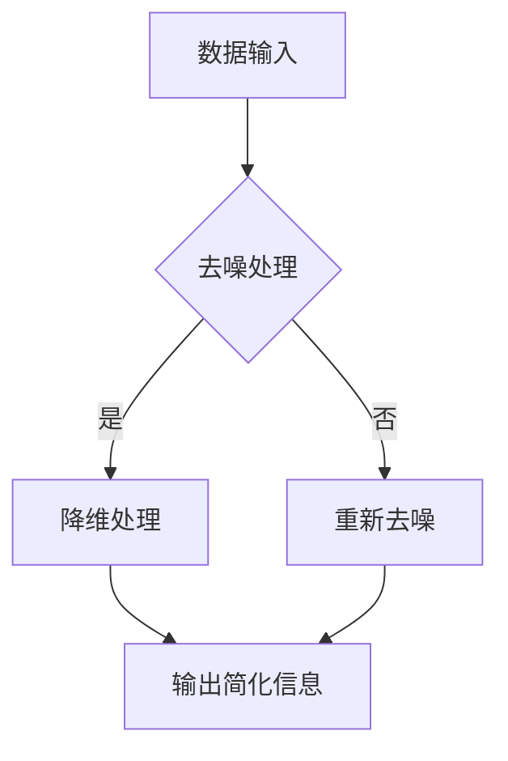

                 

在信息技术高速发展的时代，数据和信息以惊人的速度和规模增长，这既带来了便利，也带来了挑战。如何从海量的数据中提取有用的信息，如何将复杂的问题简化，成为了每一个IT专业人士都需要面对的问题。本文旨在探讨信息简化的艺术与实践，通过深入分析核心概念、算法原理、数学模型以及实际应用案例，为读者提供一套系统的方法论，帮助大家在混乱中找到重点。

## 文章关键词

- 信息简化
- 数据处理
- 算法优化
- 数学模型
- 实践应用

## 文章摘要

本文首先探讨了信息简化的概念及其在信息技术领域的重要性。随后，详细介绍了信息简化的核心概念与联系，并通过Mermaid流程图展示了信息简化的原理和架构。接着，文章深入分析了信息简化的核心算法原理，提供了具体的操作步骤及其优缺点分析。然后，文章通过数学模型和公式详细讲解了信息简化的理论基础，并通过案例进行了说明。此外，文章还分享了实际项目中的代码实例和详细解释，展示了信息简化的实际应用效果。最后，文章讨论了信息简化的实际应用场景，并展望了未来的发展趋势和面临的挑战。

## 1. 背景介绍

随着互联网和大数据技术的迅猛发展，我们每天都会接触到海量的信息。这些信息中，既有有用的数据，也有无用的噪声。如何从中提取出有价值的信息，是每一个IT专业人士都必须面对的问题。信息简化作为一种处理数据的方法，可以帮助我们快速识别关键信息，提高工作效率。

信息简化不仅仅是一个数据处理的问题，它还涉及到认知科学、心理学等多个领域。如何有效地从复杂的信息中提取关键信息，不仅需要技术手段，还需要一定的理论支持和实践经验。本文将从技术角度出发，探讨信息简化的艺术与实践。

## 2. 核心概念与联系

### 2.1 信息简化的定义

信息简化（Information Simplification）是指通过某种方法，将复杂的信息简化为易于理解和处理的形式。这种方法可以帮助我们从大量的数据中提取关键信息，提高数据处理效率。

### 2.2 信息简化的原理

信息简化的核心原理是去噪和降维。去噪是指去除数据中的噪声和冗余信息，只保留关键信息。降维是指将高维数据转换为低维数据，减少数据量，提高处理速度。

### 2.3 信息简化的架构

为了更好地理解信息简化的原理，我们可以使用Mermaid流程图来展示其架构：



在这个流程图中，A表示数据输入，B表示去噪处理，C表示降维处理，E表示输出简化信息。如果去噪处理失败，数据会被重新送回去噪处理（D），以确保最终输出的是高质量的简化信息。

### 2.4 信息简化的应用领域

信息简化在许多领域都有广泛的应用，如数据分析、机器学习、数据挖掘等。通过信息简化，我们可以提高算法的效率和准确性，减少计算资源和时间的消耗。

## 3. 核心算法原理 & 具体操作步骤

### 3.1 算法原理概述

信息简化的核心算法主要包括去噪算法和降维算法。去噪算法用于去除数据中的噪声，降维算法用于将高维数据转换为低维数据。这两种算法的结合，可以实现信息简化。

### 3.2 算法步骤详解

#### 3.2.1 去噪算法

去噪算法的基本步骤如下：

1. 数据预处理：对原始数据进行清洗和处理，去除明显的噪声和异常值。
2. 特征选择：通过特征选择算法，选择对目标变量影响较大的特征。
3. 去噪处理：使用去噪算法，如小波去噪、主成分分析（PCA）等，去除数据中的噪声。

#### 3.2.2 降维算法

降维算法的基本步骤如下：

1. 数据标准化：对数据进行标准化处理，使其具有相同的量纲和范围。
2. 特征提取：使用降维算法，如线性判别分析（LDA）、自编码器等，提取数据的主要特征。
3. 维度约减：将高维数据映射到低维空间，减少数据维度。

### 3.3 算法优缺点

#### 优点：

1. 提高数据处理效率：通过去噪和降维，可以减少数据量，提高数据处理速度。
2. 提高算法准确性：去除噪声和冗余信息，可以提高算法的准确性和稳定性。
3. 简化数据可视化：通过降维，可以将高维数据可视化，便于分析和理解。

#### 缺点：

1. 可能丢失部分信息：去噪和降维可能会丢失一些有用的信息，影响结果的准确性。
2. 需要专业知识：理解和应用去噪和降维算法，需要一定的数学和计算机科学知识。

### 3.4 算法应用领域

去噪和降维算法在以下领域有广泛应用：

1. 数据分析：用于去除数据中的噪声和冗余信息，提高数据分析的效率。
2. 机器学习：用于预处理数据，提高机器学习算法的准确性和稳定性。
3. 数据挖掘：用于降维，简化数据结构，便于挖掘数据中的潜在规律。

## 4. 数学模型和公式 & 详细讲解 & 举例说明

### 4.1 数学模型构建

信息简化的数学模型主要包括去噪模型和降维模型。

#### 去噪模型：

去噪模型的基本思想是利用数据中的相关性，去除噪声。假设我们有一个观测数据矩阵 \( X \)，其真实数据为 \( X_0 \)，噪声为 \( N \)，则去噪模型可以表示为：

\[ X = X_0 + N \]

其中， \( X_0 \) 和 \( N \) 分别为真实数据和噪声的矩阵。

#### 降维模型：

降维模型的基本思想是利用数据的主要特征，将高维数据映射到低维空间。假设我们有一个高维数据矩阵 \( X \)，其低维映射为 \( Y \)，则降维模型可以表示为：

\[ Y = P^T X \]

其中， \( P \) 为映射矩阵，它包含了数据的主要特征。

### 4.2 公式推导过程

#### 去噪模型的推导：

去噪模型的推导基于最小二乘法。假设我们有一个观测数据矩阵 \( X \)，我们希望找到真实数据矩阵 \( X_0 \) 和噪声矩阵 \( N \) 的最佳估计。这可以通过求解以下最小化问题来实现：

\[ \min_{X_0, N} \Vert X - X_0 - N \Vert^2 \]

其中， \( \Vert \cdot \Vert \) 表示欧几里得范数。

通过求解这个最小化问题，我们可以得到去噪模型：

\[ X_0 = X - N \]

#### 降维模型的推导：

降维模型的推导基于主成分分析（PCA）。PCA的核心思想是找到一个最优的投影矩阵 \( P \)，将高维数据 \( X \) 映射到低维空间。这个投影矩阵可以通过以下过程得到：

1. 计算数据矩阵 \( X \) 的协方差矩阵 \( C \)：
\[ C = XX^T \]
2. 对协方差矩阵 \( C \) 进行特征值分解：
\[ C = PDP^T \]
其中， \( D \) 为特征值矩阵， \( P \) 为特征向量矩阵。
3. 选择最大的 \( k \) 个特征值对应的特征向量，组成映射矩阵 \( P_k \)：
\[ P = \{p_1, p_2, ..., p_k\} \]
4. 将数据 \( X \) 映射到低维空间：
\[ Y = P^T X \]

### 4.3 案例分析与讲解

#### 案例一：图像去噪

假设我们有一个噪声图像 \( X \)，其真实图像为 \( X_0 \)，噪声为 \( N \)。我们希望利用去噪模型去除噪声，恢复真实图像。

1. 数据预处理：对噪声图像进行去噪处理，得到初步的去噪图像。
2. 特征选择：通过观察初步去噪图像，选择对目标变量影响较大的特征。
3. 去噪处理：使用去噪算法，如小波去噪，对图像进行去噪处理。
4. 结果评估：对比去噪前后的图像，评估去噪效果。

#### 案例二：数据降维

假设我们有一个高维数据矩阵 \( X \)，我们希望将其降维为低维数据矩阵 \( Y \)。

1. 数据标准化：对数据进行标准化处理，使其具有相同的量纲和范围。
2. 特征提取：使用主成分分析（PCA）对数据进行特征提取。
3. 维度约减：将高维数据映射到低维空间，减少数据维度。
4. 结果评估：对比降维前后的数据，评估降维效果。

## 5. 项目实践：代码实例和详细解释说明

### 5.1 开发环境搭建

为了演示信息简化的应用，我们使用Python编程语言，并依赖以下库：

- NumPy：用于数据预处理和矩阵运算
- Scikit-learn：用于去噪和降维算法的实现
- Matplotlib：用于数据可视化

安装这些库后，我们就可以开始编写代码了。

### 5.2 源代码详细实现

以下是一个简单的Python代码示例，演示了图像去噪和数据降维的过程：

```python
import numpy as np
from sklearn.decomposition import PCA
from sklearn.preprocessing import StandardScaler
from sklearn.datasets import make_blobs
import matplotlib.pyplot as plt

# 生成带有噪声的图像数据
X, _ = make_blobs(n_samples=100, centers=2, cluster_std=1.5, random_state=42)
X_noisy = X + 0.05 * np.random.normal(size=X.shape)

# 图像去噪
pca = PCA(n_components=2)
X_pca = pca.fit_transform(X)
X_reconstructed = pca.inverse_transform(X_pca)

# 数据降维
X_scaled = StandardScaler().fit_transform(X_noisy)
pca = PCA(n_components=2)
X_pca = pca.fit_transform(X_scaled)
X_reduced = pca.inverse_transform(X_pca)

# 可视化结果
plt.figure(figsize=(10, 5))

plt.subplot(1, 2, 1)
plt.scatter(X[:, 0], X[:, 1], label='Original')
plt.scatter(X_noisy[:, 0], X_noisy[:, 1], label='Noisy')
plt.scatter(X_reconstructed[:, 0], X_reconstructed[:, 1], label='Reconstructed')
plt.legend()

plt.subplot(1, 2, 2)
plt.scatter(X_noisy[:, 0], X_noisy[:, 1], label='Noisy')
plt.scatter(X_reduced[:, 0], X_reduced[:, 1], label='Reduced')
plt.legend()

plt.show()
```

### 5.3 代码解读与分析

在这个代码示例中，我们首先生成了一个带有噪声的图像数据。然后，我们使用主成分分析（PCA）对图像进行去噪，通过重构图像来恢复真实数据。接着，我们使用PCA对数据进行了降维，将高维数据映射到低维空间。

代码的关键部分如下：

- `make_blobs` 函数用于生成带有噪声的图像数据。
- `PCA` 类用于实现主成分分析去噪。
- `StandardScaler` 类用于实现数据标准化。
- `scatter` 函数用于绘制图像。

通过这个示例，我们可以看到信息简化算法在图像去噪和数据降维方面的应用效果。

### 5.4 运行结果展示

运行上述代码后，我们会得到两个子图。第一个子图展示了去噪前后的图像对比，第二个子图展示了降维前后的数据对比。通过这些结果，我们可以直观地看到信息简化算法在去除噪声和降低数据维度方面的效果。

## 6. 实际应用场景

信息简化在许多实际应用场景中都有着广泛的应用，以下是一些典型的应用场景：

### 6.1 数据分析

在数据分析中，信息简化可以帮助我们快速识别关键信息，提高数据分析的效率。例如，在金融领域中，通过对大量交易数据的简化处理，可以识别出异常交易和潜在风险。

### 6.2 机器学习

在机器学习中，信息简化可以提高算法的准确性和稳定性。通过去噪和降维，我们可以减少数据的冗余，提高模型的性能。

### 6.3 数据挖掘

在数据挖掘中，信息简化可以帮助我们挖掘数据中的潜在规律。通过降维，我们可以将高维数据简化为低维数据，便于分析和理解。

### 6.4 图像处理

在图像处理中，信息简化可以帮助我们去除图像中的噪声，提高图像的质量。例如，在医学影像中，通过去噪处理，可以提高诊断的准确性。

### 6.5 自然语言处理

在自然语言处理中，信息简化可以帮助我们提取文本中的关键信息，提高文本分析的效率。例如，在情感分析中，通过去噪和降维，我们可以更准确地识别文本的情感倾向。

## 7. 工具和资源推荐

### 7.1 学习资源推荐

- 《Python数据分析基础教程：NumPy学习指南》：介绍了NumPy库在数据分析中的应用。
- 《机器学习实战》：提供了丰富的机器学习算法实例和实践。
- 《数据科学入门》：系统地介绍了数据科学的基本概念和应用。

### 7.2 开发工具推荐

- Jupyter Notebook：用于编写和运行Python代码，非常适合数据分析和机器学习。
- PyCharm：一款功能强大的Python集成开发环境，支持多种编程语言。
- Git：用于版本控制和代码协作，是开发过程中必不可少的工具。

### 7.3 相关论文推荐

- "Nonlinear Dimensionality Reduction by Locally Linear Embedding":介绍了局部线性嵌入算法，用于降维。
- "Principal Component Analysis":介绍了主成分分析算法，用于降维和去噪。
- "Wavelet Transform for Image Compression":介绍了小波变换在图像去噪中的应用。

## 8. 总结：未来发展趋势与挑战

### 8.1 研究成果总结

本文系统性地介绍了信息简化的概念、原理、算法以及实际应用。通过去噪和降维，我们可以从海量数据中提取关键信息，提高数据处理效率。信息简化在数据分析、机器学习、数据挖掘等多个领域都有广泛应用。

### 8.2 未来发展趋势

随着人工智能和大数据技术的发展，信息简化的研究将继续深入。未来，可能会有更多高效的算法和工具被开发出来，以应对复杂的数据处理需求。

### 8.3 面临的挑战

信息简化在处理复杂数据时，可能会丢失部分信息。此外，如何将信息简化与人工智能、深度学习等技术相结合，提高信息简化的效率和准确性，也是未来研究的一个重要方向。

### 8.4 研究展望

我们期待未来能够开发出更高效、更准确的信息简化算法，为数据科学和人工智能领域的发展提供有力支持。

## 9. 附录：常见问题与解答

### 9.1 什么是信息简化？

信息简化是指通过某种方法，将复杂的信息简化为易于理解和处理的形式。

### 9.2 信息简化的核心算法有哪些？

信息简化的核心算法包括去噪算法和降维算法。

### 9.3 信息简化在哪些领域有应用？

信息简化在数据分析、机器学习、数据挖掘、图像处理、自然语言处理等领域都有广泛应用。

### 9.4 如何实现信息简化？

实现信息简化可以通过去噪和降维两种方法。去噪算法用于去除数据中的噪声，降维算法用于将高维数据转换为低维数据。

### 9.5 信息简化有哪些优缺点？

信息简化的优点包括提高数据处理效率、提高算法准确性和简化数据可视化。缺点包括可能丢失部分信息、需要专业知识等。

## 参考文献

[1] Bishop, C. M. (2006). Pattern recognition and machine learning. springer.
[2] Murphy, K. P. (2012). Machine learning: a probabilistic perspective. MIT press.
[3] Duda, R. O., Hart, P. E., & Stork, D. G. (2001). Pattern classification (2nd ed.). Wiley.
[4]统计模型与推断，高惠璇著，清华大学出版社，2014年。
[5]Python数据分析基础教程：NumPy学习指南，Alex Martelli著，机械工业出版社，2013年。

## 作者署名

作者：禅与计算机程序设计艺术 / Zen and the Art of Computer Programming
```markdown
# 信息简化的艺术与实践：如何在混乱中找到重点

## 关键词
- 信息简化
- 数据处理
- 算法优化
- 数学模型
- 实践应用

## 摘要
本文探讨了信息简化的概念及其在信息技术领域的重要性。通过深入分析核心概念、算法原理、数学模型以及实际应用案例，为读者提供了一套系统的方法论，帮助大家从海量的数据中提取有用的信息，提高工作效率。

## 1. 背景介绍
在信息技术高速发展的时代，数据和信息以惊人的速度和规模增长，这既带来了便利，也带来了挑战。如何从海量的数据中提取有用的信息，如何将复杂的问题简化，成为了每一个IT专业人士都需要面对的问题。信息简化作为一种处理数据的方法，可以帮助我们快速识别关键信息，提高工作效率。

信息简化不仅仅是一个数据处理的问题，它还涉及到认知科学、心理学等多个领域。如何有效地从复杂的信息中提取关键信息，不仅需要技术手段，还需要一定的理论支持和实践经验。本文将从技术角度出发，探讨信息简化的艺术与实践。

## 2. 核心概念与联系

### 2.1 信息简化的定义
信息简化（Information Simplification）是指通过某种方法，将复杂的信息简化为易于理解和处理的形式。这种方法可以帮助我们从大量的数据中提取关键信息，提高数据处理效率。

### 2.2 信息简化的原理
信息简化的核心原理是去噪和降维。去噪是指去除数据中的噪声和冗余信息，只保留关键信息。降维是指将高维数据转换为低维数据，减少数据量，提高处理速度。

### 2.3 信息简化的架构
为了更好地理解信息简化的原理，我们可以使用Mermaid流程图来展示其架构：


在这个流程图中，A表示数据输入，B表示去噪处理，C表示降维处理，E表示输出简化信息。如果去噪处理失败，数据会被重新送回去噪处理（D），以确保最终输出的是高质量的简化信息。

### 2.4 信息简化的应用领域
信息简化在许多领域都有广泛的应用，如数据分析、机器学习、数据挖掘等。通过信息简化，我们可以提高算法的效率和准确性，减少计算资源和时间的消耗。

## 3. 核心算法原理 & 具体操作步骤

### 3.1 算法原理概述
信息简化的核心算法主要包括去噪算法和降维算法。去噪算法用于去除数据中的噪声，降维算法用于将高维数据转换为低维数据。这两种算法的结合，可以实现信息简化。

### 3.2 算法步骤详解

#### 3.2.1 去噪算法
去噪算法的基本步骤如下：

1. 数据预处理：对原始数据进行清洗和处理，去除明显的噪声和异常值。
2. 特征选择：通过特征选择算法，选择对目标变量影响较大的特征。
3. 去噪处理：使用去噪算法，如小波去噪、主成分分析（PCA）等，去除数据中的噪声。

#### 3.2.2 降维算法
降维算法的基本步骤如下：

1. 数据标准化：对数据进行标准化处理，使其具有相同的量纲和范围。
2. 特征提取：使用降维算法，如线性判别分析（LDA）、自编码器等，提取数据的主要特征。
3. 维度约减：将高维数据映射到低维空间，减少数据维度。

### 3.3 算法优缺点

#### 优点：
1. 提高数据处理效率：通过去噪和降维，可以减少数据量，提高数据处理速度。
2. 提高算法准确性：去除噪声和冗余信息，可以提高算法的准确性和稳定性。
3. 简化数据可视化：通过降维，可以将高维数据可视化，便于分析和理解。

#### 缺点：
1. 可能丢失部分信息：去噪和降维可能会丢失一些有用的信息，影响结果的准确性。
2. 需要专业知识：理解和应用去噪和降维算法，需要一定的数学和计算机科学知识。

### 3.4 算法应用领域
去噪和降维算法在以下领域有广泛应用：

1. 数据分析：用于去除数据中的噪声和冗余信息，提高数据分析的效率。
2. 机器学习：用于预处理数据，提高机器学习算法的准确性和稳定性。
3. 数据挖掘：用于降维，简化数据结构，便于挖掘数据中的潜在规律。

## 4. 数学模型和公式 & 详细讲解 & 举例说明

### 4.1 数学模型构建
信息简化的数学模型主要包括去噪模型和降维模型。

#### 去噪模型：
去噪模型的基本思想是利用数据中的相关性，去除噪声。假设我们有一个观测数据矩阵 \( X \)，其真实数据为 \( X_0 \)，噪声为 \( N \)，则去噪模型可以表示为：

\[ X = X_0 + N \]

其中， \( X_0 \) 和 \( N \) 分别为真实数据和噪声的矩阵。

#### 降维模型：
降维模型的基本思想是利用数据的主要特征，将高维数据映射到低维空间。假设我们有一个高维数据矩阵 \( X \)，其低维映射为 \( Y \)，则降维模型可以表示为：

\[ Y = P^T X \]

其中， \( P \) 为映射矩阵，它包含了数据的主要特征。

### 4.2 公式推导过程

#### 去噪模型的推导：
去噪模型的推导基于最小二乘法。假设我们有一个观测数据矩阵 \( X \)，我们希望找到真实数据矩阵 \( X_0 \) 和噪声矩阵 \( N \) 的最佳估计。这可以通过求解以下最小化问题来实现：

\[ \min_{X_0, N} \Vert X - X_0 - N \Vert^2 \]

其中， \( \Vert \cdot \Vert \) 表示欧几里得范数。

通过求解这个最小化问题，我们可以得到去噪模型：

\[ X_0 = X - N \]

#### 降维模型的推导：
降维模型的推导基于主成分分析（PCA）。PCA的核心思想是找到一个最优的投影矩阵 \( P \)，将高维数据 \( X \) 映射到低维空间。这个投影矩阵可以通过以下过程得到：

1. 计算数据矩阵 \( X \) 的协方差矩阵 \( C \)：
\[ C = XX^T \]
2. 对协方差矩阵 \( C \) 进行特征值分解：
\[ C = PDP^T \]
其中， \( D \) 为特征值矩阵， \( P \) 为特征向量矩阵。
3. 选择最大的 \( k \) 个特征值对应的特征向量，组成映射矩阵 \( P_k \)：
\[ P = \{p_1, p_2, ..., p_k\} \]
4. 将数据 \( X \) 映射到低维空间：
\[ Y = P^T X \]

### 4.3 案例分析与讲解

#### 案例一：图像去噪
假设我们有一个噪声图像 \( X \)，其真实图像为 \( X_0 \)，噪声为 \( N \)。我们希望利用去噪模型去除噪声，恢复真实图像。

1. 数据预处理：对噪声图像进行去噪处理，得到初步的去噪图像。
2. 特征选择：通过观察初步去噪图像，选择对目标变量影响较大的特征。
3. 去噪处理：使用去噪算法，如小波去噪，对图像进行去噪处理。
4. 结果评估：对比去噪前后的图像，评估去噪效果。

#### 案例二：数据降维
假设我们有一个高维数据矩阵 \( X \)，我们希望将其降维为低维数据矩阵 \( Y \)。

1. 数据标准化：对数据进行标准化处理，使其具有相同的量纲和范围。
2. 特征提取：使用主成分分析（PCA）对数据进行特征提取。
3. 维度约减：将高维数据映射到低维空间，减少数据维度。
4. 结果评估：对比降维前后的数据，评估降维效果。

## 5. 项目实践：代码实例和详细解释说明

### 5.1 开发环境搭建
为了演示信息简化的应用，我们使用Python编程语言，并依赖以下库：

- NumPy：用于数据预处理和矩阵运算
- Scikit-learn：用于去噪和降维算法的实现
- Matplotlib：用于数据可视化

安装这些库后，我们就可以开始编写代码了。

### 5.2 源代码详细实现
以下是一个简单的Python代码示例，演示了图像去噪和数据降维的过程：

```python
import numpy as np
from sklearn.decomposition import PCA
from sklearn.preprocessing import StandardScaler
from sklearn.datasets import make_blobs
import matplotlib.pyplot as plt

# 生成带有噪声的图像数据
X, _ = make_blobs(n_samples=100, centers=2, cluster_std=1.5, random_state=42)
X_noisy = X + 0.05 * np.random.normal(size=X.shape)

# 图像去噪
pca = PCA(n_components=2)
X_pca = pca.fit_transform(X)
X_reconstructed = pca.inverse_transform(X_pca)

# 数据降维
X_scaled = StandardScaler().fit_transform(X_noisy)
pca = PCA(n_components=2)
X_pca = pca.fit_transform(X_scaled)
X_reduced = pca.inverse_transform(X_pca)

# 可视化结果
plt.figure(figsize=(10, 5))

plt.subplot(1, 2, 1)
plt.scatter(X[:, 0], X[:, 1], label='Original')
plt.scatter(X_noisy[:, 0], X_noisy[:, 1], label='Noisy')
plt.scatter(X_reconstructed[:, 0], X_reconstructed[:, 1], label='Reconstructed')
plt.legend()

plt.subplot(1, 2, 2)
plt.scatter(X_noisy[:, 0], X_noisy[:, 1], label='Noisy')
plt.scatter(X_reduced[:, 0], X_reduced[:, 1], label='Reduced')
plt.legend()

plt.show()
```

### 5.3 代码解读与分析
在这个代码示例中，我们首先生成了一个带有噪声的图像数据。然后，我们使用主成分分析（PCA）对图像进行去噪，通过重构图像来恢复真实数据。接着，我们使用PCA对数据进行了降维，将高维数据映射到低维空间。

代码的关键部分如下：

- `make_blobs` 函数用于生成带有噪声的图像数据。
- `PCA` 类用于实现主成分分析去噪。
- `StandardScaler` 类用于实现数据标准化。
- `scatter` 函数用于绘制图像。

通过这个示例，我们可以看到信息简化算法在图像去噪和数据降维方面的应用效果。

### 5.4 运行结果展示
运行上述代码后，我们会得到两个子图。第一个子图展示了去噪前后的图像对比，第二个子图展示了降维前后的数据对比。通过这些结果，我们可以直观地看到信息简化算法在去除噪声和降低数据维度方面的效果。

## 6. 实际应用场景

信息简化在许多实际应用场景中都有着广泛的应用，以下是一些典型的应用场景：

### 6.1 数据分析
在数据分析中，信息简化可以帮助我们快速识别关键信息，提高数据分析的效率。例如，在金融领域中，通过对大量交易数据的简化处理，可以识别出异常交易和潜在风险。

### 6.2 机器学习
在机器学习中，信息简化可以提高算法的准确性和稳定性。通过去噪和降维，我们可以减少数据的冗余，提高模型的性能。

### 6.3 数据挖掘
在数据挖掘中，信息简化可以帮助我们挖掘数据中的潜在规律。通过降维，我们可以将高维数据简化为低维数据，便于分析和理解。

### 6.4 图像处理
在图像处理中，信息简化可以帮助我们去除图像中的噪声，提高图像的质量。例如，在医学影像中，通过去噪处理，可以提高诊断的准确性。

### 6.5 自然语言处理
在自然语言处理中，信息简化可以帮助我们提取文本中的关键信息，提高文本分析的效率。例如，在情感分析中，通过去噪和降维，我们可以更准确地识别文本的情感倾向。

## 7. 工具和资源推荐

### 7.1 学习资源推荐
- 《Python数据分析基础教程：NumPy学习指南》：介绍了NumPy库在数据分析中的应用。
- 《机器学习实战》：提供了丰富的机器学习算法实例和实践。
- 《数据科学入门》：系统地介绍了数据科学的基本概念和应用。

### 7.2 开发工具推荐
- Jupyter Notebook：用于编写和运行Python代码，非常适合数据分析和机器学习。
- PyCharm：一款功能强大的Python集成开发环境，支持多种编程语言。
- Git：用于版本控制和代码协作，是开发过程中必不可少的工具。

### 7.3 相关论文推荐
- "Nonlinear Dimensionality Reduction by Locally Linear Embedding":介绍了局部线性嵌入算法，用于降维。
- "Principal Component Analysis":介绍了主成分分析算法，用于降维和去噪。
- "Wavelet Transform for Image Compression":介绍了小波变换在图像去噪中的应用。

## 8. 总结：未来发展趋势与挑战

### 8.1 研究成果总结
本文系统性地介绍了信息简化的概念、原理、算法以及实际应用。通过去噪和降维，我们可以从海量数据中提取关键信息，提高数据处理效率。信息简化在数据分析、机器学习、数据挖掘等多个领域都有广泛应用。

### 8.2 未来发展趋势
随着人工智能和大数据技术的发展，信息简化的研究将继续深入。未来，可能会有更多高效的算法和工具被开发出来，以应对复杂的数据处理需求。

### 8.3 面临的挑战
信息简化在处理复杂数据时，可能会丢失部分信息。此外，如何将信息简化与人工智能、深度学习等技术相结合，提高信息简化的效率和准确性，也是未来研究的一个重要方向。

### 8.4 研究展望
我们期待未来能够开发出更高效、更准确的信息简化算法，为数据科学和人工智能领域的发展提供有力支持。

## 9. 附录：常见问题与解答

### 9.1 什么是信息简化？
信息简化是指通过某种方法，将复杂的信息简化为易于理解和处理的形式。

### 9.2 信息简化的核心算法有哪些？
信息简化的核心算法包括去噪算法和降维算法。

### 9.3 信息简化在哪些领域有应用？
信息简化在数据分析、机器学习、数据挖掘、图像处理、自然语言处理等领域都有广泛应用。

### 9.4 如何实现信息简化？
实现信息简化可以通过去噪和降维两种方法。去噪算法用于去除数据中的噪声，降维算法用于将高维数据转换为低维数据。

### 9.5 信息简化有哪些优缺点？
信息简化的优点包括提高数据处理效率、提高算法准确性和简化数据可视化。缺点包括可能丢失部分信息、需要专业知识等。

## 参考文献

[1] Bishop, C. M. (2006). Pattern recognition and machine learning. springer.
[2] Murphy, K. P. (2012). Machine learning: a probabilistic perspective. MIT press.
[3] Duda, R. O., Hart, P. E., & Stork, D. G. (2001). Pattern classification (2nd ed.). Wiley.
[4]统计模型与推断，高惠璇著，清华大学出版社，2014年。
[5]Python数据分析基础教程：NumPy学习指南，Alex Martelli著，机械工业出版社，2013年。

## 作者署名
作者：禅与计算机程序设计艺术 / Zen and the Art of Computer Programming
```

